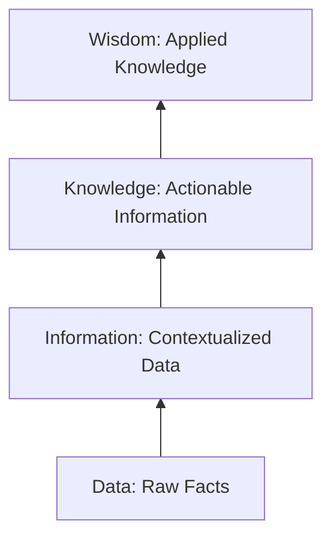
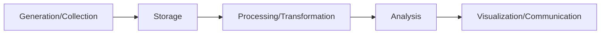
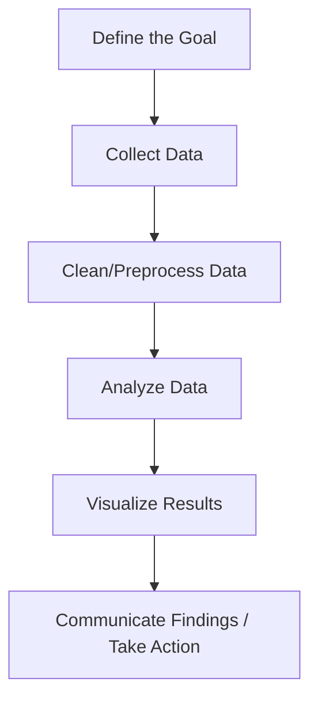
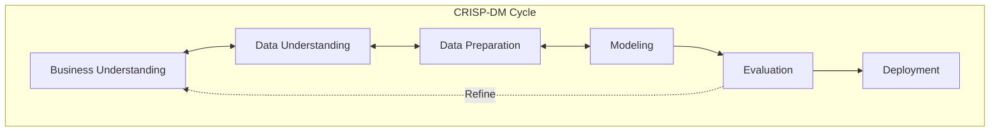

<Complete DAV Notes: Chapter 1 — Introduction to DAV>
> **Course:** Data Analysis and Visualisation (3CS103ME24)
> **Programme:** B.Tech (CSE), Integrated B.Tech (CSE)- MBA, and B.Tech (Interdisciplinary Minor in Data Science), Batch 2026-27, Term/Semester: 5th
> **Faculty:** Dr Vrajesh Chawra (Course Coordinator), Dr Jaiprakash Verma, Dr. Preeti Kathiria, Dr. Shivani Pandya, Dr Jigna Patel
> **Primary Sources:** `1.Introduction to DAV.pdf`, `ch1_text.txt`
</Complete DAV Notes: Chapter 1 — Introduction to DAV>

# Chapter 1 — Introduction to DAV

## 1. Course Overview and Syllabus

### Course Outcomes
1. Demonstrate data characteristics using visualisation tools (BL2)
2. Identify common data types and corresponding analysis approaches (BL3)
3. Analyse the data using various statistical tools (BL4)
4. Build data visualisation system for interdisciplinary problems (BL6)

[Source: ch1_text.txt, Slide 3]

---

### Examination Scheme
| Component | Exam Duration | Weightage |
| :--- | :--- | :--- |
| **Continuous Evaluation (CE)** | Continuous Evaluation | $0.3$ |
| **Semester End Exam (SEE)** | 3 Hrs | $0.4$ |
| **Laboratory/Practical Work (LPW)** | Continuous Evaluation + 2 hrs Semester End LPW Exam | $0.3$ |

[Source: ch1_text.txt, Slide 6]

---

### Detailed Syllabus
| Unit | Syllabus Content | Teaching Hours |
| :--- | :--- | :--- |
| **Unit-I** | **Introduction:** Data Understanding types of data, information and uncertainty, classes and attributes, interactions among attributes, relative distributions, summary statistics. **Data Quality:** inaccurate data, sparse data, missing data, insufficient data, imbalanced data | $10$ |
| **Unit-II** | Definition, Purpose, Usage, **Business Data Visualization:** Features of Business Data, Different Visualization fields. Forms of Business Data Visualization. **Social Challenges:** data ownership, data security, ethics and privacy | $10$ |
| **Unit-III** | **The Data:** Data Examination, Data Visualization Patterns, the Categories of Data Visualization. **Data Visualization:** using different tools - refine data and create, edit, alter, and display their visualizations (x-y graph, bar chart, pie chart, cube etc) | $10$ |
| **Unit-IV** | **Data Reduction and Feature Enhancement:** standardizing data, sampling data, using principal components to eliminate attributes, limitations and pitfalls of principal component analysis (PCA), curse of dimensionality | $10$ |
| **Unit-V** | **Showing Complex Data:** Organizational Models, Preattentive Variables, Sorting and Rearranging, Searching and Filtering, Datatips, Data Spotlight, Dynamic Queries, Data Brushing, Local Zooming, Sortable Table, Radial Table, Muti-Y Graphs, Treemap, Small Multiples | $5$ |

**Self-study:** Showing Complex Data

[Source: ch1_text.txt, Slide 4]

---

### Laboratory Practical Sessions
| Phase | Practical Title | Hours | CLO |
| :--- | :--- | :--- | :--- |
| **Phase-1: Data Understanding** | 1. Study domains (Retail, Healthcare, etc.). Identify applications, dataset, importance, challenges. | $04$ | 1 |
| | 2. Dataset characteristics, python visualization, insights, data cleaning using pandas. | $02$ | 2 |
| **Phase-2: Summary Statistics** | 3. Five Number Summary, mode, midrange, outlier detection (Quartile method). | $02$ | 1 |
| **Phase-3: Business Data Visualization** | 4. Tableau installation, configuration, features. | $02$ | 3 |
| | 5. Case Study: Interactive Dashboard for KPI using Tableau. | $02$ | 2 |
| **Phase-4: Data Quality (Preprocessing)** | 6. Smoothing, normalization, redundancy analysis (Pearson, Chi-Square), Discretization. | $04$ | 1 |
| | 7. Data Reduction & Feature Enhancement: Dimensionality reduction, Feature selection. | $04$ | 1 |
| **Phase-5: Data Analysis & Visualization** | 8. Classification Techniques & visualization. | $04$ | 3 |
| | 9. Clustering Techniques & visualization. | $02$ | 3 |
| | 10. Regression techniques & Tableau visualization. | $04$ | 3 |

[Source: ch1_text.txt, Slides 8-12]

---

### References
1. Jack G. Zheng, “Data Visualization for Business Intelligence”
2. Jiahei Han & Micheline Kamber, *Data Mining Concepts and Techniques*, Morgan Kaufmann
3. Jenifer Tidwell, *Designing Interfaces*, 2nd Edition, O’reilly Media
4. Edward Tufte, *The visual Display of Quantitative Information*, 2nd Edition, Graphics Press
5. Ben Fry, *Visualizing Data*, O’reilly Media
6. Noab Iliinsky, Julie Steele, *Designing Data Visualization*, O’reilly Media
7. Pang-Ning Tan, Michael Steinbach, Vipin Kumar, *Introduction to Data Mining*, Pearson
8. Wes McKinney, *Python for Data Analysis*, O’reilly
9. S. Nagabhushana, *Data Warehousing OLAP and Data Mining*, New Age publishers

[Source: ch1_text.txt, Slide 5]

---

## 2. Chapter Overview
This chapter introduces the fundamental concepts of Data Analysis and Visualisation (DAV). It covers the definitions of data, the data lifecycle, types of data, quantitative vs qualitative analysis, and the end-to-end data analysis process. It explores Big Data (5 V's), the DIKW model, process models (CRISP-DM and KDD), analytics types (descriptive, diagnostic, predictive, prescriptive), visualization techniques, standard software tools/libraries, open data sources, and industry case studies.

[Source: ch1_text.txt, Slides 1-44; 1.Introduction to DAV.pdf]

---

## 3. Fundamental Concepts: The DIKW Hierarchy & Data Life Cycle

The **DIKW Model** describes the transformation of raw facts into strategic actions:
$$
\text{Data} \longrightarrow \text{Information} \longrightarrow \text{Knowledge} \longrightarrow \text{Wisdom}
$$

### Data Life Cycle
The data lifecycle represents the sequence of stages that data goes through from its initial generation to its final visualization and analysis. 

[Source: 1.Introduction to DAV.pdf, Slide 15; ch1_text.txt, Slide 15]

---

## 4. Definitions

### Definition: Data
**Meaning:** Raw, unprocessed facts, figures, and symbols without context.
**Formal definition:** Raw facts or figures without any context. It can be numbers, words, measurements, observations, or even just symbols.
**Intuition:** Before processing, data is just raw material waiting to be evaluated.
**Example:** Sensor readings: $38, 39, 40$.

### Definition: Information
**Meaning:** Data that is structured and given meaning.
**Formal definition:** Data organized and structured to answer "who", "what", "where", and "when".
**Intuition:** After analysis, data becomes information or knowledge because context is added.
**Example:** The readings $38^\circ\text{C}, 39^\circ\text{C}, 40^\circ\text{C}$ represent daily peak temperatures in July.

### Definition: Knowledge
**Meaning:** The synthesis of information.
**Formal definition:** Synthesized information revealing patterns and answering "how".
**Intuition:** The ability to find actionable trends within the information.
**Example:** Understanding that temperatures above $35^\circ\text{C}$ trigger a $40\%$ surge in air conditioner purchases.

### Definition: Wisdom
**Meaning:** The application of knowledge.
**Formal definition:** Evaluated knowledge incorporating judgment to answer "why" and guide strategy.
**Intuition:** Making a strategic business decision based on the generated knowledge.
**Example:** Pre-emptively increasing regional warehouse inventory of air conditioners in May.

### Definition: Data Analysis
**Meaning:** Asking questions of the data to find actionable insights.
**Formal definition:** The process of making sense of the data. Analysis means asking questions to the data and finding answers.
**Intuition:** Extracting useful signals from collected records to aid decision-making.
**Example:** For a small online shop, analyzing what products people bought, when they bought them, and how much they paid to determine if discounts should be offered on weekends.

### Definition: Data Visualisation
**Meaning:** Creating visual artifacts of data.
**Formal definition:** Turning numbers into visuals, like graphs, charts, and dashboards, so people can understand the story behind the data quickly and easily.
**Intuition:** Because human brains process images faster than raw text or tables, charts can show trends or problems at a glance without reading rows of numbers.
**Example:** A pie chart showing how sales are split between regions, or a line graph showing revenue changes over time.

[Source: ch1_text.txt, Slides 14, 18, 24]

---

## 5. Types of Data & Formats

### Categories of Data
| Type | Example | Use |
| :--- | :--- | :--- |
| **Structured Data** | Tables, Excel files, SQL databases | Easy to analyze |
| **Unstructured Data** | Emails, images, videos, social media | Needs preprocessing |
| **Semi-structured Data** | JSON, XML | Has some structure |
| **Quantitative Data** | Numbers (e.g., age, income) | Statistical analysis |
| **Qualitative Data** | Categories (e.g., gender, feedback) | Pattern recognition |

[Source: ch1_text.txt, Slide 16]

---

### Quantitative vs. Qualitative Analysis

| Feature | Quantitative | Qualitative |
| :--- | :--- | :--- |
| **Nature** | Numerical | Descriptive |
| **Measurability** | Can be measured | Cannot be measured directly |
| **Examples** | Age, Salary, Height | Gender, Color, Department, Feedback |

[Source: ch1_text.txt, Slide 17]

---

### Data Representation Formats: Ungrouped vs Grouped
Data in DAV projects is encountered in two primary structural representations:

1. **Ungrouped (Raw) Data:** Individual raw observations listed directly.
   - Example: $X = \{12, 15, 15, 18, 20, 22, 25, 25, 25, 30\}$
2. **Grouped (Class Table) Data:** Aggregated observations into continuous class intervals with frequencies.
   - Example:

| Class Interval (CI) | Class Midpoint ($x_i$) | Frequency ($f_i$) | Cumulative Frequency ($CF$) |
| :---: | :---: | :---: | :---: |
| $10 - 15$ | $12.5$ | $2$ | $2$ |
| $15 - 20$ | $17.5$ | $2$ | $4$ |
| $20 - 25$ | $22.5$ | $3$ | $7$ |
| $25 - 30$ | $27.5$ | $3$ | $10$ |
| **Total** | — | $N = \sum f_i = 10$ | — |

[Source: 1.Introduction to DAV.pdf, Slide 16]

---

## 6. The Data Analysis Process

Data analysis is a structured process to make sense of information. 

### Big Data and Frameworks

#### The 5 V's of Big Data
1. **Volume:** Scale of data (Gigabytes to Zettabytes).
2. **Velocity:** Speed of generation and streaming ingestion.
3. **Variety:** Structural diversity (Structured, Semi-structured, Unstructured).
4. **Veracity:** Data quality, noise, and trustworthiness.
5. **Value:** Actionable business utility derived from analysis.

#### Process Pipelines: CRISP-DM vs KDD

| Framework | Core Focus | Primary Steps |
| :--- | :--- | :--- |
| **CRISP-DM** | Business-oriented data mining cycle | Business Understanding $\rightarrow$ Data Understanding $\rightarrow$ Data Prep $\rightarrow$ Modeling $\rightarrow$ Evaluation $\rightarrow$ Deployment |
| **KDD Process** | Technical knowledge discovery in databases | Selection $\rightarrow$ Preprocessing $\rightarrow$ Transformation $\rightarrow$ Data Mining $\rightarrow$ Interpretation/Evaluation |

[Source: ch1_text.txt, Slides 19-22; 1.Introduction to DAV.pdf]

---

## 7. Analytics Types

### Comparison of Analytics Types

| Type | Question | Primary Techniques | Example |
| :--- | :--- | :--- | :--- |
| **Descriptive** | What happened? | Summaries, Aggregations, Mean/Median | Monthly sales report |
| **Diagnostic** | Why did it happen? | Drill-downs, Correlation, Root Cause | Investigating a regional sales drop |
| **Predictive** | What will happen? | Regression, Time-series, ML | Sales forecast for Q4 |
| **Prescriptive** | What should we do? | Optimization, Monte Carlo, Rules | Automated inventory reordering |

[Source: ch1_text.txt, Slide 23; 1.Introduction to DAV.pdf]

---

## 8. Data Transformation & Visualisation

> "Visualization provides a unique perspective on the dataset. Visualization is critical to data analysis. It provides a front line of attack, revealing intricate structure in data that cannot be absorbed in any other way. We discover unimagined effects, and we challenge imagined ones." 
> — **William S. Cleveland**, *Visualizing Data*

### Data Transformation
Data transformation is the process of converting data or information from one format to another, usually from the format of a source system into the required format of a new destination system. 

It can be divided into two steps:
1. **Data mapping:** Maps data elements from the source data system to the destination data system and captures any transformation that must occur.
2. **Code generation:** Creates the actual transformation program.

### How to Visualize Data
Depending on the goal, different visual components are used:
- **Tables:** Very powerful when dealing with a relatively small number of data points.
- **Charts:** Allow mapping dimensions in data to visual properties of geometric shapes (e.g., Bar charts, Pie charts).
- **Maps:** The power of maps is to re-connect the data to our physical world.
- **Graphs:** Used for showing inter-connections (edges) between data points (nodes).

[Source: ch1_text.txt, Slides 24-29]

---

## 9. Tools & Ecosystem

| Tool Category | Examples | Strengths/Usage |
| :--- | :--- | :--- |
| **Spreadsheets** | LibreOffice, Excel, Google Docs | Basic tabular data manipulation and quick charts. |
| **Statistical Programming Frameworks** | R (r-project.org), Pandas (pandas.pydata.org), STATA, SPSS | High performance data analysis, cleaning, ETL, EDA. |
| **Geographic Information Systems (GIS)** | Quantum GIS, ArcGIS, GRASS | Spatial mapping and geographic analysis. |
| **Visualization Libraries** | d3.js, Prefuse, Flare, Matplotlib, Seaborn, Plotly, ggplot2 | Custom, interactive, web-ready or statistical graphics. |
| **Data Wrangling Tools** | Google Refine, Datawrangler | Specific tools for cleaning unstructured data. |
| **Non-Programming Visualization / Enterprise BI** | ManyEyes, Tableau Public, Power BI | Drag-and-drop UI, rapid interactive dashboarding. |

[Source: ch1_text.txt, Slide 30]

---

## 10. Industry Applications & Case Studies

Data visualization and analysis assist almost every company or sector that aims to grow by giving them the vision to increase customer satisfaction.

| Industry | Use Case / Benefit |
| :--- | :--- |
| **Healthcare** | Hospitals use visualizations to track patient wait times and identify bottlenecks in the emergency department, allowing for better resource allocation. |
| **Marketing** | Marketers visualize data from social media and website analytics to analyze campaign performance, understand consumer behavior/preferences, and identify trends. |
| **Finance** | Professionals interpret complex financial data quickly. Investment firms use interactive charts to visualize stock prices or compare portfolios to spot anomalies impacting decisions. |
| **Manufacturing** | Empowers manufacturers to optimize operations by monitoring KPIs. Visual metrics on throughput or defect rates help identify inefficiencies promptly. |
| **Technology** | In cybersecurity, visualizations allow analysts to detect patterns in network traffic efficiently and respond swiftly to potential threats. |

[Source: ch1_text.txt, Slide 31, 43]

---

## 11. Open Data Sources

Researchers and practitioners can leverage various public datasets for learning and analysis:
- **Google Trends** (Curated by Google): E.g., "Cupcake" search results.
- **National Climatic Data Center** (Curated by NCEI / NOAA): E.g., Local Climatological Data.
- **Global Health Observatory data** (Curated by WHO): E.g., Universal access to reproductive health.
- **Data.gov.sg** (Curated by Singaporean government): E.g., Resident demographics.
- **Earthdata** (Curated by NASA): E.g., Atmospheric Electricity (Lightning).
- **Amazon Web Services Open Data Registry** (Curated by Amazon): E.g., 1000 Genomes Project.

[Source: ch1_text.txt, Slide 42]

---

## 12. Edge Cases & Practical Considerations

| Scenario / Edge Case | Risk / Problem | Mitigation Strategy |
| :--- | :--- | :--- |
| **Zero Variance Feature** | Constant value column adds zero predictive signal | Drop feature before modeling |
| **High Class Imbalance** | Predictive models ignore minority class | Resampling (SMOTE) or adjusted loss weights |
| **Open-Ended Class Intervals** | Grouped table with "$>50$" or "$<10$" lacks exact midpoint | Estimate boundary using domain knowledge or adjacent step size |
| **Conflicting Source Schema** | Different column names/units across integrated datasets | Standardization and explicit unit mapping |

[Source: 1.Introduction to DAV.pdf]

---

## Formula Sheet

### 1. Data Aggregation Formula (Ungrouped Mean)

#### Formula:
$$
\bar{x} = \frac{1}{n} \sum_{i=1}^{n} x_i
$$

#### Where:
- $\bar{x}$ = Sample Mean
- $n$ = Total number of observations in the dataset
- $x_i$ = $i$-th individual observation

#### Meaning:
Computes the arithmetic average of a discrete set of unweighted, raw observations.

---

### 2. Data Aggregation Formula (Grouped Class Table Mean)

#### Formula:
$$
\bar{x} = \frac{\sum_{i=1}^{k} f_i x_i}{N} \quad \text{where } N = \sum_{i=1}^{k} f_i
$$

#### Where:
- $\bar{x}$ = Estimated Mean for grouped data
- $k$ = Total number of class intervals
- $f_i$ = Frequency of the $i$-th class interval
- $x_i$ = Midpoint of the $i$-th class interval, calculated as $\frac{\text{Lower Limit} + \text{Upper Limit}}{2}$
- $N$ = Total frequency across all classes

#### Meaning:
Estimates the central location of grouped data when individual values are unknown, assuming observations are evenly distributed within each class interval.

---

## Definition Sheet

- **Data:** Raw, unprocessed facts, figures, and symbols without context.
- **Information:** Data organized and structured to answer who, what, where, and when.
- **Knowledge:** Synthesized information revealing patterns and answering how.
- **Wisdom:** Evaluated knowledge incorporating judgment to answer why and guide strategy.
- **Data Analysis:** Process of making sense of data by asking questions and finding answers.
- **Data Visualisation:** Turning numbers into visual representations to clearly communicate findings.
- **Descriptive Analytics:** Summarizing historical observations (What happened?).
- **Diagnostic Analytics:** Determining causes of past events (Why did it happen?).
- **Predictive Analytics:** Forecasting future outcomes (What will happen?).
- **Prescriptive Analytics:** Optimizing actions based on predictive outcomes (What should we do?).
- **CRISP-DM:** Standardized 6-phase data mining lifecycle.
- **Data Transformation:** Converting data from a source format to a required destination format via mapping and code generation.

---

## Exam-Oriented Review

### Key Questions & Model Answers

**Q1: Contrast Descriptive Analytics and Prescriptive Analytics with examples.**
**A:**
- **Descriptive Analytics** focuses on summarizing historical data to answer *"What happened?"*. It uses summary statistics, aggregations, and standard reporting tools. Example: A retail store generating a report showing that total sales revenue last month was $\$50,000$.
- **Prescriptive Analytics** goes beyond prediction to suggest optimal courses of action to answer *"What should we do?"*. It uses mathematical optimization, simulation, and decision rules. Example: An automated inventory system recommending the exact reorder quantity of 200 units for Product X now to maximize profit and prevent stockouts.

**Q2: What is the difference between Quantitative and Qualitative data? Provide two examples of each.**
**A:**
- **Quantitative Data** consists of numerical values that can be measured or counted objectively.
  - *Examples:* Student GPA ($3.8$), Monthly Income ($\$4,500$).
- **Qualitative Data** consists of non-numerical categorical descriptions that classify attributes based on traits or qualities.
  - *Examples:* Customer Feedback ("Excellent"), T-shirt size ("Medium").

**Q3: How does raw ungrouped data differ from grouped class table data? Given raw values $\{12, 14, 15, 18, 22, 24\}$, calculate the mean using both raw form and a grouped frequency table with intervals $10-20$ and $20-30$.**
**A:**
- *Difference:* Raw ungrouped data retains every single exact observation. Grouped class table data aggregates individual values into continuous range intervals with frequency counts $f_i$, replacing individual points with class midpoints $x_i$.
- *Calculation:*
  1. **Ungrouped Mean:**
     $$
     \bar{x} = \frac{12 + 14 + 15 + 18 + 22 + 24}{6} = \frac{105}{6} = 17.5
     $$
  2. **Grouped Class Table Mean:**
     - Interval $10-20$: Midpoint $x_1 = 15$, Frequency $f_1 = 4$ (values: $12, 14, 15, 18$)
     - Interval $20-30$: Midpoint $x_2 = 25$, Frequency $f_2 = 2$ (values: $22, 24$)
     $$
     \bar{x}_{\text{grouped}} = \frac{(4 \times 15) + (2 \times 25)}{4 + 2} = \frac{60 + 50}{6} = \frac{110}{6} \approx 18.33
     $$

**Q4: List and briefly explain the 6 phases of the CRISP-DM model.**
**A:**
1. **Business Understanding:** Define project objectives and requirements from a business perspective.
2. **Data Understanding:** Collect, explore, and verify data quality to identify initial insights.
3. **Data Preparation:** Clean, construct, integrate, and format datasets for modeling.
4. **Modeling:** Select and apply various modeling techniques (e.g., regression, classification).
5. **Evaluation:** Thoroughly assess models to ensure they meet business goals.
6. **Deployment:** Integrate models into operational environments for ongoing decision-making.

**Q5: Explain the two steps of Data Transformation.**
**A:**
1. **Data mapping:** The process of mapping data elements from the source schema to the target schema, defining rules for data transformation.
2. **Code generation:** Creating the executable transformation software program or query that carries out the defined mapping logic.

---

## Source map

| Section / Topic | Source Document & References |
| :--- | :--- |
| **Course Overview & Syllabus** | `ch1_text.txt`, Slides 3–12 |
| **DIKW Hierarchy & Data Life Cycle** | `1.Introduction to DAV.pdf`, Slide 15; `ch1_text.txt`, Slide 15 |
| **Definitions (Data, Info, Knowledge, Wisdom, Analysis, Visualization)** | `ch1_text.txt`, Slides 14, 18, 24 |
| **Data Types & Formats (Ungrouped vs Grouped)** | `1.Introduction to DAV.pdf`, Slide 16; `ch1_text.txt`, Slides 16–17 |
| **Data Analysis Process & Big Data 5 V's & CRISP-DM / KDD** | `ch1_text.txt`, Slides 19–22; `1.Introduction to DAV.pdf` |
| **Analytics Types (Descriptive, Diagnostic, Predictive, Prescriptive)** | `ch1_text.txt`, Slide 23; `1.Introduction to DAV.pdf` |
| **Data Transformation & Visualisation Techniques** | `ch1_text.txt`, Slides 24–29 |
| **Tools Ecosystem & Industry Applications** | `ch1_text.txt`, Slides 30–31, 42–43 |
