<Complete DAV Notes: Introduction to DAV>
> **Course:** Data Analysis and Visualization
> **Primary Source:** 1.Introduction to DAV.pdf
> **Files Integrated:** `1.Introduction to DAV.pdf`

# Chapter 1 — Introduction to DAV

## 1. Chapter Overview
This chapter introduces the fundamental concepts of Data Analysis and Visualisation (DAV). It covers the definitions of data, the data lifecycle, types of data, the distinction between quantitative and qualitative analysis, and the end-to-end data analysis process. Furthermore, it explores various types of data analysis, the importance of data visualization, and introduces several tools and libraries used in the field. To provide a comprehensive foundation, this chapter also delves into the DIKW hierarchy, Big Data characteristics, the KDD and CRISP-DM frameworks, and a deeper exploration of analytics types and visualization techniques.
[Source: 1.Introduction to DAV.pdf, Slide 1-44]

---

## 2. Fundamental Concepts: The DIKW Hierarchy

Before performing any complex analysis, it is crucial to understand the progression of data into actionable insights. This is formally known as the **DIKW Model** (Data $\rightarrow$ Information $\rightarrow$ Knowledge $\rightarrow$ Wisdom).

### The DIKW Model Progression

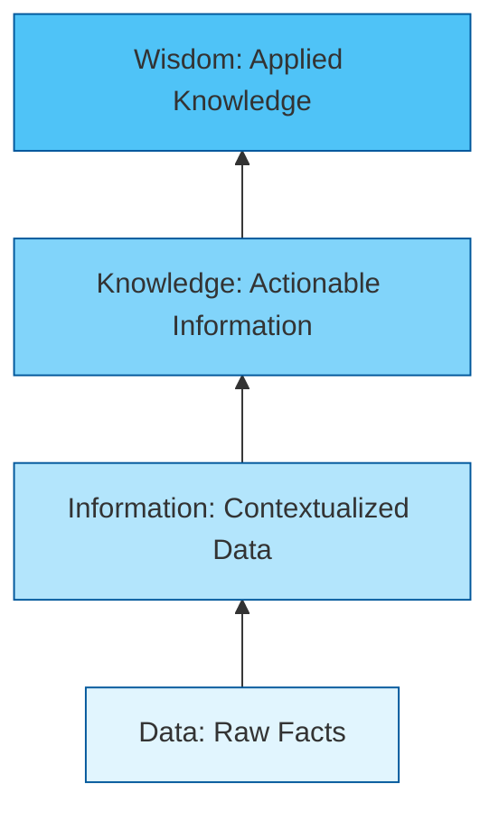

### Definition: Data
**Meaning:** Raw, unprocessed facts, figures, and symbols without any context.
**Formal definition:** A collection of discrete values that convey quantity, quality, fact, or statistics before any analytical processing is applied.
**Intuition:** The basic building blocks (like raw materials). Without context, it has no intrinsic meaning.
**Example:** The numbers $38, 39, 40$ recorded by a sensor.

### Definition: Information
**Meaning:** Data that has been processed, organized, or structured to provide context and meaning.
**Formal definition:** Data endowed with relevance and purpose, answering basic questions like "who", "what", "where", and "when".
**Transformation Step:** Data becomes information through sorting, organizing, aggregating, and contextualizing.
**Example:** The sensor readings $38^\circ C, 39^\circ C, 40^\circ C$ are identified as daily high temperatures in a specific city. ("It is hot today").

### Definition: Knowledge
**Meaning:** The appropriate collection of information, such that its intent is to be useful. 
**Formal definition:** The synthesis of multiple sources of information over time, revealing patterns, trends, and rules that answer "how".
**Transformation Step:** Information becomes knowledge through analysis, comparison, and the identification of historical trends or patterns.
**Example:** Understanding that temperatures above $35^\circ C$ cause a spike in air conditioner sales based on historical information.

### Definition: Wisdom
**Meaning:** The ability to increase effectiveness by applying knowledge to make critical decisions.
**Formal definition:** Evaluated understanding that incorporates ethical, predictive, and strategic judgment to answer "why" and determine the best future action.
**Transformation Step:** Knowledge becomes wisdom through human insight, experience, and strategic forecasting.
**Example:** Deciding to increase the inventory of air conditioners in April and launch a targeted marketing campaign to prepare for the predicted heatwave.

[Source: Foundational DAV theory / Expansion]

---

## 3. Big Data and Data Mining Fundamentals

### Big Data Characteristics (The 5 V's)
In modern DAV, the data operated on often qualifies as "Big Data". Big data is characterized by the **5 V's**:
1. **Volume:** The sheer scale of data generated (Terabytes, Petabytes).
2. **Velocity:** The speed at which data is generated and processed in real-time (e.g., streaming data).
3. **Variety:** The different forms of data (structured, semi-structured, unstructured).
4. **Veracity:** The uncertainty, reliability, and accuracy of the data.
5. **Value:** The business value or actionable insights that can be extracted from the data.

### Data Mining vs. Data Analysis
While often used interchangeably, these terms represent different scopes:
- **Data Analysis:** The broader process of gathering, cleaning, analyzing, and visualizing data to answer specific business questions. It is hypothesis-driven.
- **Data Mining:** A specific sub-field of analysis focused on discovering hidden, previously unknown patterns, correlations, or anomalies within large datasets using automated machine learning and statistical algorithms. It is discovery-driven.

### Business Intelligence (BI)
**Meaning:** The strategies and technologies used by enterprises for the data analysis of business information. BI focuses primarily on descriptive and diagnostic analytics, relying heavily on dashboards, reports, and data visualization tools to track KPIs.

---

## 4. The Data Analysis Pipelines (CRISP-DM & KDD)

To formalize the DAV workflow, the industry relies on standardized processes.

### The CRISP-DM Process
**CRISP-DM** stands for **Cross-Industry Standard Process for Data Mining**. It provides a structured approach to planning a data analysis project.

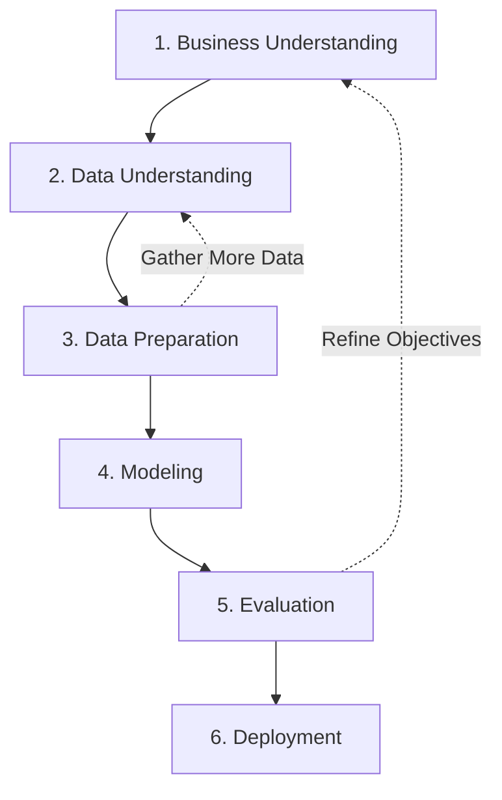

1. **Business Understanding:** Define project objectives and requirements from a business perspective.
2. **Data Understanding:** Initial data collection, describing data, and identifying quality issues.
3. **Data Preparation:** Constructing the final dataset (cleaning, transformation, feature engineering).
4. **Modeling:** Applying various modeling techniques and calibrating their parameters to optimal values.
5. **Evaluation:** Evaluating the model to ensure it meets the business objectives defined in Step 1.
6. **Deployment:** Organizing and presenting the results or integrating the model into an existing production environment.

### The KDD Process
**KDD (Knowledge Discovery in Databases)** is the overarching process of finding useful knowledge from data.

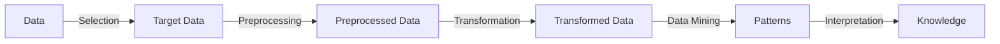
1. **Selection:** Identifying target data from raw databases.
2. **Preprocessing:** Cleaning the data to remove noise and missing values.
3. **Transformation:** Converting data into appropriate forms for mining (e.g., normalization).
4. **Data Mining:** Applying intelligent methods to extract data patterns.
5. **Interpretation/Evaluation:** Identifying the truly interesting patterns representing knowledge.

---

## 5. The Data Lifecycle (Detailed Expansion)

The data lifecycle represents the continuous stages data goes through from generation to archiving/reuse.

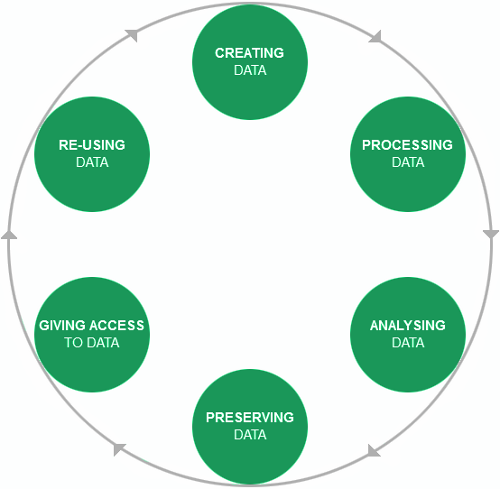
*Figure 1.1: Data Lifecycle showing the continuous process of creating, processing, analysing, preserving, giving access, and re-using data.*
[Source: 1.Introduction to DAV.pdf, Slide 15]

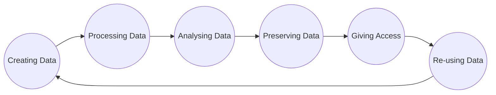

### 1. Creating Data
- **What happens:** Data is generated or captured from systems, sensors, transactions, or users.
- **Responsible:** Data Engineers, System Architects, Users.
- **Tools:** OLTP databases, IoT sensors, Web forms, Web scrapers.

### 2. Processing Data
- **What happens:** Raw data is cleaned, formatted, and validated. This is often part of the ETL (Extract, Transform, Load) phase.
- **Responsible:** Data Engineers.
- **Tools:** Apache Spark, Trifacta, SQL, Pandas.

### 3. Analysing Data
- **What happens:** Processed data is subjected to statistical analysis, visualization, and modeling to extract insights.
- **Responsible:** Data Analysts, Data Scientists.
- **Tools:** Python, R, Tableau, PowerBI.

### 4. Preserving Data
- **What happens:** Data is securely stored for the long term, ensuring data integrity, compliance, and protection against loss.
- **Responsible:** Database Administrators (DBAs), Cloud Engineers.
- **Tools:** Data Warehouses (Snowflake, Redshift), Data Lakes (AWS S3), Backup systems.

### 5. Giving Access to Data
- **What happens:** Data is made available to authorized stakeholders through secure APIs, portals, or BI dashboards.
- **Responsible:** Data Stewards, Security Teams.
- **Tools:** REST APIs, BI Dashboards, Data Catalogs.

### 6. Re-using Data
- **What happens:** Historical data is repurposed for new analyses, model training, or comparative studies.
- **Responsible:** Researchers, Data Scientists.
- **Tools:** Machine Learning platforms, Analytics Sandbox environments.

---

## 6. The Detailed Data Analysis Process

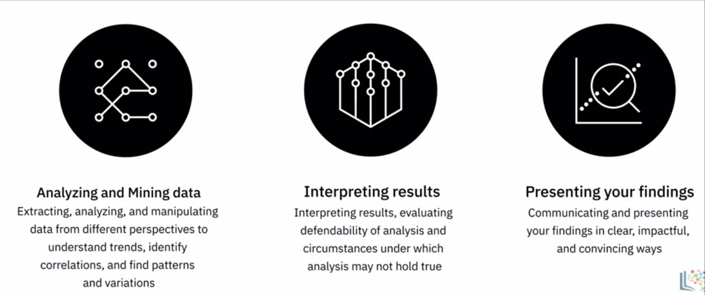
*Figure 1.2: Analyzing and Mining data, Interpreting results, Presenting your findings.*
[Source: 1.Introduction to DAV.pdf, Slide 22]

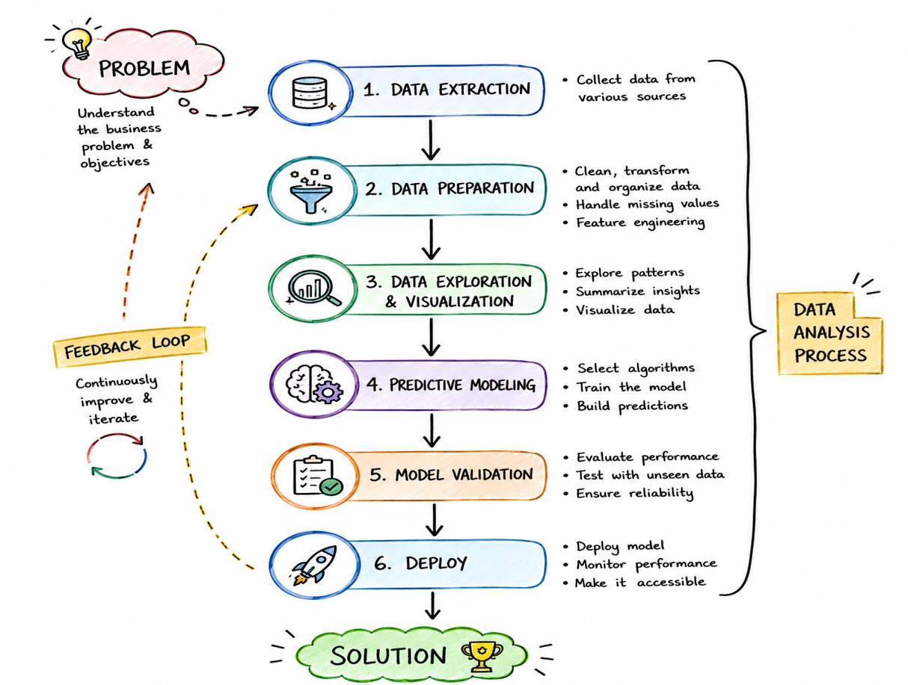
*Figure 1.3: Detailed Data Analysis Process.*
[Source: 1.Introduction to DAV.pdf, Slide 20]

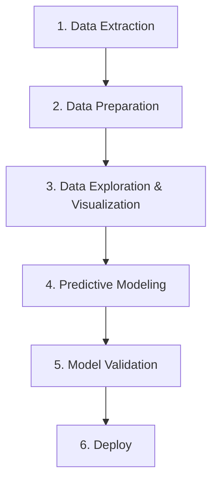

### Step 1: Data Extraction
- **What happens:** Data is gathered from various disparate sources (SQL databases, APIs, flat files, scraped HTML).
- **Tools/Techniques:** SQL, Python (`requests`, `BeautifulSoup`), APIs.
- **Output:** Raw dataset.

### Step 2: Data Preparation
- **What happens:** Data is cleaned, transformed, and organized. Missing values are imputed, outliers are handled, and features are engineered.
- **Tools/Techniques:** Python (Pandas, NumPy), Trifacta, Data Wrangling tools.
- **Output:** Clean, structured tabular dataset.

### Step 3: Data Exploration & Visualization
- **What happens:** Exploratory Data Analysis (EDA) is conducted to find patterns, summarize insights, and visualize correlations using statistical plots.
- **Tools/Techniques:** Tableau, Seaborn, Matplotlib, Descriptive Statistics.
- **Output:** Visual insights and feature correlations.

### Step 4: Predictive Modeling
- **What happens:** Algorithms are selected and models are trained on the historical data to build predictions for future outcomes.
- **Tools/Techniques:** Scikit-learn, XGBoost, TensorFlow, Statistical Regression.
- **Output:** A trained machine learning model.

### Step 5: Model Validation
- **What happens:** The model's performance is evaluated against unseen data to ensure reliability and lack of overfitting.
- **Tools/Techniques:** Cross-validation, Metrics (RMSE, Accuracy, F1-Score).
- **Output:** Validated, production-ready model.

### Step 6: Deploy
- **What happens:** The model and visualizations are deployed to production, made accessible to stakeholders, and continuously monitored.
- **Tools/Techniques:** Flask/FastAPI, Docker, Tableau Server, Cloud Platforms.
- **Output:** Actionable application or live dashboard.

---

## 7. Data Analytics Types: Deeper Treatment

The slides introduce four main categories of data analytics. Each represents a different level of complexity and provides a different type of business value.

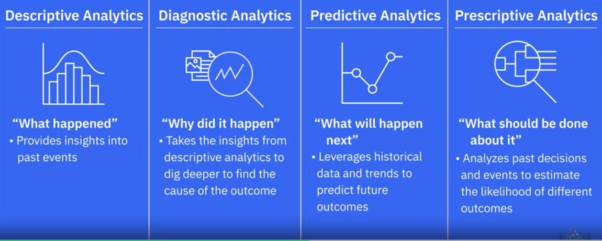
*Figure 1.4: Descriptive, Diagnostic, Predictive, and Prescriptive Analytics.*
[Source: 1.Introduction to DAV.pdf, Slide 23]

### 1. Descriptive Analytics
- **Focus:** "What happened?"
- **Description:** Provides insights into past events by summarizing historical data. It forms the backbone of traditional BI.
- **Tools/Techniques:** Aggregations, basic summary statistics (mean, median, mode), static dashboards, bar charts, line graphs.
- **Example in Industry:** A monthly sales report showing total revenue generated across different regions.

### 2. Diagnostic Analytics
- **Focus:** "Why did it happen?"
- **Description:** Takes insights from descriptive analytics to dig deeper to find the root cause of the outcome.
- **Tools/Techniques:** Drill-down analysis, correlation matrices, anomaly detection, hypothesis testing.
- **Example in Industry:** Investigating *why* sales dropped in a specific region during Q2 by drilling down to find that a specific product line faced supply chain delays.

### 3. Predictive Analytics
- **Focus:** "What will happen next?"
- **Description:** Leverages historical data, statistics, and machine learning trends to predict future outcomes and probabilities.
- **Tools/Techniques:** Linear/Logistic Regression, Time-series forecasting (ARIMA), Decision Trees, Neural Networks.
- **Example in Industry:** A machine learning model forecasting that inventory for winter coats will run out in two weeks based on current weather predictions and historical sales.

### 4. Prescriptive Analytics
- **Focus:** "What should be done about it?"
- **Description:** Analyzes past decisions and events to estimate the likelihood of different outcomes, suggesting optimal actions to maximize favorable results.
- **Tools/Techniques:** Optimization algorithms, simulation, Monte Carlo methods, recommendation engines.
- **Example in Industry:** An automated supply chain system that not only predicts a shortage of winter coats but automatically issues a purchase order to the cheapest supplier to restock before the shortage occurs.

### Comparison Table: Analytics Types

| Type | Question Answered | Techniques Used | Example | Complexity |
| :--- | :--- | :--- | :--- | :--- |
| **Descriptive** | What happened? | Aggregation, basic charts | Monthly sales dashboard | Low |
| **Diagnostic** | Why did it happen? | Drill-down, correlation | Finding root cause of sales drop | Medium |
| **Predictive** | What will happen? | ML, Forecasting, Regression | Forecasting next month's sales | High |
| **Prescriptive** | What should we do? | Optimization, Simulation | Auto-reordering optimal inventory | Very High |

---

## 8. Visualization Types and Principles

### Definition: Data Visualisation
**Meaning:** Communicating findings clearly by turning numbers into visuals.
**Formal definition:** The graphical representation of information and data using visual elements like charts, graphs, and maps to provide an accessible way to see and understand trends, outliers, and patterns.

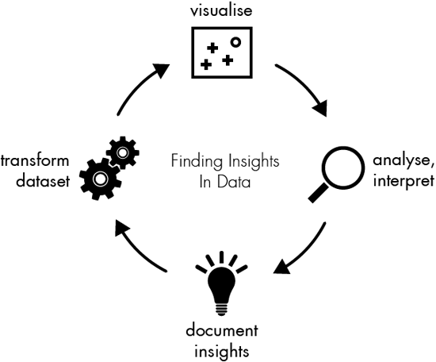
*Figure 1.5: Data insights: a visualization by Gregor Aisch. Showing the cyclic process of visualise, analyse/interpret, document insights, and transform dataset.*
[Source: 1.Introduction to DAV.pdf, Slide 27]

### Core Visualization Types (Expanded)

#### 1. Tables
- **When to use:** When exact numerical values are required, or when dealing with a relatively small number of data points where users need to look up specific numbers.
- **Pros:** Precise, easy to read exact values, good for reference.
- **Cons:** Hard to spot overall trends, patterns, or outliers quickly; poor for large datasets.
- **Example:** A financial ledger or a list of top 10 salespeople with their exact revenue numbers.

#### 2. Charts (e.g., Bar, Pie, Line)
- **When to use:** To map dimensions in data to visual properties of geometric shapes to compare quantities, show trends over time, or display parts-of-a-whole.
- **Pros:** Fast visual processing; great for comparisons and time-series data.
- **Cons:** Can be misleading if axes are manipulated; pie charts are notoriously bad for comparing similar-sized categories.
- **Examples:** 
  - *Bar chart:* Comparing sales across different product categories.
  - *Line chart:* Tracking stock price fluctuations over a year.
  - *Pie chart:* Market share percentages among competitors.

#### 3. Maps
- **When to use:** When the data has a strong geographic or spatial component. The power of a map is to re-connect the data to our physical world.
- **Pros:** Intuitive for spatial data, highly engaging, reveals geographic clustering.
- **Cons:** Can be distorted by map projections; geographic area size doesn't always correlate with data importance (e.g., population density vs. land mass).
- **Example:** A choropleth map showing COVID-19 infection rates across different states.

#### 4. Graphs (Networks)
- **When to use:** To show inter-connections (edges) in your data points (nodes), demonstrating relationships, hierarchies, or networks.
- **Pros:** Excellent for complex relational data, social networks, and dependency mapping.
- **Cons:** Can quickly become a "hairball" (unreadable cluster of overlapping lines) if there are too many nodes.
- **Example:** Mapping the social network connections between employees in a large corporation.

---

## 9. Tools Section (Deep Dive)

The modern DAV ecosystem requires a mix of programming, statistical, and UI-based tools.

### Python Libraries
Python is the dominant language for Data Science due to its readable syntax and massive ecosystem.
- **NumPy:** The foundational package for numerical computing. It is fast, versatile, and provides support for large, multi-dimensional arrays and matrices, along with high-level mathematical functions.
- **Pandas:** Designed for fast and easy data analysis. Allows complex operations like merging, joining, and transforming huge chunks of data using simple commands.
- **Matplotlib:** The low-level, foundational plotting library in Python. Highly customizable but requires more code for complex aesthetics.
- **Seaborn:** Built on top of Matplotlib. Provides a high-level interface for drawing attractive and informative statistical graphics. Great for complex heatmaps and distribution plots.
- **Plotly:** An interactive graphing library. Unlike Matplotlib (which produces static images), Plotly generates HTML-based interactive charts allowing users to hover, zoom, and pan.

### R Packages
R is a statistical programming language heavily used in academia and specialized data science.
- **ggplot2:** Based on the "Grammar of Graphics," it is one of the most powerful and flexible visualization packages in existence. It allows users to build plots layer by layer.
- **dplyr:** A powerful library for data wrangling with a precise and straightforward syntax. 
- **data.table:** Helps aggregate and process extremely large datasets much faster than standard data frames.
- **jsonlite:** A robust JSON parsing tool, great for interacting with web APIs.

### BI and Non-Programming Software
- **Tableau:** A leading interactive BI tool. It allows users to connect to almost any database, drag and drop to create interactive visualizations, and publish dashboards. 
  - *Pros:* Very user-friendly, creates beautiful interactive dashboards, handles large data well.
  - *Cons:* Expensive enterprise licensing, steep learning curve for advanced calculations, limited data cleaning capabilities compared to Python.
- **Watson Studio Refinery:** Available via IBM Watson Studio. Transforms large amounts of raw data into consumable, quality information ready for analytics. Detects data types automatically.
- **Trifacta Wrangler:** An interactive cloud-based service specifically for cleaning and transforming messy, real-world data into structured tables. Known for its collaboration features.

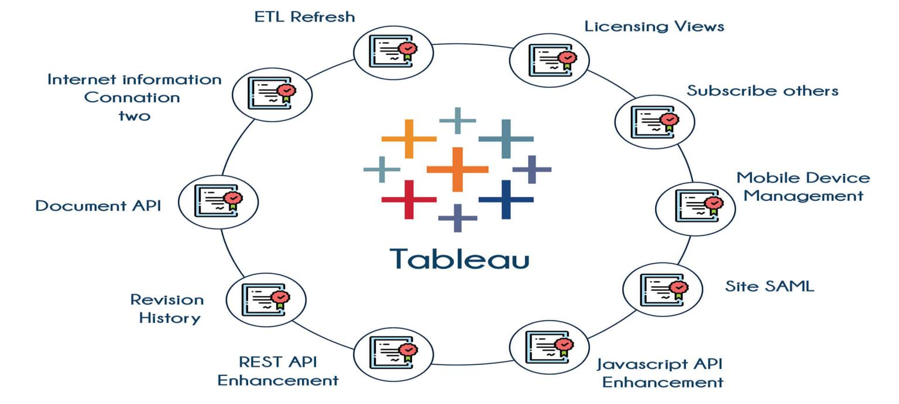
*Figure 1.6: Tableau ecosystem and components.*

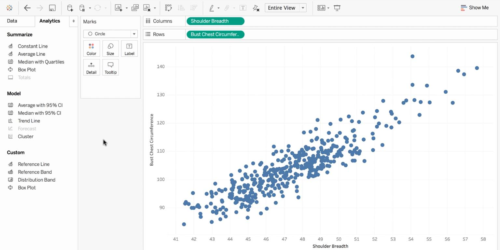
*Figure 1.7: Demo of Data Visualization interface (Tableau) showing a scatter plot mapping Shoulder Breadth vs Bust Chest Circumference.*

### Comparison: Python vs R vs Tableau

| Feature | Python | R | Tableau |
| :--- | :--- | :--- | :--- |
| **Primary Use Case** | End-to-end data science, machine learning, general programming | Specialized statistical analysis and complex data modeling | Enterprise BI, interactive dashboards, management reporting |
| **Learning Curve** | Moderate | Steep (unique syntax) | Easy to start, Hard to master |
| **Cost** | Free (Open Source) | Free (Open Source) | Expensive (Commercial license) |
| **Data Cleaning** | Excellent (Pandas) | Excellent (dplyr) | Basic (Relies on Tableau Prep) |

---

## 10. Properties, Advantages and Limitations of Visualization

**Why is Data Visualization Important?**
- **Cognitive Speed:** Our brains process and understand images exponentially faster than text or tabular data.
- **Clarity & Pattern Recognition:** A well-designed chart reveals trends, outliers, or systemic problems at a single glance, bypassing the need to read through rows of numbers.
- **Unique Perspective:** Visualization provides a front line of attack. As William S. Cleveland noted, it reveals intricate structures in data that cannot be absorbed any other way, helping us discover unimagined effects and challenge imagined ones.

---

## 11. Applications and Case Studies

### Successful Use of Data Visualization in Various Industries
- **Healthcare:** Hospitals use visualizations to track patient wait times and identify bottlenecks in emergency departments. This leads to optimized resource allocation and reduced patient waiting times.
- **Marketing:** Marketers analyze campaign performance and customer behavior. Visualizing data from social media platforms and website analytics helps identify consumer trends and drives informed marketing strategies.
- **Finance:** Data visualization helps professionals interpret complex financial data rapidly. Investment firms use interactive charts to compare portfolio performance and spot market anomalies that impact trading decisions.
- **Manufacturing:** Empowers manufacturers to optimize operations by monitoring Key Performance Indicators (KPIs). Visualizing throughput rates and defect rates allows managers to identify production bottlenecks and take corrective actions.
- **Technology:** Heavily relies on data visualization for analyzing vast amounts of machine-generated data. In cybersecurity, visualizations allow analysts to detect patterns in network traffic efficiently, enabling swift responses to threats.

### Open Data Sources for Practice
- **Google Trends:** Curated by Google (e.g., search term frequencies like "Cupcake").
- **National Climatic Data Center (NOAA):** Climate data (e.g., Local Climatological Data).
- **Global Health Observatory data (WHO):** Global health metrics (e.g., Universal access to reproductive health).
- **Data.gov.sg:** Singaporean government data (e.g., Demographics and population statistics).
- **Earthdata (NASA):** Earth science data (e.g., Atmospheric Electricity / Lightning data).
- **AWS Open Data Registry:** Hosted by Amazon (e.g., 1000 Genomes Project).

---

## 12. Key Takeaways
- The **DIKW hierarchy** maps the transformation of raw Data into Information, Knowledge, and ultimately actionable Wisdom.
- **Big Data** is defined by Volume, Velocity, Variety, Veracity, and Value.
- The **data analysis pipeline** (formalized by frameworks like **CRISP-DM** and **KDD**) involves extraction, preparation, exploration, predictive modeling, validation, and deployment.
- Analytics matures through four stages: **Descriptive** (what), **Diagnostic** (why), **Predictive** (what next), and **Prescriptive** (what to do).
- **Data Visualization** leverages human visual cognition to communicate complex patterns rapidly.
- Choosing the right tool—whether a programming language (**Python/R**) or a BI software (**Tableau**)—depends on the specific task, data complexity, and end-user needs.

---

## Formula Sheet
*(No specific mathematical formulas were covered in this chapter's introductory material. General algorithmic complexity for data sorting is bounded by $O(N \log N)$ but specific implementations vary by tool).*

---

## Definition Sheet
- **Data:** Raw facts or figures without any context.
- **Information:** Data endowed with relevance and purpose.
- **Knowledge:** Actionable information synthesized to reveal patterns.
- **Wisdom:** Evaluated understanding applied to make strategic decisions.
- **Data Analysis:** The process of making sense of data by asking questions and finding answers.
- **Data Mining:** Discovering hidden patterns in large datasets using automated algorithms.
- **Structured Data:** Data organized in tables (e.g., SQL databases).
- **Unstructured Data:** Emails, images, videos that require preprocessing.
- **Quantitative Data:** Numerical data that can be measured for statistical analysis.
- **Qualitative Data:** Descriptive categories used for pattern recognition.

---

## Exam-Oriented Review

**Q1: Explain the DIKW model with an example.**
**A:** The DIKW model explains the evolution of understanding: Data (raw numbers, e.g., $100$), Information (data with context, e.g., $100$ items sold), Knowledge (synthesized information, e.g., $100$ items sold is a $20\%$ drop from last week), Wisdom (applied knowledge, e.g., launching a discount campaign to recover sales).

**Q2: Compare and contrast Descriptive and Predictive Analytics.**
**A:** Descriptive analytics focuses on historical data to answer "What happened?" using basic aggregations and charts (e.g., a monthly sales report). Predictive analytics uses historical data combined with machine learning models to answer "What will happen next?" (e.g., forecasting next month's sales).

**Q3: What are the six phases of the CRISP-DM process?**
**A:** 1. Business Understanding, 2. Data Understanding, 3. Data Preparation, 4. Modeling, 5. Evaluation, 6. Deployment.

**Q4: Discuss the importance of Data Visualization.**
**A:** Human cognition processes images much faster than raw text. A well-designed chart reveals complex trends, outliers, and patterns at a glance, providing a unique perspective that tabular data hides.

**Q5: When should a Data Analyst use Python versus Tableau?**
**A:** Python (using Pandas, Matplotlib) should be used when extensive data cleaning, complex transformations, or advanced machine learning integration is required. Tableau should be used for creating rapid, highly interactive dashboards intended for business stakeholders who need to consume the data visually without coding.
