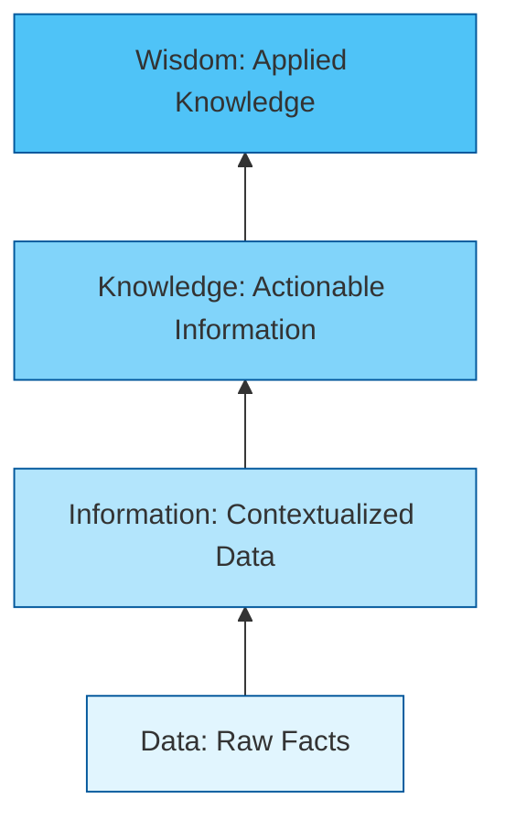
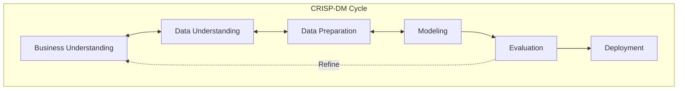

<Complete DAV Notes: Introduction to DAV>
> **Course:** Data Analysis and Visualization
> **Primary Source:** 1.Introduction to DAV.pdf
> **Files Integrated:** `1.Introduction to DAV.pdf`

# Chapter 1 — Introduction to DAV

## Source map

- `1.Introduction to DAV.pdf` — primary course presentation file.

---

## 1. Chapter Overview
This chapter introduces the fundamental concepts of Data Analysis and Visualization (DAV). It covers the definitions of data, the data lifecycle, types of data, quantitative vs qualitative analysis, and the end-to-end data analysis process. It explores Big Data (5 V's), the DIKW model, process models (CRISP-DM and KDD), analytics types (descriptive, diagnostic, predictive, prescriptive), visualization techniques, and standard software tools/libraries (Python, R, Tableau).
[Source: 1.Introduction to DAV.pdf, Slide 1-44]

---

## 2. Fundamental Concepts: The DIKW Hierarchy

The **DIKW Model** describes the transformation of raw facts into strategic actions:
$$\text{Data} \longrightarrow \text{Information} \longrightarrow \text{Knowledge} \longrightarrow \text{Wisdom}$$

### Definition: Data
**Meaning:** Raw, unprocessed facts, figures, and symbols without context.
**Example:** Sensor readings: $38, 39, 40$.

### Definition: Information
**Meaning:** Data organized and structured to answer "who", "what", "where", and "when".
**Example:** The readings $38^\circ\text{C}, 39^\circ\text{C}, 40^\circ\text{C}$ represent daily peak temperatures in July.

### Definition: Knowledge
**Meaning:** Synthesized information revealing patterns and answering "how".
**Example:** Understanding that temperatures above $35^\circ\text{C}$ trigger a $40\%$ surge in air conditioner purchases.

### Definition: Wisdom
**Meaning:** Evaluated knowledge incorporating judgment to answer "why" and guide strategy.
**Example:** Pre-emptively increasing regional warehouse inventory of air conditioners in May.

---

## 3. Big Data and Frameworks

### The 5 V's of Big Data
1. **Volume:** Scale of data (Gigabytes to Zettabytes).
2. **Velocity:** Speed of generation and streaming ingestion.
3. **Variety:** Structural diversity (Structured, Semi-structured, Unstructured).
4. **Veracity:** Data quality, noise, and trustworthiness.
5. **Value:** Actionable business utility derived from analysis.

### Process Pipelines: CRISP-DM vs KDD

| Framework | Core Focus | Primary Steps |
| :--- | :--- | :--- |
| **CRISP-DM** | Business-oriented data mining cycle | Business Understanding $\rightarrow$ Data Understanding $\rightarrow$ Data Prep $\rightarrow$ Modeling $\rightarrow$ Evaluation $\rightarrow$ Deployment |
| **KDD Process** | Technical knowledge discovery in databases | Selection $\rightarrow$ Preprocessing $\rightarrow$ Transformation $\rightarrow$ Data Mining $\rightarrow$ Interpretation/Evaluation |

---

## 4. Analytics Types & Data Formats

### Comparison of Analytics Types

| Type | Question | Primary Techniques | Example |
| :--- | :--- | :--- | :--- |
| **Descriptive** | What happened? | Summaries, Aggregations, Mean/Median | Monthly sales report |
| **Diagnostic** | Why did it happen? | Drill-downs, Correlation, Root Cause | Investigating a regional sales drop |
| **Predictive** | What will happen? | Regression, Time-series, ML | Sales forecast for Q4 |
| **Prescriptive** | What should we do? | Optimization, Monte Carlo, Rules | Automated inventory reordering |

### Data Representation Formats: Ungrouped vs Grouped
Data in DAV projects is encountered in two primary structural representations:

1. **Ungrouped (Raw) Data:** Individual raw observations listed directly.
   - Example: $X = \{12, 15, 15, 18, 20, 22, 25, 25, 25, 30\}$
2. **Grouped (Class Table) Data:** Aggregated observations into continuous class intervals with frequencies.
   - Example:

| Class Interval (CI) | Class Midpoint ($x_i$) | Frequency ($f_i$) | Cumulative Frequency ($CF$) |
| :---: | :---: | :---: | :---: |
| $10 - 15$ | $12.5$ | $2$ | $2$ |
| $15 - 20$ | $17.5$ | $2$ | $4$ |
| $20 - 25$ | $22.5$ | $3$ | $7$ |
| $25 - 30$ | $27.5$ | $3$ | $10$ |
| **Total** | — | $N = \sum f_i = 10$ | — |

---

## 5. Tools & Ecosystem

| Tool / Library | Category | Strengths | Typical Use Case |
| :--- | :--- | :--- | :--- |
| **Pandas / NumPy** | Python Data Science | High performance tabular manipulation | ETL, Cleaning, Feature Engineering |
| **Matplotlib / Seaborn** | Python Visualization | Flexible static & statistical plots | Exploratory Data Analysis (EDA) |
| **Plotly** | Python / JS | Interactive, web-ready graphics | Dashboards & web reporting |
| **ggplot2 / dplyr** | R Packages | Grammar of graphics, statistical modeling | In-depth academic & statistical analysis |
| **Tableau / Power BI** | Enterprise BI | Drag-and-drop UI, rapid dashboarding | Executive KPI reporting |

---

## 6. Edge Cases & Practical Considerations

| Scenario / Edge Case | Risk / Problem | Mitigation Strategy |
| :--- | :--- | :--- |
| **Zero Variance Feature** | Constant value column adds zero predictive signal | Drop feature before modeling |
| **High Class Imbalance** | Predictive models ignore minority class | Resampling (SMOTE) or adjusted loss weights |
| **Open-Ended Class Intervals** | Grouped table with "$>50$" or "$<10$" lacks exact midpoint | Estimate boundary using domain knowledge or adjacent step size |
| **Conflicting Source Schema** | Different column names/units across integrated datasets | Standardization and explicit unit mapping |

---

## Formula Sheet

### 1. Data Aggregation Formula (Ungrouped)
$$ \bar{x} = \frac{1}{n} \sum_{i=1}^{n} x_i $$

### 2. Data Aggregation Formula (Grouped Class Table)
$$ \bar{x} = \frac{\sum_{i=1}^{k} f_i x_i}{N} \quad \text{where } N = \sum_{i=1}^{k} f_i $$

---

## Definition Sheet
- **Data:** Raw facts without context.
- **Information:** Structured data with context.
- **Knowledge:** Patterned information enabling understanding.
- **Wisdom:** Applied knowledge guiding strategic decisions.
- **Descriptive Analytics:** Summarizing historical observations.
- **Prescriptive Analytics:** Optimizing actions based on predictive outcomes.
- **CRISP-DM:** Standardized 6-phase data mining lifecycle.
- **Grouped Data:** Data aggregated into frequency distributions over class intervals.

---

## Exam-Oriented Review

**Q1: Contrast Descriptive Analytics and Prescriptive Analytics with examples.**
**A:** Descriptive analytics summarizes past data (e.g., total sales revenue last month was $\$50,000$). Prescriptive analytics provides actionable recommendations based on optimization models (e.g., reorder 200 units of product X now to maximize profit and avoid stockout).

**Q2: How does raw ungrouped data differ from grouped class table data?**
**A:** Raw ungrouped data preserves every individual measurement ($x_1, x_2, \dots, x_n$). Grouped class table data aggregates measurements into class intervals ($[a, b)$) with frequency counts ($f_i$), trading individual precision for compact representation.

**Q3: List the 6 phases of the CRISP-DM model.**
**A:** 1. Business Understanding, 2. Data Understanding, 3. Data Preparation, 4. Modeling, 5. Evaluation, 6. Deployment.
