<Complete DAV Notes: Types of Data>
> **Course:** Data Analysis and Visualization
> **Primary Source:** 2.Types of Data.pdf
> **Files Integrated:** `2.Types of Data.pdf`

# Chapter 2 — Types of Data

## Source map

- `2.Types of Data.pdf` — primary course presentation file.

---

## 1. Chapter Overview
This chapter explores the fundamental classifications of data used in data analysis and visualization. It covers the broad categorizations of data into qualitative and quantitative types, discrete and continuous structures, structured vs unstructured data, and the four main levels of measurement (nominal, ordinal, interval, ratio). Understanding these types is critical for choosing the appropriate statistical tests, machine learning models, and visualization techniques.
[Source: 2.Types of Data.pdf, Slide 2]

---
## 2. Fundamental Concepts

### Definition: Qualitative Data
**Meaning:** Data that describes qualities, characteristics, or categories, which cannot be quantified numerically with intrinsic mathematical meaning.
**Formal definition:** Data consisting of categorical variables that represent non-numerical attributes.
**Intuition:** It tells you "what kind" rather than "how much". 
**Example:** Eye color (blue, brown, green), car brands (Toyota, Ford), user reviews (positive, negative).
[Source: 2.Types of Data.pdf, Slide 3]

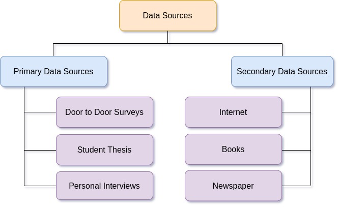
**Figure 2.1: Qualitative Data**
**What it shows:** An overview of qualitative data types.
**Components:** Categories and examples.

---

### Definition: Quantitative Data
**Meaning:** Data that is measurable and expressed numerically, allowing for mathematical operations.
**Formal definition:** Numerical information that reflects a measurable quantity.
**Intuition:** It tells you "how much" or "how many".
**Example:** Temperature in degrees, weight in kilograms, number of students in a class.
[Source: 2.Types of Data.pdf, Slide 4]

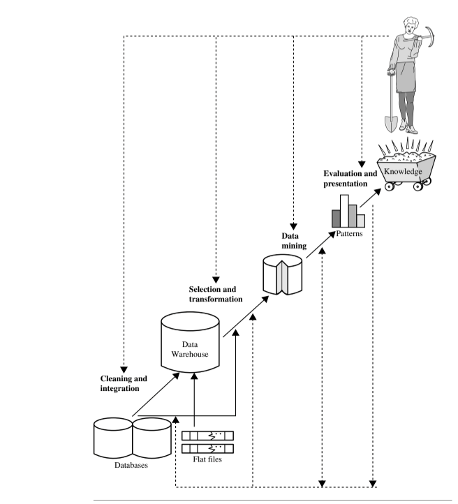
**Figure 2.2: Quantitative Data**
**What it shows:** An overview of quantitative data types and subdivisions.
**Components:** Discrete and continuous classifications.

---
## 3. Definitions

### Definition: Discrete Data
**Meaning:** Quantitative data that can only take on specific, distinct values.
**Formal definition:** A variable whose values are finite or countably infinite.
**Intuition:** Typically involves counting whole items. There are no "in-between" values.
**Example:** Number of children in a family (e.g., 2 or 3, but not 2.5).
[Source: 2.Types of Data.pdf, Slide 5]

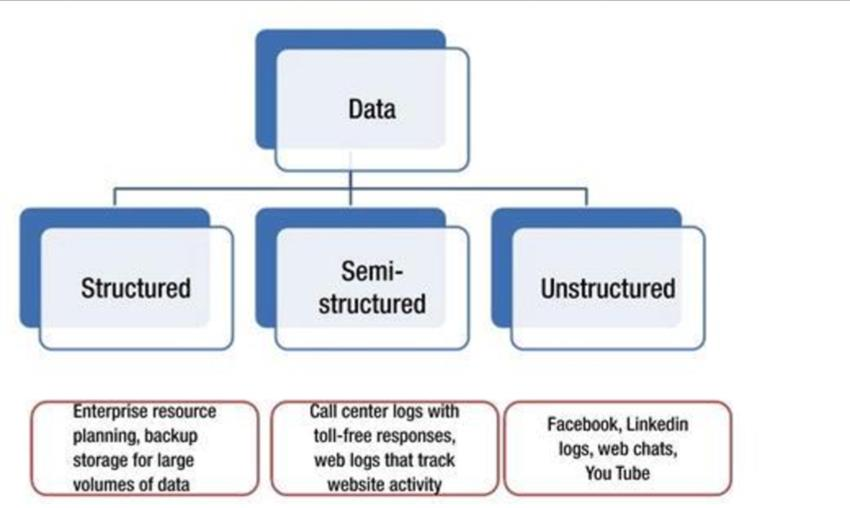
**Figure 2.3: Discrete Data**
**What it shows:** Examples of discrete variables.
**Components:** Diagrams and countable instances.

---

### Definition: Continuous Data
**Meaning:** Quantitative data that can take any value within a given range or interval.
**Formal definition:** A variable that has an uncountable number of possible values.
**Intuition:** Involves measuring rather than counting. The precision depends on the measuring instrument.
**Example:** The exact weight of a person (e.g., 72.45 kg), the height of a tree.
[Source: 2.Types of Data.pdf, Slide 7]

**Figure 2.4: Continuous Data**
**What it shows:** Examples of continuous variables.
**Components:** Measurable quantities with infinite intermediate values.

---
## 4. Core Concepts: Levels of Measurement

Data can be measured at four levels of complexity, formulated by psychologist Stanley Smith Stevens. 

### Nominal Scale
**Meaning:** A qualitative scale that classifies data into distinct categories with no inherent order.
**Formal definition:** A categorical measurement where numbers serve only as labels for identification.
**Intuition:** "Nominal" comes from "name". It's just naming or labeling.
**Example:** Gender (Male, Female, Other), Zip codes, Colors.
[Source: 2.Types of Data.pdf, Slide 8]

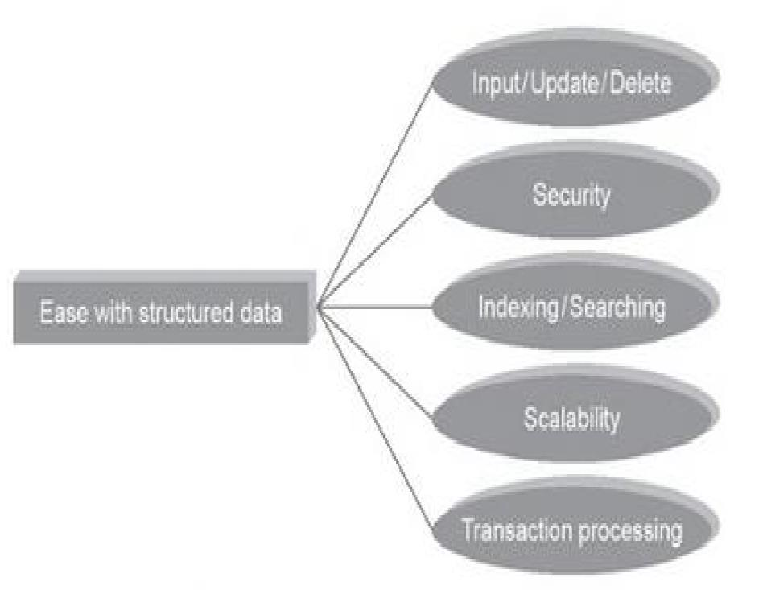
**Figure 2.5: Nominal Scale**
**What it shows:** Concept and examples of nominal scales.
**Components:** Categorical unordered data.

---

### Ordinal Scale
**Meaning:** A qualitative scale that classifies data into distinct categories that have a meaningful order or ranking, but the intervals between ranks are not consistent.
**Formal definition:** A categorical scale with ordered values, but undefined distance between those values.
**Intuition:** "Ordinal" comes from "order". You know who is 1st, 2nd, and 3rd, but not by how much they won.
**Example:** Customer satisfaction ratings (1 - Poor, 2 - Fair, 3 - Good, 4 - Excellent).
[Source: 2.Types of Data.pdf, Slide 9]

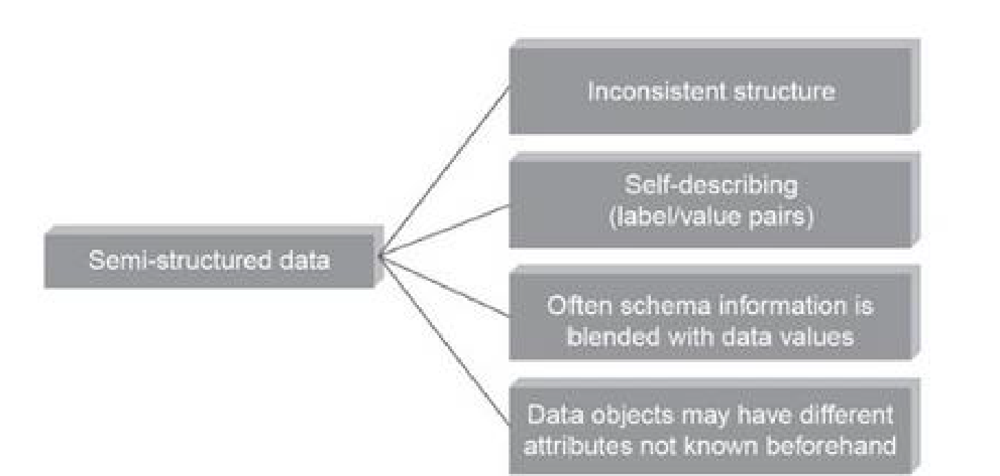
**Figure 2.6: Ordinal Scale**
**What it shows:** Concept and examples of ordinal scales.
**Components:** Ordered data elements.

---

### Interval Scale
**Meaning:** A quantitative scale where the order is known, and the exact differences between values are equal and meaningful, but there is no true zero point.
**Formal definition:** A numerical scale with ordered values and defined equal intervals, lacking a non-arbitrary zero.
**Intuition:** You can add and subtract, but you cannot compute meaningful ratios (e.g., 20°C is not "twice as hot" as 10°C).
**Example:** Temperature in Celsius or Fahrenheit, IQ scores.
[Source: 2.Types of Data.pdf, Slide 10]

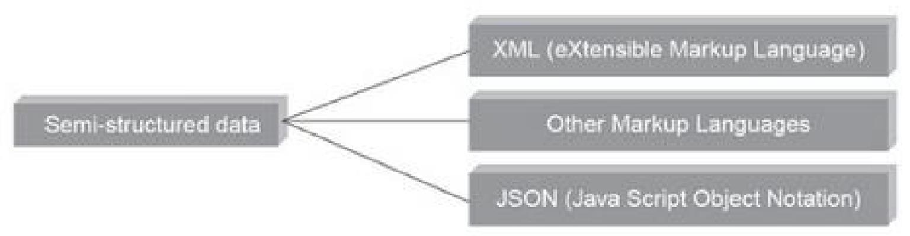
**Figure 2.7: Interval Scale**
**What it shows:** Interval scale concept.
**Components:** Numerical values without true zero.

---

### Ratio Scale
**Meaning:** A quantitative scale that possesses all characteristics of the interval scale, plus an absolute, non-arbitrary zero point, allowing for meaningful ratio calculations.
**Formal definition:** A numerical scale with ordered values, defined equal intervals, and a true zero point indicating the complete absence of the quantity.
**Intuition:** The highest level of measurement. "Zero" means "none". You can multiply and divide (e.g., 20 kg is twice as heavy as 10 kg).
**Example:** Height, weight, time, distance, salary.
[Source: 2.Types of Data.pdf, Slide 11]

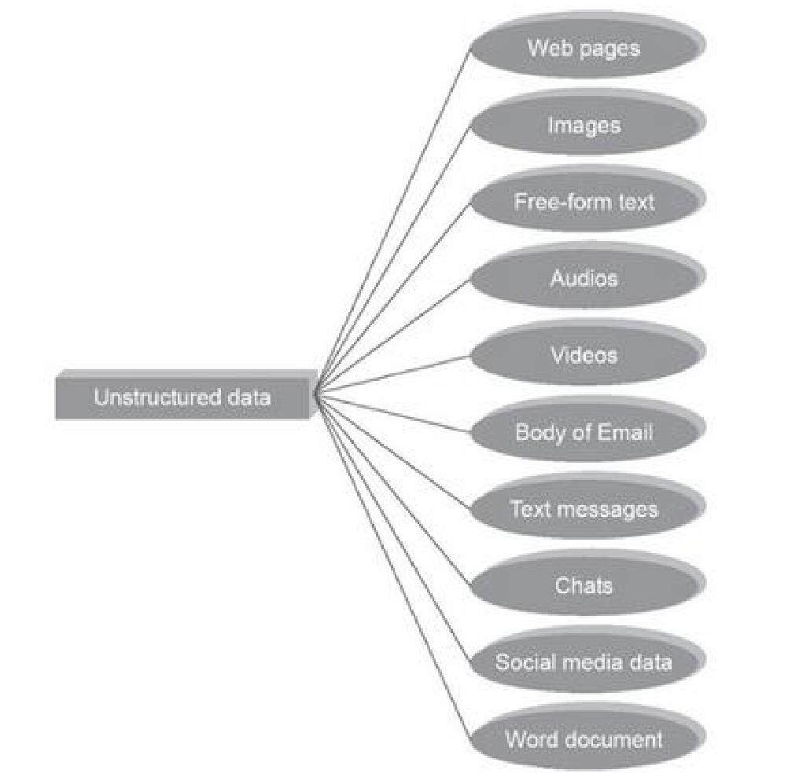
**Figure 2.8: Ratio Scale**
**What it shows:** Ratio scale concept.
**Components:** True zero and equal intervals.

---
## 5. Structured vs Unstructured Data

### Definition: Structured Data
**Meaning:** Data that is highly organized, easily searchable, and follows a strict schema or data model.
**Formal definition:** Data residing in a fixed field within a record or file, typically stored in relational databases (RDBMS).
**Intuition:** Think of spreadsheets or SQL tables where everything is neatly arranged in rows and columns.
**Example:** Customer names, dates, financial transactions.
[Source: 2.Types of Data.pdf, Slide 12]

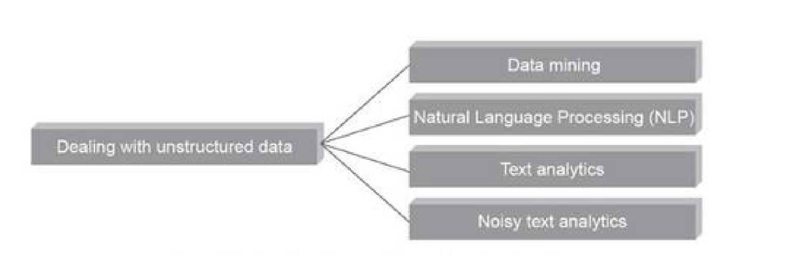
**Figure 2.9: Structured Data**
**What it shows:** Representation of tabular structured data.
**Components:** Relational models.

---

### Definition: Unstructured Data
**Meaning:** Data that lacks a predefined model or schema, making it difficult to process and analyze using conventional relational databases.
**Formal definition:** Information that does not have a pre-defined data model or is not organized in a pre-defined manner.
**Intuition:** The messy, raw data generated by human communication or complex sensors.
**Example:** Text documents, emails, social media posts, audio, video, images.
[Source: 2.Types of Data.pdf, Slide 13]

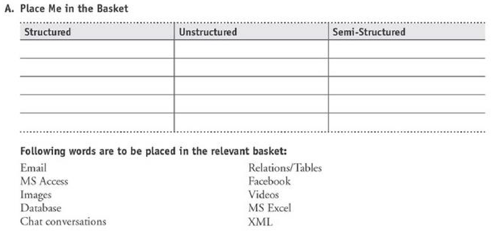
**Figure 2.10: Unstructured Data**
**What it shows:** Examples of complex unformatted data formats.
**Components:** Texts, videos, raw data streams.

---

### Definition: Semi-Structured Data
**Meaning:** Data that doesn't reside in a relational database but has some organizational properties (like tags or markers) that make it easier to analyze.
**Formal definition:** A form of structured data that does not conform to the formal structure of data models associated with relational databases or other forms of data tables, but nonetheless contains tags or other markers to separate semantic elements and enforce hierarchies of records and fields.
**Intuition:** A middle ground between structured and unstructured data.
**Example:** JSON, XML, HTML, NoSQL databases.
[Source: 2.Types of Data.pdf, Slide 14]

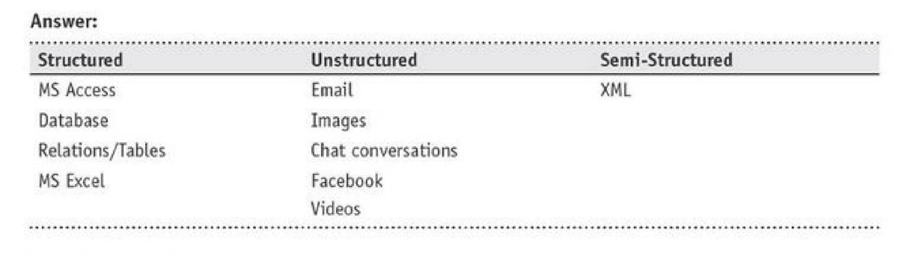
**Figure 2.11: Semi-Structured Data**
**What it shows:** Tagged, hierarchical organization elements.
**Components:** JSON/XML structures.

---
## 6. Mathematical Foundations

### Mathematical Operations by Scale
For a variable $X$:
- **Nominal:** Equality check. 
$$ X_1 = X_2 \text{ or } X_1 \neq X_2 $$
  - **Where:** $X_1, X_2$ are category labels.
  - **Meaning:** Indicates if two elements belong to the same category.
- **Ordinal:** Comparisons (Greater/Less than).
$$ X_1 > X_2, \quad X_1 < X_2 $$
  - **Where:** $X_1, X_2$ are rank values.
  - **Meaning:** Represents ranking without absolute difference.
- **Interval:** Addition and Subtraction.
$$ X_1 - X_2 = \Delta X $$
  - **Where:** $X_1, X_2$ are values on the interval scale, and $\Delta X$ is the meaningful difference.
  - **Meaning:** The distance between points is exact and quantifiable.
- **Ratio:** Multiplication and Division.
$$ \frac{X_1}{X_2} = r $$
  - **Where:** $X_1, X_2$ are values on the ratio scale ($X_2 \neq 0$), and $r$ is the meaningful ratio.
  - **Meaning:** Proportions can be derived due to an absolute zero.

[Source: 2.Types of Data.pdf, Slide 14]

---
## 7. Algorithms / Procedures
*(Basic descriptive evaluation rather than complex algorithms)*

### Algorithm: Data Type Identification Procedure
**Purpose:** Determine the appropriate scale of measurement for a given variable.
**Input:** A data variable.
**Output:** Nominal, Ordinal, Interval, or Ratio.
**Procedure:** 
1. Determine if the data is numerical. If no, proceed to Step 2. If yes, proceed to Step 3.
2. Determine if the categories have an inherent order. 
   - If yes: Output **Ordinal**.
   - If no: Output **Nominal**.
3. Determine if the numerical values have a true, non-arbitrary zero point.
   - If yes: Output **Ratio**.
   - If no: Output **Interval**.
**Complexity:** Time O(1), Space O(1)
**Example:** Input "Temperature in Fahrenheit". Output: Numerical -> No true zero -> **Interval**.

---
## 8. Examples

### Example: Identifying Data Types in Practice
**Given:** Classify the following variables from a hospital dataset:
1. Patient ID (1001, 1002, 1003...)
2. Blood Pressure (120/80 mmHg)
3. Pain Level (1 to 10 scale)
4. Free-text doctor notes

**Solution / Explanation:**
- **Step 1:** "Patient ID" is a number, but it's used merely as a label. You don't add IDs together. It is **Nominal**.
- **Step 2:** "Blood Pressure" is a continuous numerical measurement with a true zero. It is **Quantitative, Continuous, Ratio**.
- **Step 3:** "Pain Level" is ordered, but the difference between 2 and 3 might not equal 8 and 9. It is **Ordinal**.
- **Step 4:** "Free-text doctor notes" lack a predefined schema. It is **Unstructured Data**.

**Result:** Patient ID (Nominal), Blood Pressure (Continuous Ratio), Pain Level (Ordinal), Notes (Unstructured).
[Source: 2.Types of Data.pdf, Slide 14]

---
## 9. Diagrams

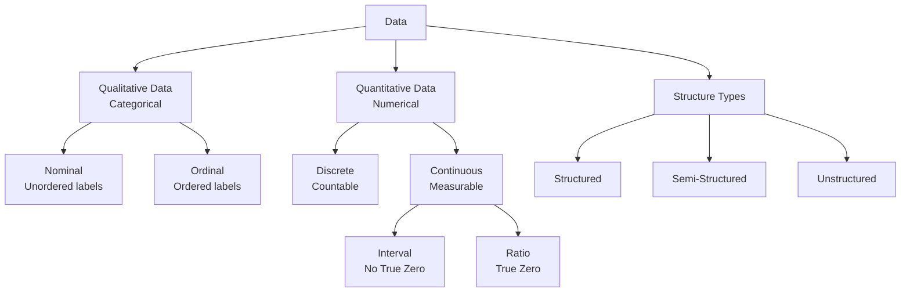
**Figure 2.12: Data Types Taxonomy**
**What it shows:** The full hierarchical classification of data types, scales, and structures.
**Components:** Qualitative, Quantitative, Structure Types.

---
## 10. Tables and Comparisons

### Table: Summary of Data Measurement Scales

| Feature | Nominal | Ordinal | Interval | Ratio |
| :--- | :---: | :---: | :---: | :---: |
| Named Categories | Yes | Yes | Yes | Yes |
| Ordered Categories | No | Yes | Yes | Yes |
| Equal Intervals | No | No | Yes | Yes |
| True Zero Point | No | No | No | Yes |
| Permitted Operations | $=, \neq$ | $>, <$ | $+,-$ | $\times, \div$ |
| Central Tendency | Mode | Median | Mean | Mean |

---
## 11. Properties, Advantages and Limitations

### Data Structure Properties
- **Structured Data:** 
  - *Advantages:* Easy to store, query, and analyze using standard SQL. Highly efficient.
  - *Limitations:* Rigid schema, difficult to adapt to new fields.
- **Unstructured Data:**
  - *Advantages:* Contains rich, detailed information (like sentiments in text). Highly flexible.
  - *Limitations:* Hard to query and requires advanced ML/NLP techniques to extract value.

---
## 12. Applications
- **Nominal Data:** Used for grouping and labeling in demographics (e.g., segmenting customers by region).
- **Ordinal Data:** Used in surveys and feedback forms to gauge sentiment (e.g., Likert scales).
- **Interval/Ratio Data:** Essential for statistical modeling, regressions, and precise financial forecasting.
- **Unstructured Data:** Key driver in modern AI applications like large language models and computer vision.

---
## 13. Key Takeaways
- Understanding data types dictates what visualizations (e.g., bar charts for nominal, histograms for continuous) and statistical methods can be applied.
- The highest level of measurement is the ratio scale, which supports all mathematical operations.
- The majority of the world's data is unstructured, requiring specialized tools beyond traditional databases.

---
## Formula Sheet
- **Nominal Equality:** 
$$X_1 = X_2$$
  (Tests category matching)
- **Ordinal Comparison:** 
$$X_1 > X_2$$
  (Tests ranking)
- **Interval Difference:** 
$$\Delta X = X_1 - X_2$$
  (Quantifies exact distance)
- **Ratio Value:** 
$$r = \frac{X_1}{X_2}$$
  (Establishes proportional magnitude)

---
## Definition Sheet
- **Qualitative Data:** Data describing qualities or categories.
- **Quantitative Data:** Data representing measurable numerical quantities.
- **Discrete Data:** Countable numerical data.
- **Continuous Data:** Measurable numerical data over a range.
- **Nominal Scale:** Unordered categorical labels.
- **Ordinal Scale:** Ordered categorical labels.
- **Interval Scale:** Numerical scale with equal intervals but no true zero.
- **Ratio Scale:** Numerical scale with equal intervals and a true zero.
- **Structured Data:** Organized data following a strict schema (e.g., SQL tables).
- **Unstructured Data:** Unorganized data without a schema (e.g., Text, Video).
- **Semi-structured Data:** Data with loose organizational tags (e.g., JSON, XML).

---
## Exam-Oriented Review
- **Q:** Differentiate between Interval and Ratio scales with examples.
  - **A:** Interval scales have equal spacing but lack a true zero (e.g., Temperature in Celsius). Ratio scales have equal spacing and a true zero (e.g., Weight). Thus, 20 kg is twice 10 kg, but 20°C is not "twice as hot" as 10°C in absolute energy terms.
- **Q:** Why is ordinal data not appropriate for calculating a statistical mean?
  - **A:** Because the distance between the ranks is not uniform. The difference between "Excellent" and "Good" may not equal the difference between "Good" and "Fair."
- **Q:** What is semi-structured data and why is it useful?
  - **A:** It is data that doesn't follow a rigid relational schema but uses tags/markers (like JSON/XML) to separate semantic elements. It provides flexibility while remaining partially machine-readable without complex NLP.
</Complete DAV Notes: Types of Data>
