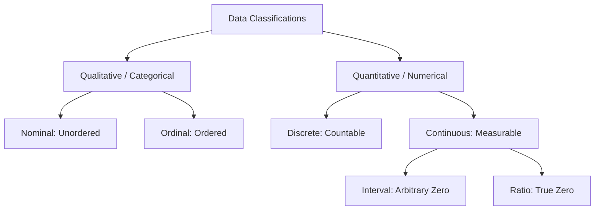

<Complete DAV Notes: Types of Data>
> **Course:** Data Analysis and Visualization
> **Primary Source:** 2.Types of Data.pdf
> **Files Integrated:** `2.Types of Data.pdf`

# Chapter 2 — Types of Data

## Source map

- `2.Types of Data.pdf` — primary course presentation file.

---

## 1. Chapter Overview
This chapter explores data classifications in Data Analysis and Visualization. It covers qualitative vs quantitative data, discrete vs continuous attributes, structured vs semi-structured vs unstructured data formats, and the four Stevens levels of measurement (Nominal, Ordinal, Interval, Ratio). It details math operations, representation formats (ungrouped vs grouped class tables), and edge cases.
[Source: 2.Types of Data.pdf, Slide 2]

---

## 2. Fundamental Classifications

### Definition: Qualitative Data
**Meaning:** Non-numerical categorical data representing attributes or qualities.
**Example:** Eye color ($\text{Blue}, \text{Brown}$), Payment status ($\text{Paid}, \text{Pending}$).

### Definition: Quantitative Data
**Meaning:** Numerical data representing measurable quantities on which arithmetic operations can be performed.
**Example:** Height ($\text{cm}$), Temperature ($^\circ\text{C}$), Account balance ($\$$).

### Definition: Discrete Data
**Meaning:** Quantitative data taking on distinct, countable values.
**Example:** Number of customer visits $X \in \{0, 1, 2, 3, \dots\}$.

### Definition: Continuous Data
**Meaning:** Quantitative data taking on any real value within a given interval.
**Example:** Weight $W \in (0, \infty)\text{ kg}$.

---

## 3. Levels of Measurement (Stevens' Scales)

| Scale | Description | Mathematical Property | Permissible Operations | Central Tendency | Example |
| :--- | :--- | :--- | :--- | :--- | :--- |
| **Nominal** | Unordered categories | Equality check | $=, \neq$ | Mode | Gender, Zip Code, Marital Status |
| **Ordinal** | Ordered categories with undefined distance | Ranking / Comparison | $>, <, =, \neq$ | Median, Mode | Likert scale (1-5), Letter Grades |
| **Interval** | Ordered equal intervals, arbitrary zero | Addition / Subtraction | $+ , -, >, <, =, \neq$ | Mean, Median, Mode | Temperature ($^\circ\text{C}, ^\circ\text{F}$), Calendar Year |
| **Ratio** | Equal intervals with true non-arbitrary zero | Multiplication / Division | $\times, \div, +, -, >, <, =, \neq$ | Mean, Median, Mode | Height, Weight, Income, Distance |

---

## 4. Data Representation Formats: Ungrouped vs Grouped

### 1. Raw Ungrouped Data
Individual numerical observations listed as a simple set:
$$X = \{14, 17, 18, 18, 22, 25, 26, 28, 30, 32\}$$

### 2. Grouped Class Table (Frequency Distribution)
Observations organized into non-overlapping continuous class intervals $[a, b)$:

| Class Interval (CI) | Midpoint ($x_i$) | Frequency ($f_i$) | Relative Frequency ($f_i / N$) | Cumulative Frequency ($CF$) |
| :---: | :---: | :---: | :---: | :---: |
| $10 - 20$ | $15$ | $4$ | $0.40$ | $4$ |
| $20 - 30$ | $25$ | $4$ | $0.40$ | $8$ |
| $30 - 40$ | $35$ | $2$ | $0.20$ | $10$ |
| **Total** | — | $N = 10$ | $1.00$ | — |

---

## 5. Structured, Semi-Structured & Unstructured Data

| Data Format | Schema / Structure | Storage Medium | Example | Processing Method |
| :--- | :--- | :--- | :--- | :--- |
| **Structured** | Strict predefined schema | Relational DB (SQL) | Banking transactions | SQL queries, tabular aggregations |
| **Semi-Structured** | Self-describing, flexible schema | NoSQL, Document DB | JSON, XML, HTML | Key-value parsing, document parsing |
| **Unstructured** | No predefined schema | Object storage, Data Lake | Text documents, Images, Audio | NLP, Computer Vision, Deep Learning |

---

## 6. Edge Cases & Practical Pitfalls

| Scenario / Edge Case | Risk / Problem | Correct Handling |
| :--- | :--- | :--- |
| **Numerical Labels for Categories** | Treating Zip Code ($90210$) or Patient ID ($1004$) as Ratio data | Treat as **Nominal**. Calculating mean zip code is mathematically invalid. |
| **Arbitrary Zero Trap** | Computing ratios on Interval data (e.g., $20^\circ\text{C}$ vs $10^\circ\text{C}$) | $20^\circ\text{C}$ is **not** twice as hot as $10^\circ\text{C}$. Convert to Kelvin (Ratio scale) for ratios. |
| **Ordinal Non-Uniformity** | Calculating mean on Likert ratings ($1=\text{Poor}$ to $5=\text{Excellent}$) | Interval distances between ratings are unknown. Use **Median** or **Mode** for statistical reporting. |
| **Discrete Data behaving Continuous** | Large countable discrete numbers (e.g., population $1,234,567$) | Model as continuous variable in algorithms when values span a wide continuous range. |

---

## Formula Sheet

### 1. Nominal Category Equality
$$ x_i = x_j \quad \text{or} \quad x_i \neq x_j $$

### 2. Ordinal Rank Ordering
$$ x_i > x_j \quad \text{or} \quad x_i < x_j $$

### 3. Interval Difference
$$ \Delta x = x_i - x_j $$

### 4. Ratio Proportion
$$ r = \frac{x_i}{x_j} \quad (x_j \neq 0) $$

---

## Definition Sheet
- **Nominal Scale:** Categorical data with no rank order.
- **Ordinal Scale:** Categorical data with ordered ranks but undefined intervals.
- **Interval Scale:** Numeric data with equal intervals but no true zero.
- **Ratio Scale:** Numeric data with equal intervals and an absolute zero point.
- **Structured Data:** Tabular data strictly adhering to a database schema.
- **Semi-Structured Data:** Tagged or hierarchical data (e.g., JSON) lacking rigid tables.
- **Unstructured Data:** Freeform data (text, video, audio) with no predefined schema.

---

## Exam-Oriented Review

**Q1: Why is temperature in Celsius classified as Interval scale rather than Ratio scale?**
**A:** Celsius has an arbitrary zero point ($0^\circ\text{C}$ is the freezing point of water, not the total absence of thermal energy). Consequently, $40^\circ\text{C}$ is not twice as hot as $20^\circ\text{C}$.

**Q2: Differentiate between structured, semi-structured, and unstructured data with examples.**
**A:** Structured data has a fixed tabular schema (e.g., SQL customer table). Semi-structured data contains self-describing tags without rigid tables (e.g., JSON payload). Unstructured data lacks schema completely (e.g., MP4 video file).

**Q3: Can mean be calculated on ordinal data? Explain.**
**A:** Strictly speaking, no. Ordinal data lacks uniform distances between ranks (e.g., the difference between "Satisfied" and "Neutral" may not equal "Neutral" and "Dissatisfied"). Median and mode are the appropriate measures of central tendency.
