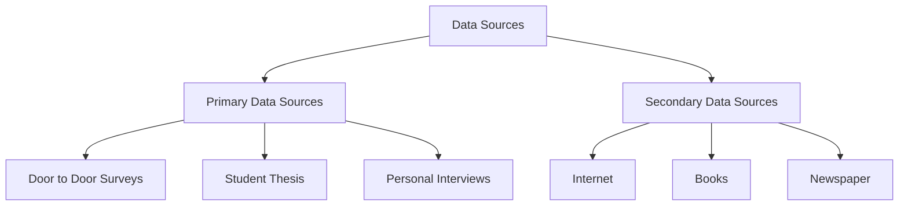
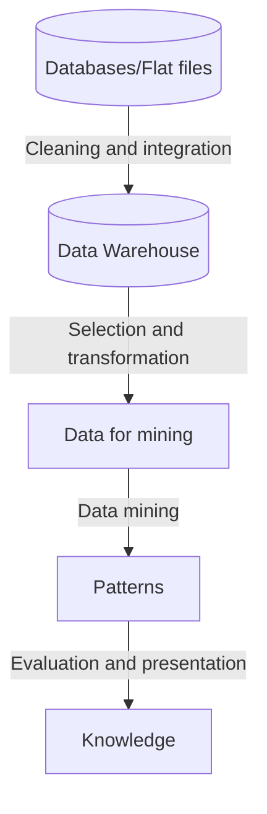
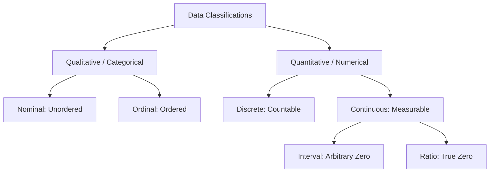
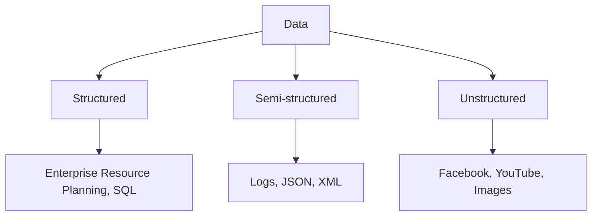

<Complete DAV Notes: Chapter 2 — Types of Data>
> **Course:** Data Analysis and Visualization
> **Primary Source:** 2.Types of Data.pdf
> **Files Integrated:** `2.Types of Data.pdf`, Existing Notes

# Chapter 2 — Types of Data

## 1. Chapter Overview
This chapter explores the foundational concepts of data in Data Analysis and Visualization. It begins by defining data, data sources (primary and secondary), and the Knowledge Discovery in Databases (KDD) process. It then covers the fundamental classifications of data, distinguishing between qualitative and quantitative data, as well as discrete and continuous attributes. A deep dive into the four Stevens' levels of measurement (Nominal, Ordinal, Interval, Ratio) provides the mathematical framework for understanding permissible operations on different data types. Data representation formats are discussed in detail, contrasting raw ungrouped data with grouped frequency distributions, including full calculations for class boundaries, midpoints, and cumulative frequencies. Finally, the chapter categorizes digital data into structured, semi-structured, and unstructured formats, examining their sources, handling techniques, and practical examples such as airport and shopping mall scenarios.
[Source: 2.Types of Data.pdf, Slide 2]

---

## 2. Fundamental Concepts

### Definition: Data
**Meaning:** Data is a collection of facts, numbers, words, observations, or other useful information.
**Formal definition:** Raw, unorganized facts that need to be processed; data can be something simple and seemingly random and useless until it is organized.
**Intuition:** We live in the "data age" rather than just the "information age". Raw data points are transformed into valuable insights through processing and analysis, which improve decision-making and drive better business outcomes.
**Example:** A list of temperatures recorded over a week: $22^\circ\text{C}, 24^\circ\text{C}, 19^\circ\text{C}$.
[Source: 2.Types of Data.pdf, Slide 2]

### Definition: Data Mining
**Meaning:** The process of discovering interesting patterns and knowledge from large amounts of data.
**Formal definition:** The application of specific algorithms for extracting patterns from data.
**Intuition:** It is the analytical step of the "Knowledge Discovery in Databases" process, turning raw data into useful information.
**Example:** Analyzing supermarket transaction data to find that customers who buy diapers also frequently buy beer.
[Source: 2.Types of Data.pdf, Slide 2]

---

## 3. Sources of Data

Data can be broadly classified into two main sources based on its origin:

### 1. Primary Data Sources
Data collected firsthand for a specific research purpose.
- **Door to Door Surveys:** Directly asking individuals questions.
- **Student Thesis:** Original research conducted by students.
- **Personal Interviews:** One-on-one structured or unstructured conversations.

### 2. Secondary Data Sources
Data that has already been collected by someone else and is available for use.
- **Internet:** Web scraping, open data portals.
- **Books:** Published literature and datasets.
- **Newspaper:** Historical records, articles, financial reports.


[Source: 2.Types of Data.pdf, Slide 3]

---

## 4. Process of Knowledge Discovery in Databases (KDD)

The KDD process outlines how raw data is transformed into useful knowledge.

### Algorithm: KDD Process
**Purpose:** To systematically extract valuable knowledge from raw data.
**Procedure:**
1. **Data cleaning:** Remove noise and inconsistencies from the data.
2. **Data integration:** Combine data from multiple heterogeneous sources.
3. **Data selection:** Retrieve the relevant data for analysis from the database.
4. **Data transformation:** Convert and summarize data into appropriate forms for mining.
5. **Data mining:** Apply intelligent methods and algorithms to extract patterns.
6. **Pattern evaluation:** Identify truly interesting and useful patterns representing knowledge.
7. **Knowledge presentation:** Use visualization and representation techniques to present the mined knowledge to users.


[Source: 2.Types of Data.pdf, Slide 4]

---

## 5. Fundamental Data Classifications



### Definition: Qualitative Data
**Meaning:** Non-numerical categorical data representing attributes, properties, or qualities.
**Formal definition:** Data that describes categories or groups that cannot be mathematically quantified in a meaningful way.
**Intuition:** Answers the question "What type?" or "Which category?".
**Example:** Eye color ($\text{Blue}, \text{Brown}, \text{Green}$), Payment status ($\text{Paid}, \text{Pending}$).

### Definition: Quantitative Data
**Meaning:** Numerical data representing measurable quantities on which arithmetic operations can be performed.
**Formal definition:** Data expressing a certain quantity, amount, or range, represented by numbers.
**Intuition:** Answers the question "How much?" or "How many?".
**Example:** Height ($175\text{ cm}$), Temperature ($25^\circ\text{C}$), Account balance ($\$1500$).

### Definition: Discrete Data
**Meaning:** Quantitative data taking on distinct, separated, and countable values.
**Formal definition:** A variable $X$ is discrete if its set of possible values is finite or countably infinite.
**Intuition:** Values that can be counted using integers. There are no possible values between two adjacent discrete points.
**Example:** Number of customer visits $X \in \{0, 1, 2, 3, \dots\}$.

### Definition: Continuous Data
**Meaning:** Quantitative data taking on any real numerical value within a given continuous interval.
**Formal definition:** A variable $X$ is continuous if it can take on any value in the set of real numbers $\mathbb{R}$ over some interval.
**Intuition:** Values that are measured. Between any two continuous data points, there are infinitely many other potential points.
**Example:** Exact weight $W \in (0, \infty)\text{ kg}$.
[Source: Existing Notes]

---

## 6. Levels of Measurement (Stevens' Scales)

Data is further refined into four hierarchical levels of measurement, proposed by Stanley Smith Stevens. Each level possesses distinct mathematical properties.

### 1. Nominal Scale
**Meaning:** Categorical data consisting of discrete categories without any inherent order or ranking.
**Mathematical Property:** Only equality checks are permissible. We can only determine if $x_i = x_j$ or $x_i \neq x_j$.
**Permissible Operations:** Mode, Chi-Square tests.
**Intuition:** Numbers act merely as labels or tags.
**Example:** Gender ($1=\text{Male}, 2=\text{Female}$), Zip Codes ($90210, 10001$), Blood Type ($A, B, AB, O$).

### 2. Ordinal Scale
**Meaning:** Categorical data where the categories have a meaningful rank or natural order, but the intervals between ranks are undefined or uneven.
**Mathematical Property:** Supports ranking and comparison. We can determine if $x_i > x_j$ or $x_i < x_j$, but the difference $x_i - x_j$ has no quantitative meaning.
**Permissible Operations:** Median, Mode, Percentiles, Rank Correlation.
**Intuition:** We know the order, but we don't know the distance between the values.
**Example:** Likert scale ($1=\text{Strongly Disagree}, 5=\text{Strongly Agree}$), Letter Grades ($A > B > C$), Economic Status (Low, Middle, High).

### 3. Interval Scale
**Meaning:** Numerical data where both the order and the exact differences (intervals) between values are meaningful, but there is no true (absolute) zero point.
**Mathematical Property:** Supports addition and subtraction. The difference $\Delta x = x_i - x_j$ is meaningful. However, ratios $x_i / x_j$ are mathematically invalid because the zero point is arbitrary.
**Permissible Operations:** Mean, Median, Mode, Standard Deviation, Addition, Subtraction.
**Intuition:** Zero does not mean "nothing" or "absence of the quantity".
**Example:** Temperature in Celsius ($0^\circ\text{C}$ does not mean no temperature), Calendar Year ($2000$ AD, $2020$ AD).

### 4. Ratio Scale
**Meaning:** Numerical data possessing all the properties of an interval scale, along with a true, non-arbitrary zero point indicating the complete absence of the quantity.
**Mathematical Property:** Supports all arithmetic operations, including multiplication and division. The ratio $r = x_i / x_j$ is highly meaningful.
**Permissible Operations:** Mean, Median, Mode, Geometric Mean, Coefficient of Variation, all arithmetic operations.
**Intuition:** Zero means literally zero (none). Therefore, statements like "twice as much" make perfect sense.
**Example:** Height ($180\text{ cm}$ is exactly twice as tall as $90\text{ cm}$), Weight, Income ($\$0$ means no income), Distance, Age.
[Source: Existing Notes]

---

## 7. Data Representation Formats: Ungrouped vs Grouped

When dealing with large datasets, the way data is presented mathematically profoundly impacts how analysis is conducted.

### 1. Raw Ungrouped Data
**Meaning:** A simple list of individual numerical observations exactly as they were recorded.
**Formal definition:** A set of observations $X = \{x_1, x_2, \dots, x_N\}$ where each $x_i$ is an individual raw data point.
**Example:** The ages of 10 students:

$$
X = \{14, 17, 18, 18, 22, 25, 26, 28, 30, 32\}
$$

**Advantage:** Retains 100% of the original information precision.
**Disadvantage:** Very difficult to interpret or identify patterns when the dataset is large ($N > 50$).

### 2. Grouped Class Table (Frequency Distribution)
**Meaning:** Data that has been organized into non-overlapping continuous class intervals, with counts (frequencies) for how many raw data points fall into each interval.
**Components:**
- **Class Interval $[a, b)$:** The range of values defined by a lower limit $a$ and upper limit $b$.
- **Class Width ($w$):** The difference between the upper and lower boundaries of a class.

$$
w = b - a
$$

- **Midpoint ($x_i$):** The central value of the class interval, used as the representative value for calculations (like the mean).

$$
x_i = \frac{a + b}{2}
$$

- **Frequency ($f_i$):** The number of observations falling into the $i$-th class interval.
- **Relative Frequency:** The proportion of total observations falling into the class.

$$
\text{Relative Frequency} = \frac{f_i}{N}
$$

  where $N = \sum f_i$ is the total number of observations.
- **Cumulative Frequency ($CF$):** The running total of frequencies through the classes.

### Example: Creating a Grouped Data Table
**Given:** A dataset of $N=10$ observations: $X = \{14, 17, 18, 18, 22, 25, 26, 28, 30, 32\}$.
We want to group this into intervals of width 10, starting from 10.

**Step-by-step Solution:**
1. **Define Intervals:** $[10, 20), [20, 30), [30, 40)$.
2. **Count Frequencies ($f_i$):**
   - $[10, 20)$: Values are 14, 17, 18, 18. Count = 4.
   - $[20, 30)$: Values are 22, 25, 26, 28. Count = 4.
   - $[30, 40)$: Values are 30, 32. Count = 2.
3. **Calculate Midpoints ($x_i$):**
   - For $[10, 20)$: $x_1 = \frac{10+20}{2} = 15$.
   - For $[20, 30)$: $x_2 = \frac{20+30}{2} = 25$.
   - For $[30, 40)$: $x_3 = \frac{30+40}{2} = 35$.
4. **Calculate Relative Frequencies:** $f_i / N$.
5. **Calculate Cumulative Frequencies:** Running sum.

**Resulting Table:**

| Class Interval $[a, b)$ | Midpoint ($x_i$) | Frequency ($f_i$) | Relative Frequency ($f_i / N$) | Cumulative Frequency ($CF$) |
| :---: | :---: | :---: | :---: | :---: |
| $10 - 20$ | $15$ | $4$ | $0.40$ | $4$ |
| $20 - 30$ | $25$ | $4$ | $0.40$ | $8$ |
| $30 - 40$ | $35$ | $2$ | $0.20$ | $10$ |
| **Total** | — | $N = 10$ | $1.00$ | — |
[Source: Existing Notes]

---

## 8. Types of Digital Data (Based on Structure)

Digital data is fundamentally categorized into three types based on how it is formatted and stored.



### 1. Structured Data
**Meaning:** Data that is highly organized, strictly adhering to a predefined data model or schema, usually formatted in rows and columns.
**Sources:** Databases such as Oracle, DB2, Teradata, MySQL, PostgreSQL, Spreadsheets (MS Excel), OLTP (Online Transaction Processing) systems.
**Characteristics:**
- Organized in rows and columns.
- Stored in relational databases.
- Easily searchable using queries like SQL.
**Working with Structured Data (Advantages):**
- Easy Insert/Update/Delete operations.
- High-performance Indexing and Searching.
- Robust Transaction processing (ACID properties).
- High Security and Scalability.
**Examples:** Excel sheets, SQL tables, Baggage info, Employee schedules.
[Source: 2.Types of Data.pdf, Slides 6-8]

### 2. Semi-Structured Data
**Meaning:** Data that does not reside in a rigid relational database but contains organizational properties (tags, markers) that make it easier to analyze than raw unstructured text.
**Sources:** XML (eXtensible Markup Language), Other Markup Languages, JSON (JavaScript Object Notation), Logs, Email metadata.
**Characteristics:**
- Inconsistent or flexible structure.
- Self-describing using label/value pairs.
- Schema information is often blended seamlessly with data values.
- Data objects may have different attributes not known completely beforehand.
**Examples:** JSON payloads, XML configuration files, Feedback forms, Inventory logs.
**Example snippet:**
```json
{
  "ReceiptID": "12345",
  "Store": "Duty-Free",
  "PassengerID": "P002",
  "Items": [
    { "ItemName": "Perfume", "Price": "50 USD", "Quantity": 1 }
  ]
}
```
[Source: 2.Types of Data.pdf, Slides 9-10, 22]

### 3. Unstructured Data
**Meaning:** Data that has no predefined format, structure, or schema, making it difficult to collect, process, and analyze using conventional relational tools.
**Sources:** Web pages, Images, Free-form text, Audios, Videos, Body of Emails, Text messages, Chat conversations, Social media data, Word documents.
**Characteristics:**
- Massive in volume (constitutes the vast majority of real-world data).
- Hard to categorize mathematically.
- Requires advanced techniques like Natural Language Processing (NLP), Data mining, Text analytics, and Noisy text analytics to extract value.
**Examples:** Airport flight announcements (audio file), CCTV video recordings of passenger interactions, Tweets ("Stuck at the airport due to flight delay #frustrated"), handwritten notes.
[Source: 2.Types of Data.pdf, Slides 11-12, 21]

---

## 9. Scenarios and Case Studies

### Case Study 1: Busy Airport
Imagine you are at a busy airport with passengers checking in, waiting in lounges, shopping, and interacting with staff. Different data types are generated:
- **Structured Data:** 
  - *Flight Information Table:* Contains `Flight_Number`, `Departure_Time`, `Arrival_Time`, `Gate_Number`, `From`, `To` (e.g., `AI202, 18:30, Mumbai to Delhi, Gate 5`).
  - *Passenger Information Table:* Contains `Passenger ID`, `Name`, `Passport No`, `Flight No`, `SeatNo`, `BoardingTime` (e.g., `P001, Alice, M1234567, AI202, 12A, 18:15`).
- **Semi-Structured Data:**
  - *Shopping Receipts:* Electronic receipts from duty-free stores in XML/JSON format.
  - *Check-in Data:* Logs combining structured elements (timestamps) with unstructured errors in XML format.
- **Unstructured Data:**
  - *Announcements:* Audio files of public address system ("Flight AB123 is now boarding").
  - *Passenger Interactions:* Video files from security cameras.
  - *Social Media Posts:* Free-form text tweets about the travel experience.
[Source: 2.Types of Data.pdf, Slides 16-23]

### Case Study 2: City Shopping Mall
At a mall, people are browsing, looking for discounts, filling feedback forms, and standing at billing counters.
- **Structured:** Transaction records at the billing counter (Item ID, Quantity, Price, Total Amount).
- **Semi-Structured:** Customer feedback forms stored as JSON files on an iPad.
- **Unstructured:** Security CCTV footage monitoring browsing behavior, or free-form comments written on the back of a receipt.
[Source: 2.Types of Data.pdf, Slide 25]

### Exercise: Place in the Basket
**Task:** Categorize the following words.
- *Email:* Unstructured (Body) / Semi-structured (Headers)
- *MS Access:* Structured
- *Images:* Unstructured
- *Database:* Structured
- *Chat conversations:* Unstructured
- *Relations/Tables:* Structured
- *Facebook:* Unstructured
- *Videos:* Unstructured
- *MS Excel:* Structured
- *XML:* Semi-Structured
**Solution Matrix:**
- **Structured:** MS Access, Database, Relations/Tables, MS Excel
- **Unstructured:** Email, Images, Chat conversations, Facebook, Videos
- **Semi-Structured:** XML
[Source: 2.Types of Data.pdf, Slides 13-14]

---

## 10. Tables and Comparisons

### Table 1: Summary of Digital Data Types
| Data Type | Simple Meaning | Schema / Structure | Storage Medium | Examples | Processing Method |
| :--- | :--- | :--- | :--- | :--- | :--- |
| **Structured** | Table-like, very organized | Strict predefined schema | Relational DB (SQL) | Baggage info, Excel, SQL | SQL queries, simple tabular aggregations |
| **Semi-Structured** | Loosely organized, flexible | Self-describing, label/value tags | NoSQL, Document DB | JSON feedback, XML, email headers | Key-value parsing, document parsing |
| **Unstructured** | No structure, hard to categorize | No predefined schema | Data Lake, Object storage | Photos, CCTV, free-form text | NLP, Text Analytics, Computer Vision |

[Source: 2.Types of Data.pdf, Slide 24]

---

## 11. Edge Cases & Practical Pitfalls

| Scenario / Edge Case | Risk / Problem | Correct Handling |
| :--- | :--- | :--- |
| **Numerical Labels for Categories** | Treating Zip Code ($90210$) or Patient ID ($1004$) as Ratio data simply because they are numbers. | Treat strictly as **Nominal**. Calculating the mean zip code is mathematically invalid and meaningless. |
| **Arbitrary Zero Trap** | Computing ratios on Interval data. E.g., claiming $20^\circ\text{C}$ is twice as hot as $10^\circ\text{C}$. | $20^\circ\text{C}$ is **not** twice as hot because $0^\circ\text{C}$ is not absolute zero. Convert to Kelvin (Ratio scale) if a ratio is required. |
| **Ordinal Non-Uniformity** | Calculating the mean on Likert ratings ($1=\text{Poor}$ to $5=\text{Excellent}$). | Interval distances between ratings are strictly unknown. Use **Median** or **Mode** for statistical reporting instead of Mean. |
| **Discrete Data behaving Continuous** | Dealing with extremely large countable discrete numbers (e.g., population $1,234,567$ or website clicks). | In large-scale modeling, it is often mathematically convenient to model these as continuous variables, even though they are technically discrete. |

[Source: Existing Notes]

---

## Formula Sheet

### 1. Nominal Category Equality
Determines if two labels are the same.

$$
x_i = x_j \quad \text{or} \quad x_i \neq x_j
$$

### 2. Ordinal Rank Ordering
Determines the strict ordering between two elements.

$$
x_i > x_j \quad \text{or} \quad x_i < x_j
$$

### 3. Interval Difference
Calculates the exact quantitative difference between two measurements.

$$
\Delta x = x_i - x_j
$$

### 4. Ratio Proportion
Calculates the multiplicative relationship between two measurements.

$$
r = \frac{x_i}{x_j} \quad \text{where } (x_j \neq 0)
$$

### 5. Grouped Data Class Width
Determines the size of each continuous interval in a frequency distribution.

$$
w = b - a
$$

Where $b$ is the upper boundary and $a$ is the lower boundary.

### 6. Grouped Data Midpoint
Calculates the representative center value of an interval.

$$
x_i = \frac{a + b}{2}
$$

### 7. Relative Frequency
Calculates the proportion of total observations falling into a specific interval.

$$
\text{Relative Frequency} = \frac{f_i}{N}
$$

Where $f_i$ is the class frequency and $N = \sum f_i$ is the total number of observations.

---

## Definition Sheet

- **Data:** A collection of facts, numbers, words, observations or other useful information.
- **Data Mining:** The process of discovering interesting patterns and knowledge from large amounts of data.
- **KDD:** Knowledge Discovery in Databases, the complete process from data cleaning to knowledge presentation.
- **Primary Data:** Data collected firsthand for a specific purpose (surveys, interviews).
- **Secondary Data:** Data already collected and available (internet, books).
- **Qualitative Data:** Categorical data representing attributes without numerical value.
- **Quantitative Data:** Numerical data representing measurable quantities.
- **Discrete Data:** Quantitative data taking on distinct, countable integer values.
- **Continuous Data:** Quantitative data taking on any real numerical value over an interval.
- **Nominal Scale:** Categorical data acting purely as labels with no inherent rank order.
- **Ordinal Scale:** Categorical data with ordered ranks but mathematically undefined intervals between them.
- **Interval Scale:** Numeric data with equal intervals between points but an arbitrary, non-absolute zero.
- **Ratio Scale:** Numeric data with equal intervals and an absolute true zero point, permitting multiplication/division.
- **Structured Data:** Highly organized tabular data strictly adhering to a predefined relational database schema.
- **Semi-Structured Data:** Self-describing data with flexible tags (e.g., JSON, XML) lacking rigid tables.
- **Unstructured Data:** Freeform data (text, video, audio) with no predefined schema, difficult to categorize.
- **Grouped Data:** Observations organized into continuous non-overlapping class intervals to compress large datasets.

---

## Exam-Oriented Review

### Important Concepts
- The distinction between the 4 levels of measurement (Nominal, Ordinal, Interval, Ratio) is heavily tested.
- Distinguishing between Structured, Semi-Structured, and Unstructured data based on examples.
- The step-by-step process of KDD.

### Potential Questions & Answers

**Q1: Why is temperature in Celsius classified as Interval scale rather than Ratio scale?**
**A:** Celsius has an arbitrary zero point ($0^\circ\text{C}$ is merely the freezing point of water, not the total absolute absence of thermal energy). Consequently, ratios are invalid; $40^\circ\text{C}$ is not twice as hot as $20^\circ\text{C}$.

**Q2: Differentiate between structured, semi-structured, and unstructured data with examples.**
**A:** Structured data has a fixed tabular schema organized into rows and columns (e.g., SQL customer table). Semi-structured data contains self-describing tags or markers without rigid tables (e.g., JSON payload, XML). Unstructured data lacks a schema completely and cannot be fit into tables (e.g., an MP4 CCTV video file or a free-text tweet).

**Q3: Can the arithmetic mean be reliably calculated on ordinal data? Explain.**
**A:** Strictly speaking, no. Ordinal data lacks uniform, defined distances between its ranks (e.g., the exact quantitative difference between a "Satisfied" and "Neutral" rating is unknown and may not equal the difference between "Neutral" and "Dissatisfied"). Median and Mode are the only statistically valid measures of central tendency for ordinal data.

**Q4: Outline the steps of the Knowledge Discovery in Databases (KDD) process.**
**A:** The KDD process consists of seven sequential steps: Data cleaning (removing noise), Data integration (combining sources), Data selection (retrieving relevant records), Data transformation (summarizing into mining formats), Data mining (applying algorithms), Pattern evaluation (identifying useful knowledge), and Knowledge presentation (visualization).

**Q5: In an airport setting, classify the following into Structured, Semi-Structured, or Unstructured data: a Tweet complaining about a delay, a JSON file containing a duty-free receipt, and an SQL table of flight departure times.**
**A:** The SQL table is Structured. The JSON receipt is Semi-Structured. The Tweet is Unstructured.

**Q6: What is the primary difference between discrete and continuous quantitative data?**
**A:** Discrete data can only take on specific, distinct countable values (e.g., number of children: 1, 2, 3), whereas continuous data can take on any real infinite fractional value within a range (e.g., exact weight: $75.423\text{ kg}$).

**Q7: Calculate the class width, midpoint, and relative frequency for the interval $[20, 30)$ if its frequency is 4 and the total number of observations $N$ is 10.**
**A:** Class Width $w = 30 - 20 = 10$. Midpoint $x = (20 + 30) / 2 = 25$. Relative Frequency = $4 / 10 = 0.40$.

**Q8: Explain the difference between primary and secondary data sources.**
**A:** Primary data sources are original data collected directly for a specific investigation (e.g., door-to-door surveys, personal interviews). Secondary data sources are pre-existing data compiled by others (e.g., Internet databases, books, newspapers).

---

## Source map

| Section / Topic | Source Document & References |
| :--- | :--- |
| **Chapter Overview & Sources of Data** | `2.Types of Data.pdf`, Slides 2–3 |
| **KDD Process Algorithm & Diagram** | `2.Types of Data.pdf`, Slide 4 |
| **Data Classifications & Stevens' Levels of Measurement** | `2.Types of Data.pdf`, Slides 2–5; Existing Notes |
| **Grouped vs Ungrouped Data Representation** | `2.Types of Data.pdf`, Slide 15; Existing Notes |
| **Structured, Semi-Structured, Unstructured Digital Data** | `2.Types of Data.pdf`, Slides 6–12, 21–24 |
| **Case Studies (Airport, Shopping Mall) & Exercises** | `2.Types of Data.pdf`, Slides 13–25 |
