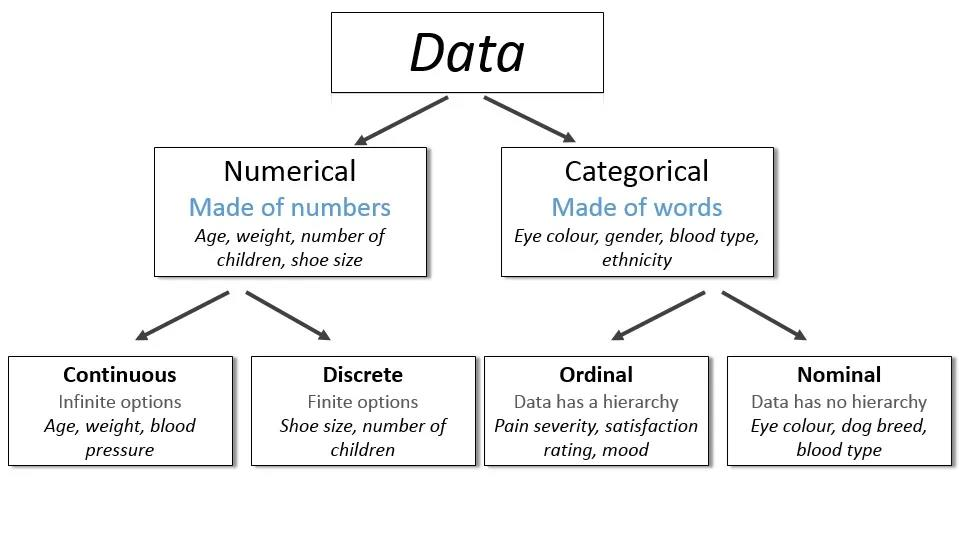
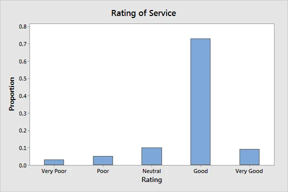
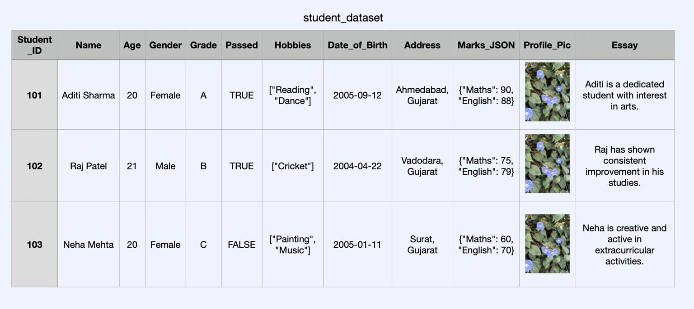

<Complete DAV Notes: Chapter 3 — Dataset and Attributes>
> **Course:** Data Analysis and Visualization
> **Primary Source:** 3.Dataset and Attributes.pdf
> **Files Integrated:** `3.Dataset and Attributes.pdf`

# Chapter 3 — Dataset and Attributes

## 1. Chapter Overview
This chapter covers the fundamental concepts of datasets and attributes in data mining and machine learning. It explores what an attribute is, the different types of attributes (nominal, binary, ordinal, numeric), and the various types of datasets (record data, graph data, ordered data). Furthermore, it categorizes data based on its nature into qualitative and quantitative data, breaking them down into discrete and continuous forms. Important dataset characteristics such as dimensionality, sparsity, and resolution are also detailed.
[Source: 3.Dataset and Attributes.pdf, Slide 1]

---

## 2. Fundamental Concepts

### 2.1 What is an Attribute?
An attribute is a data field representing a characteristic or feature of a data object. Depending on the field of study, it is known by several common terms:
- **Attribute**: Used primarily in Data Mining.
- **Feature**: Used primarily in Machine Learning.
- **Variable**: Used primarily in Statistics.
- **Dimension**: Used primarily in Data Warehousing.

**Example**: For a customer object, the attributes might include Customer ID, Name, and Address.
[Source: 3.Dataset and Attributes.pdf, Slide 2]

### 2.2 Attribute Vector and Distribution
An **attribute vector** is a set of attributes that describes an object. Data can be classified based on the number of attributes involved:
- **Univariate**: Data involving only one attribute.
- **Bivariate**: Data involving exactly two attributes.
- **Multivariate**: Data involving multiple attributes.
[Source: 3.Dataset and Attributes.pdf, Slide 3]

---

## 3. Definitions

### Definition: Nominal Attribute
**Meaning:** An attribute that consists of categorical values or names with no meaningful order.
**Formal definition:** A variable $X$ whose domain $dom(X)$ is a finite set of categories without any natural ordering.
**Intuition:** It simply names a thing. Nominal means "relating to names".
**Example:** Hair Color (black, brown, blond, red), Marital Status (single, married, divorced), Occupation (teacher, farmer, etc.). Even if coded with numbers (e.g., 1 for single, 2 for married), arithmetic operations are meaningless.

### Definition: Binary Attribute
**Meaning:** A special nominal type with only two possible states.
**Formal definition:** A variable $X$ where $dom(X) \in \{0, 1\}$ or $dom(X) \in \{True, False\}$.
**Intuition:** It answers a Yes/No or Present/Absent question.
**Example:** Smoker (0 = No, 1 = Yes), Medical Test (0 = Negative, 1 = Positive).

### Definition: Ordinal Attribute
**Meaning:** An attribute that has ordered categories, but the distance (difference) between the categories is unknown or unquantifiable.
**Formal definition:** A categorical variable $X$ with domain $\{c_1, c_2, \dots, c_k\}$ where an order exists $c_1 \prec c_2 \prec \dots \prec c_k$, but $c_i - c_j$ is not defined.
**Intuition:** You know the ranking, but you don't know "by how much" one rank is better than another.
**Example:** Size (Small < Medium < Large), Grades (A+ > A > B+), Satisfaction Level (0 = Very Dissatisfied to 4 = Very Satisfied).

### Definition: Numeric Attribute
**Meaning:** Quantitative values that are measurable, represented as integers or real values.
**Formal definition:** A variable $X$ mapping to the set of real numbers $\mathbb{R}$ or integers $\mathbb{Z}$.
**Intuition:** Values where arithmetic makes sense.
**Example:** Height, Weight, Temperature.

### Definition: Dimensionality
**Meaning:** The number of attributes (features/variables) present in a dataset.
**Formal definition:** If a dataset $D$ has objects $O_i$ represented as vectors in $\mathbb{R}^d$, then $d$ is the dimensionality.
**Intuition:** How many columns does your data table have.
**Example:** A dataset of students with Student ID, Name, Age, Score, and Attendance has a dimensionality of 5.

### Definition: Sparsity
**Meaning:** The presence of many zero (or empty/NULL) values in a dataset.
**Formal definition:** The proportion of elements in a data matrix that are exactly zero.
**Intuition:** A sparse dataset is mostly empty.
**Example:** In text mining, a document-term matrix is highly sparse because a single document contains only a tiny fraction of the entire vocabulary.

### Definition: Resolution
**Meaning:** The granularity or level of detail of the data values.
**Formal definition:** The smallest increment or step size that can be distinguished in a measurement.
**Intuition:** Are you looking at a map at the city level or street level?
**Example:** Temperature measured to the nearest degree vs nearest hundredth of a degree.

[Source: 3.Dataset and Attributes.pdf, Slides 4-8, 41-43]

---

## 4. Core Concepts

### 4.1 Types of Numeric Attributes

#### Interval-Scaled Attributes
- **Characteristics:** They have equal intervals between points, but no absolute (true) zero point.
- **Operations:** Arithmetic difference is meaningful, but multiplication/division is not.
- **Example:** Temperature in °C or °F. 20°C is 5° more than 15°C, but 20°C is NOT twice as hot as 10°C (because 0°C is not the absence of heat). Calendar dates are also interval-scaled.

#### Ratio-Scaled Attributes
- **Characteristics:** They have a true, absolute zero point representing the absence of the quantity.
- **Operations:** Can compute ratios, differences, mean, median, mode.
- **Example:** Years of experience, Weight, Height, Income. ₹100 is exactly 10 times ₹10.

### 4.2 Symmetric vs Asymmetric Binary Attributes
- **Symmetric:** Both states are equally important and carry the same weight. Example: Gender (Male/Female).
- **Asymmetric:** One state is more important or rarer than the other. Usually, the rare state is coded as 1. Example: HIV test (Positive=1 is much more significant/rare than Negative=0).

### 4.3 Discrete vs Continuous Attributes
- **Discrete:** Have finite or countably infinite values. Examples: Hair Color, Zip Code, Age in integers (0-110), Smoker status (0/1).
- **Continuous:** Can take on infinite real values (fractional/decimal). Usually stored as floating-point values. Examples: Height, Weight, Temperature.
[Source: 3.Dataset and Attributes.pdf, Slides 9-11, 38-39]

---

## 5. Types of Datasets

Datasets are primarily classified based on their structure and relationships into three main categories: Record Data, Graph Data, and Ordered Data.

### 5.1 Record Data
Record data is usually stored in flat files or relational databases. Every data object has the same set of numerical or categorical features.

#### Application
Student records, Employee details.

#### Special Case: Transaction or Market Basket Data
- **Description:** Each record contains a set of items (e.g., shopping cart).
- **Structure:** It is a collection of item sets, but can be viewed as a set of records with asymmetric binary attributes indicating whether an item was purchased (True/1) or not (False/0).
- **Example:** Online shopping dataset.

#### The Data Matrix
If every object has the same numerical features, it can be visualized as a point in space. The data is organized into an $m \times n$ matrix:
- $m$ rows = objects
- $n$ columns = features (dimensions)
This allows mathematical transformations and is the standard format for statistics and machine learning.

#### Sparse Data Matrix (Document-Term Matrix)
A special case where attributes are of the same type and asymmetric (only non-zero values matter). For example, documents represented by word counts.

### 5.2 Graph-Based Data
Represents information using a network structure:
- **Nodes (Vertices):** Entities like people, objects, atoms.
- **Edges (Links):** Relationships or connections between entities.
- **Examples:** Linked web pages, Benzene molecule (Nodes=atoms, Edges=chemical bonds), Movie database networks.

### 5.3 Ordered Data
Data where the attributes have relationships involving order in time or space.

#### Sequential Data
Record data with timestamps. Order over time matters.
- **Example:** $(t_1, C_1, \text{buys } A, B)$, $(t_2, C_2, \text{buys } C)$.
- **Used in:** Customer behavior tracking, clickstream analysis, patient records.

#### Sequence Data
Ordered based on position, not actual time. No timestamps.
- **Example:** DNA Sequence (A-T-C-G-G-C-A).
- **Used in:** Genomics, NLP, Speech recognition.

#### Time Series Data
Sequence of values measured at regular time intervals (consistent timestamps).
- **Example:** Stock prices (Day 1: ₹150, Day 2: ₹152).
- **Used in:** Finance, Weather forecasting, Sensor readings.

#### Spatial Data
Includes location-based attributes tied to geographical coordinates. Order based on space.
- **Example:** $(Lat: 23.5, Long: 72.6) \rightarrow 30^\circ C$.
- **Used in:** GIS, Urban planning.
[Source: 3.Dataset and Attributes.pdf, Slides 12-30]

---

## 6. Mathematical Foundations & Matrices

### 6.1 The Data Matrix
A dataset of $m$ objects and $n$ variables can be represented as:
$$
X = \begin{bmatrix}
x_{11} & x_{12} & \dots & x_{1n} \\
x_{21} & x_{22} & \dots & x_{2n} \\
\vdots & \vdots & \ddots & \vdots \\
x_{m1} & x_{m2} & \dots & x_{mn}
\end{bmatrix}
$$
**Where:**
- $X$: The data matrix.
- $x_{ij}$: The value of the $j$-th attribute for the $i$-th object.
- $m$: Number of objects (rows).
- $n$: Number of attributes (columns / dimensionality).
[Source: 3.Dataset and Attributes.pdf, Slide 17]

---

## 7. Data By Nature: Qualitative vs Quantitative

### 7.1 Qualitative (Categorical) Data
Descriptive data that falls within a countable number of groups. Not measurable with numbers. Cannot do math on them.
- **Nominal Data:** No inherent order (e.g., colors, marital status).
- **Ordinal Data:** Ordering matters, numbers can have mathematical meaning as ranks, but differences are unquantifiable (e.g., star ratings 0 to 4).

### 7.2 Quantitative (Numerical) Data
Information recorded as numbers representing an objective measurement or count.
- **Discrete Data:** Finite number of possible values, count of items. Cannot be meaningfully divided (e.g., number of cars in a household).
- **Continuous Data:** Can take almost any numeric value, meaningfully divisible into fractions/decimals (e.g., height, weight).

[Source: 3.Dataset and Attributes.pdf, Slides 31-39]

---

## 8. Dataset Characteristics (Curse of Dimensionality)

When managing datasets, three characteristics are paramount:

1. **Dimensionality:** 
   - Refers to the number of columns/attributes.
   - **Curse of Dimensionality:** When the number of attributes is very high, data analysis becomes exceedingly difficult because data becomes sparse and less meaningful. Space volume grows exponentially.
   
2. **Sparsity:**
   - Datasets with many empty, NULL, or zero values. 
   - Asymmetric features often lead to sparsity where < 1% entries are non-zero.
   - Example: Missing assignments in a student database, or word counts in document analysis.

3. **Resolution:**
   - The granularity of data values. 
   - Too fine: Pattern buried in noise.
   - Too coarse: Pattern disappears.
   - **Types:**
     - Spatial Resolution: Smallest unit captured (e.g., pixels).
     - Temporal Resolution: Frequency of recording (e.g., per second vs day).
     - Measurement Resolution: Precision of numbers.

[Source: 3.Dataset and Attributes.pdf, Slides 41-44]

---

## 9. Examples

### Example: Transaction Data Matrix Transformation
**Given:**
Transaction database:
TID 1: Apple, Banana, Milk, Rice
TID 2: Guava, Curd, Rice
TID 3: Apple, Guava, Curd, Rice

**Solution / Explanation:**
Convert to Asymmetric Binary Matrix. Columns = All unique items. Rows = TIDs.
TID 1: Apple=True, Banana=True, Curd=False, Guava=False, Milk=True, Rice=True
TID 2: Apple=False, Banana=False, Curd=True, Guava=True, Milk=False, Rice=True
TID 3: Apple=True, Banana=False, Curd=True, Guava=True, Milk=False, Rice=True

**Result:**
The transaction data is now structured as an $m \times n$ asymmetric boolean matrix, which allows machine learning algorithms to process it.

[Source: 3.Dataset and Attributes.pdf, Slide 16]

---

## 10. Tables and Comparisons

### Table 3.1: Nominal vs Ordinal vs Numeric

| Characteristic | Nominal | Ordinal | Numeric (Interval/Ratio) |
| :--- | :--- | :--- | :--- |
| **Meaningful Order?** | No | Yes | Yes |
| **Quantifiable Differences?** | No | No | Yes |
| **Arithmetic Operations?** | None | Rank comparisons ($<, >$) | $+,-,\times, \div$ |
| **Examples** | Hair Color, Zip Code | Grades, T-Shirt Sizes | Age, Height, Temperature |

### Table 3.2: Interval vs Ratio

| Characteristic | Interval-Scaled | Ratio-Scaled |
| :--- | :--- | :--- |
| **True Zero Point** | No | Yes |
| **Meaningful Differences** | Yes | Yes |
| **Meaningful Ratios** | No | Yes |
| **Examples** | Celsius, Fahrenheit, Dates | Kelvin, Weight, Income, Age |

### Table 3.3: Discrete vs Continuous

| Characteristic | Discrete | Continuous |
| :--- | :--- | :--- |
| **Values** | Countable, distinct integers | Infinite real numbers, fractions |
| **Measurement Type** | Counting (e.g., number of cars) | Measuring (e.g., weight) |
| **Examples** | Smoker (0/1), Number of children | Temperature, Height (5.9 ft) |

[Source: 3.Dataset and Attributes.pdf]

---

## 11. Key Takeaways

1. **Attributes** define the properties of data objects. Knowing whether an attribute is nominal, binary, ordinal, or numeric dictates which mathematical operations and algorithms are valid.
2. **Interval vs Ratio**: Remember that temperature in Celsius cannot be divided (20°C is not twice as hot as 10°C), while Income can (₹100 is twice ₹50).
3. **Curse of Dimensionality**: High dimensional data becomes sparse. Feature selection or dimensionality reduction is crucial.
4. **Resolution**: Analyzing data at the wrong resolution (too detailed or too summarized) can completely obscure the underlying patterns.
5. **Data Structures**: Not all data is tabular. Real-world data frequently takes the form of Graphs (networks), Sequences (DNA), or Time-Series (stock market).

---

## Definition Sheet
- **Attribute**: A characteristic or feature of a data object.
- **Univariate**: Having one attribute.
- **Nominal**: Categorical without order.
- **Binary**: Two-state categorical (Symmetric or Asymmetric).
- **Ordinal**: Categorical with meaningful order but unknown intervals.
- **Numeric**: Quantitative measurements (Interval or Ratio scaled).
- **Curse of Dimensionality**: The phenomenon where data space becomes sparse and algorithms degrade as the number of features increases.
- **Sparsity**: A dataset where the vast majority of entries are zero or empty.

---

## Exam-Oriented Review

**Q: Why is temperature in Celsius interval-scaled and not ratio-scaled?**
**A:** Celsius has no absolute zero. 0°C is the freezing point of water, not the complete absence of heat. Therefore, taking ratios (e.g., 20°C / 10°C) does not yield meaningful physical ratios.

**Q: Differentiate between Sequence Data and Time Series Data.**
**A:** Sequence data is ordered by position without explicit timestamps (e.g., DNA sequence). Time Series data is measured at consistent time intervals with exact timestamps (e.g., daily stock prices).

**Q: What is a Document-Term Matrix and why is it sparse?**
**A:** It represents documents as rows and vocabulary words as columns, with cell values being word counts. It is sparse because a single document only uses a tiny fraction of the total vocabulary, leaving most cells as zero.

**Q: Explain the difference between spatial, temporal, and measurement resolution.**
**A:** Spatial resolution deals with physical area size (pixels on a map). Temporal resolution deals with time intervals (data collected every second vs every hour). Measurement resolution deals with precision (age in years vs days).
