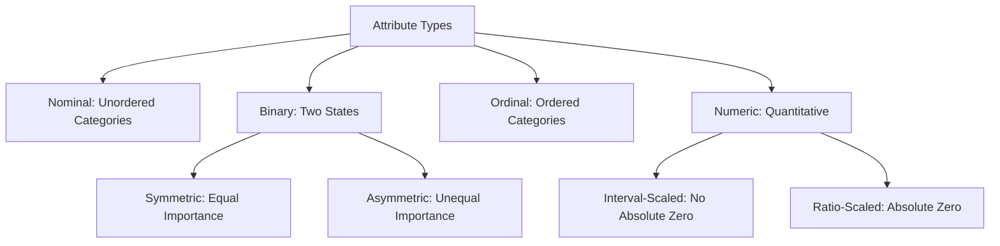

<Complete DAV Notes: Chapter 3 — Dataset and Attributes>
> **Course:** Data Analysis and Visualization
> **Primary Source:** 3.Dataset and Attributes.pdf
> **Files Integrated:** `3.Dataset and Attributes.pdf`

# Chapter 3 — Dataset and Attributes

## Source map

- `3.Dataset and Attributes.pdf` — primary course presentation file.

---

## 1. Chapter Overview
This chapter covers datasets, attribute types, and structural properties in data mining. Key topics include attribute taxonomy (nominal, binary, ordinal, numeric), dataset structures (record, graph, ordered, time series), matrix representations (Data Matrix, Document-Term Matrix), characteristics (dimensionality, sparsity, resolution), and data representation formats (ungrouped vs grouped class tables).
[Source: 3.Dataset and Attributes.pdf, Slide 1]

---

## 2. Fundamental Concepts

### Definition: Attribute
**Meaning:** A data field representing a property or feature of a data object.
**Synonyms:** Feature (ML), Variable (Statistics), Column (Databases), Dimension (Data Warehousing).

### Definition: Attribute Vector
**Meaning:** An ordered tuple of attribute values representing a single data instance/object.
$$\mathbf{x}_i = [x_{i1}, x_{i2}, \dots, x_{in}]^T \in \mathbb{R}^n$$

---

## 3. Attribute Taxonomy

### 1. Nominal Attributes
Categories without inherent ordering.
- **Example:** $\text{MaritalStatus} \in \{\text{Single}, \text{Married}, \text{Divorced}\}$.

### 2. Binary Attributes
Nominal attribute with exactly two states ($0$ and $1$).
- **Symmetric Binary:** Both values carry equal weight. Example: $\text{Gender} \in \{\text{Male}, \text{Female}\}$.
- **Asymmetric Binary:** Presence ($1$) is rare and far more significant than absence ($0$). Example: $\text{MedicalTest} \in \{\text{Positive}=1, \text{Negative}=0\}$.

### 3. Ordinal Attributes
Ordered categorical values where intervals between categories are unknown.
- **Example:** $\text{CustomerRating} \in \{\text{Poor}=1, \text{Fair}=2, \text{Good}=3, \text{Excellent}=4\}$.

### 4. Numeric Attributes
Quantitative values measured on an interval or ratio scale.
- **Interval-Scaled:** Equal intervals but no true zero. Example: Temperature in Celsius ($20^\circ\text{C}$).
- **Ratio-Scaled:** Equal intervals with a true non-arbitrary zero point. Example: Salary ($\$50,000$).

---

## 4. Dataset Types & Matrix Formats

### 1. Record Data & The Data Matrix
A dataset of $m$ objects and $n$ attributes stored as an $m \times n$ matrix:

$$
\mathbf{X} = \begin{bmatrix}
x_{11} & x_{12} & \dots & x_{1n} \\
x_{21} & x_{22} & \dots & x_{2n} \\
\vdots & \vdots & \ddots & \vdots \\
x_{m1} & x_{m2} & \dots & x_{mn}
\end{bmatrix}_{m \times n}
$$

### 2. Document-Term Matrix (Sparse Matrix)
Represents text documents as vectors of term frequencies. Columns represent terms, rows represent documents.

| Document | Term: `data` | Term: `mining` | Term: `python` | Term: `viz` |
| :--- | :---: | :---: | :---: | :---: |
| **Doc 1** | $3$ | $2$ | $0$ | $0$ |
| **Doc 2** | $0$ | $1$ | $4$ | $1$ |
| **Doc 3** | $1$ | $0$ | $0$ | $5$ |

### 3. Graph Data
Objects represented as nodes $V$ and relationships as edges $E$: $G = (V, E)$.
- **Examples:** Social networks, chemical molecular structures, web page hyperlink graphs.

### 4. Ordered Data
Data where sequence matters:
- **Sequential Data:** Timestamped transaction records.
- **Sequence Data:** Ordered strings without timestamps (e.g., DNA: $\text{A-T-C-G-G-C}$).
- **Time Series Data:** Uniformly sampled continuous measurements over time.
- **Spatial Data:** Attribute values indexed by geographical coordinates $(x, y, z)$.

---

## 5. Data Representation Formats: Ungrouped vs Grouped

### 1. Ungrouped (Raw) Attributes
Raw individual data points recorded directly:
$$\text{Ages} = \{21, 22, 22, 25, 29, 30, 31, 35, 42, 48\}$$

### 2. Grouped Frequency Table
Aggregated numeric attributes grouped into continuous class intervals:

| Class Interval (CI) | Midpoint ($x_i$) | Frequency ($f_i$) | Relative Frequency | Cumulative Frequency ($CF$) |
| :---: | :---: | :---: | :---: | :---: |
| $20 - 30$ | $25$ | $5$ | $0.50$ | $5$ |
| $30 - 40$ | $35$ | $3$ | $0.30$ | $8$ |
| $40 - 50$ | $45$ | $2$ | $0.20$ | $10$ |
| **Total** | — | $N = 10$ | $1.00$ | — |

---

## 6. Dataset Characteristics & Edge Cases

| Characteristic / Edge Case | Description | Problem / Mitigation |
| :--- | :--- | :--- |
| **Dimensionality** | Number of features $n$ in $\mathbf{X}$ | High dimensionality causes the **Curse of Dimensionality** (sparse space, distance metrics break). Use PCA or Feature Selection. |
| **Sparsity** | Fraction of zero/NULL values in matrix | Storing full matrix wastes memory. Use specialized **Sparse Matrix** formats (CSR, COO). |
| **Resolution** | Granularity of measurements | Aggregating too coarsely loses key patterns; too fine adds high-frequency noise. Select appropriate temporal/spatial binning. |
| **Imbalanced Asymmetric Binary** | $99.9\%$ zeros, $0.1\%$ ones (e.g., fraud) | Accuracy metric fails ($99.9\%$ dummy classifier). Use Precision-Recall, F1-score, or Jaccard coefficient. |

---

## Formula Sheet

### 1. Data Matrix Element Access
$$ x_{ij} \quad \text{where } i \in \{1, \dots, m\}, \, j \in \{1, \dots, n\} $$

### 2. Matrix Sparsity Ratio
$$ \text{Sparsity} = 1 - \frac{\text{Count of Non-Zero Elements}}{m \times n} $$

### 3. Jaccard Similarity (Asymmetric Binary Attributes)
$$ J(A, B) = \frac{q}{q + r + s} $$
where $q = f_{11}$, $r = f_{10}$, $s = f_{01}$.

---

## Definition Sheet
- **Attribute:** A feature or characteristic describing a data instance.
- **Dimensionality:** The number of attributes describing objects in a dataset.
- **Sparsity:** The condition where most entries in a dataset matrix are zero or empty.
- **Resolution:** The scale or level of detail at which data is collected or displayed.
- **Asymmetric Binary Attribute:** A binary feature where presence (1) is far more significant than absence (0).
- **Document-Term Matrix:** A mathematical representation of text documents as vectors of word frequencies.

---

## Exam-Oriented Review

**Q1: What is the Curse of Dimensionality?**
**A:** As the number of attributes (dimensions) $n$ grows, the volume of the space grows exponentially, making data points extremely sparse. Distance measures (like Euclidean distance) lose contrast, rendering traditional clustering and classification algorithms inefficient.

**Q2: Differentiate between Symmetric and Asymmetric Binary Attributes.**
**A:** Symmetric binary attributes carry equal importance for both outcomes ($0$ and $1$), such as Gender (Male/Female). Asymmetric binary attributes prioritize the presence ($1$) of a rare state over its absence ($0$), such as Disease Diagnosis (Positive/Negative).

**Q3: Explain the Document-Term Matrix with an example.**
**A:** A Document-Term Matrix represents textual documents as rows and vocabulary terms as columns. Cells store term frequencies. Because any single document uses only a tiny subset of the global vocabulary, the resulting matrix is highly sparse.
