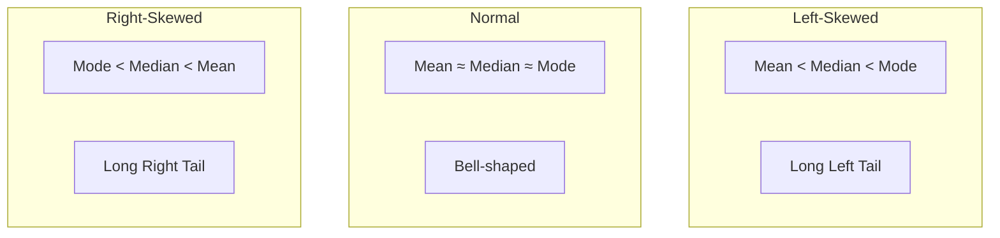
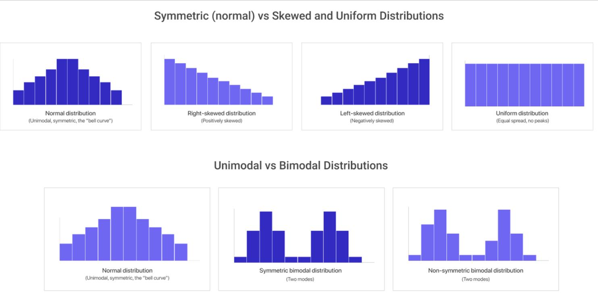
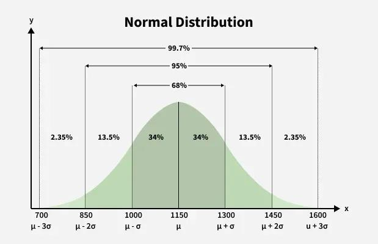
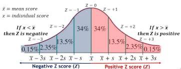
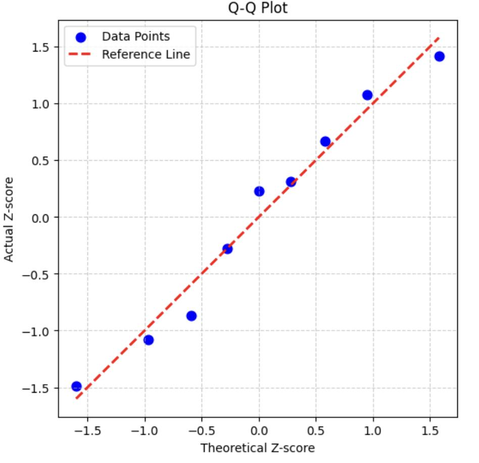

<Complete DAV Notes: Chapter 4 — Statistical Descriptions of Data>
> **Course:** Data Analysis and Visualization
> **Primary Source:** 4.Statistical Descriptions of Data_new.pdf
> **Files Integrated:** `4.Statistical Descriptions of Data_new.pdf`

# Chapter 4 — Statistical Descriptions of Data

## Source map

- `4.Statistical Descriptions of Data_new.pdf` — primary course presentation file.

---

## 1. Chapter Overview
This chapter provides an exhaustive foundation for the statistical description of data, an essential step in data analysis and preprocessing. Before applying advanced machine learning, deep learning, or data mining algorithms, one must deeply understand the basic characteristics of the data at hand. The core topics include:
- Measuring the central tendency of data (Mean, Weighted Mean, Trimmed Mean, Median, Mode).
- Measuring the dispersion or spread of data (Range, Quartiles, Percentiles, Interquartile Range, Variance, Standard Deviation, Z-scores).
- Understanding the shape of the distribution (Skewness, Kurtosis).
- Analyzing the relationships between multiple variables (Covariance, Correlation, Chi-square Test for categorical data).
- Visualizing data using graphical representations such as Boxplots, Histograms, Frequency Polygons, Scatter Plots, and Q-Q Plots.

By comprehensively summarizing these aspects, data scientists can identify outliers, handle missing values, and select the appropriate statistical models.
[Source: 4.Statistical Descriptions of Data_new.pdf, Slide 2]

---

## 2. Fundamental Concepts

### Definition: Basic Statistical Description
**Meaning:** Statistical descriptions are summary measures used to concisely describe the central properties, spread, and shape of a dataset.
**Formal definition:** A set of descriptive statistics that provide simple mathematical summaries about the sample and the measures, condensing a massive vector or matrix of data points into a few interpretable parameters.
**Intuition:** It gives a high-level "bird's-eye view" of a dataset. Instead of looking at millions of records, you look at a handful of metrics that describe the typical behavior and the deviations from that behavior.
**Example:** Analyzing a dataset of millions of bank transactions, the statistical description might reveal that the mean transaction is $120, the median is $45, and the standard deviation is $1,200, immediately indicating a highly skewed distribution with extreme high-value outliers.
[Source: 4.Statistical Descriptions of Data_new.pdf, Slide 4]

---

## 3. Definitions & Core Concepts: Central Tendency

### Definition: Arithmetic Mean
**Meaning:** The mathematical average of a set of numbers, giving equal weight to each observation.
**Formal definition:** The sum of the sampled values divided by the total number of items in the sample.
**Intuition:** The center of mass or balance point of the data distribution. If you replaced every value with the mean, the total sum would remain unchanged.
**Example:** The mean of $\{2, 4, 6\}$ is $(2+4+6)/3 = 4$.
[Source: 4.Statistical Descriptions of Data_new.pdf, Slide 6]

### Definition: Weighted Mean
**Meaning:** An average where some data points contribute more than others.
**Formal definition:** The sum of the products of the values and their corresponding weights, divided by the sum of the weights.
**Intuition:** Used when certain observations are more important, more reliable, or represent larger subgroups.
**Example:** Calculating a course grade where the final exam is worth 60% and homework is worth 40%.
[Source: 4.Statistical Descriptions of Data_new.pdf, Slide 8]

### Definition: Trimmed Mean
**Meaning:** A measure of central tendency designed to be less sensitive to outliers by removing a specified percentage of the lowest and highest values before calculating the mean.
**Formal definition:** The mean calculated after discarding the lowest $k\%$ and the highest $k\%$ of the sorted data.
**Intuition:** Combines the robustness of the median with the informational efficiency of the mean.
**Example:** A 10% trimmed mean of 100 values would discard the top 10 and bottom 10 values, calculating the average of the remaining 80 values.
[Source: 4.Statistical Descriptions of Data_new.pdf, Slide 9]

### Definition: Median
**Meaning:** The middle value of a dataset when ordered from lowest to highest.
**Formal definition:** The 50th percentile of a distribution.
- **For odd $n$:** The value at position $\frac{n+1}{2}$.
- **For even $n$:** The average of the values at positions $\frac{n}{2}$ and $\frac{n}{2} + 1$.
**Intuition:** It perfectly splits the dataset into two equal-sized halves. It is extremely robust to outliers.
**Example:** For $\{2, 4, 100\}$, the median is 4 (unlike the mean, which is 35.33).
[Source: 4.Statistical Descriptions of Data_new.pdf, Slide 11]

### Definition: Mode
**Meaning:** The value that occurs most frequently in a dataset.
**Formal definition:** The value $x_i$ in a dataset that has the highest frequency of occurrence.
**Intuition:** Represents the most common or "typical" case. Datasets can be unimodal (one mode), bimodal (two modes), or multimodal (many modes).
**Example:** In $\{1, 2, 2, 3\}$, the mode is 2.
[Source: 4.Statistical Descriptions of Data_new.pdf, Slide 15]

---

## 4. Definitions & Core Concepts: Data Dispersion

### Definition: Range
**Meaning:** The absolute difference between the maximum and minimum values in the dataset.
**Formal definition:** $Range = Max(x) - Min(x)$
**Intuition:** Gives a quick sense of the total spread of the data, but is highly susceptible to single extreme outliers.
**Example:** For $\{10, 20, 30, 100\}$, Range = $100 - 10 = 90$.
[Source: 4.Statistical Descriptions of Data_new.pdf, Slide 18]

### Definition: Percentiles and Quartiles
**Meaning:** Values that divide the sorted dataset into 100 equal parts (percentiles) or 4 equal parts (quartiles).
**Formal definition:** 
- The $k$-th percentile ($P_k$) is a value such that $k\%$ of the observations are less than or equal to it.
- **Q1 (First Quartile):** The 25th percentile.
- **Q2 (Second Quartile):** The 50th percentile (Median).
- **Q3 (Third Quartile):** The 75th percentile.
**Intuition:** They help describe the position of a specific observation relative to the rest of the data.
**Example:** Scoring in the 90th percentile on a test means you scored higher than 90% of the test-takers.
[Source: 4.Statistical Descriptions of Data_new.pdf, Slide 21]

### Definition: Interquartile Range (IQR)
**Meaning:** The difference between the 75th percentile (Q3) and the 25th percentile (Q1).
**Formal definition:** $IQR = Q3 - Q1$.
**Intuition:** It measures the spread of the middle 50% of the data. Because it ignores the bottom 25% and top 25%, it is highly robust to extreme outliers.
**Example:** If Q3 is 85 and Q1 is 60, IQR = 25.
[Source: 4.Statistical Descriptions of Data_new.pdf, Slide 23]

### Definition: Variance
**Meaning:** A measure of how far each number in the set is from the mean and thus from every other number in the set.
**Formal definition:** The average of the squared differences from the Mean.
**Intuition:** If all values are identical, variance is 0. A larger variance indicates the data points are widely spread out. Squaring the differences ensures positive and negative deviations don't cancel each other out, and it heavily penalizes larger deviations.
**Example:** See Section 9 for a fully worked numerical example.
[Source: 4.Statistical Descriptions of Data_new.pdf, Slide 26]

### Definition: Standard Deviation
**Meaning:** The square root of the variance.
**Formal definition:** $\sigma = \sqrt{\sigma^2}$.
**Intuition:** By taking the square root, the standard deviation is expressed in the same units as the original data, making it much more interpretable than variance.
**Example:** If variance is $25 \text{ kg}^2$, standard deviation is $5 \text{ kg}$.
[Source: 4.Statistical Descriptions of Data_new.pdf, Slide 27]

---

## 5. Definitions & Core Concepts: Shape of Distribution

### Definition: Skewness
**Meaning:** A measure of the asymmetry of the probability distribution of a real-valued random variable about its mean.
**Formal definition:** The third standardized moment of the distribution.
**Intuition:** 
- **Positive Skew (Right-skewed):** The right tail is longer or fatter. Mass is concentrated on the left. (Mean > Median).
- **Negative Skew (Left-skewed):** The left tail is longer or fatter. Mass is concentrated on the right. (Mean < Median).
- **Symmetric:** Zero skewness. (Mean $\approx$ Median).
**Example:** Human income is right-skewed because a small number of billionaires stretch the right tail far out.
[Source: 4.Statistical Descriptions of Data_new.pdf, Slide 30]

### Definition: Kurtosis
**Meaning:** A measure of the "tailedness" of the probability distribution, describing how often outliers occur.
**Formal definition:** The fourth standardized moment.
**Intuition:** 
- **Leptokurtic (High Kurtosis):** Fat tails, sharp peak. Higher probability of extreme outliers compared to a normal distribution.
- **Platykurtic (Low Kurtosis):** Thin tails, flat peak. Lower probability of outliers.
- **Mesokurtic:** Normal distribution (Kurtosis = 3).
**Example:** Stock market returns typically exhibit leptokurtic distributions (frequent extreme crashes/spikes).
[Source: 4.Statistical Descriptions of Data_new.pdf, Slide 33]

---

## 6. Definitions & Core Concepts: Bivariate Statistics

### Definition: Covariance
**Meaning:** A measure of the joint variability of two random variables.
**Formal definition:** The expected value of the product of their deviations from their individual expected values.
**Intuition:** 
- Positive Covariance: When $X$ is above its mean, $Y$ tends to be above its mean (they move together).
- Negative Covariance: When $X$ is above its mean, $Y$ tends to be below its mean (inverse relationship).
- Zero Covariance: No linear relationship.
**Example:** Height and weight usually have positive covariance.
[Source: 4.Statistical Descriptions of Data_new.pdf, Slide 40]

### Definition: Pearson Correlation Coefficient
**Meaning:** A normalized, scale-free measure of covariance that quantifies the strength and direction of the linear relationship between two variables.
**Formal definition:** The covariance of the two variables divided by the product of their standard deviations.
**Intuition:** Bounded between -1 and 1. 
- $+1$: Perfect positive linear relationship.
- $-1$: Perfect negative linear relationship.
- $0$: No linear relationship (but could still have non-linear dependence).
**Example:** The correlation between outdoor temperature and heating bill costs might be $-0.85$.
[Source: 4.Statistical Descriptions of Data_new.pdf, Slide 43]

---

## 7. Mathematical Foundations & Formulas

### Mean Formula
$$ \bar{x} = \frac{1}{n} \sum_{i=1}^{n} x_i $$
**Where:**
- $\bar{x}$: Sample mean
- $n$: Total number of observations
- $x_i$: Value of the $i$-th observation
**Meaning:** Computes the arithmetic average.
**Conditions:** Applicable to interval/ratio data. Highly sensitive to outliers.

### Weighted Mean Formula
$$ \bar{x}_w = \frac{\sum_{i=1}^{n} w_i x_i}{\sum_{i=1}^{n} w_i} $$
**Where:**
- $\bar{x}_w$: Weighted mean
- $w_i$: Weight of the $i$-th observation
- $x_i$: Value of the $i$-th observation
**Meaning:** Computes the average adjusting for the varying significance (weights) of each data point.

### Mode Approximation Formula (Empirical Relation)
$$ Mode \approx 3 \times Median - 2 \times Mean $$
**Where:**
- Mode, Median, Mean represent the central tendencies.
**Meaning:** In unimodal distributions that are moderately skewed, this empirical formula allows estimation of the mode from the mean and median.
**Conditions:** Only works well for moderately skewed unimodal distributions.

### Percentile Formula (Index Calculation)
$$ i = \frac{p}{100} \times (n + 1) $$
**Where:**
- $i$: The rank or index position in the sorted dataset
- $p$: The desired percentile (e.g., 25 for Q1)
- $n$: Total number of observations
**Meaning:** Determines the exact position of the required percentile. If $i$ is not an integer, interpolate between the values at $\lfloor i \rfloor$ and $\lceil i \rceil$.

### Sample Variance Formula
$$ s^2 = \frac{1}{n-1} \sum_{i=1}^{n} (x_i - \bar{x})^2 $$
**Where:**
- $s^2$: Sample variance
- $x_i$: Individual data point
- $\bar{x}$: Sample mean
- $n$: Number of data points
**Meaning:** The average squared deviation from the sample mean.
**Conditions:** Uses $n-1$ (Bessel's correction) to provide an unbiased estimator of the population variance.

### Population Variance Formula
$$ \sigma^2 = \frac{1}{N} \sum_{i=1}^{N} (x_i - \mu)^2 $$
**Where:**
- $\sigma^2$: Population variance
- $\mu$: Population mean
- $N$: Population size

### Z-Score (Standardization) Formula
$$ z_i = \frac{x_i - \mu}{\sigma} $$
**Where:**
- $z_i$: The standard score for data point $x_i$
- $\mu$: Mean of the population
- $\sigma$: Standard deviation of the population
**Meaning:** Tells us how many standard deviations a value $x_i$ is away from the mean.
**Conditions:** Often used to normalize features before feeding them into machine learning algorithms (e.g., K-Means, SVM).

### Outlier Detection (Tukey's Fences)
$$ \text{Lower Bound} = Q1 - 1.5 \times IQR $$
$$ \text{Upper Bound} = Q3 + 1.5 \times IQR $$
**Where:**
- $Q1$: First quartile
- $Q3$: Third quartile
- $IQR$: Interquartile range ($Q3 - Q1$)
**Meaning:** Any data point falling below the Lower Bound or above the Upper Bound is flagged as an outlier (suspected anomaly).

### Skewness Formula (Fisher-Pearson Coefficient)
$$ g_1 = \frac{\frac{1}{n} \sum_{i=1}^n (x_i - \bar{x})^3}{\left[\frac{1}{n} \sum_{i=1}^n (x_i - \bar{x})^2\right]^{3/2}} $$
**Where:**
- $g_1$: Skewness coefficient
- $x_i$: Data points
- $\bar{x}$: Sample mean
**Meaning:** Uses the third moment to measure asymmetry.

### Kurtosis Formula
$$ g_2 = \frac{\frac{1}{n} \sum_{i=1}^n (x_i - \bar{x})^4}{\left[\frac{1}{n} \sum_{i=1}^n (x_i - \bar{x})^2\right]^{2}} - 3 $$
**Where:**
- $g_2$: Excess kurtosis
**Meaning:** Uses the fourth moment. The "-3" term makes the normal distribution have an excess kurtosis of 0.

### Covariance Formula (Sample)
$$ Cov(X,Y) = \frac{1}{n-1} \sum_{i=1}^{n}(x_i - \bar{x})(y_i - \bar{y}) $$
**Where:**
- $x_i, y_i$: Data points of variables X and Y
- $\bar{x}, \bar{y}$: Sample means of X and Y

### Pearson Correlation Coefficient Formula
$$ r_{x,y} = \frac{Cov(x,y)}{s_x s_y} = \frac{\sum_{i=1}^{n}(x_i - \bar{x})(y_i - \bar{y})}{\sqrt{\sum_{i=1}^{n}(x_i - \bar{x})^2} \sqrt{\sum_{i=1}^{n}(y_i - \bar{y})^2}} $$
**Where:**
- $r_{x,y}$: Pearson correlation coefficient
- $s_x, s_y$: Standard deviations of X and Y
**Meaning:** Normalized measure of linear dependence between -1 and +1.

### Chi-Square Statistic Formula
$$ \chi^2 = \sum_{i} \sum_{j} \frac{(O_{ij} - E_{ij})^2}{E_{ij}} $$
**Where:**
- $O_{ij}$: Observed frequency in cell $(i, j)$
- $E_{ij}$: Expected frequency in cell $(i, j)$
**Meaning:** Tests the independence of two categorical variables based on a contingency table.
**Conditions:** Expected frequencies $E_{ij}$ should typically be $\ge 5$ to be valid.

[Source: 4.Statistical Descriptions of Data_new.pdf, Slides 50-60]

---

## 8. Algorithms / Procedures

### Algorithm 1: Five-Number Summary & Outlier Detection
**Purpose:** To summarize a distribution robustly and mathematically identify outliers.
**Input:** A list of $n$ numerical values $X = \{x_1, x_2, \dots, x_n\}$.
**Output:** The five-number summary and a list of outliers.
**Procedure:**
1. **Sort:** Sort the dataset $X$ in ascending order.
2. **Minimum:** Identify $Min(X)$.
3. **Q1:** Find the median of the lower half of the dataset (excluding the global median if $n$ is odd).
4. **Median (Q2):** Find the middle value of $X$.
5. **Q3:** Find the median of the upper half of the dataset (excluding the global median if $n$ is odd).
6. **Maximum:** Identify $Max(X)$.
7. **IQR:** Calculate $IQR = Q3 - Q1$.
8. **Fences:** Compute $Lower = Q1 - 1.5 \times IQR$ and $Upper = Q3 + 1.5 \times IQR$.
9. **Outlier Check:** Any $x_i < Lower$ or $x_i > Upper$ is an outlier.
**Complexity:** Time $O(n \log n)$ due to sorting, Space $O(1)$ assuming in-place sort.

---

## 9. Fully Worked Examples

### Example 1: Comparing Mean, Median, Mode (Central Tendency)
**Given Dataset:** $\{4, 2, 8, 4, 100\}$ (Notice the extreme outlier '100')
**Solution / Explanation:**
1. **Mean:** Sum $= 4 + 2 + 8 + 4 + 100 = 118$. Count $= 5$. Mean $= 118 / 5 = 23.6$.
2. **Median:** Sort the data $\rightarrow \{2, 4, 4, 8, 100\}$. The middle value (position 3) is 4. Median $= 4$.
3. **Mode:** The value that appears most often is 4 (appears twice). Mode $= 4$.
**Result:** The mean (23.6) is heavily distorted by the outlier (100) and represents nothing about the typical data point. The median (4) perfectly represents the bulk of the data. This highlights why the median is preferred for skewed data.

### Example 2: Calculating Variance and Standard Deviation
**Given Dataset:** $\{4, 8, 6, 5, 3\}$
**Solution / Explanation:**
1. Calculate the mean:
$$ \bar{x} = \frac{4 + 8 + 6 + 5 + 3}{5} = \frac{26}{5} = 5.2 $$
2. Calculate the squared deviations $(x_i - \bar{x})^2$:
   - $x_1 = 4: (4 - 5.2)^2 = (-1.2)^2 = 1.44$
   - $x_2 = 8: (8 - 5.2)^2 = (2.8)^2 = 7.84$
   - $x_3 = 6: (6 - 5.2)^2 = (0.8)^2 = 0.64$
   - $x_4 = 5: (5 - 5.2)^2 = (-0.2)^2 = 0.04$
   - $x_5 = 3: (3 - 5.2)^2 = (-2.2)^2 = 4.84$
3. Sum the squared differences:
$$ \sum = 1.44 + 7.84 + 0.64 + 0.04 + 4.84 = 14.8 $$
4. Calculate sample variance (divide by $n-1 = 4$):
$$ s^2 = \frac{14.8}{4} = 3.7 $$
5. Calculate standard deviation:
$$ s = \sqrt{3.7} \approx 1.92 $$
**Result:** Variance is 3.7, Standard Deviation is $\approx 1.923$.

### Example 3: Full Five-Number Summary and IQR Fences
**Given Dataset (Size $n=15$):**
$\{12, 5, 22, 30, 7, 36, 14, 42, 15, 53, 25, 65, 18, 29, 100\}$
**Solution / Explanation:**
1. **Sort Data:** $\{5, 7, 12, 14, 15, 18, 22, 25, 29, 30, 36, 42, 53, 65, 100\}$
2. **Min:** $5$
3. **Median (Q2):** $n=15$, position $(15+1)/2 = 8$. The 8th value is $25$.
4. **Q1:** Lower half is the first 7 values: $\{5, 7, 12, 14, 15, 18, 22\}$. Median of this is the 4th value: $14$.
5. **Q3:** Upper half is the last 7 values: $\{29, 30, 36, 42, 53, 65, 100\}$. Median of this is the 4th value: $42$.
6. **Max:** $100$
7. **IQR:** $Q3 - Q1 = 42 - 14 = 28$.
8. **Fences:**
   - Lower Bound $= Q1 - 1.5 \times IQR = 14 - 1.5(28) = 14 - 42 = -28$.
   - Upper Bound $= Q3 + 1.5 \times IQR = 42 + 1.5(28) = 42 + 42 = 84$.
9. **Outliers:** Check if any value is $> 84$. Yes, $100$ is an outlier.
**Result Summary:** Min=5, Q1=14, Median=25, Q3=42, Max=100. Outliers: $\{100\}$.

### Example 4: Calculating Covariance and Correlation
**Given 2 Variables (X = Hours Studied, Y = Test Score):**
$X = \{2, 3, 5\}$
$Y = \{60, 70, 90\}$
**Solution / Explanation:**
1. **Means:**
   - $\bar{x} = (2+3+5)/3 = 3.333$
   - $\bar{y} = (60+70+90)/3 = 73.333$
2. **Deviations $(X_i - \bar{x})$ and $(Y_i - \bar{y})$:**
   - $X_1 = 2 \rightarrow -1.333$, $Y_1 = 60 \rightarrow -13.333$
   - $X_2 = 3 \rightarrow -0.333$, $Y_2 = 70 \rightarrow -3.333$
   - $X_3 = 5 \rightarrow +1.667$, $Y_3 = 90 \rightarrow +16.667$
3. **Products of Deviations:**
   - $(-1.333) \times (-13.333) \approx 17.77$
   - $(-0.333) \times (-3.333) \approx 1.11$
   - $(1.667) \times (16.667) \approx 27.78$
4. **Sum of Products (Numerator for Cov):** $17.77 + 1.11 + 27.78 = 46.66$
5. **Covariance:** $Cov = \frac{46.66}{n-1} = \frac{46.66}{2} = 23.33$.
6. **Standard Deviations ($s_x, s_y$):**
   - $Var(X) = \frac{(-1.33)^2 + (-0.33)^2 + (1.67)^2}{2} = \frac{1.77 + 0.11 + 2.78}{2} = \frac{4.66}{2} = 2.33$. So $s_x = \sqrt{2.33} \approx 1.527$.
   - $Var(Y) = \frac{(-13.33)^2 + (-3.33)^2 + (16.67)^2}{2} = \frac{177.7 + 11.1 + 277.8}{2} = \frac{466.6}{2} = 233.3$. So $s_y = \sqrt{233.3} \approx 15.27$.
7. **Correlation ($r$):**
   - $r = \frac{Cov(X,Y)}{s_x s_y} = \frac{23.33}{(1.527 \times 15.27)} = \frac{23.33}{23.32} \approx 1.00$.
**Result:** Covariance is 23.33. Correlation is 1.0 (a perfect positive linear relationship).

### Example 5: Chi-Square Test for Independence
**Given Scenario:** Testing if Gender is independent of Preferred Activity (Reading vs Sports).
**Contingency Table (Observed Frequencies $O_{ij}$):**

| Gender \ Activity | Reading | Sports | Row Total |
| :--- | :--- | :--- | :--- |
| **Male** | 20 | 30 | **50** |
| **Female** | 40 | 10 | **50** |
| **Col Total** | **60** | **40** | **Grand Total = 100** |

**Solution / Explanation:**
1. **Expected Frequencies $E_{ij}$ Formula:** $E_{ij} = \frac{(\text{Row Total}) \times (\text{Col Total})}{\text{Grand Total}}$
   - $E_{Male, Reading} = \frac{50 \times 60}{100} = 30$
   - $E_{Male, Sports} = \frac{50 \times 40}{100} = 20$
   - $E_{Female, Reading} = \frac{50 \times 60}{100} = 30$
   - $E_{Female, Sports} = \frac{50 \times 40}{100} = 20$
2. **Calculate $\frac{(O - E)^2}{E}$ for each cell:**
   - Male/Reading: $\frac{(20 - 30)^2}{30} = \frac{100}{30} = 3.33$
   - Male/Sports: $\frac{(30 - 20)^2}{20} = \frac{100}{20} = 5.00$
   - Female/Reading: $\frac{(40 - 30)^2}{30} = \frac{100}{30} = 3.33$
   - Female/Sports: $\frac{(10 - 20)^2}{20} = \frac{100}{20} = 5.00$
3. **Sum to get $\chi^2$:**
$$ \chi^2 = 3.33 + 5.00 + 3.33 + 5.00 = 16.66 $$
**Result:** $\chi^2 = 16.66$. If this value is greater than the critical value from the Chi-square table (for $(2-1)\times(2-1) = 1$ degree of freedom), we reject the null hypothesis and conclude that Gender and Preferred Activity are dependent.

---

## 10. Diagrams and Graphical Displays

### Figure 4.1: Skewness Shapes (Mermaid)

### 10.1 Boxplots
A **Boxplot** (or box-and-whisker plot) visualizes the five-number summary. 
- **Box:** Ranges from Q1 to Q3, encompassing the IQR.
- **Line inside box:** The Median (Q2).
- **Whiskers:** Extend to the Min and Max non-outliers.
- **Dots:** Outliers beyond the $1.5 \times IQR$ fences.

*(Image from slide 68 showing boxplot components and outlier dots)*

### 10.2 Histograms
A **Histogram** divides numerical data into non-overlapping bins (or intervals) and counts the frequency of occurrences in each bin. It is the primary tool to visualize the underlying continuous distribution.

*(Image from slide 79 showing a typical data histogram)*

### 10.3 Scatter Plots
A **Scatter Plot** uses Cartesian coordinates to display values for two variables for a set of data. It instantly reveals correlations, clusters, and nonlinear relationships.

*(Image from slide 80 showing correlation via scatter plot)*

### 10.4 Q-Q Plots
A **Quantile-Quantile (Q-Q) Plot** graphs the quantiles of two distributions against each other. It is primarily used to test if a dataset follows a normal distribution (if it does, the points form a straight diagonal line).

---

## 11. Tables and Comparisons

### Table 4.1: Mean vs Median vs Mode
| Measure | Definition | Best Used When... | Sensitivity to Outliers | Mathematical Suitability |
| :--- | :--- | :--- | :--- | :--- |
| **Mean** | Arithmetic average | Data is symmetric, continuous | Highly sensitive | High (used in variance) |
| **Median** | Middle value | Data is skewed, contains extreme outliers | Robust (insensitive) | Low |
| **Mode** | Most frequent value | Data is nominal (categorical) | Robust | Low |

---

## 12. Formula Sheet (Comprehensive)
1. **Sample Mean:** $ \bar{x} = \frac{1}{n} \sum_{i=1}^{n} x_i $
2. **Weighted Mean:** $ \bar{x}_w = \frac{\sum w_i x_i}{\sum w_i} $
3. **Mode Approx:** $ Mode \approx 3 \times Median - 2 \times Mean $
4. **Percentile Index:** $ i = \frac{p}{100}(n+1) $
5. **Interquartile Range:** $ IQR = Q3 - Q1 $
6. **Outlier Fences:** $ [Q1 - 1.5IQR, Q3 + 1.5IQR] $
7. **Sample Variance:** $ s^2 = \frac{1}{n-1} \sum (x_i - \bar{x})^2 $
8. **Population Variance:** $ \sigma^2 = \frac{1}{N} \sum (x_i - \mu)^2 $
9. **Standard Deviation:** $ s = \sqrt{s^2} $
10. **Z-Score:** $ z = \frac{x - \mu}{\sigma} $
11. **Skewness:** $ g_1 = \frac{\frac{1}{n} \sum (x_i - \bar{x})^3}{[\frac{1}{n} \sum (x_i - \bar{x})^2]^{3/2}} $
12. **Kurtosis:** $ g_2 = \frac{\frac{1}{n} \sum (x_i - \bar{x})^4}{[\frac{1}{n} \sum (x_i - \bar{x})^2]^2} - 3 $
13. **Covariance:** $ Cov(x,y) = \frac{1}{n-1} \sum(x_i - \bar{x})(y_i - \bar{y}) $
14. **Pearson Correlation:** $ r = \frac{Cov(x,y)}{s_x s_y} $
15. **Chi-Square Statistic:** $ \chi^2 = \sum \frac{(O_{ij} - E_{ij})^2}{E_{ij}} $

---

## 13. Definition Sheet
- **Central Tendency:** The typical or central value for a probability distribution.
- **Trimmed Mean:** A robust mean calculated after discarding extreme values.
- **IQR:** The middle 50% of the dataset, immune to extreme tails.
- **Variance:** Measure of dispersion in squared units.
- **Z-Score:** Normalization technique transforming data to mean 0, variance 1.
- **Skewness:** Left or right asymmetry in data.
- **Kurtosis:** Tailedness of the data distribution.
- **Covariance:** Joint variance representing direction of linear relationship.
- **Correlation:** Standardized covariance showing strength of relationship.
- **Chi-Square Test:** Statistical method testing independence between categorical variables.
- **Q-Q Plot:** Plot to check distribution normality.

---

## 14. Exam-Oriented Review

**Potential Questions:**
1. **Explain the fundamental difference between Variance and Standard Deviation. Why is standard deviation more frequently used in reporting?**
   *Answer Hint:* Standard deviation is in the same units as the original data, variance is in squared units.
2. **If a dataset has a mean of 50, a median of 40, and a mode of 30, what can you infer about the shape of its distribution?**
   *Answer Hint:* Mean > Median > Mode indicates a positively skewed (right-skewed) distribution.
3. **Calculate the Five-Number summary for the dataset $\{2, 8, 4, 1, 9, 7, 5\}$.**
   *Answer Hint:* Sort: $\{1, 2, 4, 5, 7, 8, 9\}$. Min=1, Q1=2, Median=5, Q3=8, Max=9.
4. **Define Tukey's Fences for outlier detection and calculate them for a dataset with Q1 = 20 and Q3 = 60.**
   *Answer Hint:* IQR = 40. Lower = 20 - 60 = -40. Upper = 60 + 60 = 120.
5. **How does the Pearson Correlation coefficient behave when variables are purely non-linearly related (e.g., $Y = X^2$ on a symmetric interval)?**
   *Answer Hint:* The correlation coefficient will be approximately 0 because it only measures *linear* dependence.
6. **Describe the formula and purpose of the Trimmed Mean. Why might a 5% trimmed mean be preferred over the median?**
   *Answer Hint:* It discards the top and bottom 5%. It is more efficient (uses more data) than the median while still resisting extreme outliers.
7. **Calculate the sample covariance for $X = \{1, 3\}$ and $Y = \{2, 6\}$.**
   *Answer Hint:* Means are 2 and 4. Deviations for X: -1, +1. Deviations for Y: -2, +2. Products: 2, 2. Sum=4. $Cov = 4 / (2-1) = 4$.
8. **Explain the concept of Expected Frequencies in the Chi-Square Test.**
   *Answer Hint:* The frequencies that would be observed if the null hypothesis (complete independence between variables) were true.
9. **Identify the main components of a Boxplot and how they relate to the dataset's percentiles.**
   *Answer Hint:* Lower edge is 25th percentile, middle line is 50th, upper edge is 75th.
10. **What is Kurtosis, and what does a leptokurtic distribution imply for financial risk management?**
   *Answer Hint:* It measures fat tails. Leptokurtic implies higher probability of extreme events ("Black Swans"), increasing risk.
11. **If the Z-score of a value is 2.5, what does this mathematically mean?**
   *Answer Hint:* The value lies exactly 2.5 standard deviations above the population mean.
12. **Calculate the 90th percentile index for a dataset with 49 observations.**
   *Answer Hint:* $i = (90/100) * (49 + 1) = 0.9 * 50 = 45$. The 90th percentile is the 45th sorted value.
</Complete DAV Notes: Chapter 4 — Statistical Descriptions of Data>
