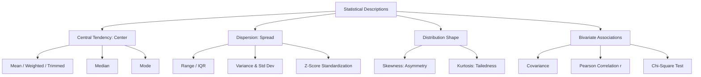

<Complete DAV Notes: Chapter 4 — Statistical Descriptions of Data>
> **Course:** Data Analysis and Visualization
> **Primary Source:** 4.Statistical Descriptions of Data_new.pdf
> **Files Integrated:** `4.Statistical Descriptions of Data_new.pdf`

# Chapter 4 — Statistical Descriptions of Data

## Source map

- `4.Statistical Descriptions of Data_new.pdf` — primary course presentation file.

---

## 1. Chapter Overview
This chapter details statistical summaries used to inspect and summarize data before exploratory analysis or machine learning modeling. It covers central tendency, dispersion/spread, shape of distribution, bivariate statistics (covariance, correlation, chi-square), visualizations (boxplots, histograms, scatter plots, Q-Q plots), and step-by-step calculations for **both raw ungrouped data and grouped class frequency distributions**.
[Source: 4.Statistical Descriptions of Data_new.pdf, Slide 2]

---

## 2. Fundamental Concepts

### Central Tendency vs Dispersion vs Shape

---

## 3. Ungrouped Data Formulas & Worked Examples

### 1. Ungrouped Data Formulas

| Metric | Formula | Description / Conditions |
| :--- | :--- | :--- |
| **Arithmetic Mean ($\bar{x}$)** | $\bar{x} = \frac{1}{n}\sum_{i=1}^{n} x_i$ | Average of all raw data points. Sensitive to extreme outliers. |
| **Median ($M_e$)** | Position $P = \frac{n+1}{2}$ | Middle value in sorted array. Robust to outliers. |
| **Mode ($M_o$)** | $\text{Mode} = \arg\max_x f(x)$ | Most frequently occurring value in the dataset. |
| **Sample Variance ($s^2$)** | $s^2 = \frac{1}{n-1}\sum_{i=1}^{n} (x_i - \bar{x})^2$ | Mean squared deviation using Bessel's correction ($n-1$). |
| **Sample Std Dev ($s$)** | $s = \sqrt{s^2}$ | Square root of sample variance; expressed in original units. |
| **Interquartile Range ($IQR$)** | $IQR = Q_3 - Q_1$ | Spread of the middle $50\%$ of data. Robust to extreme tails. |
| **Tukey's Outlier Bounds** | $[Q_1 - 1.5 \times IQR, \, Q_3 + 1.5 \times IQR]$ | Values outside these lower and upper fences are flagged as outliers. |

---

### 2. Fully Worked Example (Ungrouped Data)
**Given raw dataset:** $X = \{4, 8, 6, 5, 3, 100\}$ ($n = 6$)

**Step 1: Sort Data:**
$$\text{Sorted } X = \{3, 4, 5, 6, 8, 100\}$$

**Step 2: Calculate Mean ($\bar{x}$):**
$$\bar{x} = \frac{3 + 4 + 5 + 6 + 8 + 100}{6} = \frac{126}{6} = 21.0$$

**Step 3: Calculate Median ($M_e$):**
$$n = 6 \text{ (even)} \implies \text{Average of 3rd and 4th values} = \frac{5 + 6}{2} = 5.5$$

**Step 4: Calculate Sample Variance ($s^2$) and Standard Deviation ($s$):**
Deviations from mean ($\bar{x} = 21.0$):
- $(3 - 21)^2 = (-18)^2 = 324$
- $(4 - 21)^2 = (-17)^2 = 289$
- $(5 - 21)^2 = (-16)^2 = 256$
- $(6 - 21)^2 = (-15)^2 = 225$
- $(8 - 21)^2 = (-13)^2 = 169$
- $(100 - 21)^2 = (79)^2 = 6241$

$$\sum (x_i - \bar{x})^2 = 324 + 289 + 256 + 225 + 169 + 6241 = 7504$$
$$s^2 = \frac{7504}{6 - 1} = \frac{7504}{5} = 1500.8$$
$$s = \sqrt{1500.8} \approx 38.74$$

**Step 5: Calculate Quartiles & Outliers:**
- $Q_1$ (median of lower half $\{3, 4, 5\}$) $= 4$
- $Q_3$ (median of upper half $\{6, 8, 100\}$) $= 8$
- $IQR = Q_3 - Q_1 = 8 - 4 = 4$
- Upper Fence $= Q_3 + 1.5 \times IQR = 8 + 1.5(4) = 14$
- Outlier check: $100 > 14 \implies 100$ **is an outlier**.

---

## 4. Grouped Data (Class Interval Tables) Formulas & Worked Examples

### 1. Grouped Data Formulas

| Metric | Grouped Formula | Term Definitions |
| :--- | :--- | :--- |
| **Grouped Mean ($\bar{x}$)** | $\bar{x} = \frac{\sum_{i=1}^{k} f_i x_i}{N}$ | $f_i$: class frequency, $x_i$: class midpoint, $N = \sum f_i$ |
| **Grouped Median ($M_e$)** | $M_e = L + \left[ \frac{\frac{N}{2} - CF}{f} \right] \times h$ | $L$: lower boundary of median class, $CF$: cumulative frequency before median class, $f$: frequency of median class, $h$: class width |
| **Grouped Mode ($M_o$)** | $M_o = L + \left[ \frac{f_1 - f_0}{2f_1 - f_0 - f_2} \right] \times h$ | $L$: lower boundary of modal class, $f_1$: modal class frequency, $f_0$: preceding frequency, $f_2$: succeeding frequency, $h$: class width |
| **Grouped Variance ($s^2$)** | $s^2 = \frac{\sum_{i=1}^{k} f_i (x_i - \bar{x})^2}{N - 1}$ | $x_i$: midpoint, $f_i$: frequency, $\bar{x}$: grouped mean |

---

### 2. Fully Worked Example (Grouped Class Table)

**Given Frequency Distribution:**

| Class Interval | Midpoint ($x_i$) | Frequency ($f_i$) | $f_i \cdot x_i$ | Cumulative Frequency ($CF$) |
| :---: | :---: | :---: | :---: | :---: |
| $10 - 20$ | $15$ | $3$ | $45$ | $3$ |
| $20 - 30$ | $25$ | $7$ | $175$ | $10$ |
| $30 - 40$ | $35$ | $8$ | $280$ | $18$ |
| $40 - 50$ | $45$ | $2$ | $90$ | $20$ |
| **Total** | — | $N = 20$ | $\sum f_i x_i = 590$ | — |

---

#### Step 1: Calculate Grouped Mean ($\bar{x}$)
$$\bar{x} = \frac{\sum f_i x_i}{N} = \frac{590}{20} = 29.5$$

---

#### Step 2: Calculate Grouped Median ($M_e$)
1. Position $\frac{N}{2} = \frac{20}{2} = 10$.
2. Inspect $CF$ column: Median class is $30 - 40$ (since $CF$ reaches $18$ at $30-40$).
3. Identify parameters:
   - Lower boundary $L = 30$
   - Preceding cumulative frequency $CF = 10$ (from $20 - 30$)
   - Frequency of median class $f = 8$
   - Class width $h = 40 - 30 = 10$

$$M_e = 30 + \left[ \frac{10 - 10}{8} \right] \times 10 = 30.0$$

---

#### Step 3: Calculate Grouped Mode ($M_o$)
1. Highest frequency is $f_1 = 8$ in class $30 - 40$. Thus, modal class is $30 - 40$.
2. Parameters:
   - $L = 30$
   - $f_1 = 8$
   - $f_0 = 7$ (preceding frequency)
   - $f_2 = 2$ (succeeding frequency)
   - $h = 10$

$$M_o = 30 + \left[ \frac{8 - 7}{2(8) - 7 - 2} \right] \times 10 = 30 + \left[ \frac{1}{16 - 9} \right] \times 10 = 30 + \frac{10}{7} \approx 31.43$$

---

#### Step 4: Calculate Grouped Variance ($s^2$) and Std Dev ($s$)

| Class Interval | $x_i$ | $f_i$ | $(x_i - \bar{x}) = (x_i - 29.5)$ | $(x_i - \bar{x})^2$ | $f_i (x_i - \bar{x})^2$ |
| :---: | :---: | :---: | :---: | :---: | :---: |
| $10 - 20$ | $15$ | $3$ | $-14.5$ | $210.25$ | $630.75$ |
| $20 - 30$ | $25$ | $7$ | $-4.5$ | $20.25$ | $141.75$ |
| $30 - 40$ | $35$ | $8$ | $+5.5$ | $30.25$ | $242.00$ |
| $40 - 50$ | $45$ | $2$ | $+15.5$ | $240.25$ | $480.50$ |
| **Total** | — | $N = 20$ | — | — | $\sum f_i (x_i - \bar{x})^2 = 1495.00$ |

$$s^2 = \frac{1495.00}{20 - 1} = \frac{1495.00}{19} \approx 78.68$$
$$s = \sqrt{78.68} \approx 8.87$$

---

## 5. Shape Metrics & Bivariate Associations

### 1. Skewness & Kurtosis
- **Positive Skew (Right-skewed):** $\text{Mean} > \text{Median} > \text{Mode}$. Long tail extends to right.
- **Negative Skew (Left-skewed):** $\text{Mean} < \text{Median} < \text{Mode}$. Long tail extends to left.
- **Symmetric:** $\text{Mean} \approx \text{Median} \approx \text{Mode}$. Skewness $= 0$.
- **Leptokurtic (High Kurtosis):** Fat tails, heavy concentration of outliers.
- **Platykurtic (Low Kurtosis):** Thin tails, flat peak.

---

### 2. Covariance & Pearson Correlation ($r$)
$$Cov(X,Y) = \frac{1}{n-1}\sum_{i=1}^{n}(x_i - \bar{x})(y_i - \bar{y})$$

$$r_{X,Y} = \frac{Cov(X,Y)}{s_X s_Y} = \frac{\sum_{i=1}^{n}(x_i - \bar{x})(y_i - \bar{y})}{\sqrt{\sum_{i=1}^{n}(x_i - \bar{x})^2} \sqrt{\sum_{i=1}^{n}(y_i - \bar{y})^2}}$$

- **Properties:** $-1 \le r \le +1$. Measures linear relationship strength.
- $r = +1$: Perfect positive linear correlation.
- $r = -1$: Perfect negative linear correlation.
- $r = 0$: No linear relationship.

---

### 3. Chi-Square ($\chi^2$) Test for Categorical Independence
$$\chi^2 = \sum_{i=1}^{R} \sum_{j=1}^{C} \frac{(O_{ij} - E_{ij})^2}{E_{ij}} \quad \text{where } E_{ij} = \frac{(\text{Row}_i \text{ Sum}) \times (\text{Col}_j \text{ Sum})}{N}$$

---

## 6. Edge Cases & Troubleshooting

| Edge Case | Problem / Risk | Handling Strategy |
| :--- | :--- | :--- |
| **No Mode / Multimodal** | All values occur with equal frequency, or multiple equal peaks exist | Report dataset as "No Mode" or explicitly state all modal peaks (bimodal/multimodal). |
| **Modal Class at Edge** | Modal class is first ($10-20$) or last ($40-50$) class interval | $f_0$ or $f_2$ is $0$. Use $0$ for the missing adjacent class frequency. |
| **Zero Variance ($\sigma^2 = 0$)** | All values in feature are identical ($x_1 = x_2 = \dots = x_n$) | Standard deviation $s = 0$. Z-score $\frac{x - \mu}{\sigma}$ causes division by zero. Drop feature. |
| **Expected Cell Count $< 5$ in $\chi^2$** | Expected frequency $E_{ij} < 5$ invalidates Chi-square approximation | Combine adjacent categories or use Fisher's Exact Test. |
| **Non-Linear Association with $r = 0$** | Perfect non-linear relationship (e.g., $Y = X^2$) yields $r \approx 0$ | Do not rely solely on Pearson $r$; plot scatter plots or compute Spearman rank correlation. |

---

## Formula Sheet

### 1. Pearson Correlation Coefficient ($r$)
$$ r = \frac{\sum (x_i - \bar{x})(y_i - \bar{y})}{\sqrt{\sum (x_i - \bar{x})^2 \sum (y_i - \bar{y})^2}} $$

### 2. Grouped Median Formula
$$ M_e = L + \left[ \frac{\frac{N}{2} - CF}{f} \right] \times h $$

### 3. Grouped Mode Formula
$$ M_o = L + \left[ \frac{f_1 - f_0}{2f_1 - f_0 - f_2} \right] \times h $$

### 4. Chi-Square Test Statistic
$$ \chi^2 = \sum \frac{(O_{ij} - E_{ij})^2}{E_{ij}} $$

---

## Definition Sheet
- **Central Tendency:** Summary metrics describing the center of a probability distribution (Mean, Median, Mode).
- **Interquartile Range (IQR):** $Q_3 - Q_1$, the middle $50\%$ spread of data.
- **Grouped Data:** Aggregated frequency distributions over continuous class intervals.
- **Pearson Correlation ($r$):** Scale-free normalized linear association metric bounded in $[-1, 1]$.
- **Chi-Square Statistic ($\chi^2$):** Measure of discrepancy between observed and expected frequencies in categorical contingency tables.

---

## Exam-Oriented Review

**Q1: Calculate the grouped mean and median for a class table with intervals $[0-10, 10-20, 20-30]$ and frequencies $[2, 5, 3]$.**
**A:** $N = 10$. Midpoints $x_i = [5, 15, 25]$.
$\sum f_i x_i = 2(5) + 5(15) + 3(25) = 10 + 75 + 75 = 160$.
Grouped Mean $\bar{x} = 160 / 10 = 16.0$.
Median class position $N/2 = 5 \implies$ Class $10-20$ ($CF$ reaches $7$). $L = 10, CF = 2, f = 5, h = 10$.
Grouped Median $M_e = 10 + \left[\frac{5 - 2}{5}\right] \times 10 = 10 + \frac{3}{5}(10) = 16.0$.

**Q2: What happens to the Z-score calculation when a feature has zero variance?**
**A:** If variance is zero, standard deviation $\sigma = 0$. The Z-score formula $z = \frac{x - \mu}{\sigma}$ results in division by zero ($\frac{0}{0}$), which is mathematically undefined. Such constant features must be dropped.

**Q3: How do you handle Tukey's outlier fences for right-skewed data?**
**A:** For right-skewed data, extreme values stretch $Q_3$ and the upper fence ($Q_3 + 1.5 \times IQR$). Points exceeding the upper fence are flagged as potential outliers for further transformation (e.g., log transformation).
