<Complete DAV Notes: Chapter 5 — Data Preprocessing>
> **Course:** Data Analysis and Visualization
> **Primary Source:** 5. data_preprocessing.pdf

# Chapter 5 — Data Preprocessing

## 1. Chapter Overview
Data preprocessing is a crucial step in the data mining and data analysis process. Real-world data is generally incomplete, noisy, and inconsistent. Preprocessing involves preparing raw data for analysis by cleaning, transforming, and organizing it into a format suitable for mining algorithms. Without quality data, the resulting analyses will be misleading or incorrect.

The core pipeline consists of:
1. **Data Cleaning:** Removing noise and resolving inconsistencies.
2. **Data Integration:** Merging data from multiple sources.
3. **Data Reduction:** Reducing data size while preserving analytical value.
4. **Data Transformation:** Normalizing and scaling data.
5. **Data Discretization:** Converting continuous data to discrete bins or intervals.

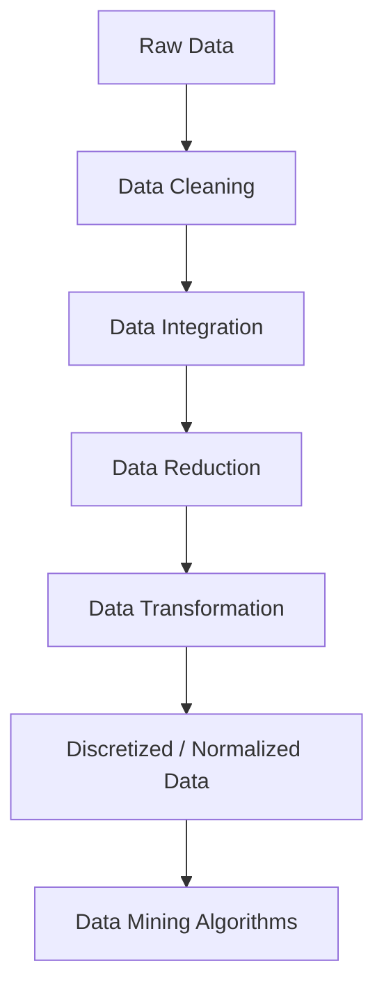

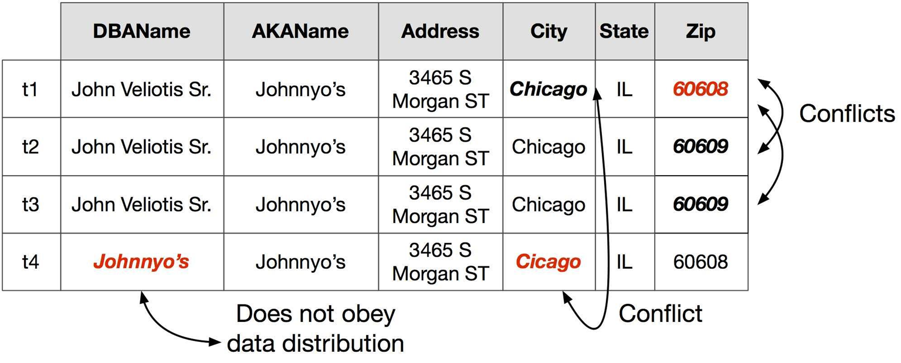

---

## 2. Fundamental Concepts

### Why is Data Dirty?
Data in the real world is inherently messy. It suffers from several issues:
- **Incomplete data:** Lacking attribute values, lacking certain attributes of interest, or containing only aggregate data. May come from "not applicable" data values when collected, different considerations between collection and analysis time, or human/hardware/software problems.
- **Noisy data:** Containing errors or outliers (incorrect values). May come from faulty data collection instruments, human or computer errors at data entry, or transmission errors.
- **Inconsistent data:** Containing discrepancies in codes or names. May come from different data sources or functional dependency violations.
- **Redundant/Duplicate records:** Multiple records for the same entity needing data cleaning.

### Why is Data Preprocessing Important?
- No quality data $\implies$ No quality results.
- Quality decisions require accurate, complete, and consistent data.
- Missing or duplicate data $\implies$ incorrect/misleading statistics.
- Data warehouses need consistent, integrated quality data.
- Most effort in building a data warehouse involves extraction, cleaning, and transformation.

---

## 3. Definitions

### Definition: Data Preprocessing
**Meaning:** The process of preparing raw data for analysis by cleaning and transforming it into a usable format.
**Formal definition:** In data mining, it refers to preparing raw data for mining by performing tasks like cleaning, transforming, and organizing it into a format suitable for mining algorithms.
**Intuition:** It's like washing and chopping ingredients before cooking a meal.
**Example:** Replacing all negative age values with the average age of the dataset before training a model.

### Definition: Noise
**Meaning:** Random error or variance in a measured variable.
**Formal definition:** Random error or unwanted variance in measured variables.
**Intuition:** Static on a radio broadcast that prevents you from hearing the song clearly.
**Example:** A temperature sensor momentarily reading 500°C instead of 25°C due to an electrical spike.

### Definition: Outlier
**Meaning:** A data point that differs significantly from other observations.
**Formal definition:** An observation that lies an abnormal distance from other values in a random sample from a population.
**Intuition:** The one person in a room of toddlers who is 6 feet tall.
**Example:** A salary of \$1,000,000 in a dataset where the average salary is \$50,000 and the standard deviation is \$10,000.

---

## 4. Data Cleaning

Data cleaning routines attempt to fill in missing values, smooth out noise while identifying outliers, and correct inconsistencies in the data.

### 4.1 Missing Values

Data is not always available. Missing data may need to be inferred.

#### Algorithm: Ignore the Tuple
**Purpose:** Handle missing data by discarding incomplete records.
**Procedure:**
1. Scan the dataset row by row.
2. If any attribute in a row has a missing value (`NaN`, `NULL`), drop the entire row.
**Complexity:** Time $O(N)$, Space $O(1)$
**Pros:** Complete removal results in a robust model. Removing a row with no specific info doesn't impact heavily.
**Cons:** Loss of information. Works poorly if missing values are high (e.g., 30%).

#### Algorithm: Fill in Automatically with Global Constant
**Purpose:** Handle missing data by assigning a default value.
**Procedure:**
1. Define a global constant $C$ (e.g., `"Unknown"` or `-999`).
2. Scan the dataset.
3. Replace all missing values with $C$.
**Complexity:** Time $O(N)$, Space $O(1)$
**Pros:** Simple and fast.
**Cons:** Can create artificial patterns in the data.

#### Algorithm: Imputation by Attribute Mean / Median
**Purpose:** Replace missing numerical data with the statistical mean or median.
**Procedure:**
1. Calculate the mean $\mu$ (or median) of the observed values for attribute $A$.
2. Replace all missing values in $A$ with $\mu$.
**Complexity:** Time $O(N)$, Space $O(1)$
**Pros:** Prevents data loss, preserves the dataset size.
**Cons:** Imputing approximations adds variance and bias; ignores relationships between variables.

#### Algorithm: Regression Imputation
**Purpose:** Predict missing values using a regression model trained on other variables.
**Procedure:**
1. Identify the target attribute $Y$ with missing values and predictor attributes $X$.
2. Separate the data into a training set (where $Y$ is observed) and a test set (where $Y$ is missing).
3. Train a regression model $Y = \beta_0 + \beta_1 X_1 + \dots + \beta_n X_n$.
4. Use the model to predict and fill in the missing values in $Y$.
**Complexity:** Time depends on regression model (e.g., $O(N^3)$ for OLS), Space $O(N)$
**Formula:**
$$ \hat{y}_i = \hat{\beta}_0 + \hat{\beta}_1 x_{i1} + \dots + \hat{\beta}_n x_{in} $$

#### Worked Example: Missing Value Strategies
**Given:** A dataset of ages and salaries.
| ID | Age | Salary |
|----|-----|--------|
| 1  | 25  | 50000  |
| 2  | 30  | 60000  |
| 3  | 45  | NaN    |
| 4  | NaN | 80000  |
| 5  | 50  | 90000  |

**Results under different strategies:**
- **Ignore Tuple:** Rows 3 and 4 are deleted. Only IDs 1, 2, 5 remain.
- **Global Constant (Salary = 0):** ID 3 Salary becomes 0. ID 4 Age becomes 0.
- **Attribute Mean:** 
  - Mean Age = $(25 + 30 + 45 + 50) / 4 = 150 / 4 = 37.5$. ID 4 Age $\leftarrow 37.5$.
  - Mean Salary = $(50k + 60k + 80k + 90k) / 4 = 280k / 4 = 70000$. ID 3 Salary $\leftarrow 70000$.
- **Regression Imputation (Predicting Salary from Age):**
  - Train on IDs 1, 2, 5. $Y = \beta_0 + \beta_1 X$.
  - Let's say $\beta_1 = 1500, \beta_0 = 12500$.
  - For ID 3 (Age 45): $\hat{Y} = 12500 + 1500 \times 45 = 12500 + 67500 = 80000$. ID 3 Salary $\leftarrow 80000$.

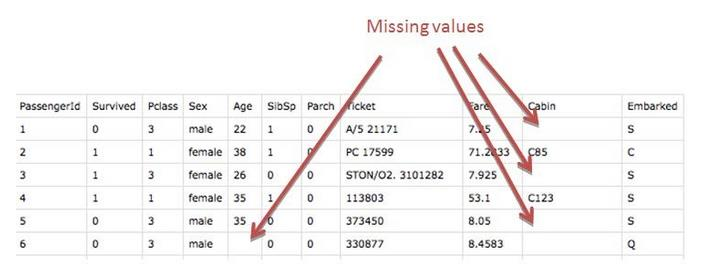

---

### 4.2 Handling Noisy Data: Binning and Regression

Noise can be smoothed using binning, regression, or clustering.

#### Algorithm: Binning for Data Smoothing
**Purpose:** To smooth noisy numerical data by grouping values into neighborhoods (bins) and replacing original values with a representative bin value.
**Input:** A list of numerical values $V$.
**Output:** A list of smoothed numerical values $V'$.
**Procedure:**
1. Sort the data in ascending order.
2. Partition the data into $N$ bins.
   - **Equal-width partitioning:** Divides the range into $N$ intervals of equal size: $W = (B - A)/N$.
   - **Equal-frequency (equi-depth) partitioning:** Divides the range into $N$ bins, each containing approximately the same number of samples.
3. Smooth the bins using one of the following strategies:
   - **Smoothing by bin means:** Replace each value in a bin by the mean value of the bin.
   - **Smoothing by bin median:** Replace each value by the median of the bin.
   - **Smoothing by bin boundaries:** Find the minimum and maximum values in the bin as boundaries. Replace each value with the closest boundary.

**Worked Example: Binning and Smoothing**
**Given Data:** `[4, 8, 15, 21, 21, 24, 25, 28, 34]`
**Task:** Partition into 3 equal-frequency bins and apply all three smoothing methods.

**Step 1: Partitioning (Equal-Frequency)**
Total items = 9. Bins = 3. Items per bin = 3.
- **Bin 1:** `[4, 8, 15]`
- **Bin 2:** `[21, 21, 24]`
- **Bin 3:** `[25, 28, 34]`

**Step 2a: Smoothing by Bin Means**
- Mean(Bin 1) = $(4 + 8 + 15)/3 = 27/3 = 9$
- Mean(Bin 2) = $(21 + 21 + 24)/3 = 66/3 = 22$
- Mean(Bin 3) = $(25 + 28 + 34)/3 = 87/3 = 29$
- **Result:** `[9, 9, 9, 22, 22, 22, 29, 29, 29]`

**Step 2b: Smoothing by Bin Medians**
- Median(Bin 1) = 8
- Median(Bin 2) = 21
- Median(Bin 3) = 28
- **Result:** `[8, 8, 8, 21, 21, 21, 28, 28, 28]`

**Step 2c: Smoothing by Bin Boundaries**
- Bin 1 boundaries: Min=4, Max=15. Distances for 8: $|8-4|=4$, $|15-8|=7$. Closer to 4.
  - Bin 1 smoothed: `[4, 4, 15]`
- Bin 2 boundaries: Min=21, Max=24.
  - Bin 2 smoothed: `[21, 21, 24]`
- Bin 3 boundaries: Min=25, Max=34. Distances for 28: $|28-25|=3$, $|34-28|=6$. Closer to 25.
  - Bin 3 smoothed: `[25, 25, 34]`
- **Result:** `[4, 4, 15, 21, 21, 24, 25, 25, 34]`

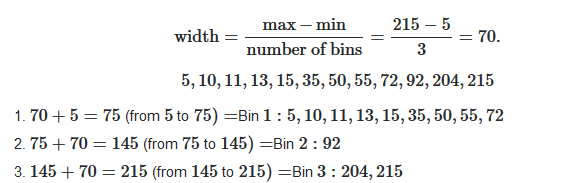

#### Regression for Smoothing
Data can be smoothed by fitting the data to a function, such as with regression.
**Formula:**
$$ Y = \beta_0 + \beta_1 X $$
**Example:** Fitting a linear line through noisy data points to find the true underlying trend. Instead of using the raw noisy $y_i$, you replace it with the predicted $\hat{y}_i$.

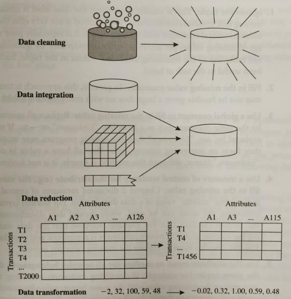

---

## 5. Data Integration

**Data Integration:** Combines data from multiple sources into a coherent store.

### 5.1 Schema Integration
- **Entity Identification Problem:** Identifying real-world entities from multiple sources. Example: matching `cust_id` from Database 1 with `customer_number` from Database 2.
- **Attribute Correspondence:** Ensuring that the metadata aligns correctly across sources.

### 5.2 Redundancy and Correlation Analysis
Redundant attributes can be detected by correlation analysis.
- **For Numeric Data:** Pearson's Correlation Coefficient ($r$)
- **For Categorical Data:** Chi-Square ($\chi^2$) Test

Careful integration reduces redundancies, inconsistencies, and improves mining speed and quality.

#### Correlation Analysis (Categorical) using Chi-Square
**Formula: Chi-Square ($\chi^2$)**
$$ \chi^2 = \sum_{i} \sum_{j} \frac{(O_{ij} - E_{ij})^2}{E_{ij}} $$
Where:
- $O_{ij}$ = Observed frequency in cell $(i, j)$
- $E_{ij}$ = Expected frequency = $\frac{(\text{Row Sum}) \times (\text{Column Sum})}{N}$

**Algorithm: Goodness of Fit Test**
1. **Hypothesis:** $H_0$: Variables are independent. $H_1$: Variables are correlated.
2. **Calculate Degrees of Freedom:** $df = (R - 1) \times (C - 1)$
3. **Calculate Expected Frequencies:** Using the formula above.
4. **Calculate $\chi^2$:** Sum the squared differences over expected frequencies.
5. **Compare:** If $\chi^2_{\text{calculated}} > \chi^2_{\text{tabular}}$, reject $H_0$. The attributes are redundant/correlated.

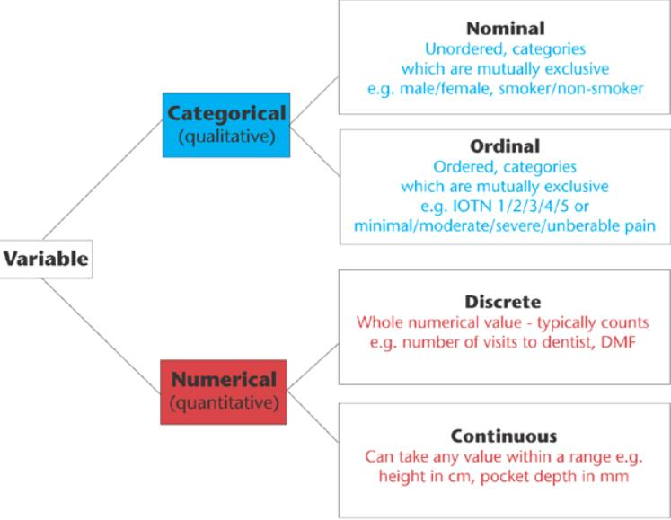
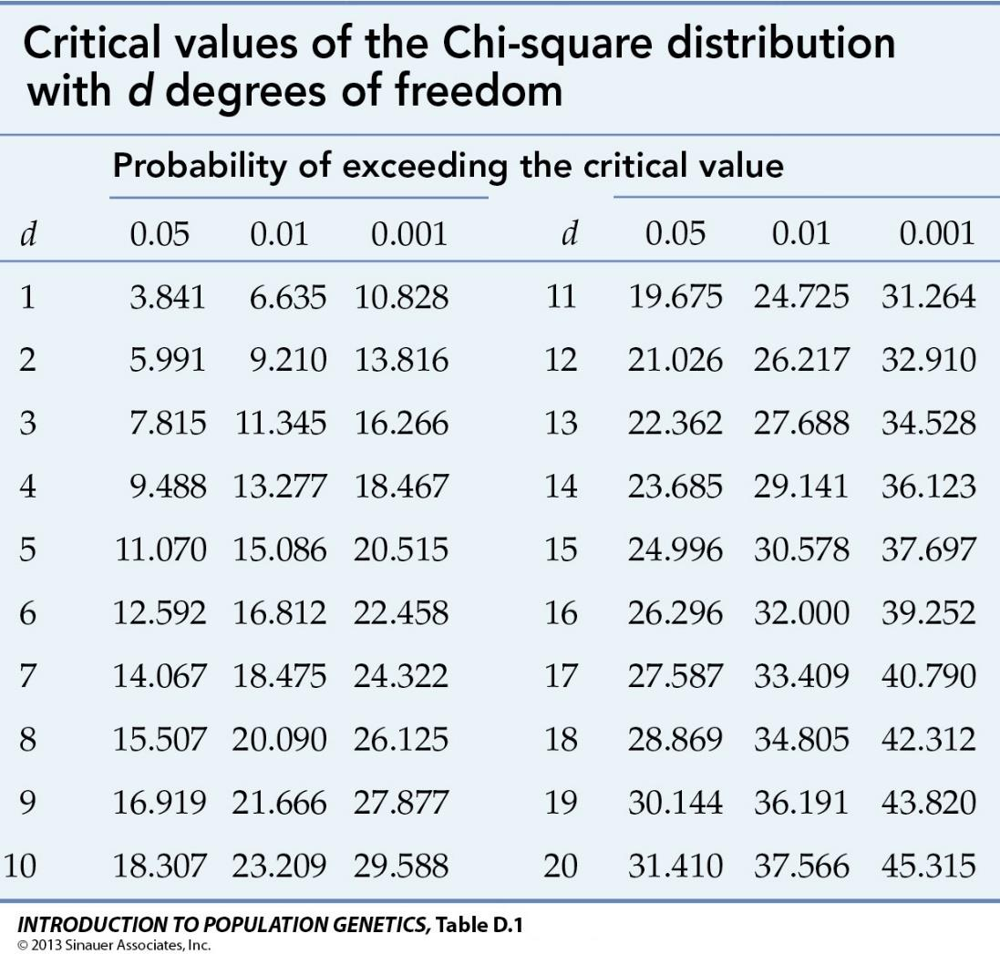
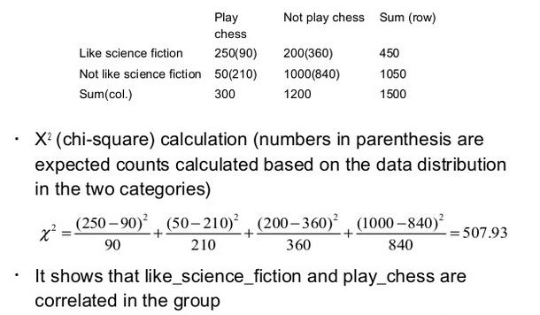
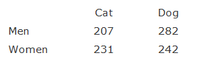
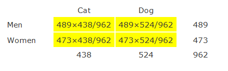
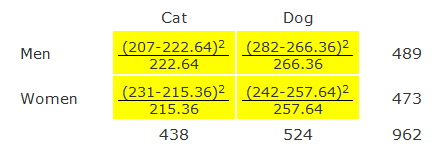
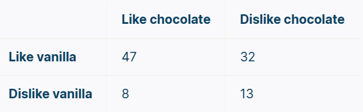

#### Correlation Analysis (Numerical) using Pearson's $r$
**Formula:**
$$ r_{A,B} = \frac{\sum_{i=1}^{n} (A_i - \bar{A})(B_i - \bar{B})}{n \sigma_A \sigma_B} $$

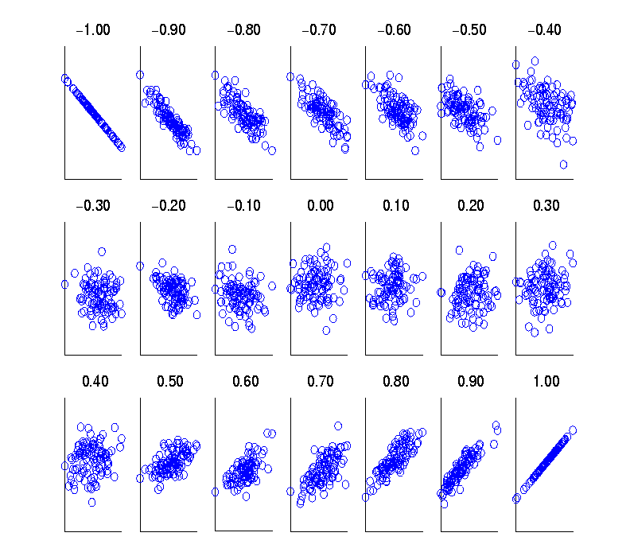
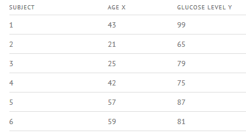
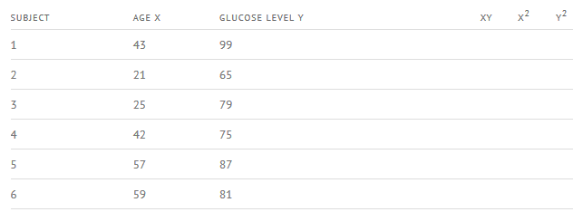
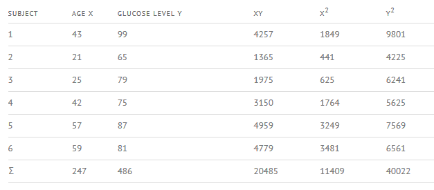
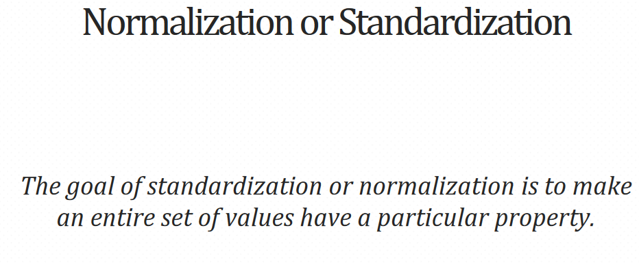

### 5.3 Data Value Conflict Detection and Resolution
For the same real-world entity, attribute values from different sources may conflict. Possible reasons: different representations, different scales (e.g., metric vs. British units, USD vs EUR).

---

## 6. Data Transformation

Data transformation converts data into appropriate forms for mining.

### 6.1 Normalization
Scaling attribute values to fall within a specified range.

#### Algorithm: Min-Max Normalization
**Purpose:** Linearly maps data to a new minimum and maximum range (usually $[0, 1]$).
**Formula:**
$$ v' = \frac{v - \min_A}{\max_A - \min_A} \times (new\_max_A - new\_min_A) + new\_min_A $$
**Worked Example:**
**Given:** `income` ranges from $\$12,000$ to $\$98,000$. Map to $[0.0, 1.0]$. Find the normalized value for $v = \$73,600$.
**Solution:**
$$ v' = \frac{73600 - 12000}{98000 - 12000} \times (1.0 - 0.0) + 0.0 = \frac{61600}{86000} = 0.716 $$
**Result:** $0.716$

#### Algorithm: Z-Score Normalization
**Purpose:** Normalizes data based on the mean and standard deviation. Useful when the actual minimum and maximum are unknown or when outliers dominate.
**Formula:**
$$ v' = \frac{v - \mu_A}{\sigma_A} $$
**Worked Example:**
**Given:** Mean $\mu = \$54,000$, Standard Deviation $\sigma = \$16,000$. Find the normalized value for $v = \$73,600$.
**Solution:**
$$ v' = \frac{73600 - 54000}{16000} = \frac{19600}{16000} = 1.225 $$
**Result:** $1.225$

#### Algorithm: Decimal Scaling Normalization
**Purpose:** Normalizes by moving the decimal point of values.
**Formula:**
$$ v' = \frac{v}{10^j} $$
where $j$ is the smallest integer such that $\max(|v'|) < 1$.
**Worked Example:**
**Given:** Data ranges from $-986$ to $917$. Max absolute value is $986$.
**Solution:**
To make $\max(|v'|) < 1$, we divide by $10^3 = 1000$ ($j=3$).
For $v = 917$: $v' = 917 / 1000 = 0.917$.
For $v = -986$: $v' = -986 / 1000 = -0.986$.
**Result:** $0.917$ and $-0.986$

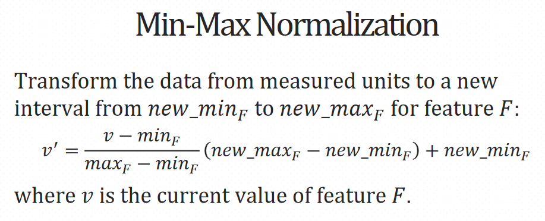
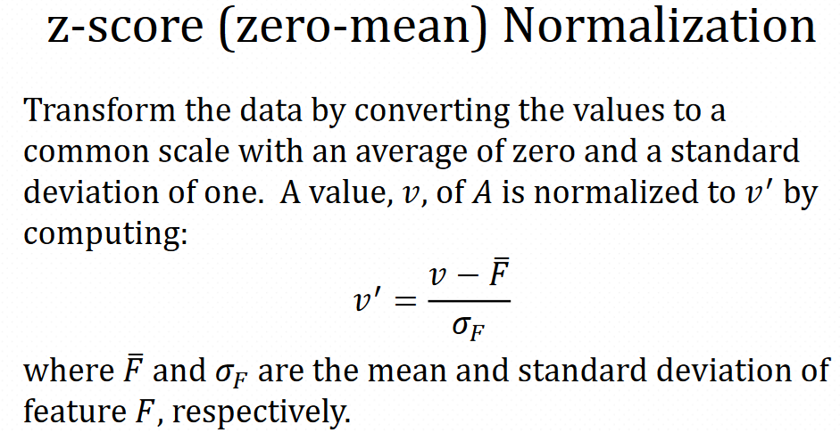
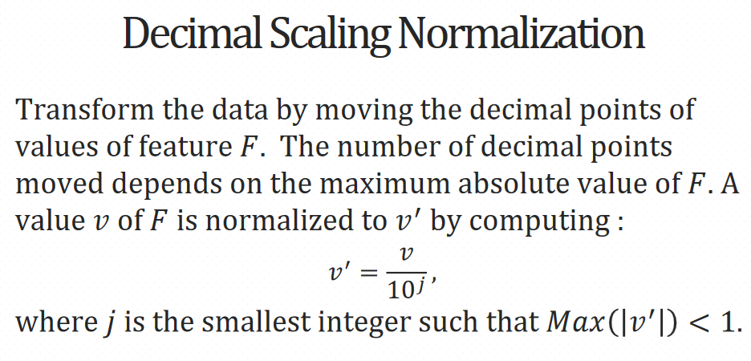

### 6.2 Other Transformation Strategies
- **Attribute/Feature Construction:** New attributes are constructed from existing ones to aid the mining process (e.g., `Area = Length * Width`).
- **Aggregation:** Summarization, data cube construction (e.g., daily sales aggregated to monthly sales).
- **Smoothing:** Removing noise using binning, regression, clustering.

---

## 7. Data Reduction

Data reduction obtains a reduced representation of the data set that is much smaller in volume but produces the same (or almost the same) analytical results.

### 7.1 Dimensionality Reduction
Reducing the number of random variables or attributes under consideration.
- **Principal Component Analysis (PCA):** A mathematical procedure that transforms a number of possibly correlated variables into a smaller number of uncorrelated variables called principal components. The components are eigenvectors of the covariance matrix, and eigenvalues represent the variance explained.
- **Attribute Subset Selection (Feature Selection):**
  - *Forward Stepwise Selection:* Start with an empty set, iteratively add the most highly correlated attribute.
  - *Backward Stepwise Elimination:* Start with all attributes, iteratively remove the worst attributes.

### 7.2 Numerosity Reduction
Reducing the data volume by choosing alternative, smaller forms of data representation.
- **Parametric Methods:** Assume the data fits some model, estimate model parameters, store only the parameters, and discard the data (e.g., Regression and Log-Linear Models).
- **Non-Parametric Methods:** Do not assume models. Examples include:
  - *Histograms:* Divide data into bins and store frequencies.
  - *Clustering:* Store cluster representations (centroids) rather than actual data.
  - *Sampling:* Obtain a small sample $s$ to represent the large data set $N$.

### 7.3 Data Compression
Encoding mechanisms are used to reduce the data set size.
- **Lossless Compression:** Original data can be reconstructed exactly (e.g., string compression).
- **Lossy Compression:** Original data cannot be reconstructed exactly but within an acceptable error margin (e.g., Wavelet Transforms, PCA).

---

## 8. Data Discretization and Concept Hierarchy Generation

Discretization converts continuous numerical data into discrete bins, intervals, or categorical labels.

### 8.1 Discretization Techniques
- **Binning:** Equal-width and equal-frequency binning (as explained in Data Cleaning).
- **Histogram Analysis:** Partitions values into bins (bucket width can be computed using formulas like Sturges' rule: $k = \lceil 1 + \log_2(n) \rceil$).
- **Cluster Analysis:** Partitioning data into clusters to form discrete concepts.
- **Decision Tree Analysis:** Using a decision tree algorithm (like ID3 or C4.5) to find optimal split points in continuous variables by maximizing information gain.

### 8.2 Concept Hierarchy Generation
Concept hierarchies organize data into different levels of abstraction.
- **Top-Down Approach:** Splitting a higher-level concept into lower-level concepts (e.g., starting with Country and splitting into Provinces).
- **Bottom-Up Approach:** Grouping lower-level concepts into higher-level ones.
- **Example:**
  `Street (Lowest)` $\to$ `City` $\to$ `Province/State` $\to$ `Country (Highest)`
- **For Numeric Attributes:** Generated using discretization techniques like binning or clustering.
- **For Categorical Attributes:** Usually defined by users based on schema relationships.

---

## 9. Key Takeaways

1. **Dirty Data:** Real-world data is plagued by missing values, noise, and inconsistencies, which severely impact the quality of data mining.
2. **Missing Values:** Addressed by removing tuples or imputing values using statistical measures (means, modes, regression).
3. **Noisy Data:** Smoothed using equal-width/depth binning, regression modeling, or clustering.
4. **Data Integration:** Combines data from multiple sources; resolves schema inconsistencies; detects redundant features using Correlation and Covariance analysis.
5. **Correlation (Chi-Square & Pearson's):** Used to identify dependencies. $\chi^2$ is for categorical; Pearson's $r$ is for numerical.
6. **Data Transformation:** Techniques like Min-Max, Z-score, and Decimal scaling normalize data so all attributes contribute equally.
7. **Data Reduction:** Dimensionality and numerosity reduction techniques (PCA, sampling, binning) compress data while maintaining its integrity.

---

## Formula Sheet

| Concept | Formula |
|---------|---------|
| **Equal-Width Binning** | $W = \frac{B - A}{N}$ |
| **Regression Imputation** | $\hat{y}_i = \hat{\beta}_0 + \hat{\beta}_1 x_{i1} + \dots + \hat{\beta}_n x_{in}$ |
| **Chi-Square Expected Freq.** | $E_{ij} = \frac{(\text{count}(A=a_i)) \times (\text{count}(B=b_j))}{N}$ |
| **Chi-Square Statistic** | $\chi^2 = \sum \frac{(O_{ij} - E_{ij})^2}{E_{ij}}$ |
| **Chi-Square Degrees of Freedom** | $df = (R - 1) \times (C - 1)$ |
| **Pearson's Correlation Coefficient ($r$)** | $r = \frac{\sum (A_i - \bar{A})(B_i - \bar{B})}{n \sigma_A \sigma_B}$ |
| **Covariance** | $Cov(A,B) = \frac{\sum A_i B_i}{n} - \bar{A}\bar{B}$ |
| **Min-Max Normalization** | $v' = \frac{v - \min_A}{\max_A - \min_A} \times (new\_max_A - new\_min_A) + new\_min_A$ |
| **Z-Score Normalization** | $v' = \frac{v - \mu_A}{\sigma_A}$ |
| **Decimal Scaling Normalization** | $v' = \frac{v}{10^j}$ (where $j$ is smallest integer so $\max(|v'|) < 1$) |
| **Sturges' Rule (Histogram Bins)** | $k = \lceil 1 + \log_2(n) \rceil$ |

---

## Exam-Oriented Review

1. **Why is data preprocessing essential in data mining?** Discuss the impact of dirty data on mining algorithms.
2. **What are the strategies to handle missing values?** Compare the pros and cons of using a global constant vs. regression imputation.
3. **Explain binning methods for data smoothing.** Given the sequence `[4, 8, 15, 21, 21, 24, 25, 28, 34]`, demonstrate equal-frequency partitioning and smooth them by bin boundaries.
4. **How do you handle redundancy in data integration?** Explain the role of correlation analysis in schema integration.
5. **Calculate the Chi-Square statistic** for a given contingency table to determine if two categorical variables are independent. State the hypothesis and conclusion.
6. **Compute Pearson's Correlation Coefficient and Covariance** for a given set of data tuples. Interpret the positive or negative result.
7. **Apply Normalization Techniques:** Given a dataset with mean=50, std=10, min=10, max=90, normalize the value $x=75$ using Min-Max (to [0,1]) and Z-score methods.
8. **What is Dimensionality Reduction?** Explain PCA and how it utilizes eigenvectors and eigenvalues.
9. **Differentiate between Parametric and Non-Parametric Numerosity Reduction.** Give examples of each.
10. **Explain Lossless vs Lossy Compression.** Provide examples of each in the context of data preprocessing.
11. **What is Discretization?** How can Decision Trees be used for discretizing continuous numerical attributes?
12. **Describe Concept Hierarchy Generation.** Provide an example of a top-down concept hierarchy for geographic locations.

</Complete DAV Notes: Chapter 5 — Data Preprocessing>
