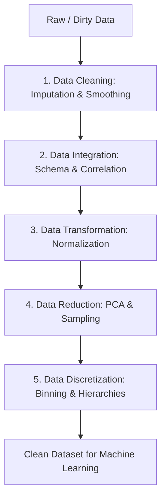
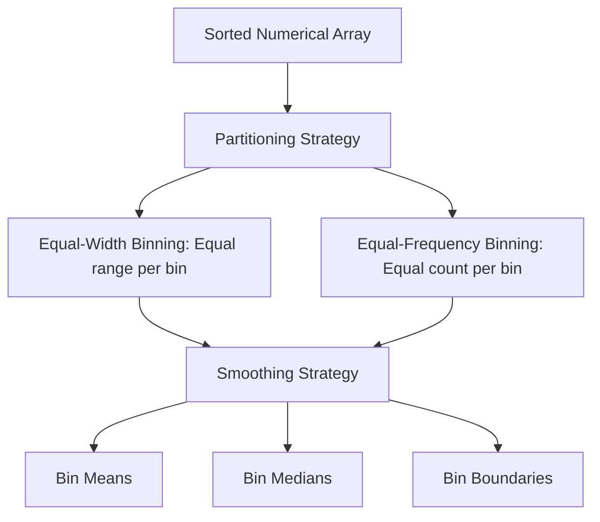

<Complete DAV Notes: Chapter 5 — Data Preprocessing>
> **Course:** Data Analysis and Visualization
> **Primary Source:** 5. data_preprocessing.pdf
> **Files Integrated:** `5. data_preprocessing.pdf`

# Chapter 5 — Data Preprocessing

## Source map

- `5. data_preprocessing.pdf` — primary course presentation file.

---

## 1. Chapter Overview
Data preprocessing is an indispensable step in the data mining and data engineering pipeline. Real-world raw data is inherently incomplete (missing values), noisy (errors, outliers), and inconsistent (schema/naming discrepancies). This chapter presents the complete data preprocessing pipeline:
1. **Data Cleaning:** Missing value imputation, noise smoothing, and outlier detection.
2. **Data Integration:** Schema matching, redundancy analysis ($\chi^2$, Pearson $r$, Covariance).
3. **Data Transformation:** Min-Max, Z-score, Decimal scaling, feature construction.
4. **Data Reduction:** Dimensionality reduction (PCA, feature selection) and numerosity reduction.
5. **Data Discretization:** Binning, histogram analysis, decision trees, and concept hierarchies for both ungrouped raw data and grouped class frequency tables.

[Source: 5. data_preprocessing.pdf, Slide 1-60]

---

## 2. Fundamental Pipeline

---

## 3. Data Cleaning & Missing Value Imputation

### 1. Handling Missing Data Strategies

| Strategy | Procedure | Formula / Logic | Advantages | Disadvantages |
| :--- | :--- | :--- | :--- | :--- |
| **Ignore Tuple** | Delete row with missing $Y$ | Drop row $i$ if $x_{ij} = \text{NaN}$ | Simple, creates complete rows | Loses valuable information if missingness is high |
| **Global Constant** | Replace missing with static label | $x_{ij} \leftarrow \text{"Unknown"}$ or $-999$ | Preserves sample size | Distorts variance and feature distributions |
| **Attribute Mean / Median** | Replace missing with average | $x_{ij} \leftarrow \bar{x}_j$ or $\text{Med}(x_j)$ | Easy to compute, preserves mean | Underestimates variance, distorts correlations |
| **Regression Imputation** | Predict missing using model | $\hat{y}_i = \beta_0 + \beta_1 x_{i1} + \dots + \beta_k x_{ik}$ | Preserves inter-variable relationships | Can overfit if sample size is small |

---

### 2. Binning Strategies for Data Smoothing

Given sorted numeric observations:

#### Fully Worked Binning Example
**Given raw sorted data:** $V = [4, 8, 15, 21, 21, 24, 25, 28, 34]$ ($N = 9$)
**Task:** Partition into $3$ equal-frequency bins and apply bin boundary smoothing.

1. **Partitioning (3 bins, 3 items each):**
   - **Bin 1:** $[4, 8, 15]$
   - **Bin 2:** $[21, 21, 24]$
   - **Bin 3:** $[25, 28, 34]$

2. **Smoothing by Bin Means:**
   - Mean(Bin 1) $= (4 + 8 + 15)/3 = 9.0 \implies [9, 9, 9]$
   - Mean(Bin 2) $= (21 + 21 + 24)/3 = 22.0 \implies [22, 22, 22]$
   - Mean(Bin 3) $= (25 + 28 + 34)/3 = 29.0 \implies [29, 29, 29]$
   - **Smoothed Array:** $[9, 9, 9, 22, 22, 22, 29, 29, 29]$

3. **Smoothing by Bin Boundaries:**
   - Bin 1 Boundaries ($Min=4, Max=15$): $8$ is closer to $4 \implies [4, 4, 15]$
   - Bin 2 Boundaries ($Min=21, Max=24$): $21$ stays $21 \implies [21, 21, 24]$
   - Bin 3 Boundaries ($Min=25, Max=34$): $28$ is closer to $25 \implies [25, 25, 34]$
   - **Smoothed Array:** $[4, 4, 15, 21, 21, 24, 25, 25, 34]$

---

## 4. Data Integration & Redundancy Analysis

Data integration combines data from multiple sources. Redundant features cause model instability and waste computation.

### 1. Chi-Square ($\chi^2$) Test for Categorical Redundancy
$$\chi^2 = \sum_{i=1}^{R} \sum_{j=1}^{C} \frac{(O_{ij} - E_{ij})^2}{E_{ij}} \quad \text{where } E_{ij} = \frac{(\text{Row}_i \text{ Sum}) \times (\text{Col}_j \text{ Sum})}{N}$$

### 2. Pearson Correlation Coefficient ($r$) for Numeric Redundancy
$$r_{A,B} = \frac{\sum_{i=1}^{n}(A_i - \bar{A})(B_i - \bar{B})}{\sqrt{\sum_{i=1}^{n}(A_i - \bar{A})^2 \sum_{i=1}^{n}(B_i - \bar{B})^2}}$$

---

## 5. Data Transformation & Normalization

Data normalization scales numerical attributes so that no single feature dominates distance calculations.

### 1. Normalization Formulas & Examples

| Method | Formula | Worked Example |
| :--- | :--- | :--- |
| **Min-Max Normalization** | $v' = \frac{v - \min_A}{\max_A - \min_A} \cdot (\text{new\_max}_A - \text{new\_min}_A) + \text{new\_min}_A$ | Map $v = \$73,600$ in $[\$12k, \$98k]$ to $[0, 1]$: $v' = \frac{73600 - 12000}{98000 - 12000} = \frac{61600}{86000} \approx 0.7163$ |
| **Z-Score Normalization** | $v' = \frac{v - \mu_A}{\sigma_A}$ | Scale $v = \$73,600$ with $\mu = \$54,000, \sigma = \$16,000$: $v' = \frac{73600 - 54000}{16000} = \frac{19600}{16000} = 1.2250$ |
| **Decimal Scaling** | $v' = \frac{v}{10^j} \quad \text{where } \max(\|v'\|) < 1$ | Scale $v = -986$ with max absolute $986$ ($j=3$): $v' = \frac{-986}{10^3} = -0.9860$ |

---

## 6. Discretization Formats: Ungrouped vs Grouped

### 1. Discretizing Ungrouped Continuous Data
Continuous raw measurements discretized into categorical bins using Sturges' Rule for bin count $k$:
$$k = \lceil 1 + \log_2(n) \rceil$$

### 2. Grouped Class Table Discretization
Data represented as a structured frequency distribution across continuous intervals $[a, b)$:

| Class Interval (CI) | Midpoint ($x_i$) | Frequency ($f_i$) | Discrete Concept Label |
| :---: | :---: | :---: | :---: |
| $0 - 18$ | $9.0$ | $15$ | Youth |
| $18 - 45$ | $31.5$ | $60$ | Young Adult |
| $45 - 65$ | $55.0$ | $20$ | Middle Aged |
| $65+$ | $75.0$ | $5$ | Senior |
| **Total** | — | $N = 100$ | — |

---

## 7. Edge Cases & Troubleshooting

| Edge Case | Problem / Risk | Handling Strategy |
| :--- | :--- | :--- |
| **Zero Range ($\max_A = \min_A$)** | Min-Max normalization formula divides by zero ($\max - \min = 0$) | When feature range is zero, set $v' = 0$ for all instances or drop the constant feature. |
| **Zero Standard Deviation ($\sigma_A = 0$)** | Z-score normalization formula divides by zero | Standard deviation is zero for constant attributes. Drop feature before Z-score scaling. |
| **Duplicate Values across Bin Edges** | Equal-frequency binning splits identical values into different bins | Adjust bin boundaries dynamically so that identical values remain in the same bin. |
| **Extreme Outliers in Min-Max** | Single extreme value compresses $99\%$ of normal data into a tiny range (e.g. $[0, 0.01]$) | Use **Z-score normalization** or **RobustScaler** (using median and IQR) instead of Min-Max. |

---

## Formula Sheet

### 1. Min-Max Normalization
$$ v' = \frac{v - \min_A}{\max_A - \min_A} (\text{new\_max}_A - \text{new\_min}_A) + \text{new\_min}_A $$

### 2. Z-Score Normalization
$$ v' = \frac{v - \mu_A}{\sigma_A} $$

### 3. Decimal Scaling
$$ v' = \frac{v}{10^j} \quad \text{where } j = \lceil \log_{10}(\max(|v|)) \rceil $$

### 4. Chi-Square Statistic
$$ \chi^2 = \sum \frac{(O_{ij} - E_{ij})^2}{E_{ij}} $$

---

## Definition Sheet
- **Data Preprocessing:** The pipeline of cleaning, integrating, transforming, and reducing raw data into a clean structure for analytics.
- **Min-Max Normalization:** Linear scaling mapping attribute values into a specified range $[a, b]$.
- **Z-Score Normalization:** Scaling technique centering data at mean $0$ with standard deviation $1$.
- **Decimal Scaling:** Normalization by shifting decimal places based on the maximum absolute value.
- **Binning:** Smooth or discretize continuous numerical values by grouping into local neighborhoods.

---

## Exam-Oriented Review

**Q1: Normalize $v = 80$ given $\min = 20, \max = 100$ to range $[0, 1]$ using Min-Max Normalization.**
**A:** $v' = \frac{80 - 20}{100 - 20} = \frac{60}{80} = 0.75$.

**Q2: Compare Min-Max Normalization and Z-Score Normalization when extreme outliers are present.**
**A:** Min-Max normalization is heavily distorted by extreme outliers, as the outlier sets the $\max$ or $\min$, compressing all remaining data into a narrow band. Z-Score normalization is less sensitive because it centers data around the mean and measures spread in standard deviations.

**Q3: Explain Equal-Width vs Equal-Frequency Binning with an example.**
**A:** Equal-width binning divides the range $[\min, \max]$ into $k$ intervals of equal width $W = \frac{\max - \min}{k}$. Equal-frequency binning partitions the sorted data into $k$ bins such that each bin contains an equal number of samples ($N/k$).
