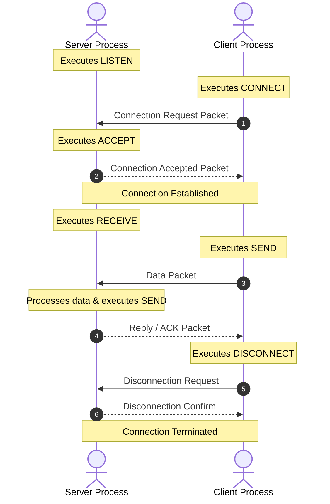
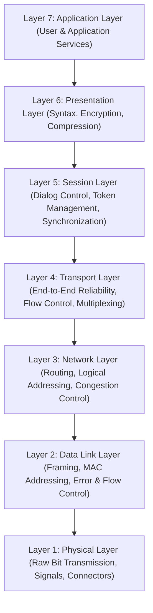
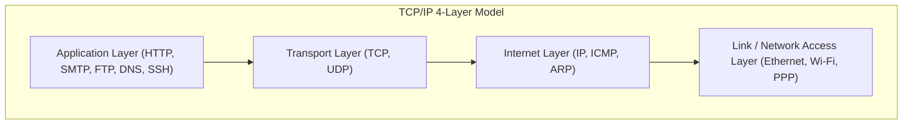
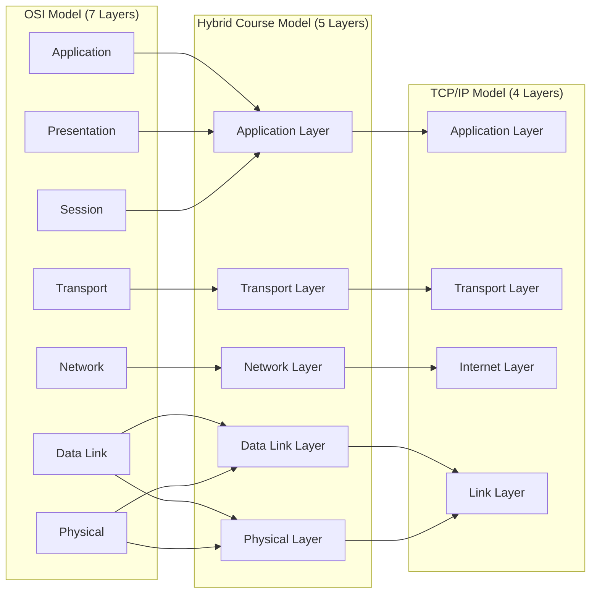
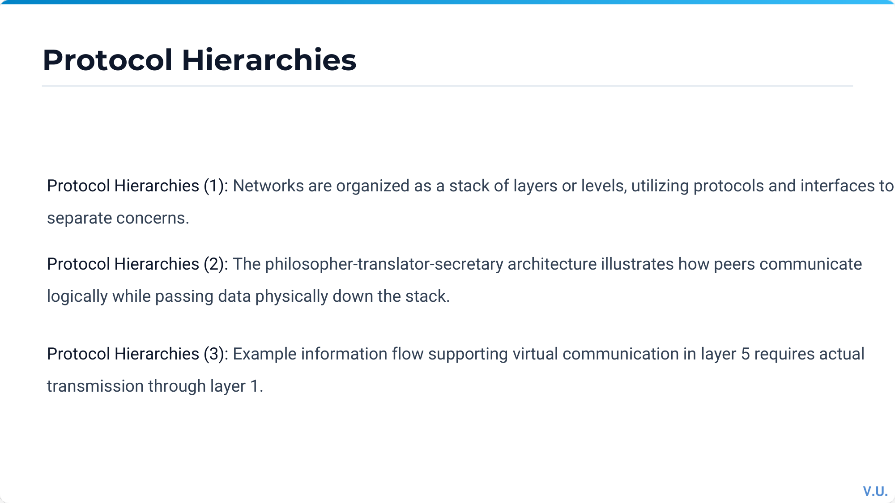
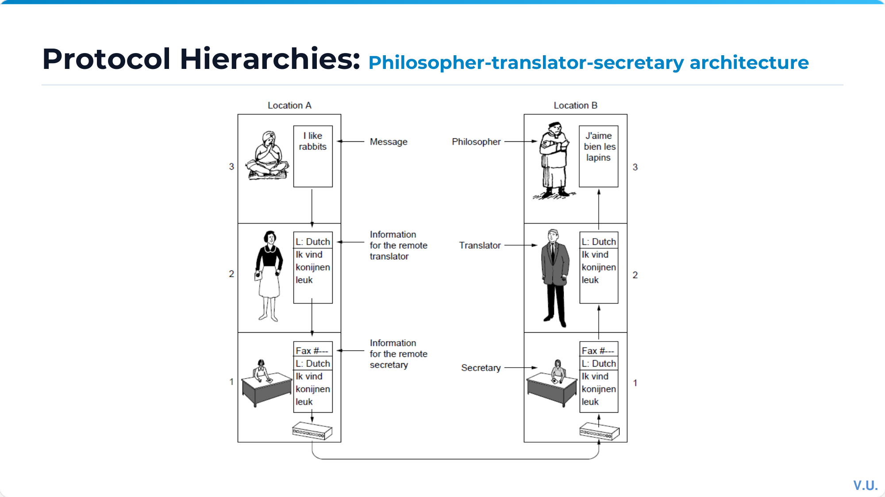
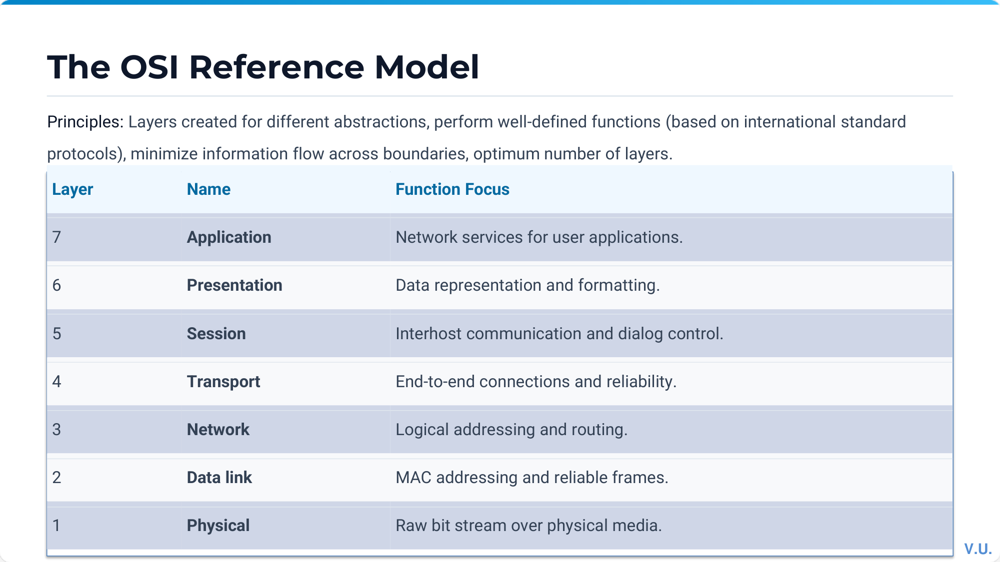
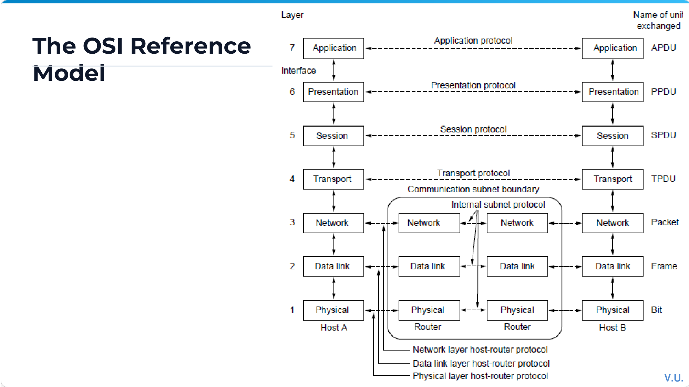
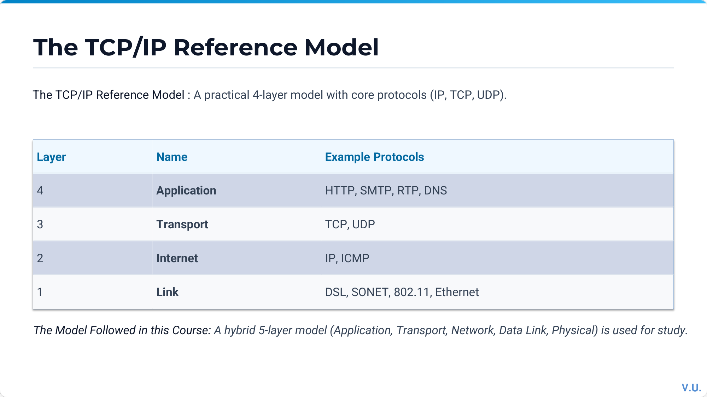
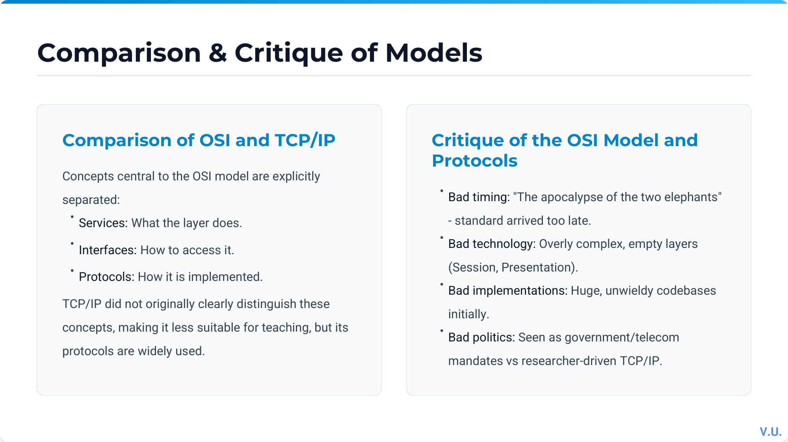

# Complete Computer Networks Notes: Introduction to Computer Networks

> **Course Code:** Computer Networks (CompNet)
> **Course Title:** Computer Networks & Data Communications
> **Primary Source:** `Ch 1 Introduction.pdf` (pp. 1–52) — Official Faculty Lecture Material
> **Supplementary Sources:** `Chapter1-Introduction.pdf`, `CN_Numericals_Data_Communication.pdf`, `cn_tutorial.pdf` (Tutorial 1), `Computer_Networks_Question_Bank.pdf` (Unit 1)
> **Files Integrated:** `Ch 1 Introduction.pdf`, `Chapter1-Introduction.pdf`, `CN_Numericals_Data_Communication.pdf`, `cn_tutorial.pdf`, `Computer_Networks_Question_Bank.pdf`

---

## Source-to-Chapter Mapping

| Source File | Content / Role | Chapter Integration |
| :--- | :--- | :--- |
| `Ch 1 Introduction.pdf` (52 slides) | Primary lecture presentation covering network uses, hardware, topologies, software layering, OSI/TCP-IP models, history, standards, and transmission metrics. | Main text, core concepts, reference models, and primary diagram references. |
| `Chapter1-Introduction.pdf` (58 slides) | Supplementary presentation with detailed layer primitives, design issues, and protocol hierarchies. | Cross-verified concepts, enhanced definitions, and design principles. |
| `CN_Numericals_Data_Communication.pdf` (25 pages) | Dedicated problem set covering Nyquist/Shannon capacity, baud rate, propagation delays, and topologies. | Section 12 (Worked Numerical Problems) & Section 9 (Formulas). |
| `cn_tutorial.pdf` (Tutorial 1) | Course tutorial covering network transmission, RTT, and channel calculations. | Integrated into Section 12 (Worked Problems) & Section 17 (Exam Review). |
| `Computer_Networks_Question_Bank.pdf` (Unit 1) | Official question bank containing Unit 1 MCQs, short questions, and numerical problems. | Integrated into Section 17 (Exam-Oriented Review). |

---

# Chapter 1 — Introduction to Computer Networks

---

## 1. Chapter Overview

A **computer network** is an interconnected collection of autonomous computers and devices capable of exchanging information and sharing hardware and software resources. The interconnection is established through transmission media such as copper wires, optical fibers, microwaves, infrared, and communication satellites.

The primary design objectives of computer networks include resource sharing, high reliability through redundancy, cost reduction, scalability, and providing a universal communication medium for people and applications. This chapter establishes the fundamental architectural principles of networking, examines network hardware and topologies, details the theoretical and practical layered software models (the 7-layer ISO/OSI model, the 4-layer TCP/IP suite, and the 5-layer hybrid academic model), traces the historical evolution from ARPANET to the modern Internet, and introduces the physical mathematical foundations governing data transmission capacity and delay.

[Source: Ch 1 Introduction.pdf, Slides 1–3, 11, 23, 35, 40, 50]

---

## 2. Core Terminology Dictionary

1. **Autonomous Computers:** Independent computing systems that have their own control units and memories; no single computer can forcibly start, stop, or control another without consent.
2. **Distributed System:** A collection of independent computers that appears to its users as a single coherent system with a unified software model (e.g., middleware). In contrast, in a computer network, user coherence is absent and machines are explicitly addressed.
3. **Transmission Medium:** The physical path over which data travels between transmitters and receivers (e.g., twisted pair, coaxial cable, optical fiber, radio spectrum).
4. **Host (End System):** Any computing device connected to a network that runs user application programs (e.g., workstations, servers, smartphones, IoT nodes).
5. **Node:** Any addressable entity attached to the network, including hosts, routers, switches, and bridges.
6. **Communication Subnet (Subnet):** The collection of transmission lines and switching elements (routers) dedicated solely to transporting messages between hosts.
7. **Router:** A specialized network-layer switching node that inspects packet headers and uses routing tables to forward packets across interconnected networks.
8. **Point-to-Point Link:** A dedicated physical communication channel connecting exactly two endpoints (also called store-and-forward or packet-switched links).
9. **Broadcast Channel:** A single communication channel shared by all machines on the network; packets transmitted by any machine are received by all other machines.
10. **Unicast:** A transmission mode where a packet is sent from one source node to exactly one specific destination node.
11. **Multicast:** A transmission mode where a packet is directed to a specified subset of nodes belonging to a designated multicast group.
12. **Broadcast:** A transmission mode where a packet is received and processed by every node on the subnet (using a reserved broadcast address).
13. **Anycast:** A transmission mode where a packet is delivered to the nearest member among a group of servers sharing the same anycast address.
14. **Protocol:** A formal set of rules, formats, and conventions that govern how peer entities exchange data at a specific layer.
15. **Service:** A set of operations and capabilities that a lower layer provides to the layer immediately above it through a service interface.
16. **Interface:** The boundary between adjacent protocol layers defining the Service Access Points (SAPs) and primitive operations.
17. **Service Primitive:** An abstract function call (e.g., `LISTEN`, `CONNECT`, `SEND`, `RECEIVE`, `DISCONNECT`) used by an upper layer to access lower-layer services.
18. **Protocol Data Unit (PDU):** The complete data unit exchanged between peer entities at a given layer, consisting of layer-specific control headers/trailers and payload.
19. **Service Data Unit (SDU):** The user data payload passed across the interface from the layer above, to be encapsulated inside a PDU.
20. **Encapsulation:** The process where a lower layer wraps the SDU received from the upper layer with its own header and/or trailer to form its PDU.
21. **Decapsulation:** The reverse process at the receiver where layer headers and trailers are stripped and interpreted before passing the payload upward.
22. **Round-Trip Time (RTT):** The time required for a data packet to travel from the sender to the destination and for the acknowledgment (ACK) to return to the sender.
23. **Bandwidth-Delay Product (BDP):** The product of a link's data transmission rate and its round-trip propagation delay ($B \times \text{RTT}$), representing the volume of data in transit in the link "pipe".

[Source: Ch 1 Introduction.pdf, Slides 3–15, 25–34]

---

## 3. Fundamental Concepts & Architectural Principles

### Definition: Computer Network vs Distributed System

**Meaning:**
A **computer network** is an interconnection of autonomous computers where users are explicitly aware of the multiple physical machines, explicitly log into remote systems, and explicitly transfer files.
A **distributed system** is a software system built on top of a network where the existence of multiple autonomous computers is completely transparent to the user; the system presents a single global file system, unified processor pool, and single-system image.

**Formal distinction:**
* In a network, autonomy and heterogeneity are exposed at the operating system and user levels.
* In a distributed system, a software layer called **middleware** runs on top of heterogeneous operating systems to provide transparency (location transparency, migration transparency, replication transparency).

**Intuition:**
A network is the physical and architectural plumbing; a distributed system is a software illusion making many connected computers look like one large computer.

[Source: Ch 1 Introduction.pdf, Slides 3–4; Chapter1-Introduction.pdf, Slides 4–6]

---

### Network Uses & Applications

Computer networks serve essential roles across business, home, mobile, and social domains:

1. **Business Applications:**
   * **Resource Sharing:** Sharing high-cost physical hardware (printers, storage arrays) and software data (databases, inventory records).
   * **Client-Server Model:** Distributed computing where client programs make service requests over the network and server programs service those requests.
   * **Enterprise Communication:** Electronic mail, IP telephony (VoIP), desktop video conferencing, and collaborative document editing.
   * **E-Commerce:** Business-to-Business (B2B), Business-to-Consumer (B2C), Consumer-to-Consumer (C2C), and Government-to-Citizen (G2C) transactions.
   * **Virtual Private Networks (VPNs):** Secure tunneling over public infrastructure to connect remote offices into a single corporate intranet.

2. **Home Applications:**
   * Access to remote information (web browsing, digital libraries, streaming audio/video).
   * Person-to-person communication (instant messaging, social media, peer-to-peer file exchange).
   * Interactive entertainment (multiplayer online gaming, on-demand media).
   * Smart home automation and ubiquitous Internet of Things (IoT) monitoring.

3. **Mobile & Wireless Applications:**
   * Cellular voice and broadband mobile data (4G LTE, 5G NR).
   * Wi-Fi hot spots in campuses, airports, and coffee shops.
   * Mobile commerce (m-commerce) utilizing NFC and QR payments.
   * Global Positioning System (GPS) integration and location-based services.
   * Wireless Sensor Networks (WSNs) and wearable medical telematics.

[Source: Ch 1 Introduction.pdf, Slides 4–10]

---

### Network Topologies & Transmission Technologies

Networks are classified by transmission technology into two broad categories:

1. **Broadcast Links (Multi-access Channels):**
   * A single physical medium is shared among all connected stations.
   * A packet sent by any station contains a destination address field; every station receives the packet, inspects the address, and processes it only if addressed to itself or to a broadcast/multicast group.
   * Examples: Classic coaxial Ethernet (10Base5), wireless LANs (IEEE 802.11), satellite downlinks.

2. **Point-to-Point Links (Store-and-Forward / Switched Channels):**
   * Dedicated physical channels connect individual pairs of nodes.
   * To travel from source to destination, a packet must traverse multiple intermediate nodes (routers/switches).
   * Intermediate nodes store the incoming packet in memory, verify its checksum, consult routing tables, and forward it along the next outgoing link.
   * Topology structures include star, ring, tree, bus, mesh, and fully connected mesh.

#### Topological Characteristics & Hop Count Analysis

| Topology | Best-Case Hops | Average-Case Hops | Worst-Case Hops | Fault Tolerance & Complexity |
| :--- | :---: | :---: | :---: | :--- |
| **Star** | $2$ | $2$ | $2$ | Central switch failure isolates all nodes; cable breaks affect only one node. |
| **Bidirectional Ring** | $1$ | $\approx \dfrac{n}{4}$ | $\left\lfloor \dfrac{n}{2} \right\rfloor$ | Single link break can be bypassed in bidirectional ring; ring re-routing needed. |
| **Full Mesh** | $1$ | $1$ | $1$ | Maximum redundancy; requires $\dfrac{n(n-1)}{2}$ full-duplex physical links. |
| **Tree / Hierarchical** | $2$ | $O(\log n)$ | $2 \cdot \text{depth}$ | Root node congestion; failure of parent isolates subtrees. |

[Source: Ch 1 Introduction.pdf, Slides 12–15; CN_Numericals_Data_Communication.pdf, Pages 15, 20]

---

### Network Scale & Geographic Scope

Networks are classified hierarchically by their physical dimensions and geographical span:

| Category | Inter-processor Distance | Location / Domain | Typical Technologies & Examples |
| :--- | :--- | :--- | :--- |
| **PAN** (Personal Area Network) | $1\text{ m}$ to $10\text{ m}$ | Person's immediate workspace | Bluetooth (IEEE 802.15.1), ZigBee (802.15.4), UWB, RFID |
| **LAN** (Local Area Network) | $10\text{ m}$ to $1\text{ km}$ | Room, office suite, building, campus | Switched Ethernet (IEEE 802.3), Wi-Fi (IEEE 802.11) |
| **MAN** (Metropolitan Area Network) | $10\text{ km}$ | Entire city or municipality | Cable television networks, Metro Ethernet, WiMAX (802.16) |
| **WAN** (Wide Area Network) | $100\text{ km}$ to $1000\text{ km}$ | Country, continent | Telecom carrier backbones, ISP core networks, SONET/SDH |
| **Internet** | $> 10,000\text{ km}$ | Global planet | Worldwide interconnected network of autonomous systems (AS) |

[Source: Ch 1 Introduction.pdf, Slides 16–22; Chapter1-Introduction.pdf, Slide 14]

---

## 4. Layered Network Architecture & Protocol Software

### Protocol Hierarchies & Layering Abstraction

To reduce design complexity, computer network software is organized as a stack of **layers** or **levels**, each built upon the one below it.

* **Layer $n$ on one machine** carries on a logical conversation with **Layer $n$ on another machine**; the rules and conventions used in this conversation are collectively known as the **Layer $n$ protocol**.
* The entities comprising corresponding layers on different machines are called **peer entities**.
* In reality, no data is transferred directly from Layer $n$ on one machine to Layer $n$ on another machine (except at the physical layer).
* Each layer passes data and control information to the layer immediately below it via an **interface**, until the lowest physical layer transmits raw signals across the physical medium.

```mermaid
flowchart TD
    subgraph Host_A ["Host A (Source)"]
        A5[Layer 5: Application] -->|Interface| A4[Layer 4: Transport]
        A4 -->|Interface| A3[Layer 3: Network]
        A3 -->|Interface| A2[Layer 2: Data Link]
        A2 -->|Interface| A1[Layer 1: Physical]
    end
    subgraph Host_B ["Host B (Destination)"]
        B1[Layer 1: Physical] -->|Interface| B2[Layer 2: Data Link]
        B2 -->|Interface| B3[Layer 3: Network]
        B3 -->|Interface| B4[Layer 4: Transport]
        B4 -->|Interface| B5[Layer 5: Application]
    end
    A5 -.->|Layer 5 Protocol (Virtual Communication)| B5
    A4 -.->|Layer 4 Protocol (Virtual Communication)| B4
    A3 -.->|Layer 3 Protocol (Virtual Communication)| B3
    A2 -.->|Layer 2 Protocol (Virtual Communication)| B2
    A1 ===|Physical Medium (Actual Signal Flow)| B1
```

[Source: Ch 1 Introduction.pdf, Slides 25–27; Chapter1-Introduction.pdf, Slides 23–26]

---

### Layer Design Issues

Every network layer must address core design challenges:

1. **Addressing & Multiplexing:** Identifying source and destination processes and multiplexing multiple higher-layer connections onto fewer lower-layer channels.
2. **Error Control:** Detecting bit errors caused by physical transmission imperfections using checksums or CRCs, and correcting them via forward error correction or automatic retransmission.
3. **Flow Control:** Preventing a fast sender from transmitting data faster than a slow receiver can buffer and process, avoiding buffer overflow.
4. **Congestion Control:** Preventing the network subnet from becoming overloaded when aggregate traffic from all sources exceeds subnet switching/link capacity.
5. **Routing:** Selecting optimal communication paths across intermediate routers between source and destination.
6. **Fragmentation & Reassembly:** Disassembling large upper-layer messages into smaller packets acceptable to lower layers with limited Maximum Transmission Unit (MTU), and reconstructing them at the receiver.
7. **Security & Integrity:** Providing confidentiality (encryption), authentication (verifying peer identity), and message integrity (preventing tampering).

[Source: Ch 1 Introduction.pdf, Slide 29; Chapter1-Introduction.pdf, Slides 28–30]

---

### Connection-Oriented vs Connectionless Services

Layers offer two distinct types of service to the layers above them:

| Architectural Feature | Connection-Oriented Service | Connectionless Service |
| :--- | :--- | :--- |
| **Analogy** | Telephone system | Postal mail service |
| **Operating Phases** | Three phases: Connection Establishment $\to$ Data Transfer $\to$ Connection Release | Single phase: Independent message transmission with no setup |
| **Packet Addressing** | Connection identifier / VC ID used after setup; full address only at setup | Every individual packet carries complete source and destination addresses |
| **Packet Ordering** | Strict FIFO order guaranteed; packets follow the established path | Packets may follow different routes and arrive out of order |
| **Subnet State** | Routers maintain state information per active connection | Routers maintain no connection state; stateless packet forwarding |
| **Service Sub-types** | 1. Reliable message stream (e.g., file transfer)<br>2. Reliable byte stream (e.g., remote login / SSH)<br>3. Unreliable connection (e.g., digitized voice) | 1. Unreliable datagram (e.g., DNS, UDP)<br>2. Acknowledged datagram (e.g., Wi-Fi, text alerts)<br>3. Request-Reply query service (e.g., RPC) |

[Source: Ch 1 Introduction.pdf, Slides 30–31; Chapter1-Introduction.pdf, Slides 31–33]

---

### Service Primitives & Protocol Relationship

A service is specified by a set of **primitives** (system calls or API operations) available to user processes or higher layers.

#### Standard Connection-Oriented Service Primitives

| Primitive | Direction | Functionality |
| :--- | :--- | :--- |
| `LISTEN` | Server $\to$ OS | Block waiting for an incoming connection request. |
| `CONNECT` | Client $\to$ OS | Establish a connection with a specified peer address (sends connection request). |
| `ACCEPT` | Server $\to$ OS | Accept an incoming connection request from a client. |
| `RECEIVE` | Either $\to$ OS | Block waiting for incoming data. |
| `SEND` | Either $\to$ OS | Transmit data over the established connection. |
| `DISCONNECT` | Either $\to$ OS | Terminate the connection gracefully or abruptly. |



#### Fundamental Distinction: Service vs Protocol

* **Service:** A set of abstract operations that a layer provides to the layer *above* it. The service defines *what* operations the layer is prepared to perform, but says nothing about how those operations are implemented. It is accessed via local interfaces across adjacent layers on the *same* machine.
* **Protocol:** A set of rules governing the format and meaning of the frames, packets, or messages that are exchanged by the *peer entities* within a layer across *different* machines. The protocol implements the service; it can be changed at will without affecting higher layers as long as the service interface remains unchanged.

[Source: Ch 1 Introduction.pdf, Slides 32–34; Chapter1-Introduction.pdf, Slides 34–36]

---

## 5. Reference Models

---

### The OSI 7-Layer Reference Model

The **Open Systems Interconnection (OSI)** model was developed by the International Organization for Standardization (ISO). It is structured into seven distinct layers, each based on well-defined architectural principles:



#### Detailed Responsibilities of the 7 OSI Layers

1. **Layer 1: Physical Layer**
   * Transmits raw, unstructured bit streams over the physical transmission medium.
   * Defines electrical, mechanical, functional, and procedural interfaces (voltage levels, pin layouts, pulse durations, bit timing, modulation, transmission modes: simplex, half-duplex, full-duplex).
   * Protocols/Standards: RS-232, RJ-45, V.35, 100Base-TX, DSL, IEEE 802.3 physical specs.

2. **Layer 2: Data Link Layer (DLL)**
   * Transforms a raw transmission facility into a reliable link for the network layer.
   * Divides input data into **frames** (framing), inserts physical hardware addresses (MAC addresses), detects and corrects transmission errors, and regulates flow control.
   * Sublayers (IEEE 802): Logical Link Control (LLC) and Medium Access Control (MAC).
   * Protocols: HDLC, PPP, Ethernet (IEEE 802.3 MAC), Wi-Fi (IEEE 802.11 MAC).

3. **Layer 3: Network Layer**
   * Controls the operation of the communication subnet; routes packets from source to destination across multiple intermediate hops.
   * Handles logical addressing (IP addresses), route calculation (shortest path, link-state, distance vector), subnet congestion control, and internetworking between heterogeneous networks.
   * Protocols: IPv4, IPv6, ICMP, ARP, OSPF, BGP.

4. **Layer 4: Transport Layer**
   * Provides true **end-to-end**, reliable, cost-effective data transport from source machine to destination machine, independent of the underlying physical network.
   * Performs process-to-process addressing using port numbers, connection establishment/termination, message segmentation and reassembly, end-to-end flow control, and end-to-end error recovery.
   * Protocols: TCP (reliable connection-oriented), UDP (unreliable connectionless), SCTP.

5. **Layer 5: Session Layer**
   * Allows users on different machines to establish, manage, and terminate **sessions** (dialogues) between them.
   * Provides **dialogue control** (keeping track of whose turn it is to transmit: half-duplex or full-duplex), **token management** (preventing simultaneous execution of critical operations), and **synchronization** (inserting checkpoints into long transfers so that upon failure, transmission resumes from the last checkpoint rather than the beginning).
   * Protocols: NetBIOS, RPC, PPTP, ISO 8327.

6. **Layer 6: Presentation Layer**
   * Concerned with the **syntax and semantics** of the information transmitted.
   * Performs data translation between heterogeneous internal representations (e.g., ASCII to EBCDIC, little-endian to big-endian), data encryption/decryption for security (e.g., TLS/SSL formatting), and data compression to reduce bandwidth usage.
   * Standards: ASN.1, MIME, JPEG, MPEG.

7. **Layer 7: Application Layer**
   * Contains a variety of protocols that are commonly needed by user applications.
   * Provides network services directly to end-user software (file transfer, virtual terminal emulation, web page retrieval, electronic messaging).
   * Protocols: HTTP, HTTPS, FTP, SMTP, DNS, Telnet, SNMP, SSH.

[Source: Ch 1 Introduction.pdf, Slides 36–37; Chapter1-Introduction.pdf, Slides 37–42]

---

### The TCP/IP Reference Model

The TCP/IP model was designed by the Defense Advanced Research Projects Agency (DARPA) for the ARPANET. It focuses on internetworking and seamless communication across heterogeneous networks:



1. **Link (Host-to-Network) Layer:** Describes what links must do to transmit IP packets (interfaces with physical network hardware like Ethernet, Wi-Fi, or cable modems).
2. **Internet Layer:** The linchpin of the whole architecture. Injects IP datagrams into any network and routes them independently to the destination; provides packet delivery without reliability guarantees (best-effort delivery).
3. **Transport Layer:** Provides peer entity communication between source and destination hosts. Offers two main protocols: **TCP** (Transmission Control Protocol, connection-oriented, reliable byte stream with flow/congestion control) and **UDP** (User Datagram Protocol, connectionless, lightweight, unreliable).
4. **Application Layer:** Contains all high-level application protocols (HTTP, FTP, SMTP, DNS, etc.), directly interfacing with transport protocols.

[Source: Ch 1 Introduction.pdf, Slide 37; Chapter1-Introduction.pdf, Slides 43–47]

---

### The Hybrid 5-Layer Reference Model

For academic instruction and textbook analysis, Tanenbaum and the course curriculum combine the strengths of both models into a **5-layer hybrid reference model**:



[Source: Ch 1 Introduction.pdf, Slide 38; Chapter1-Introduction.pdf, Slide 48]

---

### In-Depth Comparison: OSI vs TCP/IP

| Architectural Dimension | OSI Reference Model | TCP/IP Reference Model |
| :--- | :--- | :--- |
| **Number of Layers** | 7 Layers (Physical, Data Link, Network, Transport, Session, Presentation, Application) | 4 Layers (Link, Internet, Transport, Application) |
| **Architectural Philosophy** | Conceptual model created *before* protocols were invented; highly formal. | Practical model created *after* protocols were already implemented and deployed. |
| **Service, Interface, Protocol Distinction** | Explicit and rigorous separation of services, interfaces, and protocols. | Loose separation; protocols came first and the model was just a description. |
| **Network Layer Service** | Supports both connection-oriented and connectionless services in the network layer. | Supports *only* connectionless service (IP) in the internet layer. |
| **Transport Layer Service** | Supports *only* connection-oriented service in the transport layer. | Supports both connection-oriented (TCP) and connectionless (UDP) in transport. |
| **Presentation & Session Layers** | Dedicated Presentation and Session layers with standardized functions. | No Session or Presentation layers; functions implemented inside applications if needed. |
| **Protocol Dominance** | Protocols were complex and rarely deployed commercially. | Protocols (IP, TCP, UDP, HTTP) form the universal basis of the global Internet. |

#### Critique of the Models

* **Why OSI Failed commercially (The "Four Bad Monkeys"):**
  1. **Bad Timing:** Standards were finalized after TCP/IP was already widely deployed in academic and commercial UNIX systems.
  2. **Bad Technology:** 7 layers were unnecessarily complex; Session and Presentation layers are often empty, while Data Link and Network layers are overcrowded.
  3. **Bad Implementations:** Early OSI implementations were notoriously slow, inefficient, and resource-heavy.
  4. **Bad Politics:** Bureaucratic perception that OSI was forced by European telecoms and government committees, whereas TCP/IP was free, open-source UNIX software.
* **Critique of TCP/IP Model:**
  1. Does not clearly distinguish between concepts of services, interfaces, and protocols.
  2. Not general; cannot describe non-TCP/IP networks easily.
  3. Link layer is not really a layer in the layered architectural sense, but an interface between network layer and data link hardware.
  4. Does not distinguish between physical and data link layers.

[Source: Ch 1 Introduction.pdf, Slide 39; Chapter1-Introduction.pdf, Slides 49–51]

---

## 6. Example Networks & Historical Evolution

1. **ARPANET (Advanced Research Projects Agency Network):**
   * Conceived by the US DoD in the late 1960s to survive partial military destruction.
   * Pioneers of packet switching: Instead of dedicated circuits, packets are routed independently.
   * Interface Message Processors (IMPs) acted as early routers connected via 56 kbps leased lines.
   * December 1969: Original 4-node topology connecting UCLA, Stanford Research Institute (SRI), UC Santa Barbara (UCSB), and University of Utah.
2. **NSFNET (National Science Foundation Network):**
   * Launched in 1984 to connect US supercomputer centers at 56 kbps, upgraded to 1.5 Mbps T1 in 1988, and 45 Mbps T3 in 1991.
   * Formed the non-commercial academic backbone before privatization in 1995.
3. **The Modern Global Internet:**
   * Commercial hierarchy consisting of Tier-1 Internet Service Providers (national/global backbones), connected at Internet Exchange Points (IXPs), peering with Tier-2 regional ISPs, and Tier-3 local access ISPs.
4. **Mobile & Wireless Evolution:**
   * **1G:** Analog voice (AMPS).
   * **2G:** Digital voice and SMS (GSM, CDMA).
   * **3G:** Digital voice and broadband mobile data (UMTS/WCDMA, CDMA2000).
   * **4G LTE:** All-IP packet-switched network, OFDM modulation, speeds up to 1 Gbps.
   * **5G NR:** Ultra-low latency ($< 1\text{ ms}$), massive machine-type communication (mMTC), mmWave frequencies ($> 24\text{ GHz}$), gigabit data rates.
   * **IEEE 802.11 (Wi-Fi):** Wireless local area networks operating in 2.4 GHz, 5 GHz, and 6 GHz ISM bands.
   * **RFID & Sensor Networks:** Ultra-low power RF tags and distributed sensor nodes monitoring physical environments.

[Source: Ch 1 Introduction.pdf, Slides 41–49; Chapter1-Introduction.pdf, Slides 52–56]

---

## 7. Network Standardization

Standards prevent vendor lock-in and enable global interoperability:

* **ITU (International Telecommunication Union):** UN specialized agency; **ITU-T** branch standardizes global telecommunications (e.g., V-series modems, X.25, G-series optical lines).
* **ISO (International Organization for Standardization):** Worldwide federation of national standards bodies (ANSI, BSI, DIN); created the OSI reference model.
* **IEEE (Institute of Electrical and Electronics Engineers):** Develops widely used local area network standards through the **IEEE 802 Committee**:
  * **802.1:** LAN/MAN architecture, bridging, VLANs (802.1Q), Spanning Tree (802.1D).
  * **802.2:** Logical Link Control (LLC).
  * **802.3:** Ethernet (CSMA/CD wired networks).
  * **802.11:** Wireless LANs (Wi-Fi).
  * **802.15:** Wireless Personal Area Networks (Bluetooth 802.15.1, ZigBee 802.15.4).
  * **802.16:** Broadband Wireless MANs (WiMAX).
* **IETF (Internet Engineering Task Force):** Community of network designers and operators that standardizes Internet protocols via **Requests for Comments (RFCs)** under the Internet Society (ISOC).

[Source: Ch 1 Introduction.pdf, Slides 50–51; Chapter1-Introduction.pdf, Slides 57–58]

---

## 8. Physical & Transmission Foundations

### Metric Prefixes & Units in Networking

In computer networks, transmission rates and frequencies use **decimal metric prefixes** (powers of 10), whereas computer memory sizes use **binary prefixes** (powers of 2):

* **Data Transmission Rates & Bandwidth (Decimal, base 10):**
  * $1\text{ kbps} = 10^3\text{ bps} = 1,000\text{ bps}$
  * $1\text{ Mbps} = 10^6\text{ bps} = 1,000,000\text{ bps}$
  * $1\text{ Gbps} = 10^9\text{ bps} = 1,000,000,000\text{ bps}$
  * $1\text{ kHz} = 10^3\text{ Hz}$, $1\text{ MHz} = 10^6\text{ Hz}$, $1\text{ GHz} = 10^9\text{ Hz}$
* **Data Storage / File Sizes (Binary, base 2):**
  * $1\text{ KB} = 2^{10}\text{ Bytes} = 1,024\text{ Bytes} = 8,192\text{ bits}$
  * $1\text{ MB} = 2^{20}\text{ Bytes} = 1,048,576\text{ Bytes} = 8,388,608\text{ bits}$
  * $1\text{ GB} = 2^{30}\text{ Bytes} = 1,073,741,824\text{ Bytes}$

[Source: Ch 1 Introduction.pdf, Slide 52; CN_Numericals_Data_Communication.pdf, Pages 6–9]

---

### Baud Rate vs Bit Rate

* **Baud Rate (Modulation Rate / Signaling Rate):** The number of signal state changes (symbols) per second transmitted across the channel, measured in **Baud** or **symbols/sec**.
* **Bit Rate (Data Rate):** The number of informational bits transmitted per second, measured in **bps**.

$$
\text{Bit Rate} = \text{Baud Rate} \times \log_2(V)
$$

Where $V$ is the number of discrete signaling levels (symbols).
* For a 2-level binary signal ($V = 2$), $\log_2 2 = 1 \implies \text{Bit Rate} = \text{Baud Rate}$.
* If $V = 8$ levels, $\log_2 8 = 3 \implies \text{Bit Rate} = 3 \times \text{Baud Rate}$.

[Source: CN_Numericals_Data_Communication.pdf, Pages 3, 12, 13, 18]

---

### Line Encoding Techniques

1. **Non-Return-to-Zero (NRZ):**
   * High voltage level represents bit `1`; low voltage level represents bit `0` (or vice versa).
   * Problem: Long sequences of `0`s or `1`s result in a constant DC voltage and loss of clock synchronization at the receiver.
2. **Manchester Encoding (Phase Encoding):**
   * Every bit period contains a voltage transition in the exact middle:
     * Bit `0`: Low-to-High transition (or High-to-Low depending on convention).
     * Bit `1`: High-to-Low transition.
   * **Advantages:** Self-clocking (transition guarantees synchronization) and no DC bias component.
   * **Disadvantage:** Requires **2 baud per bit** (double the frequency bandwidth; standard 10 Mbps Ethernet operates at 20 Mbaud/s).
3. **Non-Return-to-Zero Inverted (NRZI):**
   * A transition at the beginning of the bit interval represents bit `1`; absence of transition represents bit `0`. Used in 100BASE-FX and USB.

[Source: CN_Numericals_Data_Communication.pdf, Pages 10–12]

---

## 9. Mathematical Foundations & Formulas

---

### 1. Nyquist's Bit Rate Limit for Noiseless Channels

#### Formula

$$
C_{\text{Nyquist}} = 2 B \log_2(V)
$$

#### Where
* $C_{\text{Nyquist}}$ = Maximum theoretical channel capacity / bit rate ($\text{bps}$)
* $B$ = Channel bandwidth ($\text{Hz}$)
* $V$ = Number of discrete signaling / voltage levels

#### Meaning
Defines the maximum theoretical data rate achievable over an idealized, noise-free low-pass analog channel of bandwidth $B$ using $V$ discrete signal levels.

#### Conditions / Assumptions
Assumes a completely noiseless channel with low-pass frequency characteristics.

[Source: CN_Numericals_Data_Communication.pdf, Page 9]

---

### 2. Shannon's Channel Capacity Theorem for Noisy Channels

#### Formula

$$
C_{\text{Shannon}} = B \log_2 \left(1 + \frac{S}{N}\right)
$$

#### Where
* $C_{\text{Shannon}}$ = Maximum theoretical channel capacity ($\text{bps}$)
* $B$ = Channel bandwidth ($\text{Hz}$)
* $\frac{S}{N}$ = Signal-to-Noise power ratio (**linear ratio**, not in decibels)

#### Decibel (dB) Conversion Formula

$$
\text{SNR}_{\text{dB}} = 10 \log_{10} \left(\frac{S}{N}\right) \iff \frac{S}{N} = 10^{\frac{\text{SNR}_{\text{dB}}}{10}}
$$

#### Meaning
Sets the fundamental upper limit on the data rate that can be transmitted over a thermal-noise-limited physical channel with an arbitrarily low error rate.

#### Conditions / Assumptions
Applies to channels corrupted by white Gaussian thermal noise.

[Source: CN_Numericals_Data_Communication.pdf, Pages 6, 17]

---

### 3. Transmission Delay vs Propagation Delay

#### Formulas

$$
T_{\text{trans}} = \frac{L}{R}
$$

$$
T_{\text{prop}} = \frac{D}{v}
$$

$$
\text{RTT} = 2 \times T_{\text{prop}}
$$

#### Where
* $T_{\text{trans}}$ = Transmission delay (packet serialization time) ($\text{sec}$)
* $L$ = Packet length / frame size ($\text{bits}$)
* $R$ = Transmission rate / channel data rate ($\text{bps}$)
* $T_{\text{prop}}$ = Propagation delay (time for a signal to traverse the link) ($\text{sec}$)
* $D$ = Physical distance between sender and receiver ($\text{meters}$)
* $v$ = Signal propagation velocity in the medium ($\text{m/s}$, typically $2 \times 10^8\text{ m/s}$ in copper/fiber, $3 \times 10^8\text{ m/s}$ in vacuum)
* $\text{RTT}$ = Round-Trip Time ($\text{sec}$)

[Source: CN_Numericals_Data_Communication.pdf, Pages 2, 21–23]

---

### 4. Full Mesh Link Formula

#### Formula

$$
N_{\text{links, unidirectional}} = n(n-1)
$$

$$
N_{\text{links, bidirectional}} = \frac{n(n-1)}{2}
$$

#### Where
* $n$ = Number of communicating network entities/nodes
* $N_{\text{links}}$ = Total number of point-to-point links required for a fully connected topology

[Source: CN_Numericals_Data_Communication.pdf, Page 15]

---

## 10. Diagrams and Architecture Analysis

---

### Figure 1.1: Protocol Hierarchies & Peer-to-Peer Interface Model



#### Written Analysis of Figure 1.1

**What it shows:**
Illustrates how communication is structured across five vertical layers on Host 1 and Host 2. Virtual communication occurs horizontally between peer protocols, while actual physical data flows vertically down through local layer interfaces to the physical medium.

**Components:**
* **Layers 1 to 5:** Stacked abstractions on each host (Layer 1 Physical to Layer 5 Application).
* **Layer $n$ Protocol:** Horizontal dashed lines representing virtual peer-to-peer conversations.
* **Layer Interfaces:** Vertical solid lines between adjacent layers representing local service access points.
* **Physical Medium:** The single underlying physical transmission link at the bottom.

**Flow / Relationship:**
Application processes generate data at Layer 5 of Host 1. The data passes downward across the 5/4, 4/3, 3/2, and 2/1 interfaces. At Layer 1, bits are placed onto the physical transmission medium. Upon arrival at Host 2, data travels upward across layer interfaces to Layer 5.

[Source: Ch 1 Introduction.pdf, Slide 25]

---

### Figure 1.2: Encapsulation and Decapsulation in Layered Architecture



#### Written Analysis of Figure 1.2

**What it shows:**
Demonstrates the step-by-step encapsulation of an application process message ($M$) as it traverses downward through the protocol stack, receiving layer-specific headers ($H_4, H_3, H_2$) and trailer ($T_2$), and the corresponding decapsulation at the receiver.

**Components:**
* **$M$ (Application Message):** Raw data payload generated by user process at Layer 5.
* **$H_4$ (Transport Header):** Contains source/destination port numbers and sequence numbers.
* **$H_3$ (Network Header):** Contains logical source/destination IP addresses and routing parameters.
* **$H_2$ / $T_2$ (Data Link Header and Trailer):** $H_2$ contains physical MAC addresses and frame controls; $T_2$ contains error-checking checksum/CRC.
* **Layer 1 Physical Stream:** The serialized binary bit stream transmitted across the cable.

**Flow / Relationship:**
Layer 5 passes message $M$ to Layer 4. Layer 4 prepends header $H_4$ to form a transport PDU. Layer 3 prepends header $H_3$ to form a packet. Layer 2 prepends $H_2$ and appends trailer $T_2$ to form a frame. Layer 1 converts the frame into physical signals. At the destination, each layer inspects and removes its respective header/trailer before passing the payload upward.

[Source: Ch 1 Introduction.pdf, Slide 28]

---

### Figure 1.3: The ISO 7-Layer Open Systems Interconnection (OSI) Model



#### Written Analysis of Figure 1.3

**What it shows:**
Displays the seven architectural layers of the OSI model, showing the division between end-host layers (Application, Presentation, Session, Transport) and intermediate subnet communication layers (Network, Data Link, Physical) traversed by intermediate switching routers.

**Components:**
* **Source & Destination Hosts:** Implement all seven layers (1 to 7).
* **Intermediate Nodes (Routers):** Implement only the lowest three layers: Physical (Layer 1), Data Link (Layer 2), and Network (Layer 3).
* **Communication Subnet Boundary:** Encloses the Physical, Data Link, and Network layers.

**Flow / Relationship:**
Data originates at the source application, travels down layers 7 through 1, traverses the communication subnet (hopping through routers where layers 1, 2, and 3 process and re-route the packet), and ascends layers 1 through 7 at the destination.

[Source: Ch 1 Introduction.pdf, Slide 36]

---

### Figure 1.4: Comparison Between OSI and TCP/IP Reference Models



#### Written Analysis of Figure 1.4

**What it shows:**
A side-by-side architectural mapping comparing the 7-layer OSI model to the 4-layer TCP/IP reference model.

**Components & Layer Mapping:**
* OSI Application (7), Presentation (6), and Session (5) layers merge into the single TCP/IP **Application Layer**.
* OSI Transport Layer (4) maps directly to the TCP/IP **Transport Layer** (TCP, UDP).
* OSI Network Layer (3) maps directly to the TCP/IP **Internet Layer** (IP).
* OSI Data Link (2) and Physical (1) layers map to the TCP/IP **Host-to-Network (Link) Layer**.

[Source: Ch 1 Introduction.pdf, Slide 37]

---

### Figure 1.5: The 5-Layer Hybrid Model Used in Course Study



#### Written Analysis of Figure 1.5

**What it shows:**
The 5-layer pedagogical model that combines the practical application layer of TCP/IP with the distinct physical and data link layers of the OSI model.

**Components:**
1. Layer 5: Application Layer
2. Layer 4: Transport Layer
3. Layer 3: Network Layer
4. Layer 2: Data Link Layer
5. Layer 1: Physical Layer

[Source: Ch 1 Introduction.pdf, Slide 38]

---

### Figure 1.6: Reference Model Critiques and Summary Comparison



#### Written Analysis of Figure 1.6

**What it shows:**
Summarizes the strengths, historical failures, and structural critiques of both OSI and TCP/IP reference models.

**Key Insights:**
* OSI was conceptually excellent in separating services, interfaces, and protocols, but failed in market timing, implementation efficiency, and bureaucratic politics.
* TCP/IP won the commercial market due to robust working code and open-source availability, despite lacking clear theoretical separation of services and interfaces.

[Source: Ch 1 Introduction.pdf, Slide 39]

---

## 11. Tables and Comprehensive Comparisons

---

### Table 1.1: Comprehensive OSI vs TCP/IP vs Hybrid Layer Comparison

| OSI Layer (7 Layers) | TCP/IP Layer (4 Layers) | Hybrid Layer (5 Layers) | Primary Architectural Function | Key Representative Protocols / Standards |
| :--- | :--- | :--- | :--- | :--- |
| **7. Application** | **4. Application** | **5. Application** | User-level network services & APIs | HTTP, HTTPS, FTP, SMTP, DNS, SSH, Telnet |
| **6. Presentation** | *(Inside Application)* | *(Inside Application)* | Data translation, encryption, compression | ASN.1, MIME, TLS/SSL, JPEG |
| **5. Session** | *(Inside Application)* | *(Inside Application)* | Dialog control, session checkpoints | NetBIOS, RPC, ISO 8327 |
| **4. Transport** | **3. Transport** | **4. Transport** | End-to-end reliability, flow control, ports | TCP, UDP, SCTP |
| **3. Network** | **2. Internet** | **3. Network** | Routing, logical addressing, congestion control | IPv4, IPv6, ICMP, ARP, OSPF, BGP |
| **2. Data Link** | **1. Link** | **2. Data Link** | Node-to-node framing, error check, MAC | Ethernet (802.3), Wi-Fi (802.11), PPP, HDLC |
| **1. Physical** | *(Hardware interface)* | **1. Physical** | Transmission of raw bits, electrical signals | RS-232, 100Base-TX, Optical Fiber, DSL |

[Source: Ch 1 Introduction.pdf, Slides 36–39; CN_Numericals_Data_Communication.pdf, Page 14]

---

### Table 1.2: Connection-Oriented vs Connectionless Communication

| Criterion | Connection-Oriented Service | Connectionless Service |
| :--- | :--- | :--- |
| **Setup Phase** | Explicit connection setup before transmission | No prior handshake or setup phase |
| **Routing Mode** | Packets follow the same pre-established virtual circuit | Each packet (datagram) is routed independently |
| **Arrival Order** | Packets guaranteed to arrive in transmitted sequence | Packets may arrive out of order or via different paths |
| **Header Overhead** | Low per-packet overhead (small VC identifier) | High per-packet overhead (full source & destination IP) |
| **Router Failure Impact** | All active connections traversing the failed router terminate | Packets dynamically detour around failed router |
| **Typical Examples** | TCP, X.25, ATM, Frame Relay, telephone calls | UDP, IP, Ethernet, SMS, postal mail |

[Source: Ch 1 Introduction.pdf, Slides 30–31]

---

### Table 1.3: Physical Transmission Media Comparison

| Transmission Medium | Physical Description | Typical Bandwidth / Data Rate | Max Distance / Attenuation | Electromagnetic Immunity |
| :--- | :--- | :--- | :--- | :--- |
| **Twisted Pair (UTP/STP)** | Two insulated copper wires twisted to cancel EMI | 10 Mbps to 1 Gbps (Cat 5e/Cat 6a) | Up to $100\text{ m}$ per segment | Moderate susceptibility to noise |
| **Coaxial Cable** | Solid copper core surrounded by dielectric and braided shield | 10 Mbps to 1 Gbps | Up to $500\text{ m}$ (10Base5) | Good immunity to noise |
| **Fiber Optic Cable** | Glass/plastic core transmitting modulated light pulses | $> 100\text{ Gbps}$ to Terabits/sec | Tens of kilometers without repeaters | Complete immunity to EMI and RFI |
| **Wireless (Radio/Microwave)** | Unbounded atmospheric electromagnetic wave propagation | 1 Mbps to Multi-Gbps (Wi-Fi, 5G) | Varies from meters to global satellite | Highly susceptible to interference and weather |

[Source: Ch 1 Introduction.pdf, Slides 12–15, 23–24]

---

## 12. Worked Numerical Problems

---

### Numerical Problem 1: Cable Propagation Time and Bit Capacity

#### Problem Statement
Imagine the length of a 10Base-5 cable is $2500\text{ meters}$. If the propagation speed of the signal in the cable is $2 \times 10^8\text{ m/s}$, how long does it take for a bit to travel from the beginning to the end of the cable? If the cable operates at $10\text{ Mbps}$, how many bits fit in the cable at any instant?

#### Given Values
* Cable length: $D = 2500\text{ m}$
* Propagation velocity: $v = 2 \times 10^8\text{ m/s}$
* Data transmission rate: $R = 10\text{ Mbps} = 10 \times 10^6\text{ bps}$

#### Required
1. Propagation delay ($T_{\text{prop}}$)
2. Number of bits in transit (Bandwidth-Delay Product, $\text{BDP}$)

#### Formulas
$$
T_{\text{prop}} = \frac{D}{v}
$$

$$
\text{Bits in transit} = R \times T_{\text{prop}}
$$

#### Step-by-Step Solution
1. Calculate propagation delay:
$$
T_{\text{prop}} = \frac{2500\text{ m}}{2 \times 10^8\text{ m/s}} = 1.25 \times 10^{-5}\text{ s} = 12.5\,\mu\text{s}
$$

2. Calculate bits stored in the cable pipe:
$$
\text{Bits in transit} = (10 \times 10^6\text{ bps}) \times (1.25 \times 10^{-5}\text{ s}) = 125\text{ bits}
$$

#### Final Answer
* **Propagation Delay:** $12.5\,\mu\text{s}$
* **Bits in Cable:** $125\text{ bits}$

[Source: CN_Numericals_Data_Communication.pdf, Page 2]

---

### Numerical Problem 2: Baud Rate and Multilevel Signaling

#### Problem Statement
A digital signaling system is required to operate at $9600\text{ bps}$. If a signal element encodes a 4-bit word (16 signaling levels), what is the required baud rate? If a two-level signal having a baud rate of $50\text{ symbols/sec}$ is extended to 8 levels, what will be the new baud rate?

#### Given Values
* Case 1: Bit rate $R = 9600\text{ bps}$, Bits per symbol $n = 4\text{ bits}$ ($V = 2^4 = 16\text{ levels}$)
* Case 2: Baud rate $= 50\text{ symbols/s}$, levels extended from 2 to 8.

#### Required
1. Required baud rate for Case 1.
2. New baud rate for Case 2.

#### Formulas
$$
\text{Bit Rate} = \text{Baud Rate} \times \log_2(V) \implies \text{Baud Rate} = \frac{\text{Bit Rate}}{\log_2(V)}
$$

#### Step-by-Step Solution
1. For Case 1:
$$
\text{Baud Rate} = \frac{9600\text{ bps}}{\log_2(16)} = \frac{9600}{4} = 2400\text{ Baud}
$$

2. For Case 2:
   Changing the number of signaling voltage levels changes the *bit rate* ($R = 50 \times \log_2 8 = 150\text{ bps}$), but does not alter the symbol transmission rate (baud rate). The baud rate remains $50\text{ symbols/sec}$.

#### Final Answer
* **Case 1 Baud Rate:** $2400\text{ Baud}$
* **Case 2 Baud Rate:** $50\text{ Baud}$ (No change)

[Source: CN_Numericals_Data_Communication.pdf, Pages 3, 13]

---

### Numerical Problem 3: Nyquist Maximum Bit Rate for Noiseless Channel

#### Problem Statement
Consider a noiseless channel with a bandwidth of $3000\text{ Hz}$ transmitting a signal with 2 discrete voltage levels. Calculate the maximum theoretical bit rate.

#### Given Values
* Bandwidth: $B = 3000\text{ Hz}$
* Signaling levels: $V = 2$

#### Formulas
$$
C = 2 B \log_2(V)
$$

#### Step-by-Step Solution
$$
C = 2 \times 3000 \times \log_2(2) = 6000 \times 1 = 6000\text{ bps} = 6\text{ kbps}
$$

#### Final Answer
* **Maximum Bit Rate:** $6000\text{ bps}$ ($6\text{ kbps}$)

[Source: CN_Numericals_Data_Communication.pdf, Page 9]

---

### Numerical Problem 4: Shannon Channel Capacity for Noisy Voice-Grade Line

#### Problem Statement
What is the maximum theoretical data rate for a voice-grade line with a bandwidth of $4\text{ kHz}$ and a signal-to-noise ratio ($S/N$) of $10000:1$?

#### Given Values
* Bandwidth: $B = 4\text{ kHz} = 4000\text{ Hz}$
* Signal-to-Noise Ratio: $\frac{S}{N} = 10000 = 10^4$

#### Formulas
$$
C = B \log_2 \left(1 + \frac{S}{N}\right)
$$

Using logarithmic identity: $\log_2(x) = \frac{\log_{10}(x)}{\log_{10}(2)} \approx \frac{\log_{10}(x)}{0.30103}$

#### Step-by-Step Solution
$$
\begin{aligned}
C &= 4000 \times \log_2(1 + 10000) \approx 4000 \times \log_2(10001) \\
  &= 4000 \times \frac{\log_{10}(10001)}{\log_{10}(2)} \\
  &= 4000 \times \frac{4.000043}{0.30103} \\
  &= 4000 \times 13.2878 \\
  &= 53,151\text{ bps} \approx 53.15\text{ kbps} = 5.3 \times 10^4\text{ bps}
\end{aligned}
$$

#### Final Answer
* **Maximum Capacity:** $53.15\text{ kbps}$ ($5.3 \times 10^4\text{ bps}$)

[Source: CN_Numericals_Data_Communication.pdf, Page 6]

---

### Numerical Problem 5: SNR Required for T1 Carrier on 50 kHz Line

#### Problem Statement
What signal-to-noise ratio ($S/N$) in decibels is needed to transmit a T1 carrier ($1.544\text{ Mbps}$) over a $50\text{ kHz}$ line?

#### Given Values
* Target Capacity: $C = 1.544 \times 10^6\text{ bps}$
* Bandwidth: $B = 50\text{ kHz} = 50,000\text{ Hz}$

#### Formulas
$$
C = B \log_2 \left(1 + \frac{S}{N}\right) \implies \log_2 \left(1 + \frac{S}{N}\right) = \frac{C}{B}
$$

$$
\frac{S}{N} = 2^{\frac{C}{B}} - 1
$$

$$
\text{SNR}_{\text{dB}} = 10 \log_{10} \left(\frac{S}{N}\right)
$$

#### Step-by-Step Solution
1. Calculate exponent:
$$
\frac{C}{B} = \frac{1,544,000}{50,000} = 30.88
$$

2. Calculate linear SNR:
$$
\frac{S}{N} = 2^{30.88} - 1 \approx 2^{30.88} \approx 1.986 \times 10^9
$$

3. Convert to decibels:
$$
\text{SNR}_{\text{dB}} = 10 \log_{10} \left(2^{30.88}\right) = 10 \times 30.88 \times \log_{10}(2) = 308.8 \times 0.30103 \approx 92.96\text{ dB} \approx 93\text{ dB}
$$

#### Final Answer
* **Required SNR:** $93\text{ dB}$ (Linear ratio $\approx 2^{31}$)

[Source: CN_Numericals_Data_Communication.pdf, Page 17]

---

### Numerical Problem 6: Voice Digitization Bit Rate (Nyquist Sampling)

#### Problem Statement
Suppose we want to digitize human voice. What is the required bit rate assuming voice contains frequencies from $0\text{ to } 4000\text{ Hz}$ and each sample is quantized into 8 bits?

#### Given Values
* Maximum voice frequency: $f_{\max} = 4000\text{ Hz}$
* Bits per sample: $n = 8\text{ bits}$

#### Formulas
$$
f_s = 2 \times f_{\max}
$$

$$
\text{Bit Rate} = f_s \times n
$$

#### Step-by-Step Solution
1. Minimum Nyquist sampling rate:
$$
f_s = 2 \times 4000 = 8000\text{ samples/sec}
$$

2. Bit rate:
$$
\text{Bit Rate} = 8000\text{ samples/s} \times 8\text{ bits/sample} = 64,000\text{ bps} = 64\text{ kbps}
$$

#### Final Answer
* **Voice Digitization Bit Rate:** $64\text{ kbps}$ (Standard DSO telephone rate)

[Source: CN_Numericals_Data_Communication.pdf, Page 16]

---

### Numerical Problem 7: Document Download Throughput

#### Problem Statement
Assume we need to download text documents at the rate of 100 pages per minute. What is the required bit rate of the channel? A page averages 24 lines with 80 characters per line. Assume each character requires 8 bits.

#### Given Values
* Download rate: $100\text{ pages/minute}$
* Page structure: $24\text{ lines/page} \times 80\text{ characters/line} = 1920\text{ characters/page}$
* Bits per character: $8\text{ bits}$

#### Step-by-Step Solution
1. Bits per page:
$$
\text{Bits/page} = 24 \times 80 \times 8 = 15,360\text{ bits/page}
$$

2. Total bits per minute:
$$
\text{Bits/minute} = 100 \times 15,360 = 1,536,000\text{ bits/minute}
$$

3. Required bit rate in bits per second:
$$
\text{Bit Rate} = \frac{1,536,000\text{ bits}}{60\text{ seconds}} = 25,600\text{ bps} = 25.6\text{ kbps}
$$

#### Final Answer
* **Required Channel Bit Rate:** $25.6\text{ kbps}$

[Source: CN_Numericals_Data_Communication.pdf, Page 8]

---

### Numerical Problem 8: Frequency-Division Multiplexing (FDM) Guard Bands

#### Problem Statement
Ten signals, each requiring $4000\text{ Hz}$ bandwidth, are multiplexed onto a single channel using FDM. How much minimum bandwidth is required for the multiplexed channel if guard bands between adjacent channels are $400\text{ Hz}$ wide?

#### Given Values
* Number of signals: $N = 10$
* Bandwidth per signal: $B_s = 4000\text{ Hz}$
* Guard band width: $B_g = 400\text{ Hz}$
* Number of guard bands required: $N - 1 = 9$

#### Formulas
$$
B_{\text{total}} = N \times B_s + (N - 1) \times B_g
$$

#### Step-by-Step Solution
$$
B_{\text{total}} = (10 \times 4000\text{ Hz}) + (9 \times 400\text{ Hz}) = 40,000 + 3,600 = 43,600\text{ Hz} = 43.6\text{ kHz}
$$

#### Final Answer
* **Minimum Multiplexed Bandwidth:** $43,600\text{ Hz}$ ($43.6\text{ kHz}$)

[Source: CN_Numericals_Data_Communication.pdf, Page 19]

---

### Numerical Problem 9: Full-Mesh Topology Link Calculations

#### Problem Statement
Calculate the total number of point-to-point links required to construct a fully connected network connecting 50 communicating entities, for both unidirectional and bidirectional (full-duplex) link models.

#### Given Values
* Number of nodes: $n = 50$

#### Formulas
$$
N_{\text{unidirectional}} = n(n-1)
$$

$$
N_{\text{bidirectional}} = \frac{n(n-1)}{2}
$$

#### Step-by-Step Solution
1. Unidirectional links:
$$
N_{\text{unidirectional}} = 50 \times 49 = 2450\text{ links}
$$

2. Bidirectional links:
$$
N_{\text{bidirectional}} = \frac{50 \times 49}{2} = 1225\text{ links}
$$

#### Final Answer
* **Unidirectional Links:** $2450$
* **Bidirectional Links:** $1225$

[Source: CN_Numericals_Data_Communication.pdf, Page 15]

---

### Numerical Problem 10: RTT and Data Rate Matching

#### Problem Statement
Consider a channel with source and destination separated by $10\text{ km}$. Propagation delay is $10\,\mu\text{s/km}$. What will be the data rate of the channel if RTT equals the transmission delay of a 125-byte packet?

#### Given Values
* Distance: $D = 10\text{ km}$
* Propagation delay per km: $10\,\mu\text{s/km} = 10 \times 10^{-6}\text{ s/km}$
* Packet size: $L = 125\text{ Bytes} = 125 \times 8 = 1000\text{ bits}$
* Condition: $T_{\text{trans}} = \text{RTT} = 2 \times T_{\text{prop}}$

#### Step-by-Step Solution
1. One-way propagation delay:
$$
T_{\text{prop}} = 10\text{ km} \times 10\,\mu\text{s/km} = 100\,\mu\text{s} = 10^{-4}\text{ s}
$$

2. Round-Trip Time:
$$
\text{RTT} = 2 \times 10^{-4}\text{ s} = 2 \times 10^{-4}\text{ s}
$$

3. Set $T_{\text{trans}} = \text{RTT}$:
$$
\frac{L}{R} = \text{RTT} \implies R = \frac{L}{\text{RTT}} = \frac{1000\text{ bits}}{2 \times 10^{-4}\text{ s}} = 5 \times 10^6\text{ bps} = 5\text{ Mbps}
$$

#### Final Answer
* **Data Rate:** $5\text{ Mbps}$

[Source: CN_Numericals_Data_Communication.pdf, Page 22; cn_tutorial.pdf, Tutorial 1, Q1]

---

### Numerical Problem 11: Acknowledgement Return Time over Long Distance

#### Problem Statement
If the distance between host A and host B is $4000\text{ km}$, how long does it take computer A to receive an ACK for a packet? Use the speed of light in vacuum ($3 \times 10^8\text{ m/s}$) for propagation speed and assume time to transmit the packet, process, and return the ACK are negligible.

#### Given Values
* Distance: $D = 4000\text{ km} = 4 \times 10^6\text{ m}$
* Propagation velocity: $v = 3 \times 10^8\text{ m/s}$

#### Step-by-Step Solution
1. One-way propagation time:
$$
T_{\text{prop}} = \frac{4 \times 10^6\text{ m}}{3 \times 10^8\text{ m/s}} = \frac{4}{300}\text{ s} = \frac{1}{75}\text{ s} \approx 0.01333\text{ s} = 13.33\text{ ms}
$$

2. Round-Trip Time:
$$
\text{RTT} = 2 \times T_{\text{prop}} = 2 \times \frac{1}{75}\text{ s} = \frac{2}{75}\text{ s} \approx 0.02667\text{ s} = 26.67\text{ ms}
$$

#### Final Answer
* **ACK Return Time:** $26.67\text{ ms}$ ($\frac{2}{75}\text{ s}$)

[Source: CN_Numericals_Data_Communication.pdf, Page 23; cn_tutorial.pdf, Tutorial 2, Q1]

---

### Numerical Problem 12: Wasted Slots in Slotted Broadcast Subnet

#### Problem Statement
A disadvantage of a broadcast subnet is the capacity wasted when multiple hosts attempt to access the channel at the same time. Suppose time is divided into discrete slots, with each of $n$ hosts attempting to transmit with probability $p$ during each slot. Derive the fraction of slots wasted due to collisions.

#### Mathematical Derivation
1. For any given slot, define the mutually exclusive and exhaustive set of outcomes:
   * **Successful Transmission by Host $i$:** Host $i$ transmits while all remaining $(n-1)$ hosts remain silent. Probability for any specific host is $p (1-p)^{n-1}$.
   * **Total Successful Slots ($P_{\text{success}}$):** Any one of the $n$ hosts succeeds:
     $$
     P_{\text{success}} = n p (1 - p)^{n-1}
     $$
   * **Idle Slot ($P_{\text{idle}}$):** No host attempts to transmit:
     $$
     P_{\text{idle}} = (1 - p)^n
     $$
   * **Collision Slot ($P_{\text{collision}}$):** Two or more hosts transmit simultaneously.
2. Since probabilities must sum to 1:
   $$
   P_{\text{collision}} = 1 - P_{\text{success}} - P_{\text{idle}}
   $$

$$
P_{\text{collision}} = 1 - n p (1 - p)^{n-1} - (1 - p)^n
$$

#### Final Answer
* **Fraction of Slots Wasted to Collisions:** $1 - n p(1 - p)^{n-1} - (1 - p)^n$

[Source: CN_Numericals_Data_Communication.pdf, Page 24]

---

## 13. Connections Between Concepts

* **Protocol Layering $\leftrightarrow$ Software Modularity:** Network layering applies classical computer science modularity; replacing a physical medium (e.g., copper with fiber) changes only Layer 1/2 without requiring rewrites of Layer 3/4 routing or Layer 7 applications.
* **Encapsulation $\leftrightarrow$ Address Scope:** As an application message travels down the stack, each layer prepends addressing relevant to its scope: Transport prepends process Port numbers, Network prepends end-to-end IP addresses, and Data Link prepends hop-to-hop physical MAC addresses.
* **Bandwidth-Delay Product $\leftrightarrow$ Protocol Window Size:** The physical link capacity in bits ($B \times \text{RTT}$) directly dictates the sender window size required in Layer 2 and Layer 4 sliding window protocols to achieve 100% channel utilization.
* **Nyquist vs Shannon Theorems:** Nyquist sets the upper bound imposed by channel bandwidth on signal state changes in a clean line; Shannon incorporates physical thermal noise to place an absolute upper limit on information entropy capacity regardless of signaling levels.

---

## 14. Key Takeaways

1. A computer network connects autonomous computers to share resources; a distributed system creates the software illusion of a single coherent computer.
2. The OSI model provides a clean theoretical 7-layer framework with strict separation between services, interfaces, and protocols.
3. The TCP/IP model has 4 layers and won the commercial market due to early implementation, open code distribution, and pragmatic design.
4. Connection-oriented services guarantee ordered delivery across three phases; connectionless services route independent datagrams without state.
5. In decimal units, data transmission uses base-10 metrics ($1\text{ Mbps} = 10^6\text{ bps}$), while memory storage uses base-2 binary metrics ($1\text{ MB} = 2^{20}\text{ Bytes}$).
6. Nyquist limit ($2 B \log_2 V$) governs noiseless channels; Shannon capacity ($B \log_2(1 + S/N)$) defines the fundamental limit for noisy channels.

---

## 15. Formula Sheet

### 1. Nyquist Maximum Channel Capacity (Noiseless)
$$
C = 2 B \log_2(V)
$$
* $C$ = Capacity ($\text{bps}$), $B$ = Bandwidth ($\text{Hz}$), $V$ = Discrete voltage levels.

### 2. Shannon Channel Capacity (Noisy Gaussian Channel)
$$
C = B \log_2 \left(1 + \frac{S}{N}\right)
$$
* $C$ = Capacity ($\text{bps}$), $B$ = Bandwidth ($\text{Hz}$), $\frac{S}{N}$ = Linear signal-to-noise ratio.

### 3. Decibel SNR Conversion
$$
\text{SNR}_{\text{dB}} = 10 \log_{10} \left(\frac{S}{N}\right) \iff \frac{S}{N} = 10^{\frac{\text{SNR}_{\text{dB}}}{10}}
$$

### 4. Baud Rate vs Bit Rate
$$
\text{Bit Rate (bps)} = \text{Baud Rate (symbols/s)} \times \log_2(V)
$$

### 5. Transmission Delay and Propagation Delay
$$
T_{\text{trans}} = \frac{L}{R}, \quad T_{\text{prop}} = \frac{D}{v}, \quad \text{RTT} = 2 \times T_{\text{prop}}
$$
* $L$ = Length ($\text{bits}$), $R$ = Transmission rate ($\text{bps}$), $D$ = Distance ($\text{m}$), $v$ = Velocity ($\text{m/s}$).

### 6. Full-Mesh Link Count
$$
N_{\text{links, bidirectional}} = \frac{n(n-1)}{2}, \quad N_{\text{links, unidirectional}} = n(n-1)
$$

### 7. Bandwidth-Delay Product (BDP)
$$
\text{BDP (bits)} = R \times \text{RTT}
$$

---

## 16. Definition Sheet

* **Computer Network:** An interconnected collection of autonomous computers capable of exchanging data.
* **Protocol:** Formal rules and formats governing the exchange of messages between peer entities at the same layer.
* **Service:** Capabilities offered by a lower layer to the layer immediately above it across a service interface.
* **Encapsulation:** Prepending layer-specific headers and appending trailers to upper-layer data units.
* **Unicast:** One-to-one transmission.
* **Multicast:** One-to-group transmission.
* **Broadcast:** One-to-all transmission.
* **Baud Rate:** Number of signal transitions / symbols per second.
* **Bit Rate:** Number of binary bits transmitted per second.
* **Round-Trip Time (RTT):** Elapsed time between sending a packet and receiving its acknowledgment.

---

## 17. Exam-Oriented Review

---

### Important Concepts for Examinations
1. **OSI vs TCP/IP Architecture:** Be prepared to draw both stacks, explain the functional role of each layer, and state the "Four Bad Monkeys" that caused OSI's commercial failure.
2. **Encapsulation/Decapsulation Workflow:** Trace how an application message $M$ acquires $H_4, H_3, H_2, T_2$ headers/trailers down the stack and loses them on reception.
3. **Connection-Oriented vs Connectionless:** Contrast setup phases, routing behavior, packet ordering, and failure recovery.
4. **Physical Limits of Networking:** Solve numerical problems using Nyquist and Shannon formulas, including dB conversions and sample rates.

---

### Extracted Official Question Bank & Tutorial Problems with Solutions

#### Q1. Which layer of the OSI model is responsible for logical addressing?
* **Options:** A. Data Link Layer | B. Network Layer | C. Session Layer | D. Transport Layer
* **Answer:** **B. Network Layer** (Assigns and routes IP addresses).

#### Q2. In the TCP/IP model, HTTP works at which layer?
* **Options:** A. Transport Layer | B. Internet Layer | C. Application Layer | D. Network Access Layer
* **Answer:** **C. Application Layer**.

#### Q3. Which protocol is connection-oriented?
* **Options:** A. UDP | B. IP | C. TCP | D. ARP
* **Answer:** **C. TCP** (Transmission Control Protocol).

#### Q4. Match OSI seven layers in Column A to the descriptions in Column B:
* *Column A:* 7. Application, 6. Presentation, 5. Session, 4. Transport, 3. Network, 2. Data Link, 1. Physical.
* *Matches:*
  * **Layer 7 (Application):** File transfer, Telnet, HTTP (`L`).
  * **Layer 6 (Presentation):** Compress and decompress files (`B`); Convert ASCII to EBCDIC format (`K`).
  * **Layer 5 (Session):** Manage message dialogue and token synchronization (`M`, `F`).
  * **Layer 4 (Transport):** Message flow control between end-to-end hosts (`A`); Message segmentation and blocking (`J`).
  * **Layer 3 (Network):** Route packet to targeted machine (`I`); Handle subnet congestion (`N`).
  * **Layer 2 (Data Link):** Frame sequence checking (`C`); Error detection CRC (`D`); Physical device MAC addressing (`H`); Maintain error-free link (`O`).
  * **Layer 1 (Physical):** Concerns with strings of bits (`G`); Connect to synchronous modem (`E`).

#### Q5. A file of size $20\text{ MB}$ is transferred over a network with bandwidth $10\text{ Mbps}$. Calculate the transmission time.
* **Given:** File size $= 20\text{ MB} = 20 \times 2^{20} \times 8 = 167,772,160\text{ bits}$. Bandwidth $= 10\text{ Mbps} = 10 \times 10^6\text{ bps}$.
* **Calculation:**
$$
T_{\text{trans}} = \frac{167,772,160\text{ bits}}{10,000,000\text{ bps}} = 16.777\text{ seconds}
$$
*(Note: If using decimal $20\text{ MB} = 160 \times 10^6\text{ bits}$, $T = 16.0\text{ s}$)*.

#### Q6. A packet of 1200 bytes travels through 4 routers. If each router introduces a queuing/processing delay of $2\text{ ms}$, calculate the total router delay.
* **Calculation:**
$$
\text{Total Router Delay} = 4 \times 2\text{ ms} = 8\text{ ms}
$$

#### Q7. A signal propagates through a channel of length $3000\text{ km}$ at a speed of $2 \times 10^8\text{ m/s}$. Calculate propagation delay.
* **Calculation:**
$$
T_{\text{prop}} = \frac{3000 \times 10^3\text{ m}}{2 \times 10^8\text{ m/s}} = 0.015\text{ s} = 15\text{ ms}
$$

#### Q8. A network has a bandwidth of $100\text{ Mbps}$ and RTT of $20\text{ ms}$. Calculate bandwidth-delay product.
* **Calculation:**
$$
\text{BDP} = 100 \times 10^6\text{ bps} \times (20 \times 10^{-3}\text{ s}) = 2,000,000\text{ bits} = 2\text{ Mbits} = 250\text{ KB}
$$

[Source: Computer_Networks_Question_Bank.pdf, Unit 1, Q1–Q20; cn_tutorial.pdf, Tutorial 1]
