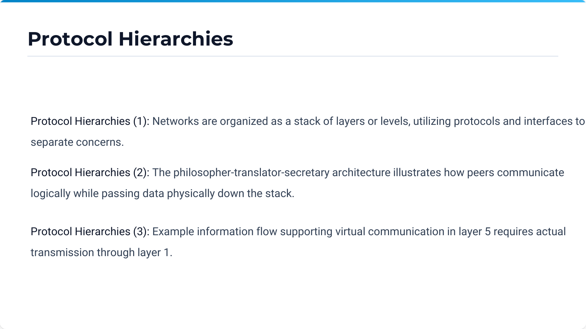
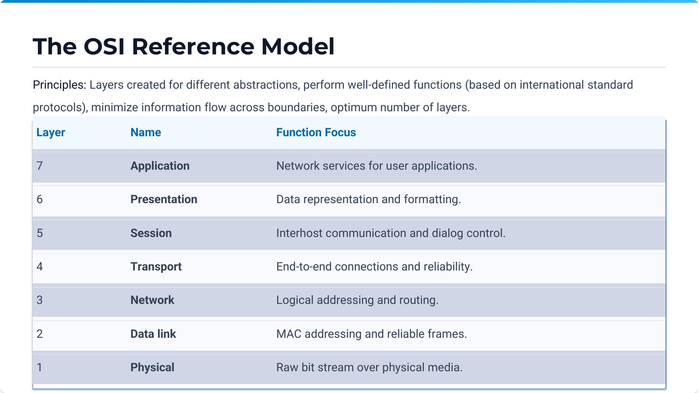

# Chapter 1 - Introduction to Computer Networks

## Source map

- `Ch 1 Introduction.pdf` (pp. 1-52) - primary faculty material.
- `Chapter1-Introduction.pdf` - supplementary presentation.
- `CN_Numericals_Data_Communication.pdf` - supplementary numericals relevant to network fundamentals.
- `cn_tutorial.pdf` (Tutorial 1) and `Computer_Networks_Question_Bank.pdf` (Unit 1) - supplementary practice.

## 1. Chapter overview

A computer network interconnects autonomous computers and devices so they can exchange information and share resources. This chapter covers applications, hardware, layered software, services, reference models, Internet evolution, wireless networks, standardization, and network units. [Source: Ch 1, pp. 3, 11, 23, 35, 40, 50]

## 2. Fundamental concepts and definitions

### Definition: Computer network

**Meaning:** A collection of autonomous computers that can exchange information through links such as copper, fiber, radio, infrared, microwave, or satellite.

**Intuition:** The machines cooperate but remain independently operable; a master with slave terminals is not a network of autonomous computers.

### Definition: Node, link, packet, datagram, and frame

| Term | Meaning |
| --- | --- |
| Node | Communicating device, such as a host, router, switch, printer, or sensor. |
| Link | Wired or wireless medium joining nodes. |
| Packet | Formatted network-layer unit. |
| Datagram | A connectionless packet independently routed to its destination. |
| Frame | Data-link-layer unit carrying a packet and link-control information. |

### Definition: Protocol, service, and interface

A **protocol** defines the format and meaning of messages exchanged by peer entities. A **service** is what a layer offers the layer above; an **interface** defines how that layer accesses the service. [Source: Ch 1, pp. 32-34]

### Definition: Encapsulation and decapsulation

Encapsulation adds control information as data moves down the stack. At the receiver, decapsulation removes and interprets that information as data moves up.

## 3. Applications and hardware

Networks support resource sharing, corporate databases, web applications, e-commerce, email, VoIP, and VPNs. In the client-server model, a client sends a request and a server supplies a reply. P2P systems have no fixed client/server roles; each peer may perform both roles. Mobile use combines wireless connectivity with cellular networks, hotspots, GPS, m-commerce, RFID/NFC, sensor networks, and wearables. [Source: Ch 1, pp. 3-8]

| Scale | Scope | Example |
| --- | --- | --- |
| PAN | A person's reach | Bluetooth peripherals |
| LAN | Room, building, or campus | Switched Ethernet or Wi-Fi |
| MAN | City | Cable-TV-derived network |
| WAN | Country or continent | VPN or ISP infrastructure |
| Internet | Global | Network of networks |

| Delivery model | Meaning |
| --- | --- |
| Unicast | One sender to one receiver |
| Multicast | One sender to a selected group |
| Broadcast | One sender to every station |
| Anycast | One sender to the nearest group member |

Broadcast links share one channel; point-to-point links connect individual pairs. [Source: Ch 1, pp. 12-22]

## 4. Layered network software

Layering separates communication into abstractions. Each layer provides a service upward, uses lower-layer services, and communicates logically with its peer through a protocol. Good layers have well-defined functions and minimize information crossing boundaries. [Source: Ch 1, pp. 25-29, 36]

| Property | Connection-oriented | Connectionless |
| --- | --- | --- |
| Analogy | Telephone | Postal system |
| Setup | Establish before transfer | No setup |
| Unit | Connection-associated stream/messages | Independently addressed datagrams |
| Examples in slides | Reliable message/byte stream | Unreliable or acknowledged datagram; request-reply |

The named connection-oriented service primitives are `LISTEN`, `CONNECT`, `RECEIVE`, `SEND`, and `DISCONNECT`. [Source: Ch 1, pp. 30-33]

## 5. Reference models

| OSI layer | Main responsibility |
| --- | --- |
| Application | Services used by applications |
| Presentation | Representation and formatting |
| Session | Dialog control |
| Transport | End-to-end connection and reliability |
| Network | Logical addressing and routing |
| Data Link | MAC addressing and reliable frames |
| Physical | Signals/raw bit stream |

TCP/IP has Application, Transport, Internet, and Link layers. The course uses Application, Transport, Network, Data Link, and Physical as a five-layer hybrid. TCP/IP's deployed protocols are widespread; OSI explicitly separates service, interface, and protocol. The faculty material lists OSI critiques as bad timing, technology, implementations, and politics. [Source: Ch 1, pp. 36-39]

## 6. Internet, wireless networks, and standards

ARPANET initially connected university hosts through IMPs; UCLA, UCSB, SRI, and Utah formed the four-node network in December 1969. NSFNET became a major academic backbone in 1988. The Internet is a TCP/IP-connected collection of ISP, regional, enterprise, and access networks. [Source: Ch 1, pp. 41-46]

Wi-Fi may use infrastructure mode through an access point or ad hoc peer-to-peer mode. Multipath fading arises when reflected signals arrive at different times; limited radio range can require multiple cells or repeaters. RFID reads tags and sensor networks commonly forward data over multiple hops. ITU, IEEE, and IETF are named standardization bodies. [Source: Ch 1, pp. 47-51]

## 7. Mathematical foundations and numerical examples

### Formula: Transmission and propagation delay

$$
T_{\mathrm{tx}}=\frac{L}{R}
$$

$$
T_{\mathrm{prop}}=\frac{d}{v}
$$

Where $L$ is transmitted bits, $R$ is bit rate, $d$ is link distance, and $v$ is propagation speed.

### Formula: Bandwidth-delay product

$$
\mathrm{BDP}=R\times\mathrm{RTT}
$$

It is the amount of data that can be outstanding over one round trip.

### Example: 10Base-5 propagation delay

For $d=2500\,\mathrm{m}$ and $v=0.60\times3\times10^8=1.8\times10^8\,\mathrm{m/s}$:

$$
T_{\mathrm{prop}}=\frac{2500}{1.8\times10^8}=13.9\,\mu\mathrm{s}
$$

[Source: CN Numericals Data Communication, Q1]

### Example: Question-bank file transfer

For $20\,\mathrm{MB}=160\,\mathrm{Mb}$ over $10\,\mathrm{Mb/s}$:

$$
T_{\mathrm{tx}}=\frac{160}{10}=16\,\mathrm{s}
$$

This excludes delays that the question does not specify. [Source: Question Bank Unit 1, Q14]

Networking prefixes are decimal: $\mathrm{K}=10^3$, $\mathrm{M}=10^6$, $\mathrm{G}=10^9$, and $\mathrm{T}=10^{12}$; memory conventions use powers of two. [Source: Ch 1, p. 50]

## 8. Formula and definition sheet

$$T_{\mathrm{tx}}=\frac{L}{R}\qquad T_{\mathrm{prop}}=\frac{d}{v}\qquad \mathrm{BDP}=R\times\mathrm{RTT}$$

- **Encapsulation:** add each layer's control information while moving downward.
- **Protocol:** peer-to-peer communication rules.
- **Service:** capability exposed to the upper layer.
- **Virtual circuit:** connection-oriented logical path created before transfer.
- **Datagram:** independently routed connectionless packet.

## 9. Exam-oriented review

### Direct question-bank answers

1. Logical addressing: **Network layer**. [Q1]
2. HTTP: **Application layer**. [Q2]
3. Connection-oriented protocol: **TCP**. [Q3]
4. Number of OSI layers: **seven**. [Q4]

### Long-answer preparation

- Explain all seven OSI layers with examples. [Q7]
- Differentiate OSI and TCP/IP. [Q8]
- Explain encapsulation and decapsulation. [Q9]
- Explain peer-to-peer communication in a layered architecture. [Q12]
- Compare circuit switching and packet switching. [Q20]

### Additional supplied practice

- A $5000$-byte message divided into $1000$-byte packets produces **five packets**. [Q17]
- $900$ useful bytes in a $1000$-byte frame gives **90% efficiency**. [Q18]
- $100\,\mathrm{Mb/s}$ with RTT $20\,\mathrm{ms}$ gives BDP $2\,\mathrm{Mb}$. [Q19]

## 10. Detailed source coverage

### Business, home, and social uses

**Resource sharing** means making programs, equipment, storage, and information available independently of the user's physical location. In a corporate client-server arrangement, information is retained at one or more servers while employees use client machines to request it. The request-reply structure also underlies web applications, email services, and corporate databases.

**VPNs** connect geographically separated office locations as one logical enterprise network over the public Internet. The chapter presents them as a secure and cost-effective alternative to a dedicated private WAN. Home networks provide Internet access, client-server applications, P2P applications, messaging, social media, IPTV, smart-home systems, and e-commerce. [Source: Ch 1, pp. 3-7, 20-22]

The social issues are not merely technical. Network neutrality concerns equal handling of traffic; the chapter also calls out copyright/DMCA, privacy, and phishing. A student should be able to explain each as a consequence of networked information exchange rather than simply list the terms. [Source: Ch 1, pp. 9-10]

### Hardware and switching terminology

Broadcast and point-to-point describe the **transmission technology**, while unicast, multicast, broadcast, and anycast describe the **delivery scope**. A LAN may use broadcast-capable local media yet carry a unicast frame to one receiver. Conversely, a WAN is usually built from many point-to-point links, and routing selects a path through them.

**PAN:** Bluetooth connects a computer to nearby peripherals in a short-range, often ad hoc, network.

**LAN:** A privately owned network over a room, building, or campus. Wireless LANs use IEEE 802.11; wired LANs commonly use switched Ethernet with cables to a central switch.

**MAN:** A city-wide network. The supplied example is cable TV infrastructure that evolved from community antennas into two-way broadband access.

**WAN:** A large-area network connecting sites across a country or continent. It may use a provider network or a VPN over the public Internet.

### Layering, peer entities, and service implementation

The philosopher-translator-secretary example in the faculty slides demonstrates a key idea: peers at the same layer appear to communicate directly, but the communication is implemented by handing data down to lower layers, crossing the physical medium, and moving back up. Thus, a Layer 5 message may be logically exchanged by Layer 5 peers, while actual signals must be produced by Layer 1.

**What the figure shows:** the motivation for protocol hierarchies: communication responsibilities are stacked rather than implemented as one monolithic procedure.

**Relationship:** each layer takes a service data unit from above, adds its own control information, and passes the result down. At the receiver, the reverse operation reconstructs the original upper-layer data. [Source: Ch 1, pp. 25-29]

### Service types in more detail

A **reliable message stream** preserves message boundaries and reliable delivery. A **reliable byte stream** provides a reliable ordered sequence of bytes, leaving message boundaries to the application. An **unreliable connection** has setup/release behavior without a full reliability promise. In contrast, an **unreliable datagram** can be lost; an **acknowledged datagram** gets individual confirmation; and **request-reply** supports simple client-server exchanges without a long-lived connection. [Source: Ch 1, pp. 30-33]

### OSI reference model - layer-by-layer explanation

**Physical layer:** transmits raw bits as electrical, optical, or radio signals. Its concern is the physical medium and signalling, not packet meaning.

**Data Link layer:** turns a raw transmission facility into a link that appears free of undetected errors to the Network layer. It deals with frames and MAC-level delivery.

**Network layer:** handles logical addresses and routing. It decides how packets move across interconnected networks.

**Transport layer:** provides end-to-end communication services, including reliability and connection management when the selected transport protocol provides them.

**Session layer:** manages dialogs between hosts.

**Presentation layer:** handles representation, translation, formatting, and related data-syntax concerns.

**Application layer:** supplies network services used by user applications. [Source: Ch 1, pp. 36-38]

**What the figure shows:** the OSI seven-layer stack and its functional emphasis.

**Connection:** the course's five-layer model retains the widely used pedagogical separation of Physical and Data Link layers while using the practical TCP/IP protocol family above them. [Source: Ch 1, pp. 36-39]

### Example networks and wireless operation

The ARPANET diagrams trace growth from a small collection of IMP-connected sites to a nationwide network. NSFNET subsequently served as a major backbone. These examples show that the Internet was formed by interconnecting networks, not by turning every host into a member of one physically uniform network.

In a wireless LAN, infrastructure mode uses an access point; ad hoc mode lets stations communicate without that central access point. Multipath fading is caused by paths reflected from objects; arrivals at different times interfere. When one radio's coverage does not span the required area, cells, repeaters, or multihop systems extend reach. Sensor networks use cooperating nodes to send observations toward a base station. [Source: Ch 1, pp. 41-49]

## 11. Extended formula sheet

### Formula: Signal period

$$
T=\frac{1}{f}
$$

Where $T$ is period in seconds and $f$ is frequency in hertz. This is useful whenever the network material specifies an underlying periodic signal.

### Formula: Useful-frame efficiency

$$
\eta=\frac{\text{useful payload bits}}{\text{total transmitted frame bits}}
$$

For the supplied $900$ useful bytes in a $1000$-byte frame, $\eta=0.9=90\%$. This assumes all bytes are counted using the same unit.

### Formula: Packet count

$$
N=\left\lceil\frac{\text{message size}}{\text{payload capacity per packet}}\right\rceil
$$

Use the ceiling because a nonzero final remainder still requires a packet. In Question-bank Q17, $5000/1000=5$ exactly.

## 12. Extended exam-oriented review

### Explain questions

1. Define a computer network and explain why the word **autonomous** matters.
2. Compare client-server and P2P architectures, including the roles of fixed servers/clients.
3. Differentiate broadcast and point-to-point transmission technologies.
4. Distinguish unicast, multicast, broadcast, and anycast delivery.
5. Explain why layering uses both protocols and interfaces.
6. Trace encapsulation of an application message through the five-layer course model.
7. Compare connection-oriented and connectionless service using the telephone and postal analogies.
8. Explain the OSI model and relate it to TCP/IP and the hybrid course model.

### Numerical questions

1. A signal travels $3000\,\mathrm{km}$ at $2\times10^8\,\mathrm{m/s}$. Compute propagation delay.
2. A $20\,\mathrm{MB}$ file crosses a $10\,\mathrm{Mb/s}$ link. State the assumptions needed before calculating transfer time.
3. For a $100\,\mathrm{Mb/s}$ path and $20\,\mathrm{ms}$ RTT, calculate BDP and explain its operational meaning.
