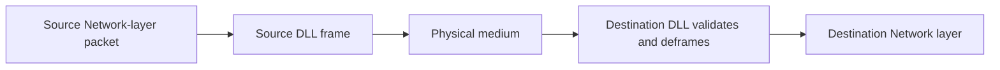
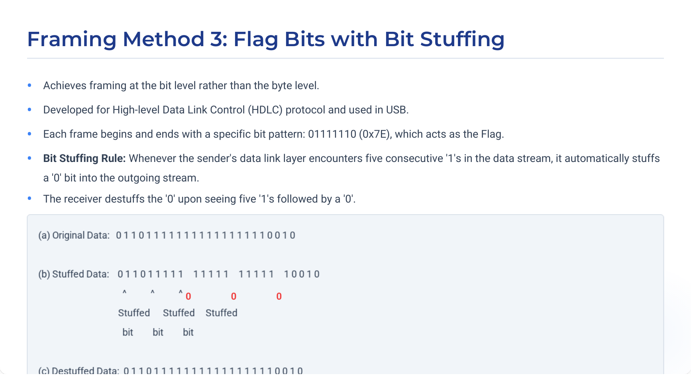
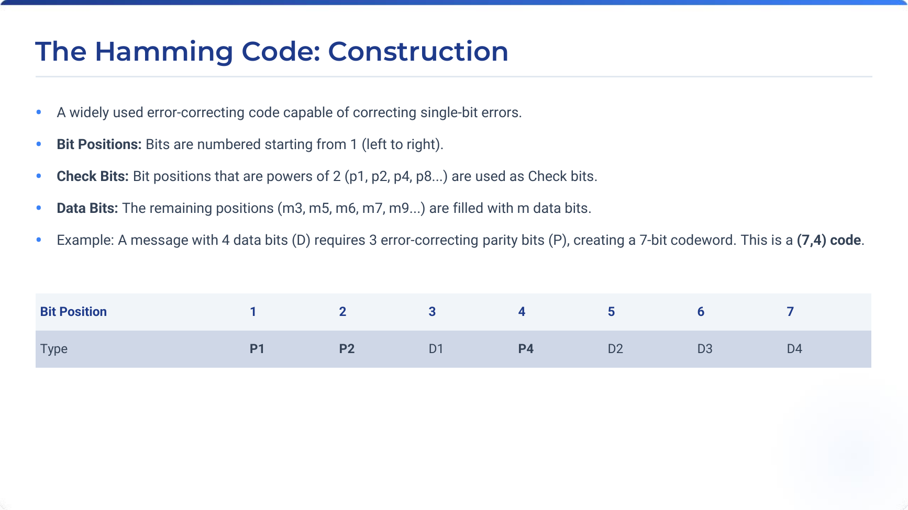
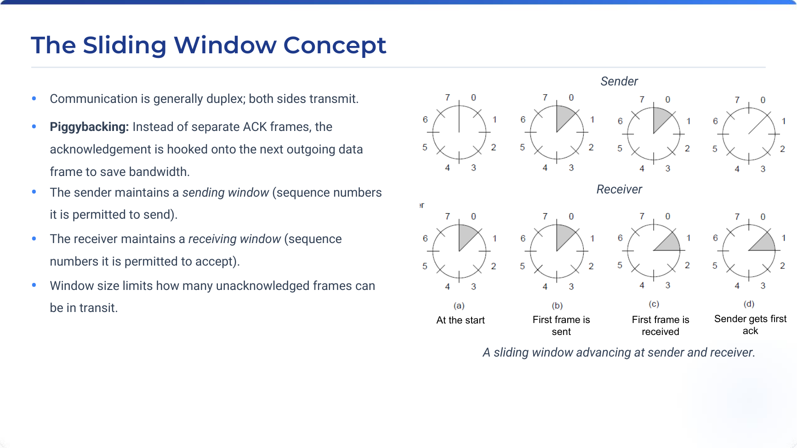
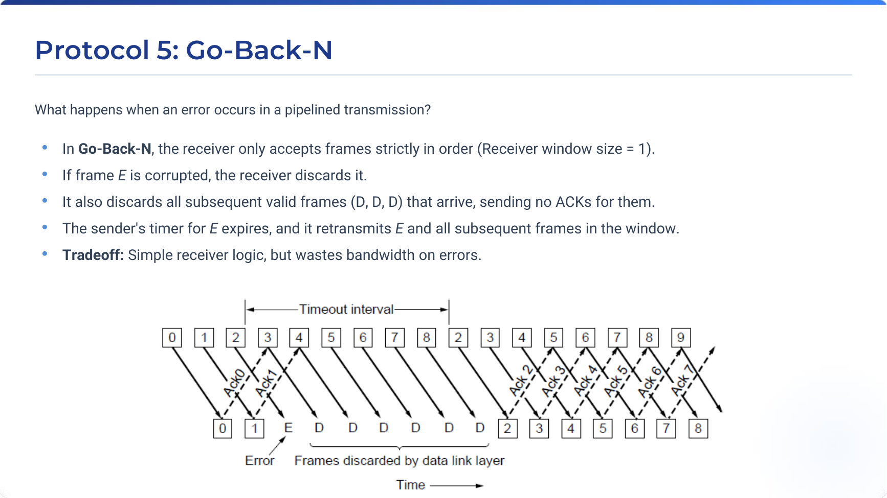
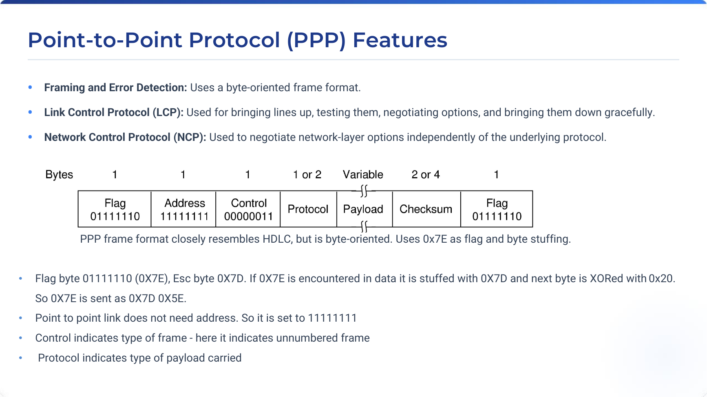

# Chapter 3 - Data Link Layer

## Source map

- `Ch 3 Data Link Layer.pdf` (pp. 1-69) - primary faculty material.
- `Chapter3-DataLinkLayer_NEW.pdf` - supplementary presentation.
- `CN_Numericals_Data_Link_Layer.pdf` - supplementary error-control and protocol numericals.
- `cn_tutorial.pdf` (Tutorials 1-3) and `Computer_Networks_Question_Bank.pdf` (Unit 2) - supplementary practice.

## 1. Chapter overview

The Data Link Layer transfers Network-layer packets between directly connected machines as frames. Real channels have limited bandwidth, delay, distortion, and errors, so the layer must frame a bit stream, control errors, and prevent a fast sender from overwhelming a slow receiver. [Source: Ch 3, pp. 3-6]

## 2. Fundamental concepts and services

### Definition: Frame

**Meaning:** A whole Data Link Layer transmission unit.

**Structure:** A frame has a header (addresses, sequence numbers, and other control data), a payload containing the Network-layer packet, and typically a trailer holding error-detection information. [Source: Ch 3, p. 5]

| Service | Characteristics | Use stated in source |
| --- | --- | --- |
| Unacknowledged connectionless | Independent frames; no setup, ACK, or recovery at DLL. | Low-error links and real-time traffic; Ethernet and VoIP examples. |
| Acknowledged connectionless | Each frame is individually ACKed; timeout causes retransmission. | Unreliable links such as Wi-Fi. |
| Acknowledged connection-oriented | Setup, numbered transfer, release; frames arrive once and in order. | Long-distance point-to-point/satellite links. |

The logical peer-to-peer path is virtual; actual transfer goes through the Physical layer. [Source: Ch 3, pp. 4-10]

## 3. Framing

Framing divides a continuous raw bit stream into identifiable blocks. This is necessary because an imperfect physical service can insert, delete, or alter bits. [Source: Ch 3, pp. 11-13]

| Method | Mechanism | Limitation or benefit |
| --- | --- | --- |
| Byte count | Header gives frame length. | A corrupted count loses synchronization. |
| Flag bytes and byte stuffing | FLAG delimits a frame; payload FLAG/ESC is preceded by ESC. | Receiver can resynchronize at the next flag. |
| Flag bits and bit stuffing | Flag is `01111110`; insert `0` after five payload `1`s. | Bit-level framing, used by HDLC and USB. |
| Coding violations | Invalid physical-layer signal pattern marks a boundary. | Requires an encoding with reserved invalid patterns. |

### Algorithm: byte stuffing

1. Begin and end each frame with FLAG.
2. Copy ordinary payload bytes.
3. Prefix payload FLAG and ESC bytes with ESC.
4. Remove the inserted ESC on reception.

For Tutorial 1's fragment `A B ESC C ESC FLAG FLAG D`, the stuffed payload is `A B ESC ESC C ESC ESC ESC FLAG ESC FLAG D`. [Source: Tutorial 1, Q2; Ch 3, pp. 15-17]

### Algorithm: bit stuffing

After five consecutive payload `1` bits, transmit a `0`; the receiver removes it. Tutorial 1's `0111101111101111110` becomes `011110111110011111010`. [Source: Tutorial 1, Q3; Ch 3, p. 18]

If a single bit error creates a false flag, a checksum normally detects the damage. No finite checksum makes the probability of undetected corruption zero; a longer checksum makes it lower. [Source: Tutorial 1, Q4]

## 4. Error detection and correction

### Definition: Hamming distance

The Hamming distance between equal-length codewords is the number of bit positions that differ. XOR the words and count the `1` bits. [Source: Ch 3, pp. 23-25]

### Formula: minimum distance

$$
d_{\min}\geq s+1
$$

detects up to $s$ errors, while

$$
d_{\min}\geq2s+1
$$

corrects up to $s$ errors. [Source: Ch 3, p. 25; DLL Numericals, pp. 4, 7]

### Example: Hamming distance

`0111110000111011 XOR 0111111000011001 = 0000001000100010`. The result contains three `1`s, so the distance is $3$. [Source: DLL Numericals, p. 2]

### Definition: Hamming code

Hamming codes place parity bits at positions $1,2,4,8,\ldots$ and data in the other positions. For an $m$-bit message and $r$ check bits, single-bit correction requires:

$$
2^r\geq m+r+1
$$

Four data bits with three parity bits form a $(7,4)$ code. Overlapping even-parity groups create a syndrome that identifies a single bad bit. [Source: Ch 3, pp. 26-30]

### Example: Hamming $(7,4)$

The supplied material encodes data `1101` as `1100110`. If `1110110` arrives, syndrome `101_2=5` identifies bit 5; flipping it restores the transmitted codeword. [Source: DLL Numericals, pp. 11-14]

### Definition: CRC and Internet checksum

**CRC** divides data with appended zeros by a shared generator polynomial using modulo-2 (XOR) arithmetic, appends the remainder, and expects a zero remainder at the receiver. It is strong against burst errors.

The **Internet checksum** adds 16-bit words with one's-complement arithmetic and complements the final sum. It is simpler in software than CRC but less robust. [Source: Ch 3, pp. 31-33]

### Algorithm: CRC generation

1. Let generator $G(x)$ have degree $r$.
2. Append $r$ zeros to message $M(x)$.
3. Divide by $G(x)$ using XOR division.
4. Append the $r$-bit remainder.
5. At reception, divide the codeword by $G(x)$; a zero remainder means no error was detected.

## 5. Flow control and elementary protocols

**Flow control** protects a finite-speed/buffer receiver. The chapter identifies feedback-based control, rate-based control, and credit-based control. [Source: Ch 3, p. 21]

| Protocol | Assumptions | Mechanism |
| --- | --- | --- |
| Utopian simplex | Perfect channel; infinite receiver speed/buffer. | Sender continuously sends one-way data. |
| Simplex stop-and-wait | Error-free channel; finite receiver. | Send one frame and wait for go-ahead. |
| PAR noisy-channel stop-and-wait | Frames and ACKs can be lost/damaged. | Timer, retransmission, ACKs, and 1-bit sequence numbers. |

If an ACK is lost, the sender retransmits; the sequence bit lets the receiver reject a duplicate. [Source: Ch 3, pp. 37-45]

## 6. Sliding-window protocols

A sending window contains sequence numbers currently permitted for transmission; a receiving window contains permitted arrivals. Piggybacking carries an ACK in a reverse-direction data frame. [Source: Ch 3, pp. 46-49]

### Formula: transmission time and utilization

$$
T_{\mathrm{tx}}=\frac{F}{R}
$$

$$
U_{\mathrm{SW}}=\frac{T_{\mathrm{tx}}}{T_{\mathrm{tx}}+\mathrm{RTT}+T_{\mathrm{ACK}}}
$$

For a $50\,\mathrm{kb/s}$ satellite channel, $1000$-bit frames take $20\,\mathrm{ms}$ to transmit. With $500\,\mathrm{ms}$ RTT, utilization is $20/(20+500)\approx3.85\%$. The chapter gives the high-utilization pipeline rule $w\geq2BD+1$, with $BD$ measured in frame units. [Source: Ch 3, p. 50]

### Go-Back-N and Selective Repeat

| Feature | Go-Back-N | Selective Repeat |
| --- | --- | --- |
| Receiver | Accepts only next in-order frame | Buffers valid out-of-order frames |
| On loss | Retransmit lost frame and later outstanding frames | Retransmit only missing/damaged frame |
| Storage/logic | Simple receiver | Higher storage and complexity |
| Window rule for sequence space $N$ | $W_s\leq N-1$ | $W_s\leq N/2$ |

GBN's receiver window is $1$. SR's half-space restriction prevents old and new sequence windows from overlapping. With 3-bit numbering ($N=8$), GBN permits at most $7$ and SR permits at most $4$. [Source: Ch 3, pp. 51-63]

## 7. PPP, SONET, and ADSL

Packet over SONET uses SONET for optical physical transfer and PPP as its link protocol. PPP is byte-oriented, resembles HDLC, uses flag `0x7E` and escape `0x7D`, and includes LCP for link setup/testing/options and NCP for network-layer option negotiation. A payload `0x7E` is sent as `0x7D 0x5E`. [Source: Ch 3, pp. 64-66]

ADSL uses legacy telephone copper. The chapter's stack is PC -> Ethernet -> DSL modem -> PPPoE -> AAL5 -> ATM -> ADSL -> DSLAM. AAL5 pads payload to a multiple of 48 bytes and includes length and CRC in its trailer. [Source: Ch 3, pp. 67-68]

## 8. Supplementary worked problems

### Tutorial 1: required rate

For $10\,\mathrm{km}$ with $10\,\mu\mathrm{s/km}$ one-way delay, RTT is $200\,\mu\mathrm{s}$. A $125$-byte packet contains $1000$ bits. If RTT equals transmission delay:

$$
R=\frac{1000}{200\times10^{-6}}=5\,\mathrm{Mb/s}
$$

[Source: Tutorial 1, Q1]

### Tutorial 2: stop-and-wait delivery

For $1000$ packets of $1000$ bits, distance $5000\,\mathrm{km}$, and $v=2\times10^8\,\mathrm{m/s}$, one-way delay is $25\,\mathrm{ms}$. Ignoring all other delays, each packet/ACK exchange takes $50\,\mathrm{ms}$, hence total delivery time is $50\,\mathrm{s}$. [Source: Tutorial 2, Q2]

### Tutorial 2: damaged GBN frame

With 3-bit numbers and window $7$, frames $0$ through $6$ were sent and frame $4$ was damaged. The supplied answer gives the current sender window as `4, 5, 6, 7, 0, 1, 2`. [Source: Tutorial 2, Q3; DLL Numericals, p. 32]

## 9. Formula and definition sheet

$$
n=m+r\qquad \text{code rate}=\frac{m}{n}
$$

$$
d_{\min}\geq s+1\qquad d_{\min}\geq2s+1
$$

$$
2^r\geq m+r+1
$$

$$
T_{\mathrm{tx}}=\frac{F}{R}\qquad U_{\mathrm{SW}}=\frac{T_{\mathrm{tx}}}{T_{\mathrm{tx}}+\mathrm{RTT}+T_{\mathrm{ACK}}}
$$

$$
W_{\mathrm{GBN}}\leq N-1\qquad W_{\mathrm{SR}}\leq\frac{N}{2}
$$

- **Framing:** identify start/end of frames in a bit stream.
- **CRC:** modulo-2 polynomial error-detection code.
- **Hamming distance:** number of differing bit positions.
- **ACK/NAK:** positive/negative feedback frame.
- **Piggybacking:** attach an ACK to outgoing data.

## 10. Exam-oriented review

### Direct question-bank answers

1. LLC means **Logical Link Control**. [Unit 2, Q21]
2. The Data Link layer uses a **MAC address**. [Q22]
3. The listed flow-control protocol is **Stop-and-Wait**. [Q23]
4. A **switch** operates using MAC addresses. [Q24]
5. A MAC address has **48 bits**. [Q25]
6. The listed Ethernet access method is **CSMA/CD**. [Q26]

### Long-answer practice

- Explain the four framing methods. [Q27]
- Explain Stop-and-Wait ARQ. [Q29]
- Differentiate GBN and SR. [Q30]
- Explain flow control and HDLC. [Q32-Q33]
- Find the minimum window for RTT $100\,\mathrm{ms}$, $R=10\,\mathrm{Mb/s}$, and $F=10000$ bits. [Q41]
- Determine if GBN/SR are possible with 3-bit numbering and sender window 5. [Q43]

### Quick checks

- $1500$ bytes on $5\,\mathrm{Mb/s}$ takes $12000/(5\times10^6)=2.4\,\mathrm{ms}$. [Q37]
- $1\,\mathrm{Gb/s}$ for $2$ seconds transmits $2\,\mathrm{Gb}$. [Q35]
- With $20\,\mu\mathrm{s}$ propagation and $10\,\mu\mathrm{s}$ transmission, total stated delay is $30\,\mu\mathrm{s}$ when other delays are ignored. [Q34]

## 11. Detailed source coverage

### Data Link Layer design issues

The Physical layer supplies a raw sequence of bits; it does not promise that frame boundaries are known or that the bits are error-free. The Data Link Layer therefore has four direct responsibilities: offer a service interface to the Network layer, make frames from Network-layer packets, deal with transmission errors, and regulate flow so that a fast sender does not overflow a slow receiver. [Source: Ch 3, pp. 3-5]

For reliable connection-oriented service, ACKs/NAKs, timers, and sequence numbers work together. ACK/NAK feedback informs the sender about reception. Timers ensure that a missing frame or ACK does not make the sender wait forever. Sequence numbers prevent a retransmitted frame from being delivered twice. [Source: Ch 3, p. 20]

### Framing methods - operational detail

**Byte count:** The receiver reads the count and knows how many bytes make up the frame. If the count itself is corrupted, a checksum may reveal that something is wrong but cannot identify the start of the following frame; synchronization is lost.

**Byte stuffing:** FLAG marks both frame start and frame end. A payload FLAG is transmitted as `ESC FLAG`; a payload ESC is transmitted as `ESC ESC`. This allows a byte-oriented receiver to search for the next unescaped FLAG after loss of synchronization.

**Bit stuffing:** HDLC-style flags are bit patterns, specifically `01111110`. The sender's inserted zero after any run of five ones ensures that a flag cannot appear inside valid payload. The receiver reverses this by removing a zero immediately following five ones.

**Coding violation:** Manchester and Differential Manchester normally require a mid-bit transition. A deliberate no-transition signal that cannot be valid data can serve as an unambiguous frame boundary. [Source: Ch 3, pp. 14-19]

**What the figure shows:** the fixed flag `01111110` and the bit-stuffing rule used to protect that pattern from occurring as data.

**Flow:** the sender stuffs a zero after five ones; the receiver recognizes five ones followed by zero and deletes the stuffed zero before delivering the payload. [Source: Ch 3, p. 18]

### Error-code fundamentals

Let $m$ be data bits, $r$ be redundant bits, and $n=m+r$ be total codeword length. An $(n,m)$ code has code rate $m/n$. A lower rate means more redundancy and is appropriate when error correction is more important; a high-quality channel can use a rate nearer $1$. [Source: Ch 3, p. 23]

The distance rules express why code distance matters. A received codeword must not be mistaken for a different valid codeword. To correct one error, valid codewords must be at least three positions apart; to detect one error, they need only be two positions apart.

### Hamming code construction and correction

For a seven-bit codeword, positions $1$, $2$, and $4$ are parity positions. Positions $3$, $5$, $6$, and $7$ hold the four data bits. The parity checks overlap:

| Parity bit | Protected positions |
| --- | --- |
| $P_1$ | $1,3,5,7$ |
| $P_2$ | $2,3,6,7$ |
| $P_4$ | $4,5,6,7$ |

With even parity, each group contains an even number of ones. At the receiver, the failed parity checks interpreted as a binary number give the erroneous bit position. This is why a single-bit error can be corrected rather than only detected. [Source: Ch 3, pp. 27-30]

**What the figure shows:** data-bit and parity-bit positions in a $(7,4)$ Hamming code.

**Components:** parity positions are powers of two; the other positions are payload data; overlapping parity groups identify a unique failed position. [Source: Ch 3, pp. 27-30]

### CRC and checksum distinction

CRC uses polynomial division over $\mathrm{GF}(2)$: addition and subtraction are both XOR, so there are no carries or borrows. The generator must be known to both parties. The sender appends a remainder with fewer bits than the generator degree, and the receiver tests divisibility of the complete codeword.

The Internet checksum instead forms 16-bit words, adds them with end-around carry under one's-complement arithmetic, then complements the sum. The receiver includes the checksum in the same arithmetic; a correct result is the all-ones condition after complement conventions. The source presents CRC as particularly robust against burst errors and checksum as easier in software but weaker. [Source: Ch 3, pp. 31-33]

### Implementation architecture

The PHY process and time-critical Data Link functions run on the Network Interface Card (NIC). The remaining Data Link and Network layer processing executes on the main CPU as part of the operating system, normally through a device driver. This division explains why framing/CRC can be performed close to the hardware while higher-level processing remains in software. [Source: Ch 3, p. 34]

### Protocol environment and elementary protocol assumptions

The protocol examples use C-like structures such as `packet` and `frame`, with fields such as kind, sequence number, acknowledgement number, and information. The analytical assumptions include a reliable connection-oriented service request from machine A to B, an effectively endless supply of data at A, and no machine crash during transfer. [Source: Ch 3, pp. 35-36]

**Protocol 1 - utopian simplex:** A purely baseline design. It is one-way, error-free, and assumes the receiver can always accept data. The sender sends as fast as possible.

**Protocol 2 - simplex stop-and-wait:** The receiver is finite. The sender must wait for a go-ahead control frame before sending the next data frame, solving the receiver-overrun problem in an error-free channel.

**Protocol 3 - PAR:** A damaged frame is discarded after checksum failure. A timer causes retransmission when ACK does not arrive. A one-bit sequence number is sufficient because only the current frame and its direct successor can be confused. [Source: Ch 3, pp. 37-45]

### Sliding windows and pipelining

**What the figure shows:** sender and receiver windows advancing as a frame is sent, received, and acknowledged.

**Flow:** the sender's permitted sequence-number region advances after acknowledgement; the receiver's acceptance region advances after delivery. Piggybacking places acknowledgement information on reverse data traffic. [Source: Ch 3, p. 46]

Stop-and-wait uses window size one. It is correct but performs poorly when propagation delay is large relative to frame transmission time. Pipelining permits up to $w$ outstanding frames and keeps the link busy during the time taken for prior frames/ACKs to travel.

For the satellite example, $50\,\mathrm{kb/s}$ and $1000$ bits gives $20\,\mathrm{ms}$ per frame. The $500\,\mathrm{ms}$ round trip makes a $520\,\mathrm{ms}$ stop-and-wait cycle. The source's $\approx4\%$ efficiency follows directly; this is not a link capacity problem but a window-size/round-trip problem. [Source: Ch 3, p. 50]

### Go-Back-N behavior

In GBN, when expected frame $E$ is damaged, the receiver rejects $E$ and all later frames arriving out of order. The sender's timer for $E$ eventually expires and the sender retransmits $E$ plus every subsequent frame still in its window. This avoids receiver buffering but repeats frames that may have arrived correctly.

**What the figure shows:** the protocol family begins with Go-Back-N treatment of loss and continues in later source slides to Selective Repeat.

**Critical distinction:** GBN uses a receiver window of one. Its sender window must be strictly below the sequence-number space, otherwise a delayed old frame can be indistinguishable from a new reused sequence number. [Source: Ch 3, pp. 51-56]

### Selective Repeat behavior

SR accepts valid frames that arrive out of order, buffers them, and later delivers them when the missing earlier frame arrives. It retransmits only the damaged/missing frame and can use NAKs to avoid waiting for timeout. This saves bandwidth under errors but requires more buffers and more careful sequence-number handling. The maximum window is half the sequence number space so old and new windows cannot overlap. [Source: Ch 3, pp. 57-63]

### PPP, SONET, and ADSL details

PPP's `0x7E` flag and `0x7D` escape are byte-oriented equivalents of the framing ideas covered earlier. PPP has no need for a meaningful destination address on a point-to-point link, so the address field is set to `11111111`; the control field identifies an unnumbered frame and the protocol field identifies the payload type. LCP brings a line up, tests it, negotiates options, and releases it gracefully. NCP separately negotiates Network-layer options. [Source: Ch 3, pp. 64-66]

**What the figure shows:** byte-oriented PPP framing and the transition to the ADSL discussion.

**Connection:** PPP data can be carried through PPPoE, AAL5, ATM, and ADSL before reaching the DSLAM; AAL5 pads to a multiple of 48-byte ATM payload units and appends a length/CRC trailer. [Source: Ch 3, pp. 65-68]

## 12. Extended worked numerical problems

### Worked problem: minimum Hamming distance

**Question:** What minimum distance detects up to $s$ errors?

**Formula:**

$$
d_{\min}=s+1
$$

**Reason:** any received word changed in up to $s$ positions must not coincide with another valid codeword. For correction, the received word must be closer to its original codeword than to any other valid word, requiring $d_{\min}=2s+1$. [Source: DLL Numericals, pp. 4-7]

### Worked problem: Earth-to-planet stop-and-wait utilization

The supplied numerical material gives distance $9\times10^{10}\,\mathrm{m}$, speed $3\times10^8\,\mathrm{m/s}$, link rate $64\,\mathrm{Mb/s}$, and frame size $32\,\mathrm{KB}$.

$$
T_{\mathrm{prop}}=\frac{9\times10^{10}}{3\times10^8}=300\,\mathrm{s}
$$

The source computes a bandwidth-delay quantity of $19.2\,\mathrm{Gbit}$ and approximately $75000$ frames in one one-way delay, leading to extremely low stop-and-wait utilization of $6.67\times10^{-4}\%$. It then gives a send window of $150001$ frames for $100\%$ utilization under the stated simplifications. [Source: DLL Numericals, pp. 28-29]

## 13. Expanded exam-oriented review

### Definitions to memorize

- Explain frame, packet, ACK, NAK, timeout, sequence number, flow control, and piggybacking.
- State the byte-stuffing and bit-stuffing rules exactly.
- Define Hamming distance, code rate, CRC, checksum, GBN, and SR.

### Compare questions

1. Error-correcting versus error-detecting codes.
2. Byte stuffing versus bit stuffing.
3. Stop-and-wait versus sliding-window flow control.
4. Go-Back-N versus Selective Repeat.
5. CRC versus Internet checksum.

### Numerical questions from supplied material

1. Compute a Hamming distance by XOR. [DLL Numericals, p. 2]
2. Generate and verify CRC for `1001` with generator `1011`. [pp. 8-9]
3. Determine stop-and-wait utilization/frame size/window size from rate, delay, and frame information. [pp. 19, 27-30]
4. Determine GBN sequence-number bits for a long trunk. [p. 31]
5. For Question-bank Q41, use the bandwidth-delay product to find the smallest sender window needed for full use of the link.
