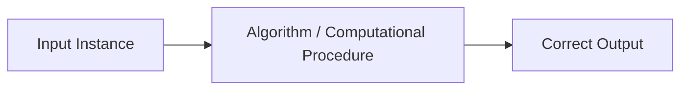
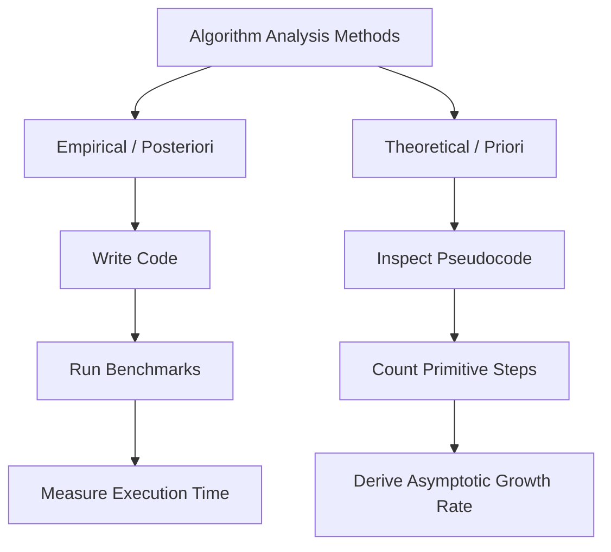
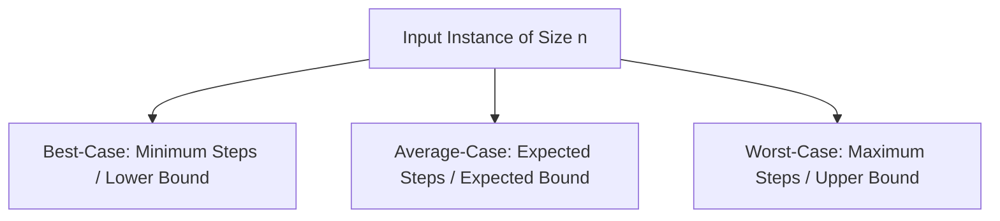
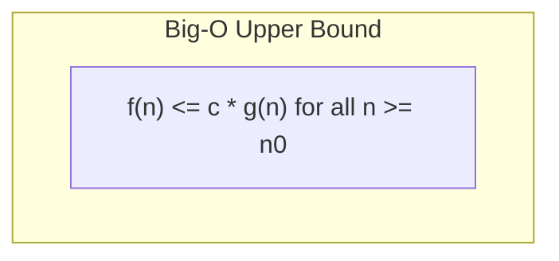

# Chapter 1 — Unit-I: Elementary Algorithmic

> **Course Code:** 3CS501CC24 / 2CS503
> **Course Title:** Design & Analysis of Algorithms (DAA)
> **Primary Source:** Faculty Lecture Material (LMS)
> **Files Integrated:** `DAA_Unit 0_Introduction.pptx` (Slides 1–24), `DAA_Unit1.pptx` (Slides 1–56)

---

## Source map

- `DAA_Unit 0_Introduction.pptx` (Slides 1–24) — primary faculty lecture material.
- `DAA_Unit1.pptx` (Slides 1–56) — primary faculty lecture material.

---

## 1. Chapter Overview

Unit-I introduces the theoretical and mathematical foundations required to design and evaluate computational algorithms. The primary goal of algorithm analysis is to predict resource consumption—principally execution time and memory footprint—independent of specific hardware platforms, operating systems, or programming languages. This chapter covers formal algorithm definitions, essential operational properties, theoretical vs. empirical evaluation approaches, input sizing, elementary operations under the Random Access Machine (RAM) model, and formal asymptotic bounds ($\mathcal{O}, \Omega, \Theta, o, \omega$).

[Source: DAA_Unit 0_Introduction.pptx, Slides 1–5; DAA_Unit1.pptx, Slides 1–5]

---

## 2. Fundamental Concepts of Algorithms

### 2.1 Formal Definition of an Algorithm
An **algorithm** is any well-defined computational procedure that takes some value, or set of values, as **input** and produces some value, or set of values, as **output**. It represents an unambiguous sequence of computational steps that transforms the input into the desired output.

### 2.2 Problem vs. Instance
* **Computational Problem:** A formal specification of the desired input/output relationship (e.g., "Sort an array of numbers in non-decreasing order").
* **Instance of a Problem:** A specific input sequence satisfying the constraints specified in the problem statement. For example, given the sorting problem, the sequence $(31, 41, 59, 26, 41, 58)$ is a problem instance of size $n = 6$, for which the algorithm must return $(26, 31, 41, 41, 58, 59)$.

### 2.3 Characteristics of an Algorithm
To qualify as a valid algorithm, a computational procedure must satisfy six fundamental properties:

1. **Finiteness:** An algorithm must always terminate after a finite number of execution steps.
2. **Definiteness:** Each step of an algorithm must be precisely, unambiguously defined.
3. **Input:** An algorithm has zero or more specified inputs supplied prior to execution.
4. **Output:** An algorithm must produce at least one output corresponding to the intended solution.
5. **Effectiveness:** Every operation must be basic enough to be carried out exactly and in finite time.
6. **Correctness:** For every input instance, the algorithm halts with the correct output. Correctness is the most crucial property of an algorithm.

[Source: DAA_Unit 0_Introduction.pptx, Slides 6–13; DAA_Unit1.pptx, Slides 6–7]

---

## 3. Core Terminology Dictionary

### Core Terminology Dictionary

1. **Algorithm:** An unambiguous, step-by-step computational procedure transforming inputs to outputs.
2. **Problem Instance:** A specific set of inputs satisfying all problem constraints needed to compute a solution.
3. **Instance Size ($n$):** A numeric quantity measuring the magnitude of the input (e.g., number of elements to sort, number of graph vertices/edges, number of bits in an integer).
4. **Correct Algorithm:** An algorithm that halts with the accurate output for *every* valid input instance.
5. **Primitive Operation:** An elementary instruction (addition, assignment, comparison, array indexing) executed in $\mathcal{O}(1)$ constant time.
6. **RAM Model (Random Access Machine):** A theoretical single-processor model where instructions are executed sequentially without concurrency, and each primitive operation takes $\mathcal{O}(1)$ time.
7. **Time Complexity:** The amount of execution time required by an algorithm, modeled as a function of input size $n$.
8. **Space Complexity:** The total working memory (storage) required by an algorithm during execution as a function of input size $n$.
9. **Growth Rate:** The relative rate at which an algorithm's running time increases as the input size $n$ approaches infinity.
10. **Asymptotic Analysis:** Evaluation of an algorithm's resource consumption for large input sizes $n \to \infty$, ignoring constant factors and lower-order terms.

[Source: DAA_Unit 0_Introduction.pptx, Slides 10–22; DAA_Unit1.pptx, Slides 3–7]

---

### Definition: Random Access Machine (RAM) Model

**Meaning:**
The RAM model provides a standard, platform-independent theoretical model of computation to analyze algorithms without running them on physical hardware.

**Formal Definition:**
In the single-processor RAM model:
* Instructions are executed strictly sequentially (no parallelism).
* Standard arithmetic operations ($+, -, \times, \div, \lfloor \cdot \rfloor, \lceil \cdot \rceil$), data movement ($\text{load}, \text{store}, \text{copy}$), and control operations ($\text{branch}, \text{procedure call}$) each consume $c = \mathcal{O}(1)$ unit time.
* Memory is unbounded, and accessing any memory address takes $\mathcal{O}(1)$ time.

**Intuition:**
By counting the number of primitive steps executed on a RAM machine, algorithm analysis becomes independent of processor clock speed, compiler optimization, or programming language.

**Example:**
Executing `sum = sum + A[i]` consists of array indexing, addition, and assignment, each taking constant RAM steps, resulting in $\mathcal{O}(1)$ total time for that single line.

[Source: DAA_Unit 0_Introduction.pptx, Slide 19]

---

## 4. Efficiency of Algorithms & Elementary Operations

### 4.1 Why Algorithmic Efficiency Matters
Algorithms devised to solve the same problem often exhibit vastly different efficiencies. These differences impact performance far more than hardware upgrades.

Consider sorting $n = 10,000,000$ ($10^7$) numbers on two different computers:
* **Computer A (Supercomputer):** Executes $10^{10}$ instructions/second. Runs **Insertion Sort** with running time $T_A(n) = 2n^2$ instructions.
* **Computer B (Standard Computer):** Executes $10^7$ instructions/second ($1,000\times$ slower than Computer A). Runs **Merge Sort** with running time $T_B(n) = 50 n \log_2 n$ instructions.

#### Worked Calculation: Crossover Analysis

$$
\begin{aligned}
\text{Time}_A &= \frac{2 \times (10^7)^2}{10^{10} \text{ inst/sec}} = \frac{2 \times 10^{14}}{10^{10}} = 20,000 \text{ seconds} \approx 5.56 \text{ hours} \\
\text{Time}_B &= \frac{50 \times 10^7 \times \log_2(10^7)}{10^7 \text{ inst/sec}} \approx \frac{50 \times 10^7 \times 23.2534}{10^7} = 1,162.67 \text{ seconds} \approx 19.38 \text{ minutes}
\end{aligned}
$$

Even though Computer A is $1,000$ times faster in raw hardware speed, Merge Sort on the slower computer completes the task over **28 times faster** due to superior algorithmic asymptotic complexity ($\mathcal{O}(n \log n)$ vs $\mathcal{O}(n^2)$).

[Source: DAA_Unit 0_Introduction.pptx, Slides 16–18]

---

### 4.2 Space Complexity vs. Time Complexity

* **Space Complexity:** Total memory required by an algorithm during execution.
$$
  S(P) = c + S_p(n)
$$
  where $c$ is fixed memory (code space, simple variables) and $S_p(n)$ is dynamic memory (instance-dependent arrays, recursion stack).
* **Significance:** Storage hardware is cheap and abundant; computational time is a scarce resource. Therefore, **Time Complexity** is universally prioritized over Space Complexity in algorithm performance evaluation.

[Source: DAA_Unit 0_Introduction.pptx, Slides 22–24]

---

## 5. Analysis Techniques: Empirical vs. Mathematical Analysis

Algorithm performance can be evaluated using two fundamental paradigms:

| Attribute | Empirical (Posteriori) Analysis | Mathematical / Theoretical (Priori) Analysis |
| :--- | :--- | :--- |
| **Approach** | Implement code, execute on physical hardware, measure wall-clock time using timers (`System.currentTimeMillis()`). | Analyze pseudocode mathematically by counting primitive operations as a function of input size $n$. |
| **Hardware Dependence** | Heavily dependent on processor, RAM, OS, compiler, and background processes. | Completely hardware and compiler independent. |
| **Input Coverage** | Limited to specific benchmark inputs tested during experiment. | Evaluates algorithm behavior over all possible input instances of size $n$. |
| **Implementation Effort**| High; requires complete, bug-free implementation in executable code. | Low; requires only pseudocode or mathematical description. |
| **Predictive Power** | Cannot reliably predict running time for untested, larger inputs. | Provides exact asymptotic growth rates for $n \to \infty$. |

[Source: DAA_Unit1.pptx, Slides 4–5, 19–20]

---

## 6. Analysis Framework: Best-Case, Average-Case, and Worst-Case

An algorithm's execution steps depend not only on input size $n$, but also on the specific configuration/arrangement of input data.

### 6.1 Definitions and Properties

1. **Best-Case Analysis:**
   * **Meaning:** The minimum number of steps executed by an algorithm on any input of size $n$.
   * **Significance:** Represents optimal behavior under ideal conditions. Provides a lower bound, but is rarely useful in practice because best-case scenarios seldom occur in real-world workloads.
2. **Average-Case Analysis:**
   * **Meaning:** The expected number of steps executed over all possible input instances of size $n$, assuming a uniform probability distribution over inputs.
   * **Significance:** Reflects realistic day-to-day performance. Often mathematically complex to compute due to probability modeling.
3. **Worst-Case Analysis:**
   * **Meaning:** The maximum number of steps executed by an algorithm on any input instance of size $n$.
   * **Significance:** Guarantees an absolute upper bound on execution time. Essential for real-time systems, critical applications, and reliable theoretical guarantees.

---

### 6.2 Illustrative Benchmark Examples

| Problem | Best-Case Scenario | Average-Case Scenario | Worst-Case Scenario |
| :--- | :--- | :--- | :--- |
| **Linear Search** | Target element is at the first index ($1$ comparison). | Target element is located at index $\frac{n+1}{2}$ ($\approx \frac{n}{2}$ comparisons). | Target element is at the last index or missing ($n$ comparisons). |
| **Book Finder** | Book is the very first one checked ($1$ check). | Book is located near the middle of the shelf ($\approx \frac{n}{2}$ checks). | Book is the last one or not on shelf ($n$ checks). |
| **Ascending Sort** | Array is already sorted in ascending order ($0$ swaps). | Array elements are in random order ($\approx \frac{n(n-1)}{4}$ swaps). | Array is reverse-sorted in descending order ($\approx \frac{n(n-1)}{2}$ swaps). |

[Source: DAA_Unit1.pptx, Slides 11–17]

---

## 7. Asymptotic Notations & Growth Rates

Asymptotic notation provides a mathematical language for describing the growth rate of an algorithm's running time $f(n)$ as input size $n$ becomes arbitrarily large.

---

### 7.1 Big-$\mathcal{O}$ Notation (Asymptotic Upper Bound)

#### Definition: Big-$\mathcal{O}$ Notation

**Formal Definition:**
For a given function $g(n)$, $\mathcal{O}(g(n))$ is the set of functions:
$$
\mathcal{O}(g(n)) = \{ f(n) : \text{there exist positive constants } c > 0 \text{ and } n_0 > 0 \text{ such that } 0 \le f(n) \le c \cdot g(n) \text{ for all } n \ge n_0 \}
$$

$$
\begin{aligned}
f(n) = \mathcal{O}(g(n)) \implies f(n) \le c \cdot g(n) \quad \forall n \ge n_0
\end{aligned}
$$

**Intuition:**
$\mathcal{O}(g(n))$ bounds the worst-case running time from above. The running time of the algorithm will never exceed $c \cdot g(n)$ for large inputs.

#### Worked Example: Proving $2n + 6 = \mathcal{O}(n)$
* **Given:** $f(n) = 2n + 6$, $g(n) = n$.
* **Requirement:** Find constants $c > 0, n_0 > 0$ such that $2n + 6 \le c \cdot n$ for $n \ge n_0$.
* **Derivation:**
$$
  2n + 6 \le 2n + 6n = 8n \quad (\text{for all } n \ge 1)
$$
* **Conclusion:** Selecting $c = 8$ and $n_0 = 1$ satisfies $0 \le 2n+6 \le 8n$ for all $n \ge 1$. Hence, $2n+6 = \mathcal{O}(n)$.

[Source: DAA_Unit1.pptx, Slides 28–31]

---

### 7.2 Big-$\Omega$ Notation (Asymptotic Lower Bound)

#### Definition: Big-$\Omega$ Notation

**Formal Definition:**
For a given function $g(n)$, $\Omega(g(n))$ is the set of functions:
$$
\Omega(g(n)) = \{ f(n) : \text{there exist positive constants } c > 0 \text{ and } n_0 > 0 \text{ such that } 0 \le c \cdot g(n) \le f(n) \text{ for all } n \ge n_0 \}
$$

$$
\begin{aligned}
f(n) = \Omega(g(n)) \implies f(n) \ge c \cdot g(n) \quad \forall n \ge n_0
\end{aligned}
$$

**Intuition:**
$\Omega(g(n))$ provides an absolute lower bound on running time. The algorithm takes *at least* $c \cdot g(n)$ time for all large inputs.

#### Worked Example: Proving $3n^2 + 2n + 4 = \Omega(n^2)$
* **Given:** $f(n) = 3n^2 + 2n + 4$, $g(n) = n^2$.
* **Requirement:** Find $c > 0, n_0 > 0$ such that $c \cdot n^2 \le 3n^2 + 2n + 4$.
* **Derivation:**
  For $n \ge 1$, $2n + 4 \ge 0$, so:
$$
  3n^2 \le 3n^2 + 2n + 4
$$
* **Conclusion:** Selecting $c = 3$ and $n_0 = 1$ satisfies $3n^2 \le f(n)$ for all $n \ge 1$. Hence, $3n^2+2n+4 = \Omega(n^2)$.

[Source: DAA_Unit1.pptx, Slides 33–34, 53]

---

### 7.3 Big-$\Theta$ Notation (Asymptotically Tight Bound)

#### Definition: Big-$\Theta$ Notation

**Formal Definition:**
For a given function $g(n)$, $\Theta(g(n))$ is the set of functions:
$$
\Theta(g(n)) = \{ f(n) : \text{there exist positive constants } c_1 > 0, c_2 > 0, n_0 > 0 \text{ such that } 0 \le c_1 \cdot g(n) \le f(n) \le c_2 \cdot g(n) \text{ for all } n \ge n_0 \}
$$

$$
\begin{aligned}
f(n) = \Theta(g(n)) \iff f(n) = \mathcal{O}(g(n)) \quad \text{and} \quad f(n) = \Omega(g(n))
\end{aligned}
$$

#### Worked Example: Proving $3n + 2 = \Theta(n)$
* **Given:** $f(n) = 3n + 2$, $g(n) = n$.
* **Requirement:** Find $c_1, c_2 > 0$ and $n_0 > 0$ such that $c_1 n \le 3n + 2 \le c_2 n$ for all $n \ge n_0$.
* **Derivation:**
  For $n \ge 1$:
$$
  2n \le 3n + 2 \le 5n
$$
* **Conclusion:** Choosing $c_1 = 2$, $c_2 = 5$, and $n_0 = 1$ proves $3n+2 = \Theta(n)$.

[Source: DAA_Unit1.pptx, Slides 35–36, 55]

---

### 7.4 Little-$o$ and Little-$\omega$ Notations (Strict Bounds)

| Notation | Formal Definition | Limit Definition | Analogy |
| :--- | :--- | :--- | :--- |
| **Little-$o$** ($f(n) = o(g(n))$) | $\forall c > 0, \exists n_0 > 0 \text{ s.t. } 0 \le f(n) < c \cdot g(n) \; \forall n \ge n_0$ | $\lim_{n \to \infty} \frac{f(n)}{g(n)} = 0$ | $f < g$ |
| **Little-$\omega$** ($f(n) = \omega(g(n))$) | $\forall c > 0, \exists n_0 > 0 \text{ s.t. } 0 \le c \cdot g(n) < f(n) \; \forall n \ge n_0$ | $\lim_{n \to \infty} \frac{f(n)}{g(n)} = \infty$ | $f > g$ |

[Source: DAA_Unit1.pptx, Slide 49]

---

### 7.5 Hierarchy of Function Growth Rates

The relative asymptotic growth of standard functions in increasing order is:

$$
\mathcal{O}(1) < \mathcal{O}(\log \log n) < \mathcal{O}(\log n) < \mathcal{O}(\sqrt{n}) < \mathcal{O}(n) < \mathcal{O}(n \log n) < \mathcal{O}(n^2) < \mathcal{O}(n^3) < \mathcal{O}(2^n) < \mathcal{O}(n!) < \mathcal{O}(n^n)
$$

#### Growth Table Comparison for Specific Values of $n$

| $n$ | $\log_2 n$ | $n \log_2 n$ | $n^2$ | $n^3$ | $2^n$ | $n!$ |
| :---: | :---: | :---: | :---: | :---: | :---: | :---: |
| **4** | 2 | 8 | 16 | 64 | 16 | 24 |
| **16** | 4 | 64 | 256 | 4,096 | 65,536 | $2.09 \times 10^{13}$ |
| **64** | 6 | 384 | 4,096 | 262,144 | $1.84 \times 10^{19}$ | $1.26 \times 10^{89}$ |
| **1024** | 10 | 10,240 | 1,048,576 | $1.07 \times 10^9$ | $1.79 \times 10^{308}$ | $\infty$ |

[Source: DAA_Unit1.pptx, Slides 41–42]

---

## 8. Methods of Proving Asymptotic Bounds

### 8.1 Method 1: Proof by Definition
Determines explicit positive constants $c$ and $n_0$ satisfying the formal inequality.

#### Worked Problem: Prove $6n + 3 = \mathcal{O}(n)$
1. **Inequality setup:** $6n + 3 \le c \cdot n$.
2. **Algebraic grouping:** For $n \ge 1$, $3 \le 3n$, so $6n + 3 \le 6n + 3n = 9n$.
3. **Values:** $c = 9, n_0 = 1$.
4. **Alternative solution (Tabular/Search):**
   * If $c = 7$: $6n + 3 \le 7n \implies n \ge 3$. Thus $c = 7, n_0 = 3$ is also valid.

[Source: DAA_Unit1.pptx, Slide 52]

---

### 8.2 Method 2: Proof by Limit Rules

For two positive functions $f(n)$ and $g(n)$, evaluate $L = \lim_{n \to \infty} \frac{f(n)}{g(n)}$:
1. If $L = 0 \implies f(n) = o(g(n))$ and $f(n) = \mathcal{O}(g(n))$.
2. If $L = c > 0 \implies f(n) = \Theta(g(n))$.
3. If $L = \infty \implies f(n) = \omega(g(n))$ and $f(n) = \Omega(g(n))$.

#### Worked Problem: Prove $\sqrt{n}$ grows faster than $\log n$
* Let $f(n) = \sqrt{n}$ and $g(n) = \log_e n$. Compute $L$:
$$
  L = \lim_{n \to \infty} \frac{\log n}{\sqrt{n}}
$$
  Applying L'Hôpital's Rule ($\frac{\infty}{\infty}$ form):
$$
  L = \lim_{n \to \infty} \frac{\frac{d}{dn}(\log n)}{\frac{d}{dn}(n^{1/2})} = \lim_{n \to \infty} \frac{\frac{1}{n}}{\frac{1}{2\sqrt{n}}} = \lim_{n \to \infty} \frac{2\sqrt{n}}{n} = \lim_{n \to \infty} \frac{2}{\sqrt{n}} = 0
$$
* **Result:** Since the limit is $0$, $\log n = o(\sqrt{n})$, which proves that $\sqrt{n}$ grows strictly faster than $\log n$.

[Source: DAA_Unit1.pptx, Slides 46, 48]

---

## 9. Asymptotic Rules & Notations in Equations

### 9.1 Maximum Rule
When adding polynomial or non-polynomial components, lower-order terms become negligible as $n \to \infty$:

$$
\mathcal{O}(f(n) + g(n)) = \mathcal{O}(\max(f(n), g(n)))
$$

#### Examples:
* $n^4 + 100n^2 + 10n + 50 = \mathcal{O}(n^4)$
* $10n^3 + 2n^2 = \mathcal{O}(n^3)$
* $5n \log n + 2^n = \mathcal{O}(2^n)$

### 9.2 Elephants and Goldfish Analogy
If total cost equals $\text{Cost of Elephants} + \text{Cost of Goldfish}$, since the elephant cost dominates exponentially, total cost $\approx \text{Cost of Elephants}$, rendering goldfish cost asymptotically negligible.

[Source: DAA_Unit1.pptx, Slide 44]

---

## 10. Formula Sheet (Unit-I)

### 1. Big-$\mathcal{O}$ Upper Bound
$$
0 \le f(n) \le c \cdot g(n) \quad \forall n \ge n_0
$$

### 2. Big-$\Omega$ Lower Bound
$$
0 \le c \cdot g(n) \le f(n) \quad \forall n \ge n_0
$$

### 3. Big-$\Theta$ Tight Bound
$$
0 \le c_1 \cdot g(n) \le f(n) \le c_2 \cdot g(n) \quad \forall n \ge n_0
$$

### 4. Limit Evaluation Rule
$$
\lim_{n \to \infty} \frac{f(n)}{g(n)} = L \implies \begin{cases} 0 & f = o(g) \\ c > 0 & f = \Theta(g) \\ \infty & f = \omega(g) \end{cases}
$$

### 5. Maximum Rule
$$
\mathcal{O}(f(n) + g(n)) = \mathcal{O}(\max(f(n), g(n)))
$$

[Source: DAA_Unit1.pptx, Slides 28–49]

---

## 11. Definition Sheet (Unit-I)

* **Algorithm:** Unambiguous step-by-step computational procedure transforming input to output.
* **Finiteness:** Guarantee of termination after finite steps.
* **Definiteness:** Absolute clarity and lack of ambiguity in every step.
* **Correctness:** Halting with accurate output for all valid inputs.
* **RAM Model:** Theoretical single-processor machine where primitive operations take $\mathcal{O}(1)$ time.
* **Worst-Case Complexity:** Maximum time/space resources required for input of size $n$.
* **Average-Case Complexity:** Expected resource consumption averaged over all inputs of size $n$.
* **Best-Case Complexity:** Minimum resources required under ideal input conditions.
* **Asymptotic Upper Bound ($\mathcal{O}$):** Formal limit capping maximum growth rate.
* **Asymptotically Tight Bound ($\Theta$):** Exact growth rate matching upper and lower bounds.

[Source: DAA_Unit 0_Introduction.pptx, Slides 6–22; DAA_Unit1.pptx, Slides 6–37]

---

## 12. Exam-Oriented Review & Worked Problems (Unit-I)

### Worked Numerical Problem 1.1
**Problem:** Find the tight bound $\Theta$ for $f(n) = 2n^3 + 4n + 5$.
**Given:** $f(n) = 2n^3 + 4n + 5$, $g(n) = n^3$.
**Required:** Find $c_1, c_2, n_0 > 0$ such that $c_1 n^3 \le 2n^3 + 4n + 5 \le c_2 n^3$.
**Solution Steps:**
1. For lower bound: $2n^3 \le 2n^3 + 4n + 5$ for all $n \ge 1 \implies c_1 = 2$.
2. For upper bound ($n \ge 1$): $2n^3 + 4n + 5 \le 2n^3 + 4n^3 + 5n^3 = 11n^3 \implies c_2 = 11$.
**Final Answer:** $f(n) = \Theta(n^3)$ for $c_1 = 2, c_2 = 11, n_0 = 1$.

[Source: DAA_Unit1.pptx, Slide 54]

---

### Worked Numerical Problem 1.2
**Problem:** Prove or disprove whether $2^{n+1} = \mathcal{O}(2^n)$ and whether $2^{2n} = \mathcal{O}(2^n)$.
**Solution Steps:**
1. **Part (i) $2^{n+1}$:**
$$
   2^{n+1} = 2^1 \cdot 2^n = 2 \cdot 2^n
$$
   Choosing $c = 2$ and $n_0 = 1$ satisfies $2^{n+1} \le c \cdot 2^n$.
   **Result:** True, $2^{n+1} = \mathcal{O}(2^n)$.
2. **Part (ii) $2^{2n}$:**
$$
   2^{2n} = (2^2)^n = 4^n
$$
   Assume $\exists c, n_0$ such that $4^n \le c \cdot 2^n$. Dividing by $2^n$ yields $2^n \le c$.
   As $n \to \infty$, $2^n$ grows without bound, so no constant $c$ can bound it.
   **Result:** False, $2^{2n} \neq \mathcal{O}(2^n)$.

[Source: DAA_Unit1.pptx, Slide 45]

---

### Potential Exam Questions
1. Compare empirical and theoretical algorithm analysis techniques. Why is theoretical analysis preferred?
2. Define Big-$\mathcal{O}$, Big-$\Omega$, and Big-$\Theta$ notations formally. Provide geometric interpretations for each.
3. Order the following functions by asymptotic growth rate: $n!, 2^n, n \log n, n^3, \log \log n, n^2, \sqrt{n}$.
4. Show by formal definition that $f(n) = 3n^2 + 5n + 2 = \Theta(n^2)$.
