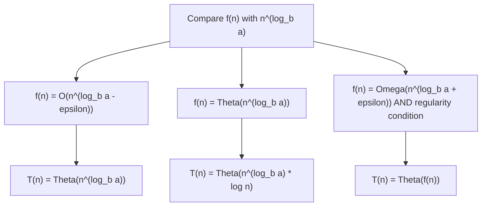
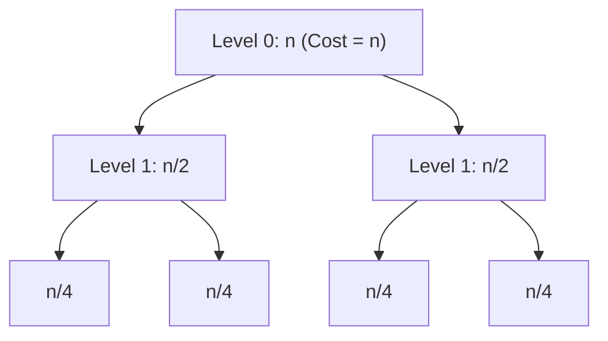
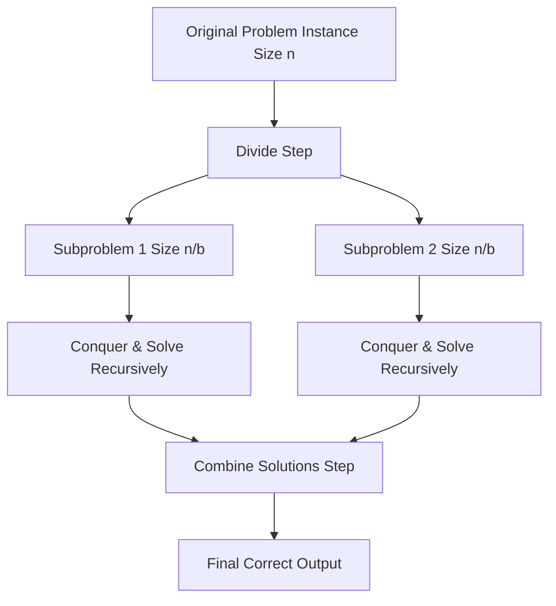
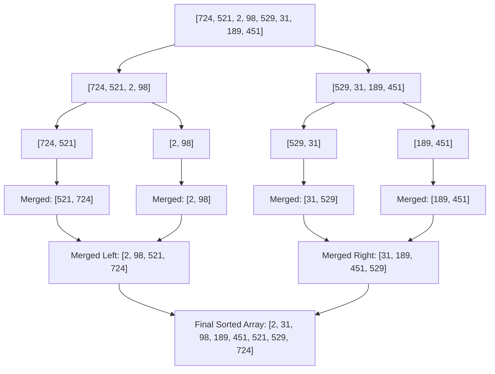
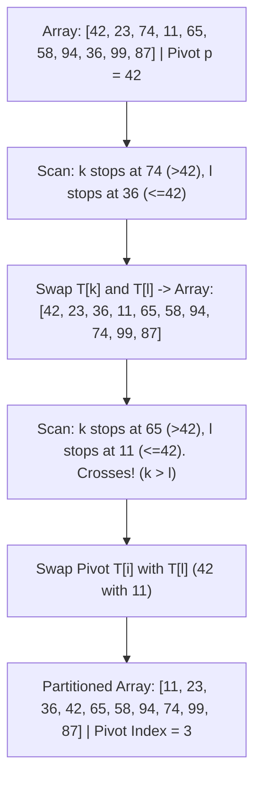

# Chapter 2 — Unit-II: Analysis of Algorithms

> **Course Code:** 3CS501CC24 / 2CS503  
> **Course Title:** Design & Analysis of Algorithms (DAA)  
> **Primary Source:** Faculty Lecture Material (LMS)  
> **Files Integrated:** `DAA_Unit2.pptx` (Slides 1–37), `DAA_Unit3(a).pptx` (Slides 1–70), `DAA_Unit3(b).pptx` (Slides 1–30)  

---

## 1. Chapter Overview

Unit-II focuses on analyzing control structures, solving linear and divide-and-conquer recurrence relations, and applying these analytical techniques to fundamental sorting algorithms. Students learn to systematically evaluate iterative constructs (`for`, `while`, `repeat`), recursive functions, recurrence relations (via Substitution, Characteristic Equations, Particular Solutions, Variable Transformations, Range Transformations, Master Theorems, and Recurrence Trees), and perform complete trace and performance evaluations of Quick Sort and Merge Sort.

[Source: DAA_Unit2.pptx, Slides 1–14; DAA_Unit3(a).pptx, Slides 1–4; DAA_Unit3(b).pptx, Slides 1–3]

---

## 2. Core Terminology Dictionary

### Core Terminology Dictionary

1. **Control Structure:** Programming construct (sequencing, selection, iteration) governing program execution flow.
2. **Recurrence Relation:** An equation defining a sequence recursively in terms of its values on smaller inputs (e.g., $T(n) = T(n-1) + n$).
3. **Characteristic Equation:** A polynomial equation derived from a homogeneous recurrence relation to determine its characteristic roots.
4. **Homogeneous Recurrence:** A linear recurrence relation where the non-recursive right-hand side term $f(n) = 0$.
5. **Non-Homogeneous Recurrence:** A recurrence relation containing a non-zero driving function $f(n) \neq 0$, solved as $T(n) = T(n)_h + T(n)_p$.
6. **Master Theorem:** A template formula providing closed-form asymptotic bounds for divide-and-conquer and subtract-and-conquer recurrences.
7. **Recurrence Tree:** A graphical representation of recursive execution where each node represents subproblem cost at a specific recursion depth.
8. **Divide-and-Conquer:** An algorithmic design strategy that breaks a problem into smaller subproblems, solves them recursively, and combines their results.
9. **In-Place Sort:** A sorting algorithm requiring $\mathcal{O}(1)$ auxiliary space beyond the input array.
10. **Partitioning:** Rearranging an array around a pivot element such that all elements left of the pivot are $\le \text{pivot}$ and elements right are $\ge \text{pivot}$.

[Source: DAA_Unit2.pptx, Slides 1–14; DAA_Unit3(a).pptx, Slides 3–4, 10–21; DAA_Unit3(b).pptx, Slides 14–22]

---

## 3. Analyzing Control Structures

To analyze iterative algorithms, we compute line-by-line step counts and express execution cost as a function of $n$.

### 3.1 Sequential Execution (Sequencing)
Sequential statements without loops execute a fixed number of times:
```c
sum = a + b; // executed once -> cost c1 = O(1)
```

---

### 3.2 Single `for` Loops

#### Algorithm Example: Array Sum
```c
int Sum(int A[], int n) {
    int s = 0;             // cost = c1, times = 1
    for (int i = 0; i < n; i++) // cost = c2, times = n + 1
        s = s + A[i];       // cost = c3, times = n
    return s;              // cost = c4, times = 1
}
```

#### Step Count Derivation:
$$
T(n) = c_1(1) + c_2(n+1) + c_3(n) + c_4(1) = (c_2 + c_3)n + (c_1 + c_2 + c_4) = a \cdot n + b = \Theta(n)
$$

#### Step Count Table for Growth of $n$:
| $n$ | Total Executed Steps ($2n + 3$) | Growth Property |
| :---: | :---: | :--- |
| **10** | 23 steps | Dominating term is $n$. |
| **100** | 203 steps | Constant $+3$ becomes negligible. |
| **1,000** | 2,003 steps | Time grows strictly linearly with $n$. |
| **10,000** | 20,003 steps | Linear scaling $\Theta(n)$. |

[Source: DAA_Unit2.pptx, Slides 2–3]

---

### 3.3 Nested `for` Loops

#### Example 3.1: Dependent Double Nested Loop
```c
l = 0;
for (int i = 1; i <= n; i++)
    for (int j = 1; j <= i; j++)
        l = l + 1;
```
* **Inner Loop Count:** Executes $i$ times for each $i$.
* **Total Executions:**
  $$
  T(n) = \sum_{i=1}^n \sum_{j=1}^i 1 = \sum_{i=1}^n i = \frac{n(n+1)}{2} = \frac{1}{2}n^2 + \frac{1}{2}n = \Theta(n^2)
  $$

#### Example 3.2: Triple Polynomial Loop
```c
l = 0;
for (int i = 1; i <= n; i++)
    for (int j = 1; j <= n*n; j++)
        for (int k = 1; k <= n*n*n; k++)
            l = l + 1;
```
* **Step Count:** Outer loop $n$, middle loop $n^2$, inner loop $n^3$.
* **Total Executions:** $T(n) = n \times n^2 \times n^3 = n^6 = \Theta(n^6)$.

[Source: DAA_Unit2.pptx, Slides 4–5]

---

### 3.4 `while` and `repeat` Loops (Logarithmic Step Sizes)

#### Loop Type A: Multiplication/Division Step ($i = i \cdot c$ or $i = i / c$)
```c
i = 1;
while (i <= n) {
    l = l + 1;
    i = i * c; // c > 1
}
```
* **Analysis:** In iteration $k$, $i = c^k$. The loop terminates when $c^k > n \implies k > \log_c n$.  
* **Complexity:** $T(n) = \Theta(\log_c n) = \Theta(\log n)$.

#### Loop Type B: Exponential Step ($i = i^c$ or $i = \sqrt{i}$)
```c
i = 2;
while (i <= n) {
    l = l + 1;
    i = pow(i, c); // e.g., i = i^2
}
```
* **Analysis:** After $k$ iterations, $i = 2^{c^k}$. Termination occurs when $2^{c^k} \ge n \implies c^k \ge \log_2 n \implies k = \log_c(\log_2 n)$.
* **Complexity:** $T(n) = \Theta(\log \log n)$.

[Source: DAA_Unit2.pptx, Slide 6]

---

## 4. Analysis of Recursive Calls

When an algorithm contains self-referential calls, its complexity is represented as a **recurrence relation**.

### 4.1 Recursive Factorial Analysis
```c
int factorial(int n) {
    if (n <= 1)        // Base case: O(1)
        return 1;
    else
        return n * factorial(n - 1); // Recursive call: T(n-1) + O(1)
}
```
* **Recurrence Relation:**
  $$
  T(n) = \begin{cases} \Theta(1) & \text{if } n \le 1 \\ T(n-1) + d & \text{if } n > 1 \end{cases}
  $$
* **Unwinding/Expansion:**
  $$
  T(n) = T(n-1) + d = T(n-2) + 2d = \dots = T(1) + (n-1)d = \Theta(n)
  $$

[Source: DAA_Unit2.pptx, Slides 8–12]

---

## 5. Solving Recurrences: Comprehensive Techniques

### 5.1 Method 1: Intelligent Guesswork & Substitution Method

1. **Guess** the form of the solution (e.g., $T(n) = \mathcal{O}(n \log n)$).
2. Use **Mathematical Induction** to establish constants $c$ and $n_0$.

#### Worked Example: Solve $T(n) = T(n-1) + n$
* **Unwinding (Iteration):**
  $$
  \begin{aligned}
  T(n) &= T(n-1) + n \\
  T(n-1) &= T(n-2) + (n-1) \\
  T(n-2) &= T(n-3) + (n-2) \\
  T(n) &= T(n-k) + \sum_{j=0}^{k-1} (n - j)
  \end{aligned}
  $$
  Setting $k = n$:
  $$
  T(n) = T(0) + \sum_{j=1}^n j = 0 + \frac{n(n+1)}{2} = \Theta(n^2)
  $$

[Source: DAA_Unit3(a).pptx, Slides 5–8]

---

### 5.2 Method 2: Homogeneous Recurrences (Characteristic Equations)

A homogeneous linear recurrence with constant coefficients has the form:
$$
a_0 T(n) + a_1 T(n-1) + a_2 T(n-2) + \dots + a_k T(n-k) = 0
$$

Replacing $T(n-j)$ with $x^{k-j}$ yields the **Characteristic Equation**:
$$
a_0 x^k + a_1 x^{k-1} + a_2 x^{k-2} + \dots + a_k = 0
$$

#### Root Cases for General Solution $T(n)$:
1. **Distinct Roots ($r_1 \neq r_2 \neq \dots \neq r_k$):**
   $$
   T(n) = c_1 r_1^n + c_2 r_2^n + \dots + c_k r_k^n
   $$
2. **Repeated Roots ($r_1 = r_2$ multiplicity $m$):**
   $$
   T(n) = (c_1 + c_2 n + c_3 n^2 + \dots + c_m n^{m-1}) r_1^n + c_{m+1} r_3^n + \dots
   $$

---

#### Worked Problem 5.1: $T(n) - T(n-1) - 2T(n-2) = 0$, $T(0)=0, T(1)=1$
1. **Characteristic Equation:** $x^2 - x - 2 = 0 \implies (x - 2)(x + 1) = 0 \implies r_1 = 2, r_2 = -1$.
2. **General Solution:** $T(n) = c_1 (2)^n + c_2 (-1)^n$.
3. **Apply Initial Conditions:**
   $$
   \begin{aligned}
   T(0) &= c_1 + c_2 = 0 \implies c_2 = -c_1 \\
   T(1) &= 2c_1 - c_2 = 1 \implies 2c_1 - (-c_1) = 1 \implies 3c_1 = 1 \implies c_1 = \frac{1}{3}, c_2 = -\frac{1}{3}
   \end{aligned}
   $$
4. **Final Solution:** $T(n) = \frac{1}{3}(2^n) - \frac{1}{3}(-1)^n = \Theta(2^n)$.

[Source: DAA_Unit3(a).pptx, Slides 10–12]

---

#### Worked Problem 5.2: In-Depth Analysis of Fibonacci Sequence
Recursive Fibonacci algorithm:
```c
int fibrec(int n) {
    if (n < 2) return n;
    else return fibrec(n - 1) + fibrec(n - 2);
}
```
* **Recurrence:** $T(n) = T(n-1) + T(n-2) \implies T(n) - T(n-1) - T(n-2) = 0$.
* **Characteristic Polynomial:** $x^2 - x - 1 = 0$.
* **Roots (Golden Ratio $\phi$):**
  $$
  r_1 = \frac{1 + \sqrt{5}}{2} \approx 1.618, \quad r_2 = \frac{1 - \sqrt{5}}{2} \approx -0.618
  $$
* **General Form:** $T(n) = c_1 \left(\frac{1+\sqrt{5}}{2}\right)^n + c_2 \left(\frac{1-\sqrt{5}}{2}\right)^n$.
* **Substituting $T(0)=0, T(1)=1$:**
  $$
  c_1 = \frac{1}{\sqrt{5}}, \quad c_2 = -\frac{1}{\sqrt{5}}
  $$
* **de Moivre's Closed-Form Formula:**
  $$
  T(n) = \frac{1}{\sqrt{5}}\left(\frac{1+\sqrt{5}}{2}\right)^n - \frac{1}{\sqrt{5}}\left(\frac{1-\sqrt{5}}{2}\right)^n = \Theta(\phi^n) = \Theta(1.618^n)
  $$
  Recursive Fibonacci requires **exponential running time**.

[Source: DAA_Unit3(a).pptx, Slides 13–16]

---

#### Worked Problem 5.3: Analysis of Tower of Hanoi
Move $m$ disks: $t(m) = 2 t(m-1) + 1$ with $t(0) = 0$.
* **Convert to Homogeneous:**
  $$
  \begin{aligned}
  t(m) - 2t(m-1) &= 1 \quad \text{--- (Eq 1)} \\
  -t(m-1) + 2t(m-2) &= -1 \quad \text{--- (Eq 2, shifted and multiplied by -1)}
  \end{aligned}
  $$
  Adding (Eq 1) and (Eq 2):
  $$
  t(m) - 3t(m-1) + 2t(m-2) = 0
  $$
* **Characteristic Equation:** $x^2 - 3x + 2 = 0 \implies (x - 2)(x - 1) = 0 \implies r_1 = 2, r_2 = 1$.
* **General Solution:** $t(m) = c_1 (2^m) + c_2 (1^m) = c_1 2^m + c_2$.
* **Initial Conditions ($t(0)=0, t(1)=1$):**
  $$
  c_1 + c_2 = 0, \quad 2c_1 + c_2 = 1 \implies c_1 = 1, c_2 = -1
  $$
* **Closed Form:** $t(m) = 2^m - 1 = \Theta(2^m)$.

[Source: DAA_Unit3(a).pptx, Slides 17–20]

---

### 5.3 Method 3: Non-Homogeneous Recurrences

A non-homogeneous recurrence has the form:
$$
a_0 T(n) + a_1 T(n-1) + \dots + a_k T(n-k) = f(n)
$$

The complete general solution is:
$$
T(n) = T(n)_h + T(n)_p
$$
where $T(n)_h$ is the homogeneous solution ($f(n)=0$) and $T(n)_p$ is the particular solution for $f(n)$.

#### Rules for Particular Solution $T(n)_p$:

| Driving Function $f(n)$ | Form of Particular Solution $T(n)_p$ |
| :--- | :--- |
| **Constant** ($f(n) = c$) | Try $T_p = P$. If it fails (root 1 exists), try $T_p = n P, n^2 P, \dots$ |
| **Polynomial** (Degree $m$) | $T_p = d_0 + d_1 n + d_2 n^2 + \dots + d_m n^m$ |
| **Exponential** ($f(n) = d \cdot a^n$) | If $a$ is not a characteristic root: $T_p = P \cdot a^n$. <br> If $a$ is a root of multiplicity $t$: $T_p = P \cdot n^t a^n$. |

---

#### Worked Problem 5.4: $T(n) - 8T(n-1) = 14n + 5$
1. **Homogeneous Part ($T(n)_h$):**
   $$
   x - 8 = 0 \implies x = 8 \implies T(n)_h = c_1 (8^n)
   $$
2. **Particular Part ($T(n)_p$):**  
   Since $f(n) = 14n + 5$ is a degree-1 polynomial, substitute $T(n)_p = d_0 + d_1 n$:
   $$
   (d_0 + d_1 n) - 8(d_0 + d_1 (n - 1)) = 14n + 5
   $$
   $$
   -7 d_1 n + (-7 d_0 + 8 d_1) = 14n + 5
   $$
   Matching coefficients:
   * $n^1 \text{ term:} -7 d_1 = 14 \implies d_1 = -2$
   * $n^0 \text{ term:} -7 d_0 + 8(-2) = 5 \implies -7 d_0 = 21 \implies d_0 = -3$
   Therefore, $T(n)_p = -3 - 2n$.
3. **Total Solution:**
   $$
   T(n) = c_1 (8^n) - 2n - 3
   $$

[Source: DAA_Unit3(a).pptx, Slides 24, 27]

---

### 5.4 Method 4: Change of Variable Method

Used when the recurrence contains non-standard arguments such as $\sqrt{n}$ or powers of $2$.

#### Worked Problem 5.5: Solve $T(n) = 2 T(\sqrt{n}) + \log n$
1. **Domain Transformation:** Substitute $n = 2^m \implies m = \log_2 n$.
   $$
   T(2^m) = 2 T(2^{m/2}) + m
   $$
2. **Rename Function:** Define $S(m) = T(2^m)$:
   $$
   S(m) = 2 S(m/2) + m
   $$
3. **Solve for $S(m)$:** Using Master Theorem ($a=2, b=2, f(m)=m \implies m^{\log_2 2} = m^1$):
   $$
   S(m) = \Theta(m \log m)
   $$
4. **Back-Substitution ($m = \log n$):**
   $$
   T(n) = S(\log n) = \Theta(\log n \cdot \log(\log n))
   $$

[Source: DAA_Unit3(a).pptx, Slide 59]

---

### 5.5 Method 5: Range Transformations

Used for non-linear recurrences containing powers or products of terms.

#### Worked Problem 5.6: Solve $T(n) = n T^2(n/2)$
1. **Change Variable ($n = 2^m, S(m) = T(2^m)$):**
   $$
   S(m) = 2^m S^2(m-1)
   $$
2. **Range Transformation:** Take $\log_2$ on both sides and set $U(m) = \log_2 S(m)$:
   $$
   \log_2 S(m) = \log_2(2^m) + \log_2(S^2(m-1)) \implies U(m) = m + 2 U(m-1)
   $$
3. **Solve Linear Recurrence:** $U(m) - 2U(m-1) = m \implies U(m) = \Theta(2^m)$.
4. **Back-Substitute:** $S(m) = 2^{U(m)} = 2^{\Theta(2^m)} \implies T(n) = 2^{\Theta(n)}$.

[Source: DAA_Unit3(a).pptx, Slides 62–63]

---

### 5.6 Method 6: Master Theorem for Divide-and-Conquer Recurrences

For recurrences of the form:
$$
T(n) = a T\left(\frac{n}{b}\right) + f(n) \quad \text{where } a \ge 1, b > 1
$$

Compare $f(n)$ with $n^{\log_b a}$:



#### Master Theorem Cases:

1. **Case 1 (Tree Leaves Dominant):**  
   If $f(n) = \mathcal{O}(n^{\log_b a - \epsilon})$ for some constant $\epsilon > 0$:
   $$
   T(n) = \Theta(n^{\log_b a})
   $$

2. **Case 2 (Balanced Levels):**  
   If $f(n) = \Theta(n^{\log_b a} \log^k n)$ for $k \ge 0$:
   $$
   T(n) = \Theta(n^{\log_b a} \log^{k+1} n)
   $$

3. **Case 3 (Root Cost Dominant):**  
   If $f(n) = \Omega(n^{\log_b a + \epsilon})$ for $\epsilon > 0$, and if $a f(n/b) \le c f(n)$ for some $c < 1$ (regularity condition):
   $$
   T(n) = \Theta(f(n))
   $$

---

#### 10 Solved Master Theorem Examples:

| # | Recurrence Relation | $a$ | $b$ | $n^{\log_b a}$ | $f(n)$ | Master Case | Solution $T(n)$ |
| :---: | :--- | :---: | :---: | :---: | :---: | :---: | :---: |
| **1** | $T(n) = 4 T(n/2) + n$ | 4 | 2 | $n^2$ | $n$ | Case 1 | $\Theta(n^2)$ |
| **2** | $T(n) = 4 T(n/2) + n^2$ | 4 | 2 | $n^2$ | $n^2$ | Case 2 ($k=0$) | $\Theta(n^2 \log n)$ |
| **3** | $T(n) = 4 T(n/2) + n^3$ | 4 | 2 | $n^2$ | $n^3$ | Case 3 | $\Theta(n^3)$ |
| **4** | $T(n) = 9 T(n/3) + n$ | 9 | 3 | $n^2$ | $n$ | Case 1 | $\Theta(n^2)$ |
| **5** | $T(n) = T(2n/3) + 1$ | 1 | $3/2$ | $n^0 = 1$ | $1$ | Case 2 ($k=0$) | $\Theta(\log n)$ |
| **6** | $T(n) = 7 T(n/2) + n^3$ | 7 | 2 | $n^{2.81}$ | $n^3$ | Case 3 | $\Theta(n^3)$ |
| **7** | $T(n) = 2 T(n/2) + n \log n$| 2 | 2 | $n^1$ | $n \log n$ | Case 2 ($k=1$) | $\Theta(n \log^2 n)$ |
| **8** | $T(n) = 27 T(n/3) + n^3$ | 27| 3 | $n^3$ | $n^3$ | Case 2 ($k=0$) | $\Theta(n^3 \log n)$ |
| **9** | $T(n) = 2 T(n/2) + \Theta(n)$ | 2 | 2 | $n^1$ | $n$ | Case 2 ($k=0$) | $\Theta(n \log n)$ |
| **10**| $T(n) = 2 T(n/2) + \frac{n}{\log n}$| 2 | 2 | $n^1$ | $\frac{n}{\log n}$ | **Inapplicable** | Non-polynomially smaller gap |

[Source: DAA_Unit3(a).pptx, Slides 28–41]

---

### 5.7 Method 7: Master Theorem for Subtract-and-Conquer Recurrences

For recurrences of the form:
$$
T(n) = a T(n - b) + \mathcal{O}(n^k) \quad \text{where } a > 0, b > 0, k \ge 0
$$

$$
T(n) = \begin{cases} \mathcal{O}(n^k) & \text{if } a < 1 \\ \mathcal{O}(n^{k+1}) & \text{if } a = 1 \\ \mathcal{O}(a^{n/b} \cdot n^k) & \text{if } a > 1 \end{cases}
$$

[Source: DAA_Unit3(a).pptx, Slide 42]

---

### 5.8 Method 8: Recurrence Tree Method

#### Systematic 6-Step Recurrence Tree Procedure:
1. **Tree Construction:** Draw nodes representing splitting costs.
2. **Level Cost:** Calculate total cost for level $i$.
3. **Tree Depth:** Compute total levels $x$ until subproblem size reaches $1$.
4. **Leaf Node Count:** Calculate total leaves at level $x$.
5. **Base-Level Cost:** Calculate cost of leaves $= \text{leaves} \times T(1)$.
6. **Summation:** Total cost $T(n) = \sum_{i=0}^{x-1} \text{Level}_i + \text{Leaf Cost}$.

---

#### Worked Problem 5.7: $T(n) = 2 T(n/2) + n$



1. **Cost by Level:**
   * Level $0$: $n$
   * Level $1$: $\frac{n}{2} + \frac{n}{2} = n$
   * Level $2$: $4 \times \frac{n}{4} = n$
   * Level $i$: $2^i \times \frac{n}{2^i} = n$
2. **Depth Determination:** $\frac{n}{2^x} = 1 \implies 2^x = n \implies x = \log_2 n$.
3. **Total Cost Summation:**
   $$
   T(n) = \sum_{i=0}^{\log_2 n - 1} n + \left(n \times T(1)\right) = n \log_2 n + \Theta(n) = \Theta(n \log_2 n)
   $$

[Source: DAA_Unit3(a).pptx, Slides 43–50]

---

#### Worked Problem 5.8: $T(n) = T(n/3) + T(2n/3) + n$
* **Level 0 Cost:** $n$
* **Level 1 Cost:** $\frac{n}{3} + \frac{2n}{3} = n$
* **Level 2 Cost:** $\frac{n}{9} + \frac{2n}{9} + \frac{2n}{9} + \frac{4n}{9} = n$
* **Tree Depth:** Shortest path terminates at $\log_3 n$; longest path terminates at $\log_{3/2} n$.
* **Asymptotic Bound:**
  $$
  T(n) = \sum_{i=0}^{\log_{3/2} n} n = \Theta(n \log_{3/2} n) = \Theta(n \log n)
  $$

[Source: DAA_Unit3(a).pptx, Slides 51–52]

---

## 6. In-Depth Analysis of Divide-and-Conquer Sorting Algorithms

The **Divide-and-Conquer (D&C)** paradigm operates in three phases:
1. **Divide:** Break problem into smaller subproblems.
2. **Conquer:** Solve subproblems recursively (or directly if tiny).
3. **Combine:** Merge subproblem solutions into the final result.



[Source: DAA_Unit3(a).pptx, Slide 64; DAA_Unit3(b).pptx, Slide 2]

---

### 6.1 In-Depth Analysis: Merge Sort

#### Concept & Operational Strategy
Merge Sort divides an array into two equal halves, sorts each half recursively, and merges the two sorted halves using an auxiliary array.

#### Merge Sort Algorithms (Pseudocode)

```python
def MergeSort(A, p, r):
    if p < r:
        q = (p + r) // 2         # Divide: Find midpoint O(1)
        MergeSort(A, p, q)       # Conquer: Left half T(n/2)
        MergeSort(A, q + 1, r)   # Conquer: Right half T(n/2)
        Merge(A, p, q, r)        # Combine: Merge two sorted sub-arrays O(n)
```

```python
def Merge(A, p, q, r):
    n1 = q - p + 1
    n2 = r - q
    # Create temporary arrays L and R
    L = [0] * (n1 + 1)
    R = [0] * (n2 + 1)
    for i in range(n1):
        L[i] = A[p + i]
    for j in range(n2):
        R[j] = A[q + 1 + j]
    L[n1] = float('inf') # Sentinel value
    R[n2] = float('inf') # Sentinel value
    i = 0
    j = 0
    for k in range(p, r + 1):
        if L[i] <= R[j]:
            A[k] = L[i]
            i += 1
        else:
            A[k] = R[j]
            j += 1
```

---

#### Detailed Execution Trace Example: Merge Sort
* **Input Array:** `[724, 521, 2, 98, 529, 31, 189, 451]` ($n = 8$)



#### Merge Sort Complexity Derivation:
* **Recurrence:** $T(n) = 2 T(n/2) + \Theta(n)$
* **Master Theorem Application:** $a = 2, b = 2, f(n) = \Theta(n) \implies n^{\log_2 2} = n^1$. Matches Master Case 2 ($k=0$).
* **Time Complexity:**
  * **Worst-Case:** $\Theta(n \log n)$
  * **Best-Case:** $\Theta(n \log n)$
  * **Average-Case:** $\Theta(n \log n)$
* **Space Complexity:** $\Theta(n)$ auxiliary space required for merging arrays.

[Source: DAA_Unit3(b).pptx, Slides 14–20]

---

### 6.2 In-Depth Analysis: Quick Sort

#### Concept & Partitioning Strategy
Quick Sort selects a **pivot** element and partitions the array into two sub-arrays such that all elements left of the pivot are $\le \text{pivot}$ and all elements right are $\ge \text{pivot}$. It then recursively sorts the sub-arrays in-place.

#### Quick Sort Algorithms (Pseudocode)

```python
def QuickSort(T, i, j):
    if i < j:
        # Partition array around pivot, l is final pivot index
        l = Partition(T, i, j)
        QuickSort(T, i, l - 1) # Sort left partition
        QuickSort(T, l + 1, j) # Sort right partition
```

```python
def Partition(T, i, j):
    p = T[i] # Pivot element chosen as first element
    k = i
    l = j + 1
    while True:
        # Increment k until T[k] > p
        while True:
            k += 1
            if k >= j or T[k] > p:
                break
        # Decrement l until T[l] <= p
        while True:
            l -= 1
            if T[l] <= p:
                break
        if k < l:
            T[k], T[l] = T[l], T[k] # Swap out-of-order elements
        else:
            break
    T[i], T[l] = T[l], T[i] # Swap pivot into final position l
    return l
```

---

#### Detailed Execution Trace Example: Quick Sort Partition
* **Input Array:** `[42, 23, 74, 11, 65, 58, 94, 36, 99, 87]`, $p = 42, i = 0, j = 9$.



---

#### Mathematical Analysis of Quick Sort Cases

1. **Worst-Case Analysis:**
   * **Occurrence:** Occurs when the input array is already sorted or reverse-sorted, causing the pivot to always be the minimum or maximum element.
   * **Partition Split:** Produces one sub-array of size $n - 1$ and one of size $0$.
   * **Recurrence:**
     $$
     T(n) = T(n-1) + T(0) + \Theta(n) = T(n-1) + \Theta(n)
     $$
   * **Unwinding Solution:**
     $$
     T(n) = \sum_{k=1}^n k = \frac{n(n+1)}{2} = \Theta(n^2)
     $$

2. **Best-Case Analysis:**
   * **Occurrence:** Occurs when the partition step splits the array into two equal halves of size $n/2$.
   * **Recurrence:**
     $$
     T(n) = 2 T(n/2) + \Theta(n)
     $$
   * **Solution:** $T(n) = \Theta(n \log n)$.

3. **Average-Case Analysis ($9:1$ Proportional Split):**
   * **Occurrence:** Even if partitioning consistently produces an unbalanced $9:1$ split:
   * **Recurrence:**
     $$
     T(n) = T\left(\frac{9n}{10}\right) + T\left(\frac{n}{10}\right) + \Theta(n)
     $$
   * **Recurrence Tree Solution:** Depth of tree is $\log_{10/9} n = \Theta(\log n)$. Total level cost is $n$.
   * **Result:** $T(n) = \Theta(n \log n)$.

[Source: DAA_Unit3(b).pptx, Slides 21–30]

---

### 6.3 Detailed Comparison: Quick Sort vs. Merge Sort

| Feature / Metric | Quick Sort | Merge Sort |
| :--- | :--- | :--- |
| **Algorithmic Strategy** | Divide and Conquer (Partitioning around pivot). | Divide and Conquer (Equal splitting & merging). |
| **Worst-Case Time** | $\Theta(n^2)$ (Sorted/Reverse sorted inputs). | $\Theta(n \log n)$ (Guaranteed). |
| **Best-Case Time** | $\Theta(n \log n)$ | $\Theta(n \log n)$ |
| **Average-Case Time** | $\Theta(n \log n)$ | $\Theta(n \log n)$ |
| **Auxiliary Space** | $\mathcal{O}(\log n)$ (Recursion stack space). | $\Theta(n)$ (Auxiliary array space required for merging). |
| **In-Place Sorting** | **Yes** (Sorts array elements in-place). | **No** (Requires $O(n)$ temporary memory). |
| **Stability** | **Unstable** by default. | **Stable** (Preserves relative order of equal elements). |
| **Practical Performance** | Faster in practice due to small constant factors & cache locality. | Slower constant factors due to array copying. |

[Source: DAA_Unit3(b).pptx, Slides 14–30]

---

## 7. Formula Sheet (Unit-II)

### 1. Loop Complexities
* Multiplicative Loop ($i = i \cdot c$): $T(n) = \Theta(\log n)$
* Exponential Loop ($i = i^c$): $T(n) = \Theta(\log \log n)$

### 2. Homogeneous General Solution
$$
T(n) = c_1 r_1^n + c_2 r_2^n + \dots + c_k r_k^n
$$

### 3. Master Theorem (Divide & Conquer)
$$
T(n) = a T(n/b) + f(n) \implies \begin{cases} \Theta(n^{\log_b a}) & f(n) = \mathcal{O}(n^{\log_b a - \epsilon}) \\ \Theta(n^{\log_b a} \log^{k+1} n) & f(n) = \Theta(n^{\log_b a} \log^k n) \\ \Theta(f(n)) & f(n) = \Omega(n^{\log_b a + \epsilon}) \end{cases}
$$

### 4. Master Theorem (Subtract & Conquer)
$$
T(n) = a T(n-b) + \mathcal{O}(n^k) \implies \begin{cases} \mathcal{O}(n^k) & a < 1 \\ \mathcal{O}(n^{k+1}) & a = 1 \\ \mathcal{O}(a^{n/b} n^k) & a > 1 \end{cases}
$$

### 5. Sorting Complexities
* **Merge Sort:** Worst = Best = Average = $\Theta(n \log n)$, Space = $\Theta(n)$
* **Quick Sort:** Worst = $\Theta(n^2)$, Best = Average = $\Theta(n \log n)$, Space = $\mathcal{O}(\log n)$

[Source: DAA_Unit2.pptx; DAA_Unit3(a).pptx; DAA_Unit3(b).pptx]

---

## 8. Definition Sheet (Unit-II)

* **Characteristic Equation:** Polynomial equation derived from linear homogeneous recurrence coefficients.
* **Homogeneous Solution ($T_h$):** Solution to a linear recurrence setting driving function $f(n) = 0$.
* **Particular Solution ($T_p$):** Specific solution accounting for driving function $f(n) \neq 0$.
* **Change of Variable:** Substituting $n = 2^m$ to transform logarithmic/root recurrences.
* **Range Transformation:** Taking $\log$ of function values to linearize multiplicative recurrences.
* **Recurrence Tree:** Level-by-level tree visualizer for recursion splitting costs.
* **Pivot:** Element chosen in Quick Sort around which array elements are partitioned.
* **In-Place Algorithm:** Algorithm requiring $O(1)$ extra space beyond recursion stack.
* **Stable Sort:** Sorting algorithm maintaining relative order of equal elements.

[Source: DAA_Unit2.pptx; DAA_Unit3(a).pptx; DAA_Unit3(b).pptx]

---

## 9. Exam-Oriented Review & Worked Problems (Unit-II)

### Worked Numerical Problem 2.1
**Problem:** Solve the non-homogeneous recurrence $T(n) - 7T(n-1) + 12T(n-2) = 4^n$.  
**Given:** $a_0 = 1, a_1 = -7, a_2 = 12$, $f(n) = 4^n$.  
**Solution Steps:**
1. **Homogeneous Part:**  
   $$
   x^2 - 7x + 12 = 0 \implies (x - 3)(x - 4) = 0 \implies r_1 = 3, r_2 = 4
   $$  
   $$
   T(n)_h = c_1 (3^n) + c_2 (4^n)
   $$
2. **Particular Part:**  
   Since $a = 4$ is a characteristic root with multiplicity $t = 1$, try $T(n)_p = P \cdot n 4^n$:  
   $$
   (P \cdot n 4^n) - 7(P (n-1) 4^{n-1}) + 12(P (n-2) 4^{n-2}) = 4^n
   $$  
   Divide by $4^{n-2}$:  
   $$
   16 P n - 7 \cdot 4 P (n-1) + 12 P (n-2) = 16
   $$  
   $$
   16 P n - 28 P n + 28 P + 12 P n - 24 P = 16 \implies 4 P = 16 \implies P = 4
   $$  
   Thus, $T(n)_p = 4 \cdot n 4^n = n 4^{n+1}$.
3. **Total Solution:**  
   $$
   T(n) = c_1 (3^n) + c_2 (4^n) + n 4^{n+1}
   $$

[Source: DAA_Unit3(a).pptx, Slides 25, 26]

---

### Worked Numerical Problem 2.2
**Problem:** Solve $T(n) = 3 T(n/4) + c n^2$ using the Recurrence Tree method.  
**Solution Steps:**
1. **Cost at Level $i$:** $3^i \cdot c \left(\frac{n}{4^i}\right)^2 = c n^2 \left(\frac{3}{16}\right)^i$.
2. **Total Cost Summation:**  
   $$
   T(n) = c n^2 \sum_{i=0}^{\log_4 n - 1} \left(\frac{3}{16}\right)^i + \Theta(n^{\log_4 3})
   $$
3. **Geometric Series Evaluation ($\sum_{i=0}^\infty (3/16)^i = \frac{1}{1 - 3/16} = \frac{16}{13}$):**  
   $$
   T(n) \le \frac{16}{13} c n^2 + \Theta(n^{0.793}) = \Theta(n^2)
   $$

[Source: DAA_Unit3(a).pptx, Slide 55]

---

### Potential Exam Questions
1. Differentiate between `while` loops with multiplicative increment ($i = i \cdot c$) and power increment ($i = i^c$). State their time complexities with proofs.
2. State and prove all three cases of the Master Theorem for Divide-and-Conquer recurrences.
3. Solve $T(n) = 2 T(n-1) + 1$ using characteristic equations.
4. Explain the Partitioning algorithm in Quick Sort. Walk through a step-by-step trace of Quick Sort on array `[5, 3, 8, 9, 1, 7, 0, 2, 6, 4]`.
5. Compare Quick Sort and Merge Sort in terms of worst-case complexity, space complexity, stability, and in-place property.
