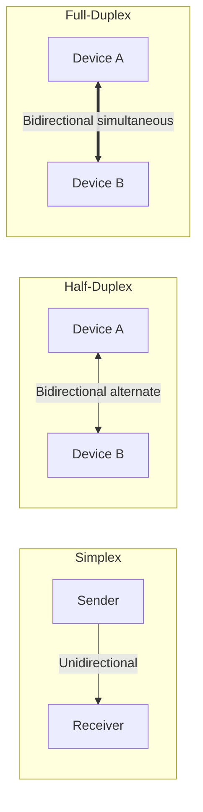

# Chapter 1 — Introduction to Data Communications and Networking

## 1. Document & Chapter Overview

- **Subject:** Data Communications & Networking
- **Source:** Reference Material - Chapter 1.pptx
- **Target Audience:** University Computer Science & Engineering Students

[Source: Reference Material - Chapter 1.pptx, Slide 1]

## 2. Fundamental Concepts & Definitions

### Definition: Data Communication

**Meaning:** The exchange of data between two devices via some form of transmission medium.

**Formal Definition:** Exchange of data (in 0s and 1s) using transmission media such as wire cables or wireless signals.

**Intuition:** How information gets sent from sender to receiver accurately and reliably.

[Source: Reference Material - Chapter 1.pptx, Slides 2-5]

### 5 Fundamental Components of Data Communication

| Component | Role / Description | Source Tag |
| --- | --- | --- |

| **Message** | Information/data to be communicated (Text, Numbers, Pictures, Audio, Video). | [Source: Ch 1, Slide 4] |

| **Sender** | Device that sends the data message (PC, Workstation, Telephone, Camera). | [Source: Ch 1, Slide 4] |

| **Receiver** | Device that receives the message (PC, Television, Workstation). | [Source: Ch 1, Slide 4] |

| **Transmission Medium** | Physical path by which message travels (Twisted-pair, Coaxial, Fiber-optic, Radio waves). | [Source: Ch 1, Slide 4] |

| **Protocol** | Set of rules governing data communications (Agreed rules between communicating devices). | [Source: Ch 1, Slide 4] |

### Figure 1.1: Data Communication Components Architecture

**What it shows:** Interaction model of sender, receiver, protocol, message, and medium.

**Flow / Relationship:** Sender transmits message over physical medium using rules defined by Protocol to Receiver.

[Source: Reference Material - Chapter 1.pptx, Slide 3]

## 3. Data Representation & Flow Modes

### Data Representation Types

- **Text:** Represented as bit patterns (ASCII, Unicode).

- **Numbers:** Represented directly in binary.

- **Images:** Composed of matrix of pixels.

- **Audio / Video:** Continuous signal digitized into binary streams.

[Source: Reference Material - Chapter 1.pptx, Slides 6-8]

### Direction of Data Flow (Simplex, Half-Duplex, Full-Duplex)

| Flow Mode | Directionality | Channel Capacity Usage | Real-World Example | Source Tag |
| --- | --- | --- | --- | --- |

| **Simplex** | Unidirectional (One way only) | 100% capacity in 1 direction | Monitor, Keyboard, Mainframe to Printer | [Source: Ch 1, Slide 9] |

| **Half-Duplex** | Bidirectional (Both directions, but NOT at same time) | Shared capacity partitioned by time | Walkie-Talkies, CB Radios | [Source: Ch 1, Slide 10] |

| **Full-Duplex** | Bidirectional (Simultaneous in both directions) | Channel split into two directions | Telephone Network, Ethernet | [Source: Ch 1, Slide 11] |

## 4. Networks & Topology Classification

### Physical Topologies Comparison

| Topology | Structure / Layout | Key Advantages | Key Disadvantages | Cable Requirement | Source Tag |
| --- | --- | --- | --- | --- | --- |

| **Mesh** | Dedicated point-to-point links to every node | Robust, Private/Secure, Fault Isolation | Expensive, Complex Cabling | $N(N-1)/2$ links | [Source: Ch 1, Slides 15-18] |

| **Star** | Dedicated link to Central Controller (Hub/Switch) | Less cable than Mesh, Easy installation | Single point of failure (Hub) | $N$ links | [Source: Ch 1, Slides 19-21] |

| **Bus** | Single central cable backbone (Multipoint) | Easy to install, minimal cable | Single cable fault downs entire network | 1 backbone cable | [Source: Ch 1, Slides 22-24] |

| **Ring** | Dedicated point-to-point to 2 neighbors | Easy to reconfigure, fault detection | Unidirectional break affects whole ring | $N$ links | [Source: Ch 1, Slides 25-27] |

| **Hybrid** | Combination of 2+ topologies (e.g. Star-Bus) | Scalable, Flexible | Complex design, costly | Varies | [Source: Ch 1, Slide 28] |

### Mathematical Formula: Mesh Topology Links & Ports

$$
\text{Physical Links} = \frac{N(N-1)}{2}
$$

$$
\text{Hardware Ports per Device} = N - 1
$$

**Where:** $N$ is the number of nodes/devices in the network.

**Worked Example:** If a mesh network contains $N = 10$ nodes:

- Number of physical links = $\frac{10 \times (10 - 1)}{2} = \frac{90}{2} = 45$ links.

- Ports required per device = $10 - 1 = 9$ I/O ports.

[Source: Reference Material - Chapter 1.pptx, Slide 16]

## 5. Network Categories (LAN, MAN, WAN)

| Network Type | Full Form | Geographic Coverage | Control / Ownership | Example | Source Tag |
| --- | --- | --- | --- | --- | --- |

| **LAN** | Local Area Network | Small area (Office, Building, Campus) | Privately Owned | Office Ethernet / Wi-Fi | [Source: Ch 1, Slide 30] |

| **MAN** | Metropolitan Area Network | City / Town scale | Public or Private | Cable TV Network, City Fiber | [Source: Ch 1, Slide 32] |

| **WAN** | Wide Area Network | Country, Continent, Global | Multiple Operators | Internet, Telecom Backbone | [Source: Ch 1, Slide 33] |

## 6. Formula Sheet

### Mesh Network Links Formula

$$
L = \frac{N(N - 1)}{2}
$$

- $L$: Total number of duplex physical channels
- $N$: Total number of network devices

## 7. Definition Sheet

- **Protocol:** Syntax, semantics, and timing rules governing data communications.

- **Topology:** Geometric representation of how network nodes/links are arranged.

- **Simplex:** One-way data communication mode.

- **Half-Duplex:** Two-way alternate data communication mode.

- **Full-Duplex:** Two-way simultaneous data communication mode.

## 8. Exam-Oriented Review & Questions

1. **Numerical:** Calculate the number of physical links and ports needed for a fully connected mesh network of 20 nodes.

   - *Solution:* Links = $20 \times 19 / 2 = 190$. Ports per node = $19$.

2. **Comparison:** Compare Bus, Star, and Ring topologies based on cost, fault isolation, and installation ease.

3. **Conceptual:** Explain why Full-Duplex communication requires either two physical transmission paths or channel division.
