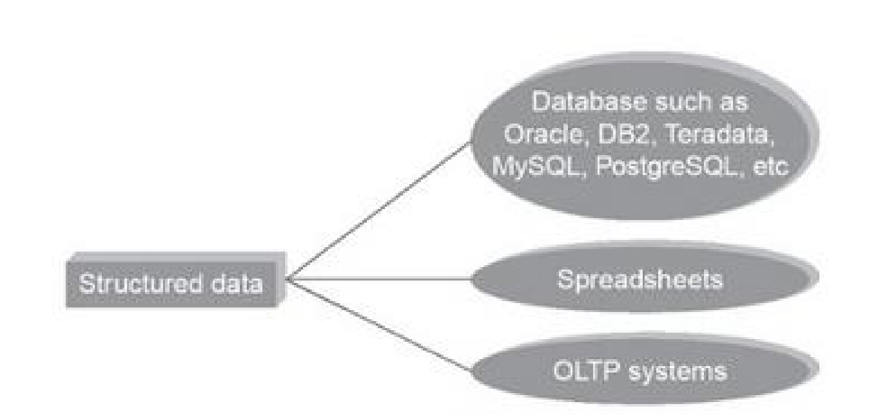

# Chapter 2 — Network Models (OSI & TCP/IP Architecture)

## 1. Document & Chapter Overview

- **Subject:** Data Communications & Networking
- **Source:** Reference Material - Chapter 2.pptx
- **Target Audience:** Computer Science & Engineering Students

[Source: Reference Material - Chapter 2.pptx, Slide 1]

## 2. Layered Tasks & Layered Architecture

### Concept: Layering Principle

**Meaning:** Subdividing a complex networking process into smaller, manageable, independent modular layers where each layer performs specific services for the layer above it.

[Source: Reference Material - Chapter 2.pptx, Slides 2-4]

### Definition: OSI Model (Open Systems Interconnection)

**Formal Definition:** An ISO standard 7-layer framework covering all aspects of network communications.

**7 Layers (Top to Bottom):**

1. **Application Layer (Layer 7):** Network services to applications (HTTP, FTP, SMTP).

2. **Presentation Layer (Layer 6):** Translation, Encryption, Compression.

3. **Session Layer (Layer 5):** Dialog control, Synchronization, Session management.

4. **Transport Layer (Layer 4):** End-to-end process-to-process delivery, Flow/Error control (TCP, UDP).

5. **Network Layer (Layer 3):** Host-to-host delivery, Logical Addressing (IP), Routing.

6. **Data Link Layer (Layer 2):** Hop-to-hop node-to-node framing, Physical Addressing (MAC), Error/Flow control.

7. **Physical Layer (Layer 1):** Transmission of raw bit streams over physical medium.

[Source: Reference Material - Chapter 2.pptx, Slides 5-15]

### Figure 2.1: OSI 7-Layer Model Architecture & Encapsulation

**What it shows:** Headers ($H_7$ through $H_2$) and Trailer ($T_2$) added at each layer during transmission.

**Flow / Relationship:** Application data moves down the stack adding headers (Encapsulation) and moves up at receiver stripping headers (Decapsulation).

[Source: Reference Material - Chapter 2.pptx, Slide 6]

### Layer Addresses & Protocols Comparison

| OSI Layer | Data Unit (PDU) | Addressing Type | Address Example | Primary Protocols | Source Tag |
| --- | --- | --- | --- | --- | --- |

| **Application** | Data / Message | Specific / Application | URL, Email address | HTTP, FTP, SMTP, DNS | [Source: Ch 2, Slide 16] |

| **Transport** | Segment / User Datagram | Port Address | Port 80 (HTTP), Port 443 | TCP, UDP | [Source: Ch 2, Slide 17] |

| **Network** | Packet / Datagram | Logical Address | IPv4: `192.168.1.1`, IPv6 | IP, ICMP, ARP | [Source: Ch 2, Slide 18] |

| **Data Link** | Frame | Physical Address (MAC) | `00:1A:2B:3C:4D:5E` | Ethernet, Wi-Fi | [Source: Ch 2, Slide 19] |

| **Physical** | Bits | Signal Voltage / Light | 0s and 1s | IEEE 802.3, RS-232 | [Source: Ch 2, Slide 20] |

### Definition Sheet & Review

- **Encapsulation:** Wrapping lower-layer protocol headers around higher-layer payload.

- **Port Address:** 16-bit identifier used at Transport layer to select specific process/service.

- **Physical Address:** 48-bit (6-byte) MAC address burned into NIC card for hop-to-hop link delivery.
