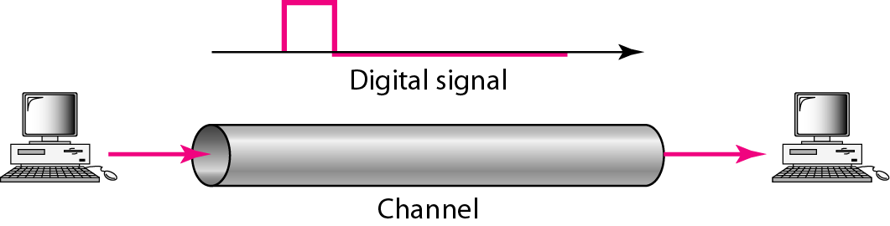

# Chapter 3 — Data and Signals (Physical Layer Foundations)

## 1. Document & Chapter Overview

- **Subject:** Physical Layer Signals & Transmission
- **Source:** Reference Material - Chapter 3.pptx

## 2. Analog and Digital Signals

### Definition: Analog vs Digital Signals

- **Analog Signal:** Continuous wave signal that varies smoothly over time.

- **Digital Signal:** Discrete signal taking only limited specified values (e.g. 0 and 1).

[Source: Reference Material - Chapter 3.pptx, Slides 2-8]

### Sine Wave Parameters & Mathematical Representation

$$
s(t) = A \sin(2\pi f t + \phi)
$$

### Where:

- $A$: Peak Amplitude (Volts, V)

- $f$: Frequency (Hertz, Hz), where $f = \frac{1}{T}$

- $T$: Period (Seconds, s)

- $\phi$: Phase (Radians or Degrees, ${}^\circ$)

- $\lambda$: Wavelength (Meters, m), where $\lambda = \frac{c}{f} = c \times T$

### Figure 3.1: Sine Wave Parameters

[Source: Reference Material - Chapter 3.pptx, Slide 5]

### Worked Numerical Example: Wavelength Calculation

**Given:** Red light wave in fiber with frequency $f = 4 \times 10^{14}\text{ Hz}$ and propagation speed in optical fiber $v = 2 \times 10^8\text{ m/s}$.

**Find:** Wavelength $\lambda$.

**Formula:** $\lambda = \frac{v}{f}$

**Calculation:**

$$
\lambda = \frac{2 \times 10^8}{4 \times 10^{14}} = 0.5 \times 10^{-6}\text{ m} = 0.5\ \mu\text{m} = 500\text{ nm}
$$

[Source: Reference Material - Chapter 3.pptx, Slide 14]

## 3. Fourier Analysis & Bandwidth

### Composite Signal & Bandwidth Formula

$$
\text{Bandwidth (B)} = f_{\text{highest}} - f_{\text{lowest}}
$$

**Worked Example:** A signal has lowest frequency component $f_{\min} = 100\text{ Hz}$ and highest $f_{\max} = 5000\text{ Hz}$.

$$
B = 5000 - 100 = 4900\text{ Hz} = 4.9\text{ kHz}
$$

[Source: Reference Material - Chapter 3.pptx, Slide 22]

## 4. Transmission Impairments & Formulas

### 1. Attenuation (Decibel dB Formula)

$$
\text{dB} = 10 \log_{10} \left( \frac{P_2}{P_1} \right)
$$

If voltage is given instead of power:

$$
\text{dB} = 20 \log_{10} \left( \frac{V_2}{V_1} \right)
$$

[Source: Reference Material - Chapter 3.pptx, Slide 35]

### 2. Signal-to-Noise Ratio (SNR & $SNR_{dB}$)

$$
\text{SNR} = \frac{\text{Average Signal Power}}{\text{Average Noise Power}}
$$

$$
\text{SNR}_{\text{dB}} = 10 \log_{10}(\text{SNR})
$$

[Source: Reference Material - Chapter 3.pptx, Slide 42]

## 5. Data Rate Limits (Nyquist & Shannon Theorems)

### Nyquist Bit Rate (Noiseless Channel)

$$
\text{BitRate} = 2 \times B \times \log_2(L)
$$

- $B$: Bandwidth in Hz
- $L$: Number of signal levels

### Shannon Capacity (Noisy Channel)

$$
\text{Capacity (C)} = B \times \log_2(1 + \text{SNR})
$$

- $C$: Upper limit of channel data rate in bps
- $B$: Bandwidth in Hz
- $\text{SNR}$: Signal to noise power ratio (absolute value, NOT dB)

### Worked Example: Shannon Capacity Calculation

**Given:** Telephone line with bandwidth $B = 3000\text{ Hz}$ and $\text{SNR}_{\text{dB}} = 31.62\text{ dB}$.

1. Convert $\text{SNR}_{\text{dB}}$ to linear $\text{SNR}$:

$$
31.62 = 10 \log_{10}(\text{SNR}) \implies \log_{10}(\text{SNR}) = 3.162 \implies \text{SNR} \approx 1451.6 \approx 3162
$$

2. Calculate Capacity $C$:

$$
C = 3000 \times \log_2(1 + 3162) = 3000 \times \log_2(3163) \approx 3000 \times 11.628 = 34,884\text{ bps} \approx 34.88\text{ Kbps}
$$

[Source: Reference Material - Chapter 3.pptx, Slide 50]

