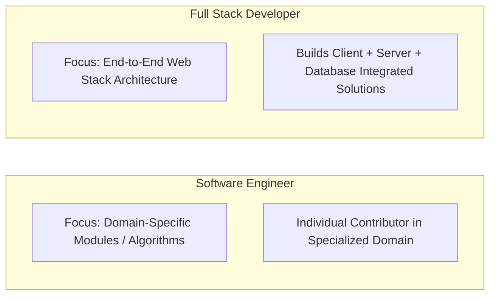
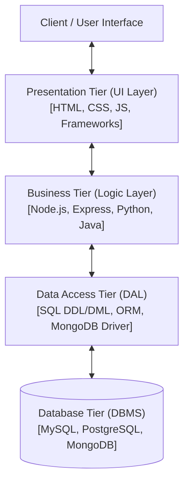
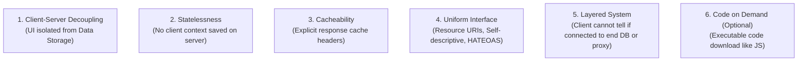
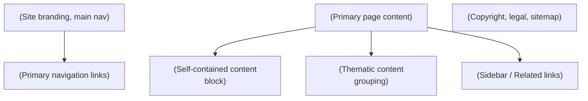
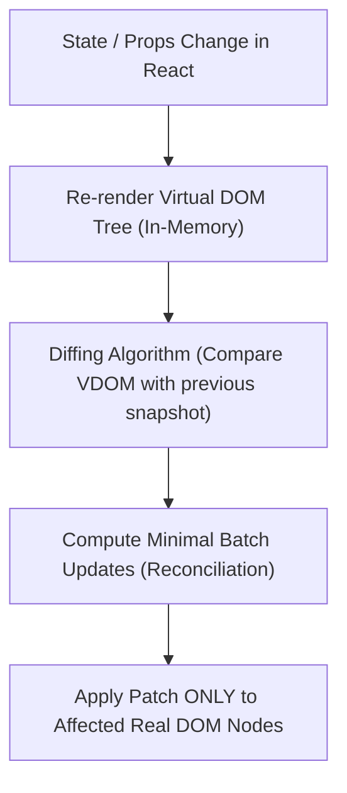

# Full Stack Web Development (FSD) — Complete & Exhaustive Study Notes

**Course:** Full Stack Web Development (FSD)  
**Source Material:** `UNIT-1 Full Stack Development Basics.docx`, `UNIT-1 Full Stack Development Basics.pdf`, `UNIT-2 Frontend Frameworks.docx`  
**Generated Date:** August 09, 2026  

---

# Unit 1 — Full Stack Development Basics

## 1. Chapter Overview
Unit 1 provides the structural, architectural, and protocol foundation for web application engineering. It spans:
- Core concepts of Full Stack Web Development and role responsibilities.
- Comparative analysis of Front-End, Back-End, and Full Stack engineers.
- Software Engineering vs. Full Stack Development distinctions.
- 3-Tier Enterprise Architecture rules, layer boundary constraints, and decoupled communication.
- Web Development Stacks (LAMP, MEAN, MERN, Ruby on Rails, Django, Spring Boot, Serverless, Flutter/React Native cross-platform).
- JavaScript Object Notation (JSON): syntax rules, data types, nested/multidimensional structures, parsing efficiency, and comment workarounds.
- REpresentational State Transfer (REST) Architecture: 6 architectural constraints, client-server decoupling, statelessness, cacheability, uniform interface, HATEOAS.
- RESTful HTTP Protocol Operations: HTTP Verbs (GET, POST, PUT, DELETE), MIME Types & Accept headers, URI Path design conventions, Response Content-Types, and Standard HTTP Status Codes.

---

## 2. Fundamental Concepts & Terminology

### 2.1 Full Stack Development Defined
A **Full Stack Developer** possesses comprehensive domain knowledge across the entire technology stack—from client-side user interface rendering to server-side business logic, API definition, database administration, and deployment architecture.

> **Role Responsibilities:**
> 1. Technology Evaluation: Selecting client-side and server-side stack components during early project phases.
> 2. Stack Implementation: Writing clean, maintainable code adhering to stack-specific best practices.
> 3. Cross-Disciplinary Knowledge: Maintaining currency with emerging frameworks, databases, and DevOps tools.
> 4. Agile Team Contribution: Serving as versatile, high-velocity engineering nodes in cross-functional Agile environments.

[Source: `UNIT-1 Full Stack Development Basics.docx`, Section 1]

---

### 2.2 Role Comparison: Front-End vs. Back-End vs. Full Stack

| Feature / Dimension | Front-End Developer | Back-End Developer | Full Stack Developer |
| :--- | :--- | :--- | :--- |
| **Primary Focus** | User Interface (UI), User Experience (UX), Visual Layout, Navigation, Client-Side Interactivity. | Business Logic, Security, Data Management, Database Querying, Request Handling, Scalability. | End-to-End Workflow Execution (Client + Server + Database + API). |
| **Core Technologies** | HTML5, CSS3, JavaScript (ES6+), React, Vue, Angular, Bootstrap, Tailwind. | Node.js, Python, Java, Ruby, PHP, C#/.NET, Express, Django, Spring Boot. | Full Stacks (MERN, MEAN, LAMP, RoR, Serverless) spanning front-end & back-end. |
| **Data Handling** | Manipulates DOM, renders JSON payloads received from server APIs. | Constructs APIs, interacts directly with DBMS (SQL/NoSQL), manages state persistence. | Manages data modeling, API payload construction, and DOM presentation. |
| **System Visibility** | Client browser engine / web runtime. | Server environment / OS / Cloud container / Database. | Complete application topology. |

[Source: `UNIT-1 Full Stack Development Basics.docx`, Section 1]

---

### 2.3 Software Engineer vs. Full Stack Developer



- **Software Engineer:** Broad engineering title. Typically focuses deeply on specialized individual modules, system components, algorithms, low-level OS drivers, or single-tier infrastructure.
- **Full Stack Developer:** Web engineering specialization. Responsible for delivering functional end-to-end applications across all layers (Presentation, Logic, Database).

---

### 2.4 Trade-Off Analysis of Full Stack Development

#### Advantages:
1. **End-to-End Ownership:** Deep architectural insight into the entire software lifecycle.
2. **Cost & Time Efficiency:** Reduces communication overhead and team size requirement for small-to-medium builds.
3. **Rapid Debugging:** Faster issue isolation across API layer boundaries.
4. **Agile Versatility:** Smooth task-switching between front-end UI and back-end services in sprint cycles.
5. **Entrepreneurial Autonomy:** Enables solo prototyping, SaaS MVP creation, and site monetization.

#### Disadvantages:
1. **Jack-of-all-trades Risk:** Breadth of knowledge can lead to reduced depth compared to specialized backend or database engineers.
2. **Key Person Dependency:** Over-reliance on a single developer creates severe single-point-of-failure risks.
3. **Cognitive Overhead:** Rapid shifts across multiple paradigms (CSS, SQL, Async JS, DevOps) increase defect likelihood.

[Source: `UNIT-1 Full Stack Development Basics.docx`, Section 1]

---

## 3. The 3-Tier Enterprise Architecture

### 3.1 Structural Architecture
The 3-Tier Architecture cleanly segregates software application code into three distinct, decoupled tiers.



### 3.2 Strict Rules of 3-Tier Architecture
1. **Absolute Layer Isolation:** Code belonging to a tier must reside exclusively inside that tier's files.
2. **Strict Cascade Communication:**
   - Presentation Tier talks **only** to Business Tier. It is strictly prohibited from touching the Data Access Tier or Database directly.
   - Business Tier talks **only** to Presentation Tier (upstream) and Data Access Tier (downstream). It cannot execute raw DB operations directly.
   - Data Access Tier talks **only** to Business Tier (upstream) and the specific DBMS engine (downstream).
3. **Decoupled Agnosticism:**
   - The Business Tier must be **Database-Agnostic** (unaware of whether SQL or NoSQL stores data) and **Presentation-Agnostic** (unaware if output is HTML, JSON, PDF, or CSV).
4. **Granular Multi-Component Structure:**
   - Presentation Tier: A dedicated controller/view component per user transaction.
   - Business Tier: A dedicated business entity logic component per database entity.
   - Data Access Tier: A dedicated Data Access Object (DAO) component per supported DBMS engine.

### 3.3 Skill Requirements per Tier

| Tier | Primary Purpose | Required Technical Skills |
| :--- | :--- | :--- |
| **Presentation Tier** | User interaction, visual rendering, input capture. | HTML5, CSS3, JavaScript, UI/UX Design, Frameworks (React, Vue, Angular). |
| **Business Tier** | Enforcing business rules, computational algorithms, access validation. | Core Server Languages (Node.js, Python, Java, PHP, C#), API Routing. |
| **Data Access Tier** | Executing CRUD transactions against persistent storage. | SQL (DDL/DML), Database Schema Design, Indexing, NoSQL Query APIs. |

[Source: `UNIT-1 Full Stack Development Basics.docx`, Section 2]

---

## 4. Popular Web Development Stacks & Project Contexts

### 4.1 Comparative Stack Matrix

| Stack | Technology Breakdown | Ideal Project Context | Industry Adopters |
| :--- | :--- | :--- | :--- |
| **LAMP** | **L**inux, **A**pache, **M**ySQL, **P**HP | Low-cost, highly customizable e-commerce, content management systems (CMS). | Wikipedia, Yahoo, Etsy, WordPress, Magento, Shopify |
| **MEAN** | **M**ongoDB, **E**xpress.js, **A**ngular, **N**ode.js | Real-time collaborative enterprise suites, SPA web apps requiring strong TypeScript support. | Google, Microsoft, IBM, Amazon, Uber, PayPal, LinkedIn |
| **MERN** | **M**ongoDB, **E**xpress.js, **R**eact, **N**ode.js | Dynamic, highly interactive single-page web applications with real-time UI state re-rendering. | Meta (Facebook), Netflix, Airbnb, Tesla, Walmart, Uber |
| **Ruby on Rails** | Ruby Language + Rails Framework (MVC) | Rapid startup MVP prototyping, donation management, developer-friendly convention-over-configuration apps. | GitHub, Airbnb, Shopify, SlideShare, CrunchBase, Dribbble |
| **Django (Python)**| Python + Django Framework (MTV) | High-security enterprise internal portals, machine learning-driven web apps, data processing engines. | Instagram, Spotify, YouTube, Disqus, Bitbucket |
| **Java / Spring Boot**| Java + Spring Boot Framework | Large-scale, high-concurrency enterprise applications, banking, microservices architectures. | Amazon, Netflix, Google, Ebay, Enterprise Banking |
| **Serverless** | AWS Lambda / Azure Functions + DynamoDB / Serverless API | Personalized travel planning, event-driven web apps requiring auto-scaling with pay-per-use costing. | Serverless Startups, Cloud Native SaaS |
| **Flutter / React Native**| Cross-Platform Frameworks (Dart / JS) | Multi-platform on-demand mobile & web applications (food delivery, fitness tracking). | Instagram, Uber Eats, BMW, Alibaba |

[Source: `UNIT-1 Full Stack Development Basics.docx`, Section 3]

---

## 5. JavaScript Object Notation (JSON)

### 5.1 Definition & Properties
**Definition:** JSON (JavaScript Object Notation) is a lightweight, text-based, open standard format designed specifically for human-readable data interchange.

> **Key Characteristics:**
> - **Language-Independent:** Native support in JavaScript, Python, Java, C#, PHP, Ruby, Go.
> - **Self-Describing:** Structural key-value pairing defines data context implicitly.
> - **Open Standard:** Based on a subset of JavaScript standard ECMA-262.

### 5.2 JSON vs. XML Comparison

| Evaluation Metric | JSON | XML |
| :--- | :--- | :--- |
| **Verbosity** | Compact, minimal syntax footprint. | Verbose, requires opening and closing tags `<tag></tag>`. |
| **Parsing Speed** | Faster. Uses native fast JavaScript `JSON.parse()`. | Slower. Requires DOM/SAX parser tree construction in memory. |
| **Data Structure Support**| Maps (Key-Value), Arrays, Primitives (Strings, Numbers, Booleans, Null). | Tree structures, Attributes, Elements. |
| **Memory Footprint** | Extremely low. | High (due to DOM node tree allocation). |
| **Readability** | High for both humans and machines. | Moderate (cluttered by markup tags). |

### 5.3 Valid JSON Data Types

| Data Type | Formal Rule & Syntax | Valid Example |
| :--- | :--- | :--- |
| **String** | Double-quoted UTF-8 text string. | `"studentName": "Alice"` |
| **Number** | Integer or floating-point number (no quotes). | `"age": 22`, `"gpa": 3.85` |
| **Boolean** | Literal `true` or `false` (lowercase). | `"isEnrolled": true` |
| **Null** | Literal `null` representing empty value. | `"middleName": null` |
| **Object** | Unordered collection of key-value pairs wrapped in `{}`. Keys MUST be double-quoted strings. | `{"id": 101, "dept": "CS"}` |
| **Array** | Ordered sequence of values wrapped in `[]`. | `"grades": [88, 92, 95]` |

[Source: `UNIT-1 Full Stack Development Basics.docx`, Table 1 & Section 4]

---

### 5.4 JSON Structural Formats & Code Examples

#### A. JSON Object Example
```json
{
  "name": "Jack",
  "employeeid": 1,
  "present": false
}
```

#### B. JSON Array of Objects Example
```json
{
  "employees": [
    { "name": "Ram", "email": "ram@gmail.com", "age": 23 },
    { "name": "Shyam", "email": "shyam23@gmail.com", "age": 28 },
    { "name": "John", "email": "john@gmail.com", "age": 33 },
    { "name": "Bob", "email": "bob32@gmail.com", "age": 41 }
  ]
}
```

#### C. Multidimensional JSON Array Example
```json
[
  ["a", "b", "c"],
  ["m", "n", "o"],
  ["x", "y", "z"]
]
```

#### D. JSON Comment Workaround
JSON standard **does not support native comments** (`//` or `/* */`). To include explanatory notes in a JSON payload, developers introduce explicit attribute keys:
```json
{
  "employee": {
    "name": "Bob",
    "salary": 56000,
    "_comment": "This attribute acts as a comment line for documentation."
  }
}
```

[Source: `UNIT-1 Full Stack Development Basics.docx`, Section 4]

---

## 6. REpresentational State Transfer (REST) Architecture

### 6.1 Architectural Definition
REST is an architectural style that defines constraints for building scalable, resilient, and stateless web services. Systems adhering to REST principles are termed **RESTful**.

---

### 6.2 The 6 Core Constraints of REST



1. **Client-Server Separation:** Enforces complete boundary separation. The client handles presentation; the server manages storage and logic. Enables independent platform evolution.
2. **Statelessness:** Every request from client to server must contain **all** authentication credentials and contextual data needed to process it. The server stores no session state between requests.
3. **Cacheability:** Responses must explicitly declare whether they can be cached by clients/proxies (`Cache-Control`, `ETag`) to eliminate redundant round-trips.
4. **Uniform Interface:** Standardized interaction contract containing sub-constraints:
   - *Identification of Resources:* Unique URIs identify resources (`/customers/102`).
   - *Manipulation via Representations:* Resources are modified via JSON/XML payloads.
   - *Self-Descriptive Messages:* Headers explicitly describe payload metadata (e.g., `Content-Type`).
   - *HATEOAS (Hypermedia as the Engine of Application State):* Responses include dynamic hypermedia links guiding available client state transitions.
5. **Layered System:** Application topology can include intermediaries (load balancers, cache layers, API gateways) without client awareness.
6. **Code-on-Demand (Optional):** Servers can temporarily extend client functionality by transferring executable code (e.g., JavaScript scripts).

[Source: `UNIT-1 Full Stack Development Basics.docx`, Section 5]

---

## 7. RESTful HTTP Communications & Protocol Details

### 7.1 HTTP Verbs (Operations on Resources)

| Verb | CRUD Mapping | Operational Behavior | Idempotent? | Safe? | Expected Success Code |
| :--- | :--- | :--- | :--- | :--- | :--- |
| **GET** | Read | Retrieves a specific resource or resource collection. | Yes | Yes | `200 OK` |
| **POST** | Create | Creates a new resource under a collection URI. | No | No | `201 CREATED` |
| **PUT** | Update / Replace | Replaces an existing resource or creates if non-existent. | Yes | No | `200 OK` |
| **DELETE**| Delete | Removes a specific resource by ID. | Yes | No | `204 NO CONTENT` |

*Note on Idempotency:* An operation is idempotent if executing it multiple identical times produces the exact same server state as executing it once.

---

### 7.2 Headers & Media Content Types (MIME Types)
The request `Accept` header indicates media types acceptable in response. The response `Content-Type` header informs the client of the returned payload format.

#### MIME Type Structure: `type/subtype`

```
  application/json
  └───┬───┘   └─┬──┘
    Type     Subtype
```

| Type Category | Commonly Used Subtypes |
| :--- | :--- |
| **Text** | `text/html`, `text/css`, `text/plain`, `text/csv` |
| **Application** | `application/json`, `application/xml`, `application/pdf`, `application/octet-stream` |
| **Image** | `image/png`, `image/jpeg`, `image/gif`, `image/webp` |
| **Audio / Video** | `audio/mpeg`, `audio/wav`, `video/mp4`, `video/ogg` |

#### Client-Server Handshake Trace Example:
- **Client Request:**
```http
GET /articles/23 HTTP/1.1
Host: api.example.com
Accept: text/html, application/json
```
- **Server Response:**
```http
HTTP/1.1 200 OK
Content-Type: application/json

{
  "id": 23,
  "title": "REST Architecture Deep Dive",
  "author": "FSD Expert"
}
```

---

### 7.3 REST URI Path Design Conventions
1. **Plural Naming:** Use plural nouns for collection resources (`/customers`, `/orders`).
2. **Hierarchical Nesting:** Show child resource ownership cleanly:
   - `GET /customers/223/orders/12` (Fetches Order #12 for Customer #223).
3. **Identifier Rules:**
   - Collection Requests (`POST /customers`): No ID appended; server generates ID.
   - Individual Resource Requests (`GET /customers/:id`, `DELETE /customers/:id`): Explicit ID appended.

---

### 7.4 Standard HTTP Response Status Codes

| Code Range | Category | Code & Name | Exam-Critical Definition |
| :--- | :--- | :--- | :--- |
| **2xx** | Success | `200 OK` | Standard response for successful GET, PUT, or PATCH. |
| | | `201 CREATED` | Request succeeded and a new resource was created (POST). |
| | | `204 NO CONTENT` | Request succeeded but response body is intentionally empty (DELETE). |
| **4xx** | Client Error | `400 BAD REQUEST` | Request syntax error, invalid parameters, or payload malformed. |
| | | `403 FORBIDDEN` | Client authenticated, but lacks permissions for resource. |
| | | `404 NOT FOUND` | Resource URI does not exist or has been deleted. |
| **5xx** | Server Error | `500 INTERNAL SERVER ERROR` | Unhandled server-side exception or runtime system crash. |

[Source: `UNIT-1 Full Stack Development Basics.docx`, Table 2 & Section 5]

---

# Unit 2 — Frontend Frameworks & Modern Web UI

## 1. Chapter Overview
Unit 2 covers front-end web engineering, UI frameworks, responsive visual design, and SPA component architectures:
- Responsive Web Design (RWD) mechanics, Viewport configurations, Responsive Images, and Media Queries.
- HTML5 Semantic Elements, Media Tags (`<audio>`, `<video>`), Graphics Canvas, Drag-and-Drop APIs.
- Bootstrap 5 CSS Framework: Grid Layout system, Breakpoints, Container variants (`container`, `container-fluid`, `container-{breakpoint}`).
- Utility-First Styling with Tailwind CSS: Play CDN setup, utility class breakdowns, state pseudo-classes (`hover:`), transitions.
- Vue.js Core Architecture: Composition API (`createApp`, `ref`), custom directives (`v-uppercase`, `v-list`, `v-format-date`), DOM hooks.
- React.js Architecture: Virtual DOM vs. Real DOM reconciliation engine, JSX elements, Functional vs. Class Components, State Management hooks (`useState`), Side Effect hooks (`useEffect`), and async REST API integration.

---

## 2. Responsive Web Design (RWD) & Layout Media

### 2.1 Viewport Configuration
To ensure mobile browser engines do not default to desktop rendering scale (~980px viewport width), every responsive web page **must include** the viewport meta tag inside the HTML `<head>`:

```html
<meta name="viewport" content="width=device-width, initial-scale=1.0">
```

> **Parameter Breakdown:**
> - `width=device-width`: Maps page width to follow screen width of device in device-independent pixels.
> - `initial-scale=1.0`: Sets initial zoom scale level upon page load by browser.

---

### 2.2 Responsive Images Techniques

#### Method 1: Fluid Width (`width: 100%`)
Scales image up or down to fill container width, but allows image to stretch beyond its native resolution.
```css
img {
  width: 100%;
  height: auto;
}
```

#### Method 2: Constrained Max Width (`max-width: 100%`) — **Recommended**
Scales image down if container shrinks below native width, but never scales image larger than native pixel dimensions.
```css
img {
  max-width: 100%;
  height: auto;
}
```

#### Method 3: HTML5 `<picture>` Element & Media Queries
Swaps image source files based on browser breakpoint conditions:
```html
<picture>
  <source srcset="img_smallflower.jpg" media="(max-width: 600px)">
  <source srcset="img_flowers.jpg" media="(max-width: 1500px)">
  
</picture>
```

[Source: `UNIT-2 Frontend Frameworks.docx`, Section 1]

---

### 2.3 Responsive Typography (Viewport Units)
Text sizes can scale dynamically with browser viewport width using `vw` units ($1\text{vw} = 1\% \text{ of viewport width}$).
```html
<h1 style="font-size: 10vw;">Responsive Heading</h1>
<p style="font-size: 4vw;">Responsive Body Text</p>
```

---

### 2.4 CSS Media Queries
Media queries apply targeted CSS rules based on device capabilities and viewport dimensions.

```css
/* Base Mobile Styles */
body {
  font-size: 14px;
  background-color: #ffffff;
}

/* Tablet Breakpoint (min-width: 600px) */
@media screen and (min-width: 600px) {
  body {
    font-size: 18px;
    background-color: #f0f4f8;
  }
}

/* Desktop Breakpoint (min-width: 1200px) */
@media screen and (min-width: 1200px) {
  body {
    font-size: 22px;
    background-color: #e2e8f0;
  }
}
```

---

## 3. HTML5 Semantic Elements & Advanced APIs

### 3.1 Structural Semantic Tags



| Tag | Purpose & Description |
| :--- | :--- |
| `<header>` | Specifies introductory content, site logo, header heading, or navigational links. |
| `<footer>` | Defines footer for document containing authoring info, copyright, or privacy links. |
| `<figure>` | Encloses self-contained visual media like illustrations, diagrams, photos, or code snippets. |
| `<figcaption>`| Provides textual caption / legend specifically attached to parent `<figure>`. |
| `<progress>` | Renders visual progress bar indicating completion ratio of a task (attributes: `value`, `max`). |
| `<mark>` | Represents highlighted text for reference due to relevance in user context. |

---

### 3.2 Native HTML5 Media Tags

#### A. Audio Player Code Example
```html
<audio controls autoplay loop>
  <source src="track.mp3" type="audio/mpeg">
  <source src="track.ogg" type="audio/ogg">
  Your browser does not support the audio element.
</audio>
```

#### B. Video Player Code Example
```html
<video width="640" height="360" controls poster="thumbnail.jpg">
  <source src="movie.mp4" type="video/mp4">
  <source src="movie.webm" type="video/webm">
  Your browser does not support the video tag.
</video>
```

---

### 3.3 Native HTML5 Drag and Drop API

#### Code Example: Drag Element into Target Drop Zone
```html
<!DOCTYPE html>
<html>
<head>
<style>
  #dropZone {
    width: 300px;
    height: 150px;
    padding: 10px;
    border: 2px dashed #007bff;
  }
  #dragElement {
    width: 100px;
    height: 40px;
    background-color: #28a745;
    color: white;
    text-align: center;
    line-height: 40px;
    cursor: move;
  }
</style>
</head>
<body>

<div id="dropZone" ondragover="allowDrop(event)" ondrop="drop(event)"></div>
<br>
<div id="dragElement" draggable="true" ondragstart="dragStart(event)">Drag Me</div>

<script>
function dragStart(event) {
  // Store ID of dragged element in dataTransfer buffer
  event.dataTransfer.setData("text/plain", event.target.id);
}

function allowDrop(event) {
  // Prevent default browser handling to allow drop target behavior
  event.preventDefault();
}

function drop(event) {
  event.preventDefault();
  // Retrieve dragged element ID
  var draggedId = event.dataTransfer.getData("text/plain");
  var draggedNode = document.getElementById(draggedId);
  // Append node inside drop target
  event.target.appendChild(draggedNode);
}
</script>
</body>
</html>
```

[Source: `UNIT-2 Frontend Frameworks.docx`, Section 2]

---

## 4. Bootstrap 5 Framework

### 4.1 Overview & Bootstrap 5 vs 4 Key Upgrades
Bootstrap is an open-source front-end toolkit for responsive layout grid creation.

> **Key Bootstrap 5 Changes:**
> - Dropped jQuery dependency completely in favor of Vanilla ES6+ JavaScript.
> - Added `XX-Large (xxl)` breakpoint ($1400\text{px}$).
> - Introduced CSS Custom Properties (Variables) natively.
> - Introduced custom SVG icons library.

---

### 4.2 Installation Modes (CDN vs. Offline Compiled)

#### Online CDN Integration:
```html
<link href="https://cdn.jsdelivr.net/npm/bootstrap@5.3.0/dist/css/bootstrap.min.css" rel="stylesheet">
<script src="https://cdn.jsdelivr.net/npm/bootstrap@5.3.0/dist/js/bootstrap.bundle.min.js"></script>
```

#### Offline Local Distribution:
```html
<link rel="stylesheet" href="bootstrap-5.0.2-dist/css/bootstrap.css">
```

---

### 4.3 Bootstrap 5 Container System & Breakpoint Matrix

| Container Class | Extra Small (`< 576px`) | Small `sm` (`≥ 576px`) | Medium `md` (`≥ 768px`) | Large `lg` (`≥ 992px`) | X-Large `xl` (`≥ 1200px`) | XXL `xxl` (`≥ 1400px`) |
| :--- | :--- | :--- | :--- | :--- | :--- | :--- |
| `.container` | `100%` | `540px` | `720px` | `960px` | `1140px` | `1320px` |
| `.container-sm` | `100%` | `540px` | `720px` | `960px` | `1140px` | `1320px` |
| `.container-md` | `100%` | `100%` | `720px` | `960px` | `1140px` | `1320px` |
| `.container-lg` | `100%` | `100%` | `100%` | `960px` | `1140px` | `1320px` |
| `.container-xl` | `100%` | `100%` | `100%` | `100%` | `1140px` | `1320px` |
| `.container-xxl`| `100%` | `100%` | `100%` | `100%` | `100%` | `1320px` |
| `.container-fluid`| `100%` | `100%` | `100%` | `100%` | `100%` | `100%` |

[Source: `UNIT-2 Frontend Frameworks.docx`, Table 3]

---

### 4.4 Container Layout Code Example
```html
<div class="container my-4">
  <div class="row">
    <div class="col-md-4 col-sm-6" style="border: 2px solid black;">Column 1</div>
    <div class="col-md-4 col-sm-6" style="border: 2px solid red;">Column 2</div>
    <div class="col-md-4 col-sm-12" style="border: 2px solid blue;">Column 3</div>
  </div>
</div>
```

---

## 5. Utility-First CSS with Tailwind CSS

### 5.1 Play CDN & Utility Class Breakdown
Tailwind CSS provides low-level utility classes to compose UI designs directly inside markup.

```html
<script src="https://cdn.tailwindcss.com"></script>
```

#### Utility Class Deconstruction Example:
`<div class="bg-blue-500 text-white p-4 text-2xl mt-2 rounded-lg text-center">`

| Class | CSS Property Applied | Options / Scale Meaning |
| :--- | :--- | :--- |
| `bg-blue-500` | `background-color` | Color shade intensity 500 on Tailwind color palette. |
| `text-white` | `color` | Solid white text color (`#ffffff`). |
| `p-4` | `padding` | Padding size index 4 ($1\text{rem} = 16\text{px}$ on default scale). |
| `text-2xl` | `font-size`, `line-height` | Extra large font size ($1.5\text{rem} = 24\text{px}$). |
| `mt-2` | `margin-top` | Top margin size index 2 ($0.5\text{rem} = 8\text{px}$). |
| `rounded-lg` | `border-radius` | Large border radius ($0.5\text{rem} = 8\text{px}$). |
| `text-center` | `text-align` | Center text alignment. |

---

### 5.2 Hover Pseudo-Class State & Transition Example
```html
<div class="h-full border-2 border-gray-200 border-opacity-60 rounded-lg overflow-hidden">
  <div class="p-6 hover:bg-green-600 hover:text-white transition duration-300 ease-in">
    <h1 class="text-2xl font-semibold mb-3">Hover Card Interaction</h1>
    <p>Card background transforms smoothly to green on mouse hover.</p>
  </div>
</div>
```

[Source: `UNIT-2 Frontend Frameworks.docx`, Section 3]

---

## 6. Vue.js Progressive Framework

### 6.1 Core Architectural Overview
Vue.js is an open-source progressive JavaScript framework for UI development.

> **Key Concepts:**
> - **Reactivity System:** Dynamic data binding updates DOM automatically when data state changes.
> - **Directives:** Special prefixed HTML attributes (`v-`) extending HTML functionality.
> - **Composition API:** Introduced in Vue 3 via `createApp` and `ref` for modular state composition.

---

### 6.2 Vue 3 Composition API Setup Code Example
```html
<!DOCTYPE html>
<html lang="en">
<head>
  <meta charset="UTF-8">
  <title>Vue JS Composition API</title>
  <script src="https://unpkg.com/vue@3/dist/vue.global.js"></script>
</head>
<body>
  <div id="app">
    <h1>{{ message }}</h1>
  </div>

  <script>
    const { createApp, ref } = Vue;

    createApp({
      setup() {
        // Define reactive property
        const message = ref('Hello FSD Division!');
        
        // Expose reactive property to template
        return { message };
      }
    }).mount('#app');
  </script>
</body>
</html>
```

---

### 6.3 Vue.js Custom Directives
Custom directives encapsulate low-level DOM manipulations on elements.

#### Example 1: `v-uppercase` Custom Directive
Converts text content of element to uppercase when clicked.
```html
<div id="app">
  <p v-uppercase>Click this paragraph text to uppercase!</p>
</div>

<script>
  const app = Vue.createApp({});

  app.directive('uppercase', {
    mounted(el) {
      el.addEventListener('click', () => {
        el.textContent = el.textContent.toUpperCase();
      });
    }
  });

  app.mount('#app');
</script>
```

#### Example 2: `v-list` Dynamic Unordered List Directive
Renders array of items as dynamic `<li>` items.
```html
<div id="app">
  <ul v-list="items"></ul>
</div>

<script>
  const app = Vue.createApp({
    data() {
      return { items: ['MongoDB', 'Express.js', 'React.js', 'Node.js'] };
    }
  });

  app.directive('list', {
    mounted(el, binding) {
      binding.value.forEach(item => {
        const li = document.createElement('li');
        li.textContent = item;
        el.appendChild(li);
      });
    }
  });

  app.mount('#app');
</script>
```

#### Example 3: `v-format-date` Custom Directive
Formats Date objects into readable strings inside DOM node.
```html
<div id="app">
  <p v-format-date="currentDate"></p>
</div>

<script>
  const app = Vue.createApp({
    data() {
      return { currentDate: new Date() };
    }
  });

  app.directive('format-date', {
    mounted(el, binding) {
      const date = new Date(binding.value);
      el.textContent = date.toLocaleDateString('en-US', {
        year: 'numeric', month: 'long', day: 'numeric'
      });
    }
  });

  app.mount('#app');
</script>
```

[Source: `UNIT-2 Frontend Frameworks.docx`, Section 4]

---

## 7. React.js Library & Component Architecture

### 7.1 Virtual DOM vs. Real DOM Comparison



| Dimension | Real DOM | Virtual DOM (React Engine) |
| :--- | :--- | :--- |
| **Data Structure** | Actual browser rendered HTML DOM node tree. | Lightweight JavaScript object copy of Real DOM kept in memory. |
| **Update Mechanism** | Re-renders entire subtree when data mutates. | Runs Diffing algorithm to find exact modified nodes. |
| **Performance Impact**| High performance overhead; layout reflows and repaints. | Extremely fast; batched UI updates eliminate reflow overhead. |
| **Direct Manipulation**| Direct document manipulation (`document.getElementById`). | Abstracted via React Engine state rendering. |

---

### 7.2 React Installation Commands
```bash
# Create new React single page app
npx create-react-app my-fsd-app

# Navigate into project root
cd my-fsd-app

# Launch dev server on http://localhost:3000
npm start
```

---

### 7.3 Functional vs. Class Components

#### A. Functional Component Syntax (Modern Standard)
```jsx
import React from 'react';

function Greeting(props) {
  return <h1>Hello, {props.name}!</h1>;
}

export default Greeting;
```

#### B. Class Component Syntax (Legacy Standard)
```jsx
import React, { Component } from 'react';

class Greeting extends Component {
  render() {
    return <h1>Hello, {this.props.name}!</h1>;
  }
}

export default Greeting;
```

---

### 7.4 React Hooks: Async REST API Data Fetching

#### Complete Code Implementation (`App.js`):
```jsx
import React, { useState, useEffect } from 'react';

function App() {
  // State 1: Track async loading state
  const [loading, setLoading] = useState(true);
  
  // State 2: Store fetched API records
  const [records, setRecords] = useState([]);

  // Side effect hook: Runs once when component mounts
  useEffect(() => {
    fetch('https://jsonplaceholder.typicode.com/users')
      .then((response) => response.json())
      .then((data) => {
        setRecords(data);
        setLoading(false);
      })
      .catch((error) => {
        console.error('API Fetch Error:', error);
        setLoading(false);
      });
  }, []); // Empty dependency array ensures single execution on mount

  if (loading) {
    return <h3>Loading records from server...</h3>;
  }

  return (
    <div style={{ padding: '20px' }}>
      <h2>User Records (Fetched via REST API)</h2>
      <ul>
        {records.map((user) => (
          <li key={user.id}>
            <strong>{user.name}</strong> - {user.email} ({user.company.name})
          </li>
        ))}
      </ul>
    </div>
  );
}

export default App;
```

---

### 7.5 End-to-End Practical Application: Movie Ticket Booking Engine

#### Complete Code Implementation (`MovieTicketBooking.js`):
```jsx
import React, { useState } from 'react';

const MovieTicketBooking = () => {
  // State for tracked user selections
  const [selectedMovie, setSelectedMovie] = useState(null);
  const [selectedSeats, setSelectedSeats] = useState([]);

  // Available Movies Catalog Data
  const movies = [
    { id: 1, title: 'Avengers: Endgame', availableSeats: 12 },
    { id: 2, title: 'Interstellar', availableSeats: 8 },
    { id: 3, title: 'Inception', availableSeats: 15 }
  ];

  // Event Handler: Movie Selection
  const handleMovieSelect = (movie) => {
    setSelectedMovie(movie);
    setSelectedSeats([]); // Reset seat selections for new movie
  };

  // Event Handler: Seat Toggle Selection
  const handleSeatSelect = (seatIndex) => {
    if (!selectedSeats.includes(seatIndex)) {
      setSelectedSeats([...selectedSeats, seatIndex]);
    }
  };

  // Event Handler: Reset Selections
  const handleReset = () => {
    setSelectedSeats([]);
  };

  return (
    <div style={{ padding: '20px', fontFamily: 'Arial, sans-serif' }}>
      <h2>Cinema Ticket Booking System</h2>
      
      {/* Movie Selection Section */}
      <div>
        <h3>Step 1: Select a Movie</h3>
        <ul>
          {movies.map((movie) => (
            <li 
              key={movie.id} 
              onClick={() => handleMovieSelect(movie)}
              style={{
                cursor: 'pointer',
                fontWeight: selectedMovie?.id === movie.id ? 'bold' : 'normal',
                color: selectedMovie?.id === movie.id ? '#007bff' : '#333'
              }}
            >
              {movie.title} — ({movie.availableSeats} seats available)
            </li>
          ))}
        </ul>
      </div>

      {/* Seat Interactive Selection Grid */}
      {selectedMovie && (
        <div style={{ marginTop: '20px', borderTop: '2px solid #ccc', paddingTop: '10px' }}>
          <h3>Step 2: Select Seats for {selectedMovie.title}</h3>
          
          <div style={{ display: 'flex', flexWrap: 'wrap', gap: '8px', maxWidth: '300px' }}>
            {Array.from({ length: selectedMovie.availableSeats }, (_, index) => (
              <button
                key={index}
                disabled={selectedSeats.includes(index)}
                onClick={() => handleSeatSelect(index)}
                style={{
                  width: '40px',
                  height: '40px',
                  backgroundColor: selectedSeats.includes(index) ? '#28a745' : '#e2e8f0',
                  color: selectedSeats.includes(index) ? '#fff' : '#000',
                  border: '1px solid #cbd5e1',
                  borderRadius: '4px',
                  cursor: selectedSeats.includes(index) ? 'not-allowed' : 'pointer'
                }}
              >
                {index + 1}
              </button>
            ))}
          </div>

          {/* Selected Seat Summary Panel */}
          <div style={{ marginTop: '15px' }}>
            <h4>Selected Seat Summary:</h4>
            {selectedSeats.length === 0 ? (
              <p>No seats selected yet.</p>
            ) : (
              <p>
                Seats: {selectedSeats.map((seat) => `#${seat + 1}`).join(', ')}
              </p>
            )}
            
            <button 
              onClick={handleReset}
              style={{
                backgroundColor: '#dc3545',
                color: 'white',
                border: 'none',
                padding: '8px 16px',
                borderRadius: '4px',
                cursor: 'pointer'
              }}
            >
              Reset Seat Selection
            </button>
          </div>
        </div>
      )}
    </div>
  );
};

export default MovieTicketBooking;
```

[Source: `UNIT-2 Frontend Frameworks.docx`, Section 5]

---

# Formula & Technical Rule Sheet

### 1. Viewport Text Sizing Rule
$$
\text{Font Size (in cm)} = \text{Viewport Width (cm)} \times \left(\frac{\text{vw}}{100}\right)
$$
*Where $1\text{vw} = 1\%$ of total browser viewport width.*

### 2. HTTP Method Idempotency & Safety Matrix
$$
\begin{aligned}
\text{GET} &\implies \text{Safe: True}, \quad \text{Idempotent: True} \\
\text{PUT} &\implies \text{Safe: False}, \quad \text{Idempotent: True} \\
\text{DELETE} &\implies \text{Safe: False}, \quad \text{Idempotent: True} \\
\text{POST} &\implies \text{Safe: False}, \quad \text{Idempotent: False}
\end{aligned}
$$

### 3. Bootstrap Container Max-Width Step Function
$$
\text{Max Width}(\text{viewport } w) = \begin{cases} 
100\% & w < 576\text{px} \\
540\text{px} & 576\text{px} \le w < 768\text{px} \\
720\text{px} & 768\text{px} \le w < 992\text{px} \\
960\text{px} & 992\text{px} \le w < 1200\text{px} \\
1140\text{px} & 1200\text{px} \le w < 1400\text{px} \\
1320\text{px} & w \ge 1400\text{px}
\end{cases}
$$

---

# Key Glossary of Important Terms

- **3-Tier Architecture:** Software engineering pattern dividing application into Presentation, Business Logic, and Data Access tiers.
- **REST:** REpresentational State Transfer architectural style for stateless, scalable web service communication.
- **HATEOAS:** Hypermedia as the Engine of Application State constraint where REST responses contain dynamic hypermedia navigation links.
- **MIME Type:** Multipurpose Internet Mail Extensions format specifying payload media encoding (`type/subtype`).
- **Idempotency:** Property of HTTP verbs where executing identical requests $N$ times yields identical server state.
- **Virtual DOM:** In-memory lightweight clone of real DOM used by React for fast diffing and minimal reconciliation repaints.
- **Directive:** Special DOM attribute (`v-` in Vue) instructing framework engine to execute DOM manipulations.
- **Composition API:** Vue 3 function-based API structure utilizing `setup()`, `ref()`, and `createApp()`.

---

# Exam-Oriented Review & Likely Questions

### 1. Conceptual & Descriptive Questions
1. **Explain the 3-Tier Architecture in detail.** Detail the exact rules governing communication between tiers. Why is the Business Tier prohibited from knowing database details?
2. **List and explain all 6 architectural constraints of RESTful APIs.** What does statelessness imply for client requests?
3. **Compare JSON and XML.** Provide 5 distinct parameters of evaluation and write a valid JSON array of objects example.
4. **Explain Virtual DOM vs. Real DOM in React.** How does the diffing algorithm optimize performance?

### 2. Code & Implementation Questions
1. **Write an HTML5 web page demonstrating Native Drag and Drop.** Include inline JS for `ondragstart`, `ondragover`, and `ondrop`.
2. **Write a complete Vue 3 application using custom directives.** Implement a directive `v-format-date` that displays formatted dates inside `<p>`.
3. **Write a React component fetching REST API data.** Implement `useState` and `useEffect` to display a list of users fetched asynchronously from a remote endpoint.
4. **Demonstrate responsive images in RWD.** Write code using fluid width, `max-width`, and the HTML5 `<picture>` tag with breakpoints.

### 3. Multiple Choice & Quick Options Reference

1. Which HTTP status code is returned upon successful resource creation via `POST`?
   - A) 200 OK
   - **B) 201 CREATED** *(Correct)*
   - C) 204 NO CONTENT
   - D) 400 BAD REQUEST

2. In Bootstrap 5, what is the minimum breakpoint width for `container-lg` to stop being $100\%$ fluid?
   - A) 576px
   - B) 768px
   - **C) 992px** *(Correct)*
   - D) 1200px

3. Which of the following HTTP verbs is **NOT** idempotent?
   - A) GET
   - B) PUT
   - **C) POST** *(Correct)*
   - D) DELETE

4. In Tailwind CSS, what styling does `p-4` apply?
   - A) Position fixed at 4px
   - **B) Padding on all 4 sides** *(Correct)*
   - C) Percent width 4%
   - D) Paragraph font weight

5. Which hook handles side effects in functional React components?
   - A) `useState`
   - **B) `useEffect`** *(Correct)*
   - C) `useContext`
   - D) `useReducer`
