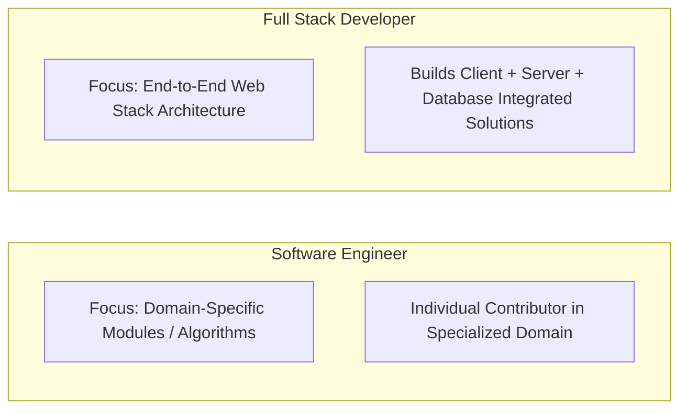
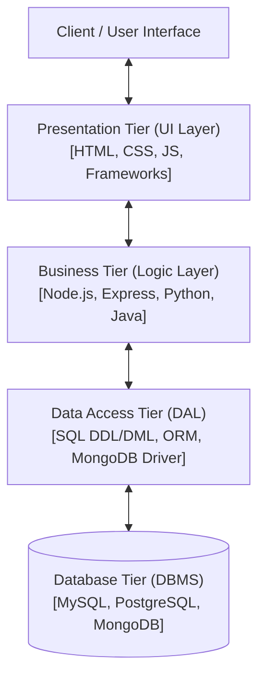
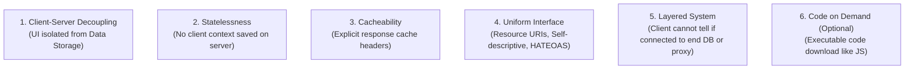
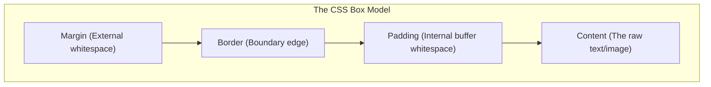
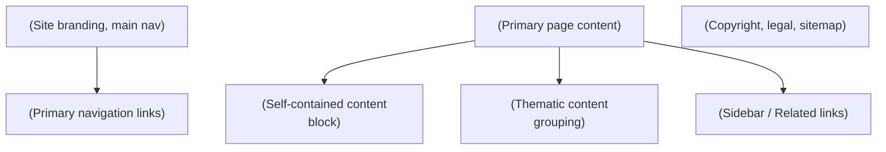
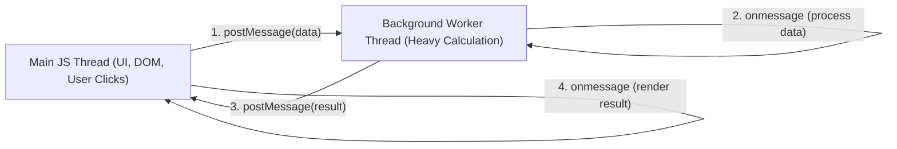
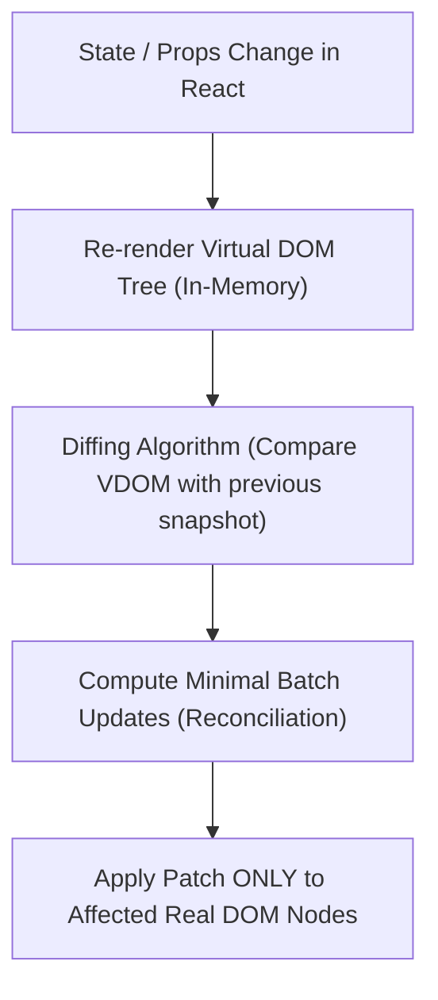

# Full Stack Web Development

**Course:** Full Stack Web Development (FSD)  
**Source Material:** `UNIT-1 Full Stack Development Basics.docx`, `UNIT-1 Full Stack Development Basics.pdf`, `UNIT-2 Frontend Frameworks.docx`  
**Generated Date:** August 09, 2026  

---

# Chapter 1 — Full Stack Basics

## Source map
- `UNIT-1 Full Stack Development Basics.docx` — primary faculty lecture notes.
- `UNIT-1 Full Stack Development Basics.pdf` — secondary reference slides.

---

## 1. Chapter Overview
Unit 1 provides the structural, architectural, and protocol foundation for web application engineering. It spans:
- Core concepts of Full Stack Web Development and role responsibilities.
- Comparative analysis of Front-End, Back-End, and Full Stack engineers.
- Software Engineering vs. Full Stack Development distinctions.
- 3-Tier Enterprise Architecture rules, layer boundary constraints, and decoupled communication.
- Web Development Stacks (LAMP, MEAN, MERN, Ruby on Rails, Django, Spring Boot, Serverless, Flutter/React Native cross-platform).
- JavaScript Object Notation (JSON): syntax rules, data types, nested/multidimensional structures, parsing efficiency, and comment workarounds.
- REpresentational State Transfer (REST) Architecture: 6 architectural constraints, client-server decoupling, statelessness, cacheability, uniform interface, HATEOAS.
- RESTful HTTP Protocol Operations: HTTP Verbs (GET, POST, PUT, DELETE), MIME Types & Accept headers, URI Path design conventions, Response Content-Types, and Standard HTTP Status Codes.

---

## 2. Fundamental Concepts & Terminology

### 2.1 Full Stack Development Defined
A **Full Stack Developer** possesses comprehensive domain knowledge across the entire technology stack—from client-side user interface rendering to server-side business logic, API definition, database administration, and deployment architecture.

> **Role Responsibilities:**
> 1. Technology Evaluation: Selecting client-side and server-side stack components during early project phases.
> 2. Stack Implementation: Writing clean, maintainable code adhering to stack-specific best practices.
> 3. Cross-Disciplinary Knowledge: Maintaining currency with emerging frameworks, databases, and DevOps tools.
> 4. Agile Team Contribution: Serving as versatile, high-velocity engineering nodes in cross-functional Agile environments.

[Source: `UNIT-1 Full Stack Development Basics.docx`, Section 1]

---

### 2.2 Role Comparison

| Feature / Dimension | Front-End Developer | Back-End Developer | Full Stack Developer |
| :--- | :--- | :--- | :--- |
| **Primary Focus** | User Interface (UI), User Experience (UX), Visual Layout, Navigation, Client-Side Interactivity. | Business Logic, Security, Data Management, Database Querying, Request Handling, Scalability. | End-to-End Workflow Execution (Client + Server + Database + API). |
| **Core Technologies** | HTML5, CSS3, JavaScript (ES6+), React, Vue, Angular, Bootstrap, Tailwind. | Node.js, Python, Java, Ruby, PHP, C#/.NET, Express, Django, Spring Boot. | Full Stacks (MERN, MEAN, LAMP, RoR, Serverless) spanning front-end & back-end. |
| **Data Handling** | Manipulates DOM, renders JSON payloads received from server APIs. | Constructs APIs, interacts directly with DBMS (SQL/NoSQL), manages state persistence. | Manages data modeling, API payload construction, and DOM presentation. |
| **System Visibility** | Client browser engine / web runtime. | Server environment / OS / Cloud container / Database. | Complete application topology. |

[Source: `UNIT-1 Full Stack Development Basics.docx`, Section 1]

---

### 2.3 SE vs. FSD



- **Software Engineer:** Broad engineering title. Typically focuses deeply on specialized individual modules, system components, algorithms, low-level OS drivers, or single-tier infrastructure.
- **Full Stack Developer:** Web engineering specialization. Responsible for delivering functional end-to-end applications across all layers (Presentation, Logic, Database).

---

### 2.4 Trade-Off Analysis

#### Advantages:
1. **End-to-End Ownership:** Deep architectural insight into the entire software lifecycle.
2. **Cost & Time Efficiency:** Reduces communication overhead and team size requirement for small-to-medium builds.
3. **Rapid Debugging:** Faster issue isolation across API layer boundaries.
4. **Agile Versatility:** Smooth task-switching between front-end UI and back-end services in sprint cycles.
5. **Entrepreneurial Autonomy:** Enables solo prototyping, SaaS MVP creation, and site monetization.

#### Disadvantages:
1. **Jack-of-all-trades Risk:** Breadth of knowledge can lead to reduced depth compared to specialized backend or database engineers.
2. **Key Person Dependency:** Over-reliance on a single developer creates severe single-point-of-failure risks.
3. **Cognitive Overhead:** Rapid shifts across multiple paradigms (CSS, SQL, Async JS, DevOps) increase defect likelihood.

[Source: `UNIT-1 Full Stack Development Basics.docx`, Section 1]

---

## 3. The 3-Tier Architecture

### 3.1 Structural Architecture
The 3-Tier Architecture cleanly segregates software application code into three distinct, decoupled tiers.



### 3.2 Rules of 3-Tier Architecture
1. **Absolute Layer Isolation:** Code belonging to a tier must reside exclusively inside that tier's files.
2. **Strict Cascade Communication:**
   - Presentation Tier talks **only** to Business Tier. It is strictly prohibited from touching the Data Access Tier or Database directly.
   - Business Tier talks **only** to Presentation Tier (upstream) and Data Access Tier (downstream). It cannot execute raw DB operations directly.
   - Data Access Tier talks **only** to Business Tier (upstream) and the specific DBMS engine (downstream).
3. **Decoupled Agnosticism:**
   - The Business Tier must be **Database-Agnostic** (unaware of whether SQL or NoSQL stores data) and **Presentation-Agnostic** (unaware if output is HTML, JSON, PDF, or CSV).
4. **Granular Multi-Component Structure:**
   - Presentation Tier: A dedicated controller/view component per user transaction.
   - Business Tier: A dedicated business entity logic component per database entity.
   - Data Access Tier: A dedicated Data Access Object (DAO) component per supported DBMS engine.

### 3.3 Skill Requirements per Tier

| Tier | Primary Purpose | Required Technical Skills |
| :--- | :--- | :--- |
| **Presentation Tier** | User interaction, visual rendering, input capture. | HTML5, CSS3, JavaScript, UI/UX Design, Frameworks (React, Vue, Angular). |
| **Business Tier** | Enforcing business rules, computational algorithms, access validation. | Core Server Languages (Node.js, Python, Java, PHP, C#), API Routing. |
| **Data Access Tier** | Executing CRUD transactions against persistent storage. | SQL (DDL/DML), Database Schema Design, Indexing, NoSQL Query APIs. |

[Source: `UNIT-1 Full Stack Development Basics.docx`, Section 2]

---

## 4. Web Stacks & Project Contexts

### 4.1 Comparative Stack Matrix

| Stack | Technology Breakdown | Ideal Project Context | Industry Adopters |
| :--- | :--- | :--- | :--- |
| **LAMP** | **L**inux, **A**pache, **M**ySQL, **P**HP | Low-cost, highly customizable e-commerce, content management systems (CMS). | Wikipedia, Yahoo, Etsy, WordPress, Magento, Shopify |
| **MEAN** | **M**ongoDB, **E**xpress.js, **A**ngular, **N**ode.js | Real-time collaborative enterprise suites, SPA web apps requiring strong TypeScript support. | Google, Microsoft, IBM, Amazon, Uber, PayPal, LinkedIn |
| **MERN** | **M**ongoDB, **E**xpress.js, **R**eact, **N**ode.js | Dynamic, highly interactive single-page web applications with real-time UI state re-rendering. | Meta (Facebook), Netflix, Airbnb, Tesla, Walmart, Uber |
| **Ruby on Rails** | Ruby Language + Rails Framework (MVC) | Rapid startup MVP prototyping, donation management, developer-friendly convention-over-configuration apps. | GitHub, Airbnb, Shopify, SlideShare, CrunchBase, Dribbble |
| **Django (Python)**| Python + Django Framework (MTV) | High-security enterprise internal portals, machine learning-driven web apps, data processing engines. | Instagram, Spotify, YouTube, Disqus, Bitbucket |
| **Java / Spring Boot**| Java + Spring Boot Framework | Large-scale, high-concurrency enterprise applications, banking, microservices architectures. | Amazon, Netflix, Google, Ebay, Enterprise Banking |
| **Serverless** | AWS Lambda / Azure Functions + DynamoDB / Serverless API | Personalized travel planning, event-driven web apps requiring auto-scaling with pay-per-use costing. | Serverless Startups, Cloud Native SaaS |
| **Flutter / React Native**| Cross-Platform Frameworks (Dart / JS) | Multi-platform on-demand mobile & web applications (food delivery, fitness tracking). | Instagram, Uber Eats, BMW, Alibaba |

[Source: `UNIT-1 Full Stack Development Basics.docx`, Section 3]

---

## 5. JavaScript Object Notation (JSON)

### 5.1 Definition & Properties
**Definition:** JSON (JavaScript Object Notation) is a lightweight, text-based, open standard format designed specifically for human-readable data interchange.

> **Key Characteristics:**
> - **Language-Independent:** Native support in JavaScript, Python, Java, C#, PHP, Ruby, Go.
> - **Self-Describing:** Structural key-value pairing defines data context implicitly.
> - **Open Standard:** Based on a subset of JavaScript standard ECMA-262.

### 5.2 JSON vs. XML Comparison

| Evaluation Metric | JSON | XML |
| :--- | :--- | :--- |
| **Verbosity** | Compact, minimal syntax footprint. | Verbose, requires opening and closing tags `<tag></tag>`. |
| **Parsing Speed** | Faster. Uses native fast JavaScript `JSON.parse()`. | Slower. Requires DOM/SAX parser tree construction in memory. |
| **Data Structure Support**| Maps (Key-Value), Arrays, Primitives (Strings, Numbers, Booleans, Null). | Tree structures, Attributes, Elements. |
| **Memory Footprint** | Extremely low. | High (due to DOM node tree allocation). |
| **Readability** | High for both humans and machines. | Moderate (cluttered by markup tags). |

### 5.3 Valid JSON Data Types

| Data Type | Formal Rule & Syntax | Valid Example |
| :--- | :--- | :--- |
| **String** | Double-quoted UTF-8 text string. | `"studentName": "Alice"` |
| **Number** | Integer or floating-point number (no quotes). | `"age": 22`, `"gpa": 3.85` |
| **Boolean** | Literal `true` or `false` (lowercase). | `"isEnrolled": true` |
| **Null** | Literal `null` representing empty value. | `"middleName": null` |
| **Object** | Unordered collection of key-value pairs wrapped in `{}`. Keys MUST be double-quoted strings. | `{"id": 101, "dept": "CS"}` |
| **Array** | Ordered sequence of values wrapped in `[]`. | `"grades": [88, 92, 95]` |

[Source: `UNIT-1 Full Stack Development Basics.docx`, Table 1 & Section 4]

---

### 5.4 JSON Formats & Code Examples

#### A. JSON Object Example
```json
{
  "name": "Jack",
  "employeeid": 1,
  "present": false
}
```

#### B. JSON Array of Objects Example
```json
{
  "employees": [
    { "name": "Ram", "email": "ram@gmail.com", "age": 23 },
    { "name": "Shyam", "email": "shyam23@gmail.com", "age": 28 },
    { "name": "John", "email": "john@gmail.com", "age": 33 },
    { "name": "Bob", "email": "bob32@gmail.com", "age": 41 }
  ]
}
```

#### C. Multidimensional JSON Array Example
```json
[
  ["a", "b", "c"],
  ["m", "n", "o"],
  ["x", "y", "z"]
]
```

#### D. JSON Comment Workaround
JSON standard **does not support native comments** (`//` or `/* */`). To include explanatory notes in a JSON payload, developers introduce explicit attribute keys:
```json
{
  "employee": {
    "name": "Bob",
    "salary": 56000,
    "_comment": "This attribute acts as a comment line for documentation."
  }
}
```

---

### 5.5 JSON Accessing & Manipulation

To utilize a JSON payload inside JavaScript, it must either be parsed from a string into an active memory JavaScript Object, or accessed using object property navigation if already parsed.

#### A. Dot Notation vs. Bracket Notation
Once a JSON string is parsed into a JavaScript object (e.g., `const data`), its values can be accessed using:
1. **Dot Notation (`object.property`):** Best used when the key is a valid JavaScript identifier (no spaces, special characters, or numeric starting digits).
2. **Bracket Notation (`object["property"]`):** Mandatory when the key contains spaces, hyphens, starts with a number, or is stored inside a variable.

```javascript
const user = {
  "first-name": "Alice",
  "age": 25,
  "role 2": "Administrator"
};

// Dot notation
console.log(user.age); // Output: 25

// Bracket notation
console.log(user["first-name"]); // Output: Alice
console.log(user["role 2"]);      // Output: Administrator

// Dynamic key lookup
const key = "age";
console.log(user[key]);          // Output: 25
```

---

#### B. Accessing Complex Nested Structures
In real-world web APIs, JSON objects are heavily nested with objects containing arrays of other objects. Accessing these requires chaining dot/bracket accessors with index subscripts.

```javascript
const companyPayload = {
  "companyName": "TechCorp",
  "locations": ["New York", "London"],
  "departments": [
    {
      "deptId": 101,
      "deptName": "Engineering",
      "manager": { "id": 5, "name": "Sarah" },
      "employees": [
        { "id": 1001, "name": "Ram", "skills": ["Node.js", "MongoDB"] },
        { "id": 1002, "name": "Shyam", "skills": ["React", "CSS"] }
      ]
    }
  ]
};

// 1. Access the company name
console.log(companyPayload.companyName); //TechCorp

// 2. Access London from locations array
console.log(companyPayload.locations[1]); // London

// 3. Access Engineering department's manager name
console.log(companyPayload.departments[0].manager.name); // Sarah

// 4. Access Shyam's first skill
console.log(companyPayload.departments[0].employees[1].skills[0]); // React
```

---

#### C. Parsing vs. Serialization (The JSON API)
JavaScript provides a global native `JSON` object containing two critical high-performance methods for converting data types:

1. **`JSON.parse(text, reviver)` — Deserialization:**
   - **Purpose:** Converts a valid JSON text string into a live JavaScript object.
   - **The `reviver` function:** An optional callback to transform properties while they are being parsed.

   ```javascript
   const jsonString = '{"name":"Alice","birth":"2000-05-15T00:00:00.000Z"}';

   // Direct Parse
   const obj = JSON.parse(jsonString);
   console.log(typeof obj.birth); // "string"

   // Parse with Reviver to instantiate real Date objects automatically
   const parsedObj = JSON.parse(jsonString, (key, value) => {
     if (key === "birth") return new Date(value);
     return value;
   });
   console.log(parsedObj.birth instanceof Date); // true
   ```

2. **`JSON.stringify(value, replacer, space)` — Serialization:**
   - **Purpose:** Converts a JavaScript object into a valid, flat JSON text string.
   - **The `replacer` argument:** An optional array or callback to filter or format serialized keys.
   - **The `space` argument:** A number or string used to insert spacing and linebreaks for pretty-printing.

   ```javascript
   const employee = {
     id: 101,
     name: "Sarah Jones",
     salary: 95000,
     role: "Manager"
   };

   // Simple serialization
   console.log(JSON.stringify(employee));
   // Output: '{"id":101,"name":"Sarah Jones","salary":95000,"role":"Manager"}'

   // Pretty-print with 2-space indentation
   console.log(JSON.stringify(employee, null, 2));
   /* Output:
   {
     "id": 101,
     "name": "Sarah Jones",
     "salary": 95000,
     "role": "Manager"
   }
   */

   // Filtered serialization (serialize ONLY name and role attributes)
   console.log(JSON.stringify(employee, ["name", "role"]));
   // Output: '{"name":"Sarah Jones","role":"Manager"}'
   ```

[Source: `UNIT-1 Full Stack Development Basics.docx`, Section 4]

---

## 6. REST Architecture

### 6.1 Architectural Definition
REST is an architectural style that defines constraints for building scalable, resilient, and stateless web services. Systems adhering to REST principles are termed **RESTful**.

---

### 6.2 The 6 Core Constraints of REST



1. **Client-Server Separation:** Enforces complete boundary separation. The client handles presentation; the server manages storage and logic. Enables independent platform evolution.
2. **Statelessness:** Every request from client to server must contain **all** authentication credentials and contextual data needed to process it. The server stores no session state between requests.
3. **Cacheability:** Responses must explicitly declare whether they can be cached by clients/proxies (`Cache-Control`, `ETag`) to eliminate redundant round-trips.
4. **Uniform Interface:** Standardized interaction contract containing sub-constraints:
   - *Identification of Resources:* Unique URIs identify resources (`/customers/102`).
   - *Manipulation via Representations:* Resources are modified via JSON/XML payloads.
   - *Self-Descriptive Messages:* Headers explicitly describe payload metadata (e.g., `Content-Type`).
   - *HATEOAS (Hypermedia as the Engine of Application State):* Responses include dynamic hypermedia links guiding available client state transitions.
5. **Layered System:** Application topology can include intermediaries (load balancers, cache layers, API gateways) without client awareness.
6. **Code-on-Demand (Optional):** Servers can temporarily extend client functionality by transferring executable code (e.g., JavaScript scripts).

[Source: `UNIT-1 Full Stack Development Basics.docx`, Section 5]

---

## 7. REST HTTP Communications

### 7.1 HTTP Verbs (Operations on Resources)

| Verb | CRUD Mapping | Operational Behavior | Idempotent? | Safe? | Expected Success Code |
| :--- | :--- | :--- | :--- | :--- | :--- |
| **GET** | Read | Retrieves a specific resource or resource collection. | Yes | Yes | `200 OK` |
| **POST** | Create | Creates a new resource under a collection URI. | No | No | `201 CREATED` |
| **PUT** | Update / Replace | Replaces an existing resource or creates if non-existent. | Yes | No | `200 OK` |
| **DELETE**| Delete | Removes a specific resource by ID. | Yes | No | `204 NO CONTENT` |

*Note on Idempotency:* An operation is idempotent if executing it multiple identical times produces the exact same server state as executing it once.

---

### 7.2 Headers & MIME Types
The request `Accept` header indicates media types acceptable in response. The response `Content-Type` header informs the client of the returned payload format.

#### MIME Type Structure: `type/subtype`

```
  application/json
  └───┬───┘   └─┬──┘
    Type     Subtype
```

| Type Category | Commonly Used Subtypes |
| :--- | :--- |
| **Text** | `text/html`, `text/css`, `text/plain`, `text/csv` |
| **Application** | `application/json`, `application/xml`, `application/pdf`, `application/octet-stream` |
| **Image** | `image/png`, `image/jpeg`, `image/gif`, `image/webp` |
| **Audio / Video** | `audio/mpeg`, `audio/wav`, `video/mp4`, `video/ogg` |

#### Client-Server Handshake Trace Example:
- **Client Request:**
```http
GET /articles/23 HTTP/1.1
Host: api.example.com
Accept: text/html, application/json
```
- **Server Response:**
```http
HTTP/1.1 200 OK
Content-Type: application/json

{
  "id": 23,
  "title": "REST Architecture Deep Dive",
  "author": "FSD Expert"
}
```

---

### 7.3 REST URI Path Design Conventions
1. **Plural Naming:** Use plural nouns for collection resources (`/customers`, `/orders`).
2. **Hierarchical Nesting:** Show child resource ownership cleanly:
   - `GET /customers/223/orders/12` (Fetches Order #12 for Customer #223).
3. **Identifier Rules:**
   - Collection Requests (`POST /customers`): No ID appended; server generates ID.
   - Individual Resource Requests (`GET /customers/:id`, `DELETE /customers/:id`): Explicit ID appended.

---

### 7.4 Standard HTTP Response Status Codes

| Code Range | Category | Code & Name | Exam-Critical Definition |
| :--- | :--- | :--- | :--- |
| **2xx** | Success | `200 OK` | Standard response for successful GET, PUT, or PATCH. |
| | | `201 CREATED` | Request succeeded and a new resource was created (POST). |
| | | `204 NO CONTENT` | Request succeeded but response body is intentionally empty (DELETE). |
| **4xx** | Client Error | `400 BAD REQUEST` | Request syntax error, invalid parameters, or payload malformed. |
| | | `403 FORBIDDEN` | Client authenticated, but lacks permissions for resource. |
| | | `404 NOT FOUND` | Resource URI does not exist or has been deleted. |
| **5xx** | Server Error | `500 INTERNAL SERVER ERROR` | Unhandled server-side exception or runtime system crash. |

[Source: `UNIT-1 Full Stack Development Basics.docx`, Table 2 & Section 5]

---

# Chapter 2 — Frontend Frameworks & Modern Web UI

## Source map
- `UNIT-2 Frontend Frameworks.docx` — primary faculty lecture notes.

---

## 1. Chapter Overview
Unit 2 covers front-end web engineering, UI frameworks, responsive visual design, and SPA component architectures:
- Responsive Web Design (RWD) mechanics, Viewport configurations, Responsive Images, and Media Queries.
- HTML5 Semantic Elements, Media Tags (`<audio>`, `<video>`), Graphics Canvas, Drag-and-Drop APIs.
- Bootstrap 5 CSS Framework: Grid Layout system, Breakpoints, Container variants (`container`, `container-fluid`, `container-{breakpoint}`).
- Utility-First Styling with Tailwind CSS: Play CDN setup, utility class breakdowns, state pseudo-classes (`hover:`), transitions.
- Vue.js Core Architecture: Composition API (`createApp`, `ref`), custom directives (`v-uppercase`, `v-list`, `v-format-date`), DOM hooks.
- React.js Architecture: Virtual DOM vs. Real DOM reconciliation engine, JSX elements, Functional vs. Class Components, State Management hooks (`useState`), Side Effect hooks (`useEffect`), and async REST API integration.

---

## 2. HTML5 Foundations & Document Structure

HTML5 is the standard markup language for documents designed to be displayed in a web browser. It provides the semantically structured hierarchy that forms the backbone of all web applications.

### 2.1 HTML5 Document Skeleton
Every valid HTML5 page begins with a document type declaration followed by a nested tree of structural elements:

```html
<!DOCTYPE html>
<html lang="en">
<head>
  <!-- Metadata and External Assets -->
  <meta charset="UTF-8">
  <title>FSD Learning Portal</title>
  <link rel="stylesheet" href="styles.css">
</head>
<body>
  <!-- Visible Page Content -->
  <h1>Welcome to Full Stack Development</h1>
  <p>Learn end-to-end web engineering.</p>
  <script src="app.js"></script>
</body>
</html>
```

* **`<!DOCTYPE html>`:** A mandatory preamble that instructs the browser to render the document in standards-compliant mode rather than "quirks mode".
* **`<html>`:** The root element of the HTML document. The `lang` attribute specifies the language of the page content for accessibility.
* **`<head>`:** Contains non-visible metadata, charset definitions, responsive viewport settings, page titles, and links to stylesheets.
* **`<body>`:** Contains all the visible layout elements, headings, text, media, and interactive controls.

---

### 2.2 Block vs. Inline Elements
HTML layout elements are categorized into two primary display behaviors:

| behavioral Attribute | Block-level Elements | Inline Elements |
| :--- | :--- | :--- |
| **Line Flow** | Starts on a new line; forces subsequent elements to flow onto a new line. | Flows inline; does not start on a new line or force line breaks. |
| **Width & Height** | Automatically fills 100% width of its parent container. Respects `width` and `height` properties. | Takes up only as much width as its content. Ignores `width` and `height` properties. |
| **Nesting Rules** | Can nest other block-level and inline elements. | Can only nest other inline elements (cannot nest block elements). |
| **Typical Tags** | `<div>`, `<p>`, `<h1>`-`<h6>`, `<form>`, `<section>`, `<ul>`, `<li>` | `<span>`, `<a>`, `<strong>`, `<em>`, `<label>`, ``, `<input>` |

---

### 2.3 Forms & Input Validation
HTML `<form>` elements gather user input and submit it to a server for processing.

```html
<form action="/api/register" method="POST" class="registration-form">
  <!-- 1. Text Input with length constraints -->
  <label for="username">Username:</label>
  <input type="text" id="username" name="username" required minlength="4" maxlength="15">

  <!-- 2. Email Input with native regex pattern matching -->
  <label for="email">Email Address:</label>
  <input type="email" id="email" name="email" required>

  <!-- 3. Password Input with customized pattern regex validation -->
  <label for="password">Password (Min 8 chars, 1 number, 1 uppercase):</label>
  <input type="password" id="password" name="password" required
         pattern="(?=.*\d)(?=.*[a-z])(?=.*[A-Z]).{8,}">

  <!-- 4. Select Dropdown Menu -->
  <label for="role">Select Role:</label>
  <select id="role" name="role">
    <option value="student">Student</option>
    <option value="instructor">Instructor</option>
  </select>

  <!-- 5. Checkbox terms consent -->
  <input type="checkbox" id="terms" name="terms" required>
  <label for="terms">I agree to the Terms of Service</label>

  <button type="submit">Register Account</button>
</form>
```

#### Native Constraint Validation Attributes:
* **`required`:** Prevents form submission if the input field is empty.
* **`type="email" / type="url"`:** Validates that the input matches standard email or URL syntactic patterns automatically.
* **`minlength / maxlength`:** Restricts the minimum and maximum character count of text fields.
* **`min / max`:** Restricts the numeric boundaries for `type="number"` and `type="date"` inputs.
* **`pattern="..."`:** Specifies a custom Regular Expression (RegEx) that the input value must match to pass validation.

---

### 2.4 Global & Custom Data Attributes
All HTML elements share certain **global attributes**, but developers can also attach custom metadata:

1. **`id`:** Unique identifier. Must be completely unique within the entire HTML document. Best used for target styling or JS DOM selection.
2. **`class`:** Non-unique identifier. Used to group multiple elements for shared CSS rules or JS array collection.
3. **`style`:** Used to apply CSS style rules directly inline on an element (takes specificity precedence).
4. **`data-*` (Custom Data Attributes):** Allows developers to store custom metadata on standard HTML elements without violating specifications. These can be easily accessed in JavaScript via the `dataset` API.

   ```html
   <div id="product-card" class="card" data-product-id="4051" data-category="electronics">
     Product: Smartphone
   </div>

   <script>
     const card = document.getElementById("product-card");
     // Access custom data attributes
     console.log(card.dataset.productId); // Output: "4051"
     console.log(card.dataset.category);  // Output: "electronics"
   </script>
   ```

---

## 3. Responsive Web Design (RWD) & Layout Media

### 3.1 Viewport Configuration
To ensure mobile browser engines do not default to desktop rendering scale (~980px viewport width), every responsive web page **must include** the viewport meta tag inside the HTML `<head>`:

```html
<meta name="viewport" content="width=device-width, initial-scale=1.0">
```

> **Parameter Breakdown:**
> - `width=device-width`: Maps page width to follow screen width of device in device-independent pixels.
> - `initial-scale=1.0`: Sets initial zoom scale level upon page load by browser.

---

### 2.2 Responsive Images Techniques

#### Method 1: Fluid Width (`width: 100%`)
Scales image up or down to fill container width, but allows image to stretch beyond its native resolution.
```css
img {
  width: 100%;
  height: auto;
}
```

#### Method 2: Constrained Max Width (`max-width: 100%`) — **Recommended**
Scales image down if container shrinks below native width, but never scales image larger than native pixel dimensions.
```css
img {
  max-width: 100%;
  height: auto;
}
```

#### Method 3: HTML5 `<picture>` Element & Media Queries
Swaps image source files based on browser breakpoint conditions:
```html
<picture>
  <source srcset="img_smallflower.jpg" media="(max-width: 600px)">
  <source srcset="img_flowers.jpg" media="(max-width: 1500px)">
  
</picture>
```

[Source: `UNIT-2 Frontend Frameworks.docx`, Section 1]

---

### 2.3 Responsive Typography (Viewport Units)
Text sizes can scale dynamically with browser viewport width using `vw` units ($1\text{vw} = 1\% \text{ of viewport width}$).
```html
<h1 style="font-size: 10vw;">Responsive Heading</h1>
<p style="font-size: 4vw;">Responsive Body Text</p>
```

---

### 2.4 CSS Media Queries
Media queries apply targeted CSS rules based on device capabilities and viewport dimensions.

```css
/* Base Mobile Styles */
body {
  font-size: 14px;
  background-color: #ffffff;
}

/* Tablet Breakpoint (min-width: 600px) */
@media screen and (min-width: 600px) {
  body {
    font-size: 18px;
    background-color: #f0f4f8;
  }
}

/* Desktop Breakpoint (min-width: 1200px) */
@media screen and (min-width: 1200px) {
  body {
    font-size: 22px;
    background-color: #e2e8f0;
  }
}
```

##### Live Design Preview: Box Sizing Interactive Visualizer
The iframe below demonstrates the live physical rendering changes when switching between standard `content-box` and `border-box` behaviors:

<iframe srcdoc="
<!DOCTYPE html>
<html>
<head>
<style>
  body { font-family: sans-serif; padding: 20px; background: #f8fafc; color: #334155; }
  .box { width: 200px; height: 100px; background: #3b82f6; border: 10px solid #1d4ed8; padding: 20px; color: white; display: flex; align-items: center; justify-content: center; font-weight: bold; text-align: center; transition: all 0.3s; margin-bottom: 20px; }
  .controls { display: flex; gap: 10px; margin-bottom: 20px; }
  button { padding: 8px 16px; border: none; background: #1e293b; color: white; border-radius: 4px; cursor: pointer; font-weight: bold; }
  button.active { background: #3b82f6; }
</style>
</head>
<body>
  <h3>Live Box Sizing Preview</h3>
  <div class='controls'>
    <button id='btnContent' class='active' onclick='setSizing(&quot;content-box&quot;)'>content-box (Default)</button>
    <button id='btnBorder' onclick='setSizing(&quot;border-box&quot;)'>border-box (Recommended)</button>
  </div>
  <div id='demoBox' class='box' style='box-sizing: content-box;'>Width: 200px<br>Padding: 20px<br>Border: 10px</div>
  <div id='info'>Total Rendered Width: <strong>260px</strong></div>
  <script>
    function setSizing(type) {
      const box = document.getElementById('demoBox');
      const info = document.getElementById('info');
      box.style.boxSizing = type;
      document.getElementById('btnContent').classList.toggle('active', type === 'content-box');
      document.getElementById('btnBorder').classList.toggle('active', type === 'border-box');
      if (type === 'content-box') {
        info.innerHTML = 'Total Rendered Width: <strong>260px</strong> (200 + 40 padding + 20 border)';
      } else {
        info.innerHTML = 'Total Rendered Width: <strong>200px</strong> (Padding & Border fit inside width)';
      }
    }
  </script>
</body>
</html>
" style="width: 100%; height: 350px; border: 2px solid #cbd5e1; border-radius: 8px; margin-bottom: 20px;"></iframe>

---

### 2.5 CSS Foundations & Styling Systems

CSS (Cascading Style Sheets) controls the visual presentation, layout, and styling of HTML elements. Understanding its foundational rules is critical for any front-end or full-stack developer.

#### A. CSS Selector Specificity Rules
CSS uses rules of **specificity** to resolve conflicts when multiple styles target the same element. Specificity is calculated as a 4-part value `(a, b, c, d)`:
1. **Inline Styles (`style="..."`):** Has the highest weight `(1, 0, 0, 0)`.
2. **ID Selectors (`#id`):** Weights `(0, 1, 0, 0)`.
3. **Class, Pseudo-class, and Attribute Selectors (`.class`, `:hover`, `[type="text"]`):** Weights `(0, 0, 1, 0)`.
4. **Element and Pseudo-element Selectors (`div`, `::before`):** Weights `(0, 0, 0, 1)`.

> **Note on `!important`:** Applying `color: blue !important;` overrides all other specificity selectors. However, its use is heavily discouraged in standard engineering as it breaks cascade inheritance and debugging flow.

```css
/* Specificity: 0, 0, 0, 1 (Element) */
p { color: red; }

/* Specificity: 0, 0, 1, 0 (Class) */
.highlight { color: green; }

/* Specificity: 0, 1, 0, 0 (ID) */
#main-banner { color: blue; }

/* Combined Specificity: 0, 1, 1, 1 (ID + Class + Element) */
#main-banner p.highlight { color: purple; }
```

---

#### B. The CSS Box Model & Sizing
Every HTML element is modeled as a rectangular box. By default, its dimensions are calculated based on the standard Box Model:



### Formula

$$
\text{Total Box Width} = \text{width} + \text{left/right padding} + \text{left/right border} + \text{left/right margin}
$$

### Where
* $\text{width}$ = Declared content width in CSS.
* $\text{padding}$ = Buffer whitespace inside the border.
* $\text{border}$ = Width of boundary edge line.
* $\text{margin}$ = Margin spacing outside the element.

> **CRITICAL EXAM TWISTER (Box Sizing Rules):**
> - **`box-sizing: content-box` (Default):** If you set `width: 300px`, `padding: 20px`, and `border: 5px solid`, the **total rendered width** in the browser becomes:

$$
300 + 40\text{ (padding)} + 10\text{ (border)} = 350\text{px}
$$

> This causes layouts to break easily when adding padding.
> - **`box-sizing: border-box` (Standard Best Practice):** Incorporates padding and border inside the declared width. If you set `width: 300px`, the browser automatically shrinks the content zone so the **total rendered width remains exactly 300px**.
>
>   ```css
>   /* Reset Box-Sizing for the entire application */
>   *, *::before, *::after {
>     box-sizing: border-box;
>     margin: 0;
>     padding: 0;
>   }
>   ```

---

#### C. CSS Positioning Layout Modes
CSS `position` determines the layout coordinate space of an element:

1. **`static` (Default):** Flows naturally in the document order. `top/left/right/bottom` properties have no effect.
2. **`relative`:** Offset relative to its *original static position* in the normal flow. Other elements do not move to fill the gap.
3. **`absolute`:** Pulled out of the normal flow. Positioned relative to its **nearest non-static ancestor** (usually a parent set to `position: relative`).
4. **`fixed`:** Pulled out of normal flow and positioned relative to the **viewport (screen)**. Stays in the exact same place during page scrolling.
5. **`sticky`:** Hybrid mode. Behaves like `relative` until the viewport scroll reaches a specified threshold (e.g., `top: 0`), where it "sticks" like a `fixed` element.

---

#### D. Flexbox Layout System
Flexbox is a 1-Dimensional layout system optimized for distributing space and aligning items along a single axis (either row or column).

```css
.flex-container {
  display: flex;
  flex-direction: row;        /* Layout axis: row | row-reverse | column | column-reverse */
  justify-content: center;    /* Main-axis alignment: flex-start | flex-end | center | space-between | space-around */
  align-items: center;        /* Cross-axis alignment: flex-start | flex-end | center | stretch | baseline */
  flex-wrap: wrap;            /* Wrap items: nowrap | wrap | wrap-reverse */
}

.flex-item {
  flex-grow: 1;               /* Ability to grow to fill empty space (0 = false) */
  flex-shrink: 1;             /* Ability to shrink to prevent overflow */
  flex-basis: 200px;          /* Default size of element before flexing */
}
```

##### Live Design Preview: Flexbox Alignment Interactive Visualizer
The iframe below demonstrates dynamic layout alignments when configuring Flexbox main-axis and cross-axis alignment live:

<iframe srcdoc="
<!DOCTYPE html>
<html>
<head>
<style>
  body { font-family: sans-serif; padding: 20px; background: #f8fafc; color: #334155; }
  .container { display: flex; height: 150px; background: #e2e8f0; border: 2px dashed #cbd5e1; border-radius: 6px; padding: 10px; transition: all 0.3s; }
  .item { width: 50px; height: 50px; background: #10b981; color: white; display: flex; align-items: center; justify-content: center; font-weight: bold; border-radius: 4px; }
  .controls { margin-bottom: 15px; display: flex; flex-direction: column; gap: 8px; }
  select { padding: 6px; border-radius: 4px; border: 1px solid #cbd5e1; background: white; font-weight: bold; }
</style>
</head>
<body>
  <h3>Live Flexbox Layout Preview</h3>
  <div class='controls'>
    <label>justify-content (Main Axis):
      <select id='justifySel' onchange='updateLayout()'>
        <option value='flex-start'>flex-start</option>
        <option value='center'>center</option>
        <option value='flex-end'>flex-end</option>
        <option value='space-between'>space-between</option>
        <option value='space-around'>space-around</option>
      </select>
    </label>
    <label>align-items (Cross Axis):
      <select id='alignSel' onchange='updateLayout()'>
        <option value='flex-start'>flex-start</option>
        <option value='center' selected>center</option>
        <option value='flex-end'>flex-end</option>
        <option value='stretch'>stretch</option>
      </select>
    </label>
  </div>
  <div id='flexContainer' class='container' style='justify-content: flex-start; align-items: center;'>
    <div class='item'>1</div>
    <div class='item' style='background:#f59e0b;'>2</div>
    <div class='item' style='background:#ef4444;'>3</div>
  </div>
  <script>
    function updateLayout() {
      const cont = document.getElementById('flexContainer');
      cont.style.justifyContent = document.getElementById('justifySel').value;
      cont.style.alignItems = document.getElementById('alignSel').value;
    }
  </script>
</body>
</html>
" style="width: 100%; height: 350px; border: 2px solid #cbd5e1; border-radius: 8px; margin-bottom: 20px;"></iframe>

---

#### E. CSS Grid Layout System
CSS Grid is a powerful 2-Dimensional layout system optimized for building structured layouts with both rows and columns.

```css
.grid-container {
  display: grid;
  grid-template-columns: repeat(3, 1fr);  /* 3 equal fractional width columns */
  grid-template-rows: auto 100px;         /* Row 1 size auto, Row 2 size 100px */
  gap: 16px;                              /* Row and column gutters */
}

.grid-item-header {
  grid-column: 1 / span 3;                /* Span header across all 3 columns */
}

.grid-item-sidebar {
  grid-column: 1 / 2;
}

.grid-item-main {
  grid-column: 2 / span 2;
}
```

---

## 3. HTML5 Semantic Elements & Advanced APIs

### 3.1 Structural Semantic Tags



| Tag | Purpose & Description |
| :--- | :--- |
| `<header>` | Specifies introductory content, site logo, header heading, or navigational links. |
| `<footer>` | Defines footer for document containing authoring info, copyright, or privacy links. |
| `<figure>` | Encloses self-contained visual media like illustrations, diagrams, photos, or code snippets. |
| `<figcaption>`| Provides textual caption / legend specifically attached to parent `<figure>`. |
| `<progress>` | Renders visual progress bar indicating completion ratio of a task (attributes: `value`, `max`). |
| `<mark>` | Represents highlighted text for reference due to relevance in user context. |

---

### 3.2 Native HTML5 Media Tags

#### A. Audio Player Code Example
```html
<audio controls autoplay loop>
  <source src="track.mp3" type="audio/mpeg">
  <source src="track.ogg" type="audio/ogg">
  Your browser does not support the audio element.
</audio>
```

#### B. Video Player Code Example
```html
<video width="640" height="360" controls poster="thumbnail.jpg">
  <source src="movie.mp4" type="video/mp4">
  <source src="movie.webm" type="video/webm">
  Your browser does not support the video tag.
</video>
```

---

### 3.3 Native HTML5 Drag and Drop API

#### Code Example: Drag Element into Target Drop Zone
```html
<!DOCTYPE html>
<html>
<head>
<style>
  #dropZone {
    width: 300px;
    height: 150px;
    padding: 10px;
    border: 2px dashed #007bff;
  }
  #dragElement {
    width: 100px;
    height: 40px;
    background-color: #28a745;
    color: white;
    text-align: center;
    line-height: 40px;
    cursor: move;
  }
</style>
</head>
<body>

<div id="dropZone" ondragover="allowDrop(event)" ondrop="drop(event)"></div>
<br>
<div id="dragElement" draggable="true" ondragstart="dragStart(event)">Drag Me</div>

<script>
function dragStart(event) {
  // Store ID of dragged element in dataTransfer buffer
  event.dataTransfer.setData("text/plain", event.target.id);
}

function allowDrop(event) {
  // Prevent default browser handling to allow drop target behavior
  event.preventDefault();
}

function drop(event) {
  event.preventDefault();
  // Retrieve dragged element ID
  var draggedId = event.dataTransfer.getData("text/plain");
  var draggedNode = document.getElementById(draggedId);
  // Append node inside drop target
  event.target.appendChild(draggedNode);
}
</script>
</body>
</html>
```

[Source: `UNIT-2 Frontend Frameworks.docx`, Section 2]

---

### 3.4 Native HTML5 Geolocation API
The HTML5 Geolocation API allows the user to share their physical geographic location coordinates with web applications. For privacy reasons, the browser explicitly prompts the user for permission before sharing location coordinates.

#### Core Syntax:
- **`navigator.geolocation.getCurrentPosition(successCallback, errorCallback, options)`:** Fetches the current location once.
- **`navigator.geolocation.watchPosition(successCallback, errorCallback, options)`:** Periodically tracks the user's location as it changes.

```html
<button onclick="getLocation()">Get Coordinates</button>
<p id="locationDisplay"></p>

<script>
function getLocation() {
  const display = document.getElementById("locationDisplay");
  if (navigator.geolocation) {
    navigator.geolocation.getCurrentPosition(showPosition, showError);
  } else {
    display.innerHTML = "Geolocation is not supported by this browser.";
  }
}

function showPosition(position) {
  const lat = position.coords.latitude;
  const lon = position.coords.longitude;
  document.getElementById("locationDisplay").innerHTML =
    `Latitude: ${lat} <br>Longitude: ${lon}`;
}

function showError(error) {
  const display = document.getElementById("locationDisplay");
  switch(error.code) {
    case error.PERMISSION_DENIED:
      display.innerHTML = "User denied the request for Geolocation.";
      break;
    case error.POSITION_UNAVAILABLE:
      display.innerHTML = "Location information is unavailable.";
      break;
    case error.TIMEOUT:
      display.innerHTML = "The request to get user location timed out.";
      break;
    default:
      display.innerHTML = "An unknown error occurred.";
  }
}
</script>
```

---

### 3.5 HTML5 Web Storage API
Web Storage allows applications to store key-value data directly in the browser. This is much faster, more secure, and carries a much larger capacity (~5 MB) compared to HTTP cookies (~4 KB).

#### LocalStorage vs. SessionStorage Comparison:

| Feature / Dimension | LocalStorage | SessionStorage |
| :--- | :--- | :--- |
| **Data Persistence** | Persistent. Retained permanently even when the tab, window, or browser is closed. | Temporary. Cleared automatically when the specific browser tab is closed. |
| **Scope Boundary** | Shared across all tabs and windows of the same origin (protocol + host + port). | Limited to the specific browser tab where it was created. |
| **Typical Use Cases** | User preferences, persistent theme configurations, offline draft autosaves. | Temporary forms multi-step wizards, single-session data state. |

#### Core API Operations & Syntax:
All storage keys and values are stored exclusively as **strings**. To store complex JavaScript objects/arrays, they must be converted using `JSON.stringify()` before saving and `JSON.parse()` when retrieving:

```javascript
// 1. Setting and Getting primitive values
localStorage.setItem("username", "Alice FSD");
const user = localStorage.getItem("username");
console.log(user); // Output: "Alice FSD"

// 2. Storing and retrieving complex structured objects
const profile = { id: 101, roles: ["User", "Admin"] };

// Serialization required
localStorage.setItem("userProfile", JSON.stringify(profile));

// Deserialization required
const savedProfile = JSON.parse(localStorage.getItem("userProfile"));
console.log(savedProfile.roles[1]); // Output: "Admin"

// 3. Deleting data
localStorage.removeItem("username"); // Delete specific key
localStorage.clear();               // Clear entire origin storage
```

---

### 3.6 HTML5 Canvas API
The HTML5 `<canvas>` element provides a resolution-dependent coordinate grid space used to draw 2D/3D graphics dynamically via JavaScript scripts.

#### Core Syntax:
1. Define the canvas element with fixed `width` and `height` attributes (do not use CSS to scale them as it stretches the pixel grid).
2. Retrieve the 2D rendering context using `canvas.getContext("2d")`.
3. Invoke draw API paths (`strokeRect`, `beginPath`, `arc`, `fillText`).

```html
<canvas id="myCanvas" width="400" height="200" style="border:1px solid #000;"></canvas>

<script>
const canvas = document.getElementById("myCanvas");
const ctx = canvas.getContext("2d");

// 1. Draw a blue solid rectangle
ctx.fillStyle = "#3b82f6";
ctx.fillRect(20, 20, 150, 100);

// 2. Draw a red circle outline
ctx.beginPath();
ctx.arc(280, 70, 40, 0, 2 * Math.PI); // x, y, radius, startAngle, endAngle
ctx.strokeStyle = "#ef4444";
ctx.lineWidth = 5;
ctx.stroke();

// 3. Draw solid text
ctx.font = "24px Arial";
ctx.fillStyle = "#1e293b";
ctx.fillText("HTML5 Canvas", 110, 160);
</script>
```

---

### 3.7 HTML5 Web Workers API
In standard web browsers, JavaScript runs inside a single-threaded execution context (the Main Thread). If a script executes a heavy mathematical calculation, the browser tab freezes (lock-up UI).
**Web Workers** allow scripts to run in background worker threads independently of the main execution thread.



#### Code Implementation:

1. **The Background Worker Script (`worker.js`):**
   ```javascript
   // Listen for message from main thread
   onmessage = function(e) {
     const limit = e.data;
     let sum = 0;
     // Perform heavy computation
     for (let i = 1; i <= limit; i++) {
       sum += i;
     }
     // Post result back to main thread
     postMessage(sum);
   };
   ```

2. **The Main Thread Script (`app.js`):**
   ```javascript
   // 1. Spawning the background thread worker
   const myWorker = new Worker("worker.js");

   // 2. Sending calculation task to worker
   myWorker.postMessage(1000000000); // Pass heavy loop limit

   // 3. Listen for completed result
   myWorker.onmessage = function(e) {
     console.log("Calculated Sum result: " + e.data);
     document.getElementById("output").innerText = e.data;

     // 4. Terminate worker when finished to free memory resources
     myWorker.terminate();
   };
   ```

[Source: `UNIT-2 Frontend Frameworks.docx`, Section 2]

---

## 4. Bootstrap 5 Framework

### 4.1 Overview & Bootstrap 5 vs 4 Key Upgrades
Bootstrap is an open-source front-end toolkit for responsive layout grid creation.

> **Key Bootstrap 5 Changes:**
> - Dropped jQuery dependency completely in favor of Vanilla ES6+ JavaScript.
> - Added `XX-Large (xxl)` breakpoint ($1400\text{px}$).
> - Introduced CSS Custom Properties (Variables) natively.
> - Introduced custom SVG icons library.

---

### 4.2 Installation Modes (CDN vs. Offline Compiled)

#### Online CDN Integration:
```html
<link href="https://cdn.jsdelivr.net/npm/bootstrap@5.3.0/dist/css/bootstrap.min.css" rel="stylesheet">
<script src="https://cdn.jsdelivr.net/npm/bootstrap@5.3.0/dist/js/bootstrap.bundle.min.js"></script>
```

#### Offline Local Distribution:
```html
<link rel="stylesheet" href="bootstrap-5.0.2-dist/css/bootstrap.css">
```

---

### 4.3 Container System

| Container Class | Extra Small (`< 576px`) | Small `sm` (`≥ 576px`) | Medium `md` (`≥ 768px`) | Large `lg` (`≥ 992px`) | X-Large `xl` (`≥ 1200px`) | XXL `xxl` (`≥ 1400px`) |
| :--- | :--- | :--- | :--- | :--- | :--- | :--- |
| `.container` | `100%` | `540px` | `720px` | `960px` | `1140px` | `1320px` |
| `.container-sm` | `100%` | `540px` | `720px` | `960px` | `1140px` | `1320px` |
| `.container-md` | `100%` | `100%` | `720px` | `960px` | `1140px` | `1320px` |
| `.container-lg` | `100%` | `100%` | `100%` | `960px` | `1140px` | `1320px` |
| `.container-xl` | `100%` | `100%` | `100%` | `100%` | `1140px` | `1320px` |
| `.container-xxl`| `100%` | `100%` | `100%` | `100%` | `100%` | `1320px` |
| `.container-fluid`| `100%` | `100%` | `100%` | `100%` | `100%` | `100%` |

[Source: `UNIT-2 Frontend Frameworks.docx`, Table 3]

---

### 4.4 Container Layout Code Example
```html
<div class="container my-4">
  <div class="row">
    <div class="col-md-4 col-sm-6" style="border: 2px solid black;">Column 1</div>
    <div class="col-md-4 col-sm-6" style="border: 2px solid red;">Column 2</div>
    <div class="col-md-4 col-sm-12" style="border: 2px solid blue;">Column 3</div>
  </div>
</div>
```

---

## 5. Utility-First CSS with Tailwind CSS

### 5.1 Play CDN & Utility Class Breakdown
Tailwind CSS provides low-level utility classes to compose UI designs directly inside markup.

```html
<script src="https://cdn.tailwindcss.com"></script>
```

#### Utility Class Deconstruction Example:
`<div class="bg-blue-500 text-white p-4 text-2xl mt-2 rounded-lg text-center">`

| Class | CSS Property Applied | Options / Scale Meaning |
| :--- | :--- | :--- |
| `bg-blue-500` | `background-color` | Color shade intensity 500 on Tailwind color palette. |
| `text-white` | `color` | Solid white text color (`#ffffff`). |
| `p-4` | `padding` | Padding size index 4 ($1\text{rem} = 16\text{px}$ on default scale). |
| `text-2xl` | `font-size`, `line-height` | Extra large font size ($1.5\text{rem} = 24\text{px}$). |
| `mt-2` | `margin-top` | Top margin size index 2 ($0.5\text{rem} = 8\text{px}$). |
| `rounded-lg` | `border-radius` | Large border radius ($0.5\text{rem} = 8\text{px}$). |
| `text-center` | `text-align` | Center text alignment. |

---

### 5.2 Hover Pseudo-Class State & Transition Example
```html
<div class="h-full border-2 border-gray-200 border-opacity-60 rounded-lg overflow-hidden">
  <div class="p-6 hover:bg-green-600 hover:text-white transition duration-300 ease-in">
    <h1 class="text-2xl font-semibold mb-3">Hover Card Interaction</h1>
    <p>Card background transforms smoothly to green on mouse hover.</p>
  </div>
</div>
```

[Source: `UNIT-2 Frontend Frameworks.docx`, Section 3]

---

### 5.3 JavaScript Core Engineering Concepts

JavaScript is the native, high-performance, single-threaded execution language of the web browser runtime environment. Deeply mastering its core engineering mechanics is essential for any full-stack developer.

#### A. Execution Context and Variable Scope Rules
The JavaScript engine organizes variable visibility and lifetime inside distinct scoping contexts:

| Scope Type | Keyword | Hoisting Behavior | Re-declaration Allowed? | Scope Boundary |
| :--- | :---: | :--- | :---: | :--- |
| **Global / Function** | `var` | Hoisted to top of scope and initialized as `undefined`. | Yes | Bound to enclosing function execution context. Ignores `{}` block levels. |
| **Block-Bound** | `let` | Hoisted to top of block but uninitialized (placed in Temporal Dead Zone). | No | Bound strictly to enclosing block braces `{}` (loops, conditionals). |
| **Block-Bound Constant** | `const` | Hoisted to top of block but uninitialized (placed in Temporal Dead Zone). | No | Bound strictly to enclosing block braces `{}`. Reference pointer is immutable. |

```javascript
// Temporal Dead Zone Example
// console.log(x); // Throws ReferenceError for let/const
let x = 10;

// Scope Boundary Example
function testScope() {
  if (true) {
    var functionScoped = "Visible everywhere in function";
    let blockScoped = "Only visible inside this IF block";
  }
  console.log(functionScoped); // Output: "Visible everywhere in function"
  // console.log(blockScoped); // Throws ReferenceError
}
```

---

#### B. JavaScript Closures
A **closure** is the combination of a function bundled together (enclosed) with references to its surrounding state (the **lexical environment**). In other words, a closure gives an inner function access to the outer function's scope even after the outer function has finished executing.

```javascript
function createCounter() {
  let count = 0; // Private outer scope variable

  return {
    increment: function() {
      count++;
      return count;
    },
    decrement: function() {
      count--;
      return count;
    }
  };
}

const counter = createCounter();
console.log(counter.increment()); // Output: 1
console.log(counter.increment()); // Output: 2
// count is completely encapsulated and cannot be modified directly from outside!
```

---

#### C. Modern ES6+ Features
ES6 (ECMAScript 2015) and subsequent standards introduced powerful syntactic sugar and operational features:

1. **Arrow Functions:** Concise anonymous function syntax with **lexical binding of the `this` pointer** (ignores context invocation boundaries).
2. **Template Literals:** Multi-line string interpolation using backticks (`` ` ``) and dynamic variables (`${var}`).
3. **Destructuring Assignment:** Unpacks properties of arrays or objects directly into separate variables.
4. **Spread / Rest Operator (`...`):** Unpacks/packages array/object elements.

```javascript
// 1. Arrow Functions and Template Literals
const greet = (name) => `Hello, ${name}!`;

// 2. Destructuring Assignment
const student = { name: "Alice", gpa: 3.8 };
const { name, gpa } = student; // Alice, 3.8

// 3. Spread/Rest Operator
const arr1 = [1, 2];
const arr2 = [...arr1, 3, 4]; // [1, 2, 3, 4]
```

---

#### D. Asynchronous JavaScript: Promises & Async/Await
Since JavaScript is single-threaded, long-running processes (like network API requests or disk reads) must execute asynchronously to prevent the main thread from blocking.

1. **Promises:** Represent the eventual completion (or failure) of an asynchronous operation and its resulting value. Transitions through 3 states: `pending`, `fulfilled` (via `resolve()`), and `rejected` (via `reject()`).
2. **Async / Await:** Syntactic sugar built on top of Promises to write asynchronous code that reads like sequential, synchronous code.

```javascript
// 1. Creating a Promise wrapper
const fetchUserData = (userId) => {
  return new Promise((resolve, reject) => {
    setTimeout(() => {
      if (userId > 0) {
        resolve({ id: userId, username: "Alice_FSD" });
      } else {
        reject("Invalid User ID");
      }
    }, 1000); // Simulate network latency
  });
};

// 2. Consuming using Async / Await with Try-Catch error mapping
async function loadUser() {
  try {
    console.log("Fetching user...");
    const user = await fetchUserData(101); // Pauses execution context until resolved
    console.log(`Loaded user: ${user.username}`);
  } catch (error) {
    console.error(`Error loading user: ${error}`);
  }
}
loadUser();
```

---

#### E. DOM Manipulation and Event Handlers
The Document Object Model (DOM) represents the document as a logical tree of elements. JavaScript manipulates this tree dynamically:

```javascript
// 1. DOM Element Selection
const btn = document.querySelector("#submit-btn");
const container = document.querySelector(".content-container");

// 2. Adding Event Listener with dynamic DOM node updates
btn.addEventListener("click", (event) => {
  event.preventDefault(); // Halt default form navigation

  // 3. Dynamic element creation and insertion
  const newItem = document.createElement("p");
  newItem.className = "alert alert-success";
  newItem.textContent = "Data successfully saved to DOM tree!";

  container.appendChild(newItem);
});
```

[Source: `UNIT-2 Frontend Frameworks.docx`, Section 3]

---

## 6. Vue.js Progressive Framework

### 6.1 Core Architectural Overview
Vue.js is an open-source progressive JavaScript framework for UI development.

> **Key Concepts:**
> - **Reactivity System:** Dynamic data binding updates DOM automatically when data state changes.
> - **Directives:** Special prefixed HTML attributes (`v-`) extending HTML functionality.
> - **Composition API:** Introduced in Vue 3 via `createApp` and `ref` for modular state composition.

---

### 6.2 Vue 3 Composition API Setup Code Example
```html
<!DOCTYPE html>
<html lang="en">
<head>
  <meta charset="UTF-8">
  <title>Vue JS Composition API</title>
  <script src="https://unpkg.com/vue@3/dist/vue.global.js"></script>
</head>
<body>
  <div id="app">
    <h1>{{ message }}</h1>
  </div>

  <script>
    const { createApp, ref } = Vue;

    createApp({
      setup() {
        // Define reactive property
        const message = ref('Hello FSD Division!');
        
        // Expose reactive property to template
        return { message };
      }
    }).mount('#app');
  </script>
</body>
</html>
```

---

### 6.3 Vue.js Custom Directives
Custom directives encapsulate low-level DOM manipulations on elements.

#### Example 1: `v-uppercase` Custom Directive
Converts text content of element to uppercase when clicked.
```html
<div id="app">
  <p v-uppercase>Click this paragraph text to uppercase!</p>
</div>

<script>
  const app = Vue.createApp({});

  app.directive('uppercase', {
    mounted(el) {
      el.addEventListener('click', () => {
        el.textContent = el.textContent.toUpperCase();
      });
    }
  });

  app.mount('#app');
</script>
```

#### Example 2: `v-list` Dynamic Unordered List Directive
Renders array of items as dynamic `<li>` items.
```html
<div id="app">
  <ul v-list="items"></ul>
</div>

<script>
  const app = Vue.createApp({
    data() {
      return { items: ['MongoDB', 'Express.js', 'React.js', 'Node.js'] };
    }
  });

  app.directive('list', {
    mounted(el, binding) {
      binding.value.forEach(item => {
        const li = document.createElement('li');
        li.textContent = item;
        el.appendChild(li);
      });
    }
  });

  app.mount('#app');
</script>
```

#### Example 3: `v-format-date` Custom Directive
Formats Date objects into readable strings inside DOM node.
```html
<div id="app">
  <p v-format-date="currentDate"></p>
</div>

<script>
  const app = Vue.createApp({
    data() {
      return { currentDate: new Date() };
    }
  });

  app.directive('format-date', {
    mounted(el, binding) {
      const date = new Date(binding.value);
      el.textContent = date.toLocaleDateString('en-US', {
        year: 'numeric', month: 'long', day: 'numeric'
      });
    }
  });

  app.mount('#app');
</script>
```

[Source: `UNIT-2 Frontend Frameworks.docx`, Section 4]

---

## 7. React.js Library & Component Architecture

### 7.1 Virtual DOM vs. Real DOM Comparison



| Dimension | Real DOM | Virtual DOM (React Engine) |
| :--- | :--- | :--- |
| **Data Structure** | Actual browser rendered HTML DOM node tree. | Lightweight JavaScript object copy of Real DOM kept in memory. |
| **Update Mechanism** | Re-renders entire subtree when data mutates. | Runs Diffing algorithm to find exact modified nodes. |
| **Performance Impact**| High performance overhead; layout reflows and repaints. | Extremely fast; batched UI updates eliminate reflow overhead. |
| **Direct Manipulation**| Direct document manipulation (`document.getElementById`). | Abstracted via React Engine state rendering. |

---

### 7.2 React Installation Commands
```bash
# Create new React single page app
npx create-react-app my-fsd-app

# Navigate into project root
cd my-fsd-app

# Launch dev server on http://localhost:3000
npm start
```

---

### 7.3 Functional vs. Class Components

#### A. Functional Component Syntax (Modern Standard)
```jsx
import React from 'react';

function Greeting(props) {
  return <h1>Hello, {props.name}!</h1>;
}

export default Greeting;
```

#### B. Class Component Syntax (Legacy Standard)
```jsx
import React, { Component } from 'react';

class Greeting extends Component {
  render() {
    return <h1>Hello, {this.props.name}!</h1>;
  }
}

export default Greeting;
```

---

### 7.4 React Hooks: Async REST API Data Fetching

#### Complete Code Implementation (`App.js`):
```jsx
import React, { useState, useEffect } from 'react';

function App() {
  // State 1: Track async loading state
  const [loading, setLoading] = useState(true);
  
  // State 2: Store fetched API records
  const [records, setRecords] = useState([]);

  // Side effect hook: Runs once when component mounts
  useEffect(() => {
    fetch('https://jsonplaceholder.typicode.com/users')
      .then((response) => response.json())
      .then((data) => {
        setRecords(data);
        setLoading(false);
      })
      .catch((error) => {
        console.error('API Fetch Error:', error);
        setLoading(false);
      });
  }, []); // Empty dependency array ensures single execution on mount

  if (loading) {
    return <h3>Loading records from server...</h3>;
  }

  return (
    <div style={{ padding: '20px' }}>
      <h2>User Records (Fetched via REST API)</h2>
      <ul>
        {records.map((user) => (
          <li key={user.id}>
            <strong>{user.name}</strong> - {user.email} ({user.company.name})
          </li>
        ))}
      </ul>
    </div>
  );
}

export default App;
```

---

### 7.5 Practical App: Movie Ticket Booking

#### Complete Code Implementation (`MovieTicketBooking.js`):
```jsx
import React, { useState } from 'react';

const MovieTicketBooking = () => {
  // State for tracked user selections
  const [selectedMovie, setSelectedMovie] = useState(null);
  const [selectedSeats, setSelectedSeats] = useState([]);

  // Available Movies Catalog Data
  const movies = [
    { id: 1, title: 'Avengers: Endgame', availableSeats: 12 },
    { id: 2, title: 'Interstellar', availableSeats: 8 },
    { id: 3, title: 'Inception', availableSeats: 15 }
  ];

  // Event Handler: Movie Selection
  const handleMovieSelect = (movie) => {
    setSelectedMovie(movie);
    setSelectedSeats([]); // Reset seat selections for new movie
  };

  // Event Handler: Seat Toggle Selection
  const handleSeatSelect = (seatIndex) => {
    if (!selectedSeats.includes(seatIndex)) {
      setSelectedSeats([...selectedSeats, seatIndex]);
    }
  };

  // Event Handler: Reset Selections
  const handleReset = () => {
    setSelectedSeats([]);
  };

  return (
    <div style={{ padding: '20px', fontFamily: 'Arial, sans-serif' }}>
      <h2>Cinema Ticket Booking System</h2>
      
      {/* Movie Selection Section */}
      <div>
        <h3>Step 1: Select a Movie</h3>
        <ul>
          {movies.map((movie) => (
            <li 
              key={movie.id} 
              onClick={() => handleMovieSelect(movie)}
              style={{
                cursor: 'pointer',
                fontWeight: selectedMovie?.id === movie.id ? 'bold' : 'normal',
                color: selectedMovie?.id === movie.id ? '#007bff' : '#333'
              }}
            >
              {movie.title} — ({movie.availableSeats} seats available)
            </li>
          ))}
        </ul>
      </div>

      {/* Seat Interactive Selection Grid */}
      {selectedMovie && (
        <div style={{ marginTop: '20px', borderTop: '2px solid #ccc', paddingTop: '10px' }}>
          <h3>Step 2: Select Seats for {selectedMovie.title}</h3>
          
          <div style={{ display: 'flex', flexWrap: 'wrap', gap: '8px', maxWidth: '300px' }}>
            {Array.from({ length: selectedMovie.availableSeats }, (_, index) => (
              <button
                key={index}
                disabled={selectedSeats.includes(index)}
                onClick={() => handleSeatSelect(index)}
                style={{
                  width: '40px',
                  height: '40px',
                  backgroundColor: selectedSeats.includes(index) ? '#28a745' : '#e2e8f0',
                  color: selectedSeats.includes(index) ? '#fff' : '#000',
                  border: '1px solid #cbd5e1',
                  borderRadius: '4px',
                  cursor: selectedSeats.includes(index) ? 'not-allowed' : 'pointer'
                }}
              >
                {index + 1}
              </button>
            ))}
          </div>

          {/* Selected Seat Summary Panel */}
          <div style={{ marginTop: '15px' }}>
            <h4>Selected Seat Summary:</h4>
            {selectedSeats.length === 0 ? (
              <p>No seats selected yet.</p>
            ) : (
              <p>
                Seats: {selectedSeats.map((seat) => `#${seat + 1}`).join(', ')}
              </p>
            )}
            
            <button 
              onClick={handleReset}
              style={{
                backgroundColor: '#dc3545',
                color: 'white',
                border: 'none',
                padding: '8px 16px',
                borderRadius: '4px',
                cursor: 'pointer'
              }}
            >
              Reset Seat Selection
            </button>
          </div>
        </div>
      )}
    </div>
  );
};

export default MovieTicketBooking;
```

[Source: `UNIT-2 Frontend Frameworks.docx`, Section 5]

---

# Formula & Rule Sheet

### 1. Viewport Text Sizing Rule
$$
\text{Font Size (in cm)} = \text{Viewport Width (cm)} \times \left(\frac{\text{vw}}{100}\right)
$$
*Where $1\text{vw} = 1\%$ of total browser viewport width.*

### 2. HTTP Method Idempotency & Safety Matrix
$$
\begin{aligned}
\text{GET} &\implies \text{Safe: True}, \quad \text{Idempotent: True} \\
\text{PUT} &\implies \text{Safe: False}, \quad \text{Idempotent: True} \\
\text{DELETE} &\implies \text{Safe: False}, \quad \text{Idempotent: True} \\
\text{POST} &\implies \text{Safe: False}, \quad \text{Idempotent: False}
\end{aligned}
$$

### 3. Bootstrap Container Max-Width Step Function
$$
\text{Max Width}(\text{viewport } w) = \begin{cases} 
100\% & w < 576\text{px} \\
540\text{px} & 576\text{px} \le w < 768\text{px} \\
720\text{px} & 768\text{px} \le w < 992\text{px} \\
960\text{px} & 992\text{px} \le w < 1200\text{px} \\
1140\text{px} & 1200\text{px} \le w < 1400\text{px} \\
1320\text{px} & w \ge 1400\text{px}
\end{cases}
$$

---

# Key Glossary

- **3-Tier Architecture:** Software engineering pattern dividing application into Presentation, Business Logic, and Data Access tiers.
- **REST:** REpresentational State Transfer architectural style for stateless, scalable web service communication.
- **HATEOAS:** Hypermedia as the Engine of Application State constraint where REST responses contain dynamic hypermedia navigation links.
- **MIME Type:** Multipurpose Internet Mail Extensions format specifying payload media encoding (`type/subtype`).
- **Idempotency:** Property of HTTP verbs where executing identical requests $N$ times yields identical server state.
- **Virtual DOM:** In-memory lightweight clone of real DOM used by React for fast diffing and minimal reconciliation repaints.
- **Directive:** Special DOM attribute (`v-` in Vue) instructing framework engine to execute DOM manipulations.
- **Composition API:** Vue 3 function-based API structure utilizing `setup()`, `ref()`, and `createApp()`.

---

# Exam Review & Questions

> This section provides an **Exam-oriented review** and study questions to test core web engineering concepts.

### 1. Conceptual & Descriptive Questions
1. **Explain the 3-Tier Architecture in detail.** Detail the exact rules governing communication between tiers. Why is the Business Tier prohibited from knowing database details?
2. **List and explain all 6 architectural constraints of RESTful APIs.** What does statelessness imply for client requests?
3. **Compare JSON and XML.** Provide 5 distinct parameters of evaluation and write a valid JSON array of objects example.
4. **Explain Virtual DOM vs. Real DOM in React.** How does the diffing algorithm optimize performance?

### 2. Code & Implementation Questions
1. **Write an HTML5 web page demonstrating Native Drag and Drop.** Include inline JS for `ondragstart`, `ondragover`, and `ondrop`.
2. **Write a complete Vue 3 application using custom directives.** Implement a directive `v-format-date` that displays formatted dates inside `<p>`.
3. **Write a React component fetching REST API data.** Implement `useState` and `useEffect` to display a list of users fetched asynchronously from a remote endpoint.
4. **Demonstrate responsive images in RWD.** Write code using fluid width, `max-width`, and the HTML5 `<picture>` tag with breakpoints.

### 3. Multiple Choice & Quick Options Reference

1. Which HTTP status code is returned upon successful resource creation via `POST`?
   - A) 200 OK
   - **B) 201 CREATED** *(Correct)*
   - C) 204 NO CONTENT
   - D) 400 BAD REQUEST

2. In Bootstrap 5, what is the minimum breakpoint width for `container-lg` to stop being $100\%$ fluid?
   - A) 576px
   - B) 768px
   - **C) 992px** *(Correct)*
   - D) 1200px

3. Which of the following HTTP verbs is **NOT** idempotent?
   - A) GET
   - B) PUT
   - **C) POST** *(Correct)*
   - D) DELETE

4. In Tailwind CSS, what styling does `p-4` apply?
   - A) Position fixed at 4px
   - **B) Padding on all 4 sides** *(Correct)*
   - C) Percent width 4%
   - D) Paragraph font weight

5. Which hook handles side effects in functional React components?
   - A) `useState`
   - **B) `useEffect`** *(Correct)*
   - C) `useContext`
   - D) `useReducer`
