# Chapter: Multivariate Linear Regression

---

## 1. Extension to Multiple Features
[Source: Multivariate Linear Regression-Shared.pdf, Slide 1-5]

In real-world applications, target variables depend on multiple features rather than a single feature. Multivariate Linear Regression generalizes simple linear regression to handle $n$ independent input variables.

### 1.1 Dataset Notation and Terminology
- $n$: Total number of features.
- $m$: Total number of training examples.
- $x^{(i)}$: Feature vector of the $i$-th training example (an $(n+1)$-dimensional column vector).
- $x_j^{(i)}$: Value of feature $j$ in the $i$-th training example.

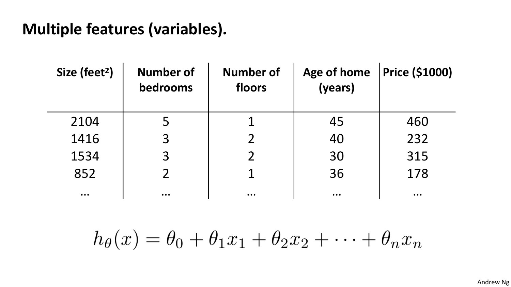
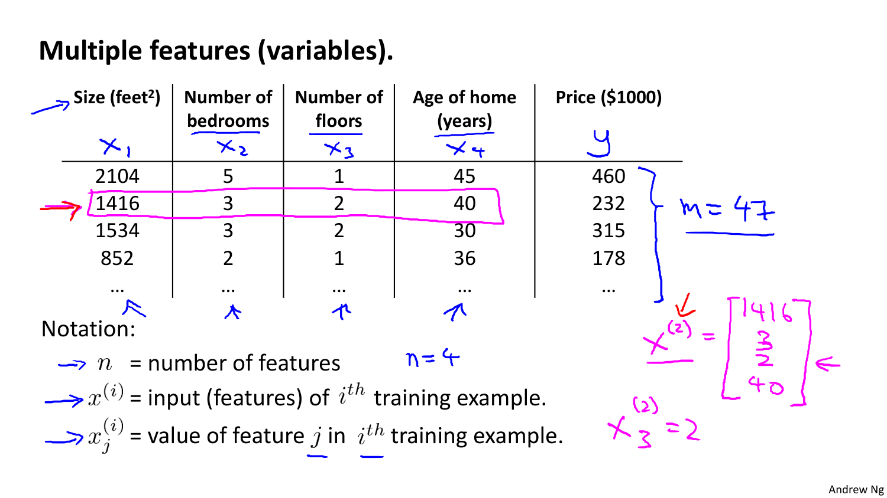

#### Real-Estate Example Dataset ($n = 4$ features, $m = 47$ instances):

| Size ($x_1$) [sq ft] | Bedrooms ($x_2$) | Floors ($x_3$) | Age ($x_4$) [years] | Price ($y$) [$1000] |
|---|---|---|---|---|
| 2104 | 5 | 1 | 45 | 460 |
| 1416 | 3 | 2 | 40 | 232 |
| 1534 | 3 | 2 | 30 | 315 |
| 852 | 2 | 1 | 36 | 178 |

For example instance $i = 2$:

$$
x^{(2)} = \begin{bmatrix} 1416 \\ 3 \\ 2 \\ 40 \end{bmatrix}, \quad x_3^{(2)} = 2, \quad y^{(2)} = 232
$$

---

## 2. Vectorized Hypothesis Formulation
[Source: Multivariate Linear Regression-Shared.pdf, Slide 6-7, 10-12]

### 2.1 Multi-Feature Hypothesis Equation
The non-vectorized hypothesis for $n$ features is:

$$
h_\theta(x) = \theta_0 + \theta_1 x_1 + \theta_2 x_2 + \dots + \theta_n x_n
$$

To express this compactly in vector notation, we define a dummy intercept feature:

$$
x_0 = 1 \quad \implies x_0^{(i)} = 1 \text{ for all } i
$$

Now, define feature vector $x \in \mathbb{R}^{n+1}$ and parameter vector $\theta \in \mathbb{R}^{n+1}$:

$$
x = \begin{bmatrix} x_0 \\ x_1 \\ x_2 \\ \vdots \\ x_n \end{bmatrix} \in \mathbb{R}^{n+1}, \quad \theta = \begin{bmatrix} \theta_0 \\ \theta_1 \\ \theta_2 \\ \vdots \\ \theta_n \end{bmatrix} \in \mathbb{R}^{n+1}
$$

### 2.2 Matrix-Vector Multiplication Form

$$
h_\theta(x) = \theta_0 x_0 + \theta_1 x_1 + \dots + \theta_n x_n = \begin{bmatrix} \theta_0 & \theta_1 & \dots & \theta_n \end{bmatrix} \begin{bmatrix} x_0 \\ x_1 \\ \vdots \\ x_n \end{bmatrix} = \theta^T x
$$

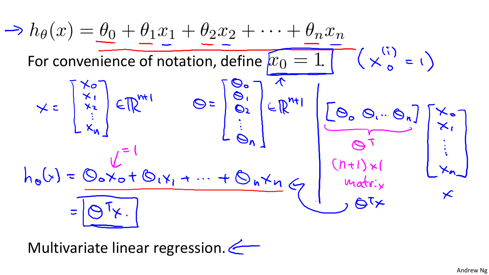

### 2.3 Multivariate Cost Function and Gradient Descent
The cost function for $n$ features remains Mean Squared Error:

$$
J(\theta) = J(\theta_0, \theta_1, \dots, \theta_n) = \frac{1}{2m} \sum_{i=1}^{m} (h_\theta(x^{(i)}) - y^{(i)})^2
$$

#### Gradient Descent Update Rule ($n \ge 1$):

$$
\text{Repeat until convergence \{} \quad \theta_j := \theta_j - \alpha \frac{1}{m} \sum_{i=1}^{m} (h_\theta(x^{(i)}) - y^{(i)}) x_j^{(i)} \quad \text{for } j = 0, 1, \dots, n \quad \}
$$

Notice that for $j = 0$, since $x_0^{(i)} = 1$, the update equation matches univariate linear regression identically!

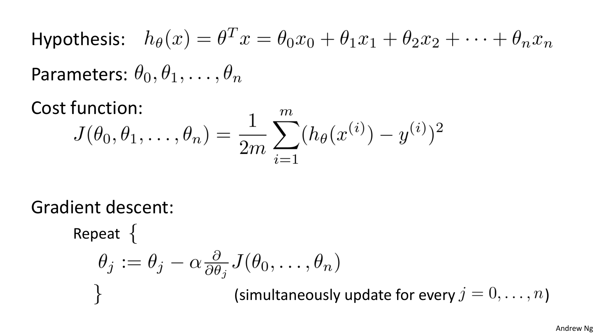
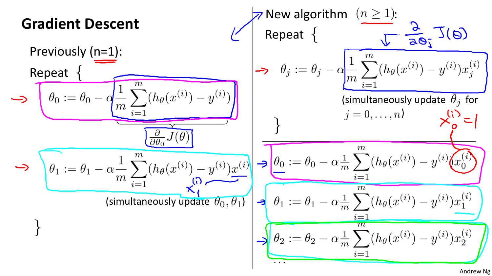

---

## 3. Feature Scaling & Normalization
[Source: Multivariate Linear Regression-Shared.pdf, Slide 13-16]

### 3.1 Why Feature Scaling is Necessary
When features have vastly different ranges (e.g., House Size $x_1 \in [300, 5000]$ sq ft vs Number of Bedrooms $x_2 \in [1, 5]$), cost function contours become narrow, highly skewed ellipses. Gradient descent oscillates inefficiently back and forth, requiring many iterations to converge.

By scaling features to approximately $-1 \le x_i \le 1$, cost function contours become circular, allowing gradient descent to take direct paths toward global minimum.

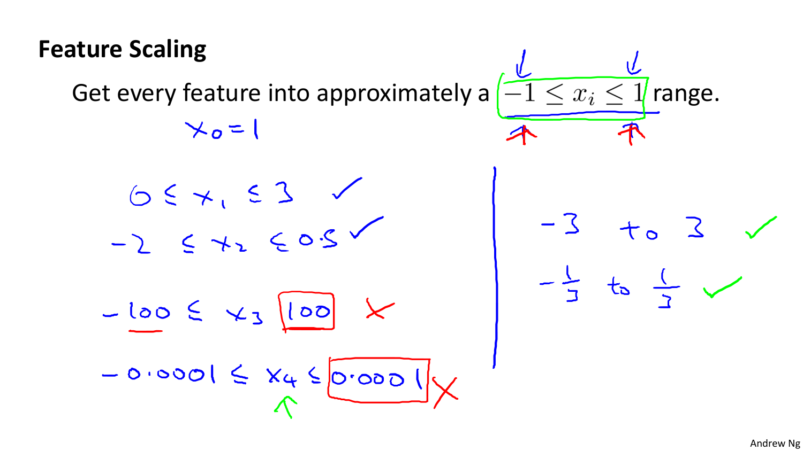

### 3.2 Min-Max Normalization
Maps feature values into a bounded range $[new\_min_A, new\_max_A]$ (typically $[0, 1]$):

$$
v' = \frac{v - \min_A}{\max_A - \min_A} (new\_max_A - new\_min_A) + new\_min_A
$$

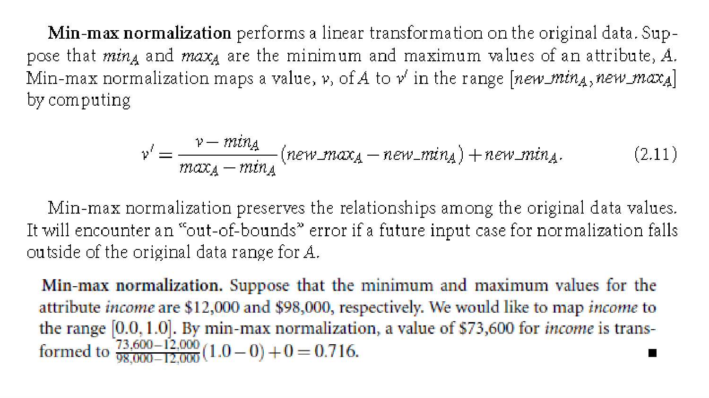

#### Worked Example:
Given attribute *income* with range $[\$12,000, \$98,000]$, scale $v = \$73,600$ into $[0.0, 1.0]$:

$$
v' = \frac{73,600 - 12,000}{98,000 - 12,000} (1.0 - 0) + 0 = \frac{61,600}{86,000} = 0.716
$$

### 3.3 Z-Score Normalization (Standardization)
Centers features to zero mean ($\bar{x} = 0$) and unit standard deviation ($\sigma = 1$):

$$
x_j' = \frac{x_j - \mu_j}{\sigma_j}
$$

Where:
- $\mu_j = \frac{1}{m} \sum_{i=1}^m x_j^{(i)}$ (mean of feature $j$).
- $\sigma_j = \sqrt{\frac{1}{m} \sum_{i=1}^m (x_j^{(i)} - \mu_j)^2}$ (standard deviation of feature $j$).

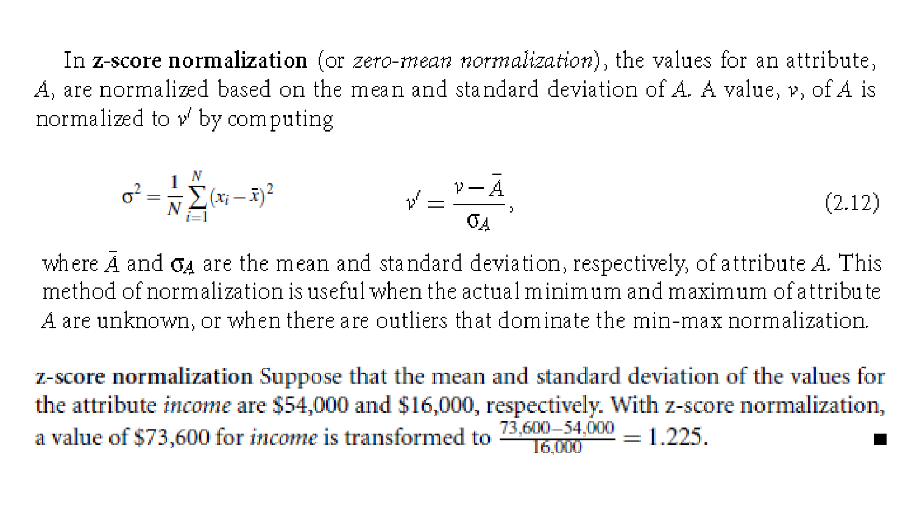

#### Worked Example:
Given attribute *income* with mean $\mu = \$54,000$ and standard deviation $\sigma = \$16,000$, normalize $v = \$73,600$:

$$
v' = \frac{73,600 - 54,000}{16,000} = \frac{19,600}{16,000} = 1.225
$$

---

## 4. Learning Rate Selection and Convergence Debugging
[Source: Multivariate Linear Regression-Shared.pdf, Slide 17-21]

### 4.1 Debugging Plot ($J(\theta)$ vs Iterations)
Plot cost $J(\theta)$ against iteration count to verify gradient descent behavior:
- **Normal behavior**: $J(\theta)$ decreases monotonically after every single iteration and flattens out upon reaching convergence.
- **Incorrect behavior**: If $J(\theta)$ increases or oscillates up and down, learning rate $\alpha$ is too large; reduce $\alpha$.

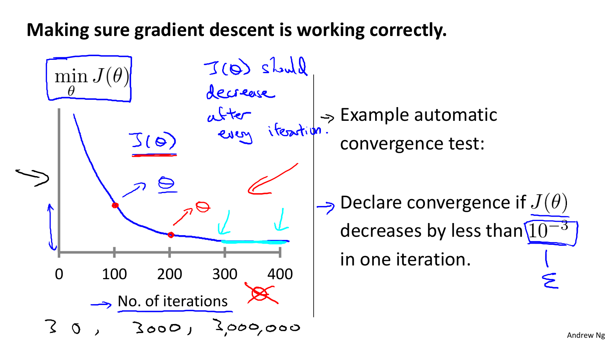
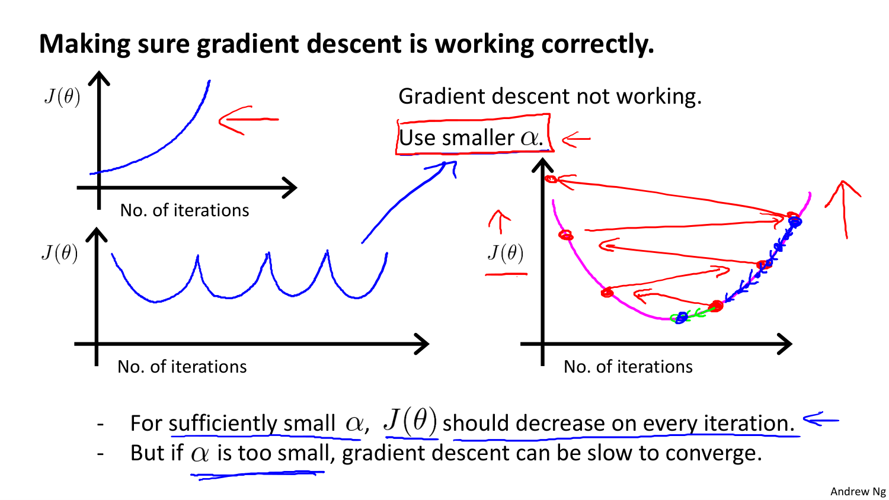

### 4.2 Automatic Convergence Test
Declare convergence if cost $J(\theta)$ decreases by less than threshold $\epsilon$ (e.g., $\epsilon = 10^{-3}$) in one iteration.

### 4.3 Practical Rule for Choosing $\alpha$
Try a sequence of $\alpha$ values scaled by factors of approximately $3$:

$$
\dots, 0.001, 0.003, 0.01, 0.03, 0.1, 0.3, 1.0, \dots
$$

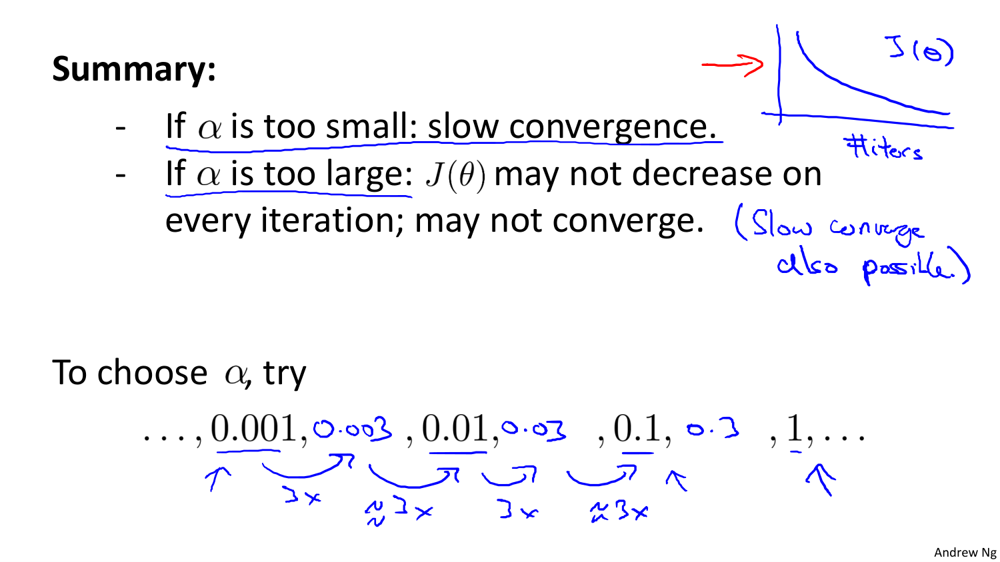

---

## 5. Polynomial Regression & Feature Engineering
[Source: Multivariate Linear Regression-Shared.pdf, Slide 23-25]

Linear regression can model complex non-linear relationships by creating polynomial features.

### 5.1 Polynomial Feature Mapping
Suppose dataset plot indicates a non-linear relationship between house Size ($x$) and Price ($y$):

$$
h_\theta(x) = \theta_0 + \theta_1 (\text{size}) + \theta_2 (\text{size})^2 + \theta_3 (\text{size})^3
$$

We map this into multivariate linear regression by defining new variables:
- $x_1 = \text{size}$
- $x_2 = (\text{size})^2$
- $x_3 = (\text{size})^3$

Thus, $h_\theta(x) = \theta_0 + \theta_1 x_1 + \theta_2 x_2 + \theta_3 x_3$.

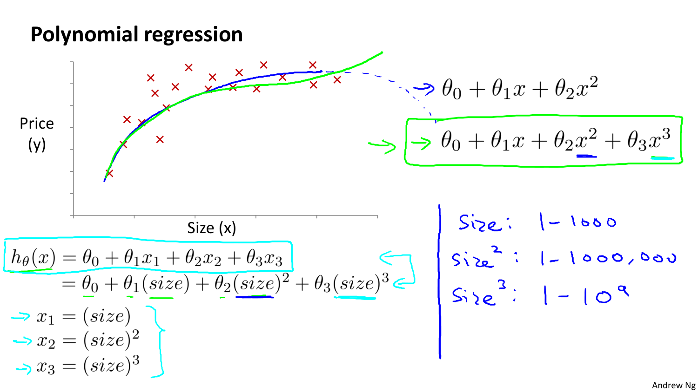

### 5.2 Choice of Non-Linear Features
Polynomials like cubic curves may decrease at large values. Alternative mappings like square-root functions can be used:

$$
h_\theta(x) = \theta_0 + \theta_1 (\text{size}) + \theta_2 \sqrt{\text{size}}
$$

#### ⚠️ Warning on Feature Scaling:
When using polynomial features, feature scaling becomes indispensable. For instance, if $\text{size} \in [1, 1000]$, then $\text{size}^2 \in [1, 10^6]$ and $\text{size}^3 \in [1, 10^9]$!

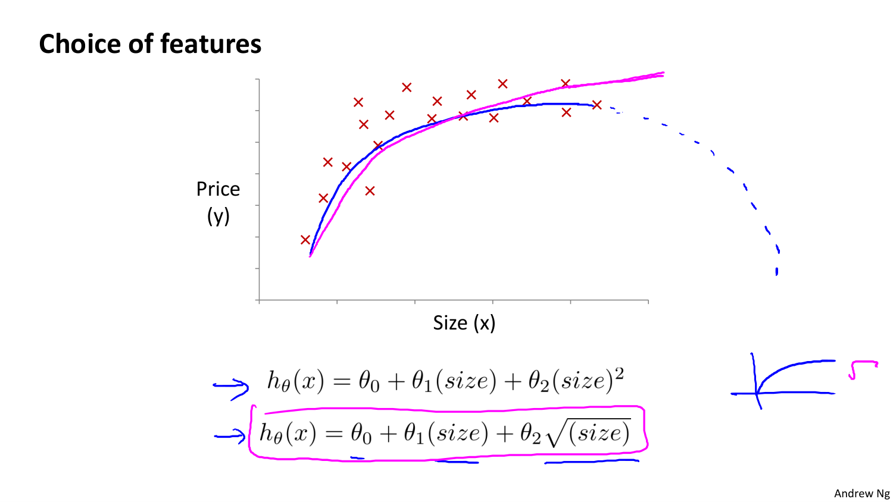

---

## 6. Analytical Solution: The Normal Equation
[Source: Multivariate Linear Regression-Shared.pdf, Slide 27-32]

Instead of iterative gradient descent, the optimal parameters $\theta^*$ can be computed analytically in closed-form using the **Normal Equation**.

### 6.1 Matrix Formulation
Construct Design Matrix $X \in \mathbb{R}^{m \times (n+1)}$ and Target Vector $y \in \mathbb{R}^m$:

$$
X = \begin{bmatrix} 1 & x_1^{(1)} & x_2^{(1)} & \dots & x_n^{(1)} \\ 1 & x_1^{(2)} & x_2^{(2)} & \dots & x_n^{(2)} \\ \vdots & \vdots & \vdots & \ddots & \vdots \\ 1 & x_1^{(m)} & x_2^{(m)} & \dots & x_n^{(m)} \end{bmatrix}, \quad y = \begin{bmatrix} y^{(1)} \\ y^{(2)} \\ \vdots \\ y^{(m)} \end{bmatrix}
$$

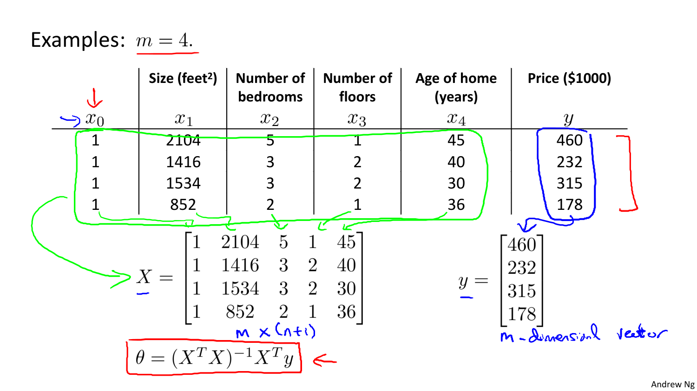

### 6.2 Closed-Form Derivation
The vector cost function is:

$$
J(\theta) = \frac{1}{2m} (X\theta - y)^T (X\theta - y) = \frac{1}{2m} (\theta^T X^T X \theta - 2 \theta^T X^T y + y^T y)
$$

To minimize $J(\theta)$, set matrix partial derivative to zero vector $\mathbf{0}$:

$$
\nabla_\theta J(\theta) = \frac{1}{m} (X^T X \theta - X^T y) = \mathbf{0}
$$

$$
X^T X \theta = X^T y
$$

Multiplying both sides by matrix inverse $(X^T X)^{-1}$:

$$
\theta = (X^T X)^{-1} X^T y
$$

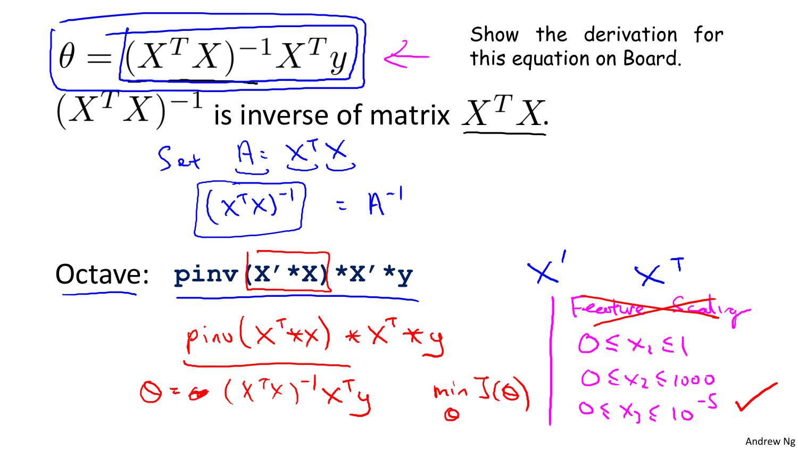

### 6.3 Octave / MATLAB Implementation
```octave
theta = pinv(X' * X) * X' * y
```

### 6.4 Gradient Descent vs. Normal Equation

| Metric / Property | Gradient Descent | Normal Equation |
|---|---|---|
| Hyperparameter Tuning | Must choose learning rate $\alpha$ | No learning rate $\alpha$ required |
| Computation Paradigm | Iterative (requires many steps) | Closed-form direct matrix inverse |
| Time Complexity | $O(k \cdot n^2)$ for $k$ iterations | $O(n^3)$ due to inverse of $(n+1) \times (n+1)$ matrix |
| Large Datasets ($n \ge 10^6$) | Scalable, works very well | Extremely slow ($n > 10,000$ computationally infeasible) |
| Feature Scaling | Mandatory for fast convergence | Not required |

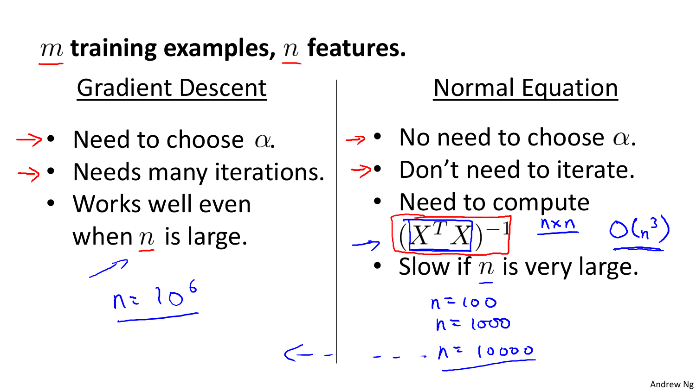

---

## 7. Non-Invertibility of $(X^T X)$
[Source: Multivariate Linear Regression-Shared.pdf, Slide 33-35]

What happens if $(X^T X)$ is singular (non-invertible / degenerate)?

### 7.1 Root Causes of Non-Invertibility
1. **Redundant Features**: Linearly dependent features (e.g., $x_1 =$ size in $\text{ft}^2$ and $x_2 =$ size in $\text{m}^2$, where $x_1 = 3.28^2 x_2$).
2. **Too Many Features ($m \le n$)**: Number of training examples $m$ is less than or equal to number of features $n$.

### 7.2 Remedies
- Delete redundant features manually or via feature selection.
- Use pseudo-inverse algorithm `pinv()` in software, which computes a pseudoinverse even for singular matrices.
- Apply **Regularization** (adds $\lambda I$ to $X^T X$, guaranteeing invertibility).

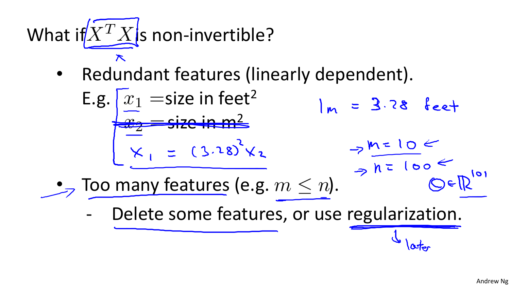

---

## 8. Simple Closed-Form Least Squares Derivation
[Source: Multivariate Linear Regression-Shared.pdf, Slide 36-37]

For single variable linear regression $y = w_0 + w_1 x$, the closed-form analytical equations are:

$$
w_1 = \frac{\sum_{i=1}^d (x_i - \bar{x})(y_i - \bar{y})}{\sum_{i=1}^d (x_i - \bar{x})^2}
$$

$$
w_0 = \bar{y} - w_1 \bar{x}
$$

Where $\bar{x} = \frac{1}{d} \sum x_i$ and $\bar{y} = \frac{1}{d} \sum y_i$.

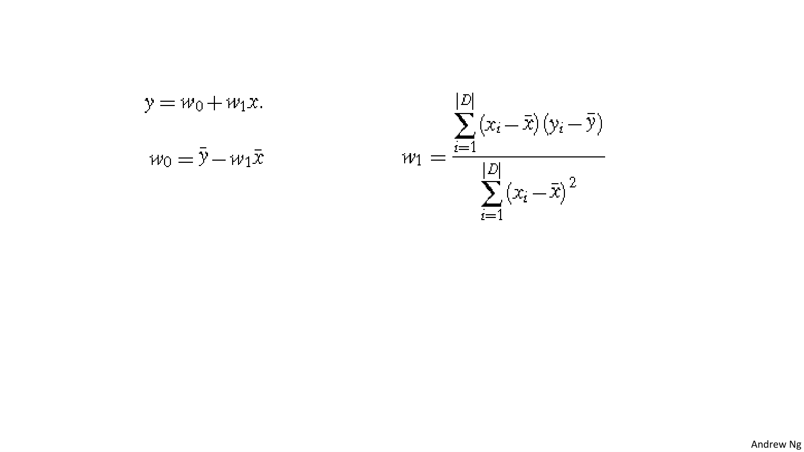

#### Hand-Worked Salary Numerical Example:
Dataset ($d = 10$):
- Experience $x = [3, 8, 9, 13, 3, 6, 11, 21, 1, 16]$
- Salary $y = [30, 57, 64, 72, 36, 43, 59, 90, 20, 83]$

Calculated Means: $\bar{x} = 9.1$, $\bar{y} = 55.4$.

Substituting into least squares formulas:

$$
w_1 = \frac{(3-9.1)(30-55.4) + \dots + (16-9.1)(83-55.4)}{(3-9.1)^2 + \dots + (16-9.1)^2} = 3.5
$$

$$
w_0 = 55.4 - (3.5)(9.1) = 23.6
$$

Fitted Model: $\hat{y} = 23.6 + 3.5 x$.
Predicting salary for $10$ years experience: $\hat{y} = 23.6 + 3.5(10) = 58.6 \implies \$58,600$.

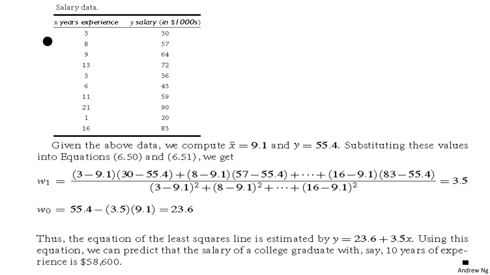

---

## 9. Error Metrics & Predictor Evaluation
[Source: Multivariate Linear Regression-Shared.pdf, Slide 38-39]

### 9.1 Summary of Error Measures

| Metric | Formula | Description |
|---|---|---|
| Absolute Error | $|y_i - y_i'|$ | Absolute deviation per instance |
| Squared Error | $(y_i - y_i')^2$ | Squared deviation per instance |
| Mean Absolute Error (MAE) | $\frac{1}{d} \sum_{i=1}^d |y_i - y_i'|$ | Average linear magnitude of errors |
| Mean Absolute Percentage Error (MAPE) | $\frac{1}{d} \sum_{i=1}^d \left|\frac{y_i - y_i'}{y_i}\right|$ | Percentage error relative to actual target |
| Root Mean Square Error (RMSE) | $\sqrt{\frac{\sum_{i=1}^d (y_i - y_i')^2}{d}}$ | Square root of mean squared error |
| Normalized RMSE (NRMSE) | $\frac{\text{RMSE}}{y_{\max} - y_{\min}}$ | Scale-independent RMSE metric |

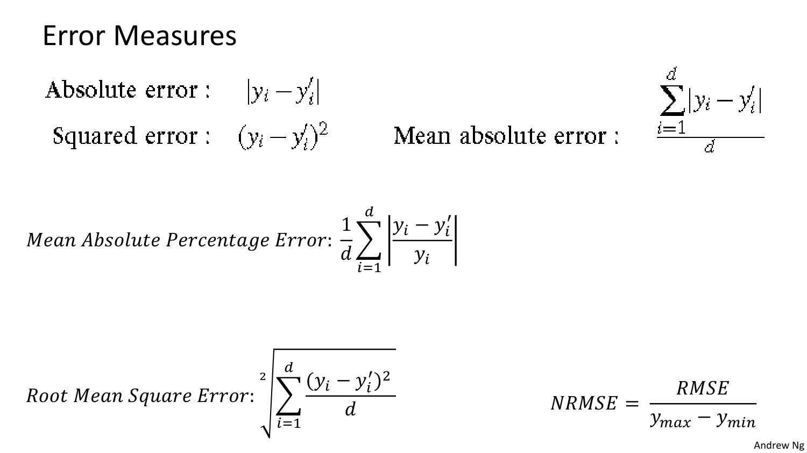

### 9.2 Data Evaluation Schemes
- **Holdout Validation**: Partition dataset into Training Set and Test Set.
- **$K$-Fold Cross Validation**: Divide training data into $K$ equal folds, repeatedly holding out 1 fold for evaluation.
- **Train / Validation / Test Splitting**:
  - Train Set: Fits parameters $\theta$.
  - Validation Set: Tunes hyperparameters ($\alpha$, polynomial degree, regularization $\lambda$).
  - Test Set: Final unbiased generalization score.

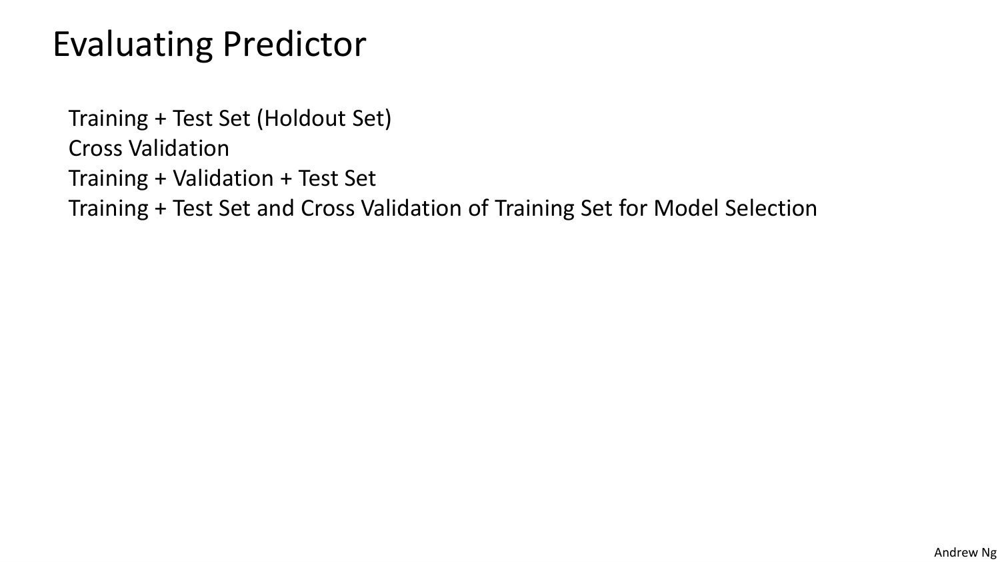

---

## 10. Mermaid Process Flow

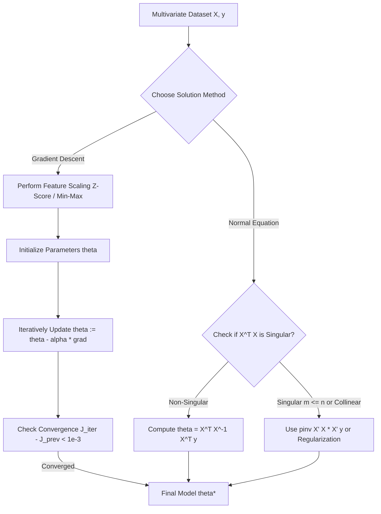
```mermaid
flowchart TD
    A[Multivariate Dataset X, y] --> B{Choose Solution Method}
    B -- Gradient Descent --> C[Perform Feature Scaling Z-Score / Min-Max]
    C --> D[Initialize Parameters theta]
    D --> E[Iteratively Update theta := theta - alpha * grad]
    E --> F[Check Convergence J_iter - J_prev < 1e-3]
    F -- Converged --> G[Final Model theta*]
    B -- Normal Equation --> H{Check if X^T X is Singular?}
    H -- Non-Singular --> I[Compute theta = X^T X^-1 X^T y]
    H -- Singular m <= n or Collinear --> J[Use pinv X' X * X' y or Regularization]
    I --> G
    J --> G
```

---

## 11. Formula Sheet

| Metric / Method | Formula |
|---|---|
| Vectorized Hypothesis | $h_\theta(x) = \theta^T x = \sum_{j=0}^n \theta_j x_j \quad (x_0 = 1)$ |
| Z-Score Normalization | $x_j' = \frac{x_j - \mu_j}{\sigma_j}$ |
| Min-Max Normalization | $v' = \frac{v - \min}{\max - \min} (\text{new\_max} - \text{new\_min}) + \text{new\_min}$ |
| Normal Equation | $\theta = (X^T X)^{-1} X^T y$ |
| MAE | $\text{MAE} = \frac{1}{d} \sum_{i=1}^d |y_i - \hat{y}_i|$ |
| RMSE | $\text{RMSE} = \sqrt{\frac{1}{d} \sum_{i=1}^d (y_i - \hat{y}_i)^2}$ |
| NRMSE | $\text{NRMSE} = \frac{\text{RMSE}}{y_{\max} - y_{\min}}$ |

---

## 12. Exam-Oriented Review

### 12.1 Potential Exam Questions

1. **Why does feature scaling affect Gradient Descent performance, but leaves Normal Equation results completely unchanged?**
   - *Solution*: Gradient descent steps depend directly on feature magnitude gradients. Unscaled features create unbalanced cost surface contours, slowing gradient steps. The Normal Equation computes analytical global minimum directly via matrix projection $\theta = (X^T X)^{-1} X^T y$, which is invariant to feature scale linear transformations.

2. **Given $m = 100$ samples and $n = 200$ features, can standard matrix inversion $(X^T X)^{-1}$ be computed directly? Explain.**
   - *Solution*: No. When $m < n$, matrix $X \in \mathbb{R}^{m \times (n+1)}$ has rank at most $m$. The matrix product $(X^T X) \in \mathbb{R}^{(n+1) \times (n+1)}$ has rank at most $m < n+1$, making it singular and non-invertible.

### 12.2 Numerical Problem & Step-by-Step Solution

**Problem**:
Consider a dataset with $m = 2$ examples and $n = 2$ features (plus dummy $x_0 = 1$):
- Example 1: $x^{(1)} = [1, 1, 2]^T, y^{(1)} = 6$
- Example 2: $x^{(2)} = [1, 2, 1]^T, y^{(2)} = 5$

Compute optimal parameters $\theta = [\theta_0, \theta_1, \theta_2]^T$ using pseudo-inverse formulation $X^T X \theta = X^T y$.

**Step-by-Step Solution**:

**Step 1: Construct Design Matrix $X$ and Target Vector $y$**:

$$
X = \begin{bmatrix} 1 & 1 & 2 \\ 1 & 2 & 1 \end{bmatrix}, \quad y = \begin{bmatrix} 6 \\ 5 \end{bmatrix}
$$

**Step 2: Compute $X^T X$**:

$$
X^T = \begin{bmatrix} 1 & 1 \\ 1 & 2 \\ 2 & 1 \end{bmatrix}
$$

$$
X^T X = \begin{bmatrix} 1 & 1 \\ 1 & 2 \\ 2 & 1 \end{bmatrix} \begin{bmatrix} 1 & 1 & 2 \\ 1 & 2 & 1 \end{bmatrix} = \begin{bmatrix} 2 & 3 & 3 \\ 3 & 5 & 4 \\ 3 & 4 & 5 \end{bmatrix}
$$

**Step 3: Compute $X^T y$**:

$$
X^T y = \begin{bmatrix} 1 & 1 \\ 1 & 2 \\ 2 & 1 \end{bmatrix} \begin{bmatrix} 6 \\ 5 \end{bmatrix} = \begin{bmatrix} 6 + 5 \\ 6 + 10 \\ 12 + 5 \end{bmatrix} = \begin{bmatrix} 11 \\ 16 \\ 17 \end{bmatrix}
$$

**Step 4: Solve linear system $X^T X \theta = X^T y$**:
Setting $\theta_0 = 1, \theta_1 = 1, \theta_2 = 2$:
- Row 1: $2(1) + 3(1) + 3(2) = 2 + 3 + 6 = 11$ ✓
- Row 2: $3(1) + 5(1) + 4(2) = 3 + 5 + 8 = 16$ ✓
- Row 3: $3(1) + 4(1) + 5(2) = 3 + 4 + 10 = 17$ ✓

**Final Answer**:

$$
\theta^* = \begin{bmatrix} 1 \\ 1 \\ 2 \end{bmatrix} \implies h_\theta(x) = 1 + x_1 + 2 x_2
$$
