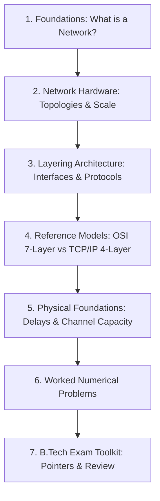
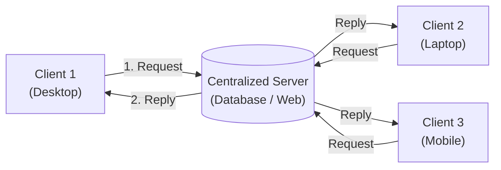
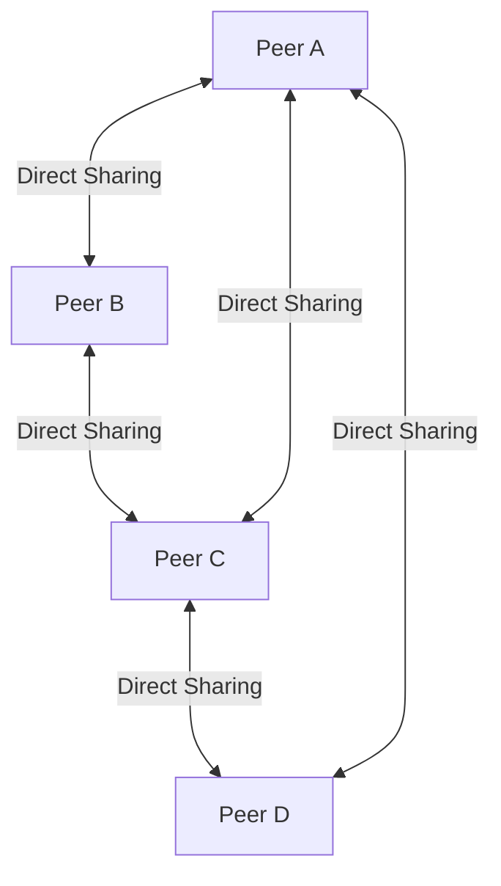
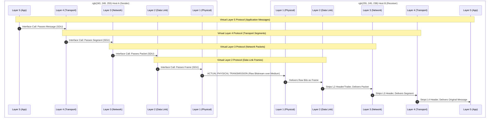
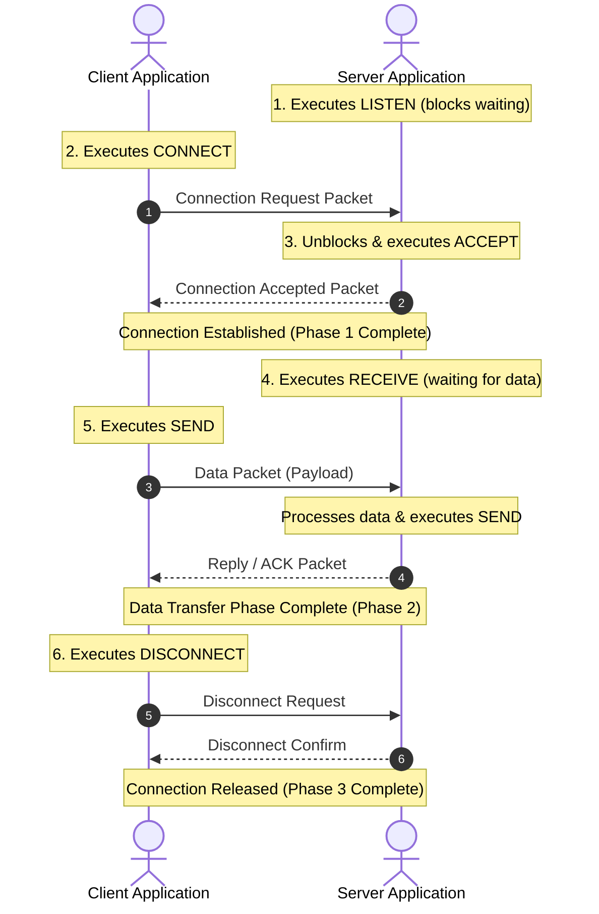
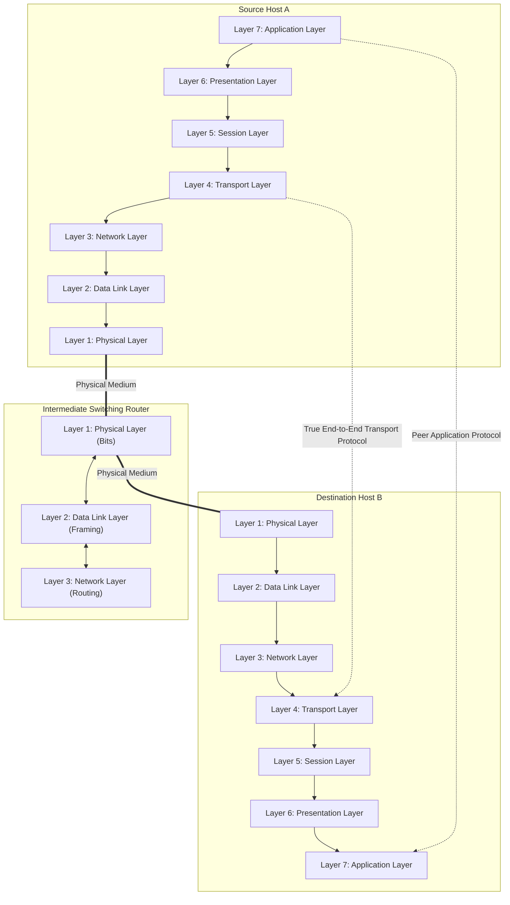
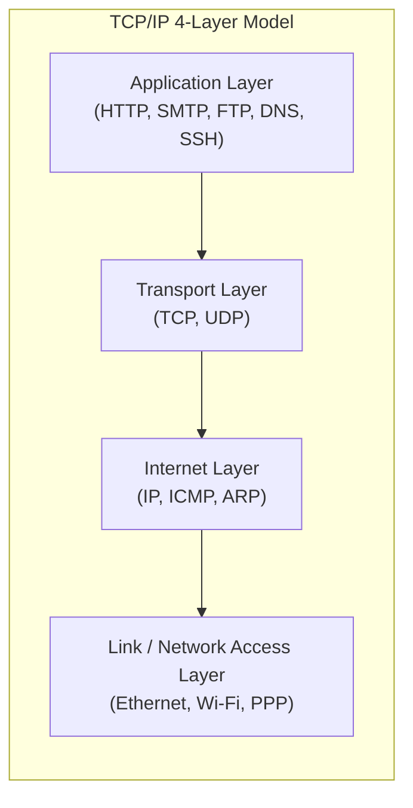
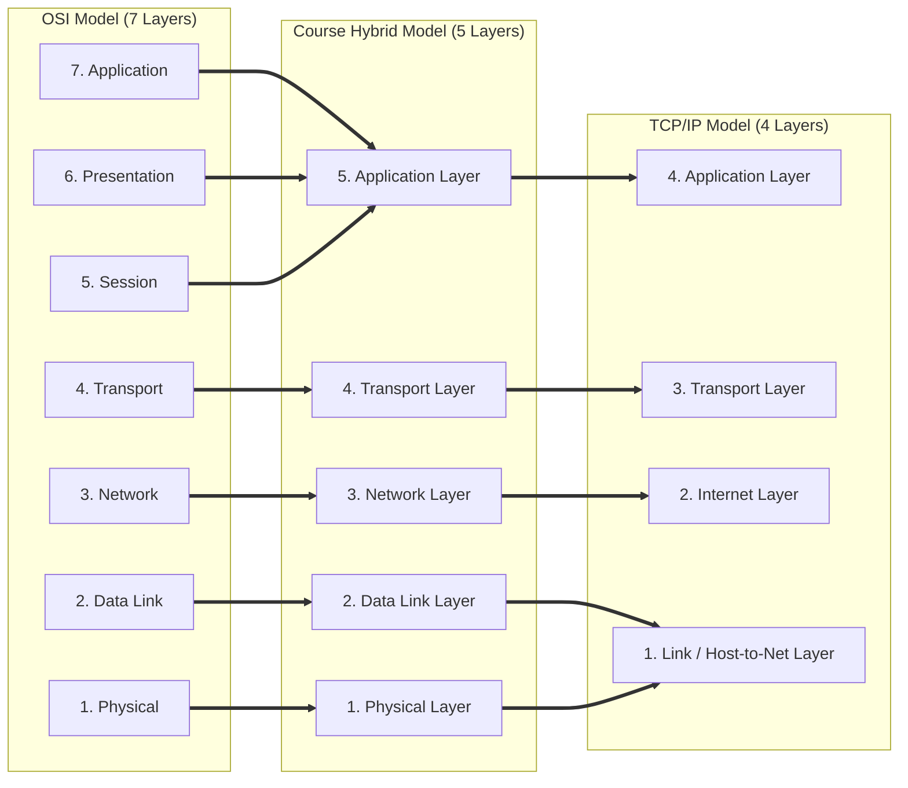
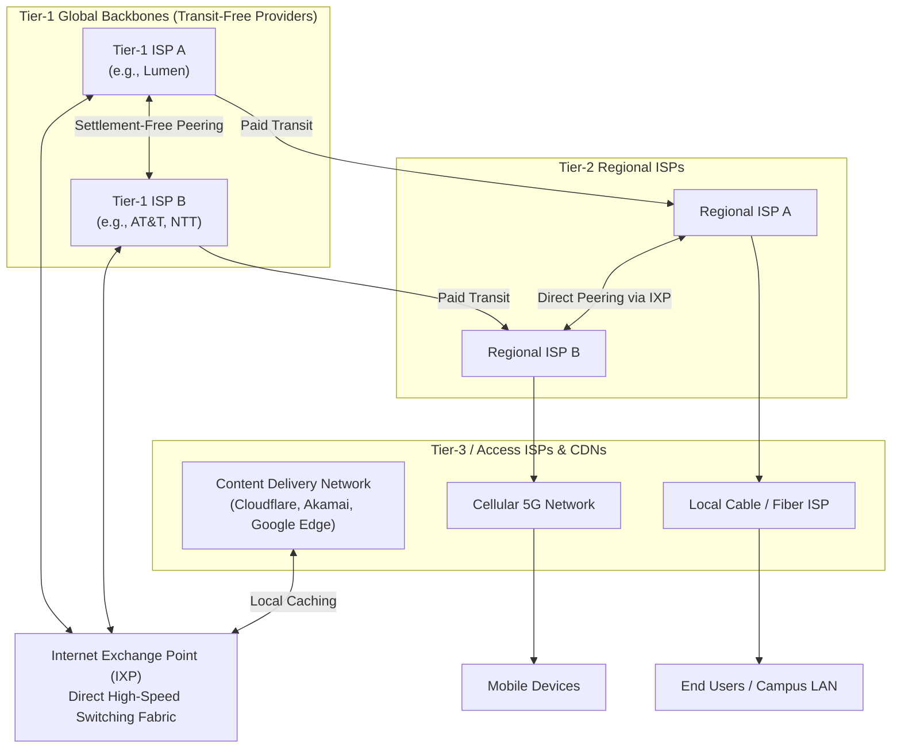

# Complete Computer Networks Notes: Introduction to Computer Networks

> **Course Code:** Computer Networks (CompNet)  
> **Course Title:** Computer Networks & Data Communications  
> **Target Audience:** Undergraduate B.Tech / BE Computer Science & Information Technology  
> **Textbook Alignment:** Tanenbaum (Computer Networks, 5th/6th Ed.), Kurose & Ross (Computer Networking: A Top-Down Approach), Forouzan (Data Communications and Networking)  
> **Core Focus:** Conceptual Clarity, Exam-Ready Architectures, Step-by-Step Numericals, and Verified Diagrams  

---

## Pedagogical Roadmap & Chapter Navigation



---

# Chapter 1 — Introduction to Computer Networks

---

## 1. Overview & Foundational Concepts

### 1.1 What is a Computer Network?

A **computer network** is an interconnected collection of **autonomous** computers and peripherals capable of exchanging digital information and sharing hardware and software resources.

* **Autonomous:** Each computing system possesses its own local memory, processing unit, and operating system. No single machine can forcibly start, pause, or terminate another machine without authorization. (A mainframe with dumb terminals is **not** a computer network; it is a centralized timesharing system).
* **Interconnected:** Two devices are interconnected if they can exchange data across a transmission medium (copper cable, optical fiber, radio frequency spectrum, or infrared).

```
   [ Host A ] <--- Communication Link ---> [ Host B ]
       |                                       |
    Local OS                                Local OS
  & Local CPU                             & Local CPU
```

---

### 1.2 Computer Networks vs. Distributed Systems

This is a classic **B.Tech University Exam Question (3 to 5 Marks)**.

| Distinguishing Criterion | Computer Network | Distributed System |
| :--- | :--- | :--- |
| **User Visibility & Transparency** | **Explicit / Visible:** Users are fully aware that multiple distinct physical machines exist. Users must explicitly log in to remote machines, specify destination IP addresses, or use explicit transfer commands. | **Transparent / Hidden:** The existence of multiple physical machines is completely hidden from the user. The system appears as a single unified, coherent virtual machine. |
| **Control Software / Middleware** | Each machine runs its own independent local operating system (e.g., Linux, Windows). No unified global OS exists. | A specialized software layer called **middleware** runs on top of heterogeneous OSs to present a **Single-System Image (SSI)**. |
| **Resource Allocation** | Handled locally by each autonomous machine or initiated manually by users. | Handled automatically and dynamically by the distributed OS / middleware (e.g., automated task migration, dynamic load balancing). |
| **Failure Handling** | If a remote node crashes, the user sees connection timeout errors and must manually reconnect. | If a node crashes, the system transparently migrates running processes to healthy nodes without user intervention. |
| **Typical Examples** | The Internet, a university campus LAN, enterprise intranet. | Google Search cluster, Hadoop/Spark distributed cluster, Amazon AWS DynamoDB. |

> **Analogy to Remember:**  
> A **computer network** is like a collection of international offices connected by phones: each office speaks its own language, manages its own staff, and you must dial a specific country code to reach them.  
> A **distributed system** is like a multinational bank: you swipe your card at any ATM worldwide, and it seamlessly accesses your balance without you knowing which physical server processed the transaction.

---

### 1.3 Architecture Models: Client-Server vs. Peer-to-Peer (P2P)

Networks organize application workloads into two fundamental architectural patterns:

#### 1. Client-Server Architecture
A centralized paradigm where workloads are partitioned between service providers (**servers**) and service requesters (**clients**).



* **Client:** An end-user system that initiates requests for data or compute services, waits for server responses, and renders the output to the user.
* **Server:** A high-availability, powerful machine that listens continuously on a well-known port, processes concurrent requests from many clients, and enforces security and database integrity.
* **Pros:** Centralized backup, robust access control, simplified data synchronization.
* **Cons:** The server is a **Single Point of Failure (SPOF)**; server can become a performance bottleneck under heavy traffic.

#### 2. Peer-to-Peer (P2P) Architecture
A decentralized paradigm where every node (**peer**) possesses equal privileges and can function simultaneously as both a client and a server (**servent**).



* **Mechanism:** Peers share their own resources (CPU cycles, disk storage, bandwidth) directly with other peers without central coordination.
* **Pros:** Highly scalable (as demand increases, serving capacity also increases), resilient against single-node failures.
* **Cons:** Difficult to enforce security, distributed indexing overhead, complex content tracking. Examples: BitTorrent, Bitcoin network.

---

## 2. Network Hardware, Scale & Topologies

Networks are categorized by their **transmission technology** (Broadcast vs. Point-to-Point) and their **physical topology**.

### 2.1 Transmission Technologies

1. **Broadcast Networks (Multi-access / Shared Medium):**
   * A single physical channel is shared by all attached stations.
   * Every transmitted packet contains a **destination address**. All stations receive the packet; each station inspects the destination address and processes the packet only if it matches its own address or a broadcast/multicast address.
   * Analogy: Speaking into a megaphone in a crowded hall.
   * Examples: Classic 10Base5 coaxial Ethernet, Wi-Fi (IEEE 802.11), satellite downlinks.

2. **Point-to-Point Networks (Store-and-Forward / Switched):**
   * Dedicated physical links connect individual pairs of nodes.
   * A packet from source to destination must travel through multiple intermediate switching elements (**routers**).
   * Each router receives a packet completely, stores it in an internal buffer, verifies its checksum, and forwards it to the next appropriate link based on routing tables (**Store-and-Forward Packet Switching**).
   * Analogy: Sending a sealed letter through post offices.
   * Examples: The global Internet backbone, leased fiber lines.

---

### 2.2 Physical Topologies: Analysis & Exam Formulas

A **topology** defines the geometric arrangement of links and nodes.

```
1. STAR TOPOLOGY            2. BUS TOPOLOGY             3. RING TOPOLOGY
      [Host A]                   [A]   [B]   [C]              [A] ---> [B]
         |                        |     |     |                ^        |
[Host B]-[Hub/Switch]-[Host C]   === Backbone Cable ===        |        v
         |                        |     |     |               [D] <--- [C]
      [Host D]                   [D]   [E]   [F]

4. FULL MESH TOPOLOGY       5. TREE (HIERARCHICAL)      6. HYBRID (STAR-BUS)
      [A]-------[B]                 [Root Switch]            [Switch 1]---[Switch 2]
      / \       / \                 /           \              /   \        /   \
     /   \     /   \           [Dist Switch]  [Dist Switch]  [A]   [B]    [C]   [D]
   [C]-----\-/-----[D]            /     \        /     \
    \       X       /           [H1]   [H2]    [H3]   [H4]
     \     / \     /
      \   /   \   /
       [E]-----[F]
```

#### Topological Comparison & Mathematical Formulas (B.Tech Must-Know)

| Topology | Number of Physical Links ($N$ nodes) | I/O Ports per Node | Best Case Hops | Worst Case Hops | Single Failure Impact | Primary Advantages & Disadvantages |
| :--- | :---: | :---: | :---: | :---: | :--- | :--- |
| **Star** | $N$ | $1$ | $2$ | $2$ | If cable breaks, only that node fails. **If central switch fails, entire network goes down.** | **Pros:** Easy installation, simple troubleshooting. **Cons:** Central switch is single point of failure; high cabling cost. |
| **Bus** | $1$ main backbone + $N$ drop lines | $1$ | $1$ | $1$ | Break in backbone cable stops all communication due to signal reflection. | **Pros:** Minimum cable length, cheap. **Cons:** Difficult fault isolation; backbone break halts network; high collision rate. |
| **Ring** | $N$ | $2$ (Input + Output) | $1$ | $N-1$ (Unidirectional)<br>$\lfloor N/2 \rfloor$ (Bidirectional) | A break in the ring breaks the loop and halts the entire network (unless dual ring is used). | **Pros:** Deterministic token access, no packet collisions. **Cons:** Node delay accumulates; difficult reconfiguration. |
| **Full Mesh** | $\mathbf{\dfrac{N(N-1)}{2}}$ | $\mathbf{N-1}$ | $1$ | $1$ | Extremely robust: failure of any link affects only traffic between that specific pair. | **Pros:** Dedicated capacity, 100% redundancy, no traffic congestion. **Cons:** Prohibitively expensive ($O(N^2)$ links and ports); impracticable for large $N$. |
| **Tree** | $N - 1$ | $1$ (for leaves) | $2$ | $2 \times \text{depth}$ | Failure of an intermediate switch isolates its entire subordinate subtree. | **Pros:** Scalable hierarchical expansion. **Cons:** High dependency on root and distribution switches. |

> **Key Derivation: Full-Mesh Link Formula**  
> In a network of $N$ nodes, each node must connect to the remaining $(N-1)$ nodes.  
> Total directed link connections $= N(N-1)$.  
> Since each physical bidirectional (full-duplex) link supports communication in both directions, we divide by 2:  
> $$\mathbf{\text{Total Bidirectional Links} = \frac{N(N-1)}{2}}$$  
> *Example:* For $N = 20$ nodes: Links $= \frac{20 \times 19}{2} = 190$ links; each node requires $19$ ports!

---

### 2.3 Geographic Scale of Networks

| Classification | Geographical Coverage | Typical Media & Data Rates | Representative Technologies | Typical Ownership |
| :--- | :--- | :--- | :--- | :--- |
| **PAN** (Personal Area Network) | $\approx 1\text{ m to } 10\text{ m}$ (within a room / person's body) | $1\text{ to } 24\text{ Mbps}$, short-range wireless | Bluetooth (IEEE 802.15.1), ZigBee (802.15.4), UWB, RFID | Private individual |
| **LAN** (Local Area Network) | $10\text{ m to } 1\text{ km}$ (single room, office building, university campus) | $100\text{ Mbps to } 10\text{ Gbps}$, high-speed twisted pair & fiber | Fast/Gigabit Ethernet (IEEE 802.3), Wi-Fi (IEEE 802.11a/b/g/n/ac/ax) | Private organization / university |
| **MAN** (Metropolitan Area Network) | Up to $10\text{ km to } 50\text{ km}$ (entire city or municipality) | $100\text{ Mbps to } 10\text{ Gbps}$, optical rings | Metro Ethernet, Cable TV networks (DOCSIS), WiMAX (802.16) | Consortia or municipal telecom |
| **WAN** (Wide Area Network) | $100\text{ km to } 10,000\text{ km}$ (state, country, continent, globe) | $10\text{ Gbps to } 400\text{ Gbps}$, undersea cables & satellite | Leased lines (T1, T3, OC-192), MPLS, IP Backbone over DWDM fiber | Telecom carriers / Tier-1 ISPs |
| **The Internet** | Global (entire planet + low-earth orbit satellites) | Heterogeneous | TCP/IP suite interconnecting millions of autonomous networks | Globally distributed (no single owner) |

---

## 3. Network Software: The Layering Architecture

### 3.1 Why Layering? (The Separation of Concerns)

Modern computer networks are extraordinarily complex, involving radio transceivers, copper wires, fiber optics, switching hardware, routing algorithms, encryption, error recovery, and web browsers. To tame this complexity, networks are designed as a **hierarchy of layers**:

1. **Modularity & Abstraction:** Each layer solves one specific problem and hides its internal implementation details from layers above and below.
2. **Interface Independence:** As long as the interface between two adjacent layers remains constant, the underlying protocol implementation of a layer can be completely replaced (e.g., swapping copper Ethernet for Wi-Fi) without changing upper-layer applications (e.g., HTTP continues to run unchanged).
3. **Standardization:** Allows hardware and software from competing vendors to interoperate seamlessly.

---

### 3.2 Protocol Hierarchies: Virtual vs. Actual Communication

In a layered system, we must strictly distinguish between **virtual peer communication** and **actual physical communication**:

* **Peer Entities:** The software or hardware entities implementing the same layer on two different machines (e.g., Layer 4 on Host A and Layer 4 on Host B).
* **Virtual Communication:** Peer entities conceptually communicate directly with each other horizontally using the **Layer $n$ Protocol**.
* **Actual Communication:** No data is transferred directly horizontally between peers (except at Layer 1). Instead, data is passed vertically downward through **Layer Interfaces** on the sending machine, transmitted across the physical medium at Layer 1, and passed vertically upward on the receiving machine.



#### Tanenbaum's Philosopher-Translator-Secretary Analogy
* **Layer 3 (Philosophers):** Two philosophers—one in Beijing speaking Chinese and one in Berlin speaking German—want to exchange philosophical ideas. They communicate via a peer Layer 3 conceptual protocol ("I think, therefore I am").
* **Layer 2 (Translators):** Neither philosopher speaks the other's language. Each hires a translator. The Chinese translator converts Chinese into Dutch; the German translator converts Dutch into German. Dutch is the peer Layer 2 protocol.
* **Layer 1 (Secretaries):** Each translator gives the Dutch text to a secretary. The secretaries communicate via a physical telegram or postal service (Layer 1 medium).
* **Key Lesson:** The philosophers are oblivious to whether the message was sent via telegram, radio, or fax; the secretaries are oblivious to the philosophical meaning of the message. Each layer performs its specific translation independently.

---

### 3.3 Data Encapsulation and Decapsulation

When an application process generates data, it is passed down the protocol stack. At each layer, control information is attached to the payload:

```
Sender Side                                                  Receiver Side
===========                                                  =============
[ Application ]  M                                            M [ Application ]
       |                                                              ^
       v                                                              |
[  Transport  ]  [ H4 | M ]                         Segment   [ H4 | M ] [  Transport  ]
       |                                                              ^
       v                                                              |
[   Network   ]  [ H3 | H4 | M ]                    Packet    [ H3 | H4 | M ] [   Network   ]
       |                                                              ^
       v                                                              |
[  Data Link  ]  [ H2 | H3 | H4 | M | T2 ]          Frame     [ H2 | H3 | H4 | M | T2 ] [  Data Link  ]
       |                                                              ^
       v                                                              |
[  Physical   ]  0110100101100010111000101...       Bits      0110100101... [  Physical   ]
       |                                                              |
       +================== Physical Transmission Medium ==============+
```

#### Core Terminology:
1. **PDU (Protocol Data Unit):** The complete data unit exchanged between peer entities at a specific layer (Header + Payload + Trailer).
   * Layer 7/6/5 PDU = **Message / Data**
   * Layer 4 PDU = **Segment** (TCP) or **Datagram** (UDP)
   * Layer 3 PDU = **Packet** (IP)
   * Layer 2 PDU = **Frame** (Ethernet / Wi-Fi)
   * Layer 1 PDU = **Bit**
2. **SDU (Service Data Unit):** The payload passed down from the layer immediately above.
   $$\text{PDU}_n = \text{Header}_n + \text{SDU}_n + [\text{Trailer}_n]$$
   $$\text{SDU}_{n-1} = \text{PDU}_n$$
3. **Encapsulation:** The process where a lower layer wraps the upper layer's SDU with its own header (e.g., source/destination addresses, sequence numbers) and/or trailer (e.g., CRC checksum).
4. **Decapsulation:** The reverse process at the receiver: each layer validates its header, strips it, and forwards the clean SDU upward to the next higher entity.

---

### 3.4 Services vs. Protocols (The Fundamental Distinction)

This is one of the most frequently tested concepts in B.Tech examinations:

```
   Machine 1 (Host A)                             Machine 2 (Host B)
+----------------------+                       +----------------------+
| Layer n + 1 Entity   |                       | Layer n + 1 Entity   |
+----------------------+                       +----------------------+
           | Service Interface (SAPs)                      | Service Interface (SAPs)
           v                                               v
+----------------------+   Layer n Protocol    +----------------------+
|   Layer n Entity     | <===================> |   Layer n Entity     |
+----------------------+  (Rules, Formats,     +----------------------+
                          Peer Messages)
```

* **Service (Vertical):** A set of abstract operations/primitives that layer $n$ provides to layer $n+1$ through a **Service Access Point (SAP)**. It defines **WHAT** operations the layer can perform, but says nothing about how they are implemented. Services are local to a single computer.
* **Protocol (Horizontal):** A formal set of rules and syntax governing the format, meaning, and timing of frames, packets, or messages exchanged between **PEER entities** on different computers. The protocol defines **HOW** the service is implemented. A protocol can be completely modified or replaced without affecting the layer above, provided the service interface remains unchanged.

---

### 3.5 Connection-Oriented vs. Connectionless Services

Layers offer two fundamental paradigms of service:

| Parameter | Connection-Oriented Service | Connectionless Service |
| :--- | :--- | :--- |
| **Real-World Analogy** | **Telephone System:** You dial, wait for connection setup, speak back-and-forth in order, and hang up. | **Postal Mail System:** You drop stamped letters into a mailbox. Each letter travels independently; some may arrive out of order or get lost. |
| **Phases of Operation** | **Three explicit phases:**<br>1. Connection Establishment<br>2. Data Transfer<br>3. Connection Release | **Single phase:** Data is transmitted immediately with zero prior setup. |
| **Addressing Overhead** | Full destination address is needed **only during setup**. Once established, packets carry a short Connection ID / Flow Label. | **Every single packet (datagram)** must carry the full source and destination IP addresses. |
| **Packet Ordering** | **Guaranteed in-order delivery:** Packets follow the same logical path and arrive in the exact sequence transmitted. | **Out-of-order arrival possible:** Independent packets may take different routes and arrive out of order. |
| **Router State** | Intermediate routers maintain state tables for all active connections (virtual circuits). | Routers are completely stateless; they forward each datagram independently based on routing tables. |
| **Overhead & Speed** | Higher setup latency before first byte; very fast per-packet forwarding thereafter. | Zero setup delay; higher per-packet header overhead. |
| **Reliability Sub-types** | 1. **Reliable Byte Stream:** (e.g., TCP, SSH, HTTP).<br>2. **Reliable Message Stream:** Preserves message boundaries.<br>3. **Unreliable Connection:** (e.g., digitized VoIP where delay is worse than lost audio). | 1. **Unreliable Datagram:** "Best effort" without ACK (e.g., UDP, DNS query).<br>2. **Acknowledged Datagram:** Every datagram is acknowledged (e.g., Wi-Fi frames).<br>3. **Request-Reply:** Client sends request, server replies with result (e.g., RPC). |

---

### 3.6 Service Primitives

A service is formally specified by a set of **primitives** (system call functions) available to upper-layer applications.

#### The Six Standard Connection-Oriented Primitives:
1. `LISTEN`: The server process blocks and passively waits for an incoming connection request.
2. `CONNECT`: The client actively sends a Connection Request packet to a specific server address.
3. `ACCEPT`: The server accepts the incoming request and returns a Connection Accepted confirmation.
4. `RECEIVE`: A blocking call where a host waits for incoming data over the established connection.
5. `SEND`: Transmits data over the active connection.
6. `DISCONNECT`: Gracefully tears down the connection.



---

## 4. The Reference Models: OSI vs. TCP/IP

The comparison and detailed understanding of the **ISO/OSI 7-Layer Model** and the **TCP/IP 4-Layer Model** is the **single most common 10-Mark question** in undergraduate Computer Networks exams.

---

### 4.1 The ISO/OSI 7-Layer Reference Model

Developed by the International Organization for Standardization (ISO) in 1984 as the Open Systems Interconnection (OSI) framework (ISO standard 7498).

#### Memorization Mnemonics:
* **Top-to-Bottom (Layers 7 to 1):**  
  **A**ll **P**eople **S**eem **T**o **N**eed **D**ata **P**rocessing  
  *(Application $\to$ Presentation $\to$ Session $\to$ Transport $\to$ Network $\to$ Data Link $\to$ Physical)*
* **Bottom-to-Top (Layers 1 to 7):**  
  **P**lease **D**o **N**ot **T**hrow **S**ausage **P**izza **A**way  
  *(Physical $\to$ Data Link $\to$ Network $\to$ Transport $\to$ Session $\to$ Presentation $\to$ Application)*

#### Complete Architecture & Layer Responsibilities:



> **Crucial Architectural Concept:**  
> Notice that **intermediate routers implement ONLY the lowest 3 layers** (Physical, Data Link, Network). Layers 4 through 7 are implemented strictly on the **end hosts** (source and destination). Layer 4 is the first true **end-to-end transport layer**.

---

#### Comprehensive Breakdown of All 7 OSI Layers

#### Layer 1: Physical Layer
* **Primary Duty:** Transmitting raw, unstructured binary bitstreams over the physical transmission medium.
* **Key Functions:**
  1. *Electrical & Optical Specifications:* Signal voltage levels, pulse shapes, light wavelengths.
  2. *Mechanical Specifications:* Physical connector dimensions, pin layouts (e.g., RJ-45, DB-9).
  3. *Bit Representation & Encoding:* Modulation techniques (e.g., NRZ, Manchester, QAM).
  4. *Transmission Modes:* Simplex (one-way), Half-Duplex (two-way alternating), Full-Duplex (two-way simultaneous).
  5. *Physical Topologies:* Bus, Star, Ring, Mesh.
* **Operating Hardware:** Repeaters, Hubs, Modems, Cables (Cat 6, Fiber optic).
* **PDU:** **Bit**.

#### Layer 2: Data Link Layer (DLL)
* **Primary Duty:** Transforming an error-prone physical link into an apparently error-free communication channel for the network layer.
* **Key Functions:**
  1. *Framing:* Encapsulates network-layer packets into discrete **frames** with headers and trailers.
  2. *Physical / MAC Addressing:* Inserts 48-bit hardware MAC addresses of sender and receiver.
  3. *Error Control:* Detects and corrects bit errors using CRC (Cyclic Redundancy Check) and ARQ mechanisms.
  4. *Flow Control:* Prevents a high-speed sender from overwhelming a slow receiver's buffer.
  5. *Medium Access Control (MAC):* On broadcast channels, determines which station gets to transmit (CSMA/CD, CSMA/CA).
* **Operating Hardware:** Bridges, Layer-2 Switches, Network Interface Cards (NICs).
* **PDU:** **Frame**.

#### Layer 3: Network Layer
* **Primary Duty:** Routing packets across multiple intermediate hops from the original source to the final destination across heterogeneous networks.
* **Key Functions:**
  1. *Logical Addressing:* Assigns globally unique logical IP addresses (IPv4: 32-bit, IPv6: 128-bit).
  2. *Routing:* Computes optimal transmission paths using routing algorithms (Dijkstra, Distance Vector, Link State, BGP).
  3. *Packet Forwarding:* Moves packets from an incoming router port to the correct outgoing port using forwarding tables.
  4. *Congestion Control:* Monitors subnet traffic loads to prevent choke points and buffer overflow.
  5. *Fragmentation & Reassembly:* Splits packets that exceed a downstream link's Maximum Transmission Unit (MTU).
* **Operating Hardware:** Routers, Layer-3 Switches.
* **PDU:** **Packet**.

#### Layer 4: Transport Layer
* **Primary Duty:** Providing true **end-to-end, process-to-process** reliable or unreliable data transfer between user applications.
* **Key Functions:**
  1. *Port Addressing (Service Point Addressing):* Directs data to the correct application process using 16-bit **Port Numbers** (e.g., Port 80 for HTTP, Port 443 for HTTPS, Port 22 for SSH).
  2. *Segmentation & Reassembly:* Divides long application messages into segments, numbers them, and reassembles them in order at the destination.
  3. *Connection Management:* Establishes, maintains, and terminates transport connections (e.g., TCP 3-way handshake).
  4. *End-to-End Flow Control:* Sliding window buffer management across the end hosts.
  5. *End-to-End Error Recovery:* Sequence tracking and retransmission of lost segments.
* **Protocols:** TCP (Transmission Control Protocol), UDP (User Datagram Protocol), SCTP.
* **PDU:** **Segment** (TCP) / **Datagram** (UDP).

#### Layer 5: Session Layer
* **Primary Duty:** Establishing, maintaining, synchronizing, and managing dialogues between remote application processes.
* **Key Functions:**
  1. *Dialogue Control:* Keeps track of whose turn it is to transmit (enforces half-duplex or full-duplex conversational turns).
  2. *Token Management:* Grants software tokens to prevent two parties from performing a critical operation simultaneously (e.g., simultaneous database updates).
  3. *Synchronization & Checkpointing:* Inserts checkpoints into long file transfers. If a connection crashes during a 2-hour transfer at 1 hour 45 minutes, transfer resumes from the last checkpoint rather than starting from the beginning.
* **Protocols / APIs:** NetBIOS, RPC (Remote Procedure Call), PPTP, ISO 8327.
* **PDU:** **Data / Session Protocol Unit**.

#### Layer 6: Presentation Layer
* **Primary Duty:** Handling the **syntax and semantics** of the exchanged information so that heterogeneous machines can understand each other.
* **Key Functions:**
  1. *Data Translation & Encoding:* Translates between different internal data representations (e.g., ASCII to EBCDIC, Little-Endian to Big-Endian integer formats).
  2. *Encryption & Decryption:* Secures sensitive data during transmission (e.g., SSL/TLS record layer formatting, AES).
  3. *Compression & Decompression:* Reduces the number of bits transmitted to save bandwidth (e.g., JPEG, MPEG, gzip).
* **Standards:** ASN.1, MIME, TLS/SSL, JSON/XML schemas.
* **PDU:** **Data**.

#### Layer 7: Application Layer
* **Primary Duty:** Providing network service interfaces and APIs directly to end-user software applications.
* **Key Functions:**
  1. *Network Virtual Terminal (NVT):* Allows users to log into remote hosts (e.g., Telnet, SSH).
  2. *File Transfer, Access & Management (FTAM):* Reading, writing, and downloading remote files (e.g., FTP, SFTP).
  3. *Mail Services:* Forwarding and storing electronic mail (e.g., SMTP, IMAP, POP3).
  4. *Directory Services:* Distributed name resolution (e.g., DNS, LDAP).
  5. *Web Resource Access:* Hypertext document transfer (e.g., HTTP/1.1, HTTP/2, HTTP/3).
* **Protocols:** HTTP, HTTPS, FTP, SMTP, DNS, DHCP, SNMP, SSH.
* **PDU:** **Message / Application Data**.

---

### 4.2 The TCP/IP 4-Layer Reference Model

Designed by the United States Department of Defense (DoD) for the ARPANET. It was engineered with a primary goal: **robust, survivable internetworking** that could seamlessly maintain active connections even if intermediate switching nodes or transmission links were destroyed.



1. **Link (Host-to-Network) Layer:**
   * Lowest layer; defines how packets are injected into physical network hardware (Ethernet, Wi-Fi, optical links). TCP/IP does not strictly specify protocols here, treating the physical and data link layers as a black box.
2. **Internet Layer:**
   * The linchpin of the entire architecture. It uses the **Internet Protocol (IP)** to provide **connectionless, best-effort (unreliable) packet routing** across arbitrary interconnected networks.
   * Ancillary protocols: **ICMP** (Internet Control Message Protocol for error reporting/diagnostics like ping), **ARP** (Address Resolution Protocol for mapping IP to MAC).
3. **Transport Layer:**
   * Provides process-to-process communication across end hosts.
   * Offers two distinct protocols:
     * **TCP (Transmission Control Protocol):** Connection-oriented, highly reliable, byte-stream service with flow control, congestion control, and in-order delivery.
     * **UDP (User Datagram Protocol):** Connectionless, lightweight, unreliable datagram service with minimal overhead; ideal for DNS queries and real-time streaming.
4. **Application Layer:**
   * Contains all high-level application protocols (HTTP, FTP, SMTP, DNS). It merges the responsibilities of OSI's Session, Presentation, and Application layers into a single application layer.

#### The "Hourglass" Concept of the Internet Architecture
The Internet architecture is famously shaped like an **hourglass**:
* **Top (Wide):** Hundreds of diverse application protocols (HTTP, SMTP, FTP, DNS, VoIP, Video).
* **Middle (Narrow Waist):** **A single common protocol: IP (Internet Protocol).** Every application must run over IP, and IP can run over any physical link.
* **Bottom (Wide):** Hundreds of diverse physical technologies (Ethernet, Wi-Fi, 5G, Satellite, Optical Fiber).

---

### 4.3 The 5-Layer Hybrid Academic Model

Textbooks (Tanenbaum, Kurose-Ross, Forouzan) and university syllabi typically teach a **5-Layer Hybrid Model**. It combines the practical application layer of TCP/IP with the distinct, theoretically clean Physical and Data Link layers of the OSI model:



---

### 4.4 Detailed Comparison: OSI vs. TCP/IP (Exam Answer Blueprint)

This table contains all the points required to score full marks in an exam comparison question:

| Comparison Point | ISO/OSI Reference Model | TCP/IP Reference Model |
| :--- | :--- | :--- |
| **Number of Layers** | **7 Layers** (Application, Presentation, Session, Transport, Network, Data Link, Physical). | **4 Layers** (Application, Transport, Internet, Link). |
| **Development History** | Theoretical reference model devised **before** protocols were written; designed by ISO committee. | Protocols (TCP, IP) were developed first for ARPANET; model was drawn later to describe existing protocols. |
| **Service, Interface & Protocol Distinction** | **Strict and explicit separation:** Cleanly defines services, service interfaces (SAPs), and peer protocols. | **Weak separation:** Blurs boundaries between services, interfaces, and protocols; difficult to replace protocols. |
| **Session & Presentation Layers** | Present as two separate, dedicated layers (Layers 5 and 6). | Absent; their functionalities are left to individual application programmers inside Layer 4 Application. |
| **Network Layer Communication** | Supports **BOTH connection-oriented** (virtual circuits) and **connectionless** (datagram) services. | Supports **ONLY connectionless** service at the Internet layer (IP is strictly datagram-based). |
| **Transport Layer Communication** | Supports **ONLY connection-oriented** service (in original standard). | Supports **BOTH connection-oriented** (TCP) and **connectionless** (UDP) services. |
| **Commercial Adoption** | **Market failure:** The protocols were overly complex, bulky, and arrived too late in the market. | **Universal standard:** Free open-source implementation in BSD Unix propelled worldwide dominance. |
| **Replacement of Protocols** | Highly protocol-independent; easily adapts to new technologies due to clear interfaces. | Protocol-dependent; heavily tied to IP at the internetwork layer. |

#### Why OSI Failed in the Commercial Marketplace ("The Four Bad Monkeys")
Andrew Tanenbaum famously cited four reasons why the OSI model and protocols failed to capture the commercial market:
1. **Bad Timing:** The OSI standards were finalized after TCP/IP protocols had already been deployed widely in research universities and BSD Unix. By the time OSI was ready, billions of dollars were already invested in TCP/IP infrastructure.
2. **Bad Technology:** The 7-layer stack had excessive duplication of effort (e.g., flow control and error checking appear in both Layer 2 and Layer 4; addressing occurs in Layers 2, 3, and 4). The Session and Presentation layers were nearly empty, while Network and Data Link layers were overloaded.
3. **Bad Implementations:** Early OSI software implementations were notoriously slow, memory-intensive, and bug-ridden compared to the lean, mature TCP/IP code distributed free in 4.4BSD Unix.
4. **Bad Politics:** OSI was seen as the creation of European government telecommunication bureaucracies and standard committees, whereas TCP/IP was seen as the practical, battle-tested creation of university researchers and engineers.

---

## 5. Modern Internet Architecture & Standardization

### 5.1 Hierarchical Architecture of the Modern Internet

The global Internet is not a single network, but a **network of networks** organized into a commercial hierarchy:



* **Tier-1 ISPs:** International commercial backbones (e.g., AT&T, Lumen, Tata Communications, NTT). They connect to all other Tier-1 providers via **settlement-free peering** (no provider pays the other for traffic exchange) and have global routing reach.
* **IXPs (Internet Exchange Points):** Physical carrier-neutral data centers equipped with high-speed Layer-2 switches where hundreds of ISPs, CDNs, and content providers connect directly to exchange traffic locally without paying expensive upstream transit costs.
* **PoPs (Points of Presence):** Edge interface locations where customer networks connect to a provider's backbone.
* **CDNs (Content Delivery Networks):** Distributed server clusters (e.g., Akamai, Cloudflare) located right at the edge inside local access networks to serve video and static content with minimum propagation delay.

---

### 5.2 Standardization Organizations

1. **ITU-T (International Telecommunication Union - Telecommunication Standardization Sector):** United Nations agency that standardizes telephone, modem (V-series), ADSL (G-series), and public data network protocols.
2. **ISO (International Organization for Standardization):** Worldwide federation of national standards bodies (ANSI for USA, BSI for UK, BIS for India); published the OSI reference model.
3. **IEEE (Institute of Electrical and Electronics Engineers):** Major engineering professional society. Its **IEEE 802 Committee** standardizes Local and Metropolitan Area Networks:
   * **IEEE 802.1:** High-level LAN/MAN architectures, Bridging, VLAN tagging (802.1Q), Spanning Tree Protocol (802.1D).
   * **IEEE 802.2:** Logical Link Control (LLC).
   * **IEEE 802.3:** Ethernet (CSMA/CD wired LANs: 10Base-T, 100Base-TX, 1000Base-T).
   * **IEEE 802.11:** Wireless LANs (Wi-Fi: 802.11b/g/n/ac/ax).
   * **IEEE 802.15:** Wireless PANs (802.15.1 Bluetooth, 802.15.4 ZigBee).
4. **IETF (Internet Engineering Task Force):** Technical body under the Internet Society (ISOC) that specifies Internet protocols through **RFCs (Requests for Comments)** (e.g., RFC 791 for IPv4, RFC 793 for TCP).

---

## 6. Physical Transmission Foundations & Network Mathematics

### 6.1 Units and Prefixes: Decimal vs. Binary (Exam Trap Alert!)

This is the most common reason students lose marks in numerical problems:

* **Data Transmission Rates & Network Bandwidth (Base 10 / Decimal):**
  $$1\text{ kbps} = 10^3\text{ bps} = 1,000\text{ bps}$$
  $$1\text{ Mbps} = 10^6\text{ bps} = 1,000,000\text{ bps}$$
  $$1\text{ Gbps} = 10^9\text{ bps} = 1,000,000,000\text{ bps}$$
  $$1\text{ kHz} = 10^3\text{ Hz}, \quad 1\text{ MHz} = 10^6\text{ Hz}, \quad 1\text{ GHz} = 10^9\text{ Hz}$$
* **Computer Memory & File Storage Sizes (Base 2 / Binary):**
  $$1\text{ KB} = 2^{10}\text{ Bytes} = 1,024\text{ Bytes} = 8,192\text{ bits}$$
  $$1\text{ MB} = 2^{20}\text{ Bytes} = 1,048,576\text{ Bytes} = 8,388,608\text{ bits}$$
  $$1\text{ GB} = 2^{30}\text{ Bytes} = 1,073,741,824\text{ Bytes}$$

> **Standard Exam Rule:**  
> When calculating transmission time for a file of size $X\text{ MB}$ over a link of bandwidth $Y\text{ Mbps}$:  
> Always convert the file size to bits using binary bytes: $\text{Bits} = X \times 2^{20} \times 8$.  
> Always convert bandwidth using decimal: $\text{Rate} = Y \times 10^6\text{ bps}$.

---

### 6.2 Bit Rate vs. Baud Rate

* **Baud Rate (Modulation Rate / Symbol Rate):** The number of physical signal state changes (symbols) per second on the transmission medium, measured in **Baud** or **symbols/sec**.
* **Bit Rate (Data Rate):** The actual number of informational binary bits transmitted per second, measured in **bps**.

$$\mathbf{\text{Bit Rate} = \text{Baud Rate} \times \log_2(V)}$$

Where $V$ is the number of discrete signaling levels / voltage states per symbol:
* For a binary signal ($V = 2$ levels): $\log_2(2) = 1 \implies \text{Bit Rate} = \text{Baud Rate}$.
* For 16-QAM modulation ($V = 16$ levels): $\log_2(16) = 4 \implies \text{Bit Rate} = 4 \times \text{Baud Rate}$.

---

### 6.3 The Four Components of Network Delay (Latency)

The total nodal delay experienced by a packet traversing from node A to node B across a link is composed of four distinct terms:

$$\mathbf{T_{\text{total}} = T_{\text{proc}} + T_{\text{queue}} + T_{\text{trans}} + T_{\text{prop}}}$$

```
+-------------------------------- Router --------------------------------+
|                                                                        |
|  Incoming Packet ---> [ Processing ] ---> [ Queuing Buffer ] ---> [ Transmitter ] ---> Link
|                          T_proc                 T_queue                T_trans            |
+------------------------------------------------------------------------+                  |
                                                                                    Propagation
                                                                                       T_prop
                                                                                            |
                                                                                            v
                                                                                       Next Router
```

#### 1. Processing Delay ($T_{\text{proc}}$)
* **What it is:** The time a router needs to examine the packet header, verify the checksum, and determine the output port from its routing/forwarding table.
* **Typical value:** Microseconds ($\mu\text{s}$); executed in high-speed hardware ASICs.

#### 2. Queuing Delay ($T_{\text{queue}}$)
* **What it is:** The time a packet spends waiting in router memory buffers before being scheduled for transmission on the outbound link.
* **Characteristic:** Highly dynamic; depends on momentary network congestion. If buffers are full, packets are dropped (**packet loss**).

#### 3. Transmission Delay ($T_{\text{trans}}$ / Packet Serialization Time)
* **What it is:** The time required to push all $L$ bits of the packet onto the transmission link at transmission rate $R$.
$$\mathbf{T_{\text{trans}} = \frac{L}{R}}$$
* Where: $L = \text{Packet length in bits}$, $R = \text{Link transmission rate in bps}$.
* Note: Depends strictly on packet size and transmission link speed. Distance has **zero** effect on $T_{\text{trans}}$.

#### 4. Propagation Delay ($T_{\text{prop}}$)
* **What it is:** The time required for a single bit to physically travel from the beginning of the link to the end of the link across distance $D$ at signal propagation velocity $v$.
$$\mathbf{T_{\text{prop}} = \frac{D}{v}}$$
* Where: $D = \text{Physical distance of link in meters}$, $v = \text{Propagation speed in medium in m/s}$.
* Typical velocities:
  * In copper twisted pair / coaxial cable: $v \approx 2 \times 10^8\text{ m/s} = \frac{2}{3} c$.
  * In fiber-optic cable: $v \approx 2 \times 10^8\text{ m/s}$.
  * In free space / vacuum / satellite links: $v \approx 3 \times 10^8\text{ m/s} = c$.
* Note: Depends strictly on physical distance and medium velocity. Packet size and link bandwidth have **zero** effect on $T_{\text{prop}}$.

---

### 6.4 Round-Trip Time (RTT) & Bandwidth-Delay Product (BDP)

#### Round-Trip Time (RTT)
The elapsed time required for a small packet to travel from sender to destination and for the acknowledgment (ACK) to travel back:
$$\mathbf{\text{RTT} \approx 2 \times T_{\text{prop}}}$$
*(Neglecting transmission and processing delays of small ACKs).*

#### Bandwidth-Delay Product (BDP)
$$\mathbf{\text{BDP} = R \times \text{RTT} = R \times (2 \times T_{\text{prop}})}$$

* **Physical Meaning:** The BDP measures the maximum volume of bits that can be "in flight" inside the physical transmission pipe at any given moment.
* **Why it matters:** In sliding window protocols (such as TCP or Go-Back-N), to keep the link 100% utilized without stalling, the sender's window size must be at least equal to the Bandwidth-Delay Product!

```
[ Sender ] ====================== BDP (Bits in Flight) ======================> [ Receiver ]
           <====================== Acknowledgments Returning ==================
```

---

### 6.5 Fundamental Channel Capacity Theorems

#### 1. Nyquist Bit Rate Theorem (For Noiseless Channels)
Published by Harry Nyquist in 1928. For an idealized, completely noise-free low-pass channel of bandwidth $B\text{ Hz}$ using $V$ discrete signal levels:

$$\mathbf{C_{\text{Nyquist}} = 2 B \log_2(V) \quad \text{[bps]}}$$

* **Interpretation:** Even in the total absence of electrical noise, the physical channel bandwidth $B$ limits the maximum symbol rate to $2B\text{ symbols/sec}$ to avoid Inter-Symbol Interference (ISI).

#### 2. Shannon's Channel Capacity Theorem (For Noisy Channels)
Published by Claude Shannon in 1948. For a channel corrupted by thermal Gaussian white noise of bandwidth $B\text{ Hz}$ and Signal-to-Noise Ratio $\frac{S}{N}$:

$$\mathbf{C_{\text{Shannon}} = B \log_2 \left(1 + \frac{S}{N}\right) \quad \text{[bps]}}$$

* **CRITICAL EXAM RULE:** The ratio $\frac{S}{N}$ in Shannon's formula is a **LINEAR power ratio**, NOT in decibels (dB)!
* **Decibel Conversion Formulas:**
  $$\text{SNR}_{\text{dB}} = 10 \log_{10}\left(\frac{S}{N}\right) \iff \mathbf{\frac{S}{N} = 10^{\frac{\text{SNR}_{\text{dB}}}{10}}}$$
  * If $\text{SNR}_{\text{dB}} = 10\text{ dB} \implies \frac{S}{N} = 10^1 = 10$.
  * If $\text{SNR}_{\text{dB}} = 20\text{ dB} \implies \frac{S}{N} = 10^2 = 100$.
  * If $\text{SNR}_{\text{dB}} = 30\text{ dB} \implies \frac{S}{N} = 10^3 = 1000$.

---

## 7. Step-by-Step Worked Numerical Problems

### Problem 1: Transmission Delay vs. Propagation Delay
**Question:**  
Two hosts are connected by a point-to-point link of distance $D = 2,500\text{ km}$. The link data rate is $R = 2\text{ Gbps}$. The speed of signal propagation in the medium is $v = 2 \times 10^8\text{ m/s}$.  
(a) Calculate the propagation delay $T_{\text{prop}}$.  
(b) Calculate the transmission delay $T_{\text{trans}}$ for a packet of size $L = 10\text{ KB}$.  
(c) Determine whether the link is transmission-dominated or propagation-dominated.

**Solution:**  
**Step 1: Calculate Propagation Delay ($T_{\text{prop}}$)**  
$$D = 2,500\text{ km} = 2,500 \times 10^3\text{ m} = 2.5 \times 10^6\text{ m}$$  
$$v = 2 \times 10^8\text{ m/s}$$  
$$T_{\text{prop}} = \frac{D}{v} = \frac{2.5 \times 10^6\text{ m}}{2 \times 10^8\text{ m/s}} = 0.0125\text{ s} = \mathbf{12.5\text{ ms}}$$

**Step 2: Calculate Transmission Delay ($T_{\text{trans}}$)**  
Convert packet size to bits:  
$$L = 10\text{ KB} = 10 \times 1,024 \times 8 = 81,920\text{ bits}$$  
$$R = 2\text{ Gbps} = 2 \times 10^9\text{ bps}$$  
$$T_{\text{trans}} = \frac{L}{R} = \frac{81,920\text{ bits}}{2 \times 10^9\text{ bps}} = 4.096 \times 10^{-5}\text{ s} = \mathbf{40.96\,\mu\text{s}} = 0.04096\text{ ms}$$

**Step 3: Comparison & Nature of the Link**  
$$\frac{T_{\text{prop}}}{T_{\text{trans}}} = \frac{12.5\text{ ms}}{0.04096\text{ ms}} \approx 305.17$$  
Since $T_{\text{prop}} \gg T_{\text{trans}}$, the link is overwhelmingly **propagation-dominated** (typical of high-speed long-distance fiber networks).

---

### Problem 2: Shannon Capacity and Signal Levels
**Question:**  
A telephone channel has a bandwidth of $B = 3\text{ kHz}$ and a signal-to-noise ratio of $30\text{ dB}$.  
(a) What is the maximum theoretical channel capacity according to Shannon?  
(b) If we want to achieve this maximum capacity over a noiseless channel of the same bandwidth using Nyquist's theorem, how many discrete voltage levels $V$ are required?

**Solution:**  
**Step 1: Convert Decibel SNR to Linear Ratio**  
$$\text{SNR}_{\text{dB}} = 30\text{ dB}$$  
$$\frac{S}{N} = 10^{\frac{\text{SNR}_{\text{dB}}}{10}} = 10^{\frac{30}{10}} = 10^3 = \mathbf{1000}$$

**Step 2: Calculate Shannon Capacity**  
$$C_{\text{Shannon}} = B \log_2 \left(1 + \frac{S}{N}\right) = 3000 \times \log_2(1 + 1000) = 3000 \times \log_2(1001)$$  
Using the identity $\log_2(x) = \frac{\log_{10}(x)}{\log_{10}(2)} = \frac{\log_{10}(x)}{0.30103}$:  
$$\log_{10}(1001) \approx 3.000434$$  
$$\log_2(1001) = \frac{3.000434}{0.30103} \approx 9.9672$$  
$$C_{\text{Shannon}} = 3000 \times 9.9672 \approx \mathbf{29,901.6\text{ bps}} \approx \mathbf{29.9\text{ kbps}}$$

**Step 3: Find Required Discrete Levels ($V$) for Nyquist**  
Set $C_{\text{Nyquist}} = C_{\text{Shannon}}$:  
$$2 B \log_2(V) = 29,901.6$$  
$$2 \times 3000 \times \log_2(V) = 29,901.6 \implies 6000 \log_2(V) = 29,901.6$$  
$$\log_2(V) = \frac{29,901.6}{6000} \approx 4.9836$$  
$$V = 2^{4.9836} \approx 31.64$$  
Since the number of signaling levels must be an integer (typically a power of 2), we round up to **$V = 32$ levels** (which provides 5 bits/symbol, yielding $2 \times 3000 \times 5 = 30\text{ kbps}$).

---

### Problem 3: Store-and-Forward Packet Switching Across Routers
**Question:**  
A host transmits a file of size $F = 4\text{ MB}$ to a destination host across $M = 3$ intermediate packet-switching routers (total 4 links). Each link has bandwidth $R = 10\text{ Mbps}$ and propagation delay $T_{\text{prop}} = 5\text{ ms}$. Each router introduces a processing delay of $T_{\text{proc}} = 1\text{ ms}$. The file is broken into packets of size $L = 1000\text{ bytes}$ (including a 40-byte header).  
Calculate the total elapsed time from the instant the source sends the first bit until the destination receives the last bit of the file.

**Solution:**  
**Step 1: Find Total Number of Packets ($N$)**  
Effective payload per packet $= 1000 - 40 = 960\text{ bytes}$.  
$$F = 4\text{ MB} = 4 \times 1,048,576\text{ bytes} = 4,194,304\text{ bytes}$$  
$$N = \left\lceil \frac{4,194,304}{960} \right\rceil = 4369.06 \implies \mathbf{4,370\text{ packets}}$$

**Step 2: Transmission Delay for a Single Packet ($T_{\text{pkt}}$)**  
$$L = 1000\text{ bytes} = 8,000\text{ bits}$$  
$$R = 10\text{ Mbps} = 10 \times 10^6\text{ bps}$$  
$$T_{\text{pkt}} = \frac{8000}{10^7} = 0.0008\text{ s} = \mathbf{0.8\text{ ms}}$$

**Step 3: Pipelined Packet Switching Formula**  
In pipelined store-and-forward transmission across $K = M + 1 = 4$ links:
* The source transmits all $N$ packets continuously on the first link: Time $= N \times T_{\text{pkt}}$.
* The last packet must still traverse the remaining $M = 3$ router hops: Additional transmission time $= M \times T_{\text{pkt}}$.
* Propagation delay is incurred across all 4 links: $4 \times T_{\text{prop}}$.
* Processing delay is incurred at all 3 intermediate routers: $3 \times T_{\text{proc}}$.

$$\text{Total Time} = (N + M) \times T_{\text{pkt}} + 4 \times T_{\text{prop}} + 3 \times T_{\text{proc}}$$  
$$\text{Total Time} = (4370 + 3) \times 0.8\text{ ms} + 4 \times (5\text{ ms}) + 3 \times (1\text{ ms})$$  
$$\text{Total Time} = 4373 \times 0.8\text{ ms} + 20\text{ ms} + 3\text{ ms}$$  
$$\text{Total Time} = 3498.4\text{ ms} + 23\text{ ms} = \mathbf{3521.4\text{ ms}} = \mathbf{3.5214\text{ seconds}}$$

---

### Problem 4: Bandwidth-Delay Product (BDP)
**Question:**  
A transcontinental 10-Gbps fiber optic link spans $D = 4,000\text{ km}$. Speed of light in fiber is $v = 2 \times 10^8\text{ m/s}$.  
(a) Find the one-way propagation delay.  
(b) Find the Bandwidth-Delay Product (BDP) in bits and in Megabytes (MB).  
(c) If packets are 1500 bytes, how many packets can be in flight simultaneously?

**Solution:**  
(a) One-way propagation delay:  
$$T_{\text{prop}} = \frac{4 \times 10^6\text{ m}}{2 \times 10^8\text{ m/s}} = 0.02\text{ s} = \mathbf{20\text{ ms}}$$  
$$\text{RTT} = 2 \times T_{\text{prop}} = 2 \times 20\text{ ms} = 40\text{ ms} = 0.04\text{ s}$$

(b) Bandwidth-Delay Product:  
$$R = 10\text{ Gbps} = 10 \times 10^9\text{ bps}$$  
$$\text{BDP} = R \times \text{RTT} = 10^{10}\text{ bps} \times 0.04\text{ s} = \mathbf{400,000,000\text{ bits}} = \mathbf{400\text{ Mbits}}$$  
In Megabytes (MB):  
$$\text{BDP}_{\text{MB}} = \frac{400,000,000}{8 \times 1,048,576} \approx \mathbf{47.68\text{ MB}}$$

(c) Packets in flight:  
$$\text{Packet size in bits} = 1500 \times 8 = 12,000\text{ bits}$$  
$$\text{Packets in flight} = \frac{400,000,000\text{ bits}}{12,000\text{ bits/packet}} \approx \mathbf{33,333\text{ packets}}$$

---

## 8. B.Tech Exam Toolkit: Pointers, Traps & Questions

### 8.1 High-Yield 2-Mark Question Bank (Quick Answers)

1. **What is an autonomous computer?**  
   *Answer:* A computer that possesses its own CPU, memory, and OS, and can operate independently without being forcibly controlled by another computer.
2. **Define Protocol and Service. What is the fundamental difference?**  
   *Answer:* A **Service** is a set of abstract capabilities a lower layer provides to the layer above it across an interface (vertical). A **Protocol** is a set of rules and formats governing message exchange between peer entities on different machines (horizontal).
3. **What is the Bandwidth-Delay Product? State its physical significance.**  
   *Answer:* $\text{BDP} = R \times \text{RTT}$. It represents the volume of bits in transit inside the communication pipe and dictates the window size needed for 100% link utilization.
4. **State the Nyquist theorem for channel capacity.**  
   *Answer:* $C = 2 B \log_2(V)\text{ bps}$, defining the maximum theoretical bit rate over a noiseless channel of bandwidth $B$ with $V$ discrete signal levels.
5. **State the Shannon capacity theorem.**  
   *Answer:* $C = B \log_2(1 + S/N)\text{ bps}$, defining the maximum error-free bit rate over a noisy channel of bandwidth $B$ with linear signal-to-noise ratio $S/N$.
6. **What are the layers of the OSI reference model from bottom to top?**  
   *Answer:* 1. Physical, 2. Data Link, 3. Network, 4. Transport, 5. Session, 6. Presentation, 7. Application.
7. **Which layers of the OSI model are implemented on an intermediate router?**  
   *Answer:* Only the lowest three layers: Physical, Data Link, and Network Layer.
8. **Differentiate between Bit Rate and Baud Rate.**  
   *Answer:* Baud rate is the number of signal state transitions per second. Bit rate is the number of informational bits transmitted per second: $\text{Bit Rate} = \text{Baud Rate} \times \log_2(V)$.
9. **Calculate the number of links in a full mesh network of 10 nodes.**  
   *Answer:* $\text{Links} = \frac{N(N-1)}{2} = \frac{10 \times 9}{2} = 45\text{ bidirectional links}$.
10. **What is piggybacking?**  
    *Answer:* The technique of temporarily delaying an outgoing acknowledgment so it can be hooked into the header of the next outgoing data frame, saving link bandwidth.

---

### 8.2 Standard 5-Mark & 10-Mark University Questions (How to Score Full Marks)

#### Question 1: "Explain the ISO/OSI Reference Model with a neat labeled sketch. Discuss the functions of each layer." (10 Marks)
* **Marking Breakdown:**
  * Architecture Diagram showing End Hosts (7 layers) and Intermediate Router (3 layers): **3 Marks**.
  * Explaining functions of all 7 layers with PDU and hardware names: **5 Marks** (at least 2 distinct functions per layer).
  * Naming representative protocols per layer: **2 Marks**.
* **Examiner Tip:** Explicitly highlight that Layer 4 (Transport) is the first true end-to-end layer. Mention the mnemonics and list PDU names (Bits, Frames, Packets, Segments, Messages).

#### Question 2: "Compare and contrast the OSI and TCP/IP reference models." (5 to 7 Marks)
* **Structure:**
  * Draw the side-by-side layer mapping diagram (OSI 7 layers $\to$ TCP/IP 4 layers).
  * Construct a clean 6-point comparison table covering: number of layers, historical origin, service vs. protocol separation, network-layer service mode, transport-layer service mode, and commercial success.
  * Mention the "Four Bad Monkeys" (Bad timing, Bad technology, Bad implementations, Bad politics).

#### Question 3: "Differentiate between Connection-Oriented and Connectionless Services." (5 Marks)
* **Structure:**
  * Give telephone vs. postal mail analogy.
  * Provide the 3-phase diagram for connection-oriented (`CONNECT` $\to$ `DATA` $\to$ `DISCONNECT`) vs. single-phase datagram transmission.
  * Include a comparison table highlighting: setup phase, packet addressing overhead, ordering guarantee, and router state overhead.

---

### 8.3 Common Exam Pitfalls & Traps to Avoid

| Common Student Mistake | What the Student Did Wrong | Correct Method |
| :--- | :--- | :--- |
| **Plugging Decibel SNR into Shannon** | Directly calculated $C = B \log_2(1 + 30)$ for $30\text{ dB}$. | **Convert to linear first!** $\text{SNR} = 10^{30/10} = 1000 \implies C = B \log_2(1001)$. |
| **Confusing $T_{\text{trans}}$ with $T_{\text{prop}}$** | Used distance in transmission delay formula or bandwidth in propagation delay formula. | Remember: $T_{\text{trans}} = \frac{L}{R}$ (Packet size / Bandwidth); $T_{\text{prop}} = \frac{D}{v}$ (Distance / Speed of light). |
| **Using Base-2 for Bandwidth** | Converted $10\text{ Mbps}$ as $10 \times 2^{20}\text{ bps}$. | **Transmission bandwidth is ALWAYS decimal:** $10\text{ Mbps} = 10 \times 10^6\text{ bps}$. |
| **Treating Routers as 7-Layer Devices** | Drew an intermediate router with all 7 OSI layers. | **Routers have only 3 layers:** Physical, Data Link, Network! |
| **Confusing PDU Names** | Called a transport data unit a "packet" or network data unit a "frame". | Layer 4 = Segment, Layer 3 = Packet, Layer 2 = Frame, Layer 1 = Bit. |

---

## 9. Comprehensive Formula Cheat Sheet

| Formula Name | Mathematical Equation | Variables Defined |
| :--- | :--- | :--- |
| **Nyquist Noiseless Capacity** | $C = 2 B \log_2(V)$ | $C$: Capacity (bps), $B$: Bandwidth (Hz), $V$: Signaling voltage levels |
| **Shannon Noisy Capacity** | $C = B \log_2\left(1 + \dfrac{S}{N}\right)$ | $C$: Capacity (bps), $B$: Bandwidth (Hz), $\dfrac{S}{N}$: Linear signal-to-noise ratio |
| **Decibel SNR Conversion** | $\text{SNR}_{\text{dB}} = 10 \log_{10}\left(\dfrac{S}{N}\right) \iff \dfrac{S}{N} = 10^{\frac{\text{SNR}_{\text{dB}}}{10}}$ | $\text{SNR}_{\text{dB}}$: SNR in decibels, $\dfrac{S}{N}$: Linear power ratio |
| **Bit Rate vs. Baud Rate** | $\text{Bit Rate} = \text{Baud Rate} \times \log_2(V)$ | Bit rate in bps; Baud rate in symbols/sec; $V$: Levels per symbol |
| **Transmission Delay** | $T_{\text{trans}} = \dfrac{L}{R}$ | $L$: Packet length (bits), $R$: Transmission data rate (bps) |
| **Propagation Delay** | $T_{\text{prop}} = \dfrac{D}{v}$ | $D$: Link distance (m), $v$: Propagation speed ($2 \times 10^8\text{ m/s}$ in wire/fiber) |
| **Round-Trip Time** | $\text{RTT} \approx 2 \times T_{\text{prop}}$ | Two-way propagation latency (neglecting tiny ACK transmission) |
| **Bandwidth-Delay Product** | $\text{BDP} = R \times \text{RTT}$ | Link volume / pipe capacity in bits |
| **Full-Mesh Bidirectional Links** | $\text{Links} = \dfrac{N(N - 1)}{2}$ | $N$: Number of network nodes |
| **Full-Mesh Ports per Node** | $\text{Ports} = N - 1$ | Required NIC ports per host in full mesh |
| **Total Nodal Delay** | $T_{\text{total}} = T_{\text{proc}} + T_{\text{queue}} + T_{\text{trans}} + T_{\text{prop}}$ | Sum of four delay components |