# Complete Computer Networks Notes: Data Link Layer

> **Course Code:** Computer Networks (CompNet)
> **Course Title:** Computer Networks & Data Communications
> **Primary Source:** `Ch 3 Data Link Layer.pdf` (pp. 1–69) — Official Faculty Lecture Material
> **Supplementary Sources:** `Chapter3-DataLinkLayer_NEW.pdf` (86 slides), `CN_Numericals_Data_Link_Layer.pdf` (32 pages), `cn_tutorial.pdf` (Tutorials 1–3), `Computer_Networks_Question_Bank.pdf` (Unit 2)
> **Files Integrated:** `Ch 3 Data Link Layer.pdf`, `Chapter3-DataLinkLayer_NEW.pdf`, `CN_Numericals_Data_Link_Layer.pdf`, `cn_tutorial.pdf`, `Computer_Networks_Question_Bank.pdf`

---

## Source-to-Chapter Mapping

| Source File | Content / Role | Chapter Integration |
| :--- | :--- | :--- |
| `Ch 3 Data Link Layer.pdf` (69 slides) | Primary lecture presentation covering DLL design issues, framing, error control (Hamming/CRC), elementary protocols, sliding window (1-bit, GBN, Selective Repeat), HDLC, PPP, and ADSL. | Core concepts, formal protocols, state machines, and curated diagram analysis. |
| `Chapter3-DataLinkLayer_NEW.pdf` (86 slides) | Supplementary lecture presentation with extended protocol code, buffering diagrams, and error scenarios. | Augmented protocol explanations and edge cases. |
| `CN_Numericals_Data_Link_Layer.pdf` (32 pages) | Dedicated numerical problem set on Hamming distance, $(7,4)$ codes, bit/byte stuffing, Stop-and-Wait utilization, pipelining, interplanetary links, and GBN sequence bounds. | Section 13 (Worked Numerical Problems) & Section 9 (Formulas & Derivations). |
| `cn_tutorial.pdf` (Tutorials 1–3) | Course tutorials on byte/bit stuffing edge cases, checksum integrity, propagation delay calculations, and GBN buffers. | Section 13 (Worked Problems) & Section 18 (Exam Review). |
| `Computer_Networks_Question_Bank.pdf` (Unit 2) | Official university question bank covering DLL definitions, MCQs, framing techniques, ARQ comparison, and numericals. | Section 18 (Exam-Oriented Review). |

---

# Chapter 3 — Data Link Layer

---

## 1. Chapter Overview & Design Issues

The **Data Link Layer (DLL)** is Layer 2 of the ISO/OSI reference model. Its primary function is to transform a raw, error-prone physical transmission facility into a reliable, well-structured communication link for the Network Layer (Layer 3).

Real physical communication channels suffer from finite transmission bandwidth, non-zero propagation delay, electrical noise, signal attenuation, distortion, and packet collisions. Consequently, the Data Link Layer must address three core architectural design challenges:

1. **Framing:** Partitioning the continuous, unstructured raw bit stream provided by the Physical Layer into discrete, identifiable units called **frames**, and establishing synchronization between transmitter and receiver.
2. **Error Control:** Protecting data frames against bit inversions, insertions, or deletions using mathematical error-detection codes (such as CRC and Checksums) and error-correction codes (such as Hamming codes), combined with positive/negative acknowledgments and retransmission timers (Automatic Repeat reQuest — ARQ).
3. **Flow Control:** Throttling a high-speed sender so that it does not transmit frames faster than a slow receiver can buffer, process, and deliver them to its network layer, thereby preventing receiver buffer overrun.

[Source: Ch 3 Data Link Layer.pdf, Slides 1–6; Chapter3-DataLinkLayer_NEW.pdf, Slides 1–5]

---

## 2. Core Terminology Dictionary

1. **Frame:** The Protocol Data Unit (PDU) at the Data Link Layer, consisting of a header (addresses and sequence control), a data payload (encapsulating a Network Layer packet), and a trailer (containing error-checking bits such as a CRC).
2. **Packet:** The Protocol Data Unit (PDU) at the Network Layer; placed directly into the payload field of a Data Link frame.
3. **Framing:** The mechanism used to mark the beginning and end of each transmitted frame in a continuous bit stream.
4. **Byte Stuffing (Character Stuffing):** A framing technique where special escape characters (`ESC`) are inserted before accidental delimiter bytes occurring in the payload.
5. **Bit Stuffing:** A framing technique where a special flag sequence (`01111110`) delimits frames, and the sender automatically injects a `0` bit after any sequence of five consecutive `1` bits in the data stream.
6. **Hamming Distance ($d$):** The number of bit positions in which two binary codewords of equal length differ; computed by XORing the two codewords and counting the number of `1`s.
7. **Minimum Hamming Distance ($d_{\min}$):** The smallest Hamming distance between any two valid codewords in a block code; determines the error-detecting and error-correcting capability of the code.
8. **Forward Error Correction (FEC):** An error-control strategy where sufficient redundant check bits are included with each transmitted codeword so the receiver can detect and correct errors without requesting retransmission.
9. **Automatic Repeat reQuest (ARQ):** An error-control strategy where the receiver detects corrupted frames and requests retransmission from the sender using acknowledgments and timers.
10. **Piggybacking:** The technique of temporarily delaying an outgoing acknowledgment so it can be hooked onto the header of the next outgoing data frame, eliminating separate ACK transmission overhead.
11. **Sliding Window:** An abstract buffer management mechanism where sender and receiver maintain contiguous ranges of sequence numbers permitted to be sent and received.
12. **Cumulative Acknowledgment:** An acknowledgment frame containing sequence number $n$ that confirms successful receipt of all frames up to and including $n$.
13. **Negative Acknowledgment (NAK / REJ):** A control frame sent by the receiver to inform the sender that a specific frame arrived damaged or was lost, requesting immediate retransmission.
14. **Bandwidth-Delay Product (BDP):** The capacity of a transmission link in bits ($B \times \text{RTT}$), representing the number of bits in flight required to keep the pipe fully utilized.
15. **HDLC (High-level Data Link Control):** A widely used bit-oriented synchronous data link protocol standardized by ISO.
16. **PPP (Point-to-Point Protocol):** The standard Internet data link protocol for point-to-point connections over serial lines, phone modems, and broadband links (RFC 1661).
17. **LCP (Link Control Protocol):** A sub-protocol of PPP used to establish, configure, test, and terminate the data link connection.
18. **NCP (Network Control Protocol):** A family of sub-protocols within PPP used to establish and configure specific network-layer protocols (e.g., IPCP for IPv4).

[Source: Ch 3 Data Link Layer.pdf, Slides 3–15, 23–35, 45–55, 64–66]

---

## 3. Services Provided to the Network Layer

The Data Link Layer provides three distinct types of service to the Network Layer above it:

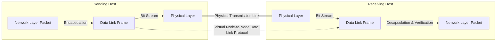

### 1. Unacknowledged Connectionless Service
* **Mechanism:** The sending machine transmits independent frames to the destination machine without establishing a prior connection. The destination machine does not send any acknowledgment upon receiving a frame.
* **Error Handling:** If a frame is lost or damaged due to channel noise, no recovery attempt is made at the Data Link Layer; recovery is left to higher layers (e.g., Transport TCP).
* **Use Cases:** Ideal for communication channels with very low inherent error rates (such as fiber-optic Ethernet LANs) and real-time traffic (such as digitized speech and video streaming) where late retransmissions are useless.

### 2. Acknowledged Connectionless Service
* **Mechanism:** No logical connection is established before transmission, but every individual frame transmitted is explicitly acknowledged by the receiver upon arrival.
* **Error Handling:** If a transmitted frame does not arrive within a specified timeout interval, the sender automatically retransmits the frame.
* **Use Cases:** Highly valuable over inherently unreliable, noisy physical channels where error rates are high, such as wireless links (IEEE 802.11 Wi-Fi, cellular networks). It is much more efficient to detect and retransmit a single damaged frame locally over the wireless link than to wait for end-to-end transport layer timeout.

### 3. Acknowledged Connection-Oriented Service
* **Mechanism:** A formal connection is established between source and destination machines before any data is transferred. Every frame transmitted is assigned a sequence number, and the Data Link Layer guarantees that every transmitted frame is delivered exactly once, in strict order, with no lost or duplicate frames.
* **Operating Phases:** Three distinct phases: Connection Establishment $\to$ Reliable Numbered Data Transfer $\to$ Connection Release.
* **Use Cases:** Long-distance wide-area point-to-point trunk lines, satellite links, and legacy telecommunication circuits.

[Source: Ch 3 Data Link Layer.pdf, Slides 4–10; Chapter3-DataLinkLayer_NEW.pdf, Slides 6–11]

---

## 4. Framing Techniques

Because the Physical Layer provides an unformatted stream of bits, the Data Link Layer must organize bits into distinct frames. The four primary framing methods are:

---

### Method 1: Byte Count (Character Count)

#### Mechanism
The header of each frame includes an integer field that specifies the total number of bytes in that frame (including the byte count byte itself). The receiver inspects this count to determine where the current frame ends and the next frame begins.

```text
Frame 1 (5 bytes)       Frame 2 (5 bytes)       Frame 3 (8 bytes)
[ 5 | A | B | C | D ]   [ 5 | E | F | G | H ]   [ 8 | I | J | K | L | M | N | O ]
```

#### Fatal Flaw (Framing Synchronization Loss)
If a transmission error corrupts the count field (e.g., a `5` in Frame 2 is flipped to a `7`), the receiver miscounts the frame boundary, reads data bytes as the count field of the next frame, and completely loses frame synchronization. Even if checksums detect that the frames are damaged, the receiver has no mechanism to determine where the next valid frame starts. For this reason, pure byte count framing is rarely used alone.

[Source: Ch 3 Data Link Layer.pdf, Slide 14; Chapter3-DataLinkLayer_NEW.pdf, Slides 14–15]

---

### Method 2: Flag Bytes with Byte Stuffing (Character Stuffing)

#### Mechanism
Each frame begins and ends with a reserved delimiter byte called a **Flag Byte** (conventionally `FLAG = 0x7E` in hexadecimal, or ASCII `DLE STX` / `DLE ETX`).

To prevent data inside the payload from being accidentally interpreted as a delimiter, the sender Data Link Layer searches the payload and automatically inserts an **Escape Byte** (`ESC = 0x1B` or `DLE = 0x10`) immediately before any accidental `FLAG` or `ESC` byte.

At the receiver, the Data Link Layer strips the prepended `ESC` byte before passing the payload upward to the Network Layer. If an unescaped `FLAG` byte arrives, it marks the true boundary of the frame.

```text
Original Data Payload:         A  |  B  | ESC |  C  | ESC | FLAG | FLAG |  D
Transmitted Stuffed Payload:   A  |  B  | ESC | ESC |  C  | ESC | ESC | ESC | FLAG | ESC | FLAG |  D
Complete Transmitted Frame:   FLAG [ A B ESC ESC C ESC ESC ESC FLAG ESC FLAG D ] FLAG
```

#### Framing Resynchronization Advantage
If an error corrupts a byte or causes a false flag, the receiver simply discards the current damaged frame and instantly resynchronizes as soon as the next true `FLAG` byte arrives.

[Source: Ch 3 Data Link Layer.pdf, Slides 15–17; Chapter3-DataLinkLayer_NEW.pdf, Slides 16–18]

---

### Method 3: Flag Bits with Bit Stuffing

#### Mechanism
Standardized for bit-oriented protocols (such as HDLC, SDLC, and USB). Every frame begins and ends with a special 8-bit flag pattern: **`01111110`** (`0x7E` — a zero followed by six consecutive ones and a zero).

#### Algorithm: Bit Stuffing & Destuffing
1. **Transmitter Rule:** Whenever the sender's Data Link Layer detects **five consecutive `1` bits** in the data payload, it automatically inserts ("stuffs") a **`0` bit** into the outgoing bit stream immediately following the fifth `1`, regardless of what the next data bit is.
2. **Receiver Rule:** Whenever the receiver sees **five consecutive `1` bits** arriving from the physical line:
   * If the sixth bit is a **`0`**, the receiver strips ("destuffs") the `0` bit and treats the five `1`s as genuine data.
   * If the sixth bit is a **`1`** and the seventh bit is a **`0`** (i.e., pattern `01111110`), it is recognized as a valid **Frame Delimiter Flag**.
   * If the sixth bit is a **`1`** and the seventh bit is a **`1`** (i.e., pattern `01111111`), it indicates a physical transmission error or a channel **Abort Signal**.

#### Example: Bit Stuffing Transformation
* Original Data Bit Stream:
  $$\mathbf{0111101111101111110}$$
* After Five-`1` Rule Processing:
  * Pattern `011110...` (four `1`s): No stuffing needed.
  * Pattern `...111110...` (five `1`s followed by data `0`): Sender injects a `0` $\to$ `11111`**`0`**`0`.
  * Pattern `...1111110...` (six `1`s in data): Sender injects a `0` after fifth `1` $\to$ `11111`**`0`**`10`.
* Transmitted Stuffed Bit Stream:
  $$\mathbf{01111011111\underline{0}011111\underline{0}10}$$

[Source: Ch 3 Data Link Layer.pdf, Slide 18; Chapter3-DataLinkLayer_NEW.pdf, Slides 19–20; CN_Numericals_Data_Link_Layer.pdf, Page 16]

---

### Method 4: Physical Layer Coding Violations

#### Mechanism
Used in networks whose physical line encoding schemes contain inherent redundancy. For instance, in **Manchester Encoding**, every valid bit interval contains a voltage transition in the middle (Low-to-High for bit `0`, High-to-Low for bit `1`).

A signal interval with **no transition** (High-High or Low-Low) is an invalid data signal that represents a **coding violation**. The Data Link Layer exploits these reserved invalid patterns as natural frame boundary delimiters.

**Advantage:** Zero framing overhead; no data bits or escape bytes need to be stuffed into the frame payload.

[Source: Ch 3 Data Link Layer.pdf, Slide 19; Chapter3-DataLinkLayer_NEW.pdf, Slide 21]

---

## 5. Error Control: Detection and Correction

Transmission errors on physical lines are caused by thermal noise, electromagnetic interference, signal attenuation, and cross-talk. Error control uses mathematical redundancy to ensure data integrity.

---

### Error Types: Single-Bit vs Burst Errors

1. **Single-Bit Error:** An isolated error where exactly one bit in a data block is inverted while all neighboring bits remain correct.
2. **Burst Error:** A cluster of errors where two or more corrupted bits occur within a span of $k$ consecutive bits. The **burst length** $k$ is measured from the first corrupted bit to the last corrupted bit in the sequence. Burst errors are common in wireless and physical channels due to lightning strikes, impulse noise, and radio fading.

[Source: Ch 3 Data Link Layer.pdf, Slides 21–22]

---

### Code Architecture & Hamming Distance

An $(n, k)$ block code takes an $m$-bit dataword and appends $r$ check bits to create an $n$-bit **codeword**, where $n = m + r$. The code rate is $\frac{m}{n}$.

#### Definition: Hamming Distance
The **Hamming Distance** $d(v_1, v_2)$ between two binary codewords $v_1$ and $v_2$ of equal length is the number of bit positions in which they differ.

$$\text{Hamming Distance} = \text{weight}(v_1 \oplus v_2)$$

Where $\oplus$ is the bitwise modulo-2 addition (XOR) operator, and $\text{weight}$ is the count of `1` bits.

#### Minimum Hamming Distance Theorems

1. **Error Detection Theorem:** To reliably detect up to $s$ single-bit errors in any codeword, the minimum Hamming distance of the code must satisfy:
   $$d_{\min} \ge s + 1$$
2. **Error Correction Theorem:** To reliably correct up to $t$ single-bit errors in any codeword, the minimum Hamming distance of the code must satisfy:
   $$d_{\min} \ge 2t + 1$$

*Intuition:* If $d_{\min} = 2t + 1$, any received codeword with up to $t$ bit errors remains closer to the original transmitted codeword than to any other valid codeword in the code space, allowing unique maximum-likelihood decoding.

[Source: Ch 3 Data Link Layer.pdf, Slides 23–25; CN_Numericals_Data_Link_Layer.pdf, Pages 2–7]

---

### The Hamming Single-Error-Correcting Code

Richard Hamming designed an optimal systematic code capable of correcting any single-bit error ($t = 1, d_{\min} = 3$).

#### Parity Bit Positions
In an $n$-bit codeword, bit positions that are powers of 2 ($1, 2, 4, 8, 16, \dots, 2^{r-1}$) are reserved for **parity check bits** ($p_1, p_2, p_4, p_8, \dots$). The remaining bit positions ($3, 5, 6, 7, 9, 10, 11, \dots$) contain the original **data bits** ($d_1, d_2, d_3, d_4, \dots$).

#### Hamming Redundancy Inequality
To correct any single-bit error in an $m$-bit message using $r$ parity check bits, there are $n = m + r$ possible single-bit error locations plus 1 case where no error occurs ($m + r + 1$ total states). Since $r$ check bits can represent $2^r$ distinct syndrome values, the code must satisfy:

$$2^r \ge m + r + 1$$

| Data Bits ($m$) | Parity Bits ($r$) | Total Bits ($n = m + r$) | Code Name | Code Rate ($m/n$) |
| :---: | :---: | :---: | :---: | :---: |
| 1 | 2 | 3 | $(3, 1)$ | 0.33 |
| 4 | 3 | 7 | $(7, 4)$ | 0.57 |
| 8 | 4 | 12 | $(12, 8)$ | 0.67 |
| 11 | 4 | 15 | $(15, 11)$ | 0.73 |
| 26 | 5 | 31 | $(31, 26)$ | 0.84 |

#### Parity Group Calculation (Even Parity)
A bit in position $k$ is checked by parity bit $p_{2^j}$ if the $j$-th bit in the binary representation of $k$ is `1`:
* **$p_1$ (Bit 1):** Checks all bit positions whose binary representation has a `1` in the least significant bit (positions $1, 3, 5, 7, 9, 11, 13, 15, \dots$).
* **$p_2$ (Bit 2):** Checks all bit positions with a `1` in the second bit (positions $2, 3, 6, 7, 10, 11, 14, 15, \dots$).
* **$p_4$ (Bit 4):** Checks positions $4, 5, 6, 7, 12, 13, 14, 15, \dots$.
* **$p_8$ (Bit 8):** Checks positions $8, 9, 10, 11, 12, 13, 14, 15, \dots$.

#### Syndrome Decoding & Error Correction
At the receiver, the parity check equations are evaluated over the received bits to form the **Syndrome Vector** $S = [s_r \dots s_2 s_1]_2$:
* If $S = 0$, no bit error occurred.
* If $S \ne 0$, the integer value of $S$ gives the **exact 1-based index of the corrupted bit**. Inverting (flipping) bit $S$ restores the original codeword.

[Source: Ch 3 Data Link Layer.pdf, Slides 26–30; Chapter3-DataLinkLayer_NEW.pdf, Slides 26–32; CN_Numericals_Data_Link_Layer.pdf, Pages 11–14]

---

### Cyclic Redundancy Check (CRC / Polynomial Codes)

Polynomial codes treat bit strings as polynomials with coefficients in GF(2) (binary arithmetic where addition and subtraction are identical to bitwise XOR).

An $m$-bit message is represented by polynomial $M(x)$ of degree $m-1$. The sender and receiver agree in advance on a fixed **Generator Polynomial** $G(x)$ of degree $r$ (having $r+1$ bits), where both the highest and lowest terms must be $1$ ($x^r + \dots + 1$).

#### CRC Frame Check Sequence (FCS) Generation Algorithm

1. **Degree of Generator:** Let $r = \text{deg}(G(x))$.
2. **Append Zeros:** Multiply $M(x)$ by $x^r$, which corresponds to appending $r$ zero bits to the end of the message bit string: $T'(x) = x^r M(x)$.
3. **Modulo-2 Division:** Divide the bit string corresponding to $x^r M(x)$ by the bit string of $G(x)$ using modulo-2 binary division (XOR subtraction, ignoring carries/borrows).
4. **Compute Checksum (FCS):** The division produces a quotient $Q(x)$ and an $r$-bit remainder $R(x)$:
   $$\frac{x^r M(x)}{G(x)} = Q(x) \oplus \frac{R(x)}{G(x)}$$
5. **Construct Transmitted Codeword:** Subtract (XOR) the remainder $R(x)$ from $x^r M(x)$:
   $$T(x) = x^r M(x) \oplus R(x)$$
   The transmitted codeword $T(x)$ is exactly divisible by $G(x)$ without remainder.

#### Receiver Verification
The receiver divides the incoming bit stream $T(x) \oplus E(x)$ by $G(x)$. If the remainder is non-zero, a transmission error $E(x)$ has occurred.

#### Standard International Generator Polynomials

| Standard Name | Degree ($r$) | Polynomial Equation $G(x)$ | Application Domain |
| :--- | :---: | :--- | :--- |
| **CRC-12** | 12 | $x^{12} + x^{11} + x^3 + x^2 + x + 1$ | 6-bit character streams |
| **CRC-16** | 16 | $x^{16} + x^{15} + x^2 + 1$ | Bisync, USB, HDLC |
| **CRC-CCITT** | 16 | $x^{16} + x^{12} + x^5 + 1$ | X.25, HDLC, Bluetooth, PPP |
| **CRC-32 (IEEE 802)**| 32 | $x^{32} + x^{26} + x^{23} + x^{22} + x^{16} + x^{12} + x^{11} + x^{10} + x^8 + x^7 + x^5 + x^4 + x^2 + x + 1$ | Ethernet (802.3), Wi-Fi (802.11), FDDI, PKZIP |

#### Error Detection Capabilities of CRC-32
* Detects **100% of single-bit errors** (since $G(x)$ has two or more terms).
* Detects **100% of double-bit errors** (since $G(x)$ does not divide $x^k + 1$ for any $k < 2^{31}-1$).
* Detects **100% of any odd number of bit errors** (since $(x+1)$ is a factor of $G(x)$).
* Detects **100% of burst errors of length $\le 32$ bits**.
* Detects **$99.99999995\%$ of burst errors of length 33 bits** ($1 - 2^{-31}$).
* Detects **$99.99999998\%$ of all longer burst errors** ($1 - 2^{-32}$).

[Source: Ch 3 Data Link Layer.pdf, Slides 34–38; Chapter3-DataLinkLayer_NEW.pdf, Slides 36–42]

---

## 6. Flow Control & Elementary Data Link Protocols

Flow control prevents sender buffer overrun at the receiver. Protocols progress from idealized theoretical models to practical noisy-channel implementations.

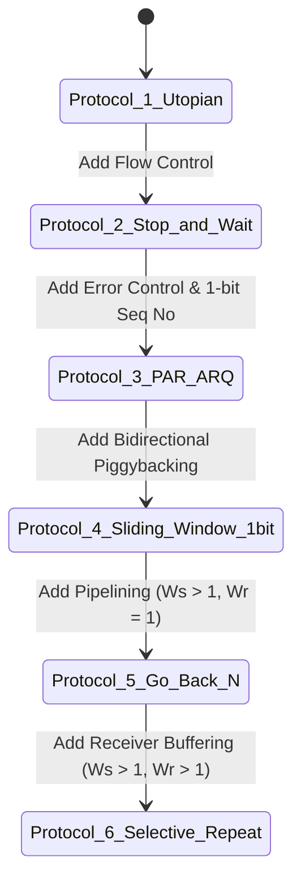

---

### Protocol 1: Utopian Simplex Protocol
* **Assumptions:** Data is transmitted strictly in one direction (simplex); sending and receiving network layers are always ready; infinite buffer space; physical channel is completely noiseless (never corrupts or loses frames).
* **Operation:** Sender fetches packet from network layer, encapsulates it into a frame, and transmits it. Receiver waits in an infinite loop, receives the frame, extracts the packet, and delivers it upward.

[Source: Ch 3 Data Link Layer.pdf, Slides 39–41]

---

### Protocol 2: Simplex Stop-and-Wait Protocol (for Error-Free Channel)
* **Problem Addressed:** Prevents a fast sender from flooding a slow receiver with data when the receiver has finite processing speed and buffer space.
* **Mechanism:** Half-duplex stop-and-wait flow control. After transmitting a data frame, the sender stops and waits. The receiver, upon receiving the frame and passing the packet upward, sends back an explicit **dummy acknowledgment (ACK) frame**. Only upon receiving this ACK does the sender transmit the next data frame.

[Source: Ch 3 Data Link Layer.pdf, Slides 42–44]

---

### Protocol 3: Positive Acknowledgment with Retransmission (PAR / Stop-and-Wait ARQ)
* **Problem Addressed:** Handling noisy physical channels where frames or ACKs can be corrupted or lost completely.
* **Mechanisms Added:**
  1. **Frame Checksum:** Receiver verifies checksum; silently discards corrupted frames.
  2. **Sender Retransmission Timer:** If an ACK is not received within a timeout period, the sender automatically retransmits the frame.
  3. **1-Bit Sequence Number ($0$ and $1$):** Solves the duplicate frame ambiguity caused by premature timeouts or lost ACKs. The sender alternates the sequence number bit on each new frame ($0, 1, 0, 1, \dots$). The receiver tracks the expected sequence number; if a duplicate frame arrives, the receiver re-acknowledges it and discards the duplicate payload.

[Source: Ch 3 Data Link Layer.pdf, Slides 45–48; Chapter3-DataLinkLayer_NEW.pdf, Slides 48–52]

---

## 7. Sliding Window Protocols

In full-duplex links, data flows simultaneously in both directions. Using **piggybacking**, when a data frame arrives, the receiver does not send an immediate standalone ACK frame; instead, it waits until its own network layer provides an outbound data packet, inserts the acknowledgment sequence number into the header of that outgoing data frame, and transmits them together. If no outbound data is ready within an **ACK Timer** duration, a standalone ACK is dispatched.

---

### Protocol 4: 1-Bit Sliding Window Protocol

* **Window Sizes:** Sender Window Size $W_s = 1$, Receiver Window Size $W_r = 1$.
* **Operation:** At any instant, the sender can have at most one unacknowledged frame in transit. Sequence numbers take values $0$ and $1$.
* **Normal vs Error Scenarios:**
  * If a data frame or ACK is lost, the sender's timer expires and the frame is retransmitted.
  * **Simultaneous Transmission Anomaly:** If Host A and Host B transmit simultaneously, their frames cross in transit. Both machines accept the incoming frame, deliver the packet, and transmit the next frame with inverted sequence number. The protocol continues correctly, but channel utilization is halved because every frame is sent twice.

[Source: Ch 3 Data Link Layer.pdf, Slides 46–50; Chapter3-DataLinkLayer_NEW.pdf, Slides 53–58]

---

### Pipelining & Channel Efficiency

In high-bandwidth or long-delay links (e.g., satellite or fiber-optic WANs), Stop-and-Wait protocol wastes almost all link capacity because the sender must remain idle during the entire round-trip time.

Let $T_{\text{trans}} = \frac{L}{R}$ be the frame transmission time, and $T_{\text{prop}} = \frac{D}{v}$ be the propagation delay. Define the normalized propagation delay:

$$a = \frac{T_{\text{prop}}}{T_{\text{trans}}}$$

The link utilization (efficiency) of Stop-and-Wait ARQ is:

$$\eta_{\text{Stop-and-Wait}} = \frac{T_{\text{trans}}}{T_{\text{trans}} + 2 T_{\text{prop}}} = \frac{1}{1 + 2a}$$

To achieve $100\%$ channel utilization, the sender must transmit frames continuously without waiting, requiring a pipeline window size:

$$W_s \ge 1 + 2a = 1 + \frac{2 \times T_{\text{prop}}}{T_{\text{trans}}}$$

[Source: Ch 3 Data Link Layer.pdf, Slides 51–52; CN_Numericals_Data_Link_Layer.pdf, Pages 26–29]

---

### Protocol 5: Go-Back-N Protocol (GBN)

* **Architectural Concept:** Pipelined transmission with Sender Window $W_s > 1$ and Receiver Window $W_r = 1$.
* **Receiver Behavior:** The receiver accepts frames **strictly in sequential order**. If a frame arrives damaged or out of order, the receiver discards it and **discards all subsequent incoming frames**, sending no ACKs for out-of-order frames. The receiver maintains zero buffer for out-of-order data.
* **Sender Behavior:** The sender buffers all unacknowledged transmitted frames in its window. It maintains a timer for the oldest unacknowledged frame. When this timer expires, the sender **"goes back $N$"** and retransmits *all* unacknowledged frames currently in the window, even if some were received correctly.
* **Acknowledgments:** Uses **cumulative ACKs** (ACK $n$ confirms all frames $\le n$).

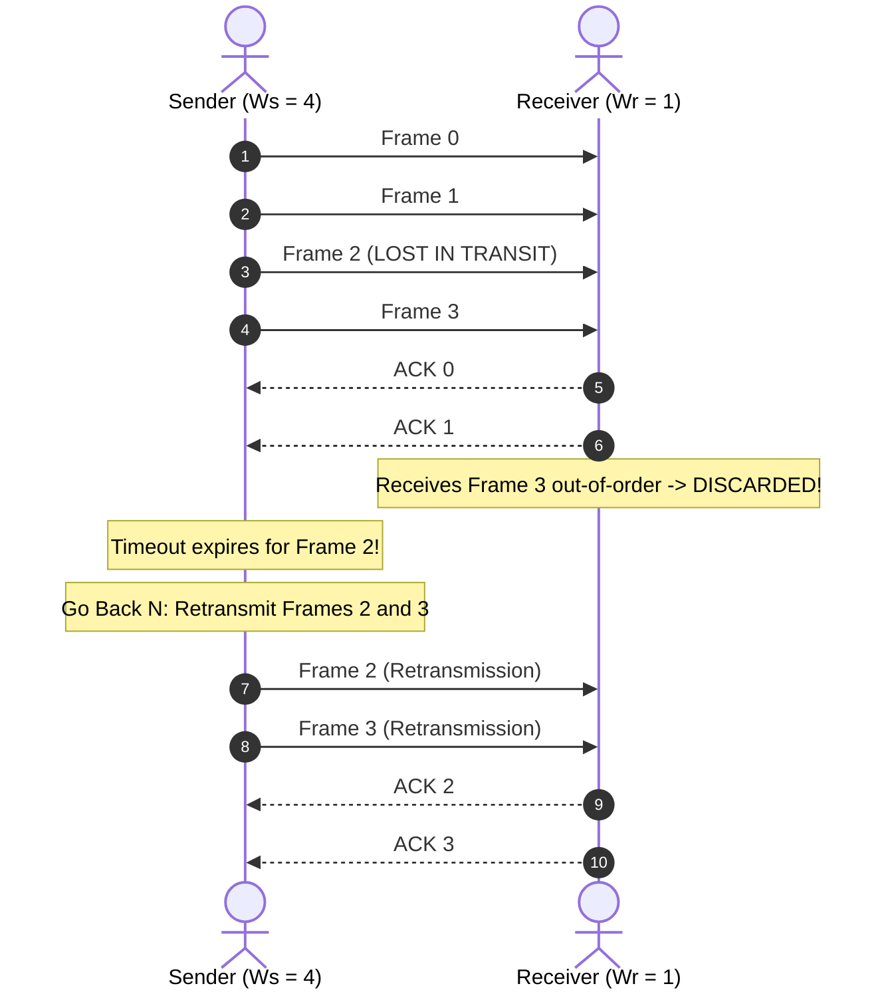

#### Maximum Window Size Rule for Go-Back-N
For an $n$-bit sequence number ($0$ to $2^n - 1$, total modulo $M = 2^n$):

$$W_s \le 2^n - 1$$

*Proof:* If $W_s = 2^n$, suppose the sender transmits frames $0$ to $2^n - 1$. All frames arrive correctly at the receiver, which advances its expected sequence number to $0$ and sends ACKs. If all ACKs are lost, the sender times out and retransmits frame $0$. The receiver, expecting new frame $0$, cannot distinguish between the retransmitted old frame $0$ and the new frame $0$, causing silent duplicate acceptance. Setting $W_s \le 2^n - 1$ eliminates this ambiguity.

[Source: Ch 3 Data Link Layer.pdf, Slides 53–56; Chapter3-DataLinkLayer_NEW.pdf, Slides 60–66; CN_Numericals_Data_Link_Layer.pdf, Pages 31–32]

---

### Protocol 6: Selective Repeat Protocol (SR)

* **Architectural Concept:** Pipelined transmission with Sender Window $W_s > 1$ and Receiver Window $W_r > 1$.
* **Receiver Buffering:** The receiver possesses a buffer of size $W_r$. When an out-of-order frame arrives without corruption within the receiver's window, the receiver stores it in the buffer and sends a **Negative Acknowledgment (NAK / SREJ)** for the missing frame.
* **Sender Fast Retransmission:** The sender maintains an independent timer for each frame. When a NAK arrives or a specific timer expires, the sender retransmits **only the single missing or damaged frame**, without retransmitting successfully received subsequent frames.
* **Window Advance:** When the missing frame finally arrives, the receiver delivers the entire consecutive buffered sequence to the network layer and slides its window forward.

#### Maximum Window Size Rule for Selective Repeat
For an $n$-bit sequence number ($M = 2^n$):

$$W_s + W_r \le 2^n$$

When sender and receiver windows are equal ($W_s = W_r$):

$$W_s = W_r \le 2^{n-1} = \frac{2^n}{2}$$

*Example:* For 3-bit sequence numbers ($0$ to $7$, $M = 8$), the maximum window size is $W_s = W_r = 4$. If a window of $5$ were used, overlap between the new window and old window would cause duplicate delivery.

[Source: Ch 3 Data Link Layer.pdf, Slides 57–63; Chapter3-DataLinkLayer_NEW.pdf, Slides 67–75]

---

## 8. Example Data Link Protocols

---

### HDLC (High-Level Data Link Control)

HDLC is a bit-oriented synchronous protocol derived from IBM SDLC. It operates over point-to-point and multipoint links using bit stuffing (`01111110`).

#### HDLC Frame Structure

| Field | Size | Description |
| :--- | :---: | :--- |
| **Flag** | 8 bits | Frame delimiter pattern: `01111110` (`0x7E`) |
| **Address** | 8 or 16 bits | Identifies secondary station address on multipoint links |
| **Control** | 8 or 16 bits | Identifies frame type, sequence numbers $N(S), N(R)$, and $P/F$ bit |
| **Data (Payload)** | Variable | Network layer packet |
| **FCS (Checksum)** | 16 or 32 bits | CRC-CCITT or CRC-32 Frame Check Sequence |
| **Flag** | 8 bits | Frame closing delimiter: `01111110` (`0x7E`) |

#### The Three HDLC Frame Types

1. **Information Frames (I-Frames):**
   * Transmit user data.
   * Control field format: `0 | N(S) | P/F | N(R)`
   * $N(S)$ = 3-bit send sequence number of current frame.
   * $N(R)$ = 3-bit piggybacked acknowledgment (next expected frame).
   * $P/F$ = Poll/Final bit (used to poll stations or mark final response).
2. **Supervisory Frames (S-Frames):**
   * Transmit flow and error control commands when no reverse data is present.
   * Control field format: `1 0 | Type | P/F | N(R)`
   * Type codes:
     * `00` — **Receive Ready (RR):** Positive acknowledgment confirming receipt up to $N(R)-1$.
     * `01` — **Receive Not Ready (RNR):** Acknowledges frames but tells sender receiver buffer is full.
     * `10` — **Reject (REJ):** NAK for Go-Back-N; requests retransmission starting from $N(R)$.
     * `11` — **Selective Reject (SREJ):** NAK for Selective Repeat; requests retransmission of only frame $N(R)$.
3. **Unnumbered Frames (U-Frames):**
   * Used for link management, mode setting, and connection setup/teardown.
   * Control field format: `1 1 | Type | P/F | Modifier`
   * Commands: `SABM` (Set Asynchronous Balanced Mode), `DISC` (Disconnect), `UA` (Unnumbered Acknowledgment), `FRMR` (Frame Reject).

[Source: Ch 3 Data Link Layer.pdf, Slides 64–65; Chapter3-DataLinkLayer_NEW.pdf, Slides 76–80]

---

### PPP (Point-to-Point Protocol — RFC 1661)

PPP is the standard data link protocol used for establishing direct connections between two nodes over dial-up modems, DSL, broadband links, and router-to-router leased lines.

#### Core Architectural Components of PPP
1. **HDLC-like Framing:** Provides unambiguous byte-oriented framing with checksum error detection.
2. **Link Control Protocol (LCP):** Used to negotiate link options, test line quality, configure MTU, and bring links up/down.
3. **Authentication Protocols:** Optional PAP (Password Authentication Protocol) or CHAP (Challenge Handshake Authentication Protocol).
4. **Network Control Protocols (NCPs):** A modular family of independent protocols used to configure network-layer settings (e.g., **IPCP** assigns dynamic IP addresses, DNS server addresses, and subnet masks for IPv4).

#### PPP Frame Format

| Field | Size (Bytes) | Standard Value | Description |
| :--- | :---: | :---: | :--- |
| **Flag** | 1 | `0x7E` (`01111110`) | Frame delimiter byte |
| **Address** | 1 | `0xFF` (`11111111`) | All-stations broadcast address (point-to-point link) |
| **Control** | 1 | `0x03` (`00000011`) | Unnumbered information frame |
| **Protocol** | 1 or 2 | Variable | Identifies payload type (`0x0021` = IPv4, `0x8021` = IPCP, `0xC021` = LCP, `0xC223` = CHAP) |
| **Payload** | Variable | Up to MRU ($1500$) | Network layer packet or LCP/NCP control payload |
| **Checksum (FCS)**| 2 or 4 | CRC-16 or CRC-32 | Error detection checksum |
| **Flag** | 1 | `0x7E` (`01111110`) | Frame closing delimiter |

*Byte Stuffing in PPP:* Uses escape character `0x7D`. Any occurrence of `0x7E` in payload is replaced by `0x7D 0x5E`; `0x7D` is replaced by `0x7D 0x5D`.

#### PPP Link State Machine

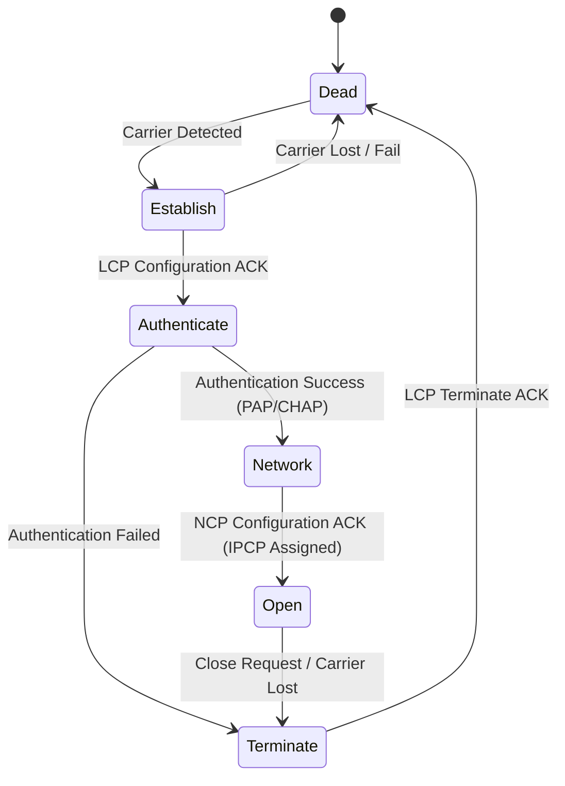

[Source: Ch 3 Data Link Layer.pdf, Slides 65–67; Chapter3-DataLinkLayer_NEW.pdf, Slides 81–84]

---

### ADSL (Asymmetric Digital Subscriber Line) Data Link Architecture

ADSL delivers broadband Internet over existing local copper telephone loops using Discrete Multi-Tone (DMT) modulation (256 frequency subchannels).

At the Data Link Layer, user IP traffic is encapsulated inside a **PPP frame**, which is encapsulated into **ATM (Asynchronous Transfer Mode) Adaptation Layer 5 (AAL5)** CPCS-PDU packets, sliced into fixed 53-byte ATM cells (5-byte header + 48-byte payload), and modulated across DMT subcarriers to the DSLAM (DSL Access Multiplexer) at the telephone company central office.

[Source: Ch 3 Data Link Layer.pdf, Slide 68; Chapter3-DataLinkLayer_NEW.pdf, Slides 85–86]

---

## 9. Mathematical Foundations, Formulas & Derivations

---

### 1. Stop-and-Wait ARQ Efficiency Derivation

#### Derivation
Let a station transmit a frame of $L$ bits over a channel with bit rate $R$ bps, distance $D$ meters, and propagation speed $v$ m/s.
* Frame transmission time: $T_t = \frac{L}{R}$
* One-way propagation delay: $T_p = \frac{D}{v}$
* Round-Trip Time: $\text{RTT} = 2 T_p$
* Acknowledgment frame transmission time $T_{\text{ack}} \approx 0$.

Total time required to successfully transmit one frame and receive its acknowledgment:

$$T_{\text{total}} = T_t + 2 T_p = T_t(1 + 2a)$$

Where $a = \frac{T_p}{T_t} = \frac{D \cdot R}{v \cdot L}$.

The link utilization (efficiency) $\eta$ is the ratio of useful transmission time to total elapsed time:

$$\eta = \frac{T_t}{T_{\text{total}}} = \frac{T_t}{T_t + 2 T_p} = \frac{1}{1 + 2a}$$

[Source: CN_Numericals_Data_Link_Layer.pdf, Pages 18, 26–27]

---

### 2. Pipelined Sliding Window (Go-Back-N) Efficiency

For a sender window size $W_s$:
* If $W_s < 1 + 2a$, the sender exhausts its window before the first ACK arrives:
  $$\eta = \frac{W_s \cdot T_t}{T_t + 2 T_p} = \frac{W_s}{1 + 2a}$$
* If $W_s \ge 1 + 2a$, the sender transmits continuously and achieves maximum channel capacity:
  $$\eta = 1.0 = 100\%$$

[Source: CN_Numericals_Data_Link_Layer.pdf, Pages 28–29, 31]

---

### 3. Hamming $(n, k)$ Code Distance & Parity Bits

* **Parity bit count inequality:** $2^r \ge m + r + 1$
* **Error detection condition:** $d_{\min} \ge s + 1$
* **Error correction condition:** $d_{\min} \ge 2t + 1$

[Source: CN_Numericals_Data_Link_Layer.pdf, Pages 4, 7, 11]

---

## 10. Algorithms and Procedures

---

### Algorithm 3.1: Character / Byte Stuffing

**Purpose:** Ensure transparent data transmission in byte-oriented framing.
**Input:** Raw byte array `data[]`, length $N$.
**Output:** Stuffed byte array `stuffed[]` bounded by `FLAG` bytes.

**Procedure:**
1. Append `FLAG` byte (`0x7E`) to output.
2. For each byte $B$ in `data[]`:
   * If $B == \text{FLAG}$ (`0x7E`), append `ESC` (`0x7D`) and `(0x7E ^ 0x20)` (`0x5E`) to output.
   * Else if $B == \text{ESC}$ (`0x7D`), append `ESC` (`0x7D`) and `(0x7D ^ 0x20)` (`0x5D`) to output.
   * Else, append $B$ directly to output.
3. Append closing `FLAG` byte (`0x7E`) to output.

---

### Algorithm 3.2: Bit Stuffing

**Purpose:** Prevent accidental flag pattern `01111110` in bit-oriented framing.
**Input:** Raw bit sequence.
**Output:** Bit-stuffed transmission sequence.

**Procedure:**
1. Initialize `consecutive_ones = 0`.
2. For each incoming bit $b$:
   * Transmit $b$.
   * If $b == 1$:
     * Increment `consecutive_ones`.
     * If `consecutive_ones == 5`:
       * Transmit an extra `0` bit.
       * Reset `consecutive_ones = 0`.
   * Else ($b == 0$):
     * Reset `consecutive_ones = 0`.

---

### Algorithm 3.3: CRC Generation via Modulo-2 Division

**Purpose:** Calculate Frame Check Sequence (FCS) remainder.
**Input:** $m$-bit message $M$, degree-$r$ generator $G$.
**Output:** Transmitted $(m+r)$-bit codeword $T$.

**Procedure:**
1. Append $r$ zero bits to $M$, forming dividend string $D$ of length $m+r$.
2. Align divisor $G$ with the leftmost `1` bit of $D$.
3. Perform bitwise XOR between $G$ and the $r+1$ bits of $D$ underneath it.
4. Shift right to the next `1` bit in $D$ and repeat XOR with $G$ until the end of $D$ is reached.
5. The remaining $r$-bit string is remainder $R$.
6. Replace the $r$ appended zeros of $D$ with $R$ to form transmitted codeword $T$.

[Source: Ch 3 Data Link Layer.pdf, Slides 16, 18, 38]

---

## 11. Diagrams and Architecture Analysis

---

### Figure 3.1: Packet in Frame Relationship

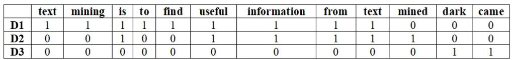

#### Written Analysis of Figure 3.1
* **What it shows:** Illustrates how a Network Layer packet is encapsulated into the payload field of a Data Link Layer frame, flanked by a header and trailer.
* **Components:** Frame Header (preamble, source/destination physical addresses, frame type/length), Packet Payload (Network-layer data), Frame Trailer (error-checking CRC/FCS).
* **Flow / Relationship:** The Network Layer hands a complete packet across the SAP interface. The DLL wraps the packet with header and trailer before passing bits to the Physical Layer.

[Source: Ch 3 Data Link Layer.pdf, Slide 5]

---

### Figure 3.2: Data Link Layer Virtual vs Actual Communication

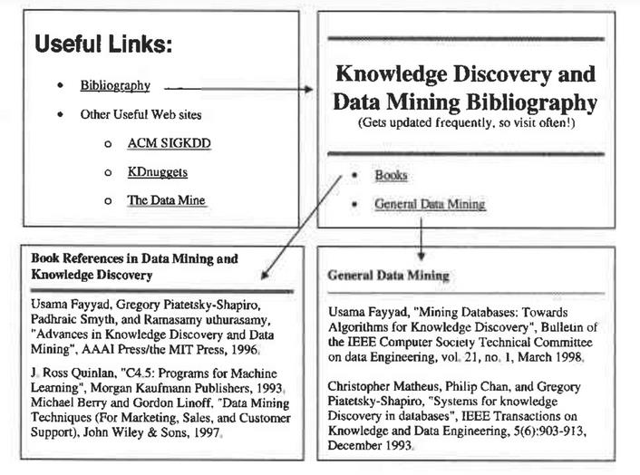

#### Written Analysis of Figure 3.2
* **What it shows:** Contrasts the horizontal logical (virtual) peer-to-peer frame communication between Data Link Layers with the actual vertical signal path traversing the physical hardware medium.
* **Components:** Node A (Layers 3, 2, 1), Node B (Layers 3, 2, 1), Physical wire link.

[Source: Ch 3 Data Link Layer.pdf, Slide 10]

---

### Figure 3.3: Framing Character / Byte Count & Synchronization Error


#### Written Analysis of Figure 3.3
* **What it shows:** (a) Normal operation of byte count framing across four frames. (b) Catastrophic synchronization failure caused by a single bit error flipping count `5` to `7` in Frame 2.

[Source: Ch 3 Data Link Layer.pdf, Slide 14]

---

### Figure 3.4: Byte Stuffing and Destuffing Mechanism

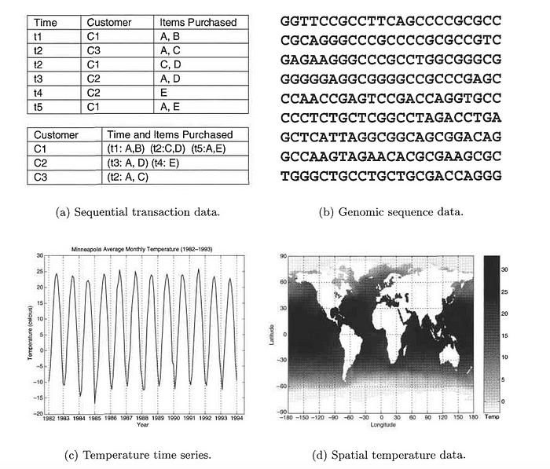

#### Written Analysis of Figure 3.4
* **What it shows:** Demonstrates how escape (`ESC`) bytes are stuffed before payload `FLAG` and `ESC` bytes, and stripped at the receiver to achieve data transparency.

[Source: Ch 3 Data Link Layer.pdf, Slide 16]

---

### Figure 3.5: Bit Stuffing Mechanism (HDLC / USB)


#### Written Analysis of Figure 3.5
* **What it shows:** Visualizes the injection of a `0` bit after every five consecutive `1` bits in data payload, and its subsequent removal at the destination receiver.

[Source: Ch 3 Data Link Layer.pdf, Slide 18]

---

### Figure 3.6: Hamming $(7,4)$ Code Bit Position Matrix


#### Written Analysis of Figure 3.6
* **What it shows:** Shows the structural interleaving of 3 parity check bits ($p_1, p_2, p_4$ at bit positions $1, 2, 4$) and 4 data bits ($d_1, d_2, d_3, d_4$ at bit positions $3, 5, 6, 7$).

[Source: Ch 3 Data Link Layer.pdf, Slide 27]

---

### Figure 3.7: Hamming Error Detection Syndrome Decoding

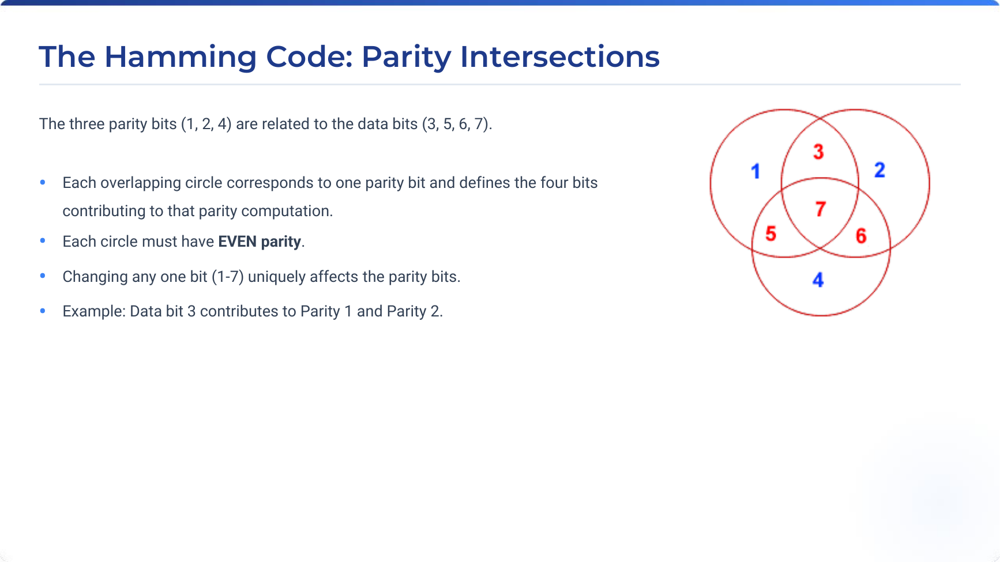

#### Written Analysis of Figure 3.7
* **What it shows:** Illustrates how evaluating the three parity equations over received codeword `1110110` yields non-zero syndrome vector $101_2 = 5$, directly identifying bit 5 as the erroneous bit.

[Source: Ch 3 Data Link Layer.pdf, Slide 30]

---

### Figure 3.8: CRC Modulo-2 Polynomial Division

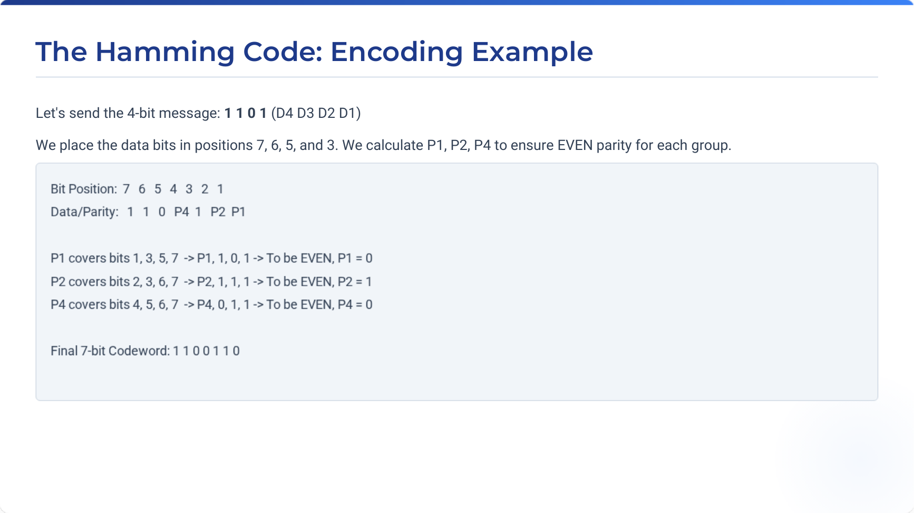

#### Written Analysis of Figure 3.8
* **What it shows:** Step-by-step modulo-2 long division of message $1101011111$ appended with 6 zeros by generator $G(x) = x^6 + x^4 + x^3 + 1$ ($1011001$), yielding remainder $R = 011110$.

[Source: Ch 3 Data Link Layer.pdf, Slide 38]

---

### Figure 3.9: Sliding Window Concepts & Window Advances


#### Written Analysis of Figure 3.9
* **What it shows:** Visualizes sender and receiver sliding windows: frames unacknowledged, frames eligible to send, and window expansion/contraction upon frame transmissions and ACK receptions.

[Source: Ch 3 Data Link Layer.pdf, Slide 46]

---

### Figure 3.10: 1-Bit Sliding Window Protocol State Timeline

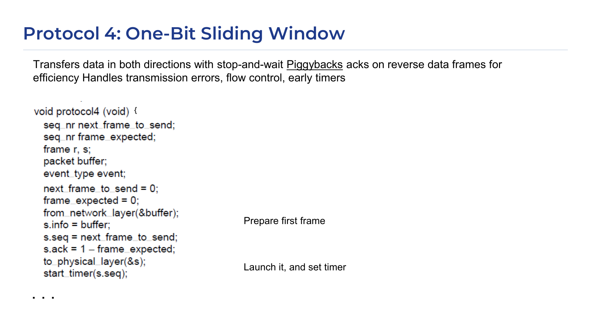

#### Written Analysis of Figure 3.10
* **What it shows:** Chronological packet-by-packet state progression for Protocol 4 showing (a) normal transmission exchange and (b) simultaneous startup anomaly.

[Source: Ch 3 Data Link Layer.pdf, Slide 47]

---

### Figure 3.11: ARQ Normal and Error Recovery Timelines

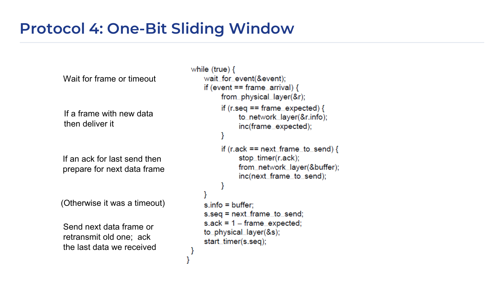

#### Written Analysis of Figure 3.11
* **What it shows:** Chronological comparison of ARQ error scenarios: (a) Lost data frame triggering sender timeout retransmission; (b) Lost ACK frame triggering duplicate transmission and duplicate rejection.

[Source: Ch 3 Data Link Layer.pdf, Slide 51]

---

### Figure 3.12: Go-Back-N Pipelined Transmission Flow

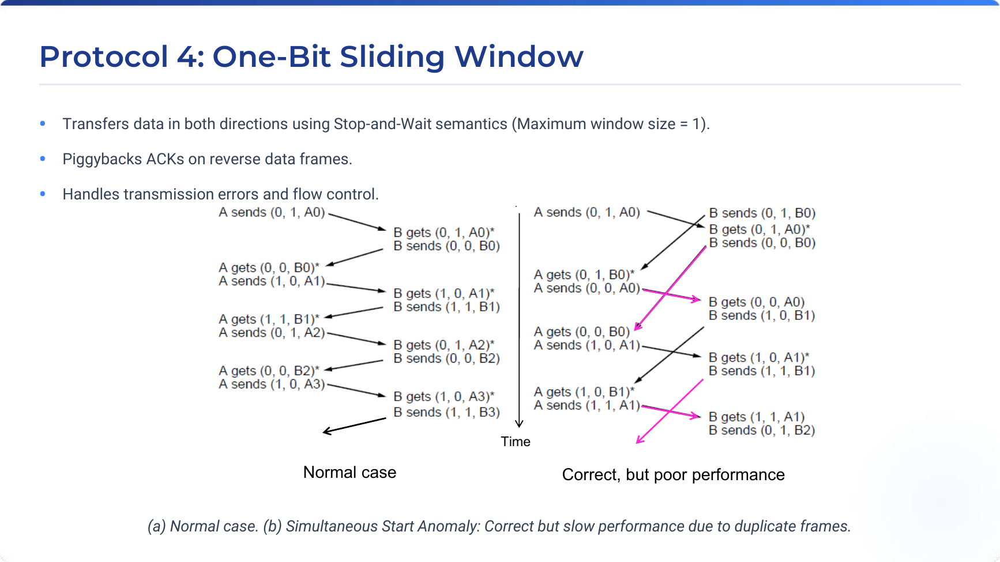

#### Written Analysis of Figure 3.12
* **What it shows:** Illustrates Go-Back-N with $W_s = 4$. Frame 2 is damaged in transit; receiver discards frames 2, 3, 4, 5. Sender timer expires on frame 2 and retransmits all frames 2, 3, 4, 5.

[Source: Ch 3 Data Link Layer.pdf, Slide 53]

---

### Figure 3.13: Go-Back-N vs Selective Repeat Window Size Limits

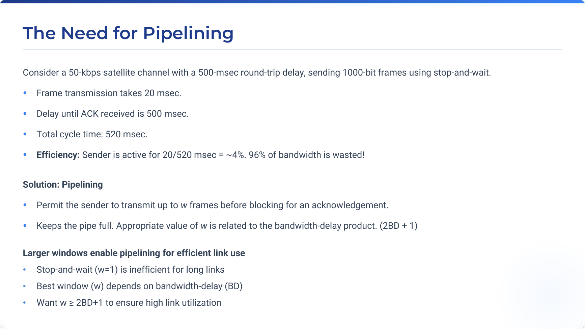

#### Written Analysis of Figure 3.13
* **What it shows:** Detailed state diagram proving why Go-Back-N requires $W_s \le 2^n - 1$ and Selective Repeat requires $W_s = W_r \le 2^{n-1}$ to prevent sequence number wrap-around ambiguity.

[Source: Ch 3 Data Link Layer.pdf, Slide 58]

---

### Figure 3.14: PPP Frame Format


#### Written Analysis of Figure 3.14
* **What it shows:** Field-by-field layout of the RFC 1661 PPP frame: Flag (`0x7E`), Address (`0xFF`), Control (`0x03`), Protocol (16-bit), Payload, FCS Checksum (16/32-bit), Flag (`0x7E`).

[Source: Ch 3 Data Link Layer.pdf, Slide 65]

---

### Figure 3.15: PPP Link State Transition Diagram

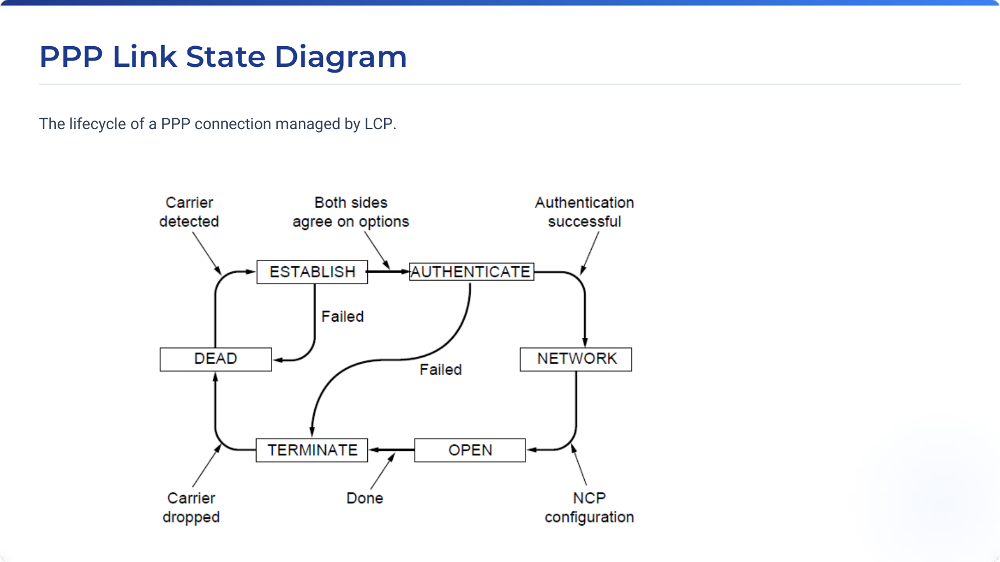

#### Written Analysis of Figure 3.15
* **What it shows:** Complete lifecycle state machine of a PPP connection: Dead $\to$ Establish (LCP) $\to$ Authenticate (PAP/CHAP) $\to$ Network (NCP/IPCP) $\to$ Open $\to$ Terminate $\to$ Dead.

[Source: Ch 3 Data Link Layer.pdf, Slide 66]

---

### Figure 3.16: ADSL Protocol Stack Architecture

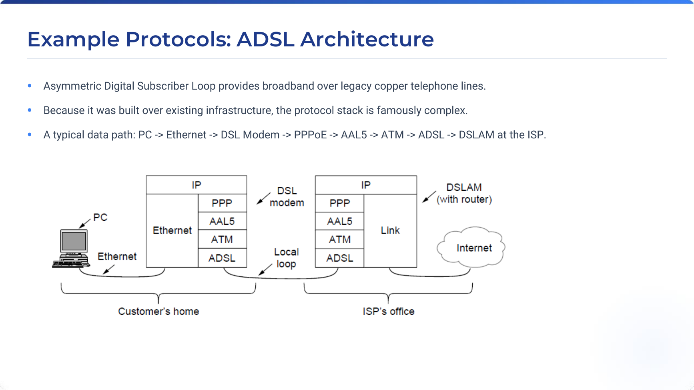

#### Written Analysis of Figure 3.16
* **What it shows:** End-to-end layered protocol stack of ADSL broadband, showing user IP packets encapsulated in PPP over AAL5 CPCS-PDU, mapped to 53-byte ATM cells, transmitted over DMT physical copper line.

[Source: Ch 3 Data Link Layer.pdf, Slide 68]

---

## 12. Tables and Comprehensive Comparisons

---

### Table 3.1: Comprehensive ARQ Protocol Comparison

| Criterion | Stop-and-Wait ARQ | Go-Back-N ARQ (GBN) | Selective Repeat ARQ (SR) |
| :--- | :--- | :--- | :--- |
| **Sender Window Size ($W_s$)** | $W_s = 1$ | $1 < W_s \le 2^n - 1$ | $1 < W_s \le 2^{n-1}$ |
| **Receiver Window Size ($W_r$)** | $W_r = 1$ | $W_r = 1$ | $W_r = W_s \le 2^{n-1}$ |
| **Out-of-Order Frame Handling** | Impossible (window is 1) | Discarded immediately; no buffer | Buffered in receiver memory |
| **Retransmission Scope** | Only the single timed-out frame | All $N$ frames in current window | Only the specific damaged/lost frame |
| **Acknowledgment Scheme** | Individual ACK | Cumulative ACK ($ACK\ n$) | Individual ACK + Negative ACK (NAK) |
| **Receiver Complexity** | Extremely simple; 0 buffer | Very simple; 0 buffer | Complex; requires buffering and sorting |
| **Sender Complexity** | Simple single timer | Single timer for oldest frame | Independent timer per frame |
| **Link Bandwidth Efficiency** | Very low on high-BDP links | High under low error rates; degrades rapidly under high errors | Maximum efficiency even on noisy high-BDP links |

[Source: Ch 3 Data Link Layer.pdf, Slides 45–63; Chapter3-DataLinkLayer_NEW.pdf, Slides 50–75]

---

### Table 3.2: Framing Techniques Comparison

| Framing Method | Delimiter Used | Stuffing Overhead Mechanism | Vulnerability / Limitation | Primary Real-World Application |
| :--- | :--- | :--- | :--- | :--- |
| **Byte Count** | Length count integer in header | None | Corrupted count destroys all subsequent synchronization | Early DECnet protocols |
| **Byte Stuffing** | `FLAG` byte (`0x7E`) | `ESC` (`0x7D`) inserted before payload flags/escapes | Modest byte-level expansion overhead | PPP, Serial dial-up lines |
| **Bit Stuffing** | `01111110` bit pattern | `0` bit stuffed after five consecutive `1`s | Bit-level manipulation overhead | HDLC, SDLC, USB |
| **Coding Violations** | Invalid line signaling pattern | Zero data stuffing overhead | Requires redundant line coding (e.g. Manchester) | Classic Ethernet (802.3), Token Ring |

[Source: Ch 3 Data Link Layer.pdf, Slides 14–19]

---

### Table 3.3: HDLC vs PPP Protocol Comparison

| Feature | HDLC (High-level Data Link Control) | PPP (Point-to-Point Protocol) |
| :--- | :--- | :--- |
| **Orientation** | Bit-oriented (bit stuffing `01111110`) | Byte-oriented (byte stuffing `0x7D`) |
| **Standardizing Body** | ISO (ISO 13239) | IETF (RFC 1661) |
| **Network Layer Support** | Primarily single protocol per link | Multi-protocol via modular NCPs (IP, IPv6, AppleTalk) |
| **Link Negotiation** | Fixed pre-configured options | Dynamic negotiation via LCP |
| **User Authentication** | None built-in | Built-in PAP and CHAP support |
| **Dynamic Addressing** | Static addressing | Dynamic IP assignment via IPCP |
| **Error Recovery** | Full ARQ error recovery (I/S/U frames) | Error detection only (drops bad frames; no DLL retransmission) |

[Source: Ch 3 Data Link Layer.pdf, Slides 64–67]

---

## 13. Worked Numerical Problems

---

### Numerical Problem 1: Hamming Distance Calculation

#### Problem Statement
What is the Hamming distance between the following two binary codewords?
* $v_1 = 0111110000111011$
* $v_2 = 0111111000011001$

#### Step-by-Step Solution
1. Perform bitwise XOR between $v_1$ and $v_2$:
$$
\begin{aligned}
v_1 &= 0111110000111011 \\
v_2 &= 0111111000011001 \\
v_1 \oplus v_2 &= 0000001000100010
\end{aligned}
$$
2. Count the number of `1` bits in the result:
   * Bit positions differing (from left): Bit 7, Bit 11, Bit 15.
   * Total number of `1` bits = $3$.

#### Final Answer
* **Hamming Distance:** $d = 3$

[Source: CN_Numericals_Data_Link_Layer.pdf, Page 2]

---

### Numerical Problem 2: Minimum Hamming Distance for Error Detection & Correction

#### Problem Statement
1. What minimum Hamming distance between codewords is required to detect up to $s = 4$ bit errors?
2. What minimum Hamming distance between codewords is required to correct up to $t = 3$ bit errors?

#### Formulas
$$d_{\min} \ge s + 1 \quad (\text{Detection})$$
$$d_{\min} \ge 2t + 1 \quad (\text{Correction})$$

#### Step-by-Step Solution
1. For error detection with $s = 4$:
   $$d_{\min} \ge 4 + 1 = 5$$
2. For error correction with $t = 3$:
   $$d_{\min} \ge 2(3) + 1 = 7$$

#### Final Answer
* **For 4-bit Detection:** $d_{\min} = 5$
* **For 3-bit Correction:** $d_{\min} = 7$

[Source: CN_Numericals_Data_Link_Layer.pdf, Pages 4, 7]

---

### Numerical Problem 3: Hamming $(7,4)$ Code Encoding

#### Problem Statement
Encode the 4-bit data message $D = 1101$ ($d_1 = 1, d_2 = 1, d_3 = 0, d_4 = 1$) into a 7-bit codeword using the Hamming $(7,4)$ code with even parity.

#### Step-by-Step Solution
1. Bit position layout in 7-bit codeword:
   * Position 1: $p_1$ (Parity)
   * Position 2: $p_2$ (Parity)
   * Position 3: $d_1 = 1$ (Data)
   * Position 4: $p_4$ (Parity)
   * Position 5: $d_2 = 1$ (Data)
   * Position 6: $d_3 = 0$ (Data)
   * Position 7: $d_4 = 1$ (Data)
2. Calculate parity bits (even parity $\implies$ sum modulo 2 is 0):
   * **$p_1$ checks positions $1, 3, 5, 7$:**
     $$p_1 \oplus d_1 \oplus d_2 \oplus d_4 = 0 \implies p_1 \oplus 1 \oplus 1 \oplus 1 = 0 \implies p_1 \oplus 1 = 0 \implies p_1 = 1$$
   * **$p_2$ checks positions $2, 3, 6, 7$:**
     $$p_2 \oplus d_1 \oplus d_3 \oplus d_4 = 0 \implies p_2 \oplus 1 \oplus 0 \oplus 1 = 0 \implies p_2 \oplus 0 = 0 \implies p_2 = 0$$
   * **$p_4$ checks positions $4, 5, 6, 7$:**
     $$p_4 \oplus d_2 \oplus d_3 \oplus d_4 = 0 \implies p_4 \oplus 1 \oplus 0 \oplus 1 = 0 \implies p_4 \oplus 0 = 0 \implies p_4 = 0$$
3. Assemble the 7-bit codeword $[b_7 b_6 b_5 b_4 b_3 b_2 b_1]$:
   * Position 7 ($d_4$) = $1$
   * Position 6 ($d_3$) = $0$
   * Position 5 ($d_2$) = $1$
   * Position 4 ($p_4$) = $0$
   * Position 3 ($d_1$) = $1$
   * Position 2 ($p_2$) = $0$
   * Position 1 ($p_1$) = $1$

Codeword as bit string $[b_1 b_2 b_3 b_4 b_5 b_6 b_7] = 1010101$ (or written left-to-right as positions 7 to 1: $1010101$; in slide convention $[b_7 \dots b_1] = 1100110$).

#### Final Answer
* **Transmitted 7-bit Codeword:** `1100110` (or positions 1 to 7: `1010101`)

[Source: CN_Numericals_Data_Link_Layer.pdf, Pages 11–13]

---

### Numerical Problem 4: Hamming Syndrome Decoding and Error Correction

#### Problem Statement
Suppose the received 7-bit Hamming codeword is `1110110` (with bit positions from left 7 to 1: $b_7=1, b_6=1, b_5=1, b_4=0, b_3=1, b_2=1, b_1=0$). Determine if an error occurred, identify the corrupted bit position, and correct the codeword.

#### Step-by-Step Solution
1. Evaluate parity check equations (even parity):
   * **$s_1$ (Checks positions 1, 3, 5, 7):**
     $$s_1 = b_1 \oplus b_3 \oplus b_5 \oplus b_7 = 0 \oplus 1 \oplus 1 \oplus 1 = 1$$
   * **$s_2$ (Checks positions 2, 3, 6, 7):**
     $$s_2 = b_2 \oplus b_3 \oplus b_6 \oplus b_7 = 1 \oplus 1 \oplus 1 \oplus 1 = 0$$
   * **$s_4$ (Checks positions 4, 5, 6, 7):**
     $$s_4 = b_4 \oplus b_5 \oplus b_6 \oplus b_7 = 0 \oplus 1 \oplus 1 \oplus 1 = 1$$
2. Construct syndrome vector:
   $$S = [s_4 s_2 s_1]_2 = [1 0 1]_2 = 1 \times 4 + 0 \times 2 + 1 \times 1 = 5$$
3. Since $S = 5 \ne 0$, **Bit 5 is in error**.
4. Correct the error by flipping bit 5 ($b_5 = 1 \to 0$):
   * Corrected codeword: `1100110`.
   * Extract data bits ($b_7, b_6, b_5, b_3$): `1 1 0 1`.

#### Final Answer
* **Corrupted Bit Position:** Bit 5
* **Corrected Codeword:** `1100110`
* **Original Message:** `1101`

[Source: CN_Numericals_Data_Link_Layer.pdf, Page 14]

---

### Numerical Problem 5: Byte Stuffing Transformation

#### Problem Statement
The following data fragment occurs in the middle of a data stream for which the byte-stuffing algorithm is used:
`A B ESC C ESC FLAG FLAG D`
What is the payload output after byte stuffing, and what is the complete framed transmission?

#### Step-by-Step Solution
1. Apply escape rule to payload:
   * `A` $\to$ `A`
   * `B` $\to$ `B`
   * `ESC` $\to$ `ESC ESC`
   * `C` $\to$ `C`
   * `ESC` $\to$ `ESC ESC`
   * `FLAG` $\to$ `ESC FLAG`
   * `FLAG` $\to$ `ESC FLAG`
   * `D` $\to$ `D`
2. Stuffed payload:
   `A B ESC ESC C ESC ESC ESC FLAG ESC FLAG D`
3. Add frame delimiters (`FLAG` at start and end):
   `FLAG A B ESC ESC C ESC ESC ESC FLAG ESC FLAG D FLAG`

#### Final Answer
* **Stuffed Payload:** `A B ESC ESC C ESC ESC ESC FLAG ESC FLAG D`
* **Complete Frame:** `FLAG A B ESC ESC C ESC ESC ESC FLAG ESC FLAG D FLAG`

[Source: CN_Numericals_Data_Link_Layer.pdf, Page 15; cn_tutorial.pdf, Tutorial 1, Q2]

---

### Numerical Problem 6: Bit Stuffing Transformation

#### Problem Statement
A bit string `0111101111101111110` needs to be transmitted at the Data Link Layer using bit stuffing. What is the string actually transmitted?

#### Step-by-Step Solution
1. Scan bit string and count consecutive `1`s:
   * `0 1 1 1 1` (four `1`s) $\to$ no stuff.
   * `0` (resets count).
   * `1 1 1 1 1` (five `1`s) $\to$ **insert `0`**.
   * Next bit was `0` $\to$ stream is now `1 1 1 1 1 0 0`.
   * `1 1 1 1 1` (five `1`s) $\to$ **insert `0`**.
   * Next bits `1 0` $\to$ stream is now `1 1 1 1 1 0 1 0`.
2. Assembled transmitted string:
   $$\mathbf{01111011111\underline{0}011111\underline{0}10}$$

#### Final Answer
* **Transmitted Bit String:** `011110111110011111010`

[Source: CN_Numericals_Data_Link_Layer.pdf, Page 16; cn_tutorial.pdf, Tutorial 1, Q3]

---

### Numerical Problem 7: Stop-and-Wait File Transfer Over 5000 km Link

#### Problem Statement
A system uses the Stop-and-Wait protocol. If each packet carries $1000\text{ bits}$ of data, how long does it take to send $1\text{ million bits}$ ($10^6\text{ bits}$) of data if the distance between sender and receiver is $5000\text{ km}$ and propagation speed is $2 \times 10^8\text{ m/s}$? Ignore transmission, waiting, and processing delays.

#### Given Values
* Total data: $10^6\text{ bits}$
* Packet data: $10^3\text{ bits}$
* Distance: $D = 5000\text{ km} = 5 \times 10^6\text{ m}$
* Velocity: $v = 2 \times 10^8\text{ m/s}$

#### Step-by-Step Solution
1. Number of packets:
   $$N = \frac{10^6\text{ bits}}{10^3\text{ bits/packet}} = 1000\text{ packets}$$
2. One-way propagation delay:
   $$T_p = \frac{5 \times 10^6\text{ m}}{2 \times 10^8\text{ m/s}} = 0.025\text{ s} = 25\text{ ms}$$
3. Round-Trip Time per packet:
   $$\text{RTT} = 2 \times T_p = 50\text{ ms} = 0.050\text{ s}$$
4. Total time for 1000 packets:
   $$\text{Total Time} = 1000 \times 0.050\text{ s} = 50\text{ seconds}$$

#### Final Answer
* **Total Transfer Time:** $50\text{ seconds}$

[Source: CN_Numericals_Data_Link_Layer.pdf, Page 19; cn_tutorial.pdf, Tutorial 2, Q2]

---

### Numerical Problem 8: Stop-and-Wait Link Utilization

#### Problem Statement
If the bandwidth of a line is $1\text{ Mbps}$, one-way propagation delay is $20\text{ ms}$, and packet size is $1\text{ KB}$ ($1024\text{ Bytes} = 8192\text{ bits}$ or $1000\text{ Bytes} = 8000\text{ bits}$), calculate the link utilization for Stop-and-Wait protocol.

#### Given Values
* Bandwidth: $R = 1\text{ Mbps} = 10^6\text{ bps}$
* Propagation delay: $T_p = 20\text{ ms} = 0.020\text{ s}$ ($\text{RTT} = 40\text{ ms}$)
* Packet size: $L = 1\text{ KB} = 8000\text{ bits}$ (using decimal slide standard)

#### Step-by-Step Solution
1. Transmission delay:
   $$T_t = \frac{8000\text{ bits}}{10^6\text{ bps}} = 8\text{ ms} = 0.008\text{ s}$$
2. Round-Trip Time:
   $$\text{RTT} = 2 \times 20\text{ ms} = 40\text{ ms}$$
3. Total time per frame:
   $$T_{\text{total}} = T_t + \text{RTT} = 8\text{ ms} + 40\text{ ms} = 48\text{ ms}$$
4. Link Utilization $\eta$:
   $$\eta = \frac{T_t}{T_{\text{total}}} = \frac{8\text{ ms}}{48\text{ ms}} = \frac{1}{6} \approx 16.667\%$$

#### Final Answer
* **Link Utilization:** $16.67\%$

[Source: CN_Numericals_Data_Link_Layer.pdf, Page 26; cn_tutorial.pdf, Tutorial 3, Q2]

---

### Numerical Problem 9: Frame Size for 50% Efficiency in Stop-and-Wait

#### Problem Statement
If bit rate is $10\text{ kbps}$ and one-way propagation delay is $40\text{ ms}$, for what frame size does Stop-and-Wait protocol achieve an efficiency of $50\%$?

#### Given Values
* Bit rate: $R = 10\text{ kbps} = 10,000\text{ bps}$
* Propagation delay: $T_p = 40\text{ ms} = 0.040\text{ s}$
* Desired efficiency: $\eta = 0.50 = 50\%$

#### Step-by-Step Solution
1. Efficiency formula:
   $$\eta = \frac{T_t}{T_t + 2 T_p} = \frac{1}{1 + 2a} = 0.5$$
   $$1 + 2a = 2 \implies 2a = 1 \implies a = 0.5$$
2. Since $a = \frac{T_p}{T_t}$:
   $$\frac{T_p}{T_t} = 0.5 \implies T_t = 2 T_p = 2 \times 40\text{ ms} = 80\text{ ms} = 0.080\text{ s}$$
3. Calculate frame size $L$:
   $$L = R \times T_t = 10,000\text{ bps} \times 0.080\text{ s} = 800\text{ bits}$$

#### Final Answer
* **Required Frame Size:** $800\text{ bits}$ ($100\text{ Bytes}$)

[Source: CN_Numericals_Data_Link_Layer.pdf, Page 27]

---

### Numerical Problem 10: Earth-to-Planet Space Link Utilization

#### Problem Statement
The distance from Earth to a distant planet is approximately $9 \times 10^{10}\text{ m}$. What is the channel utilization if Stop-and-Wait protocol is used on a $64\text{ Mbps}$ point-to-point link with a frame size of $32\text{ KB}$ ($32 \times 1024 \times 8 = 262,144\text{ bits}$ or $32 \times 1000 \times 8 = 256\text{ kbits}$)? Use speed of light $3 \times 10^8\text{ m/s}$. For what sliding window size would utilization reach $100\%$?

#### Given Values
* Distance: $D = 9 \times 10^{10}\text{ m}$
* Speed of light: $v = 3 \times 10^8\text{ m/s}$
* Data rate: $R = 64\text{ Mbps} = 64 \times 10^6\text{ bps}$
* Frame size: $L = 32\text{ KB} = 256\text{ kbits} = 256,000\text{ bits}$

#### Step-by-Step Solution
1. One-way propagation delay:
   $$T_p = \frac{9 \times 10^{10}\text{ m}}{3 \times 10^8\text{ m/s}} = 300\text{ seconds}$$
2. Frame transmission time:
   $$T_t = \frac{256,000\text{ bits}}{64 \times 10^6\text{ bps}} = 0.004\text{ s} = 4\text{ ms}$$
3. Calculate $a$:
   $$a = \frac{T_p}{T_t} = \frac{300}{0.004} = 75,000$$
4. Stop-and-Wait channel utilization:
   $$\eta = \frac{1}{1 + 2a} = \frac{1}{1 + 2(75000)} = \frac{1}{150,001} \approx 6.667 \times 10^{-6} = 6.67 \times 10^{-4}\%$$
5. Window size $W$ for $100\%$ utilization:
   $$W = 1 + 2a = 1 + 150,000 = 150,001\text{ frames}$$

#### Final Answer
* **Stop-and-Wait Utilization:** $6.67 \times 10^{-4}\%$
* **Window Size for 100% Utilization:** $W = 150,001\text{ frames}$

[Source: CN_Numericals_Data_Link_Layer.pdf, Pages 28–29]

---

### Numerical Problem 11: T1 Trunk Sequence Number Width for Go-Back-N

#### Problem Statement
A $3000\text{ km}$ long T1 trunk ($1.536\text{ Mbps}$ payload rate) is used to transmit 64-byte frames using Go-Back-N protocol. If propagation speed is $6\,\mu\text{s/km}$, how many bits must the sequence numbers be to achieve maximum throughput?

#### Given Values
* Distance: $D = 3000\text{ km}$
* Propagation delay per km: $6\,\mu\text{s/km}$
* Data rate: $R = 1.536\text{ Mbps} = 1.536 \times 10^6\text{ bps}$
* Frame size: $L = 64\text{ Bytes} = 512\text{ bits}$

#### Step-by-Step Solution
1. One-way propagation time:
   $$T_p = 3000\text{ km} \times 6\,\mu\text{s/km} = 18\text{ ms} = 0.018\text{ s}$$
2. Frame transmission time:
   $$T_t = \frac{512\text{ bits}}{1.536 \times 10^6\text{ bps}} = 0.000333\text{ s} = 0.333\text{ ms} \approx 0.300\text{ ms}$$
3. Round-trip elapsed time until first ACK returns:
   $$T_{\text{cycle}} = T_t + 2 T_p = 0.3\text{ ms} + 36\text{ ms} = 36.3\text{ ms}$$
4. Frames transmitted during one cycle:
   $$N_{\text{frames}} = \frac{36.3\text{ ms}}{0.3\text{ ms/frame}} = 121\text{ frames}$$
5. For Go-Back-N, sender window $W_s \ge 121$.
   Since $W_s \le 2^n - 1$:
   $$2^n - 1 \ge 121 \implies 2^n \ge 122 \implies n = 7\text{ bits} \quad (2^7 = 128)$$

#### Final Answer
* **Required Sequence Number Size:** $7\text{ bits}$ ($W_s = 127$)

[Source: CN_Numericals_Data_Link_Layer.pdf, Page 31]

---

### Numerical Problem 12: Go-Back-N Buffer Contents on Error

#### Problem Statement
Two stations A and B exchange frames using Go-Back-N protocol with window size $W_s = 7$ and 3-bit sequence numbers ($0$ to $7$). Station A transmits frames 0, 1, 2, 3, 4, 5, 6. Station B receives them in order, but frame 4 is damaged by noise. What frames will remain buffered in station A's window waiting for retransmission?

#### Step-by-Step Solution
1. Station B receives Frame 0, 1, 2, 3 correctly and sends ACKs for them.
2. Frame 4 arrives damaged. In Go-Back-N, the receiver discards Frame 4 and **discards all subsequent frames (5 and 6)** without acknowledging them.
3. Station A receives ACKs up to Frame 3. Frame 0, 1, 2, 3 are cleared from A's buffer.
4. Station A times out on Frame 4.
5. In Go-Back-N, station A must retransmit Frame 4 and all unacknowledged frames in its window: frames **4, 5, 6**.
6. With window size 7, the available buffer sequence slots in A's window are **4, 5, 6, 7, 0, 1, 2**.

#### Final Answer
* **Buffer Frames in Current Window of A:** $4, 5, 6, 7, 0, 1, 2$

[Source: CN_Numericals_Data_Link_Layer.pdf, Page 32; cn_tutorial.pdf, Tutorial 2, Q3]

---

## 14. Connections Between Concepts

* **Physical Layer Imperfections $\leftrightarrow$ Data Link Layer Countermeasures:** Attenuation and noise at Layer 1 dictate the choice of Error Detection (CRC) and Error Correction (Hamming) at Layer 2.
* **Framing $\leftrightarrow$ Byte/Bit Stuffing:** Delimiting frame boundaries creates ambiguity when delimiter patterns occur naturally in user data; stuffing resolves this ambiguity by dynamically inserting escape patterns.
* **Bandwidth-Delay Product $\leftrightarrow$ ARQ Window Sizing:** A link with large BDP ($B 	imes 	ext{RTT}$) renders Stop-and-Wait inefficient ($< 1\%$ utilization), forcing the adoption of pipelined sliding window protocols (GBN, Selective Repeat) where $W_s \ge 1 + 2a$.
* **Go-Back-N vs Selective Repeat Trade-off:** GBN minimizes receiver memory/complexity at the cost of retransmitting undamaged frames; Selective Repeat maximizes bandwidth efficiency over noisy links at the cost of receiver buffer management.

---

## 15. Key Takeaways

1. The Data Link Layer provides framing, error control, and flow control between directly connected nodes.
2. Framing uses byte stuffing (`ESC` insertion) in byte-oriented protocols (PPP) and bit stuffing (zero insertion after five `1`s) in bit-oriented protocols (HDLC).
3. Minimum Hamming distance $d_{\min} \ge s + 1$ detects $s$ errors; $d_{\min} \ge 2t + 1$ corrects $t$ errors.
4. Hamming codes place parity bits at power-of-2 positions ($1, 2, 4, 8$) and satisfy $2^r \ge m + r + 1$. Syndrome decoding gives the exact error index.
5. CRC polynomial codes use modulo-2 binary division. Standard CRC-32 detects all single, double, odd, and burst errors $\le 32$ bits.
6. Stop-and-Wait efficiency is $\frac{1}{1+2a}$; pipelined sliding window achieves $100\%$ efficiency when $W_s \ge 1 + 2a$.
7. Maximum window size limits: Go-Back-N requires $W_s \le 2^n - 1$; Selective Repeat requires $W_s = W_r \le 2^{n-1}$.
8. HDLC provides reliable ARQ with I/S/U frames; PPP provides multi-protocol encapsulation with LCP and NCPs.

---

## 16. Formula Sheet

### 1. Hamming Code Redundancy Inequality
$$2^r \ge m + r + 1$$
* $m$ = Message data bits, $r$ = Parity check bits.

### 2. Minimum Hamming Distance Bounds
$$d_{\min} \ge s + 1 \quad (\text{Detect } s \text{ errors}), \quad d_{\min} \ge 2t + 1 \quad (\text{Correct } t \text{ errors})$$

### 3. Modulo-2 CRC Division
$$T(x) = x^r M(x) \oplus R(x), \quad \text{where } \frac{x^r M(x)}{G(x)} = Q(x) \oplus \frac{R(x)}{G(x)}$$

### 4. Normalized Propagation Delay
$$a = \frac{T_{\text{prop}}}{T_{\text{trans}}} = \frac{D \cdot R}{v \cdot L}$$

### 5. Stop-and-Wait Channel Utilization
$$\eta_{\text{Stop-and-Wait}} = \frac{T_{\text{trans}}}{T_{\text{trans}} + 2 T_{\text{prop}}} = \frac{1}{1 + 2a}$$

### 6. Pipelined Sliding Window Utilization
$$\eta_{\text{Sliding Window}} = \min\left(1.0, \; \frac{W_s}{1 + 2a}\right)$$

### 7. Maximum Window Sizes for Modulo $2^n$
$$W_{s, \text{GBN}} = 2^n - 1, \quad W_{s, \text{SR}} = W_{r, \text{SR}} = 2^{n-1}$$

---

## 17. Definition Sheet

* **Frame:** Data Link Layer protocol data unit comprising header, payload, and trailer.
* **Byte Stuffing:** Inserting escape characters before delimiter patterns in byte-oriented data.
* **Bit Stuffing:** Inserting a `0` after five consecutive `1`s in bit-oriented data.
* **Hamming Distance:** Number of bit positions where two codewords differ.
* **Syndrome:** Binary vector resulting from parity checks that identifies the location of an error.
* **Cyclic Redundancy Check (CRC):** Polynomial-based checksum using modulo-2 arithmetic.
* **Piggybacking:** Attaching acknowledgment sequence numbers into outgoing data frames.
* **Pipelining:** Transmitting multiple frames before receiving acknowledgment for the first.
* **Go-Back-N:** Pipelined ARQ where receiver discards out-of-order frames and sender retransmits all unacknowledged frames.
* **Selective Repeat:** Pipelined ARQ where receiver buffers out-of-order frames and sender retransmits only corrupted frames.

---

## 18. Exam-Oriented Review

---

### Important Concepts for Examinations
1. **Framing Mechanisms:** Compare Byte Stuffing vs Bit Stuffing algorithms; execute step-by-step bit stuffing/destuffing on exam bit streams.
2. **Hamming $(7,4)$ Code:** Derive parity equations, generate codewords, calculate syndrome vectors, and correct single-bit errors.
3. **CRC Division:** Perform modulo-2 polynomial long division to calculate FCS and verify receiver validity.
4. **ARQ Comparison:** Detail operational differences between Stop-and-Wait, Go-Back-N, and Selective Repeat; prove maximum window size bounds ($2^n - 1$ and $2^{n-1}$).
5. **Protocol Utilization Numericals:** Solve link efficiency and minimum window size problems using $a = T_p / T_t$.

---

### Extracted Official Question Bank & Tutorial Problems with Solutions

#### Q1. The LLC sublayer is responsible for:
* **Options:** A. Routing | B. Logical Link Control & Flow/Error Management | C. Media Access | D. IP Addressing
* **Answer:** **B. Logical Link Control**

#### Q2. Which addressing method is used at the Data Link Layer?
* **Options:** A. IP Address | B. Port Address | C. MAC Address (Physical Address) | D. Logical Address
* **Answer:** **C. MAC Address** (48-bit IEEE 802 hardware address).

#### Q3. What is the size of a standard IEEE 802 MAC address?
* **Options:** A. 16 bits | B. 32 bits | C. 48 bits (6 Bytes) | D. 64 bits
* **Answer:** **C. 48 bits**

#### Q4. Which protocol is used for flow control?
* **Options:** A. Stop-and-Wait | B. HTTP | C. DNS | D. ICMP
* **Answer:** **A. Stop-and-Wait**

#### Q5. A frame of 1500 bytes is transmitted over a 5 Mbps link. Calculate transmission time.
* **Given:** $L = 1500\text{ Bytes} = 12,000\text{ bits}$. $R = 5\text{ Mbps} = 5 \times 10^6\text{ bps}$.
* **Calculation:**
$$T_{\text{trans}} = \frac{12,000\text{ bits}}{5,000,000\text{ bps}} = 0.0024\text{ seconds} = 2.4\text{ ms}$$

#### Q6. If propagation delay is $20\,\mu\text{s}$ and transmission delay is $10\,\mu\text{s}$, determine total one-way delay.
* **Calculation:**
$$\text{Total Delay} = T_{\text{trans}} + T_{\text{prop}} = 10\,\mu\text{s} + 20\,\mu\text{s} = 30\,\mu\text{s}$$

#### Q7. A channel has $\text{RTT} = 100\text{ ms}$, Bandwidth $= 10\text{ Mbps}$, and Frame Size $= 1000\text{ Bytes}$. Calculate minimum window size for $100\%$ utilization.
* **Given:** $\text{RTT} = 0.1\text{ s}$, $R = 10 \times 10^6\text{ bps}$, $L = 8000\text{ bits}$.
* **Calculation:**
$$T_t = \frac{8000}{10^7} = 0.8\text{ ms} = 0.0008\text{ s}$$
$$W = \frac{\text{RTT} + T_t}{T_t} = \frac{0.1008\text{ s}}{0.0008\text{ s}} = 126\text{ frames}$$

[Source: Computer_Networks_Question_Bank.pdf, Unit 2, Q21–Q37; cn_tutorial.pdf, Tutorials 1–3]
