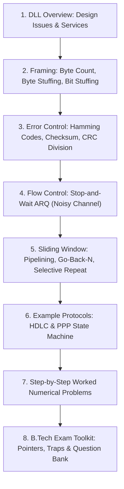
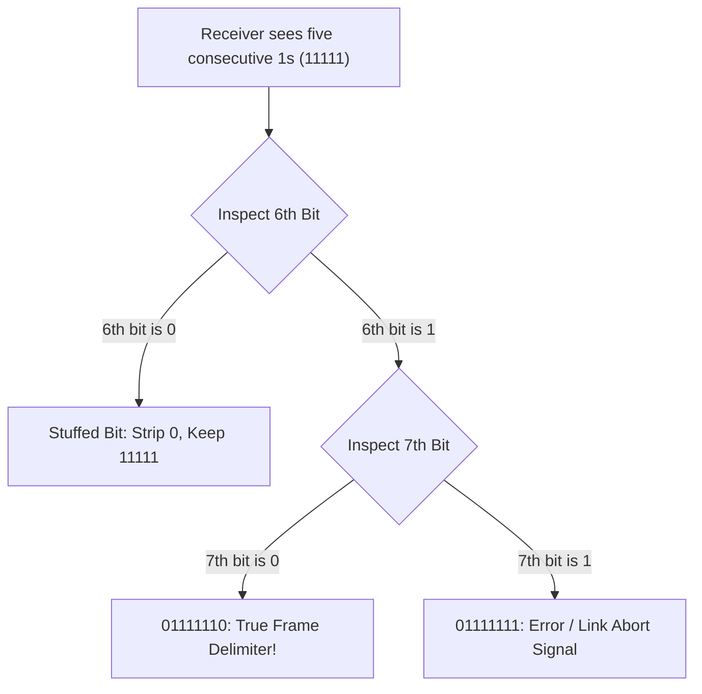
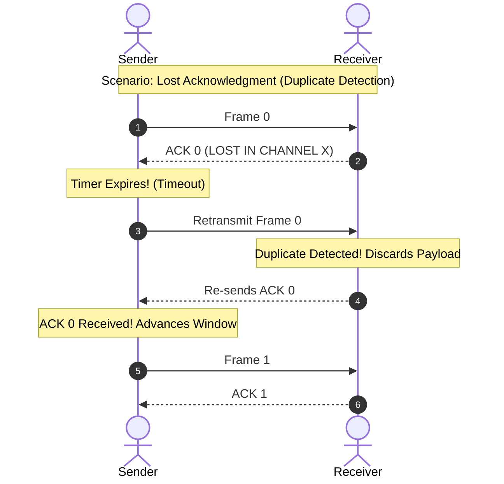
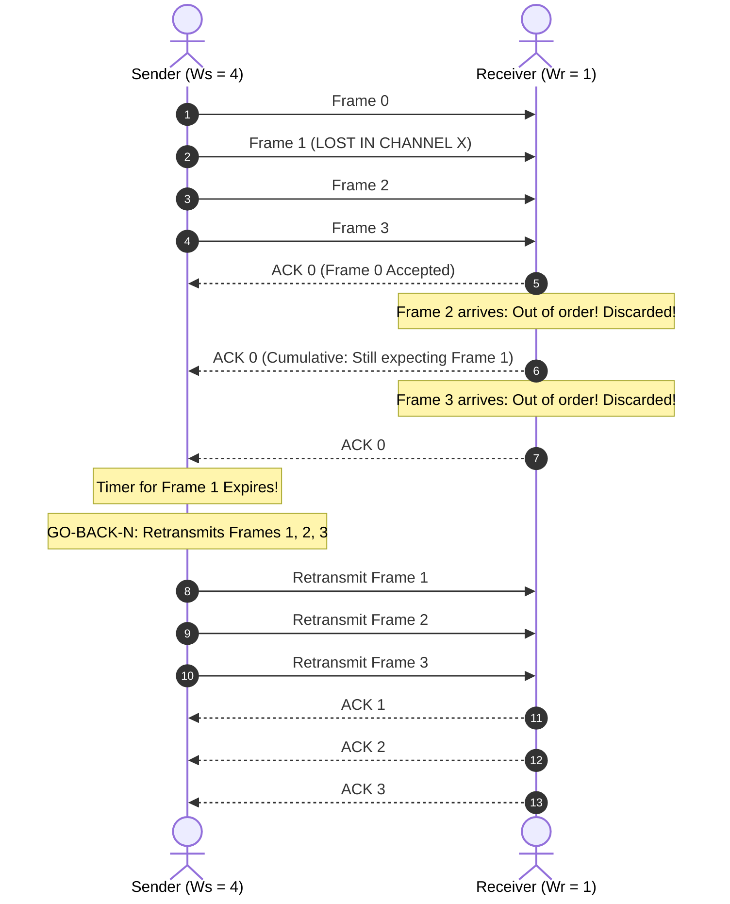
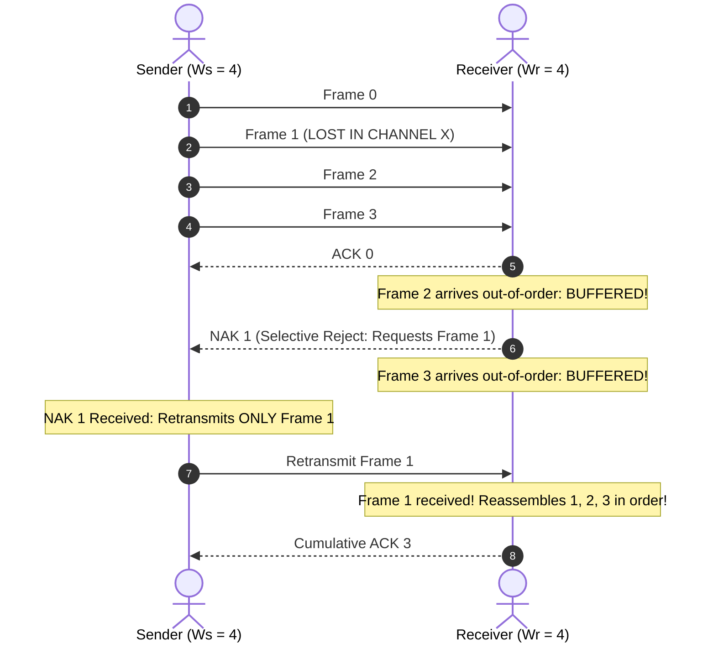
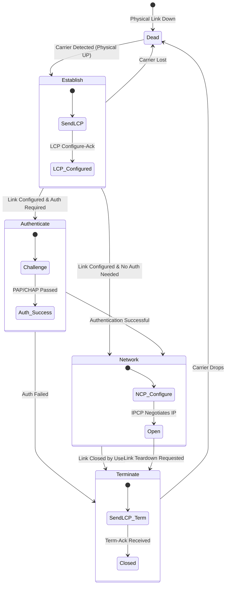

# Complete Computer Networks Notes: Data Link Layer

> **Course Code:** Computer Networks (CompNet)  
> **Course Title:** Computer Networks & Data Communications  
> **Target Audience:** Undergraduate B.Tech / BE Computer Science & Information Technology  
> **Textbook Alignment:** Tanenbaum (Computer Networks, 5th/6th Ed.), Kurose & Ross (Computer Networking: A Top-Down Approach), Forouzan (Data Communications and Networking)  
> **Core Focus:** Conceptual Clarity, Step-by-Step Framing, CRC & Hamming Code Numericals, Sliding Window Protocols (Stop-and-Wait, GBN, SR), Verified Diagrams, and B.Tech Exam Prep  

---

## Pedagogical Roadmap & Chapter Navigation



---

# Chapter 3 — Data Link Layer

---

## 1. Overview & Core Design Issues

The **Data Link Layer (DLL)** is Layer 2 of the ISO/OSI reference model. Its fundamental architectural mission is to **transform a raw, error-prone physical transmission facility into an apparently reliable, well-structured communication link** for the Network Layer (Layer 3).

```
Host A (Sender)                                              Host B (Receiver)
+-------------------------+                                  +-------------------------+
| Network Layer (Layer 3) |                                  | Network Layer (Layer 3) |
+-------------------------+                                  +-------------------------+
             | Network Packet (SDU)                                       ^ Packet
             v                                                            |
+-------------------------+      Virtual Node-to-Node Link   +-------------------------+
|  Data Link Layer (L2)   | <==============================> |  Data Link Layer (L2)   |
| [ Header | Packet | FCS]|                                  | [Verifies FCS & Strips] |
+-------------------------+                                  +-------------------------+
             | Frame as Raw Bits                                          ^ Bitstream
             v                                                            |
+-------------------------+                                  +-------------------------+
| Physical Layer (Layer 1)| ================================ | Physical Layer (Layer 1)|
+-------------------------+       Physical Medium (Cable)    +-------------------------+
```

### 1.1 The Three Core Design Challenges of Layer 2

1. **Framing:** The physical layer transmits an unformatted, continuous stream of raw bits. The Data Link Layer must chop this continuous bitstream into discrete, identifiable logical units called **frames**, with unambiguous boundary markers.
2. **Error Control:** Physical lines suffer from attenuation, noise spikes, and thermal interference. The DLL must detect corrupted bits using mathematical check codes (Parity, Checksum, CRC) and request retransmission of damaged or lost frames (ARQ).
3. **Flow Control:** Throttles a high-speed transmitting host so it does not send data faster than a slow receiver can buffer and process, avoiding receiver memory overrun.

---

### 1.2 Services Provided to the Network Layer

The Data Link Layer provides three distinct types of service to Layer 3:

| Service Type | Connection Setup? | Frame Acknowledgments? | Loss / Error Recovery? | Typical Use Case & Rationale |
| :--- | :---: | :---: | :---: | :--- |
| **1. Unacknowledged Connectionless** | **No** | **No** | None (left to Layer 4 TCP) | **Low error-rate wired links (Ethernet, Fiber)** and real-time voice/video streaming where retransmissions cause unacceptable jitter. |
| **2. Acknowledged Connectionless** | **No** | **Yes** (Per-frame ACK/Timer) | Immediate local retransmission | **High error-rate wireless links (Wi-Fi 802.11, Cellular)**. It is far faster to recover a lost frame locally over 1 ms wireless than waiting 100 ms for end-to-end TCP timeout. |
| **3. Acknowledged Connection-Oriented** | **Yes** (3 phases) | **Yes** (Strict order, sequence IDs) | Guaranteed exactly-once ordered delivery | Long-distance point-to-point satellite trunks, legacy telecommunication circuits (X.25, HDLC ABM). |

---

## 2. Framing Techniques

Because the physical layer delivers a continuous stream of bits without markers, the receiver must know where each frame starts and ends. The four primary framing methods are:

---

### Method 1: Byte Count (Character Count)

#### Mechanism
The frame header includes an integer field that specifies the total number of bytes contained in the frame (including the byte count byte itself).

```
Frame 1 (5 bytes)       Frame 2 (5 bytes)       Frame 3 (8 bytes)
+---+---+---+---+---+   +---+---+---+---+---+   +---+---+---+---+---+---+---+---+
| 5 | A | B | C | D |   | 5 | E | F | G | H |   | 8 | I | J | K | L | M | N | O |
+---+---+---+---+---+   +---+---+---+---+---+   +---+---+---+---+---+---+---+---+
```

#### Fatal Flaw (Synchronization Disaster — B.Tech Exam Question)
If a single bit error corrupts the count field (e.g., the `5` in Frame 2 is flipped to a `7`), the receiver reads 7 bytes, interprets data byte `G` as the count field of Frame 3, and completely loses frame synchronization. Even if checksums detect errors, the receiver cannot find the start of the next valid frame. Therefore, **byte count is never used alone**.

---

### Method 2: Flag Bytes with Byte Stuffing (Character-Oriented Framing)

#### Mechanism
Every frame begins and ends with a reserved delimiter byte called a **Flag Byte** (conventionally `0x7E` in hexadecimal, or ASCII `DLE STX` / `DLE ETX`).

* **The Problem:** What if the binary user payload contains a byte identical to `0x7E` (e.g., in a compiled C program or JPEG image)? The receiver would prematurely terminate the frame!
* **The Solution (Byte Stuffing):** The sender scans the payload. Whenever an accidental `FLAG` or `ESC` (`0x1B`) byte appears in the data, the sender inserts an **Escape Byte (`ESC`)** immediately before it.
* **Receiver Action:** When the receiver sees an `ESC` byte, it removes the `ESC` and treats the following byte as pure data. An unescaped `FLAG` byte always marks a true frame boundary.

```
1. Original Payload:
   [ A ] [ B ] [ ESC ] [ C ] [ FLAG ] [ D ]

2. Stuffed Transmitted Frame:
   +------+-----+-----+-------+-----+-----+-------+------+-----+------+
   | FLAG |  A  |  B  |  ESC  | ESC |  C  |  ESC  | FLAG |  D  | FLAG |
   +------+-----+-----+-------+-----+-----+-------+------+-----+------+
                         ^ Stuffed           ^ Stuffed
```

#### Step-by-Step Byte Stuffing Example:
* **Given Data:** `D  ESC  FLAG  ESC  E`
* **Transmitted Frame:** `FLAG  D  ESC ESC  ESC FLAG  ESC ESC  E  FLAG`
* **Receiver Recovery:** Strips `FLAG` markers, removes the first `ESC` of every pair, leaving the original payload: `D  ESC  FLAG  ESC  E`.

---

### Method 3: Flag Bits with Bit Stuffing (Bit-Oriented Framing / HDLC)

This is the **most important framing method** tested in exams and used in HDLC, SDLC, and PPP.

#### Mechanism
* Frame delimiter is a special 8-bit pattern: **`01111110`** (a `0`, six consecutive `1`s, and a `0`).
* **Sender Rule:** Whenever the transmitter encounters **FIVE consecutive `1`s** in the incoming data bitstream, it **automatically inserts a `0` bit** into the outgoing stream, regardless of what the next bit is.
* **Receiver Rule:** Whenever the receiver observes five consecutive `1`s:
  1. If the 6th bit is a **`0`**, it was stuffed by the sender: **strip the `0` bit** and restore the original data.
  2. If the 6th bit is a **`1`** and the 7th bit is a **`0`** (`01111110`), it is a **true frame delimiter FLAG**!
  3. If the 6th and 7th bits are both `1` (`01111111...`), an error or link abort has occurred.



#### Step-by-Step Bit Stuffing Example (Exam Standard)
**Given Input Bitstream:**  
`0 1 1 0 1 1 1 1 1 1 0 1 1 1 1 1 0 1 0`

* **Step 1: Scan and Stuff:**
  * Bits `0 1 1 0`: unchanged.
  * Five consecutive 1s: `1 1 1 1 1` $\to$ **Stuff `0`**: `1 1 1 1 1 0`
  * Next bit from data is `1`, followed by `0 1`: `1 0 1`
  * Next five consecutive 1s: `1 1 1 1 1` $\to$ **Stuff `0`**: `1 1 1 1 1 0`
  * Remaining bits: `0 1 0`
* **Transmitted Bitstream (Stuffed):**  
  `0 1 1 0 1 1 1 1 1`**`0`**`1 0 1 1 1 1 1`**`0`**`0 1 0`
* **Transmitted Frame with Flags:**  
  `[01111110] 011011111010111110010 [01111110]`

---

### Method 4: Physical Layer Coding Violations

Used in networks that employ redundant physical line coding (e.g., Manchester or 4B/5B encoding).
* In standard Manchester encoding, every bit must have a mid-bit transition (Low-to-High for `0`, High-to-Low for `1`).
* Signal states with **High-High** (no transition) or **Low-Low** (no transition) are illegal for data.
* These **illegal signal transitions (coding violations)** are intentionally used as frame delimiters!
* **Advantage:** Zero framing overhead; not a single data bit or escape byte needs to be stuffed.

---

### Comparison of Framing Techniques

| Technique | Delimiter Type | Overhead | Resynchronization Ability | Typical Protocol |
| :--- | :--- | :--- | :--- | :--- |
| **Byte Count** | Integer length in header | Minimal (1 byte) | **Extremely Poor:** A single corrupted count causes permanent desync. | DDCMP (obsolete) |
| **Byte Stuffing** | Flag byte (`0x7E`) + `ESC` byte | Moderate (can grow up to 100% in worst case) | **Instant:** Resynchronizes on the next unescaped `FLAG` byte. | PPP (character-oriented mode), BISYNC |
| **Bit Stuffing** | Flag pattern `01111110` + stuffed `0`s | Very Low ($\approx 12.5\%$ worst case, $< 2\%$ typical) | **Instant:** Resynchronizes on the next `01111110` flag. | HDLC, SDLC, PPP (bit-synchronous mode) |
| **Coding Violations** | Illegal physical waveforms | **Zero bits** | **Instant:** Pure hardware delimiter. | Classic 10 Mbps Ethernet (Manchester), Token Ring |

---

## 3. Error Detection and Correction

Transmission lines suffer from thermal noise, signal distortion, and lightning/electrical spikes. These induce two types of errors:
1. **Single-Bit Errors:** A single isolated bit is inverted (e.g., `0` becomes `1`). Common in white Gaussian thermal noise.
2. **Burst Errors:** A noise burst of duration $t$ corrupts a contiguous block of $B$ bits ($B = t \times \text{Data Rate}$). In high-speed networks (e.g., 1 Gbps), a tiny 1-millisecond electrical spark wipes out **1,000,000 contiguous bits**!

---

### 3.1 Hamming Codes & Error-Correcting Theory

Devised by Richard Hamming in 1950. An $(n, k)$ block code takes an $m$-bit dataword and appends $r$ check bits to create an $n$-bit **codeword** ($n = m + r$).

#### 1. Hamming Distance ($d$)
The **Hamming distance** between two binary words of equal length is the **number of bit positions in which they differ**.
* Computed by bitwise XORing the two words and counting the number of `1`s.
* *Example:* $A = 10\mathbf{1}1\mathbf{0}01$, $B = 10\mathbf{0}1\mathbf{1}01$.  
  $A \oplus B = 0010100 \implies d(A, B) = 2$.

#### 2. Error Detection and Correction Capabilities (The Golden Exam Rules)
Let $d_{\min}$ be the minimum Hamming distance between any two valid codewords in a code:

$$\mathbf{d_{\min} \ge e + 1 \quad \text{(To detect } e \text{ single-bit errors)}}$$

$$\mathbf{d_{\min} \ge 2t + 1 \quad \text{(To correct } t \text{ single-bit errors)}}$$

> **Intuition:**  
> * To detect 2 errors, valid codewords must be at least distance $d_{\min} = 3$ apart. If 1 or 2 bits flip, the resulting corrupted string lands in an invalid space and is detected.  
> * To correct 1 error ($t=1$), valid codewords must be at least distance $d_{\min} = 2(1) + 1 = 3$ apart. A single bit flip moves the codeword to distance 1 from the original codeword and at least distance 2 from any other valid codeword, allowing unambiguous majority-vote correction.

#### 3. Derivation of the Hamming Rule for Parity Bit Sizing
To correct any single-bit error in an $n$-bit codeword ($n = m + r$):
* There are $n$ possible single-bit error positions, plus $1$ state for zero errors $\implies n + 1$ total states.
* With $r$ parity bits, we have $2^r$ distinct syndrome bit patterns.
* Therefore, the number of parity bits $r$ must satisfy the **Hamming Equation**:

$$\mathbf{(m + r + 1) \le 2^r}$$

| Data Bits ($m$) | Redundant Parity Bits ($r$) | Total Codeword Length ($n = m + r$) | Code Name |
| :---: | :---: | :---: | :---: |
| 1 | 2 | 3 | (3, 1) |
| 2, 3, 4 | **3** | **7** | **(7, 4) Hamming Code** |
| 5 to 11 | **4** | **15** | **(15, 11) Hamming Code** |
| 12 to 26 | **5** | **31** | **(31, 26) Hamming Code** |

---

### 3.2 Step-by-Step Construction of the (7, 4) Hamming Code

Let dataword $M = 1011$ ($m = 4$). We want to generate a 7-bit codeword ($n = 7, r = 3$).

#### Step 1: Bit Position Assignment
Parity bits $p_i$ are placed at bit positions that are **powers of 2** ($1, 2, 4, 8, \dots$). Data bits $d_j$ fill the remaining positions:

```
Bit Position:     1      2      3      4      5      6      7
Binary Position: 001    010    011    100    101    110    111
Bit Type:        p1     p2     d3     p4     d5     d6     d7
Data Value:       ?      ?      1      ?      0      1      1
```

#### Step 2: Determine Parity Equations (Even Parity)
Each parity bit checks all bit positions whose binary representation has a `1` in that parity bit's power-of-2 position:
* **$p_1$ (Checks positions with `1` in bit 0: 1, 3, 5, 7):**
  $$p_1 \oplus d_3 \oplus d_5 \oplus d_7 = 0 \implies p_1 \oplus 1 \oplus 0 \oplus 1 = 0 \implies p_1 \oplus 0 = 0 \implies \mathbf{p_1 = 0}$$
* **$p_2$ (Checks positions with `1` in bit 1: 2, 3, 6, 7):**
  $$p_2 \oplus d_3 \oplus d_6 \oplus d_7 = 0 \implies p_2 \oplus 1 \oplus 1 \oplus 1 = 0 \implies p_2 \oplus 1 = 0 \implies \mathbf{p_2 = 1}$$
* **$p_4$ (Checks positions with `1` in bit 2: 4, 5, 6, 7):**
  $$p_4 \oplus d_5 \oplus d_6 \oplus d_7 = 0 \implies p_4 \oplus 0 \oplus 1 \oplus 1 = 0 \implies p_4 \oplus 0 = 0 \implies \mathbf{p_4 = 0}$$

#### Step 3: Resulting Transmitted Codeword
$$\mathbf{T = [p_1, p_2, d_3, p_4, d_5, d_6, d_7] = [0, 1, 1, 0, 0, 1, 1] = 0110011}$$

#### Step 4: Error Detection and Correction at Receiver (Syndrome Calculation)
Suppose transmission noise flips bit 5 ($d_5$ flips from `0` to `1`).  
Received word: $R = 0110\mathbf{1}11$.

The receiver evaluates the **Syndrome Bits** $(s_4, s_2, s_1)$:
* $s_1 = p_1 \oplus d_3 \oplus d_5 \oplus d_7 = 0 \oplus 1 \oplus \mathbf{1} \oplus 1 = \mathbf{1}$
* $s_2 = p_2 \oplus d_3 \oplus d_6 \oplus d_7 = 1 \oplus 1 \oplus 1 \oplus 1 = \mathbf{0}$
* $s_4 = p_4 \oplus d_5 \oplus d_6 \oplus d_7 = 0 \oplus \mathbf{1} \oplus 1 \oplus 1 = \mathbf{1}$

$$\text{Syndrome Vector } \mathbf{S} = s_4 s_2 s_1 = \mathbf{101_2} = \mathbf{5\text{ (decimal)}}$$

* **Conclusion:** The syndrome value directly identifies that **Bit Position 5 is in error**!
* **Correction:** Flip bit 5 from `1` back to `0` $\to 0110011$. Extract data bits $d_3, d_5, d_6, d_7 \implies \mathbf{1011}$ (Original data fully restored!).

---

### 3.3 Cyclic Redundancy Check (CRC / Polynomial Codes)

CRC is the most powerful and widely implemented error-detection technique in networking (Ethernet, Wi-Fi, HDLC, ATM).

#### Principle: Modulo-2 Binary Arithmetic
* Modulo-2 arithmetic uses **bitwise XOR** for both addition and subtraction.
* **No carries, No borrows!**
  $$0 \oplus 0 = 0, \quad 0 \oplus 1 = 1, \quad 1 \oplus 0 = 1, \quad 1 \oplus 1 = 0$$

#### The CRC Algorithm
1. Let dataword $M$ have $m$ bits. Represent it as polynomial $M(x)$.
2. Let the agreed generator polynomial be $G(x)$ of degree $r$ (having $r + 1$ bits). High-order and low-order bits of $G(x)$ must both be `1`.
3. Append $r$ zeros to the dataword: $x^r M(x)$.
4. Divide $x^r M(x)$ by $G(x)$ using modulo-2 long division.
5. The division yields an $r$-bit remainder $R(x)$.
6. Transmitted codeword:
   $$\mathbf{T(x) = x^r M(x) \oplus R(x)}$$
   *(Replace the appended $r$ zeros with the $r$-bit remainder).*
7. **Receiver Verification:** Receiver divides $T(x)$ by $G(x)$. If remainder $= 0$, accept frame. If remainder $\neq 0$, bit error detected; discard frame!

---

#### Step-by-Step Worked CRC Division Example (High-Scoring Exam Model)

**Given:**  
* Dataword $M = \mathbf{1101011011}$ ($m = 10\text{ bits}$)
* Generator Polynomial $G(x) = x^4 + x + 1 \implies \mathbf{10011}$ ($r = 4\text{ bits}$, degree 4)

**Step 1: Append $r = 4$ zeros to data:**  
Dividend = $1101011011\mathbf{0000}$

**Step 2: Modulo-2 Long Division:**

```
             1100001010  (Quotient)
        --------------------------
 10011 | 11010110110000
         10011
         -----
          10011
          10011
          -----
           00001
           00000
           -----
            00010
            00000
            -----
             00101
             00000
             -----
              01011
              00000
              -----
               10110
               10011
               -----
                01010
                00000
                -----
                 10100
                 10011
                 -----
                  01110
                  00000
                  -----
                   1110  <--- Remainder R(x) (4 bits)
```

**Step 3: Construct Transmitted Codeword:**  
$$\text{Codeword } T = \text{Data} \mid R(x) = \mathbf{1101011011} \mid \mathbf{1110} = \mathbf{11010110111110}$$

**Step 4: Receiver Verification (Error-Free):**  
Divide $11010110111110$ by $10011$. The remainder is identically **`0000`** $\implies$ Frame accepted!

**Step 5: Error Detection Demonstration:**  
Suppose bit 3 flips during transmission:  
Received $T' = 11\mathbf{1}10110111110$.  
Performing division by $10011$ yields non-zero remainder **`1001`** $\neq 0 \implies$ Error successfully detected!

---

### 3.4 Internet Checksum (RFC 1071)

Used in IP, TCP, and UDP headers:
1. Treat data as a sequence of 16-bit integers.
2. Sum them using **1's complement arithmetic** (any carry-out from the most significant bit is wrapped around and added to the least significant bit).
3. Take the **1's complement negation** (invert all bits) of the final sum.
4. Receiver sums all 16-bit words including the checksum; an error-free transfer produces all `1`s (`0xFFFF`).

---

## 4. Flow Control & Elementary Data Link Protocols

Flow control prevents a fast sender from flooding a slow receiver with more frames than it can buffer and process.

### 4.1 Protocol 1: Utopian Simplex Protocol
* **Assumptions:** Data transmits in one direction only (simplex). Physical channel is completely error-free. Receiver has infinite buffer storage and infinitely fast processing speed.
* **Mechanism:** Sender generates data in an infinite loop and injects it into the channel. Receiver loops reading frames.
* **Flaw:** Completely unrealistic; ignores frame loss, corruption, and buffer overflow.

---

### 4.2 Protocol 2: Stop-and-Wait Simplex Protocol (For Error-Free Channel)
* **Addresses:** Receiver buffer overrun.
* **Mechanism (Half-Duplex Flow Control):**
  1. Sender transmits exactly **one data frame**.
  2. Sender **stops and waits**; it cannot transmit the next frame until it receives a confirmation dummy frame (**Acknowledgment — ACK**) from the receiver.
  3. Receiver accepts frame, delivers it to its network layer, and sends back an ACK.

```mermaid
sequenceDiagram
    autonumber
    Sender->>Receiver: Data Frame 0
    Note over Receiver: Processes Frame & Prepares ACK
    Receiver-->>Sender: ACK Frame
    Note over Sender: ACK Received; Sender Unblocks
    Sender->>Receiver: Data Frame 1
    Receiver-->>Sender: ACK Frame
```

---

### 4.3 Protocol 3: Stop-and-Wait ARQ (Positive ACK with Retransmission — PAR)

* **Addresses:** Both **channel errors/loss** and **buffer overrun**.
* **Key Innovations:**
  1. **Retransmission Timer:** When the sender transmits a frame, it starts a timer. If an ACK does not return before the timer expires (**timeout**), the sender retransmits the frame.
  2. **Sequence Numbers (1-bit: 0 and 1):** Essential to prevent duplicate frame processing at the receiver.

#### Why is a 1-Bit Sequence Number Strictly Necessary? (Crucial B.Tech Exam Derivation)

Consider what happens if frames have **NO sequence numbers**:
1. Sender transmits Frame A. Receiver receives Frame A and generates an ACK.
2. The **ACK is lost in transit** due to channel noise.
3. Sender's timer expires. Sender retransmits Frame A.
4. The receiver, having no sequence numbers, assumes this retransmitted frame is **brand new data (Frame B)**! It passes a duplicate copy of Frame A to its network layer, corrupting the user file!

**With 1-Bit Sequence Numbers (Alternating Bit Protocol):**
* Sender alternates sequence numbers: $0, 1, 0, 1, 0, \dots$
* If receiver receives Frame 0, sends ACK, and subsequently receives another Frame 0 (because the ACK was lost), the receiver recognizes that Frame 0 is a **duplicate**. It discards the duplicate payload, but **re-sends ACK 0** so the sender can advance to Frame 1!



---

## 5. Sliding Window Protocols

### 5.1 Why Sliding Window? The Link Utilization Crisis

In Stop-and-Wait, the sender is idle for almost the entire Round-Trip Time (RTT).
Let:
* $T_{\text{trans}} = \frac{L}{R}$ = Frame transmission time.
* $T_{\text{prop}} = \frac{D}{v}$ = One-way propagation delay.
* Total cycle time $= T_{\text{trans}} + 2 T_{\text{prop}}$ (neglecting small ACK transmission time).

The **Channel Utilization (Efficiency $\eta$)** of Stop-and-Wait is:

$$\mathbf{\eta_{\text{Stop-and-Wait}} = \frac{T_{\text{trans}}}{T_{\text{trans}} + 2 T_{\text{prop}}} = \frac{1}{1 + 2a}}$$

Where $a$ is the normalized propagation delay:
$$\mathbf{a = \frac{T_{\text{prop}}}{T_{\text{trans}}}}$$

> **Exam Reality Check: The Satellite Link Disaster**  
> Consider a 1 Mbps satellite link with $T_{\text{prop}} = 270\text{ ms}$.  
> For a 1000-byte frame ($8000\text{ bits}$): $T_{\text{trans}} = \frac{8000}{10^6} = 8\text{ ms}$.  
> $$a = \frac{270\text{ ms}}{8\text{ ms}} = 33.75$$  
> $$\eta = \frac{1}{1 + 2(33.75)} = \frac{1}{1 + 67.5} = \frac{1}{68.5} \approx \mathbf{1.46\%}$$  
> The expensive satellite link sits idle and wasted **$98.5\%$ of the time!**

#### The Solution: Pipelining
Instead of waiting for an ACK after each frame, the sender is permitted to transmit up to $W$ frames into the channel pipeline before stopping to wait for ACKs:

$$\mathbf{\eta_{\text{Pipelined}} = \min\left(1, \frac{W}{1 + 2a}\right)}$$

To achieve **100% channel utilization ($\eta = 1$)**, the sender window size must be:
$$\mathbf{W \ge 1 + 2a = 1 + \frac{2 \times T_{\text{prop}}}{T_{\text{trans}}}}$$

---

### 5.2 The Sliding Window Abstraction

* **Sender Window ($W_s$):** The range of sequence numbers that the sender is authorized to transmit without receiving an ACK.
* **Receiver Window ($W_r$):** The range of sequence numbers that the receiver is prepared to accept.

```
Sender Window (Ws = 4):
Already ACKed |           Frames in Flight            | Not Yet Sent
... 0   1   2 | [ 3       4       5       6 ]         |  7   8   9 ...
              +---------------------------+
               Shrinks on Send / Expands on ACK Arrival
```

---

### 5.3 Protocol 4: One-Bit Sliding Window Protocol

* Sequence numbers are 1 bit ($0$ or $1$). Window sizes: $W_s = 1, W_r = 1$.
* Employs **Piggybacking**: When a host wants to send an ACK, it embeds the acknowledgment sequence number inside the header of an outgoing data frame, saving separate packet overhead.
* **Peculiar Flaw (Simultaneous Start Anomaly):** If both sides transmit simultaneously at the exact same instant, both receive valid frames and both advance, causing the protocol to transmit each frame twice, cutting effective bandwidth in half.

---

### 5.4 Protocol 5: Go-Back-N (GBN) ARQ

* **Window Sizes:** Sender Window $\mathbf{W_s > 1}$; Receiver Window $\mathbf{W_r = 1}$.
* **Cumulative Acknowledgment:** An acknowledgment carrying number $n$ confirms that **all frames up to and including $n$ have been received correctly**.
* **Receiver Action:** Since $W_r = 1$, the receiver accepts frames **strictly in sequence**. If frame $k$ is lost or corrupted, the receiver discards frame $k$ and **discards all subsequent frames $k+1, k+2, \dots$**, even if they arrive with zero errors!
* **Sender Recovery:** The sender maintains a timer for the oldest unacknowledged frame. When the timer expires, the sender **"Goes Back $N$" and retransmits all unacknowledged frames** currently in the window.



#### Maximum Window Size Limit for Go-Back-N (B.Tech Favorite Proof)
For an $n$-bit sequence number space ($2^n$ available sequence numbers: $0, 1, \dots, 2^n - 1$):

$$\mathbf{W_s \le 2^n - 1}$$

> **Exam Proof: Why $W_s = 2^n$ FAILS in Go-Back-N**  
> Let $n = 2 \implies 2^n = 4$ sequence numbers ($0, 1, 2, 3$).  
> Suppose we illegally set $W_s = 2^n = 4$.  
> 1. Sender transmits frames $0, 1, 2, 3$.  
> 2. Receiver accepts all four frames in order and advances its window, now expecting Frame $0$ (of the next cycle).  
> 3. Receiver transmits cumulative $\text{ACK } 3$.  
> 4. **Catastrophe:** The ACK is completely lost in the channel.  
> 5. Sender's timer expires. Sender retransmits its window starting with **Frame 0**.  
> 6. Receiver receives Frame 0. But receiver is currently expecting Frame 0 of the *new* cycle!  
> 7. The receiver accepts the old retransmitted Frame 0 as new data $\implies$ **undetected duplicate data corruption!**  
> *Conclusion:* To prevent wrap-around ambiguity, $W_s \le 2^n - 1$.

---

### 5.5 Protocol 6: Selective Repeat (SR) ARQ

* **Window Sizes:** Sender Window $\mathbf{W_s > 1}$; Receiver Window $\mathbf{W_r > 1}$.
* **Buffering at Receiver:** The receiver accepts and buffers out-of-order frames that fall within its window $W_r$.
* **Retransmission:** Only the specific damaged or lost frame is retransmitted, using individual frame timers or **Negative Acknowledgments (NAK / SREJ)**.
* **Advantage:** Dramatically higher throughput than GBN over noisy lines.
* **Disadvantage:** High receiver buffer memory and complex protocol logic.



#### Maximum Window Size Limit for Selective Repeat
For an $n$-bit sequence number space:

$$\mathbf{W_s = W_r \le 2^{n-1} = \frac{2^n}{2}}$$

> **Exam Rule:** In Selective Repeat, the sender and receiver window sizes cannot exceed **half the sequence number space**! (e.g., with 3-bit sequence numbers, $2^3 = 8 \implies W_s = W_r \le 4$).

---

### 5.6 Comprehensive Comparison Table: Stop-and-Wait vs. GBN vs. Selective Repeat

| Parameter | Stop-and-Wait ARQ | Go-Back-N (GBN) ARQ | Selective Repeat (SR) ARQ |
| :--- | :--- | :--- | :--- |
| **Sender Window Size ($W_s$)** | $W_s = 1$ | $W_s \le 2^n - 1$ | $W_s \le 2^{n-1}$ |
| **Receiver Window Size ($W_r$)** | $W_r = 1$ | $W_r = 1$ | $W_r = W_s \le 2^{n-1}$ |
| **Out-of-Order Buffering** | No buffering | Discards all out-of-order frames | Buffers out-of-order frames within $W_r$ |
| **Acknowledgment Mode** | Independent ACK per frame | Cumulative ACK | Individual ACK / NAK (SREJ) |
| **Retransmission Cost** | Retransmits single unacked frame | Retransmits all $N$ frames in current window | Retransmits **only the lost frame** |
| **Link Efficiency ($\eta$)** | $\dfrac{1}{1 + 2a}$ (Extremely poor when $a \gg 1$) | High: $\min\left(1, \dfrac{W_s}{1 + 2a}\right)$ | Highest: $\min\left(1, \dfrac{W_s}{1 + 2a}\right)$ |
| **Complexity & Memory** | Minimal | Low (Receiver needs 0 buffer) | High (Receiver needs large reassembly buffer) |

---

## 6. Real-World Data Link Protocols: HDLC & PPP

### 6.1 HDLC (High-level Data Link Control — ISO 13239)

HDLC is a bit-oriented synchronous data link protocol:
* **Frame Format:**

```
+----------+---------------+--------------+-----------------+----------+----------+
| Flag (1) | Address (1/2) | Control (1/2)| Information (var| FCS (2/4)| Flag (1) |
| 01111110 | Node Address  | Frame Type   | User Payload    | CRC-CCITT| 01111110 |
+----------+---------------+--------------+-----------------+----------+----------+
```

#### The Three HDLC Frame Types (Encoded in Control Field):
1. **Information Frames (I-Frames):** Carry upper-layer user data. Include sender sequence number $N(S)$, piggybacked acknowledgment number $N(R)$, and Poll/Final ($P/F$) bit.
2. **Supervisory Frames (S-Frames):** Carry flow and error control confirmations when there is no reverse data traffic.
   * `RR` (Receive Ready): Positive acknowledgment.
   * `RNR` (Receive Not Ready): Acknowledges frames but pauses sender (flow control choke).
   * `REJ` (Reject): Requests Go-Back-N retransmission starting at $N(R)$.
   * `SREJ` (Selective Reject): Requests Selective Repeat retransmission of frame $N(R)$.
3. **Unnumbered Frames (U-Frames):** Used for link setup, mode negotiation, and disconnection.
   * `SABM` (Set Asynchronous Balanced Mode), `DISC` (Disconnect), `UA` (Unnumbered Acknowledgment).

---

### 6.2 PPP (Point-to-Point Protocol — RFC 1661)

PPP is the standard data link protocol used for point-to-point connections over dialup modems, leased lines, and broadband DSL (PPPoE):

#### PPP Architecture:
1. **Framing:** HDLC-like framing using flag byte `0x7E` and byte stuffing.
2. **LCP (Link Control Protocol):** Negotiates link options, maximum receive unit (MRU), and link quality.
3. **Authentication Protocols:**
   * **PAP (Password Authentication Protocol):** Two-way handshake; sends username and password in cleartext (insecure).
   * **CHAP (Challenge Handshake Authentication Protocol):** Three-way handshake; uses a cryptographic challenge and MD5 hash without sending the password over the wire.
4. **NCP (Network Control Protocol):** A family of protocols that configures network-layer parameters. For IPv4, **IPCP (RFC 1332)** assigns dynamic IP addresses and DNS servers.

#### PPP Link State Transition Machine



---

## 7. Step-by-Step Worked Numerical Problems

### Problem 1: Bit Stuffing Trace
**Question:**  
A bitstream `01111111111001111101` is transmitted using the bit stuffing protocol.  
(a) Show the transmitted bitstream after stuffing.  
(b) How many stuffing bits were injected?

**Solution:**  
Rule: After **every five consecutive `1`s**, inject a `0` bit.  
* Bits: `0 1 1 1 1 1` [STUFF `0`] `1 1 1 1 1` [STUFF `0`] `1 0 0 1 1 1 1 1` [STUFF `0`] `0 1`  
* Transmitted Stream:  
  `0 1 1 1 1 1`**`0`**`1 1 1 1 1`**`0`**`1 0 0 1 1 1 1 1`**`0`**`0 1`  
* Total injected stuffing bits = **3 bits**.

---

### Problem 2: Stop-and-Wait Link Efficiency
**Question:**  
A 1000-km fiber optic cable operates at $R = 100\text{ Mbps}$. Propagation speed is $v = 2 \times 10^8\text{ m/s}$. Frame size is $L = 1250\text{ bytes}$. ACK frames are negligible in size.  
(a) Calculate $T_{\text{trans}}$ and $T_{\text{prop}}$.  
(b) Calculate link efficiency $\eta$ for Stop-and-Wait.  
(c) What sender window size $W$ is required for a sliding window protocol to achieve 100% utilization?

**Solution:**  
**Step 1: Calculate Delays**  
$$L = 1250 \times 8 = 10,000\text{ bits}$$  
$$T_{\text{trans}} = \frac{10,000\text{ bits}}{100 \times 10^6\text{ bps}} = 10^{-4}\text{ s} = 0.1\text{ ms} = \mathbf{100\,\mu\text{s}}$$  
$$D = 1000\text{ km} = 10^6\text{ m}$$  
$$T_{\text{prop}} = \frac{10^6\text{ m}}{2 \times 10^8\text{ m/s}} = 5 \times 10^{-3}\text{ s} = \mathbf{5\text{ ms}} = 5000\,\mu\text{s}$$

**Step 2: Normalized Delay ($a$) and Stop-and-Wait Efficiency**  
$$a = \frac{T_{\text{prop}}}{T_{\text{trans}}} = \frac{5000\,\mu\text{s}}{100\,\mu\text{s}} = 50$$  
$$\eta_{\text{Stop-and-Wait}} = \frac{1}{1 + 2a} = \frac{1}{1 + 2(50)} = \frac{1}{101} \approx 0.0099 \approx \mathbf{0.99\%}$$

**Step 3: Required Window Size for 100% Efficiency**  
$$W \ge 1 + 2a = 1 + 2(50) = \mathbf{101\text{ frames}}$$  
The sender must have a window of at least **101 frames** to achieve 100% utilization!

---

### Problem 3: Sequence Number Bits for GBN and SR
**Question:**  
For the network in Problem 2 ($W = 101$):  
(a) How many bits ($n$) are required in the frame sequence number field for Go-Back-N?  
(b) How many bits are required for Selective Repeat?

**Solution:**  
**(a) Go-Back-N:**  
$$W_s \le 2^n - 1 \implies 2^n - 1 \ge 101 \implies 2^n \ge 102$$  
Since $2^6 = 64$ and $2^7 = 128$:  
$$\mathbf{n = 7\text{ bits}} \quad (\text{Supports } W_s \le 127)$$

**(b) Selective Repeat:**  
$$W_s \le 2^{n-1} \implies 2^{n-1} \ge 101$$  
Since $2^6 = 64$ and $2^7 = 128$:  
$$n - 1 = 7 \implies \mathbf{n = 8\text{ bits}} \quad (\text{Supports } W_s \le 128)$$

---

## 8. B.Tech Exam Toolkit: Pointers, Traps & Question Bank

### 8.1 High-Yield 2-Mark Question Bank

1. **What is bit stuffing? Why is it used?**  
   *Answer:* Inserting a `0` bit after five consecutive `1`s in data to prevent user payload from accidentally mimicking the frame delimiter flag `01111110`.
2. **What is the Hamming distance requirement to detect $e$ errors and correct $t$ errors?**  
   *Answer:* Detection: $d_{\min} \ge e + 1$. Correction: $d_{\min} \ge 2t + 1$.
3. **Why is byte count framing not used alone?**  
   *Answer:* If transmission noise corrupts the count field, the receiver misinterprets data as the next frame count, leading to catastrophic loss of frame synchronization.
4. **State the maximum window size in Go-Back-N and Selective Repeat for an $n$-bit sequence number.**  
   *Answer:* GBN: $W_s \le 2^n - 1$. Selective Repeat: $W_s = W_r \le 2^{n-1}$.
5. **What is piggybacking?**  
   *Answer:* Attaching an acknowledgment sequence number into the header of an outgoing data frame instead of transmitting a separate acknowledgment frame.
6. **What is the purpose of the 1-bit sequence number in Stop-and-Wait ARQ?**  
   *Answer:* To allow the receiver to identify duplicate frames caused by lost or delayed ACKs.
7. **What is the difference between PAP and CHAP in PPP?**  
   *Answer:* PAP sends credentials in plaintext (two-way handshake); CHAP uses a 3-way handshake with a challenge string and MD5 hash without exposing passwords.

---

### 8.2 Standard 5-Mark & 10-Mark University Questions

#### Question 1: "Explain the working of Go-Back-N and Selective Repeat sliding window protocols. Why does GBN require $W_s \le 2^n - 1$ while SR requires $W_s \le 2^{n-1}$?" (10 Marks)
* **Marking Blueprint:**
  * Operating mechanism of GBN (discard out-of-order, cumulative ACK, timer): **3 Marks**.
  * Operating mechanism of SR (buffering out-of-order, selective ACK/NAK): **2 Marks**.
  * Detailed mathematical derivation / counter-example of window limits: **3 Marks**.
  * Comparison table: **2 Marks**.

#### Question 2: "Explain CRC error detection with an example. Given data 1010001101 and generator $x^5 + x^4 + x^2 + 1$, find the transmitted codeword." (7 Marks)
* **Marking Blueprint:**
  * Convert polynomial to binary generator string: **1 Mark**.
  * Append correct number of zeros ($r$ zeros): **1 Mark**.
  * Modulo-2 XOR division step-by-step: **3 Marks**.
  * Transmitted codeword expression: **1 Mark**.
  * Explanation of receiver verification: **1 Mark**.

---

### 8.3 Formula Cheat Sheet

| Formula Name | Formula Equation | Meaning of Variables |
| :--- | :--- | :--- |
| **Hamming Distance Detection** | $d_{\min} \ge e + 1$ | $e$: Number of detectable bit errors |
| **Hamming Distance Correction** | $d_{\min} \ge 2t + 1$ | $t$: Number of correctable bit errors |
| **Hamming Bit Sizing** | $(m + r + 1) \le 2^r$ | $m$: Data bits, $r$: Parity check bits |
| **Normalized Delay ($a$)** | $a = \dfrac{T_{\text{prop}}}{T_{\text{trans}}} = \dfrac{D \cdot R}{v \cdot L}$ | $D$: Distance, $R$: Bandwidth, $L$: Frame bits, $v$: Velocity |
| **Stop-and-Wait Efficiency** | $\eta = \dfrac{1}{1 + 2a}$ | Channel utilization without pipelining |
| **Pipelined Efficiency** | $\eta = \min\left(1, \dfrac{W}{1 + 2a}\right)$ | Utilization with window size $W$ |
| **Optimal Window Size** | $W_{\text{optimal}} = 1 + 2a$ | Window required for 100% link utilization |
| **GBN Window Constraint** | $W_s \le 2^n - 1$ | $n$: Sequence number bit length |
| **SR Window Constraint** | $W_s = W_r \le 2^{n-1}$ | Half of total sequence number space |
| **CRC Appended Zeros** | $r = \text{degree of } G(x)$ | Number of bits in remainder $R(x)$ |