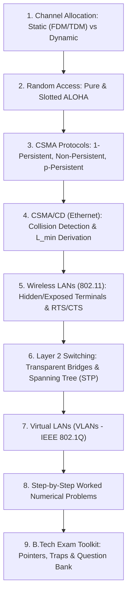
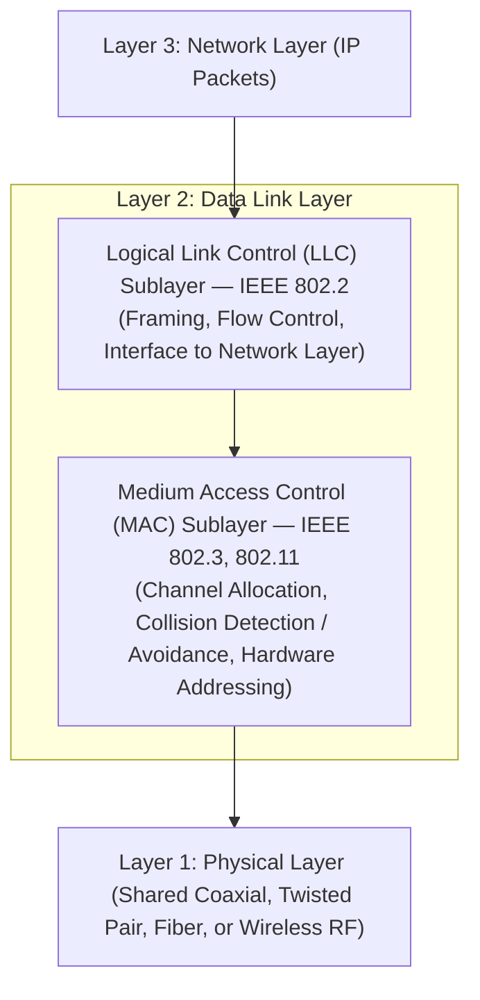
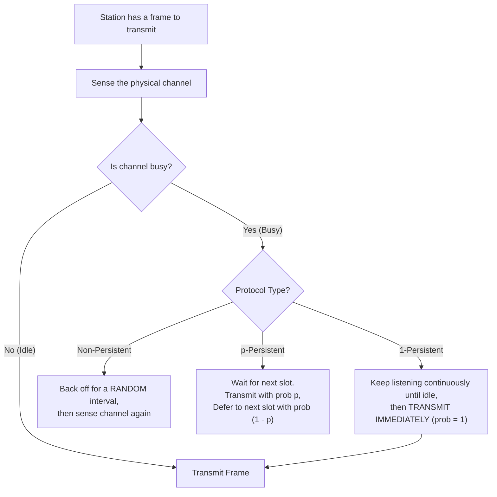
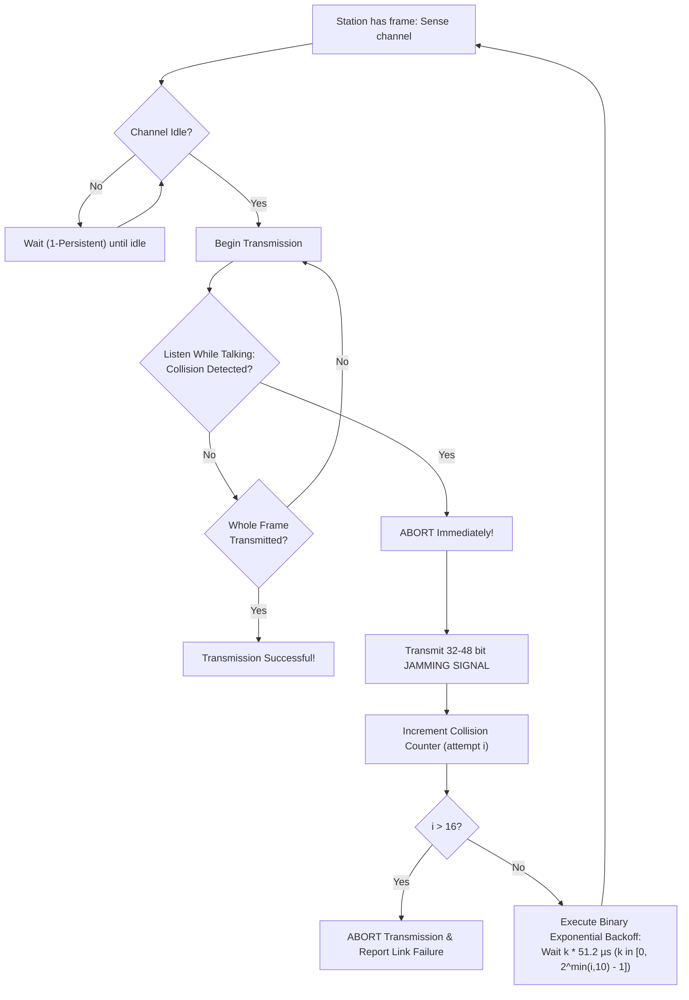
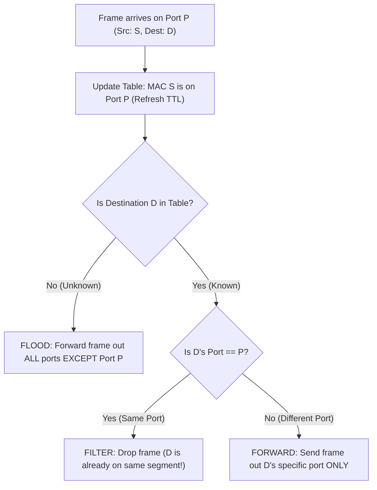
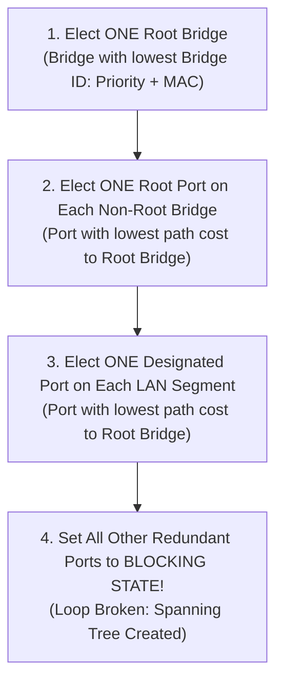

# Complete Computer Networks Notes: Medium Access Control (MAC) Sublayer

> **Course Code:** Computer Networks (CompNet)  
> **Course Title:** Computer Networks & Data Communications  
> **Target Audience:** Undergraduate B.Tech / BE Computer Science & Information Technology  
> **Textbook Alignment:** Tanenbaum (Computer Networks, 5th/6th Ed.), Kurose & Ross (Computer Networking: A Top-Down Approach), Forouzan (Data Communications and Networking)  
> **Core Focus:** ALOHA Throughput Derivations, CSMA/CD Minimum Frame Size Proof ($L_{\min} = 2 \times T_p \times B$), Binary Exponential Backoff, 802.11 MAC & Hidden Terminal RTS/CTS, Transparent Bridges, Spanning Tree Protocol (STP), and B.Tech Exam Prep  

---

## Pedagogical Roadmap & Chapter Navigation



---

# Chapter 4 — Medium Access Control (MAC) Sublayer

---

## 1. Overview & The Channel Allocation Problem

On dedicated point-to-point links, only two nodes share the wire. However, on **broadcast networks** (such as wired Ethernet, Wi-Fi radio channels, and satellite downlinks), multiple communicating stations share a single common physical transmission channel.

The core challenge of the **Medium Access Control (MAC)** sublayer is:  
**When multiple stations contend simultaneously for access to a shared broadcast channel, which station is permitted to transmit, and how are packet collisions detected or avoided?**



---

### 1.1 Why Static Channel Allocation (FDM / TDM) Fails for Bursty Data

In traditional telecommunications, a shared physical channel of capacity $C\text{ bps}$ is statically divided among $N$ independent users using **Frequency Division Multiplexing (FDM)** or **Time Division Multiplexing (TDM)**. Each user receives a dedicated static slice of capacity $\frac{C}{N}\text{ bps}$.

#### The Mathematical Proof of Failure (Queuing Delay Derivation)
Assume user packets arrive according to a Poisson process with mean arrival rate $\lambda$ packets/sec, and packet lengths are exponentially distributed with mean service rate $\mu$ packets/sec.

From classical $M/M/1$ queuing theory, the average delay $T$ on a single unchannelized link of capacity $C$ is:
$$T_{\text{single}} = \frac{1}{\mu C - \lambda}$$

When statically partitioned into $N$ equal sub-channels, each sub-channel has capacity $\frac{C}{N}$ and handles an arrival rate of $\frac{\lambda}{N}$. The average delay on each sub-channel is:

$$\mathbf{T_{\text{FDM}} = \frac{1}{\mu \left(\frac{C}{N}\right) - \left(\frac{\lambda}{N}\right)} = \frac{N}{\mu C - \lambda} = N \cdot T_{\text{single}}}$$

* **Conclusion:** Static allocation causes the average packet delay to **increase $N$-fold**!
* **The Bursty Traffic Catastrophe:** Computer network traffic is bursty, with peak-to-average ratios of $1000:1$. When station A transmits a file burst, it is constrained to a tiny fraction $\frac{1}{N}$ of the bandwidth, while the remaining $N-1$ sub-channels sit completely idle and wasted.
* **Solution:** **Dynamic Channel Allocation**, where the entire capacity $C$ is allocated dynamically on demand.

---

### 1.2 Five Key Assumptions in Dynamic Channel Allocation

1. **Station Model:** $N$ independent stations generate frames at rate $\lambda$. Once a frame is generated, the station blocks until transmission succeeds.
2. **Single Shared Channel:** A single physical medium is shared by all stations for transmission and reception.
3. **Collision Assumption:** If two transmissions overlap in time by even a single bit, their signals interfere and destroy each other (a **collision**). Neither frame is received correctly.
4. **Time Dimension:**
   * *Continuous Time:* Stations can transmit at any arbitrary instant (e.g., Pure ALOHA).
   * *Slotted Time:* Time is partitioned into discrete intervals called slots; transmissions must align strictly with slot boundaries (e.g., Slotted ALOHA).
5. **Carrier Sensing:**
   * *No Carrier Sense:* Stations transmit blindly without checking if the medium is busy (e.g., ALOHA).
   * *Carrier Sense (CSMA):* Stations listen to the medium before transmitting.

---

## 2. Random Access Protocols: ALOHA

Developed by Norman Abramson in 1970 at the University of Hawaii to connect island campuses via ground-based radio.

---

### 2.1 Pure ALOHA

#### 1. Principle of Operation
* **Transmit Immediately:** Whenever a station has a frame to send, it transmits immediately onto the channel without listening.
* **Acknowledgment & Timeout:** The central receiver broadcasts an ACK for every correctly received frame. If the sender does not receive an ACK within a timeout period, it assumes a collision occurred, waits a random backoff time, and retransmits.

#### 2. Vulnerable Period Analysis (Exam Favorite!)
Let $T_f$ be the transmission time of a standard frame.  
Suppose Station A begins transmitting a frame at time $t_0$.
* If any other station transmits between $t_0 - T_f$ and $t_0$, the end of that transmission collides with the beginning of A's frame.
* If any other station transmits between $t_0$ and $t_0 + T_f$, the beginning of that transmission collides with the end of A's frame.
* **Therefore, the Vulnerable Period for Pure ALOHA is:**

$$\mathbf{\text{Vulnerable Period}_{\text{Pure ALOHA}} = 2 T_f}$$

```
                t0 - Tf                 t0                 t0 + Tf
-------------------|---------------------|--------------------|-----------------> Time
  Station B:   [ Frame B ]                                              (Collides with start of A)
  Station A:                     [ Frame A of Interest ]
  Station C:                                           [ Frame C ]      (Collides with end of A)
                   <----------------- Vulnerable Period = 2 Tf --------------->
```

#### 3. Mathematical Derivation of Pure ALOHA Throughput
Let:
* $S$ = Throughput (rate of successful transmissions per frame time $T_f$, where $0 \le S \le 1$).
* $G$ = Offered load (total number of transmission attempts, including new frames and retransmissions, per frame time $T_f$).

Assuming total frame arrivals follow a Poisson distribution with mean $G$:
$$P(k \text{ arrivals in time } t) = \frac{\left(G \cdot \frac{t}{T_f}\right)^k e^{-G \cdot \frac{t}{T_f}}}{k!}$$

For a frame to transmit successfully, **zero other frames ($k = 0$)** must be generated during the entire vulnerable period $t = 2 T_f$:
$$P(0) = e^{-G \cdot \frac{2 T_f}{T_f}} = \mathbf{e^{-2G}}$$

The throughput $S$ is the offered load multiplied by the probability of zero collisions:

$$\mathbf{S = G \cdot e^{-2G}}$$

#### Finding Maximum Throughput ($S_{\max}$):
Differentiate $S$ with respect to $G$ and set to 0:
$$\frac{dS}{dG} = e^{-2G} + G(-2e^{-2G}) = e^{-2G}(1 - 2G) = 0$$
$$1 - 2G = 0 \implies \mathbf{G = 0.5}$$

Substitute $G = 0.5$ into the throughput equation:
$$\mathbf{S_{\max} = 0.5 \cdot e^{-2(0.5)} = \frac{1}{2e} \approx 0.1839 \approx \mathbf{18.4\%}}$$

---

### 2.2 Slotted ALOHA

Proposed by Lawrence Roberts in 1972 to reduce collision vulnerability.

#### 1. Principle of Operation
* Time is divided into discrete intervals called **slots**, each of duration equal to the frame transmission time $T_f$.
* Stations can transmit **only at the beginning of a slot boundary**.
* If two stations generate frames during the same slot, they both transmit at the start of the next slot and collide. However, partial overlapping of frames is completely eliminated!

#### 2. Vulnerable Period Analysis
A frame transmitted in slot $[t_0, t_0 + T_f]$ collides only if another frame is generated in the immediately preceding slot $[t_0 - T_f, t_0]$.  
Therefore, the vulnerable period is halved:

$$\mathbf{\text{Vulnerable Period}_{\text{Slotted ALOHA}} = 1 T_f}$$

#### 3. Mathematical Derivation of Slotted ALOHA Throughput
The probability that zero frames are generated in vulnerable period $t = T_f$ is:
$$P(0) = e^{-G}$$

The throughput is:

$$\mathbf{S = G \cdot e^{-G}}$$

#### Finding Maximum Throughput ($S_{\max}$):
$$\frac{dS}{dG} = e^{-G}(1 - G) = 0 \implies \mathbf{G = 1.0}$$
$$\mathbf{S_{\max} = 1.0 \cdot e^{-1} = \frac{1}{e} \approx 0.3679 \approx \mathbf{36.8\%}}$$

> **Key Takeaway:** Slotted ALOHA **doubles** the maximum channel capacity of Pure ALOHA from $18.4\%$ to $36.8\%$.

```
Throughput S
  ^
  |          Slotted ALOHA: S_max = 1/e = 36.8% (at G = 1.0)
0.368 +            /\
      |           /  \
0.184 +    /\    /    \     Pure ALOHA: S_max = 1/(2e) = 18.4% (at G = 0.5)
      |   /  \  /      \
  0.0 +--+----+--+------+-------------> Offered Load G
         0   0.5 1.0   2.0
```

---

## 3. Carrier Sense Multiple Access (CSMA)

In ALOHA, stations transmit blindly without checking if someone else is already transmitting. **CSMA** introduces the principle of **"Listen Before Talking" (Carrier Sensing)**.

### 3.1 The Three Classical CSMA Protocols



| CSMA Protocol | Action When Channel is Busy | Action When Channel is Idle | Pros & Cons |
| :--- | :--- | :--- | :--- |
| **1-Persistent CSMA** | Continues listening continuously; transmits immediately with probability $p=1$ the instant channel becomes idle. | Transmits immediately. | **Pros:** Zero idle delay when channel is free. **Cons:** High collision rate! If two stations wait while a third is transmitting, both transmit at the exact same moment when it finishes, colliding guaranteed! |
| **Non-Persistent CSMA** | Aborts sensing; waits a **random backoff time** before sensing the channel again. | Transmits immediately. | **Pros:** Dramatically lower collisions than 1-persistent. **Cons:** Channel sits idle during backoff times even when free, increasing packet latency. |
| **p-Persistent CSMA (Slotted)** | Continues listening until channel becomes idle. | Transmits with probability $p$; defers to next slot with probability $1-p$. | **Pros:** Balances efficiency and collision rate. If $N$ stations are ready, choosing $p \approx \frac{1}{N}$ avoids collisions. |

---

## 4. CSMA with Collision Detection (CSMA/CD — IEEE 802.3 Ethernet)

While CSMA checks before transmitting, it still allows collisions if two stations transmit within the propagation delay window. **CSMA/CD** adds: **"Listen While Talking" (Collision Detection)**.



---

### 4.1 The Minimum Frame Size Derivation ($L_{\min} = 2 \times T_p \times B$)

This is the **single most frequently asked derivation** in university B.Tech exams and GATE.

#### The Worst-Case Collision Scenario
Consider two stations, A and B, situated at the extreme opposite ends of a broadcast cable of length $D$.  
Let $\tau = T_{\text{prop}} = \frac{D}{v}$ be the one-way propagation delay between A and B.

```
Station A                                                    Station B
   |                                                             |
t = 0: Transmits Frame A --------------------------------------->|
   |                                                             |
   |                                                   t = tau - epsilon:
   |                                                   Senses channel (IDLE!)
   |                                                   Begins transmitting Frame B!
   |                                                             |
   |                                                   t = tau:
   |                                                   COLLISION OCCURS AT B!
   |                                                             |
   |<------------------ Collision Signal Propagates Back --------+
   |
t = 2*tau - epsilon:
Collision signal finally reaches Station A!
```

1. At time $t = 0$, Station A begins transmitting a frame.
2. The signal propagates down the wire toward B.
3. At time $t = \tau - \epsilon$ (just a tiny fraction of a microsecond before A's signal reaches B), Station B senses the channel. Since A's signal has not yet arrived, B detects an **idle channel** and begins transmitting!
4. At time $t = \tau$, the two signals collide at Station B.
5. The collision signal (distorted voltage wave) propagates back toward A.
6. The collision arrives back at Station A at time **$t = 2\tau - \epsilon \approx 2\tau$**.

#### The Core Condition:
For Station A to know that its frame was corrupted, **Station A must still be actively transmitting when the collision signal returns**! If Station A finished transmitting its entire frame before $2\tau$, it would assume its transmission was successful, discard its copy from memory, and never retransmit!

Therefore, the transmission time of a frame must be at least twice the one-way propagation delay:

$$\mathbf{T_{\text{trans}} \ge 2 \times T_{\text{prop}} = 2\tau}$$

Since $T_{\text{trans}} = \frac{L}{B}$ (where $L$ is frame size in bits and $B$ is channel bandwidth in bps):

$$\frac{L}{B} \ge 2 \times T_{\text{prop}}$$

$$\mathbf{L_{\min} = 2 \times T_{\text{prop}} \times B = 2 \times \left(\frac{D}{v}\right) \times B}$$

> **Why Classic 10 Mbps Ethernet Has a 64-Byte (512-Bit) Minimum Frame:**  
> In classic Ethernet, maximum segment distance with repeaters was $D \approx 2500\text{ m}$.  
> Propagation velocity $v = 2 \times 10^8\text{ m/s}$.  
> $$T_{\text{prop}} = \frac{2500\text{ m}}{2 \times 10^8\text{ m/s}} = 12.5\,\mu\text{s}$$  
> Round-trip contention slot time $2\tau = 2 \times 12.5\,\mu\text{s} = 25\,\mu\text{s}$. Adding repeater delay budgets yielded a standard slot time of **$51.2\,\mu\text{s}$**.  
> At $B = 10\text{ Mbps}$:  
> $$L_{\min} = 10 \times 10^6\text{ bps} \times 51.2 \times 10^{-6}\text{ s} = \mathbf{512\text{ bits}} = \mathbf{64\text{ Bytes}}$$  
> If an application transmits a tiny 1-byte message, the Data Link Layer must inject **45 bytes of padding** to reach 64 bytes!

---

### 4.2 Binary Exponential Backoff (BEB) Algorithm

When a collision occurs, stations must not retransmit immediately to prevent repeated collisions:
1. Time is divided into contention slots of duration equal to the round-trip time:  
   $$\text{Slot Time} = 2\tau = 51.2\,\mu\text{s} \quad \text{(in 10 Mbps Ethernet)}$$
2. After collision number $i$ ($1 \le i \le 10$):
   * The station randomly picks an integer $k$ from the discrete uniform range:
     $$\mathbf{k \in [0, 2^i - 1]}$$
   * The station pauses and waits for $k \times \text{Slot Time}$ before attempting to retransmit.
3. **Collision Progression:**
   * Collision 1: $k \in [0, 1]$ (waits 0 or $51.2\,\mu\text{s}$; collision prob $= 50\%$).
   * Collision 2: $k \in [0, 3]$ (waits $0, 51.2, 102.4,$ or $153.6\,\mu\text{s}$; collision prob $= 25\%$).
   * Collision 3: $k \in [0, 7]$.
   * Collision 10: $k \in [0, 1023]$.
4. **Freezing the Window:** For collisions $11 \le i \le 16$, the window is frozen at $[0, 1023]$.
5. **Abort Condition:** After **16 consecutive collisions**, the station gives up and reports an unrecoverable link error to the network layer.

---

### 4.3 IEEE 802.3 Ethernet Frame Format

```
+----------+-----+-------------+-------------+------------+-----------------+--------+----------+
| Preamble | SFD | Destination | Source MAC  | Type/Length| Data Payload    | Padding| FCS/CRC  |
| 7 Bytes  | 1 B | MAC 6 Bytes | 6 Bytes     | 2 Bytes    | 46 - 1500 Bytes | 0-46 B | 4 Bytes  |
+----------+-----+-------------+-------------+------------+-----------------+--------+----------+
|<------------------------------ Total Frame: 64 to 1518 Bytes ------------------------------>|
```

* **Preamble (7 Bytes):** Repeating pattern `10101010` allowing receiver circuitry to lock its clock to the sender's bitstream.
* **Start Frame Delimiter (SFD - 1 Byte):** `10101011` (the concluding `11` signals that the destination address starts immediately in the next bit).
* **Destination & Source MAC (6 Bytes / 48 Bits each):** Globally unique hardware addresses burned into the NIC (e.g., `00:1A:2B:3C:4D:5E`). First 24 bits are the Organizationally Unique Identifier (OUI).
* **Length / Type Field (2 Bytes):**
  * If value $\le 1500$ (i.e. $\le \text{0x05DC}$): specifies the length of data in bytes (IEEE 802.3 format).
  * If value $\ge 1536$ (i.e. $\ge \text{0x0600}$): specifies the higher-layer protocol (Ethernet II format: `0x0800` for IPv4, `0x0806` for ARP).
* **Data Payload:** 46 to 1500 bytes (MTU = 1500 bytes).
* **Padding:** If payload $< 46\text{ bytes}$, padding bits are added to enforce the minimum 64-byte frame size ($6 + 6 + 2 + 46 + 4 = 64\text{ bytes}$).
* **FCS (Frame Check Sequence - 4 Bytes):** CRC-32 checksum covering addresses, length, data, and pad.

---

## 5. Wireless LANs (IEEE 802.11 / Wi-Fi) & CSMA/CA

### 5.1 Why CSMA/CD Cannot Be Used in Wireless Networks

1. **Massive Dynamic Signal Range (The Near-Far Problem):** A station's own transmitter outputs a high signal power (e.g., $+20\text{ dBm}$), while signals arriving from remote stations are attenuated by free space loss and obstacles to tiny fractions of a milliwatt (e.g., $-70\text{ dBm}$ to $-90\text{ dBm}$). A wireless transceiver attempting to listen while transmitting would be completely deafened by its own signal!
2. **The Hidden Terminal Problem:** Station A and Station C are too far apart to hear each other's radio transmissions. Both wish to transmit to intermediate station B. Because A cannot sense C's carrier, both transmit simultaneously, causing a collision at B!
3. **The Exposed Terminal Problem:** Station B is transmitting to A. Station C hears B's transmission. If C wishes to transmit to an unrelated station D (outside of B and A's range), C senses the carrier, falsely concludes the medium is busy, and unnecessarily defers transmission, wasting available bandwidth.

```
1. HIDDEN TERMINAL PROBLEM:                 2. EXPOSED TERMINAL PROBLEM:
   [ A ] <----- Radio Range -----> [ B ]                      [ A ] <----- [ B ]
   (Cannot Hear C!)                  ^                                     | Transmitting to A
                                     | Collision at B                      v
                                   [ C ]                                 [ C ] Senses B; Defers!
                                     | (Cannot Hear A!)                    | (Unnecessarily blocks
                                     v                                     v  transmission to D)
                                                                         [ D ]
```

---

### 5.2 The CSMA/CA Protocol with RTS/CTS Handshake

To eliminate collisions from hidden terminals, 802.11 implements **MACA (Multiple Access with Collision Avoidance)** using short control frames:

```mermaid
sequenceDiagram
    autonumber
    actor A as Station A (Sender)
    actor B as Station B (Receiver)
    actor C as Station C (Hidden to A)

    Note over A: Senses medium idle for DIFS
    A->>B: 1. RTS (Request to Send - Reserves channel)
    Note over B: Waits SIFS
    B-->>A: 2. CTS (Clear to Send)
    B-->>C: CTS Broadcast Reaches C!
    Note over C: Station C hears CTS: Sets NAV Timer!\nDefers transmission for entire duration!
    Note over A: Waits SIFS
    A->>B: 3. DATA Frame Transmitted
    Note over B: Verifies FCS; Waits SIFS
    B-->>A: 4. ACK Frame
    Note over C: NAV Expires: Medium now free
```

#### Key Concepts:
* **RTS (Request to Send):** A tiny 20-byte frame sent by the transmitter specifying the sender, receiver, and estimated duration for the data frame and subsequent ACK.
* **CTS (Clear to Send):** A tiny 14-byte frame returned by the receiver repeating the reservation duration.
* **NAV (Network Allocation Vector):** A virtual carrier-sensing counter maintained locally by every station. When Station C hears a CTS, it updates its NAV timer to the duration specified in the frame and goes to sleep, preventing interference.

#### Inter-Frame Spaces (IFS) — The Priority Mechanism
802.11 defines four discrete gap intervals to enforce channel access priority:
1. **SIFS (Short IFS):** The shortest gap ($10\,\mu\text{s}$ in 802.11b). Used for highest-priority traffic: ACK frames, CTS frames, and subsequent fragments.
2. **PIFS (PCF IFS):** Medium gap ($30\,\mu\text{s}$). Used by the central Access Point (AP) in Point Coordination Function mode to poll stations without contention.
3. **DIFS (DCF IFS):** Standard gap ($50\,\mu\text{s}$). Regular stations must sense the channel idle for at least DIFS before starting the backoff contention counter.
4. **EIFS (Extended IFS):** Longest gap. Used when a damaged or garbled frame arrives, providing error recovery time.

$$\mathbf{\text{SIFS} < \text{PIFS} < \text{DIFS} < \text{EIFS}}$$

---

## 6. Data Link Layer Switching & Bridges

A **Bridge** or **Layer-2 Switch** connects multiple separate LAN segments, inspecting hardware MAC addresses and filtering or forwarding frames.

### 6.1 Transparent Bridges & The Backward Learning Algorithm

A transparent bridge requires zero manual configuration: you plug it into the network, and it automatically learns the network topology using **Backward Learning**.

```
    Segment 1 (Port 1)                     Segment 2 (Port 2)
  [ Host A ]   [ Host B ]               [ Host C ]   [ Host D ]
      |            |                         |            |
  ----+------------+---[ Port 1 ]       [ Port 2 ]---+------------+---
                       |                         |
                       +-----[ Bridge B1 ]-------+
                             Forwarding Table:
                             MAC Addr | Port | TTL
```

#### The Bridge Forwarding & Learning Algorithm:
When a frame with Source MAC $S$ and Destination MAC $D$ arrives on Port $P$:



#### Step-by-Step Learning Example:
* **Initial Table:** Empty.
* **Event 1: Host A sends to Host B.**
  * Frame arrives on Port 1. Bridge learns: `[Host A $\to$ Port 1]`.
  * Destination B is unknown: Bridge **floods** out Port 2. Host B on Segment 1 receives it directly; Host C and D ignore it.
* **Event 2: Host C sends to Host A.**
  * Frame arrives on Port 2. Bridge learns: `[Host C $\to$ Port 2]`.
  * Destination A is known (Port 1): Bridge **forwards** out Port 1 only! (Segment 2 traffic is isolated from other segments).
* **Event 3: Host A sends to Host C.**
  * Frame arrives on Port 1. Both A and C are known: Bridge **forwards** out Port 2 only. Zero flooding!

---

### 6.2 Spanning Tree Protocol (STP — IEEE 802.1D)

To provide fault tolerance, network administrators connect redundant links between switches. However, redundant physical links create **physical loops**.

#### The Catastrophe of Loops in Switched Networks:
1. **Broadcast Storms:** Broadcast frames (e.g., ARP requests) circulate endlessly around the loop, multiplying exponentially until switch CPUs crash and network bandwidth is 100% saturated.
2. **MAC Table Thrashing:** The same frame arrives on different ports alternately, causing the switch's forwarding table to constantly overwrite its port mapping.

#### Radia Perlman's STP Algorithm:
STP breaks loops by dynamically placing redundant bridge ports into a **Blocking State** while keeping them available as backups if an active link fails:



---

## 7. Virtual LANs (VLANs — IEEE 802.1Q)

A **VLAN** is a logical partition of a physical switch into multiple isolated broadcast domains.

```
Physical Switch:
+-------------------------------------------------------------------+
|  [ Port 1 ]  [ Port 2 ]  [ Port 3 ]  [ Port 4 ]  [ Port 5 ] [Trunk]|
|  <---- VLAN 10 (Faculty) ---->       <---- VLAN 20 (Students) ---->|
+-------------------------------------------------------------------+
```

* **Broadcast Isolation:** A broadcast frame transmitted by Port 1 (VLAN 10) is flooded **only to ports belonging to VLAN 10**; ports in VLAN 20 never see it.
* **Access Port:** Connects to an end host; accepts and sends regular untagged Ethernet frames.
* **Trunk Port:** Interconnects two switches or a switch and a router; multiplexes traffic belonging to multiple VLANs across a single physical cable.

#### The IEEE 802.1Q VLAN Tag Format
To identify which VLAN a frame belongs to over a trunk link, a **4-byte VLAN tag** is inserted immediately after the Source MAC address:

```
+-------------------+-----------------+------------------------+---------------+
| TPID (16 bits)    | Priority (3 b)  | CFI (1 bit)            | VID (12 bits) |
| 0x8100 (VLAN Tag) | 802.1p QoS Class| Canonical Format Indic.| VLAN ID (0-4095)|
+-------------------+-----------------+------------------------+---------------+
```
* **VID (VLAN Identifier - 12 Bits):** Supports up to $2^{12} = \mathbf{4096\text{ distinct VLANs}}$. (VIDs 0 and 4095 are reserved).

---

## 8. Step-by-Step Worked Numerical Problems

### Problem 1: Pure vs. Slotted ALOHA Throughput
**Question:**  
A broadcast channel has a data rate of $R = 100\text{ kbps}$ and uses frames of length $L = 1000\text{ bits}$.  
(a) What is the frame transmission time $T_f$?  
(b) If the system generates $N = 200$ new frames per second, what is the offered load $G$?  
(c) Calculate the throughput $S$ and success rate for both Pure ALOHA and Slotted ALOHA.

**Solution:**  
**(a) Frame Transmission Time:**  
$$T_f = \frac{L}{R} = \frac{1000\text{ bits}}{100 \times 10^3\text{ bps}} = 0.01\text{ s} = \mathbf{10\text{ ms}}$$

**(b) Offered Load ($G$):**  
$$G = \text{Frame Generation Rate} \times T_f = 200\text{ frames/sec} \times 0.01\text{ s} = \mathbf{2.0}$$

**(c) Throughput Calculations:**  
* **Pure ALOHA:**  
  $$S = G e^{-2G} = 2.0 \times e^{-2(2.0)} = 2.0 \times e^{-4} = 2.0 \times 0.018316 \approx \mathbf{0.0366\text{ frames/slot}}$$  
  $$\text{Throughput in bps} = S \times R = 0.0366 \times 100\text{ kbps} = \mathbf{3.66\text{ kbps}}$$
* **Slotted ALOHA:**  
  $$S = G e^{-G} = 2.0 \times e^{-2.0} = 2.0 \times 0.135335 \approx \mathbf{0.2707\text{ frames/slot}}$$  
  $$\text{Throughput in bps} = S \times R = 0.2707 \times 100\text{ kbps} = \mathbf{27.07\text{ kbps}}$$

---

### Problem 2: CSMA/CD Minimum Frame Size
**Question:**  
A 1 Gbps CSMA/CD local area network spans a cable distance of $D = 1\text{ km}$. Signal propagation speed in the cable is $v = 2 \times 10^8\text{ m/s}$.  
(a) What is the one-way propagation delay $\tau$?  
(b) Calculate the minimum frame size $L_{\min}$ required to ensure collision detection.  
(c) If the network is upgraded to 10 Gbps without changing cable length, what is the new minimum frame size?

**Solution:**  
**(a) One-Way Propagation Delay:**  
$$\tau = T_{\text{prop}} = \frac{D}{v} = \frac{1000\text{ m}}{2 \times 10^8\text{ m/s}} = 5 \times 10^{-6}\text{ s} = \mathbf{5\,\mu\text{s}}$$

**(b) Minimum Frame Size at 1 Gbps:**  
$$L_{\min} = 2 \times T_{\text{prop}} \times B = 2 \times (5 \times 10^{-6}\text{ s}) \times (10^9\text{ bps}) = 10^{-5} \times 10^9 = \mathbf{10,000\text{ bits}} = \mathbf{1,250\text{ Bytes}}$$

**(c) Minimum Frame Size at 10 Gbps:**  
$$L_{\min} = 2 \times (5 \times 10^{-6}\text{ s}) \times (10 \times 10^9\text{ bps}) = \mathbf{100,000\text{ bits}} = \mathbf{12,500\text{ Bytes}}$$  
*(Note: This immense minimum frame size explains why 10 Gbps Ethernet dropped CSMA/CD entirely and operates exclusively in full-duplex switched mode!)*

---

### Problem 3: Maximum Cable Distance for CSMA/CD
**Question:**  
A 100 Mbps CSMA/CD network enforces a standard minimum frame size of 64 bytes (512 bits). Signal propagation speed is $2 \times 10^8\text{ m/s}$. Four repeaters are placed in the path, each introducing a delay of $1.5\,\mu\text{s}$.  
Calculate the maximum permissible physical distance $D$ of the network cable.

**Solution:**  
$$B = 100\text{ Mbps} = 10^8\text{ bps}, \quad L_{\min} = 512\text{ bits}$$  
Transmission time:  
$$T_{\text{trans}} = \frac{L_{\min}}{B} = \frac{512}{10^8} = 5.12\,\mu\text{s}$$  
Total repeater round-trip delay:  
$$\text{Repeater Delay} = 2 \times (4 \times 1.5\,\mu\text{s}) = 12\,\mu\text{s}$$  
Since $T_{\text{trans}} = 5.12\,\mu\text{s} < 12\,\mu\text{s}$, the repeater delay alone exceeds the frame transmission time!  
Therefore, **zero cable distance is possible** with four such repeaters unless frame size is increased.  
*Recalculating with zero repeater delay:*  
$$2 \times T_{\text{prop}} \le T_{\text{trans}} \implies 2 \times \frac{D}{v} \le 5.12\,\mu\text{s}$$  
$$D \le \frac{5.12 \times 10^{-6}\text{ s} \times 2 \times 10^8\text{ m/s}}{2} = \mathbf{512\text{ meters}}$$

---

### Problem 4: Binary Exponential Backoff Probability
**Question:**  
Two stations simultaneously transmit and collide for the first time. They both use Binary Exponential Backoff.  
(a) What is the probability that they collide again on their second attempt?  
(b) What is the probability that they collide again after 2 consecutive collisions?

**Solution:**  
**(a) After 1st Collision ($i=1$):**  
Range is $[0, 2^1 - 1] = [0, 1]$. Possible slot choices are $\{0, 1\}$.  
Each station chooses 0 or 1 with probability $\frac{1}{2}$.  
Total outcomes $= 2 \times 2 = 4$: $(0,0), (0,1), (1,0), (1,1)$.  
Collisions occur if both choose the same slot: $(0,0)$ or $(1,1)$ $\implies 2$ outcomes.  
$$\mathbf{P(\text{Collision on 2nd attempt}) = \frac{2}{4} = \frac{1}{2} = 50\%}$$

**(b) After 2nd Collision ($i=2$):**  
Range is $[0, 2^2 - 1] = [0, 3]$. Possible slot choices are $\{0, 1, 2, 3\}$ (4 choices).  
Total outcomes $= 4 \times 4 = 16$.  
Collisions occur when both pick the same number: $(0,0), (1,1), (2,2), (3,3)$ $\implies 4$ outcomes.  
$$\mathbf{P(\text{Collision on 3rd attempt}) = \frac{4}{16} = \frac{1}{4} = 25\%}$$

---

## 9. B.Tech Exam Toolkit: Pointers, Traps & Question Bank

### 9.1 High-Yield 2-Mark Question Bank

1. **What is the vulnerable period in Pure ALOHA and Slotted ALOHA?**  
   *Answer:* Pure ALOHA: $2 T_f$. Slotted ALOHA: $1 T_f$.
2. **State the maximum throughput of Pure ALOHA and Slotted ALOHA.**  
   *Answer:* Pure ALOHA: $18.4\%$ (at $G = 0.5$). Slotted ALOHA: $36.8\%$ (at $G = 1.0$).
3. **State the condition for collision detection in CSMA/CD.**  
   *Answer:* $T_{\text{trans}} \ge 2 \times T_{\text{prop}} \iff L_{\min} = 2 \times T_{\text{prop}} \times B$.
4. **Why is CSMA/CD not applicable to wireless LANs?**  
   *Answer:* 1. Huge dynamic range makes listening while transmitting technically impossible; 2. Hidden terminal problem prevents carrier sensing.
5. **What is the Network Allocation Vector (NAV)?**  
   *Answer:* A local timer in 802.11 stations that reserves the channel virtually based on durations advertised in RTS/CTS frames.
6. **What is the function of a transparent bridge?**  
   *Answer:* It inspects incoming frame source MAC addresses to learn port locations dynamically, and forwards or filters frames based on destination MAC addresses without manual configuration.
7. **How many VLANs can be identified in an IEEE 802.1Q header?**  
   *Answer:* $2^{12} = 4096$ VLANs (using the 12-bit VID field).

---

### 9.2 Standard 5-Mark & 10-Mark University Questions

#### Question 1: "Derive the minimum frame size formula for CSMA/CD networks. Explain why 10 Mbps classic Ethernet requires a 64-byte minimum frame size." (10 Marks)
* **Marking Blueprint:**
  * Diagram showing worst-case collision scenario at $t = 2\tau - \epsilon$: **3 Marks**.
  * Step-by-step mathematical derivation ($T_{\text{trans}} \ge 2\tau \implies L_{\min} = 2 T_p B$): **4 Marks**.
  * Numerical calculation for 10 Mbps Ethernet ($51.2\,\mu\text{s} \times 10\text{ Mbps} = 512\text{ bits} = 64\text{ Bytes}$): **3 Marks**.

#### Question 2: "Explain the Hidden Terminal and Exposed Terminal problems in Wireless LANs. How does the RTS/CTS mechanism resolve the hidden terminal problem?" (10 Marks)
* **Marking Blueprint:**
  * Labeled diagrams for both Hidden and Exposed terminal scenarios: **4 Marks**.
  * Explanation of why CSMA fails in each case: **2 Marks**.
  * Sequence diagram of the 4-way RTS/CTS/DATA/ACK handshake: **3 Marks**.
  * Explanation of NAV and SIFS/DIFS spacing: **1 Mark**.

---

### 9.3 Formula Cheat Sheet

| Formula Name | Formula Equation | Meaning of Variables |
| :--- | :--- | :--- |
| **Pure ALOHA Throughput** | $S = G e^{-2G}$ | $S$: Throughput, $G$: Offered load; Max $= 18.4\%$ at $G = 0.5$ |
| **Slotted ALOHA Throughput** | $S = G e^{-G}$ | Max $= 36.8\%$ at $G = 1.0$ |
| **CSMA/CD Min Frame Size** | $L_{\min} = 2 \times T_{\text{prop}} \times B = 2 \times \dfrac{D}{v} \times B$ | $D$: Distance, $v$: Propagation velocity, $B$: Bandwidth |
| **CSMA/CD Max Cable Length** | $D_{\max} = \dfrac{L_{\min} \times v}{2 B}$ | Maximum network span |
| **BEB Contention Window** | $k \in [0, 2^{\min(i, 10)} - 1]$ | $i$: Collision number; Slot time $= 51.2\,\mu\text{s}$ |
| **Collision Probability (BEB)** | $P = \dfrac{1}{2^{\min(i, 10)}}$ | Probability two contending stations pick same slot |
| **Queuing Delay (Static FDM)** | $T_{\text{FDM}} = N \cdot T_{\text{single}}$ | Proves $N$-fold delay increase of FDM over bursty data |
| **802.1Q VLAN Capacity** | $2^{12} = 4096\text{ VLANs}$ | Based on 12-bit VID field |