# Complete Computer Networks Notes: Medium Access Control Sublayer

> **Course Code:** Computer Networks (CompNet)
> **Course Title:** Computer Networks & Data Communications
> **Primary Source:** `Ch 4 MAC Layer.pdf` (pp. 1–92) — Official Faculty Lecture Material
> **Supplementary Sources:** `Chapter4-Medium Access Control SubLayer.pdf` (98 slides), `CN_Numericals_MAC_Layer.pdf` (19 pages), `cn_tutorial.pdf` (Tutorial 4), `Computer_Networks_Question_Bank.pdf` (Unit 3)
> **Files Integrated:** `Ch 4 MAC Layer.pdf`, `Chapter4-Medium Access Control SubLayer.pdf`, `CN_Numericals_MAC_Layer.pdf`, `cn_tutorial.pdf`, `Computer_Networks_Question_Bank.pdf`

---

## Source-to-Chapter Mapping

| Source File | Content / Role | Chapter Integration |
| :--- | :--- | :--- |
| `Ch 4 MAC Layer.pdf` (92 slides) | Primary faculty lecture presentation covering static vs dynamic channel allocation, ALOHA, CSMA/CD, BEB, Collision-Free protocols, Limited Contention, Classic & Switched Ethernet, Wireless 802.11 MAC, Transparent Learning Bridges, STP, and VLANs. | Core text, mathematical derivations, protocols, and 25 curated diagram analyses. |
| `Chapter4-Medium Access Control SubLayer.pdf` (98 slides) | Supplementary presentation with extended bridge learning walkthroughs, STP port state transitions, and 802.11 IFS calculations. | Enhanced protocol flows and bridge forwarding tables. |
| `CN_Numericals_MAC_Layer.pdf` (19 pages) | Dedicated problem set covering ALOHA throughput/delay, CSMA/CD slot sizing, minimum frame length, Adaptive Tree Walk slots, MACA wireless scenarios, Bluetooth dwell time, bridge forwarding traces, and buffer rate matching. | Section 14 (Worked Numerical Problems) & Section 10 (Mathematical Foundations). |
| `cn_tutorial.pdf` (Tutorial 4) | Course tutorial covering contention slot sizing in fiber/copper, bitmap worst-case delays, IP packet Ethernet padding, and CSMA/CD LAN acknowledgments. | Section 14 (Worked Problems) & Section 20 (Exam Review). |
| `Computer_Networks_Question_Bank.pdf` (Unit 3) | Official question bank containing Unit 3 MCQs, CSMA/CD vs CSMA/CA comparisons, bridge learning, and VLAN questions. | Section 20 (Exam-Oriented Review). |

---

# Chapter 4 — Medium Access Control (MAC) Sublayer

---

## 1. Chapter Overview & Channel Allocation Problem

On point-to-point links, a dedicated channel connects exactly two communicating nodes. However, on broadcast networks (such as Ethernet LANs, satellite links, and Wi-Fi networks), multiple communicating stations share a single common physical transmission channel.

The fundamental design challenge on shared broadcast channels is: **When multiple stations contend for access simultaneously, which station gets to transmit, and how are collisions resolved?**

To manage access to shared channels, the Data Link Layer (Layer 2) of the OSI model is divided into two distinct sublayers (standardized by the IEEE 802 committee):
1. **Logical Link Control (LLC) Sublayer (Upper Sublayer — IEEE 802.2):** Provides framing, flow control, error checking, and a uniform service interface to the Network Layer (Layer 3), hiding physical transmission technology differences.
2. **Medium Access Control (MAC) Sublayer (Lower Sublayer):** Manages contention, resolves collisions, and determines channel allocation across the shared physical broadcast medium.

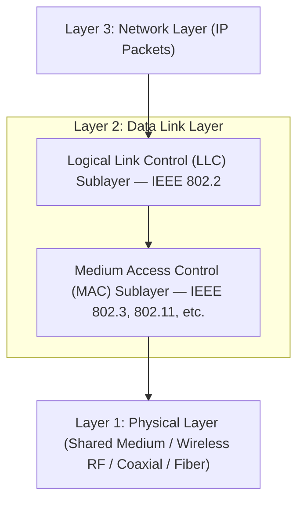
```mermaid
flowchart TD
    L3["Layer 3: Network Layer (IP Packets)"]
    subgraph L2 ["Layer 2: Data Link Layer"]
        LLC["Logical Link Control (LLC) Sublayer — IEEE 802.2"]
        MAC["Medium Access Control (MAC) Sublayer — IEEE 802.3, 802.11, etc."]
    end
    L1["Layer 1: Physical Layer (Shared Medium / Wireless RF / Coaxial / Fiber)"]

    L3 --> LLC
    LLC --> MAC
    MAC --> L1
```

---

### Static vs Dynamic Channel Allocation

#### 1. Why Static Channel Allocation (FDM / TDM) Fails for Computer Data
In traditional telephony, a channel is divided among $N$ users using **Frequency Division Multiplexing (FDM)** or **Time Division Multiplexing (TDM)**:
* If $N$ users share a channel of total capacity $C$ bps, each user is permanently allocated a sub-band of $\frac{C}{N}$ bps.
* From queuing theory, the average delay $T$ for a Poisson arrival stream with mean arrival rate $\lambda$ and mean frame service rate $\mu$ is:

$$
T_{\text{FDM}} = \frac{1}{\mu \left(\frac{C}{N}\right) - \left(\frac{\lambda}{N}\right)} = \frac{N}{\mu C - \lambda} = N \cdot T_{\text{single}}
$$

* If $N = 10$ and traffic is bursty (with a high peak-to-average ratio of $1000:1$, typical of web browsing and file downloads), each station is idle for $99\%$ of the time. When a station does generate a burst, it is constrained to a tiny fraction $\frac{1}{N}$ of the bandwidth, causing average delay to increase **$N$-fold**, while all other $(N-1)$ subchannels sit completely idle and wasted.

#### 2. Dynamic Channel Allocation
Dynamic channel allocation shares the entire capacity $C$ on demand among all active stations. Key design assumptions:
1. **Station Model:** $N$ independent stations, each generating frames with Poisson arrival rate $\lambda$. Once a frame is generated, the station is blocked until the frame is successfully transmitted.
2. **Single Shared Channel:** A single common communication channel is available for all transmissions.
3. **Collision Assumption:** If two transmissions overlap in time, their signals interfere and both frames are garbled (a **collision**). No signal can be decoded during a collision.
4. **Time Model:**
   * *Continuous Time:* Stations can transmit at any arbitrary instant.
   * *Slotted Time:* Time is divided into discrete intervals (slots); transmissions must begin strictly at slot boundaries.
5. **Carrier Sensing Model:**
   * *Carrier Sense (CSMA):* Stations can listen to the medium before transmitting to determine if it is busy.
   * *No Carrier Sense (ALOHA):* Stations cannot sense the medium; they transmit blindly and discover collisions later.

[Source: Ch 4 MAC Layer.pdf, Slides 4–7; Chapter4-Medium Access Control SubLayer.pdf, Slides 4–9]

---

## 2. Core Terminology Dictionary

1. **Medium Access Control (MAC):** The protocol sublayer that governs how multiple contending stations share a broadcast channel.
2. **Collision:** The simultaneous transmission of two or more frames over a shared channel resulting in corrupted, unreadable signals at all receivers.
3. **Contention:** The state where multiple stations compete to acquire the shared transmission medium.
4. **Vulnerable Period:** The time interval during which a transmitted frame is susceptible to colliding with a transmission initiated by another station.
5. **Offered Load ($G$):** The total rate of frame transmission attempts per frame time (including both newly generated frames and retransmissions).
6. **Throughput ($S$):** The fraction of channel time occupied by successfully transmitted frames without collision ($0 \le S \le 1$).
7. **Carrier Sense Multiple Access (CSMA):** A family of random access protocols where a station listens to ("senses") the channel before attempting transmission.
8. **1-Persistent CSMA:** A CSMA protocol where a station sensing a busy channel continuously listens and transmits immediately with probability 1 as soon as the channel becomes idle.
9. **Non-Persistent CSMA:** A CSMA protocol where a station sensing a busy channel waits a random backoff interval before sensing again, reducing collision probability at the cost of higher idle delay.
10. **p-Persistent CSMA:** A slotted CSMA protocol where a station sensing an idle channel transmits with probability $p$ and defers to the next slot with probability $1-p$.
11. **Collision Detection (CSMA/CD):** A protocol mechanism where transmitting stations continuously monitor the channel and immediately abort transmission if a collision is detected during transmission.
12. **Contention Slot ($2\tau$):** The worst-case round-trip propagation time across the maximum network span required for any station to detect a collision.
13. **Jamming Signal:** A short 32-to-48-bit signal transmitted by a station upon detecting a collision to ensure all other contending stations detect the collision and abort.
14. **Binary Exponential Backoff (BEB):** An algorithm that dynamically doubles the contention window interval after each successive collision to resolve congestion.
15. **Hidden Terminal Problem:** A wireless LAN condition where two stations out of radio range of each other transmit simultaneously to a mutual intermediate station, colliding at the receiver.
16. **Exposed Terminal Problem:** A wireless LAN condition where a station unnecessarily defers transmission because it senses a neighboring station transmitting to an unrelated third node outside its interference range.
17. **MACA (Multiple Access with Collision Avoidance):** An early wireless MAC protocol utilizing RTS/CTS handshaking to eliminate hidden terminal collisions.
18. **CSMA/CA (Carrier Sense Multiple Access with Collision Avoidance):** The IEEE 802.11 MAC access method combining physical/virtual carrier sensing, inter-frame spaces, and random backoff.
19. **Network Allocation Vector (NAV):** A virtual carrier-sensing timer maintained locally by 802.11 stations that indicates how long the wireless medium is reserved by an active exchange.
20. **Transparent Bridge:** A Layer 2 internetworking device that inspects frame MAC addresses and uses backward learning to forward frames between LAN segments without host configuration.
21. **Spanning Tree Protocol (STP — IEEE 802.1D):** A distributed protocol that breaks physical loops in switched networks by dynamically disabling redundant bridge ports into a blocking state.
22. **VLAN (Virtual LAN — IEEE 802.1Q):** A logical broadcast domain configured within physical Ethernet switches, identified by a 12-bit VLAN ID (VID).

[Source: Ch 4 MAC Layer.pdf, Slides 5–15, 20–25, 41–55, 71–85; Chapter4-Medium Access Control SubLayer.pdf, Slides 10–35]

---

## 3. Multiple Access Protocols: Random Access

---

### Pure ALOHA

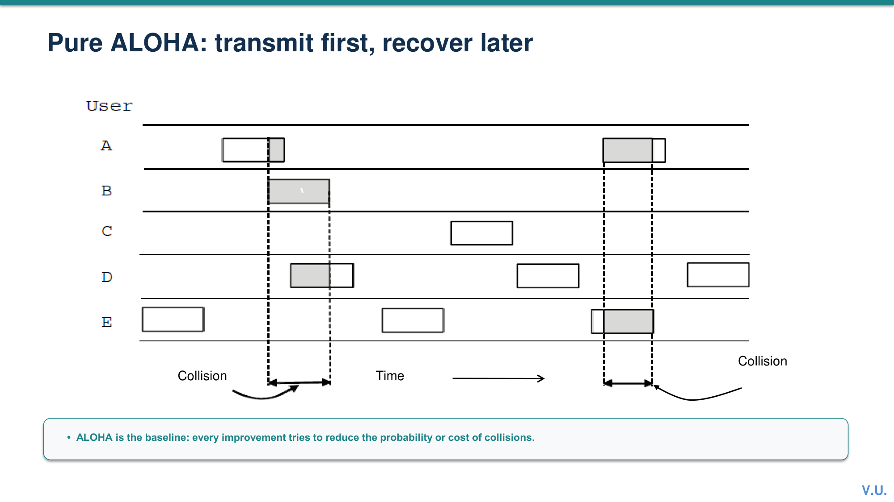

Developed by Norman Abramson at the University of Hawaii in 1970 for island communication.

#### Operation
* Stations transmit **immediately** whenever they have data to send (continuous time, no carrier sensing).
* After transmitting, the sender waits for an acknowledgment (ACK) broadcast by the central receiver.
* If no ACK arrives within a timeout interval, the sender assumes a collision occurred, waits a random backoff time, and retransmits.

#### Vulnerable Period Analysis
Let $T_f$ be the frame transmission time.
* Suppose station A begins transmitting a frame at time $t_0$.
* If any other station transmits between $t_0 - T_f$ and $t_0$, the end of that frame will collide with the beginning of A's frame.
* If any other station transmits between $t_0$ and $t_0 + T_f$, the beginning of that frame will collide with the end of A's frame.
* Therefore, the **vulnerable period** for Pure ALOHA is **$2 T_f$**.

```text
       t0 - Tf                 t0                 t0 + Tf
---------|----------------------|--------------------|---------> Time
         [  Colliding Frames   ][  Frame of Interest ][ Colliding Frames ]
         <----------------- Vulnerable Period = 2 Tf --------------->
```

#### Mathematical Derivation of Pure ALOHA Throughput
Let $G$ be the offered load (mean frame generation attempts per frame time $T_f$). Assuming frame generation follows a Poisson distribution:

$$
P(k \text{ frames in time } t) = \frac{\left(G \cdot \frac{t}{T_f}\right)^k e^{-G \cdot \frac{t}{T_f}}}{k!}
$$

Over the vulnerable period $t = 2 T_f$, the probability of zero other transmissions ($k = 0$) is:

$$
P(0) = e^{-G \cdot \frac{2 T_f}{T_f}} = e^{-2G}
$$

The throughput $S$ (rate of successful transmissions per frame time) is:

$$
S = G \cdot P(0) = G e^{-2G}
$$

To find maximum throughput, differentiate with respect to $G$:

$$
\frac{dS}{dG} = e^{-2G} - 2G e^{-2G} = e^{-2G}(1 - 2G) = 0 \implies G = 0.5
$$

$$
S_{\max} = 0.5 \cdot e^{-1} = \frac{1}{2e} \approx 0.18394 \approx 18.4\%
$$

[Source: Ch 4 MAC Layer.pdf, Slides 8–15; CN_Numericals_MAC_Layer.pdf, Pages 4–5]

---

### Slotted ALOHA

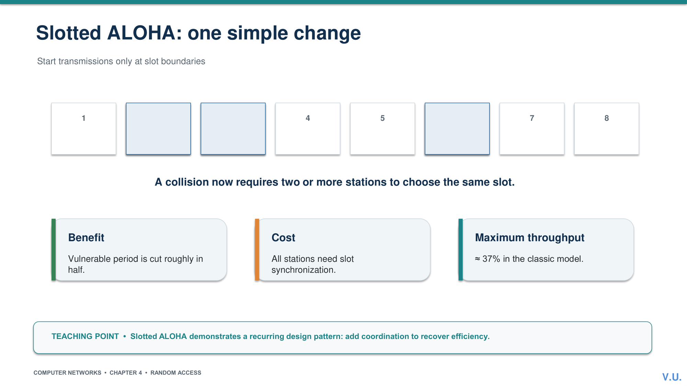
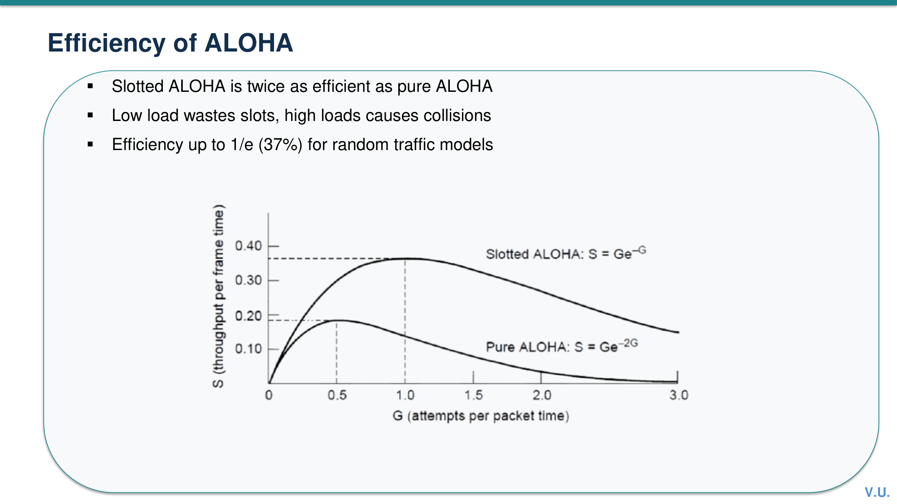

Proposed by Lawrence Roberts in 1972 to double the capacity of Pure ALOHA.

#### Operation
* Time is divided into uniform discrete **slots** of duration $T_f$.
* Stations are synchronized to slot boundaries. A station cannot transmit immediately; it must wait and begin transmission **strictly at the start of the next slot**.

#### Vulnerable Period & Throughput Derivation
* Since transmissions start only at slot boundaries, a frame transmitted in slot $[t_0, t_0 + T_f]$ collides only if another frame is also scheduled for that exact same slot.
* The **vulnerable period** is halved to **$T_f$**.
* Probability of zero other frames in slot time $T_f$:

$$
P(0) = e^{-G}
$$

* Throughput equation:

$$
S = G e^{-G}
$$

* Differentiating with respect to $G$:

$$
\frac{dS}{dG} = e^{-G}(1 - G) = 0 \implies G = 1.0
$$

* Maximum throughput:

$$
S_{\max} = 1.0 \cdot e^{-1} = \frac{1}{e} \approx 0.36788 \approx 36.8\%
$$

#### Pure ALOHA vs Slotted ALOHA Comparison

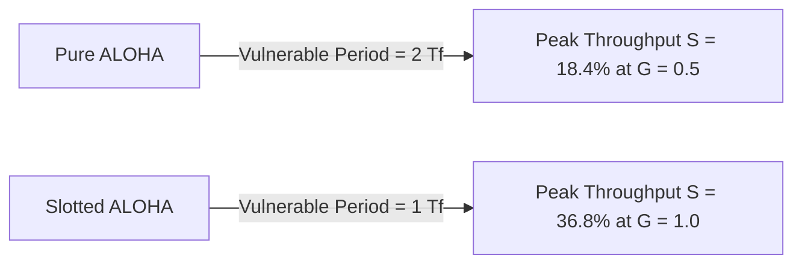
```mermaid
flowchart LR
    A[Pure ALOHA] -->|Vulnerable Period = 2 Tf| B[Peak Throughput S = 18.4% at G = 0.5]
    C[Slotted ALOHA] -->|Vulnerable Period = 1 Tf| D[Peak Throughput S = 36.8% at G = 1.0]
```

[Source: Ch 4 MAC Layer.pdf, Slides 9–15; CN_Numericals_MAC_Layer.pdf, Pages 4–5]

---

### Carrier Sense Multiple Access (CSMA) Protocols

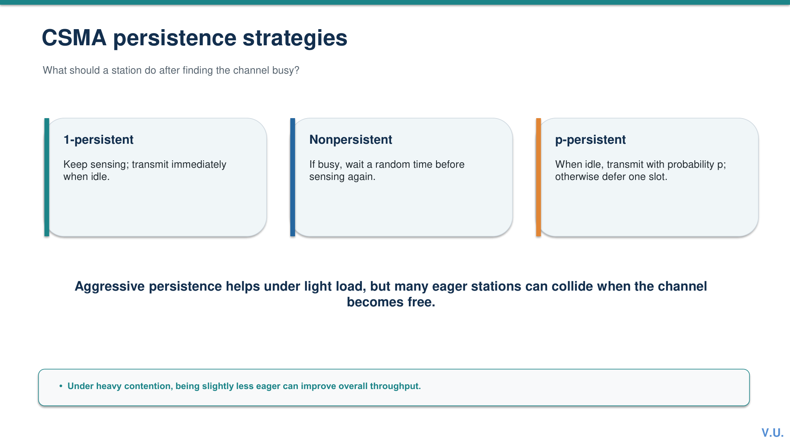

In local area networks where propagation delay $\tau$ is very short compared to frame transmission time $T_f$, stations can listen to the channel before transmitting (**Carrier Sensing**).

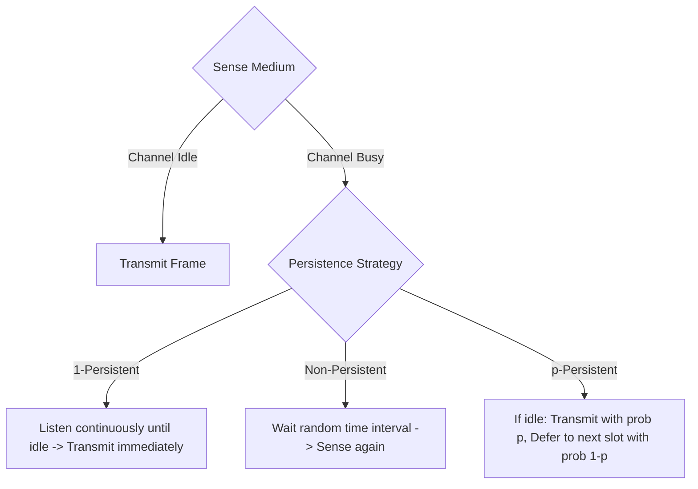
```mermaid
flowchart TD
    Sense{Sense Medium}
    Sense -->|Channel Idle| Transmit[Transmit Frame]
    Sense -->|Channel Busy| Strategy{Persistence Strategy}
    Strategy -->|1-Persistent| ListenLoop[Listen continuously until idle -> Transmit immediately]
    Strategy -->|Non-Persistent| WaitRand[Wait random time interval -> Sense again]
    Strategy -->|p-Persistent| SlottedCheck[If idle: Transmit with prob p, Defer to next slot with prob 1-p]
```

1. **1-Persistent CSMA:**
   * When ready, sense channel. If idle, transmit immediately (probability 1).
   * If busy, continue listening continuously until idle, then transmit immediately.
   * *Trade-off:* Minimizes idle line delay, but if two or more stations become ready while a third station is transmitting, they will both transmit as soon as the channel frees up, causing a guaranteed collision.
2. **Non-Persistent CSMA:**
   * If idle, transmit immediately.
   * If busy, do *not* listen continuously; wait a random backoff time and sense again.
   * *Trade-off:* Dramatically reduces collisions under high load, but introduces channel idle time during low load.
3. **p-Persistent CSMA:**
   * Applies to slotted channels.
   * When channel becomes idle: Transmit with probability $p$; defer to next slot with probability $q = 1 - p$.
   * If the next slot is still idle, repeat: transmit with probability $p$, defer with $1-p$.
   * If channel becomes busy during deferral, treat as collision and start backoff.

[Source: Ch 4 MAC Layer.pdf, Slides 16–18; Chapter4-Medium Access Control SubLayer.pdf, Slides 14–18]

---

### CSMA with Collision Detection (CSMA/CD — IEEE 802.3)

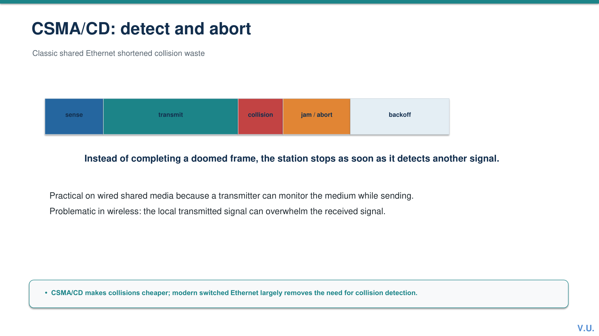
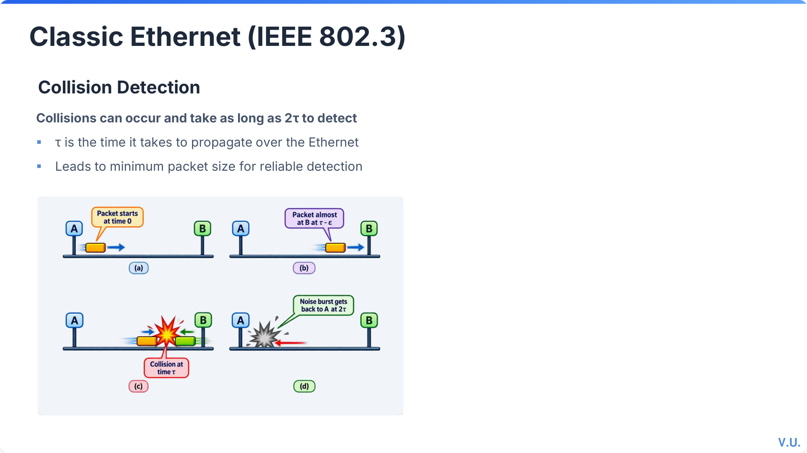
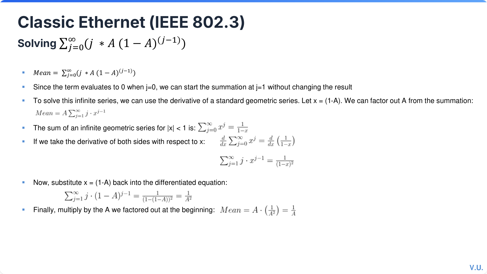

CSMA/CD improves upon CSMA by adding the ability to **listen while transmitting**. If two stations sense idle and transmit simultaneously, their signals collide. Stations detect the collision within time $2\tau$, immediately abort their transmissions, send a jamming signal, and schedule retransmissions using backoff.

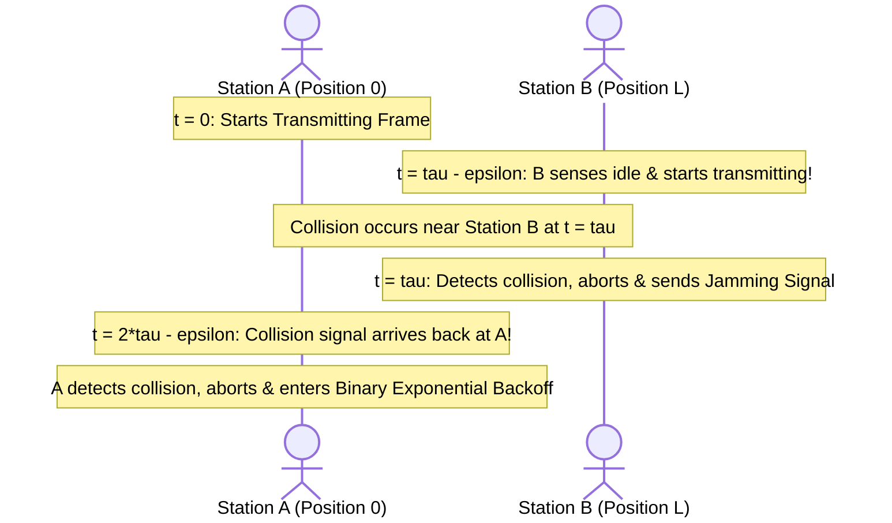
```mermaid
sequenceDiagram
    autonumber
    actor A as Station A (Position 0)
    actor B as Station B (Position L)

    Note over A: t = 0: Starts Transmitting Frame
    Note over B: t = tau - epsilon: B senses idle & starts transmitting!
    Note over A,B: Collision occurs near Station B at t = tau
    Note over B: t = tau: Detects collision, aborts & sends Jamming Signal
    Note over A: t = 2*tau - epsilon: Collision signal arrives back at A!
    Note over A: A detects collision, aborts & enters Binary Exponential Backoff
```

#### Why Collision Detection Takes $2\tau$ (Round-Trip Propagation Time)
Let $\tau$ be the maximum one-way propagation time between the two farthest stations (A and B):
1. At $t = 0$, Station A senses idle and starts transmitting.
2. At $t = \tau - \epsilon$ (a fraction of a nanosecond before A's leading bit reaches B), Station B senses the medium. Because A's signal has not yet arrived, B perceives an idle channel and starts transmitting.
3. A collision occurs near B immediately at $t = \tau$.
4. Station B detects the collision instantly, aborts, and broadcasts a jamming signal.
5. The collision signal (the corrupted runt waveform) must travel all the way back across the physical cable to reach Station A.
6. Station A detects the collision at time:

$$
t_{\text{detect}} = 2\tau - \epsilon \approx 2\tau
$$

#### The Minimum Frame Size Requirement
To guarantee that a transmitting station detects a collision **before** it completes sending its frame, the frame transmission time $T_{\text{trans}}$ must be at least as long as the round-trip propagation time $2\tau$:

$$
T_{\text{trans}} \ge 2\tau
$$

$$
\frac{L_{\min}}{B} \ge 2 \cdot \frac{D}{v} \implies L_{\min} = 2 \cdot \frac{D}{v} \cdot B = 2 \cdot \tau \cdot B
$$

*For Classic 10 Mbps Ethernet (10Base5):*
* Maximum length with 4 repeaters: $D = 2500\text{ m}$.
* Signal speed in coaxial cable: $v = 2 \times 10^8\text{ m/s} = 200\text{ m/}\mu\text{s}$.
* Round-trip delay: $2\tau = \frac{2 \times 2500\text{ m}}{2 \times 10^8\text{ m/s}} = 25\,\mu\text{s}$ (with repeater delays, standard sets slot time to $51.2\,\mu\text{s}$).
* Minimum frame size:

$$
L_{\min} = 51.2\,\mu\text{s} \times 10\text{ Mbps} = 512\text{ bits} = 64\text{ Bytes}
$$

If a station finishes transmitting a 64-byte frame without detecting a collision during the first 512 bits, it is guaranteed to have captured the channel, and no collision can occur for the remainder of the frame.

[Source: Ch 4 MAC Layer.pdf, Slides 20, 42–43; CN_Numericals_MAC_Layer.pdf, Pages 9–11]

---

### Binary Exponential Backoff (BEB) Algorithm

After a collision, stations randomize their retransmission timing using BEB:

#### Algorithm Rules
1. Time is divided into contention slots of duration equal to the round-trip time: **$1\text{ slot} = 51.2\,\mu\text{s}$** ($512\text{ bit times}$ at 10 Mbps).
2. After the **$i$-th collision** for a given frame ($1 \le i \le 16$):
   * Set exponent $k = \min(i, 10)$.
   * The station randomly chooses an integer backoff delay $r$ uniformly distributed in the range:

$$
r \in [0, \; 2^k - 1]
$$

   * The station waits $r \times 51.2\,\mu\text{s}$ before attempting to sense the channel and retransmit.
3. *Backoff Progression:*
   * Collision 1 ($i=1$): $r \in [0, 1]$ (Delays: 0 or 1 slot).
   * Collision 2 ($i=2$): $r \in [0, 3]$ (Delays: 0, 1, 2, or 3 slots).
   * Collision 3 ($i=3$): $r \in [0, 7]$ (Delays: 0 to 7 slots).
   * Collision 10 ($i=10$): $r \in [0, 1023]$ (Delays: 0 to 1023 slots).
   * Collisions 11 to 15: Frozen at $r \in [0, 1023]$.
   * Collision 16: Failure; frame transmission is aborted and error is reported to the network layer.

[Source: Ch 4 MAC Layer.pdf, Slide 21; Chapter4-Medium Access Control SubLayer.pdf, Slide 22]

---

## 4. Collision-Free Protocols

Collision-free protocols eliminate contention completely during data transfer through pre-allocation or reservation mechanisms.

---

### Basic Bit-Map (Reservation) Protocol

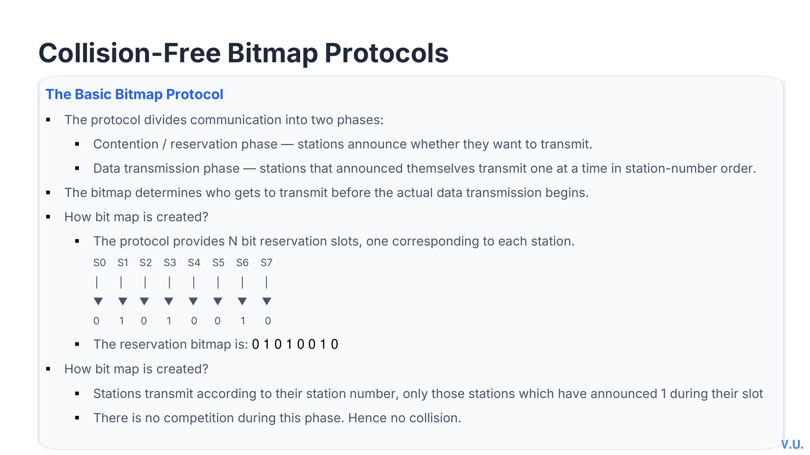

* **Mechanism:** If there are $N$ stations (numbered $0$ to $N-1$), each contention period consists of exactly **$N$ small 1-bit reservation slots**.
* If station $j$ has a frame queued to transmit, it transmits a `1` bit during contention slot $j$. Stations with no frames remain silent (transmitting `0`).
* By the end of $N$ slots, every station knows exactly which stations want to transmit.
* Stations then transmit their full data frames in strictly increasing numerical order without any collisions.

```text
Contention Period (8 stations: Stations 1, 3, 7 want to send)
Slot 0 | Slot 1 | Slot 2 | Slot 3 | Slot 4 | Slot 5 | Slot 6 | Slot 7
   0   |   1    |   0    |   1    |   0    |   0    |   0    |   1
Frame Transmissions: ----> [ Frame from Station 1 ] ---> [ Frame from Station 3 ] ---> [ Frame from Station 7 ]
```

#### Channel Efficiency Analysis
Let $d$ be the data frame size in bits:
* **Low Load (Only 1 station wants to send):** Sender must wait for $N$ contention bits before transmitting $d$ bits. Overhead = $N$ bits.

$$
\text{Efficiency} = \frac{d}{d + N}
$$

* **High Load (All $N$ stations want to send):** $N$ data frames ($N \cdot d$ bits) are transmitted for $N$ contention bits.

$$
\text{Efficiency} = \frac{N \cdot d}{N \cdot d + N} = \frac{d}{d + 1}
$$

[Source: Ch 4 MAC Layer.pdf, Slides 27–30; CN_Numericals_MAC_Layer.pdf, Page 8]

---

### Binary Countdown Protocol

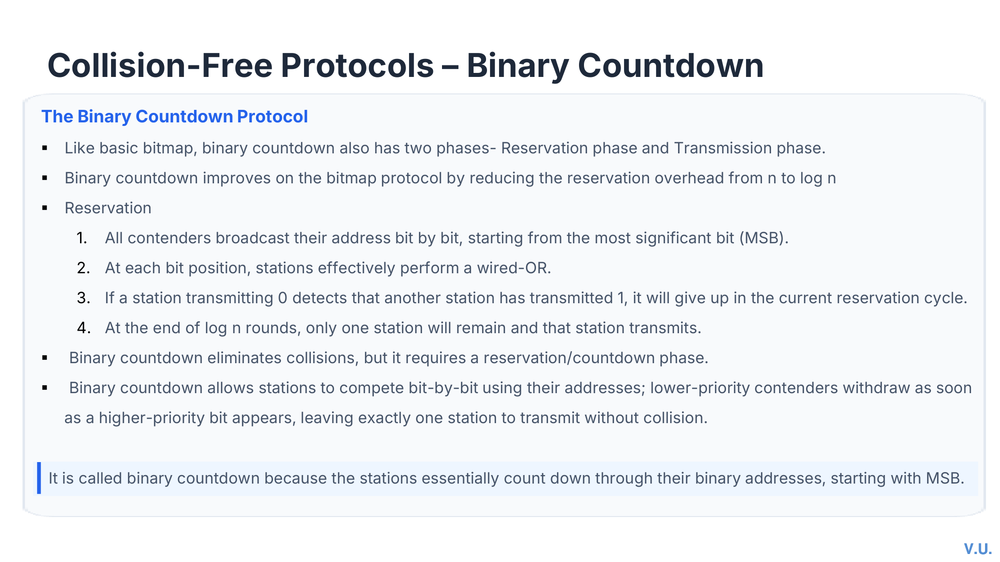

* **Mechanism:** Overcomes the $O(N)$ overhead of the Bit-Map protocol by assigning each station a binary address (e.g., $4\text{ bits}$ for 16 stations).
* In the contention period, stations broadcast their binary addresses **bit-by-bit from most significant bit (MSB) to least significant bit (LSB)**.
* The channel performs a boolean **wired-OR** operation on the transmitted signals.
* **Rule:** If a station broadcasts a `0` bit in position $k$, but detects a `1` on the channel (because a higher-addressed station broadcast a `1`), it immediately concedes defeat and stops transmitting for the rest of the round.
* The highest-numbered contending station wins arbitration in only $\log_2 N$ bit slots.

#### Example: Binary Countdown Arbitration
Suppose Stations 0010 (2), 0100 (4), 1010 (10), and 1001 (9) contend:
* **Bit 3 (MSB):** Stations 1010 and 1001 send `1`; Stations 0010 and 0100 send `0`. Channel is `1`. Stations 2 and 4 drop out.
* **Bit 2:** Stations 1010 and 1001 send `0`. Channel is `0`. Both remain in contention.
* **Bit 1:** Station 1010 sends `1`; Station 1001 sends `0`. Channel is `1`. Station 9 drops out.
* **Bit 0 (LSB):** Station 1010 sends `0`. Channel is `0`.
* **Winner:** Station 1010 (Station 10) wins and transmits its frame.

$$
\text{Channel Efficiency} = \frac{d}{d + \log_2 N}
$$

[Source: Ch 4 MAC Layer.pdf, Slides 32–35]

---

## 5. Limited-Contention Protocols

Limited-contention protocols combine the low delay of random access at light load with the collision-free efficiency of reservation protocols at heavy load.

---

### Optimal Transmission Probability

Suppose $k$ stations are currently contending for a shared slot, and each station independently decides to transmit with probability $p$. The probability $P_{\text{success}}$ that exactly one station transmits successfully is:

$$
P_{\text{success}} = k p (1 - p)^{k-1}
$$

To find the optimal transmission probability $p^*$, differentiate with respect to $p$:

$$
\frac{d P}{d p} = k (1-p)^{k-1} - k(k-1) p (1-p)^{k-2} = k(1-p)^{k-2}[(1-p) - (k-1)p] = 0
$$

$$
1 - p - kp + p = 0 \implies 1 - kp = 0 \implies p^* = \frac{1}{k}
$$

Substituting $p = \frac{1}{k}$ gives the maximum success probability:

$$
P_{\text{success, max}} = k \left(\frac{1}{k}\right) \left(1 - \frac{1}{k}\right)^{k-1} = \left(1 - \frac{1}{k}\right)^{k-1}
$$

As the number of contending stations $k \to \infty$:

$$
\lim_{k \to \infty} \left(1 - \frac{1}{k}\right)^{k-1} = \frac{1}{e} \approx 0.36788 \approx 36.8\%
$$

[Source: Ch 4 MAC Layer.pdf, Slides 37–38]

---

### The Adaptive Tree Walk Protocol

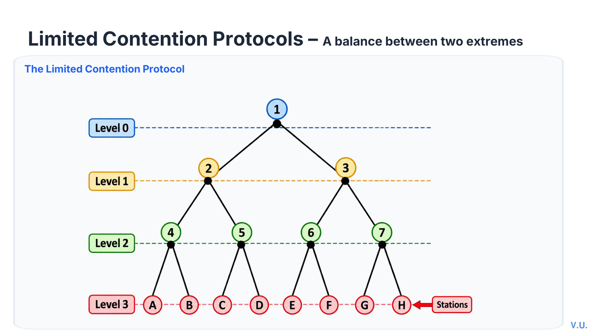

The Adaptive Tree Walk protocol uses a binary tree structure to dynamically partition contending stations:

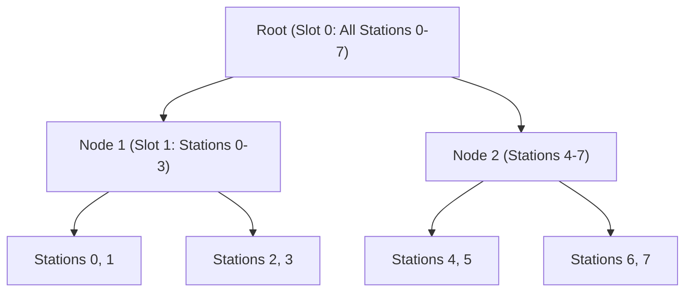
```mermaid
graph TD
    Node0["Root (Slot 0: All Stations 0-7)"]
    Node1["Node 1 (Slot 1: Stations 0-3)"]
    Node2["Node 2 (Stations 4-7)"]
    Node3["Stations 0, 1"]
    Node4["Stations 2, 3"]
    Node5["Stations 4, 5"]
    Node6["Stations 6, 7"]

    Node0 --> Node1
    Node0 --> Node2
    Node1 --> Node3
    Node1 --> Node4
    Node2 --> Node5
    Node2 --> Node6
```

#### Protocol Rules
1. In Slot 0, all stations under the Root Node are invited to transmit.
2. If zero stations transmit $\implies$ Idle; proceed to next frame cycle.
3. If exactly one station transmits $\implies$ Success; transmission completes.
4. If two or more stations transmit $\implies$ **Collision**. The tree is split:
   * In Slot 1, only stations in the **left subtree (Node 1)** are permitted to transmit.
   * All stations in the right subtree remain silent until the left subtree resolves.
   * If collision occurs at Node 1, recurse down to its left child (Stations 0, 1).
   * Once the left subtree has finished (either by success or finding it idle), search moves to the right subtree.

[Source: Ch 4 MAC Layer.pdf, Slides 39–40; CN_Numericals_MAC_Layer.pdf, Page 12]

---

## 6. Classic & Switched Ethernet (IEEE 802.3)

Ethernet was invented by Robert Metcalfe and David Boggs at Xerox PARC in 1973 and standardized as IEEE 802.3.

---

### IEEE 802.3 Classic Ethernet Frame Format

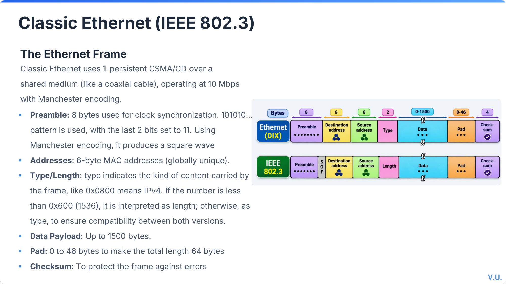

```text
+-------------------+-----+-------------+------------+-------------+------------------+---------+
| Preamble (7B)     | SFD | Dest MAC    | Source MAC | Type/Length | Payload (Data)   | FCS     |
| 10101010 ... 1010 | 1B  | (6 Bytes)   | (6 Bytes)  | (2 Bytes)   | (46 - 1500 B)    | (4 B)   |
+-------------------+-----+-------------+------------+-------------+------------------+---------+
|<----------------- Header (14 Bytes) ----------------------------->|<-- Data + Pad -->| Trailer |
```

#### Field Specifications
1. **Preamble (7 Bytes):** Pattern `10101010` repeated 7 times ($56\text{ bits}$) producing a $10\text{ MHz}$ square wave to synchronize receiver clock.
2. **Start of Frame Delimiter (SFD — 1 Byte):** Pattern `10101011` ending with two consecutive `1`s, signaling that the next byte is the destination MAC address.
3. **Destination MAC Address (6 Bytes / 48 bits):** Hardware address of destination NIC. If least significant bit of first byte is `0` $\implies$ Individual (Unicast); if `1` $\implies$ Multicast; all `1`s (`FF:FF:FF:FF:FF:FF`) $\implies$ Broadcast.
4. **Source MAC Address (6 Bytes / 48 bits):** Hardware address of transmitting NIC. First 3 bytes are IEEE-assigned Organizationally Unique Identifier (OUI); last 3 bytes are vendor-assigned NIC serial number.
5. **Type / Length Field (2 Bytes):**
   * If value $\le 1500$ (`0x05DC`), it represents the exact payload byte **Length** (IEEE 802.3 format).
   * If value $\ge 1536$ (`0x0600`), it represents the network layer **EtherType** (Ethernet II format, e.g., `0x0800` IPv4, `0x0806` ARP, `0x86DD` IPv6).
6. **Data Payload (46 to 1500 Bytes):** Network layer packet. If packet is $< 46\text{ Bytes}$, the DLL appends **Padding Bytes** to maintain the 64-byte minimum frame size ($14\text{ B header} + 46\text{ B payload} + 4\text{ B FCS} = 64\text{ Bytes}$).
7. **Frame Check Sequence (FCS — 4 Bytes):** 32-bit CRC checksum computed over Destination Address, Source Address, Type/Length, and Payload/Pad fields.

[Source: Ch 4 MAC Layer.pdf, Slide 42; CN_Numericals_MAC_Layer.pdf, Page 9]

---

### Ethernet Performance & Channel Efficiency Derivation

Let $F$ be the frame size in bits, $B$ be network bandwidth in bps, $L$ be cable length in meters, $c$ be propagation speed, and $\tau = \frac{L}{c}$.
* Each contention slot has duration $2\tau$.
* With $k$ stations contending with optimal probability $p = \frac{1}{k}$, the probability that a slot acquires the channel successfully is $A = \left(1 - \frac{1}{k}\right)^{k-1} \to \frac{1}{e} \approx 0.368$.
* The mean number of contention slots before a successful transmission is:

$$
\text{Mean Contention Slots} = \sum_{j=0}^{\infty} j A(1-A)^{j-1} = \frac{1 - A}{A} = \frac{1 - \frac{1}{e}}{\frac{1}{e}} = e - 1 \approx 1.718
$$

* The mean length of the contention interval is $T_{\text{contention}} = 2\tau (e - 1) \approx 2\tau e$.
* The channel efficiency $\eta$ is:

$$
\eta = \frac{T_{\text{frame}}}{T_{\text{frame}} + T_{\text{contention}}} = \frac{\frac{F}{B}}{\frac{F}{B} + 2 \left(\frac{L}{c}\right) e} = \frac{1}{1 + \frac{2 B L e}{c F}}
$$

**Key Insight:** Ethernet efficiency is high ($> 90\%$) when frames are large ($F = 1500\text{ B}$) and network span $L$ is short; efficiency degrades significantly if frames are small ($F = 64\text{ B}$) on long, high-speed networks.

[Source: Ch 4 MAC Layer.pdf, Slides 45–48, 91]

---

### Evolution of Ethernet

| Generation | Standard | Data Rate | Transmission Medium | Max Distance | Access Method / Line Coding |
| :--- | :--- | :---: | :--- | :---: | :--- |
| **Classic Ethernet** | IEEE 802.3 | 10 Mbps | Coaxial (10Base5/10Base2) / Cat 3 UTP | $500\text{ m} / 185\text{ m} / 100\text{ m}$ | CSMA/CD, Manchester (20 Mbaud) |
| **Fast Ethernet** | IEEE 802.3u | 100 Mbps | Cat 5 UTP (100Base-TX) / Fiber (100Base-FX) | $100\text{ m} / 2000\text{ m}$ | CSMA/CD, 4B/5B, MLT-3 |
| **Gigabit Ethernet** | IEEE 802.3z / ab | 1 Gbps | Cat 5e/6 (1000Base-T) / Fiber (1000Base-LX/SX)| $100\text{ m} / 550\text{ m} / 5000\text{ m}$ | Full-Duplex Switch / Carrier Extension (Half-Duplex), 8B/10B, 4D-PAM5 |
| **10 Gigabit Ethernet**| IEEE 802.3ae / an| 10 Gbps | Cat 6a (10GBASE-T) / Fiber (10GBASE-SR/LR) | $100\text{ m} / 300\text{ m} / 10\text{ km}$ | Full-Duplex Only (No CSMA/CD, No Collisions), 64B/66B |

[Source: Ch 4 MAC Layer.pdf, Slides 49–50; Chapter4-Medium Access Control SubLayer.pdf, Slides 36–42]

---

## 7. Wireless LANs (IEEE 802.11 / Wi-Fi)

Wireless transmission differs fundamentally from wired Ethernet because radios have limited transmission ranges, signal strength drops as $\frac{1}{r^2}$ or $\frac{1}{r^4}$, and a wireless transceiver cannot transmit and receive simultaneously on the same channel (a station's own transmit power drowns out any incoming collision signal). Consequently, **CSMA/CD cannot be used in wireless LANs; IEEE 802.11 uses CSMA/CA (Collision Avoidance)**.

---

### The Hidden & Exposed Terminal Problems

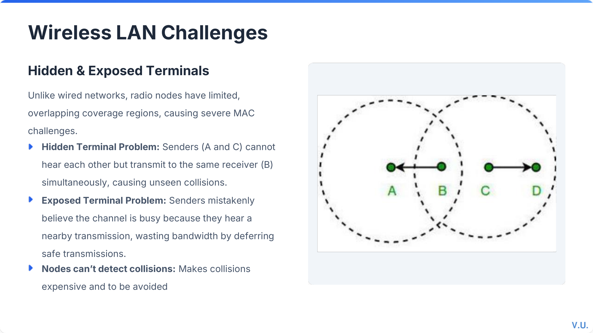
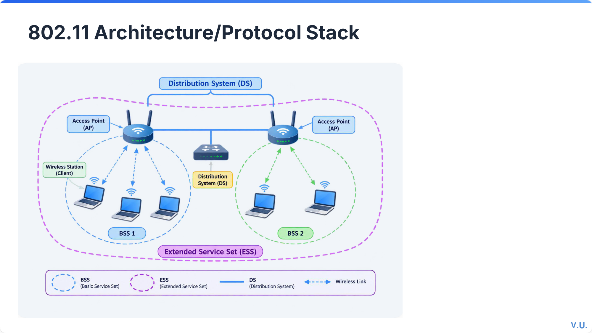

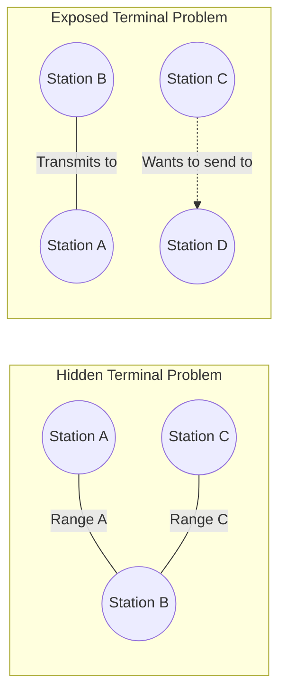
```mermaid
flowchart LR
    subgraph Hidden ["Hidden Terminal Problem"]
        A((Station A)) ---|Range A| B((Station B))
        C((Station C)) ---|Range C| B
    end
    subgraph Exposed ["Exposed Terminal Problem"]
        E_B((Station B)) ---|Transmits to| E_A((Station A))
        E_C((Station C)) -.->|Wants to send to| E_D((Station D))
    end
```

1. **Hidden Terminal Problem:**
   * Station A can communicate with Station B. Station C can communicate with Station B. But A and C are out of radio range of each other.
   * When A is transmitting to B, C senses the channel. Hearing nothing, C concludes the medium is idle and starts transmitting to B.
   * A's and C's signals collide at B, destroying both frames.
2. **Exposed Terminal Problem:**
   * Station B is transmitting to Station A. Station C wants to transmit to Station D (which is out of range of A and B).
   * C senses the medium, hears B transmitting, and falsely concludes the channel is busy. C defers transmission, even though C's transmission to D would not interfere with B's reception at A. Channel capacity is needlessly wasted.

[Source: Ch 4 MAC Layer.pdf, Slide 51; CN_Numericals_MAC_Layer.pdf, Pages 13–14]

---

### CSMA/CA Protocol with RTS/CTS & NAV

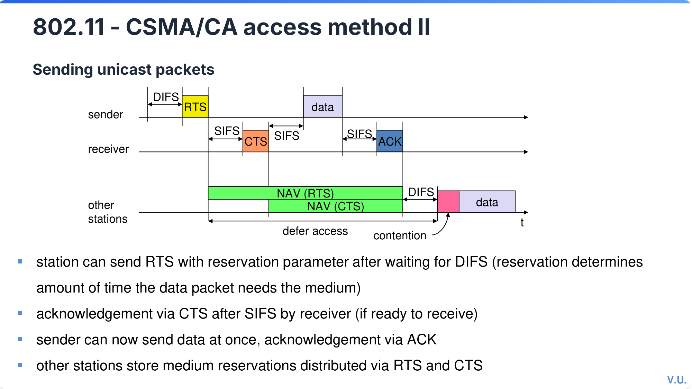
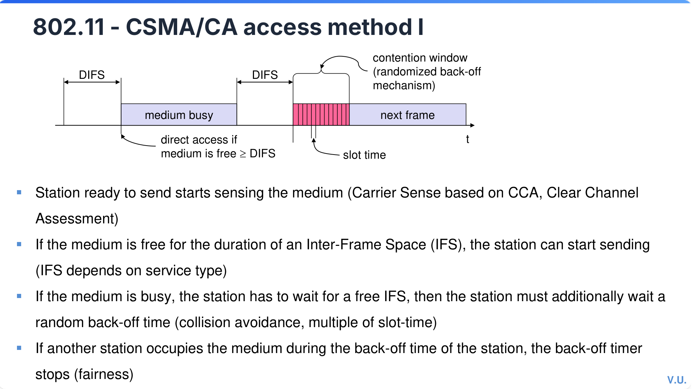
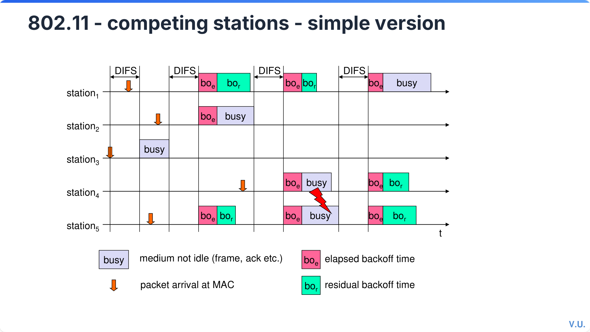

To solve the hidden terminal problem, IEEE 802.11 provides an optional **MACA four-way handshake**:

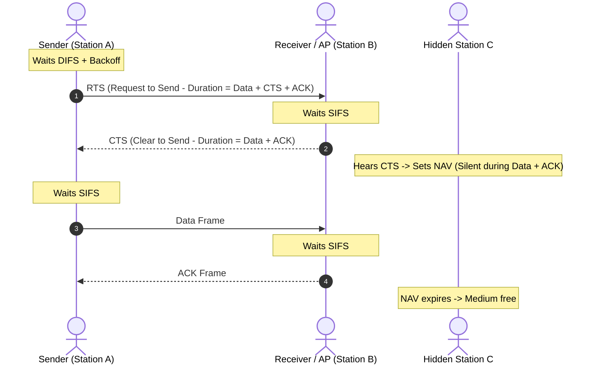
```mermaid
sequenceDiagram
    autonumber
    actor A as Sender (Station A)
    actor B as Receiver / AP (Station B)
    actor C as Hidden Station C

    Note over A: Waits DIFS + Backoff
    A->>B: RTS (Request to Send - Duration = Data + CTS + ACK)
    Note over B: Waits SIFS
    B-->>A: CTS (Clear to Send - Duration = Data + ACK)
    Note over C: Hears CTS -> Sets NAV (Silent during Data + ACK)
    Note over A: Waits SIFS
    A->>B: Data Frame
    Note over B: Waits SIFS
    B-->>A: ACK Frame
    Note over C: NAV expires -> Medium free
```

1. **RTS (Request to Send):** Sender A transmits a short 20-byte RTS frame containing a `Duration` field specifying how long it needs the channel for the complete transaction (Data + CTS + ACK).
2. **CTS (Clear to Send):** Receiver B replies with a 14-byte CTS frame echoing the `Duration` value.
3. **Network Allocation Vector (NAV):** Any station hearing the CTS (such as hidden Station C) reads the duration field and sets its internal hardware timer (**NAV**). Station C remains completely silent until the NAV counts down to zero (**Virtual Carrier Sensing**).
4. **Data & ACK:** Sender A transmits the full data frame; Receiver B verifies CRC and returns an immediate ACK frame after a short SIFS interval.

[Source: Ch 4 MAC Layer.pdf, Slides 60–63; Chapter4-Medium Access Control SubLayer.pdf, Slides 55–62]

---

### Inter-Frame Spacing (IFS) Priorities

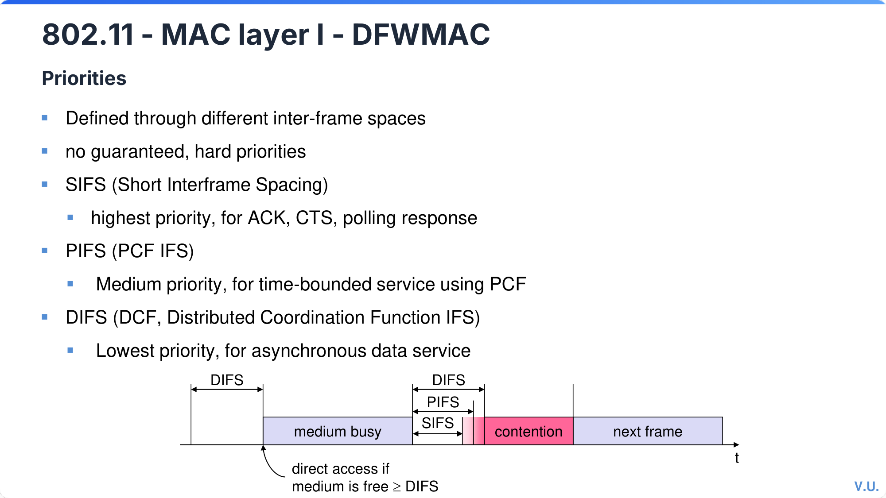
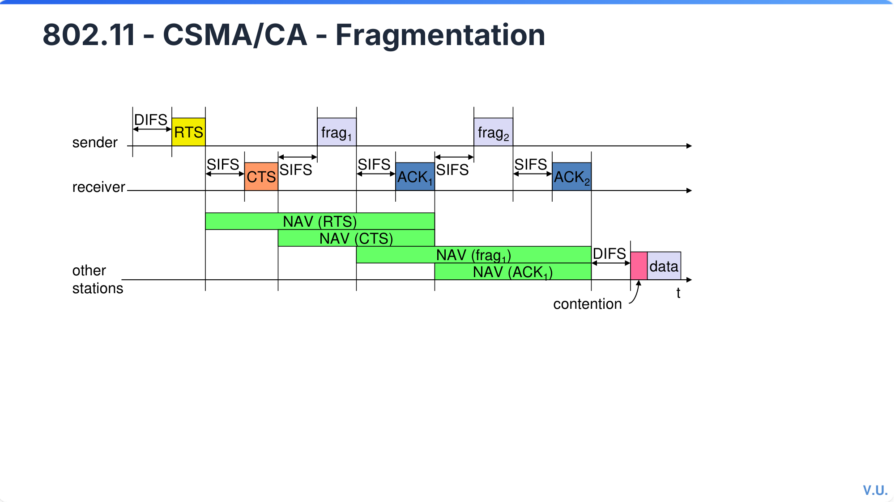
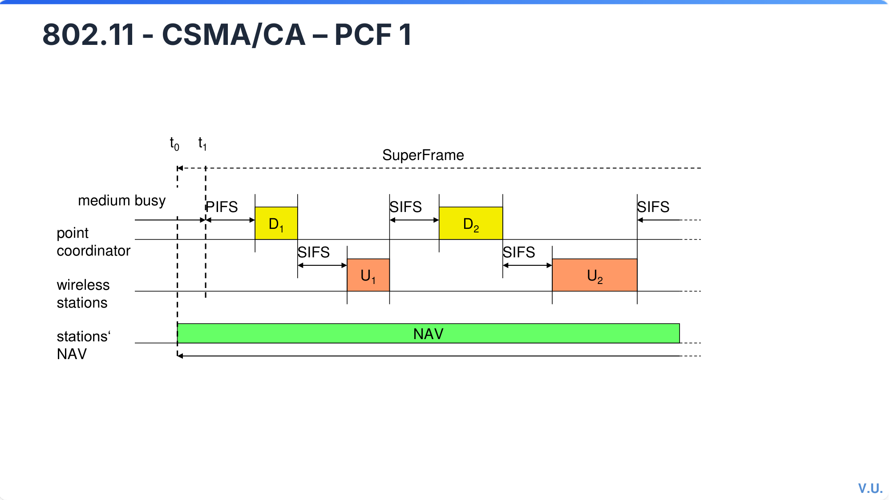

IEEE 802.11 defines distinct inter-frame gap durations to enforce traffic priorities:

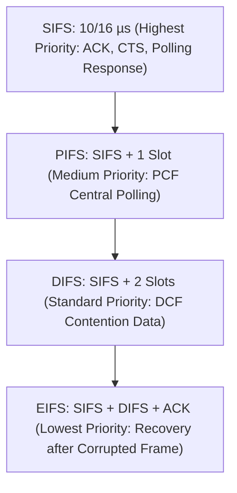
```mermaid
flowchart TD
    SIFS["SIFS: 10/16 µs (Highest Priority: ACK, CTS, Polling Response)"]
    PIFS["PIFS: SIFS + 1 Slot (Medium Priority: PCF Central Polling)"]
    DIFS["DIFS: SIFS + 2 Slots (Standard Priority: DCF Contention Data)"]
    EIFS["EIFS: SIFS + DIFS + ACK (Lowest Priority: Recovery after Corrupted Frame)"]

    SIFS --> PIFS --> DIFS --> EIFS
```

* **SIFS (Short Inter-Frame Space):** Shortest gap ($10\,\mu\text{s}$ in 802.11b/g, $16\,\mu\text{s}$ in 802.11a/ac). Reserved for the highest-priority transmissions: ACK frames, CTS frames, and subsequent fragments of a burst. No station can seize the channel between a data frame and its ACK.
* **PIFS (PCF Inter-Frame Space):** $\text{PIFS} = \text{SIFS} + 1 \times \text{Slot Time}$. Used by the centralized Access Point in **Point Coordination Function (PCF)** mode to poll stations for real-time traffic without contending.
* **DIFS (DCF Inter-Frame Space):** $\text{DIFS} = \text{SIFS} + 2 \times \text{Slot Time}$. Used by standard asynchronous stations in **Distributed Coordination Function (DCF)** mode.
* **EIFS (Extended Inter-Frame Space):** Longest gap; invoked when a station receives an unreadable/corrupted frame to give other stations time to complete ongoing acknowledgments.

$$
\text{SIFSTime} = \text{aRxRFDelay} + \text{aRxPLCPDelay} + \text{aMACProcessingDelay} + \text{aRxTxTurnaroundTime}
$$

[Source: Ch 4 MAC Layer.pdf, Slides 57–59; Chapter4-Medium Access Control SubLayer.pdf, Slides 48–54]

---

### IEEE 802.11 MAC Frame Format & 4-Address Scheme

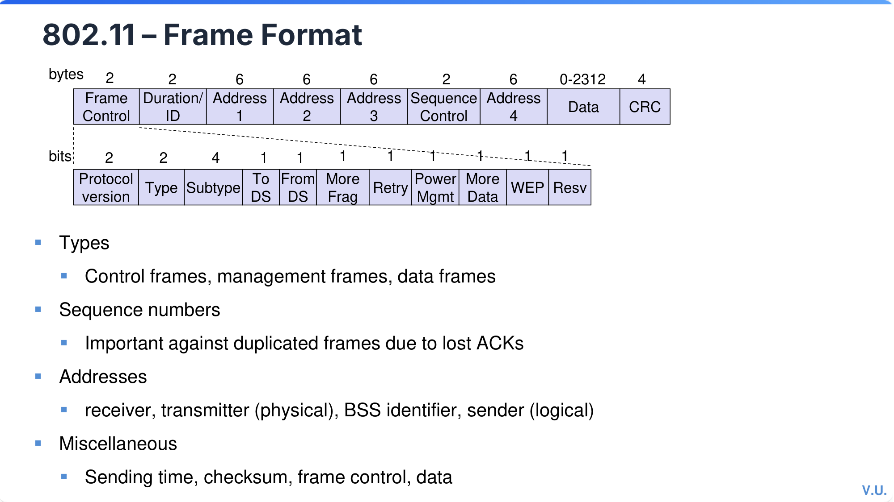

```text
+----------+----------+-----------+-----------+-----------+-----------+----------+---------------+-------+
| Frame    | Duration | Address 1 | Address 2 | Address 3 | Sequence  | Address 4| Payload       | FCS   |
| Ctrl(2B) | /ID (2B) | (6 Bytes) | (6 Bytes) | (6 Bytes) | Ctrl (2B) | (6 Bytes)| (0 - 2312 B)  | (4 B) |
+----------+----------+-----------+-----------+-----------+-----------+----------+---------------+-------+
```

#### Address Field Interpretation Truth Table

| To DS | From DS | Address 1 (RA) | Address 2 (TA) | Address 3 | Address 4 | Operational Scenario |
| :---: | :---: | :--- | :--- | :--- | :--- | :--- |
| `0` | `0` | Destination MAC | Source MAC | BSSID | N/A | Ad-hoc (IBSS) or direct station-to-station |
| `1` | `0` | AP MAC (BSSID) | Source MAC | Destination MAC | N/A | Station transmitting frame *into* the Distribution System (AP) |
| `0` | `1` | Destination MAC | AP MAC (BSSID) | Source MAC | N/A | AP transmitting frame *out of* Distribution System to station |
| `1` | `1` | Next-hop AP (RA) | Current AP (TA) | Destination MAC | Source MAC | Wireless Bridge / Wireless Mesh backbone between APs |

[Source: Ch 4 MAC Layer.pdf, Slides 67–68; Chapter4-Medium Access Control SubLayer.pdf, Slides 65–70]

---

## 8. Data Link Layer Switching & Bridges

Bridges and Layer 2 Switches connect multiple distinct physical LAN segments into a single logical broadcast domain, operating entirely at Layer 2 by inspecting MAC addresses.

---

### Transparent Learning Bridge Algorithm

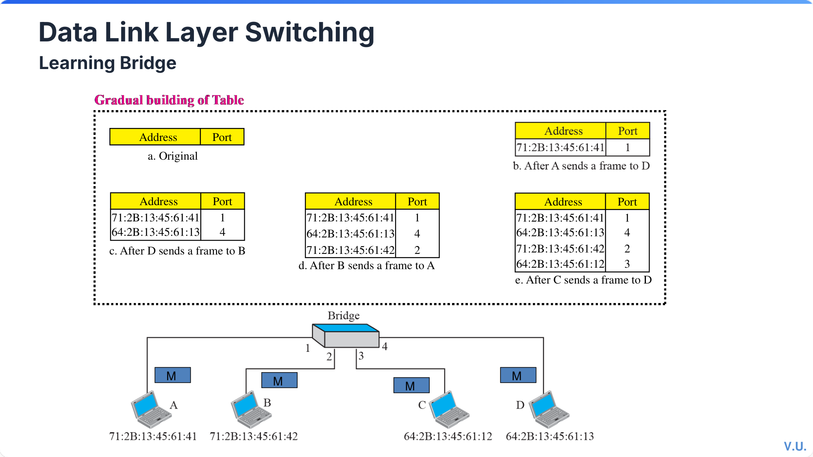

A transparent bridge is plug-and-play; when connected, it learns network topology automatically using **Backward Learning**.


```mermaid
flowchart LR
    subgraph LAN1 ["Segment 1"]
        A[Host A]
        B[Host B]
    end
    subgraph Switch ["Learning Bridge / Switch"]
        P1[Port 1]
        FDB[(Forwarding Table<br>MAC &#124; Port &#124; Age)]
        P2[Port 2]
    end
    subgraph LAN2 ["Segment 2"]
        C[Host C]
        D[Host D]
    end

    A --- P1
    B --- P1
    P1 --- FDB --- P2
    P2 --- C
    P2 --- D
```

#### The Bridge Learning & Forwarding Procedure
For every incoming frame arriving on Ingress Port $P$:
1. **Learn Source Address:** Extract Source MAC address and update table:

$$
\text{Table}[\text{Source MAC}] = (\text{Port } P, \; \text{Timestamp} = \text{now})
$$

2. **Forwarding Lookup:** Extract Destination MAC address:
   * **Case 1 (Destination on Same Port):** If Table has Destination MAC mapped to Port $P$, **Filter (Drop)** the frame (destination is on the same local segment; frame already reached it).
   * **Case 2 (Destination on Different Port $Q$):** If Table has Destination MAC mapped to Port $Q \ne P$, **Forward** the frame out Port $Q$ only.
   * **Case 3 (Destination Unknown or Broadcast/Multicast):** If Destination MAC is not in Table or is `FF:FF:FF:FF:FF:FF`, **Flood** the frame out all ports *except* the arrival port $P$.
3. **Aging:** An aging timer periodically purges table entries that have not been refreshed within e.g. 300 seconds to adapt when hosts move to different ports.

[Source: Ch 4 MAC Layer.pdf, Slides 71–76; Chapter4-Medium Access Control SubLayer.pdf, Slides 72–80; CN_Numericals_MAC_Layer.pdf, Page 17]

---

### Spanning Tree Protocol (STP — IEEE 802.1D)

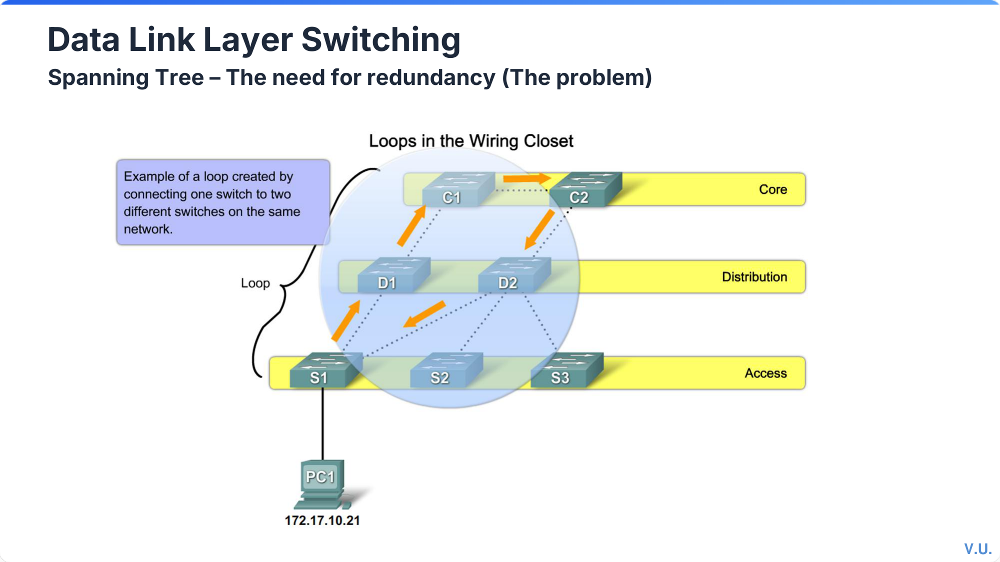
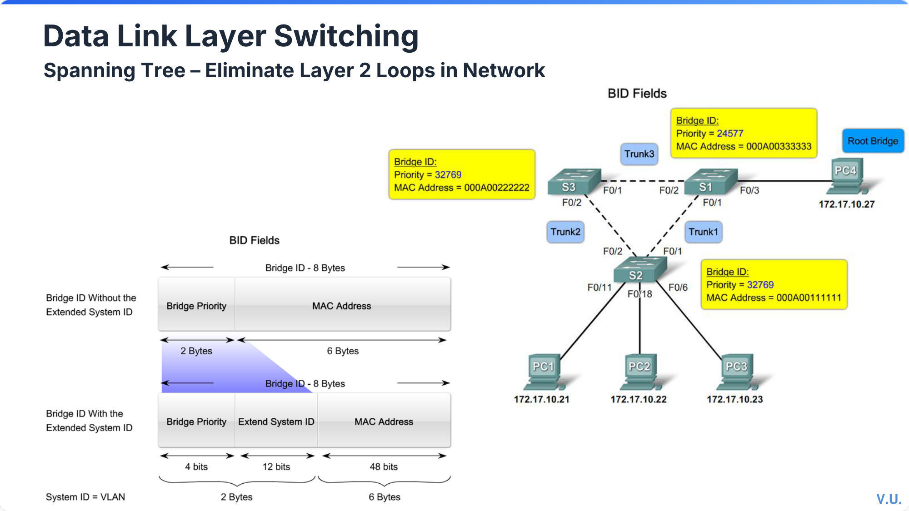

To provide fault tolerance, network engineers build redundant physical links between bridges. However, redundant Layer 2 loops cause catastrophic failure:

1. **Broadcast Storms:** Broadcast frames (such as ARP requests) circulate indefinitely in loops, being endlessly replicated and consuming $100\%$ of bandwidth.
2. **MAC Database Instability (Thrashing):** Bridges receive copies of the same frame from different ports, constantly rewriting their forwarding tables.
3. **Multiple Duplicate Frame Delivery:** End hosts receive endless duplicate copies of unicast frames.

```mermaid
flowchart TD
    subgraph LoopProblem ["Physical Redundant Loop"]
        SW1((Switch 1)) <-->|Link A| SW2((Switch 2))
        SW1 <-->|Link B (Redundant)| SW2
    end
    subgraph STPSolution ["Logical Spanning Tree Topology"]
        SWA((Switch 1 - ROOT)) ===|Active Link A| SWB((Switch 2))
        SWA -.-x|Link B: Port BLOCKED by STP| SWB
    end
```

#### Radia Perlman's Spanning Tree Algorithm
Bridges exchange **Bridge Protocol Data Units (BPDUs)** containing `(Root BID, Root Path Cost, Sender BID, Sender Port ID)` to prune the graph into a loop-free tree:

1. **Step 1: Elect the Root Bridge:** The bridge with the **lowest Bridge ID (BID = Priority : MAC Address)** becomes the Root Bridge of the entire network.
2. **Step 2: Elect Root Ports (RP):** On every non-root bridge, elect exactly **one Root Port** — the port with the lowest cumulative Path Cost to the Root Bridge.
3. **Step 3: Elect Designated Ports (DP):** On every physical LAN segment, elect exactly **one Designated Port** — the bridge port attached to that segment that advertises the lowest Path Cost to the Root Bridge. All ports on the Root Bridge are Designated Ports.
4. **Step 4: Block Remaining Ports (Blocking / Alternate Ports):** Any port that is neither a Root Port nor a Designated Port is placed in the **Blocking / Discarding State**. Blocked ports drop user traffic and MAC learning, but continue listening to BPDUs to activate automatically if a primary link fails.

[Source: Ch 4 MAC Layer.pdf, Slides 77–83; Chapter4-Medium Access Control SubLayer.pdf, Slides 81–90]

---

### Network Devices Interconnection Hierarchy

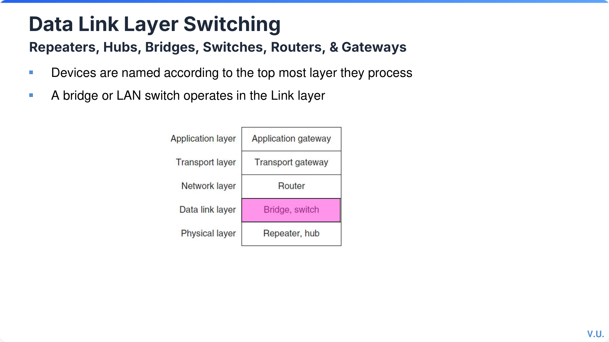

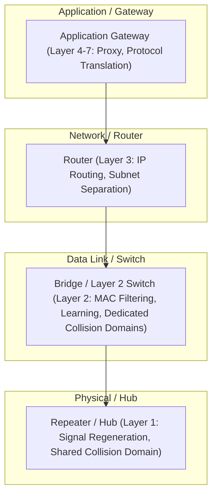
```mermaid
flowchart TD
    subgraph L7 ["Application / Gateway"]
        D5["Application Gateway (Layer 4-7: Proxy, Protocol Translation)"]
    end
    subgraph L3 ["Network / Router"]
        D4["Router (Layer 3: IP Routing, Subnet Separation)"]
    end
    subgraph L2 ["Data Link / Switch"]
        D3["Bridge / Layer 2 Switch (Layer 2: MAC Filtering, Learning, Dedicated Collision Domains)"]
    end
    subgraph L1 ["Physical / Hub"]
        D2["Repeater / Hub (Layer 1: Signal Regeneration, Shared Collision Domain)"]
    end

    D5 --> D4 --> D3 --> D2
```

| Interconnection Device | Operating Layer | Collision Domains | Broadcast Domains | Forwarding Basis | Key Function |
| :--- | :---: | :---: | :---: | :--- | :--- |
| **Repeater / Hub** | Layer 1 (Physical) | 1 (Shared across all ports) | 1 (All ports) | None (Blind bit repeating) | Regenerates weak electrical/optical signals |
| **Bridge / L2 Switch** | Layer 2 (Data Link)| 1 per port (Isolated) | 1 (All ports) | Destination MAC address | Learns MACs, filters local frames, breaks collision domains |
| **Router** | Layer 3 (Network) | 1 per port | 1 per port (Breaks broadcasts)| Destination IP address | Computes routing tables, routes packets across subnets |
| **Application Gateway** | Layers 4–7 | N/A | N/A | Application payloads | Translates incompatible application protocols (e.g. SMTP/SMS) |

[Source: Ch 4 MAC Layer.pdf, Slide 84; Chapter4-Medium Access Control SubLayer.pdf, Slide 91]

---

## 9. Virtual LANs (VLANs — IEEE 802.1Q)

A **Virtual Local Area Network (VLAN)** is a logical broadcast domain created by switch software configuration, allowing network administrators to segment a physical LAN into multiple isolated logical subnets regardless of physical location.

---

### Physical vs Logical Segmentation

* **Without VLANs:** To separate departments (e.g., Engineering, Finance, HR), an enterprise must buy separate physical switches and run separate cables for each department. Moving an employee to a new office requires physical recabling.
* **With VLANs:** All departments plug into the same shared physical switch infrastructure. Broadcast traffic from Engineering is confined strictly to Engineering ports; HR traffic is completely invisible to Engineering. Moving an employee to a new department is done instantly by reassigning the switch port's VLAN ID via software.

[Source: Ch 4 MAC Layer.pdf, Slides 85–86; Chapter4-Medium Access Control SubLayer.pdf, Slides 92–94]

---

### VLAN Port Modes & IEEE 802.1Q Frame Tagging

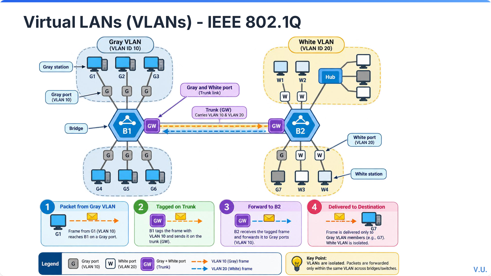

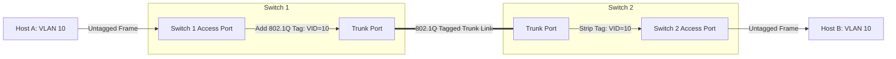
```mermaid
flowchart LR
    Host1[Host A: VLAN 10] -->|Untagged Frame| SW1_P1[Switch 1 Access Port]
    subgraph SW1 ["Switch 1"]
        SW1_P1 -->|Add 802.1Q Tag: VID=10| Trunk1[Trunk Port]
    end
    Trunk1 ===|802.1Q Tagged Trunk Link| Trunk2[Trunk Port]
    subgraph SW2 ["Switch 2"]
        Trunk2 -->|Strip Tag: VID=10| SW2_P2[Switch 2 Access Port]
    end
    SW2_P2 -->|Untagged Frame| Host2[Host B: VLAN 10]
```

1. **Access Port (Untagged Port):** Connects to standard end-user machines (PCs, printers, servers). Frames entering and leaving access ports are standard untagged Ethernet frames; the NIC is unaware of VLANs.
2. **Trunk Port (Tagged Port):** Connects switches to other switches or routers. Carries traffic for multiple VLANs simultaneously across a single physical link by inserting a **4-byte IEEE 802.1Q Tag** into each frame header between the Source MAC address and the EtherType field.

#### The 4-Byte IEEE 802.1Q Tag Format

```text
+----------------------+--------------------+---------+-------------------+
| TPID (2 Bytes)       | Priority (3 bits)  | CFI (1) | VLAN ID (12 bits) |
| Standard Value 0x8100| IEEE 802.1p CoS    | Drop E. | Values: 1 - 4094  |
+----------------------+--------------------+---------+-------------------+
```

* **TPID (Tag Protocol Identifier — 2 Bytes):** Fixed value `0x8100` indicating an 802.1Q tagged frame.
* **Priority (PCP / CoS — 3 bits):** IEEE 802.1p Class of Service (8 priority levels for QoS/voice traffic).
* **CFI / DEI (Canonical Format Indicator — 1 bit):** Token Ring format compatibility or Drop Eligibility.
* **VLAN ID (VID — 12 bits):** Identifies the VLAN ($2^{12} = 4096$ possible IDs; $0$ and $4095$ are reserved; $1$ to $4094$ are usable).

[Source: Ch 4 MAC Layer.pdf, Slides 87–90; Chapter4-Medium Access Control SubLayer.pdf, Slides 95–98]

---

## 10. Mathematical Foundations, Formulas & Derivations

---

### 1. Pure ALOHA Throughput

$$
S = G e^{-2G}
$$

* Max throughput: $S_{\max} = \frac{1}{2e} \approx 18.4\%$ at offered load $G = 0.5$.

### 2. Slotted ALOHA Throughput

$$
S = G e^{-G}
$$

* Max throughput: $S_{\max} = \frac{1}{e} \approx 36.8\%$ at offered load $G = 1.0$.

### 3. Collision Fraction in Slotted Broadcast Subnet
With $n$ hosts transmitting with probability $p$ in any slot:
* $P_{\text{success}} = n p (1 - p)^{n-1}$
* $P_{\text{idle}} = (1 - p)^n$
* $P_{\text{collision}} = 1 - n p (1 - p)^{n-1} - (1 - p)^n$

### 4. CSMA/CD Minimum Frame Size

$$
L_{\min} = 2 \cdot \tau \cdot B = 2 \cdot \left(\frac{D}{v}\right) \cdot B
$$

* $L_{\min}$ = Minimum frame length in bits.
* $\tau = \frac{D}{v}$ = Maximum one-way propagation delay.
* $B$ = Channel transmission bit rate in bps.

### 5. Ethernet Channel Efficiency

$$
\eta = \frac{1}{1 + \frac{2 B L e}{c F}}
$$

* $F$ = Frame size (bits), $B$ = Bandwidth (bps), $L$ = Cable length (m), $c$ = Propagation velocity (m/s), $e \approx 2.718$.

### 6. Bluetooth FHSS Dwell Time

$$
T_{\text{dwell}} = \frac{1}{\text{Hop Rate}} = \frac{1}{1600\text{ hops/s}} = 625\,\mu\text{s}
$$

[Source: CN_Numericals_MAC_Layer.pdf, Pages 2, 4, 10, 16]

---

### Derivation: Mean Contention Slots in CSMA/CD via Geometric Series Derivative

#### Problem Context & Mathematical Formulation
In classic CSMA/CD (IEEE 802.3), let $k$ stations contend for access during a contention interval. Each station transmits in a slot with probability $p$.
The probability that exactly one station transmits successfully in a given contention slot is:

$$
A = k p (1 - p)^{k - 1}
$$

The probability that the contention interval terminates after exactly $j$ failed contention slots followed by 1 successful slot is geometrically distributed:

$$
P(\text{conquer in slot } j) = A (1 - A)^{j - 1} \quad \text{for } j = 1, 2, 3, \dots
$$

The expected (mean) number of contention slots until success is:

$$
\text{Mean} = \sum_{j=0}^{\infty} j \cdot A (1 - A)^{j - 1}
$$

#### Step-by-Step Derivation
1. **Index Adjustment:**
   Since the term evaluates to 0 when $j = 0$, we start the summation index at $j = 1$ without altering the sum:

$$
\text{Mean} = \sum_{j=1}^{\infty} j \cdot A (1 - A)^{j - 1}
$$

2. **Factoring Constant:**
   Factor the constant probability $A$ outside the summation:

$$
\text{Mean} = A \sum_{j=1}^{\infty} j (1 - A)^{j - 1}
$$

3. **Geometric Series Differentiability:**
   Let $x = 1 - A$. Since $0 < A < 1$, $|x| < 1$. Recall the standard infinite geometric series:

$$
\sum_{j=0}^{\infty} x^j = \frac{1}{1 - x} \quad \text{for } |x| < 1
$$

4. **Differentiating with Respect to $x$:**
   Differentiating term-by-term on both sides:

$$
\frac{d}{dx}\left(\sum_{j=0}^{\infty} x^j\right) = \sum_{j=1}^{\infty} j x^{j - 1} = \frac{d}{dx}\left(\frac{1}{1 - x}\right) = \frac{1}{(1 - x)^2}
$$

5. **Back-Substitution of $x = 1 - A$:**
   Substitute $x = 1 - A$ into the derivative identity:

$$
\sum_{j=1}^{\infty} j (1 - A)^{j - 1} = \frac{1}{(1 - (1 - A))^2} = \frac{1}{A^2}
$$

6. **Final Result:**
   Multiply by the pre-factored scalar $A$:

$$
\text{Mean} = A \cdot \frac{1}{A^2} = \frac{1}{A}
$$

#### Engineering Significance
Because the mean number of contention slots is $\frac{1}{A}$, the mean contention waste time is $\frac{2\tau}{A}$. When optimal transmission probability $p = \frac{1}{k}$ is chosen, $A \to \frac{1}{e} \approx 0.368$ as $k \to \infty$, which means an average of $e \approx 2.718$ contention slots precede every successful frame transmission.

[Source: Ch 4 MAC Layer.pdf, Slide 91]

---

## 11. Algorithms and Procedures

---

### Algorithm 4.1: CSMA/CD Transmission with Binary Exponential Backoff

**Purpose:** Transmit frame on shared half-duplex Ethernet while detecting collisions and resolving contention.
**Procedure:**
1. Set collision attempt counter $i = 0$.
2. **Sense Carrier:**
   * If channel is busy, wait until idle (1-persistent).
   * When channel is idle, begin transmitting frame bits immediately.
3. **Listen While Transmitting:**
   * If entire frame ($L \ge L_{\min}$) finishes without collision, transmission is **successful**; exit.
   * If collision is detected before transmission finishes:
     1. Immediately abort data transmission.
     2. Transmit a **32-to-48-bit Jamming Signal** so all stations detect collision.
     3. Increment collision counter $i = i + 1$.
     4. If $i > 16$, abort transmission and report excessive collision failure to Layer 3.
     5. Calculate $k = \min(i, 10)$.
     6. Select random integer $r$ uniformly distributed in $[0, 2^k - 1]$.
     7. Wait backoff delay $T_{\text{wait}} = r \times 51.2\,\mu\text{s}$.
     8. Return to Step 2.

---

### Algorithm 4.2: Adaptive Tree Walk Contention Resolution

**Purpose:** Resolve collisions among $N = 2^k$ stations using recursive binary search.
**Procedure:**
1. Push Root Node (all stations $0$ to $N-1$) onto evaluation stack.
2. While stack is not empty:
   * Pop node $u$ from stack.
   * Invite all stations in node $u$'s subtree to transmit in the current slot.
   * If channel is **Idle** $\implies$ No stations under $u$ want to send; continue.
   * If channel is **Success** $\implies$ Exactly one station transmitted successfully; continue.
   * If channel is **Collision**:
     * Push Right Child of $u$ onto stack.
     * Push Left Child of $u$ onto stack (evaluated first in next slot).

---

### Algorithm 4.3: Transparent Learning Bridge Forwarding

**Purpose:** Forward Layer 2 frames and self-learn topology without loops.
**Input:** Incoming frame with Source MAC $S$, Destination MAC $D$, arriving on Port $P$.
**Procedure:**
1. Update forwarding table: $\text{Table}[S] = (P, \text{now})$.
2. If $D$ is in Table:
   * Let $Q = \text{Table}[D].\text{Port}$.
   * If $Q == P$: **Filter (Drop)** frame.
   * Else ($Q \ne P$): **Forward** frame out Port $Q$ only.
3. Else ($D$ not in Table OR $D == \text{FF:FF:FF:FF:FF:FF}$):
   * **Flood** frame out all bridge ports *except* Ingress Port $P$.

[Source: Ch 4 MAC Layer.pdf, Slides 21, 40, 74]

---

## 12. Diagrams and Architecture Analysis

---

### Figure 4.1: Pure ALOHA Transmission & Vulnerable Period


#### Written Analysis of Figure 4.1
* **What it shows:** Illustrates why Pure ALOHA has a vulnerable period of $2T_f$. A frame starting at $t_0$ collides if any other frame begins transmission between $t_0 - T_f$ and $t_0 + T_f$.
* **Components:** Time axis, User generation events, Overlapping frame rectangles, Vulnerable period span of $2T_f$.

[Source: Ch 4 MAC Layer.pdf, Slide 10]

---

### Figure 4.2: Pure ALOHA vs Slotted ALOHA Vulnerable Period Comparison


#### Written Analysis of Figure 4.2
* **What it shows:** Visual side-by-side comparison showing how synchronizing frame starts to slot boundaries eliminates partial collisions and halves the vulnerable period from $2T_f$ to $T_f$.

[Source: Ch 4 MAC Layer.pdf, Slide 12]

---

### Figure 4.3: ALOHA Throughput vs Offered Load ($S$ vs $G$) Curves


#### Written Analysis of Figure 4.3
* **What it shows:** Mathematical plot of throughput $S$ versus offered channel traffic $G$:
  * Pure ALOHA peaks at $S = 18.4\%$ when $G = 0.5$.
  * Slotted ALOHA peaks at $S = 36.8\%$ when $G = 1.0$.
  * Beyond peak load, collisions dominate and throughput collapses towards zero.

[Source: Ch 4 MAC Layer.pdf, Slide 15]

---

### Figure 4.4: CSMA Persistence Strategies Comparison


#### Written Analysis of Figure 4.4
* **What it shows:** Flowchart and timeline behavior comparing 1-persistent, non-persistent, and p-persistent listening strategies when encountering busy channels.

[Source: Ch 4 MAC Layer.pdf, Slide 17]

---

### Figure 4.5: CSMA/CD Collision Timeline & Slot Duration ($2\tau$)


#### Written Analysis of Figure 4.5
* **What it shows:** The fundamental worst-case collision scenario where Station B starts transmitting at $t = \tau - \epsilon$ right before Station A's signal arrives, requiring total time $2\tau$ for collision signal to return to Station A.

[Source: Ch 4 MAC Layer.pdf, Slide 20]

---

### Figure 4.6: Basic Bit-Map (Reservation) Protocol


#### Written Analysis of Figure 4.6
* **What it shows:** The collision-free frame cycle consisting of an $N$-bit reservation header followed by collision-free transmission of queued data frames in numerical order.

[Source: Ch 4 MAC Layer.pdf, Slide 27]

---

### Figure 4.7: Binary Countdown Protocol


#### Written Analysis of Figure 4.7
* **What it shows:** Bit-by-bit address arbitration over a boolean wired-OR channel, showing how lower-addressed stations concede as soon as they read a `1` while broadcasting a `0`.

[Source: Ch 4 MAC Layer.pdf, Slide 32]

---

### Figure 4.8: Adaptive Tree Walk Contention Resolution


#### Written Analysis of Figure 4.8
* **What it shows:** Binary tree search resolving collisions among 8 stations by recursively searching left subtrees before right subtrees upon detecting collisions.

[Source: Ch 4 MAC Layer.pdf, Slide 40]

---

### Figure 4.9: Classic IEEE 802.3 Ethernet Frame Format


#### Written Analysis of Figure 4.9
* **What it shows:** Complete byte layout of IEEE 802.3 frame: Preamble (7B), SFD (1B), Dest MAC (6B), Source MAC (6B), Type/Length (2B), Data Payload (46–1500B), FCS Checksum (4B).

[Source: Ch 4 MAC Layer.pdf, Slide 42]

---

### Figure 4.10: Ethernet Collision Window Round-Trip


#### Written Analysis of Figure 4.10
* **What it shows:** Mathematical relationship proving why 10Base5 Ethernet with 4 repeaters requires a 512-bit ($64\text{ Byte}$) minimum frame size to cover the $51.2\,\mu\text{s}$ round-trip collision window.

[Source: Ch 4 MAC Layer.pdf, Slide 43]

---

### Figure 4.11: Hidden and Exposed Terminal Scenarios in Wireless Networks


#### Written Analysis of Figure 4.11
* **What it shows:** (a) Hidden Terminal problem where A and C collide at mutual receiver B. (b) Exposed Terminal problem where C falsely defers transmission to D while B transmits to A.

[Source: Ch 4 MAC Layer.pdf, Slide 51]

---

### Figure 4.12: IEEE 802.11 Wireless Architecture (BSS, ESS, AP)


#### Written Analysis of Figure 4.12
* **What it shows:** Architecture of Wi-Fi networks: Basic Service Sets (BSS) containing wireless client stations and an Access Point (AP), interconnected via a wired Distribution System (DS) to form an Extended Service Set (ESS).

[Source: Ch 4 MAC Layer.pdf, Slide 53]

---

### Figure 4.13: IEEE 802.11 Inter-Frame Spacing (IFS) Priorities


#### Written Analysis of Figure 4.13
* **What it shows:** Hierarchy of inter-frame spacing intervals: $\text{SIFS} < \text{PIFS} < \text{DIFS} < \text{EIFS}$, ensuring immediate ACKs seize the channel before contention data.

[Source: Ch 4 MAC Layer.pdf, Slide 57]

---

### Figure 4.14: IEEE 802.11 CSMA/CA Backoff Timeline


#### Written Analysis of Figure 4.14
* **What it shows:** CSMA/CA backoff countdown across multiple contending stations: backoff timer freezes when channel is busy and resumes when idle after DIFS.

[Source: Ch 4 MAC Layer.pdf, Slide 60]

---

### Figure 4.15: IEEE 802.11 RTS/CTS Exchange with Virtual Carrier Sensing (NAV)


#### Written Analysis of Figure 4.15
* **What it shows:** Four-way handshake (RTS $\to$ CTS $\to$ Data $\to$ ACK) and NAV timer intervals that force hidden stations to stay silent.

[Source: Ch 4 MAC Layer.pdf, Slide 63]

---

### Figure 4.16: IEEE 802.11 MAC Frame Format


#### Written Analysis of Figure 4.16
* **What it shows:** Detailed layout of 802.11 frame: Frame Control (2B), Duration/ID (2B), 4 MAC Address fields (6B each), Sequence Control (2B), Payload (up to 2312B), FCS (4B).

[Source: Ch 4 MAC Layer.pdf, Slide 67]

---

### Figure 4.17: Transparent Learning Bridge Operation & Table Evolution


#### Written Analysis of Figure 4.17
* **What it shows:** Step-by-step forwarding database table evolution as frames arrive across ports, showing dynamic MAC address learning, filtering of local frames, and selective forwarding.

[Source: Ch 4 MAC Layer.pdf, Slide 72]

---

### Figure 4.18: Spanning Tree Protocol: Layer 2 Loop & Broadcast Storm Problem


#### Written Analysis of Figure 4.18
* **What it shows:** Demonstrates how redundant physical loops cause broadcast frames to circulate endlessly in opposite directions, causing broadcast storms and switch crashes.

[Source: Ch 4 MAC Layer.pdf, Slide 78]

---

### Figure 4.19: Spanning Tree Protocol: Electing Root Bridge, Root Ports & Designated Ports


#### Written Analysis of Figure 4.19
* **What it shows:** A multi-switch network running 802.1D STP: Root Bridge election (lowest BID), Root Ports (RP), Designated Ports (DP), and Blocked Ports (BP) creating a loop-free tree.

[Source: Ch 4 MAC Layer.pdf, Slide 80]

---

### Figure 4.20: Network Interconnection Devices Across Protocol Layers


#### Written Analysis of Figure 4.20
* **What it shows:** Structural mapping of Repeaters/Hubs (Layer 1), Bridges/Switches (Layer 2), Routers (Layer 3), and Gateways (Layers 4–7) against the OSI reference stack.

[Source: Ch 4 MAC Layer.pdf, Slide 84]

---

### Figure 4.21: IEEE 802.1Q VLAN Frame Tagging & Architecture


#### Written Analysis of Figure 4.21
* **What it shows:** Shows insertion of 4-byte 802.1Q tag header (TPID `0x8100`, Priority bits, CFI, 12-bit VID) across switch trunk links to maintain logical separation across multiple switches.

[Source: Ch 4 MAC Layer.pdf, Slide 88]

---

### Figure 4.22: CSMA/CD Contention Slot Infinite Geometric Series Derivation


#### Written Analysis of Figure 4.22

**What it shows:**
Slide 91's formal mathematical proof establishing the mean number of contention slots in IEEE 802.3 CSMA/CD using the derivative of a standard geometric series.
* Evaluates $\sum_{j=0}^{\infty} j A (1-A)^{j-1}$.
* Substitutes $x = 1-A$ into $\frac{d}{dx}(1-x)^{-1} = (1-x)^{-2} = A^{-2}$.
* Proves that the expected number of slots consumed per transmission is exactly $\frac{1}{A}$.

[Source: Ch 4 MAC Layer.pdf, Slide 91]

---

### Figure 4.23: IEEE 802.11 Competing Stations Backoff and Contention Window


#### Written Analysis of Figure 4.23

**What it shows:**
The timeline interaction among multiple contending wireless stations in IEEE 802.11 DCF:
1. When station finds the medium busy, it defers until transmission ends.
2. Station waits for a DIFS idle period, then samples a random backoff integer from $[0, \text{CW}]$.
3. The backoff counter decrements only while the medium remains idle during slot times.
4. If another station's counter expires first and transmits, remaining stations freeze their backoff counters, resuming countdown only after the new transmission finishes plus another DIFS.

[Source: Ch 4 MAC Layer.pdf, Slide 61]

---

### Figure 4.24: IEEE 802.11 MAC Frame Fragmentation Mechanism


#### Written Analysis of Figure 4.24

**What it shows:**
Fragmentation of large network packets into smaller MAC Protocol Data Units (MPDUs) to combat high wireless bit error rates:
* Once channel access is won via RTS/CTS, fragments are transmitted in a burst separated only by SIFS.
* Each fragment receives an individual ACK. If fragment 2 is corrupted, only fragment 2 is retransmitted, avoiding retransmission of the entire multi-kilobyte MSDU.

[Source: Ch 4 MAC Layer.pdf, Slide 64]

---

### Figure 4.25: IEEE 802.11 PCF Superframe and Contention-Free Period


#### Written Analysis of Figure 4.25

**What it shows:**
The Point Coordination Function (PCF) centralized polling architecture operating atop DCF:
* The Access Point emits periodic Beacon frames at PIFS priority, seizing control of the medium.
* The Superframe is split into a Contention-Free Period (CFP) where the AP polls registered delay-sensitive nodes, and a standard Contention Period (CP) utilizing DCF CSMA/CA.

[Source: Ch 4 MAC Layer.pdf, Slide 65]

---

## 13. Tables and Comprehensive Comparisons

---

### Table 4.1: Comparison of Channel Allocation Categories

| Feature | Random Access (ALOHA, CSMA/CD) | Collision-Free (Bit-Map, Countdown)| Limited Contention (Tree Walk) |
| :--- | :--- | :--- | :--- |
| **Delay at Low Load** | Minimal (instant transmission) | High (must wait for reservation phase)| Low (immediate transmission) |
| **Throughput at High Load** | Degrades due to collisions ($18\%$–$36\%$) | Maximum (approaches $100\%$) | High (approaches $100\%$) |
| **Collisions** | Inherent part of protocol | Completely eliminated | Allowed initially; resolved quickly |
| **Station Scalability** | High (stations come and go freely) | Low (fixed overhead $N$) | Moderate to High |

[Source: Ch 4 MAC Layer.pdf, Slides 26, 36]

---

### Table 4.2: CSMA/CD vs CSMA/CA Comparison

| Characteristic | CSMA/CD (IEEE 802.3 Ethernet) | CSMA/CA (IEEE 802.11 Wi-Fi) |
| :--- | :--- | :--- |
| **Transmission Medium** | Wired (Coaxial, Twisted Pair, Fiber) | Wireless Radio Frequency (RF) |
| **Collision Action** | **Detect & Abort:** Listens during transmission, stops immediately on collision | **Avoidance:** Cannot detect collisions while sending; prevents via RTS/CTS, NAV, IFS |
| **Acknowledgment** | No DLL acknowledgment (physical link is reliable) | Explicit immediate ACK frame for every data frame |
| **Carrier Sensing** | Physical voltage sensing on wire | Physical (CCA) + Virtual Carrier Sensing (NAV) |
| **Backoff Trigger** | Triggered *after* collision detection | Triggered *before* every transmission when channel is busy |

[Source: Ch 4 MAC Layer.pdf, Slides 20, 60; Chapter4-Medium Access Control SubLayer.pdf, Slide 50]

---

### Table 4.3: Comparison of Network Interconnection Hardware

| Device | OSI Layer | Collision Domain | Broadcast Domain | Forwarding Logic | Key Benefit |
| :--- | :---: | :---: | :---: | :--- | :--- |
| **Hub** | Layer 1 | 1 (All ports shared) | 1 (All ports shared) | Electrical signal repetition | Lowest cost physical star |
| **Switch** | Layer 2 | Isolated (1 per port) | 1 (All ports shared) | MAC Address Learning Table | Dedicated full bandwidth per port |
| **Router** | Layer 3 | Isolated (1 per port) | Isolated (1 per port) | IP Routing Table | Segments subnets, filters broadcasts |
| **Gateway** | Layers 4–7| Isolated | Isolated | Application Payload Parsing | Connects completely different systems |

[Source: Ch 4 MAC Layer.pdf, Slide 84]

---

## 14. Worked Numerical Problems

---

### Numerical Problem 1: Wasted Slots Fraction in Slotted Broadcast Subnet

#### Problem Statement
A broadcast channel with $n$ contending hosts operates in discrete slots. Each host attempts to transmit with probability $p$ during each slot. Derive the exact fraction of slots wasted due to collisions.

#### Step-by-Step Solution
1. Define the complete set of mutually exclusive outcomes for any slot:
   * **Event 1 (Success by specific station $i$):** Station $i$ transmits ($p$), remaining $(n-1)$ stations remain silent ($(1-p)^{n-1}$).

$$
P(\text{Host } i \text{ succeeds}) = p(1-p)^{n-1}
$$

   * **Total Success Probability ($P_{\text{success}}$):** Any one of the $n$ stations succeeds:

$$
P_{\text{success}} = n p (1 - p)^{n-1}
$$

   * **Idle Channel Probability ($P_{\text{idle}}$):** No station transmits:

$$
P_{\text{idle}} = (1 - p)^n
$$

   * **Collision Probability ($P_{\text{collision}}$):** Two or more stations transmit.
2. Since total probability sums to 1:

$$
P_{\text{collision}} = 1 - P_{\text{success}} - P_{\text{idle}} = 1 - n p(1 - p)^{n-1} - (1 - p)^n
$$

#### Final Answer
* **Fraction of Wasted Slots:** $1 - n p(1 - p)^{n-1} - (1 - p)^n$

[Source: CN_Numericals_MAC_Layer.pdf, Pages 2–3]

---

### Numerical Problem 2: Delay of Pure ALOHA vs Slotted ALOHA at Low Load

#### Problem Statement
Consider the delay of Pure ALOHA versus Slotted ALOHA at very low traffic load ($G \approx 0$). Which protocol exhibits lower transmission delay, and why?

#### Step-by-Step Solution
1. In **Pure ALOHA**, a station transmits **immediately** the instant a frame is generated, with zero alignment delay. At low load ($G \to 0$), collisions are negligible, so average delay is simply the frame transmission time:

$$
T_{\text{Pure}} = T_f
$$

2. In **Slotted ALOHA**, a station generating a frame at a random time must wait for the start of the next slot. On average, this waiting time is half a slot ($\frac{1}{2} T_f$). The total delay is:

$$
T_{\text{Slotted}} = T_f + 0.5 T_f = 1.5 T_f
$$

3. Therefore, at light load, Pure ALOHA has **less delay** because it does not incur the average half-slot synchronization waiting time.

#### Final Answer
* **Lower Delay at Low Load:** **Pure ALOHA** ($T = T_f$ vs $1.5 T_f$ for Slotted ALOHA).

[Source: CN_Numericals_MAC_Layer.pdf, Page 4; cn_tutorial.pdf, Tutorial 3, Q3]

---

### Numerical Problem 3: ALOHA Success Probabilities for 50 Requests/sec

#### Problem Statement
A large population of ALOHA users generates $50\text{ requests/sec}$ (including originals and retransmissions) on a slotted channel with slot duration $T_f = 40\text{ ms} = 0.040\text{ s}$.
1. What is the probability of success on the first attempt?
2. What is the probability of exactly $k$ collisions followed by a success?
3. What is the expected number of transmission attempts per frame?

#### Given Values
* Arrival rate: $\lambda = 50\text{ frames/sec}$
* Slot duration: $T_f = 0.040\text{ sec}$
* Offered load per slot: $G = \lambda \times T_f = 50 \times 0.040 = 2.0$

#### Step-by-Step Solution
1. In Slotted ALOHA, probability of zero other transmissions in a slot is:

$$
P_{\text{success}} = e^{-G} = e^{-2} = \frac{1}{e^2} \approx 0.135335 \approx 13.53\%
$$

2. Let $P = e^{-2}$ be the probability of success in any attempt. The probability of failure (collision) is $q = 1 - P = 1 - e^{-2} \approx 0.864665$.
   The probability of experiencing exactly $k$ collisions and then succeeding on attempt $(k+1)$ follows a geometric distribution:

$$
P(k \text{ collisions then success}) = (1 - e^{-2})^k e^{-2} = q^k P
$$

3. The expected number of transmission attempts $E[N]$ for a geometric random variable is:

$$
E[N] = \frac{1}{P} = \frac{1}{e^{-2}} = e^2 \approx 7.389\text{ attempts}
$$

#### Final Answer
* **(a) First Attempt Success:** $e^{-2} \approx 13.53\%$
* **(b) Probability of $k$ Collisions then Success:** $e^{-2} (1 - e^{-2})^k$
* **(c) Expected Attempts:** $e^2 \approx 7.39\text{ attempts}$

[Source: CN_Numericals_MAC_Layer.pdf, Pages 5–7; cn_tutorial.pdf, Tutorial 3, Q4]

---

### Numerical Problem 4: CSMA/CD Contention Slot Duration in Cable vs Fiber

#### Problem Statement
Calculate the duration of a contention slot ($2\tau$) in CSMA/CD for:
1. A $2\text{ km}$ twin-lead cable where signal propagation speed is $82\%$ of the speed of light in vacuum ($c = 3 \times 10^8\text{ m/s}$).
2. A $40\text{ km}$ multimode optical fiber where signal propagation speed is $65\%$ of the speed of light in vacuum.

#### Step-by-Step Solution
1. For Twin-Lead Cable ($D = 2000\text{ m}$):
   * Velocity: $v = 0.82 \times 3 \times 10^8\text{ m/s} = 2.46 \times 10^8\text{ m/s}$.
   * One-way delay: $\tau = \frac{2000\text{ m}}{2.46 \times 10^8\text{ m/s}} = 8.13 \times 10^{-6}\text{ s} = 8.13\,\mu\text{s}$.
   * Contention slot: $2\tau = 2 \times 8.13\,\mu\text{s} = 16.26\,\mu\text{s} \approx 16.3\,\mu\text{s}$.
2. For Multimode Fiber ($D = 40,000\text{ m}$):
   * Velocity: $v = 0.65 \times 3 \times 10^8\text{ m/s} = 1.95 \times 10^8\text{ m/s}$.
   * One-way delay: $\tau = \frac{40,000\text{ m}}{1.95 \times 10^8\text{ m/s}} = 2.051 \times 10^{-4}\text{ s} = 205.13\,\mu\text{s}$.
   * Contention slot: $2\tau = 2 \times 205.13\,\mu\text{s} = 410.26\,\mu\text{s} \approx 410\,\mu\text{s}$.

#### Final Answer
* **(a) 2-km Cable Contention Slot:** $16.26\,\mu\text{s}$
* **(b) 40-km Fiber Contention Slot:** $410.26\,\mu\text{s}$

[Source: cn_tutorial.pdf, Tutorial 4, Q1]

---

### Numerical Problem 5: Worst-Case Delay in Bit-Map Protocol

#### Problem Statement
How long does a station $s$ have to wait in the worst case before it can start transmitting its frame over a LAN that uses the basic bit-map protocol with $N$ stations and data frame size of $d$ bits?

#### Step-by-Step Solution
1. Suppose Station $s$ generates a frame immediately after its own slot ($s$) in the reservation bitmap has passed.
2. Station $s$ must wait for the remaining $(N - s - 1)$ reservation bits of the current contention period.
3. Then, in the worst case, all $N$ stations have reserved frames in this cycle, requiring $N \times d$ bit times.
4. Then, the next contention period begins, requiring $s$ reservation bit times before station $s$ can assert its `1` bit.
5. Then, all lower-numbered stations ($0$ to $s-1$) transmit their data frames ($s \times d$ bits).
6. Total worst-case waiting time:

$$
T_{\text{wait, worst}} = N + N \cdot d = N(d + 1)\text{ bit times}
$$

#### Final Answer
* **Worst-case Waiting Time:** $N(d + 1)\text{ bit times}$ (or $N$ reservation slots).

[Source: cn_tutorial.pdf, Tutorial 4, Q2; CN_Numericals_MAC_Layer.pdf, Page 8]

---

### Numerical Problem 6: IP Packet Padding in Ethernet Frames

#### Problem Statement
An IP packet to be transmitted by Ethernet is 60 bytes long, including all its headers. If LLC (IEEE 802.2) is not in use, is padding needed in the Ethernet frame, and if so, how many bytes?

#### Step-by-Step Solution
1. Standard Ethernet (Ethernet II) header overhead consists of:
   * Destination MAC Address: 6 Bytes
   * Source MAC Address: 6 Bytes
   * EtherType Field: 2 Bytes
   * FCS Checksum: 4 Bytes
   * Total Header/Trailer Overhead = $6 + 6 + 2 + 4 = 18\text{ Bytes}$.
2. Total frame size without padding:

$$
\text{Total Frame Size} = 18\text{ Bytes (Overhead)} + 60\text{ Bytes (IP Packet)} = 78\text{ Bytes}
$$

3. The minimum required Ethernet frame size is **64 Bytes**.
4. Since $78\text{ Bytes} > 64\text{ Bytes}$, the frame already exceeds the minimum frame size requirement.

#### Final Answer
* **Padding Needed:** **No padding is needed** (0 bytes padding). Total frame size is $78\text{ Bytes}$.

[Source: CN_Numericals_MAC_Layer.pdf, Page 9; cn_tutorial.pdf, Tutorial 4, Q3]

---

### Numerical Problem 7: Fast Ethernet Cable Length Scaling

#### Problem Statement
Ethernet frames must be at least 64 bytes long to ensure the transmitter can detect collisions. Fast Ethernet has the same 64-byte minimum frame size but transmits 10 times faster ($100\text{ Mbps}$ vs $10\text{ Mbps}$). How is it possible to maintain the same minimum frame size without losing collision detection?

#### Step-by-Step Solution
1. The minimum frame length equation is:

$$
L_{\min} = 2 \cdot \left(\frac{D}{v}\right) \cdot B = \frac{2 D B}{v}
$$

2. For Fast Ethernet:
   * Bandwidth $B_{\text{Fast}} = 10 \times B_{\text{Classic}}$.
   * Minimum frame size $L_{\min}$ remains fixed at $64\text{ Bytes} = 512\text{ bits}$.
   * Velocity $v$ remains unchanged.
3. Equating formulas:

$$
L_{\min} = \frac{2 D_{\text{Fast}} (10 B)}{v} = \frac{2 D_{\text{Classic}} B}{v} \implies D_{\text{Fast}} = \frac{D_{\text{Classic}}}{10}
$$

4. Therefore, the maximum allowable network span (cable length) must be **reduced by a factor of 10** (from $2500\text{ m}$ down to $250\text{ m}$ / $100\text{ m}$ per segment).

#### Final Answer
* **Method to Maintain 64B Size:** Reduce maximum cable span by factor of 10 ($D_{\text{Fast}} = \frac{1}{10} D_{\text{Classic}}$).

[Source: CN_Numericals_MAC_Layer.pdf, Page 10; cn_tutorial.pdf, Tutorial 4, Q4]

---

### Numerical Problem 8: CSMA/CD Minimum Frame Length for 10 km Network

#### Problem Statement
Assume CSMA/CD protocol. Find the minimum frame length for a $1\text{ Mbps}$ network with a maximum span of $10\text{ km}$ and no repeaters. Assume medium propagation delay is $4.5\text{ ns/meter}$. Is CSMA/CD reasonable for this network?

#### Given Values
* Bandwidth: $B = 1\text{ Mbps} = 10^6\text{ bps}$
* Distance: $D = 10\text{ km} = 10,000\text{ m}$
* Propagation delay per meter: $4.5\text{ ns/m} = 4.5 \times 10^{-9}\text{ s/m}$

#### Step-by-Step Solution
1. One-way propagation delay:

$$
\tau = 10,000\text{ m} \times 4.5 \times 10^{-9}\text{ s/m} = 4.5 \times 10^{-5}\text{ seconds} = 45\,\mu\text{s}
$$

2. Round-trip time:

$$
2\tau = 2 \times 4.5 \times 10^{-5}\text{ s} = 9.0 \times 10^{-5}\text{ s} = 90\,\mu\text{s}
$$

3. Minimum frame length:

$$
L_{\min} = B \times 2\tau = (10^6\text{ bps}) \times (9.0 \times 10^{-5}\text{ s}) = 90\text{ bits} = 11.25\text{ Bytes}
$$

4. Since $11.25\text{ Bytes}$ is very small and well below typical frame sizes (e.g. 64 bytes), CSMA/CD is extremely reasonable for this network.

#### Final Answer
* **Minimum Frame Length:** $90\text{ bits}$ ($11.25\text{ Bytes}$)
* **Feasibility:** Highly reasonable protocol for this span and bitrate.

[Source: CN_Numericals_MAC_Layer.pdf, Page 11]

---

### Numerical Problem 9: Adaptive Tree Walk Contention Slots Resolution

#### Problem Statement
Sixteen stations (numbered 1 through 16) contend for a shared channel using the Adaptive Tree Walk protocol. If all stations whose addresses are **prime numbers** (Stations 2, 3, 5, 7, 11, 13) become ready at once, how many bit slots are needed to resolve contention?

#### Step-by-Step Solution
Stations ready to send: $\{2, 3, 5, 7, 11, 13\}$.
* **Slot 1 (Node 1–16):** Stations $\{2, 3, 5, 7, 11, 13\}$ contend $\implies$ **Collision**. Split into Left $\{1–8\}$ and Right $\{9–16\}$.
* **Slot 2 (Node 1–8):** Stations $\{2, 3, 5, 7\}$ contend $\implies$ **Collision**. Split into $\{1–4\}$ and $\{5–8\}$.
* **Slot 3 (Node 1–4):** Stations $\{2, 3\}$ contend $\implies$ **Collision**. Split into $\{1–2\}$ and $\{3–4\}$.
* **Slot 4 (Node 1–2):** Only Station $\{2\}$ contends $\implies$ **Success (Station 2)**.
* **Slot 5 (Node 3–4):** Only Station $\{3\}$ contends $\implies$ **Success (Station 3)**.
* **Slot 6 (Node 5–8):** Stations $\{5, 7\}$ contend $\implies$ **Collision**. Split into $\{5–6\}$ and $\{7–8\}$.
* **Slot 7 (Node 5–6):** Only Station $\{5\}$ contends $\implies$ **Success (Station 5)**.
* **Slot 8 (Node 7–8):** Only Station $\{7\}$ contends $\implies$ **Success (Station 7)**.
* **Slot 9 (Node 9–16):** Stations $\{11, 13\}$ contend $\implies$ **Collision**. Split into $\{9–12\}$ and $\{13–16\}$.
* **Slot 10 (Node 9–12):** Only Station $\{11\}$ contends $\implies$ **Success (Station 11)**.
* **Slot 11 (Node 13–16):** Only Station $\{13\}$ contends $\implies$ **Success (Station 13)**.

#### Final Answer
* **Total Slots Needed:** **11 bit slots**

[Source: CN_Numericals_MAC_Layer.pdf, Page 12]

---

### Numerical Problem 10: Wireless Interference Constraints

#### Problem Statement
Consider five wireless stations A, B, C, D, E with communication ranges:
* A can communicate with B, C, D, E.
* B can communicate with A, C, E.
* C can communicate with A, B, D.
* D can communicate with A, C, E.
* E can communicate with A, B, D.

Determine concurrent communication possibilities:
1. When A is sending to B, what other communications are possible?
2. When B is sending to A, what other communications are possible?
3. When B is sending to C, what other communications are possible?

#### Step-by-Step Solution
1. **Case (a) A sending to B:** Since A reaches all stations (B, C, D, E), A's transmission interferes with every receiver. **No other communication is possible.**
2. **Case (b) B sending to A:** B's signal is heard by E, A, C (but not D). Thus E or C might try sending to D. However, E and C can reach A, so their transmission would collide with B's signal arriving at receiver A. **No other communication is possible.**
3. **Case (c) B sending to C:** B's signal reaches E, A, C (not D). Station E wants to send to D. Since D is out of range of B, and E is out of range of receiver C, **E can safely transmit to D concurrently without interfering with C's reception**.

#### Final Answer
* **(a) A $\to$ B:** None
* **(b) B $\to$ A:** None
* **(c) B $\to$ C:** **E can simultaneously transmit to D**

[Source: CN_Numericals_MAC_Layer.pdf, Page 13]

---

### Numerical Problem 11: 802.11b Frame Damage Rate from Bit Error Rate

#### Problem Statement
Suppose an $11\text{ Mbps}$ 802.11b LAN is transmitting 64-byte frames back-to-back over a radio channel with a Bit Error Rate (BER) of $p = 10^{-7}$. How many frames per second will be damaged on average?

#### Given Values
* Data rate: $R = 11\text{ Mbps} = 11 \times 10^6\text{ bps}$
* Frame size: $L = 64\text{ Bytes} = 512\text{ bits}$
* Bit Error Rate: $p = 10^{-7}$

#### Step-by-Step Solution
1. Total frames transmitted per second:

$$
N_{\text{fps}} = \frac{11 \times 10^6\text{ bps}}{512\text{ bits/frame}} = 21,484.375\text{ frames/sec}
$$

2. Probability that a 512-bit frame arrives with zero bit errors:

$$
P_{\text{correct}} = (1 - p)^{512} = (1 - 10^{-7})^{512} \approx 1 - 512 \times 10^{-7} = 0.9999488
$$

3. Fraction of damaged frames:

$$
P_{\text{damaged}} = 1 - P_{\text{correct}} \approx 5.12 \times 10^{-5}
$$

4. Damaged frames per second:

$$
\text{Damaged fps} = N_{\text{fps}} \times P_{\text{damaged}} = 21,484 \times (5.12 \times 10^{-5}) \approx 1.10\text{ damaged frames/sec} \approx 1\text{ frame/sec}
$$

#### Final Answer
* **Damaged Frames:** **$\approx 1$ damaged frame per second**

[Source: CN_Numericals_MAC_Layer.pdf, Page 15]

---

### Numerical Problem 12: Bluetooth FHSS Dwell Time

#### Problem Statement
Bluetooth uses Frequency Hopping Spread Spectrum (FHSS) with 1600 hops per second across 79 channels. What is the dwell time per frequency hop?

#### Step-by-Step Solution
1. Dwell time is the duration spent on each individual carrier frequency channel:

$$
T_{\text{dwell}} = \frac{1}{\text{Hopping Rate}} = \frac{1}{1600\text{ hops/sec}} = 0.000625\text{ seconds} = 625\,\mu\text{s}
$$

#### Final Answer
* **Dwell Time:** $625\,\mu\text{s}$

[Source: CN_Numericals_MAC_Layer.pdf, Page 16]

---

### Numerical Problem 13: Transparent Bridge Forwarding & Learning Trace

#### Problem Statement
Two bridges B1 and B2 connect four LAN segments. Initially their hash tables are empty. Ports:
* Bridge B1: Port 1 $\to$ Segment 1 (Hosts A, B); Port 2 $\to$ Segment 2 (Host C); Port 3 $\to$ Segment 3 (Host D); Port 4 $\to$ Link to B2.
* Bridge B2: Port 1 $\to$ Link to B1; Port 2 $\to$ Segment 4 (Host E); Port 3 $\to$ Segment 5 (Host F); Port 4 $\to$ Segment 6 (Host G).

Determine forwarding ports for the following sequence:
1. A sends to C
2. E sends to F
3. F sends to E
4. G sends to E
5. D sends to A
6. B sends to F

#### Step-by-Step Solution
1. **A $\to$ C:** B1 learns `A` on Port 1. `C` unknown $\implies$ B1 floods to **Ports 2, 3, 4**. B2 receives on Port 1, learns `A` on Port 1, floods to **Ports 2, 3, 4**.
2. **E $\to$ F:** B2 learns `E` on Port 2. `F` unknown $\implies$ B2 floods to **Ports 1, 3, 4**. B1 receives on Port 4, learns `E` on Port 4, floods to **Ports 1, 2, 3**.
3. **F $\to$ E:** B2 learns `F` on Port 3. `E` is known on Port 2 $\implies$ B2 forwards to **Port 2 only**. B1 does not see this frame.
4. **G $\to$ E:** B2 learns `G` on Port 4. `E` is known on Port 2 $\implies$ B2 forwards to **Port 2 only**. B1 does not see this frame.
5. **D $\to$ A:** B1 learns `D` on Port 3. `A` is known on Port 1 $\implies$ B1 forwards to **Port 1 only**. B2 does not see this frame.
6. **B $\to$ F:** B1 learns `B` on Port 1. `F` is unknown at B1 $\implies$ B1 floods to **Ports 2, 3, 4**. B2 receives on Port 1, knows `F` on Port 3 $\implies$ B2 forwards to **Port 3 only**.

[Source: CN_Numericals_MAC_Layer.pdf, Page 17]

---

### Numerical Problem 14: Intermediate Node Buffer Rate Matching

#### Problem Statement
Node A sends frames to Node C through intermediate switch B:
* Link A $\to$ B: Distance $4000\text{ km}$, data rate $100\text{ kbps}$, sliding window with $W_s = 3$.
* Link B $\to$ C: Distance $1000\text{ km}$, stop-and-wait protocol.
* Propagation delay: $5\,\mu\text{s/km}$ on both lines.
* Frame size: $1000\text{ bits}$, ACKs negligible.

Determine the minimum data rate $R$ required between B and C so that B's buffers do not overflow.

#### Step-by-Step Solution
1. **Link A $\to$ B Analysis:**
   * One-way propagation delay: $T_{p1} = 4000\text{ km} \times 5\,\mu\text{s/km} = 20\text{ ms}$.
   * Transmission time per frame: $T_{t1} = \frac{1000\text{ bits}}{100\text{ kbps}} = 10\text{ ms}$.
   * Frame 1 begins at $t=0$, finishes sending at $t=10\text{ ms}$, arrives at B at $t = 30\text{ ms}$. ACK returns to A at $t = 50\text{ ms}$.
   * Sender A transmits 3 frames in 50 ms. Frame arrival rate at B is **3 frames per 50 ms**.
2. **Link B $\to$ C Analysis:**
   * One-way propagation delay: $T_{p2} = 1000\text{ km} \times 5\,\mu\text{s/km} = 5\text{ ms}$.
   * Let $x = \frac{1000}{R}$ be the transmission time per frame on link B $\to$ C.
   * Total time to send one frame and get ACK: $T_{\text{cycle}} = x + 2 T_{p2} = x + 10\text{ ms}$.
   * Time to send 3 frames: $3(x + 10) = 3x + 30\text{ ms}$.
3. **Equate Frame Inflow and Outflow Rates:**

$$
30 + 3x = 50 \implies 3x = 20 \implies x = \frac{20}{3} = 6.667\text{ ms} = 0.006667\text{ s}
$$

4. Calculate minimum data rate $R$:

$$
R = \frac{1000\text{ bits}}{0.006667\text{ s}} = 150,000\text{ bps} = 150\text{ kbps}
$$

#### Final Answer
* **Minimum Transmission Rate on Link B $\to$ C:** $150\text{ kbps}$

[Source: CN_Numericals_MAC_Layer.pdf, Pages 18–19]

---

## 15. Edge Cases, Critical Boundary Conditions & Protocol Anomalies

---

### Edge Case 1: Pure ALOHA Boundary Collisions & Overload Bistability

#### Boundary Overlap Condition
In pure ALOHA, a frame transmitted at time $t$ has duration $T_f$.
* If another station initiates transmission at $t - T_f + \epsilon$ (where $\epsilon > 0$), its trailing bits collide with the start of the current frame.
* If another station initiates transmission at $t + T_f - \epsilon$, its leading bits collide with the tail of the current frame.
* **Vulnerable Period:** Exactly $2 T_f$. Even a single bit overlap corrupts both frames entirely due to packet CRC invalidation.

#### The ALOHA Bistability Collapse
Under Poisson arrivals with offered load $G$:

$$
S = G e^{-2G}
$$

* At low load ($G < 0.5$), the system is stable with high throughput.
* If an accidental traffic burst pushes $G > 0.5$, collision frequency increases, generating retransmissions.
* Retransmissions add directly to the offered load, increasing $G$ further.
* Higher $G$ causes more collisions $\implies$ runaway positive feedback loop where $G \to \infty$ and useful throughput $S \to 0$ (complete channel deadlock).

[Source: Ch 4 MAC Layer.pdf, Slides 10–15]

---

### Edge Case 2: CSMA/CD $2\tau$ Collision Window & The Runt Frame Hazard

#### The $2\tau$ Vulnerability Window
Consider two stations A and B separated by maximum propagation delay $\tau$:
1. At $t = 0$, station A senses channel idle and begins transmitting.
2. The wavefront propagates down the cable, reaching station B at $t = \tau - \epsilon$.
3. At $t = \tau - \epsilon$, station B has data to send. B senses the cable: the wavefront has not yet arrived! B detects an idle channel and transmits.
4. An immediate collision occurs at $t = \tau$.
5. Station B detects the collision immediately, aborts, and transmits a 32-bit jam signal.
6. The collision wavefront travels back toward Station A, arriving at Station A at $t = 2\tau - \epsilon$.

#### Minimum Frame Size Floor Constraint
Station A can only detect collisions while it is **actively transmitting bits onto the cable**. Therefore:

$$
T_{\text{trans}} \ge 2\tau \implies \frac{L_{\min}}{B} \ge 2\tau \implies L_{\min} \ge 2\tau \cdot B
$$

#### The Runt Frame Disaster
If station A transmits a frame of size $L < L_{\min}$:
* Station A finishes sending all bits and clears its transmission buffer before $t = 2\tau$.
* When the collision arrives at $t = 2\tau - \epsilon$, Station A has already declared the transmission successful!
* Station B discards its packet; Station A believes its packet was received; the network is left with a damaged fragment called a **runt frame** ($< 64\text{ bytes}$). This is why Ethernet strictly mandates padding any payload smaller than 46 bytes to enforce a 64-byte minimum frame size.

[Source: Ch 4 MAC Layer.pdf, Slides 42–44]

---

### Edge Case 3: Binary Exponential Backoff Capture Effect & 16th Collision Drop

#### The Capture Effect Anomaly
In CSMA/CD, after $i$ collisions, a station chooses random backoff $k \in [0, 2^{\min(i, 10)} - 1]$.
* Suppose Station A and Station B collide. Both choose from $\{0, 1\}$. Station A picks 0, transmits successfully.
* Station A's collision counter resets to 0.
* Station B picks 1, waits, then attempts to transmit. If Station A has another frame, they collide again.
* Station A is at its first collision ($i = 1$, window $\{0, 1\}$); Station B is at its second collision ($i = 2$, window $\{0, 1, 2, 3\}$).
* Station A has a much higher probability of winning the channel again!
* Station A continues to "capture" the physical medium, transmitting consecutive packets while Station B suffers progressive exponential backoff and complete starvation.

#### 16-Collision Hard Abort
If a packet encounters 16 consecutive collisions, the hardware gives up, discards the packet completely, and reports a fatal error to the network layer.

[Source: Ch 4 MAC Layer.pdf, Slide 21]

---

### Edge Case 4: Wireless Hidden and Exposed Terminal Dilemmas

#### 1. Hidden Terminal Collision
* **Topology:** Node A $\leftrightarrow$ Node B $\leftrightarrow$ Node C, where A and C cannot detect each other's radio transmissions.
* **Scenario:** Both A and C sense the channel idle and transmit to B simultaneously.
* **Result:** Colliding signals destroy data at B, even though neither A nor C detected a collision at their own transmitters.
* **Solution:** IEEE 802.11 RTS/CTS virtual carrier sensing (NAV).

#### 2. Exposed Terminal Waste
* **Topology:** Node A $\leftarrow$ Node B and Node C $\to$ Node D.
* **Scenario:** Node B is transmitting to A. Node C wants to transmit to D.
* **Error:** Node C senses B's carrier and defers transmission, fearing a collision.
* **Reality:** C transmitting to D would NOT interfere with A receiving from B! The deferral wastes viable radio capacity.

#### 3. RTS Threshold Trade-Off
For small packets, transmitting RTS (20 bytes) + CTS (14 bytes) + ACK (14 bytes) consumes more airtime than the packet itself. Wireless NICs configure an **RTS Threshold** (typically 2347 bytes): packets below this threshold bypass RTS/CTS and use pure CSMA/CA.

[Source: Ch 4 MAC Layer.pdf, Slide 51]

---

### Edge Case 5: Spanning Tree Protocol (STP) Convergence Transient Loops

#### The Layer 2 Loop Catastrophe
Unlike IP packets which have a Time-To-Live (TTL) header field that decrements at every hop, Layer 2 Ethernet frames have **no TTL field**.
If a physical loop exists between transparent bridges:
* A broadcast frame is flooded onto all ports.
* The adjacent bridge receives the broadcast and floods it back onto the first bridge.
* The frame circulates endlessly, multiplying exponentially (**Broadcast Storm**), consuming 100% of link bandwidth and crashing switch CPU processing within seconds.

#### Why STP Listening and Learning States Exist
When STP converges after a topology change, a disabled port must transition through:
1. **Blocking $\to$ Listening (15 s):** Port receives BPDUs but transmits no data frames and learns no MAC addresses.
2. **Listening $\to$ Learning (15 s):** Port learns MAC addresses from incoming frames to populate its forwarding table, but forwards no data frames.
3. **Forwarding:** Normal frame transmission begins.
The mandatory $2 \times \text{Forward Delay} = 30\text{ seconds}$ prevents switches with out-of-sync routing databases from forming transient forwarding loops during convergence.

[Source: Ch 4 MAC Layer.pdf, Slides 77–83]

---

### Edge Case 6: IEEE 802.1Q Native VLAN & Double Tagging Hopping Attacks

#### Vulnerability Architecture
On an IEEE 802.1Q trunk link, the **Native VLAN** carries untagged traffic for backward compatibility with legacy hubs.
* **Double-Tagging Attack Scenario:**
  1. An attacker on VLAN 10 crafts a frame with *two* 802.1Q tags: Outer tag = VLAN 10 (native), Inner tag = VLAN 20 (target victim).
  2. The frame enters the first switch. The switch strips the outer VLAN 10 tag because VLAN 10 is the native VLAN of the outgoing trunk.
  3. The frame traverses the trunk bearing only the inner VLAN 20 tag.
  4. The receiving switch inspects the tag, sees VLAN 20, and forwards the packet into the private VLAN 20 broadcast domain!

#### Hardening Rule
Network security standards mandate setting the native VLAN to an unused dummy VLAN ID and explicitly tagging native VLAN traffic on all trunk ports.

[Source: Ch 4 MAC Layer.pdf, Slides 88–89]

---

## 16. Connections Between Concepts

* **Static FDM/TDM $\leftrightarrow$ Dynamic Random Access:** Burstiness of computer data renders static frequency reservation inefficient ($N$-fold delay), leading to dynamic contention and CSMA/CD.
* **CSMA/CD $\leftrightarrow$ Minimum Frame Sizing:** The physical wave speed in copper ($200\text{ m/}\mu\text{s}$) directly enforces the 64-byte minimum frame size to guarantee collision detection before transmission ends.
* **Wired vs Wireless MAC:** Absence of collision detection in RF channels forces Wi-Fi to abandon CSMA/CD in favor of collision avoidance (CSMA/CA) and virtual carrier sensing (RTS/CTS with NAV).
* **Layer 2 Loops $\leftrightarrow$ Spanning Tree Protocol:** Redundant switch connections ensure fault tolerance but produce broadcast storms; STP dynamically creates a logical loop-free tree while preserving physical redundancy.
* **VLANs $\leftrightarrow$ Broadcast Domains:** VLANs utilize 802.1Q tagging to partition single physical switches into isolated broadcast domains, eliminating the need for separate physical switch hardware.

---

## 17. Key Takeaways

1. The MAC sublayer resolves channel contention across shared broadcast media.
2. Pure ALOHA achieves $18.4\%$ max throughput ($S = G e^{-2G}$); Slotted ALOHA doubles throughput to $36.8\%$ ($S = G e^{-G}$).
3. CSMA senses the carrier before sending. CSMA/CD detects collisions during transmission and aborts, using Binary Exponential Backoff.
4. Ethernet minimum frame size ($64\text{ Bytes}$) is mathematically required to cover the round-trip contention window ($2\tau = 51.2\,\mu\text{s}$).
5. Wireless LANs suffer from Hidden and Exposed terminal problems; IEEE 802.11 resolves them using CSMA/CA, RTS/CTS handshakes, and NAV timers.
6. Transparent bridges use backward learning to forward frames based on destination MAC addresses.
7. Spanning Tree Protocol (IEEE 802.1D) prevents broadcast storms by disabling redundant bridge links into a blocking state.
8. IEEE 802.1Q inserts 4-byte tags into Ethernet frames across trunk links to segment traffic into up to 4094 logical VLANs.

---

## 18. Formula Sheet

### 1. Pure ALOHA Throughput

$$
S = G e^{-2G} \quad (S_{\max} = 18.4\% \text{ at } G = 0.5)
$$

### 2. Slotted ALOHA Throughput

$$
S = G e^{-G} \quad (S_{\max} = 36.8\% \text{ at } G = 1.0)
$$

### 3. Collision Probability in Slotted Broadcast

$$
P_{\text{collision}} = 1 - n p(1-p)^{n-1} - (1-p)^n
$$

### 4. Optimal Contention Probability

$$
p^* = \frac{1}{k} \implies P_{\max} = \left(1 - \frac{1}{k}\right)^{k-1} \to \frac{1}{e} \approx 36.8\%
$$

### 5. CSMA/CD Minimum Frame Size

$$
L_{\min} = 2 \cdot \tau \cdot B = 2 \cdot \left(\frac{D}{v}\right) \cdot B
$$

### 6. Ethernet Channel Efficiency

$$
\eta = \frac{1}{1 + \frac{2 B L e}{c F}}
$$

### 7. Bit-Map Protocol Overhead & Efficiency

$$
\text{Efficiency}_{\text{low}} = \frac{d}{d + N}, \quad \text{Efficiency}_{\text{high}} = \frac{d}{d + 1}
$$

### 8. Binary Countdown Overhead & Efficiency

$$
\text{Efficiency} = \frac{d}{d + \log_2 N}
$$

---

## 19. Definition Sheet

* **Medium Access Control (MAC):** Lower sublayer of Layer 2 that determines which station transmits on a shared channel.
* **Collision:** Destructive interference when two or more frames overlap on a broadcast channel.
* **Vulnerable Period:** Time window where a frame is susceptible to colliding with another frame.
* **Offered Load ($G$):** Total frame transmission attempts per frame time.
* **CSMA/CD:** Access method that senses carrier and aborts immediately upon detecting collision.
* **Binary Exponential Backoff:** Delay algorithm that exponentially expands random backoff range after successive collisions.
* **Hidden Terminal:** Station whose wireless transmissions interfere at a receiver without being heard by other senders.
* **Network Allocation Vector (NAV):** Virtual carrier-sensing timer indicating channel busy duration in Wi-Fi.
* **Transparent Bridge:** Layer 2 forwarding switch that automatically learns station locations from source MACs.
* **Spanning Tree Protocol:** Algorithm that prunes redundant bridged topologies into a loop-free tree.
* **VLAN:** Logical broadcast domain configured within switch software, tagged via 802.1Q.

---

## 20. Exam-Oriented Review

---

### Important Concepts for Examinations
1. **ALOHA Derivations:** Recreate throughput equations $S = G e^{-2G}$ and $S = G e^{-G}$; calculate vulnerable periods and peak capacities.
2. **CSMA/CD & Frame Size:** Derive $L_{\min} = 2\tau B$; explain the physical mechanism behind the 64-byte minimum Ethernet frame size.
3. **802.11 MAC & CSMA/CA:** Compare CSMA/CD vs CSMA/CA; draw RTS/CTS timing diagrams with SIFS/DIFS and explain NAV virtual carrier sensing.
4. **Transparent Bridge Learning:** Trace bridge forwarding tables step-by-step for incoming frame sequences (Filter, Forward, Flood).
5. **Spanning Tree Algorithm:** Elect Root Bridge (lowest BID), Root Ports, and Designated Ports on network topologies.
6. **VLAN Tagging (802.1Q):** Identify TPID, Priority (802.1p), and 12-bit VID fields; explain Access vs Trunk ports.

---

### Extracted Official Question Bank & Tutorial Problems with Solutions

#### Q1. Which device primarily operates at the Data Link Layer to segment collision domains?
* **Options:** A. Router | B. Hub | C. Switch (Bridge) | D. Gateway
* **Answer:** **C. Switch**

#### Q2. What is the access method used in standard Ethernet?
* **Options:** A. Token Passing | B. CSMA/CD | C. FDMA | D. TDMA
* **Answer:** **B. CSMA/CD**

#### Q3. In CSMA/CD, if propagation delay is $15\,\mu\text{s}$, what is the worst-case time to detect a collision?
* **Given:** $\tau = 15\,\mu\text{s}$.
* **Calculation:**

$$
\text{Worst-case Detection Time} = 2\tau = 2 \times 15\,\mu\text{s} = 30\,\mu\text{s}
$$

#### Q4. An Ethernet LAN transmits data at $1\text{ Gbps}$. Calculate the amount of data transmitted in 2 seconds.
* **Calculation:**

$$
\text{Data} = 10^9\text{ bps} \times 2\text{ s} = 2 \times 10^9\text{ bits} = 2\text{ Gb} = 250\text{ MB}
$$

#### Q5. A slotted ALOHA system has a $40\%$ probability of successful transmission in a slot. Calculate channel throughput.
* **Answer:** Throughput $S = 0.40$ ($40\%$ channel capacity utilized).

#### Q6. What is the maximum number of VLANs supported by IEEE 802.1Q standard?
* **Calculation:** The VLAN ID field is 12 bits wide $\implies 2^{12} = 4096$ total ($1$ to $4094$ usable).

[Source: Computer_Networks_Question_Bank.pdf, Unit 3, Q21–Q41; cn_tutorial.pdf, Tutorial 4]