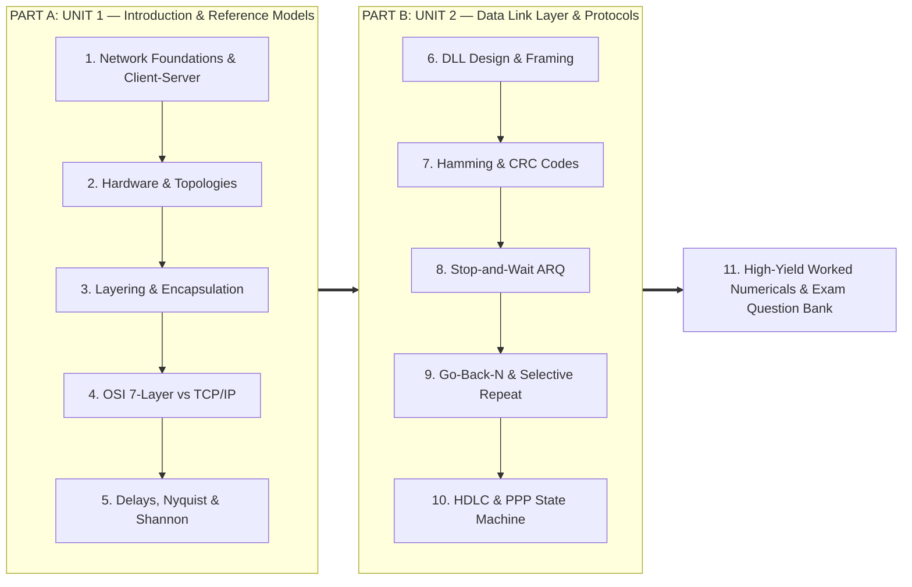
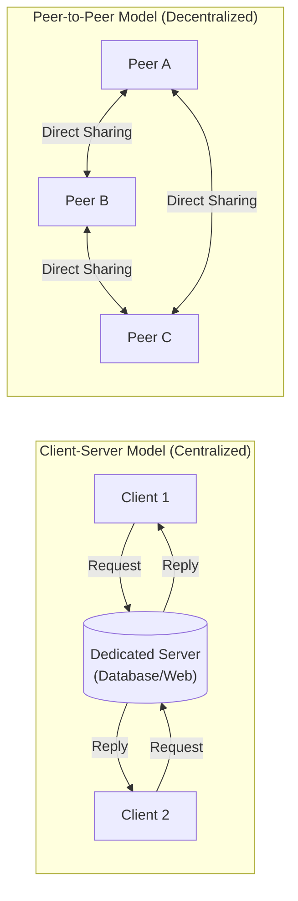
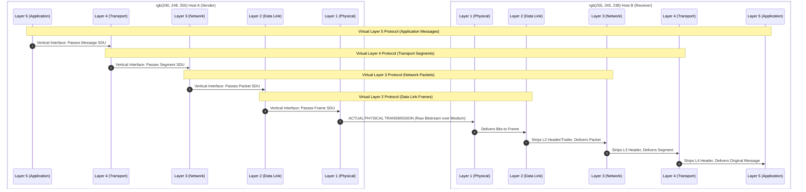
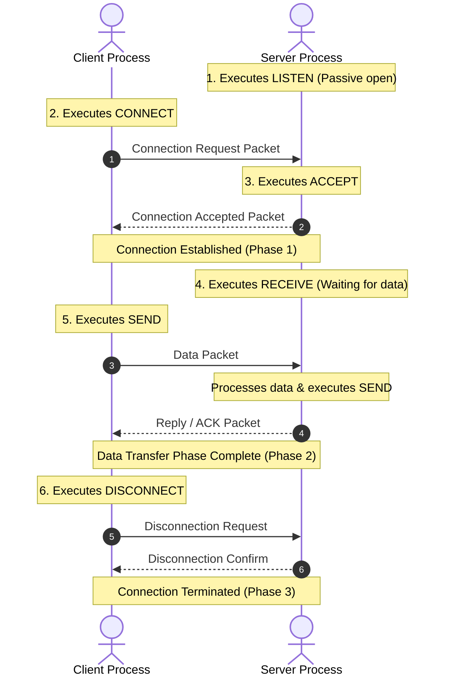
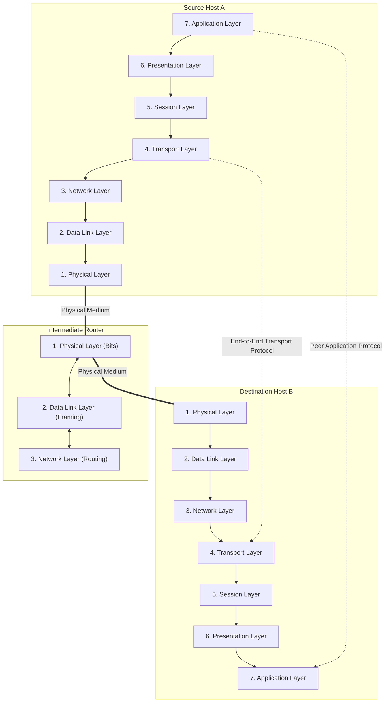
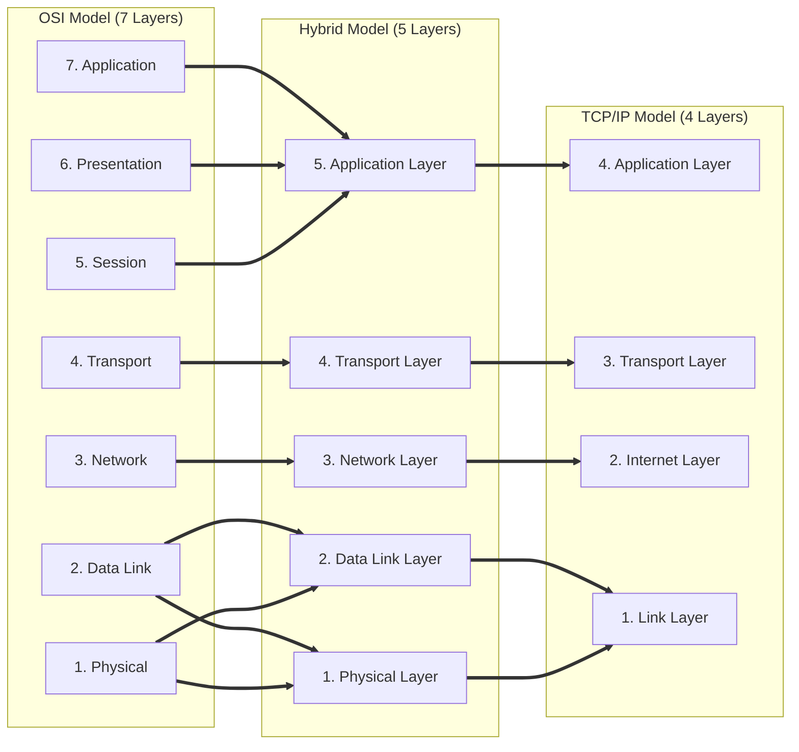
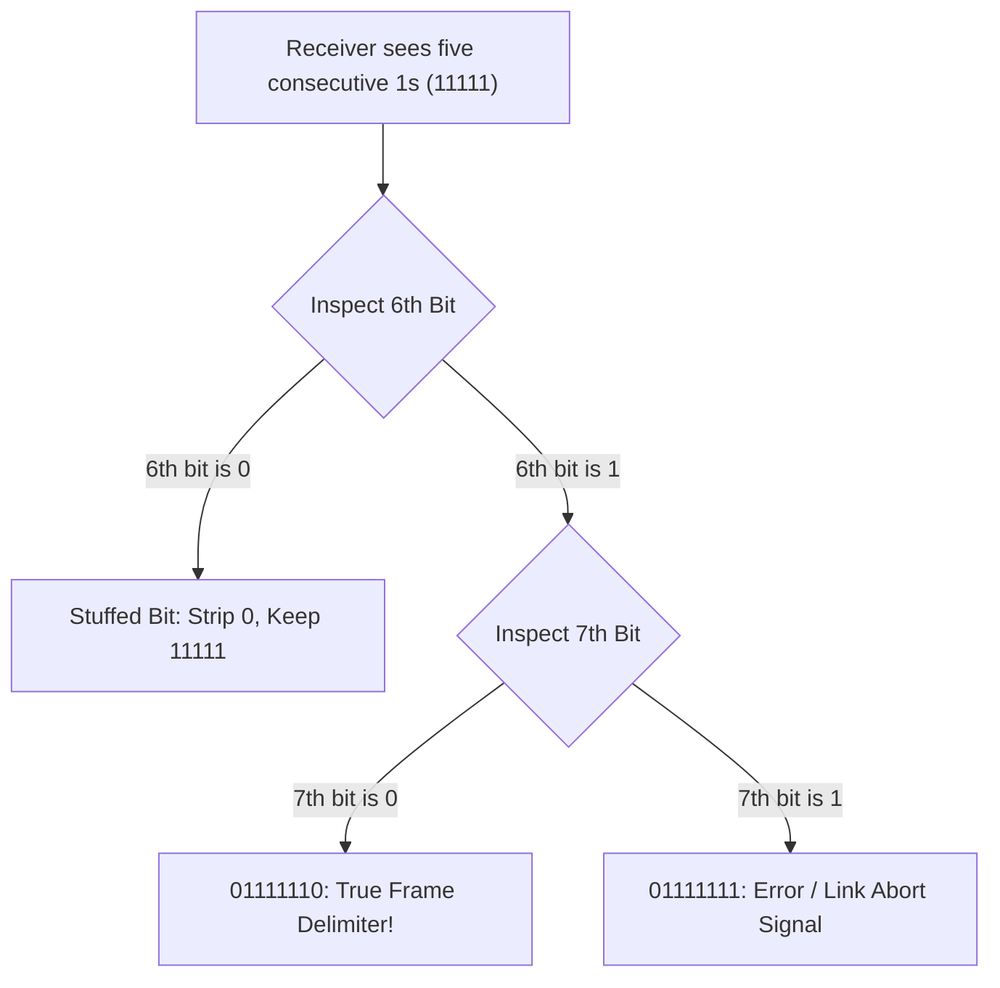
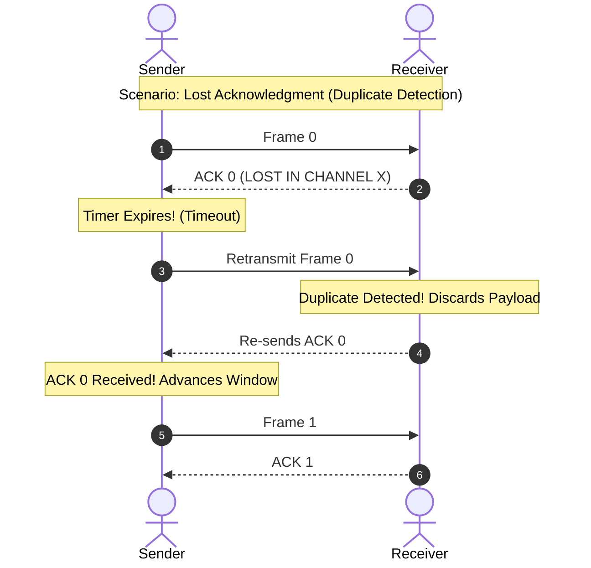
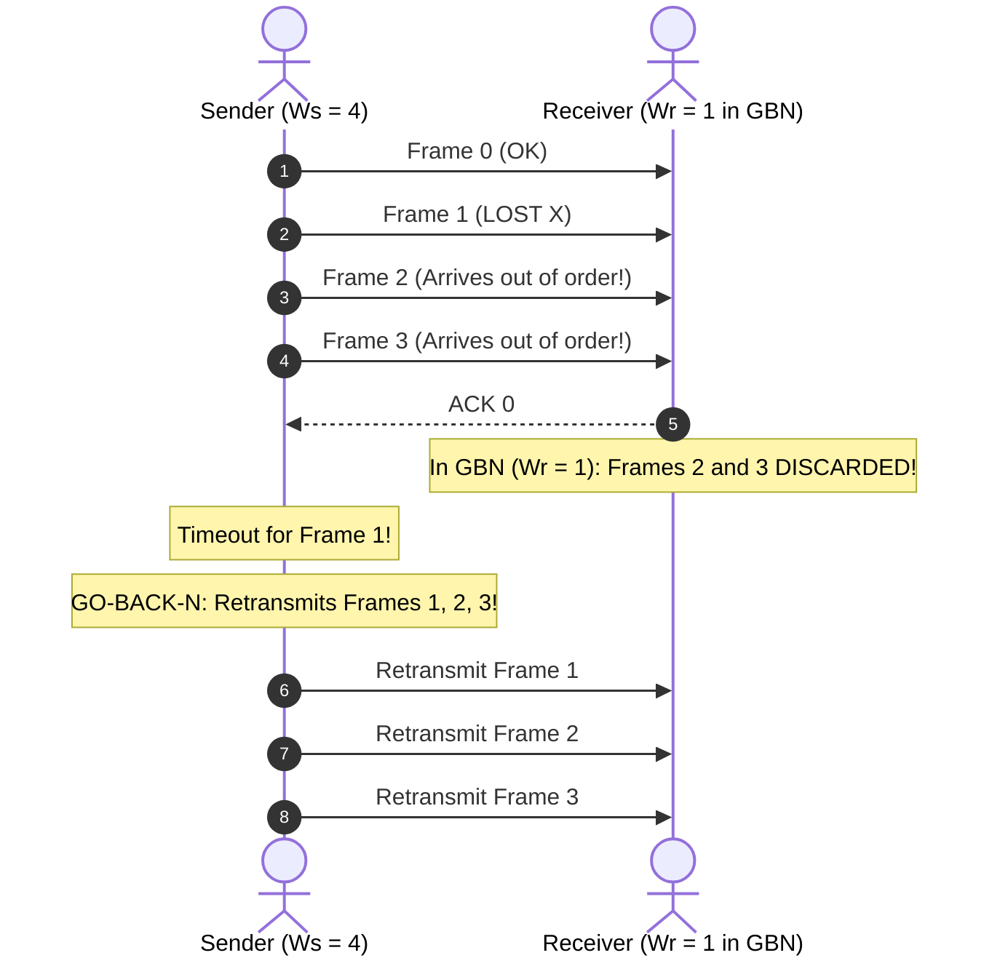
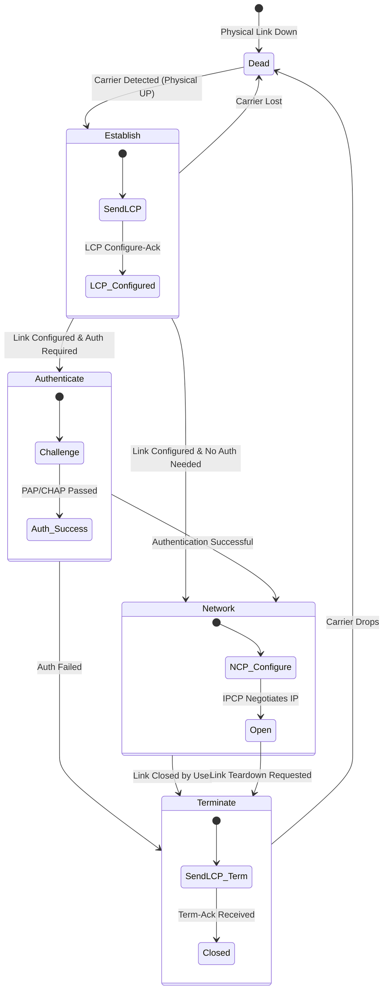

# Computer Networks: Comprehensive Class Test & Mid-Sem Revision Guide

> **Course Code:** Computer Networks (CompNet / CS501)  
> **Target Audience:** B.Tech / BE Computer Science, IT & ECE Undergraduates  
> **Syllabus Coverage:**  
> * **Unit 1:** Introduction, Network Topologies, Layered Architecture, OSI 7-Layer vs. TCP/IP 4-Layer Reference Models, Physical Transmission Delays & Channel Capacity (Nyquist & Shannon).  
> * **Unit 2:** Data Link Layer Design Issues, Framing Techniques (Byte Stuffing, Bit Stuffing), Error Control (Hamming Code, Checksum, CRC-32), Flow Control & Sliding Window Protocols (Stop-and-Wait, Go-Back-N, Selective Repeat), HDLC & PPP Protocols.  
> **Core Objective:** Exam-Ready Conceptual Clarity, Derivations, Verified Inline Diagrams, and Step-by-Step Solved Numericals.

---

## Master Table of Contents



---

# PART A: UNIT 1 — Introduction & Network Architectures

---

## 1. Foundational Concepts & Network Architectures

### 1.1 What is a Computer Network?

A **computer network** is an interconnected collection of **autonomous** computers and peripheral devices capable of exchanging data and sharing resources (hardware, software, data).

* **Autonomous:** Each computer has its own independent CPU, memory, and operating system. No single system can forcibly start, stop, or direct another without authorization. (A central mainframe with slave dumb terminals is **not** a network).
* **Interconnected:** Two devices are interconnected if they can exchange information over a transmission medium (copper, fiber, wireless radio).

---

### 1.2 Computer Networks vs. Distributed Systems (B.Tech 3-to-5 Mark Classic)

```
   COMPUTER NETWORK                           DISTRIBUTED SYSTEM
+-----------------------+                  +-----------------------+
| Explicit / Visible    |                  | Transparent / Hidden  |
| User knows machines A,|                  | User sees single      |
| B, C exist. Explicit  |                  | coherent virtual      |
| login and transfers.  |                  | system (Middleware).  |
+-----------------------+                  +-----------------------+
| Local OS per machine  |                  | Unified Middleware OS |
+-----------------------+                  +-----------------------+
```

| Criterion | Computer Network | Distributed System |
| :--- | :--- | :--- |
| **Transparency** | **Low / Absent:** The user explicitly manages multiple distinct physical machines, remote IP addresses, and explicit file transfers. | **High / Complete:** The existence of multiple physical nodes is completely hidden. The system presents a **Single-System Image (SSI)**. |
| **System Software** | Each computer runs its own autonomous local OS (Windows, Linux). | A specialized software layer (**middleware**) coordinates execution across heterogeneous nodes. |
| **Failure Handling** | Node failures cause timeout errors visible to the user. | Node crashes are handled automatically (processes migrate transparently). |
| **Examples** | The Internet, campus LAN. | Google Search cluster, Apache Hadoop/Spark, AWS DynamoDB. |

---

### 1.3 Client-Server vs. Peer-to-Peer (P2P) Architecture



* **Client-Server:** Workloads partitioned between dedicated service providers (**servers**) and service requesters (**clients**). Server is centralized, simple to secure, but is a **Single Point of Failure (SPOF)**.
* **Peer-to-Peer (P2P):** Every node acts simultaneously as client and server (**servent**). Highly scalable, resilient to single-node failures, but difficult to index and secure (e.g., BitTorrent).

---

## 2. Network Hardware, Topologies & Scale

### 2.1 Physical Network Topologies

```
1. STAR TOPOLOGY            2. BUS TOPOLOGY             3. RING TOPOLOGY
      [Host A]                   [A]   [B]   [C]              [A] ---> [B]
         |                        |     |     |                ^        |
[Host B]-[Hub/Switch]-[Host C]   === Backbone Cable ===        |        v
         |                        |     |     |               [D] <--- [C]
      [Host D]                   [D]   [E]   [F]

4. FULL MESH TOPOLOGY       5. TREE TOPOLOGY            6. HYBRID TOPOLOGY
      [A]-------[B]                 [Root Switch]             [Switch]---[Switch]
      / \       / \                 /           \              /   \      /   \
     /   \     /   \           [Dist Switch]  [Dist Switch]   [A]  [B]   [C]  [D]
   [C]-----\-/-----[D]            /     \        /     \
    \       X       /           [H1]   [H2]    [H3]   [H4]
     \     / \     /
      [E]-----[F]
```

#### Topology Mathematical Cheat Sheet for B.Tech Exams

| Topology | Number of Physical Links ($N$ nodes) | Ports per Node | Single Point of Failure? | Best / Worst Case Hops |
| :--- | :---: | :---: | :--- | :---: |
| **Star** | $N$ | $1$ | **Yes:** Central hub/switch failure halts all communication. | $2 / 2$ |
| **Bus** | $1$ backbone + $N$ drops | $1$ | **Yes:** Backbone cable break halts network due to signal reflection. | $1 / 1$ |
| **Ring** | $N$ | $2$ (In/Out) | **Yes:** Single link break breaks token loop (unless dual-ring). | $1 / (N-1)$ |
| **Full Mesh** | $\mathbf{\dfrac{N(N-1)}{2}}$ | $\mathbf{N-1}$ | **No:** 100% link redundancy; failure of one link affects only that pair. | $1 / 1$ |
| **Tree** | $N - 1$ | $1$ (for leaves) | **Yes:** Intermediate switch failure isolates subordinate subtree. | $2 / (2 \times \text{depth})$ |

---

### 2.2 Geographic Scale Classification

| Network Type | Geographical Range | Data Rates | Representative Technologies |
| :--- | :--- | :--- | :--- |
| **PAN** (Personal Area Network) | $1\text{ m to } 10\text{ m}$ (individual workspace) | $1\text{ to } 24\text{ Mbps}$ | Bluetooth (IEEE 802.15.1), ZigBee, UWB |
| **LAN** (Local Area Network) | $10\text{ m to } 1\text{ km}$ (office, building, campus) | $100\text{ Mbps to } 10\text{ Gbps}$ | Switched Ethernet (IEEE 802.3), Wi-Fi (802.11) |
| **MAN** (Metropolitan Area Network) | Up to $50\text{ km}$ (entire city) | $100\text{ Mbps to } 10\text{ Gbps}$ | Cable TV networks (DOCSIS), Metro Ethernet |
| **WAN** (Wide Area Network) | $100\text{ km to } 10,000\text{ km}$ (country, globe) | $10\text{ Gbps to } 400\text{ Gbps}$ | Undersea fiber optic cables, satellite trunks |

---

## 3. Layered Network Architecture & Protocol Software

### 3.1 The Layering Principle & Peer-to-Peer Interface Model

Networks use layered abstractions to manage complexity:
* **Peer Entities:** Software/hardware modules at the same layer on different hosts. Peer entities communicate **virtually** using the **Layer $n$ Protocol**.
* **Layer Interfaces:** Services are accessed **vertically** through **Service Access Points (SAPs)** on the same host.



---

### 3.2 Data Encapsulation and Protocol Data Units (PDUs)

As data traverses downward through the sender stack, each layer prepends a **Header** (and Layer 2 appends a **Trailer**):

```
Sender Stack                                                 Receiver Stack
============                                                 ==============
[ Application ]  M (Application Message)                     M [ Application ]
       |                                                              ^
       v                                                              |
[  Transport  ]  [ H4 | M ]                         Segment   [ H4 | M ] [  Transport  ]
       |                                                              ^
       v                                                              |
[   Network   ]  [ H3 | H4 | M ]                    Packet    [ H3 | H4 | M ] [   Network   ]
       |                                                              ^
       v                                                              |
[  Data Link  ]  [ H2 | H3 | H4 | M | T2 ]          Frame     [ H2 | H3 | H4 | M | T2 ] [  Data Link  ]
       |                                                              ^
       v                                                              |
[  Physical   ]  01101011000101110010...            Bits      0110101100... [  Physical   ]
       |                                                              |
       +=================== Physical Medium ==========================+
```

* **PDU (Protocol Data Unit):** Layer 4 = **Segment**; Layer 3 = **Packet**; Layer 2 = **Frame**; Layer 1 = **Bit**.
* **SDU (Service Data Unit):** The user data payload passed across adjacent layer interfaces ($\text{PDU}_n = \text{Header}_n + \text{SDU}_n + \text{Trailer}_n$).

---

### 3.3 Connection-Oriented vs. Connectionless Services

| Feature | Connection-Oriented Service | Connectionless Service |
| :--- | :--- | :--- |
| **Analogy** | **Telephone System** | **Postal Mail Service** |
| **Phases** | 3 Phases: Connection Setup $\to$ Data Transfer $\to$ Connection Release | 1 Phase: Independent transmission with zero prior setup |
| **Packet Addressing** | Full destination address needed **only at setup**; short VC ID / Flow Label used thereafter | **Every single packet** must carry full source and destination IP addresses |
| **Packet Ordering** | **Strictly in order:** Packets follow the established virtual circuit | **May arrive out of order:** Packets travel along independent paths |
| **Router State** | Routers maintain state information for each active connection | Routers maintain no connection state (**stateless forwarding**) |
| **Protocols** | TCP, SSH, ATM | UDP, IP, DNS queries |

---

### 3.4 The Six Connection-Oriented Service Primitives



---

## 4. Reference Models: OSI vs. TCP/IP

This is the **highest-frequency 10-Mark question** in B.Tech university examinations.

### 4.1 The ISO/OSI 7-Layer Model

* **Mnemonic (Top-to-Bottom):** **A**ll **P**eople **S**eem **T**o **N**eed **D**ata **P**rocessing  
* **Mnemonic (Bottom-to-Top):** **P**lease **D**o **N**ot **T**hrow **S**ausage **P**izza **A**way



#### Layer Responsibilities Summary Table

| Layer | Primary Responsibilities | PDU | Hardware / Device | Protocols |
| :--- | :--- | :---: | :--- | :--- |
| **7. Application** | User APIs, file transfer, web browsing, email | Message | Gateway | HTTP, HTTPS, FTP, SMTP, DNS |
| **6. Presentation** | Syntax translation, encryption/decryption, data compression | Data | Gateway | TLS/SSL, ASN.1, JPEG, MPEG |
| **5. Session** | Dialog control (turns), token management, checkpoints | Data | Gateway | NetBIOS, RPC, PPTP |
| **4. Transport** | **End-to-end reliability**, process port addressing, flow/error control | Segment | Gateway | TCP, UDP, SCTP |
| **3. Network** | **Global logical addressing (IP)**, packet routing, subnet congestion | Packet | Router, L3 Switch | IPv4, IPv6, ICMP, OSPF, BGP |
| **2. Data Link** | **Hop-to-hop framing**, physical MAC addressing, link error check | Frame | Bridge, L2 Switch, NIC | Ethernet, Wi-Fi, HDLC, PPP |
| **1. Physical** | Raw bit transmission, signal voltage levels, cable connectors | Bit | Hub, Repeater, Modem | Cat6, Fiber, RS-232, 100Base-TX |

---

### 4.2 Detailed Comparison: OSI vs. TCP/IP



| Comparison Parameter | ISO/OSI Model | TCP/IP Model |
| :--- | :--- | :--- |
| **Layer Count** | **7 Layers** | **4 Layers** |
| **Philosophy** | Theoretical model created **before** protocols were written. | Protocols created first for ARPANET; model drawn to describe them. |
| **Service/Interface Separation** | **Strict and explicit** separation between services, interfaces, and protocols. | **Weak separation**; boundaries between layers are blurred. |
| **Session & Presentation** | Separate dedicated layers. | Absent (functions handled inside Application layer). |
| **Network Layer Service** | Supports **BOTH** connection-oriented and connectionless services. | Supports **ONLY connectionless** (IP is pure datagram). |
| **Transport Layer Service** | Supports **ONLY connection-oriented** in original design. | Supports **BOTH** connection-oriented (TCP) and connectionless (UDP). |
| **Market Outcome** | **Commercial Failure** ("Four Bad Monkeys": Bad timing, Bad technology, Bad implementations, Bad politics). | **Worldwide Standard** due to early implementation in BSD Unix. |

---

## 5. Physical Foundations, Delays & Channel Capacity

### 5.1 The Four Components of Network Delay

$$\mathbf{T_{\text{total}} = T_{\text{proc}} + T_{\text{queue}} + T_{\text{trans}} + T_{\text{prop}}}$$

```
+-------------------------------- Router --------------------------------+
|                                                                        |
|  Incoming Packet ---> [ Processing ] ---> [ Queuing Buffer ] ---> [ Transmitter ] ---> Link
|                          T_proc                 T_queue                T_trans            |
+------------------------------------------------------------------------+                  |
                                                                                    Propagation
                                                                                       T_prop
                                                                                            |
                                                                                            v
                                                                                       Next Router
```

1. **Processing Delay ($T_{\text{proc}}$):** Time to inspect packet headers, check for bit errors, and consult routing tables (Microseconds, $\mu\text{s}$).
2. **Queuing Delay ($T_{\text{queue}}$):** Time a packet waits in router memory buffers until scheduled on outgoing link (Dynamic, depends on congestion).
3. **Transmission Delay ($T_{\text{trans}}$ / Serialization Time):** Time required to push all $L$ bits onto the link at bandwidth $R$:
   $$\mathbf{T_{\text{trans}} = \frac{L}{R}}$$
4. **Propagation Delay ($T_{\text{prop}}$):** Time required for a single bit to physically travel distance $D$ at medium velocity $v$:
   $$\mathbf{T_{\text{prop}} = \frac{D}{v}}$$
   *(Speed: $v \approx 2 \times 10^8\text{ m/s}$ in copper/fiber; $v \approx 3 \times 10^8\text{ m/s}$ in free space).*

---

### 5.2 Bandwidth-Delay Product (BDP)

$$\mathbf{\text{BDP} = R \times \text{RTT} = R \times (2 \times T_{\text{prop}})}$$

* **Physical Meaning:** The maximum volume of bits that can be "in flight" inside the physical wire simultaneously. In sliding window protocols, the sender window must equal the BDP to achieve 100% link utilization.

---

### 5.3 Fundamental Channel Capacity Theorems

#### 1. Nyquist Bit Rate Theorem (Noiseless Channels)
$$C_{\text{Nyquist}} = 2 B \log_2(V) \quad \text{[bps]}$$
* $B$ = Channel bandwidth (Hz); $V$ = Number of discrete signaling voltage levels.

#### 2. Shannon's Channel Capacity Theorem (Noisy Thermal Gaussian Channels)
$$C_{\text{Shannon}} = B \log_2\left(1 + \frac{S}{N}\right) \quad \text{[bps]}$$
* **CRITICAL EXAM RULE:** $\frac{S}{N}$ is a **linear power ratio**, NOT in decibels!
* **Decibel Conversion:**
  $$\text{SNR}_{\text{dB}} = 10 \log_{10}\left(\frac{S}{N}\right) \iff \mathbf{\frac{S}{N} = 10^{\frac{\text{SNR}_{\text{dB}}}{10}}}$$
  *(e.g., $30\text{ dB} \implies \frac{S}{N} = 10^3 = 1000$)*.

---

# PART B: UNIT 2 — Data Link Layer & Protocols

---

## 6. Data Link Layer Design & Framing

The Data Link Layer transforms raw bits into structured **frames** and solves **framing**, **error control**, and **flow control**.

### 6.1 Framing Techniques

#### 1. Byte Count Framing
Header contains integer count of total bytes.
* **Flaw:** Corrupted count causes permanent loss of framing synchronization. Never used alone.

#### 2. Flag Bytes with Byte Stuffing (Character Stuffing)
Frames delimited by reserved `FLAG` bytes (`0x7E`). The sender injects an Escape byte (`ESC = 0x1B`) immediately before any accidental `FLAG` or `ESC` occurring inside user data.
* **Example:**
  * Original Data: `A  B  ESC  FLAG  C`
  * Stuffed Output: `FLAG  A  B  ESC ESC  ESC FLAG  C  FLAG`
  * Receiver Action: Discards frame flags; strips the first `ESC` of every pair.

#### 3. Flag Bits with Bit Stuffing (Bit-Oriented / HDLC)
Frames delimited by flag pattern **`01111110`** (six consecutive `1`s).
* **Sender Rule:** Whenever the sender encounters **five consecutive `1`s** in the data bitstream, it **automatically stuffs a `0` bit**.
* **Receiver Rule:** Whenever the receiver sees five consecutive `1`s:
  * If next bit is `0` $\to$ **Stuffed bit: strip it**.
  * If next bits are `10` $\to$ **True frame delimiter FLAG (`01111110`)**.
  * If next bits are `11` $\to$ **Link error / abort signal**.
* **Example:**
  * Input: `0 1 1 1 1 1 1 0 1 1 1 1 1 0`
  * Stuffed: `0 1 1 1 1 1`**`0`**`1 0 1 1 1 1 1`**`0`**`0`



---

## 7. Error Detection & Error Correction

### 7.1 Hamming Codes & Error Correction Theory

* **Hamming Distance ($d$):** Number of bit positions in which two binary codewords differ (computed via XOR and counting `1`s).
* **Error Detection Condition:** $d_{\min} \ge e + 1$ (detects $e$ single-bit errors).
* **Error Correction Condition:** $d_{\min} \ge 2t + 1$ (corrects $t$ single-bit errors).
* **Hamming Equation for Check Bits:** $(m + r + 1) \le 2^r$, where $m = \text{data bits}$, $r = \text{parity bits}$.

#### Construction of (7, 4) Hamming Code ($M = 1011$, $m=4, r=3$)
* Parity bits $p_1, p_2, p_4$ placed at positions $1, 2, 4$ (powers of 2).
* Even Parity equations:
  * $p_1 \oplus d_3 \oplus d_5 \oplus d_7 = 0 \implies p_1 \oplus 1 \oplus 0 \oplus 1 = 0 \implies \mathbf{p_1 = 0}$
  * $p_2 \oplus d_3 \oplus d_6 \oplus d_7 = 0 \implies p_2 \oplus 1 \oplus 1 \oplus 1 = 0 \implies \mathbf{p_2 = 1}$
  * $p_4 \oplus d_5 \oplus d_6 \oplus d_7 = 0 \implies p_4 \oplus 0 \oplus 1 \oplus 1 = 0 \implies \mathbf{p_4 = 0}$
* **Transmitted Codeword:** $T = [p_1, p_2, d_3, p_4, d_5, d_6, d_7] = \mathbf{0110011}$.
* **Syndrome Calculation at Receiver:** If bit 5 flips to `1` ($R = 0110\mathbf{1}11$), syndrome bits $(s_4 s_2 s_1) = 101_2 = \mathbf{5}$ (identifies bit 5 as corrupted; flip to correct!).

---

### 7.2 Cyclic Redundancy Check (CRC / Polynomial Codes)

* Uses **Modulo-2 long division** (bitwise XOR; no carries, no borrows).
* Data $M(x)$ of length $m$; Generator $G(x)$ of degree $r$ (length $r + 1$).
* **Algorithm:**
  1. Append $r$ zeros to data: $x^r M(x)$.
  2. Divide $x^r M(x)$ by $G(x)$ using XOR division to find $r$-bit remainder $R(x)$.
  3. Transmitted Codeword: $T(x) = x^r M(x) \oplus R(x)$.
  4. Receiver divides received codeword by $G(x)$. If remainder $= 0 \implies$ Accept; Else $\implies$ Reject!

---

## 8. Flow Control & Elementary Protocols

* **Utopian Protocol:** Unrealistic simplex protocol assuming infinite buffer and zero error.
* **Stop-and-Wait Protocol (Error-Free):** Sender transmits 1 frame, pauses and waits for receiver ACK before transmitting next frame.
* **Stop-and-Wait ARQ (Noisy Channel):**
  * **Retransmission Timer:** Prevents deadlock if frame/ACK is lost.
  * **1-Bit Sequence Number ($0$ and $1$):** Essential so receiver can detect and discard duplicate frames caused by lost/delayed ACKs!



---

## 9. Sliding Window Protocols: GBN vs. Selective Repeat

### 9.1 The Link Efficiency Crisis & Pipelining

$$\mathbf{\eta_{\text{Stop-and-Wait}} = \frac{T_{\text{trans}}}{T_{\text{trans}} + 2 T_{\text{prop}}} = \frac{1}{1 + 2a}, \quad \text{where } a = \frac{T_{\text{prop}}}{T_{\text{trans}}}}$$

* When $a \gg 1$ (e.g. satellite or long-distance high-speed links), Stop-and-Wait utilization collapses below $1\%$.
* **Pipelined Sliding Window:** Transmit up to $W$ frames continuously:
  $$\mathbf{\eta_{\text{Pipelined}} = \min\left(1, \frac{W}{1 + 2a}\right)}$$
  $$\mathbf{W_{\text{optimal}} \ge 1 + 2a \quad \text{for 100\% utilization}}$$

---

### 9.2 Go-Back-N (GBN) vs. Selective Repeat (SR)



#### Window Size Limit Constraints (Core University Proof)
* **Go-Back-N Window Size:**
  $$\mathbf{W_s \le 2^n - 1, \quad W_r = 1}$$
  *(If $W_s = 2^n$, when all ACKs are lost, the sender retransmits old Frame 0, but the receiver is expecting Frame 0 of the next cycle, causing undetected duplicate acceptance!)*
* **Selective Repeat Window Size:**
  $$\mathbf{W_s = W_r \le 2^{n-1} = \frac{2^n}{2}}$$
  *(Receiver buffers out-of-order frames; window size cannot exceed half the sequence number space to prevent overlap between new and old sequence number ranges).*

| Parameter | Stop-and-Wait ARQ | Go-Back-N (GBN) ARQ | Selective Repeat (SR) ARQ |
| :--- | :--- | :--- | :--- |
| **Sender Window ($W_s$)** | $1$ | $\le 2^n - 1$ | $\le 2^{n-1}$ |
| **Receiver Window ($W_r$)** | $1$ | $1$ | $W_s \le 2^{n-1}$ |
| **Out-of-Order Buffering** | None | None (discards out-of-order) | Yes (buffers out-of-order within $W_r$) |
| **Acknowledgment Mode** | Independent ACK | Cumulative ACK | Individual ACK / NAK (SREJ) |
| **Retransmissions** | Single frame | Retransmits all $N$ frames | Retransmits **only the lost frame** |

---

## 10. Real-World Data Link Protocols: HDLC & PPP

### 10.1 HDLC (High-level Data Link Control)
* Bit-oriented, flag delimiter `01111110`.
* **Three Frame Types:**
  1. **I-Frames (Information):** Carries user payload + sequence numbers $N(S)$ and piggybacked ACK $N(R)$.
  2. **S-Frames (Supervisory):** Flow and error control: `RR` (Receive Ready), `RNR` (Receive Not Ready), `REJ` (Go-Back-N NAK), `SREJ` (Selective Repeat NAK).
  3. **U-Frames (Unnumbered):** Session setup (`SABM`), disconnect (`DISC`), acknowledge (`UA`).

---

### 10.2 PPP (Point-to-Point Protocol — RFC 1661)

* Byte-oriented; used over dialup, leased lines, and broadband DSL (PPPoE).
* Components: Framing (`0x7E`), **LCP** (Link Control Protocol for link negotiation), **PAP / CHAP** (Authentication), and **NCP / IPCP** (Network Configuration Protocol for dynamic IP assignment).



---

## 11. High-Yield Worked Numericals & Exam Question Bank

### Numerical 1: Modulo-2 CRC Long Division
**Problem:** Data $M = \mathbf{1101011011}$, Generator $G(x) = x^4 + x + 1 \implies \mathbf{10011}$ (degree $r = 4$). Find transmitted codeword.

**Solution:**  
Append $r = 4$ zeros: Dividend $= 1101011011\mathbf{0000}$.  
Perform Modulo-2 division:
```
             1100001010 (Quotient)
        ----------------
 10011 | 11010110110000
         10011
         -----
          10011
          10011
          -----
           00001
           00000
           ...
           Remainder = 1110
```
* **Transmitted Codeword:** $T = \text{Data} \mid \text{Remainder} = \mathbf{11010110111110}$.

---

### Numerical 2: Sliding Window Efficiency & Window Sizing
**Problem:** A $100\text{ Mbps}$ satellite link has one-way propagation delay $T_{\text{prop}} = 250\text{ ms}$. Frame size is $L = 2000\text{ bytes}$.  
(a) Find Stop-and-Wait efficiency.  
(b) Find optimal window size $W$ for 100% utilization.  
(c) How many sequence number bits are needed for GBN and Selective Repeat?

**Solution:**  
* $L = 2000 \times 8 = 16,000\text{ bits}$.  
* $T_{\text{trans}} = \frac{16,000}{100 \times 10^6} = 1.6 \times 10^{-4}\text{ s} = 0.16\text{ ms}$.  
* $a = \frac{T_{\text{prop}}}{T_{\text{trans}}} = \frac{250\text{ ms}}{0.16\text{ ms}} = 1562.5$.  
* **(a) Stop-and-Wait Efficiency:**  
  $$\eta = \frac{1}{1 + 2a} = \frac{1}{1 + 2(1562.5)} = \frac{1}{3126} \approx \mathbf{0.032\%}$$  
* **(b) Optimal Window Size:**  
  $$W \ge 1 + 2a = 1 + 3125 = \mathbf{3126\text{ frames}}$$  
* **(c) Sequence Number Bits:**  
  * For GBN: $W_s \le 2^n - 1 \implies 2^n \ge 3127 \implies \mathbf{n = 12\text{ bits}}$ ($2^{12} = 4096$).  
  * For SR: $W_s \le 2^{n-1} \implies 2^{n-1} \ge 3126 \implies n - 1 = 12 \implies \mathbf{n = 13\text{ bits}}$.

---

### High-Yield 2-Mark Quick Answers

1. **Why is a 1-bit sequence number needed in Stop-and-Wait ARQ?**  
   *Answer:* To allow the receiver to identify duplicate frames caused by lost or delayed ACKs.
2. **State the maximum window sizes for Go-Back-N and Selective Repeat.**  
   *Answer:* GBN: $W_s \le 2^n - 1, W_r = 1$. Selective Repeat: $W_s = W_r \le 2^{n-1}$.
3. **What is the Hamming distance condition to detect $e$ errors and correct $t$ errors?**  
   *Answer:* Detection: $d_{\min} \ge e + 1$. Correction: $d_{\min} \ge 2t + 1$.
4. **State the Nyquist and Shannon channel capacity formulas.**  
   *Answer:* Nyquist: $C = 2 B \log_2(V)$. Shannon: $C = B \log_2(1 + S/N)$.
5. **What is piggybacking?**  
   *Answer:* Attaching an acknowledgment sequence number into the header of an outgoing data frame to eliminate separate ACK transmission overhead.
6. **Why does FDM fail for bursty computer data?**  
   *Answer:* Static partitioning causes queuing delay to increase $N$-fold ($T_{\text{FDM}} = N \cdot T_{\text{single}}$), while inactive channels sit completely idle and wasted.
