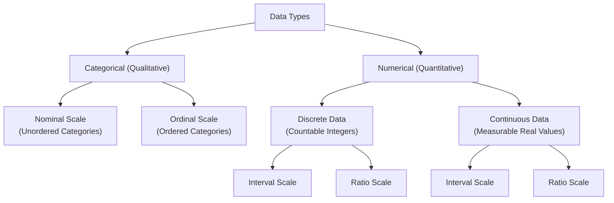

# Chapter 2: Types of Data & Measuring Data Spread

> **Course Code:** Data Analysis & Visualization (DAV)
> **Primary Focus:** Data Types, Scales of Measurement, Ungrouped vs Grouped Representation, Frequency Distributions, and Summary Statistics

---

## 1. Chapter Overview

Data comes in many forms, each requiring specific statistical treatments and visualization methods. Understanding data types and measurement scales is essential for selecting appropriate analytical algorithms and visualization charts.

This chapter covers:
1. **Categorical vs Numerical Data:** Qualitative attributes versus quantitative metrics.
2. **Discrete vs Continuous Data:** Distinct countable values versus measurable real intervals.
3. **Scales of Measurement:** Nominal, Ordinal, Interval, and Ratio scales.
4. **Data Representation Formats:** Raw ungrouped observations versus grouped frequency distributions.
5. **Measures of Central Tendency & Dispersion:** Mean, Median, Mode, Variance, and Standard Deviation.

---

## 2. Categorical vs. Numerical Data

### 2.1 Categorical (Qualitative) Data
Categorical data represents labels, categories, or non-numeric characteristics that describe an attribute of an observation.
- **Key Characteristics:** Arithmetic operations (such as addition or averaging) are meaningless on categorical values.
- **Subtypes:** Nominal and Ordinal.
- **Examples:** Eye color (Blue, Brown, Green), Gender (Male, Female), Customer Feedback (Satisfied, Neutral, Dissatisfied).

### 2.2 Numerical (Quantitative) Data
Numerical data represents measurable or countable quantities expressed as numbers.
- **Key Characteristics:** Standard mathematical and statistical operations (addition, subtraction, mean, standard deviation) are valid and meaningful.
- **Subtypes:** Discrete and Continuous.
- **Examples:** Height (in cm), Temperature (in °C), Account Balance (in USD), Number of Website Visits.

---

## 3. Discrete vs. Continuous Data

### 3.1 Discrete Data
Numerical data whose values are distinct, separate, and countable.
- **Values:** Usually integers with finite or countably infinite values. No intermediate values exist between two adjacent points.
- **Examples:** Number of children in a household, number of defect items in a batch, roll of a die.

### 3.2 Continuous Data
Numerical data that can take any real value within a given continuous interval or range.
- **Values:** Uncountably infinite possible values within an interval, dependent on measurement precision.
- **Examples:** Temperature ($36.6^\circ\text{C}$), Weight ($70.45\text{ kg}$), Time to complete a task ($12.34\text{ seconds}$).

---

## 4. The 4 Scales of Measurement

Data attributes are classified into four hierarchical levels of measurement:

| Measurement Scale | Ordering | Equal Intervals | True Absolute Zero | Allowed Mathematical Operations | Examples |
| :--- | :---: | :---: | :---: | :--- | :--- |
| **Nominal** | No | No | No | Equality ($=$ / $\neq$), Mode, Frequency Count | Marital Status, Zip Codes, Eye Color |
| **Ordinal** | Yes | No | No | Order ($<$ / $>$), Median, Percentiles | Star Ratings (1–5), Letter Grades (A, B, C) |
| **Interval** | Yes | Yes | No | Addition, Subtraction, Mean, Variance | Temperature (°C, °F), Calendar Years |
| **Ratio** | Yes | Yes | Yes | Multiplication, Division, Ratios, Geometric Mean | Weight, Height, Income, Age |

---

## 5. Summary Table: Data Type Taxonomy

---

## 6. Data Representation Formats: Ungrouped vs Grouped

### 6.1 Raw Ungrouped Data
- **Meaning:** A simple list of individual numerical observations recorded directly.
- **Formal Definition:** A set of observations $X = \{x_1, x_2, \dots, x_N\}$ where each $x_i$ is an individual raw data point.
- **Example:** Ages of 10 students:
  $$
  X = \{14, 17, 18, 18, 22, 25, 26, 28, 30, 32\}
  $$
- **Advantage:** Retains $100\%$ precision of original data.
- **Disadvantage:** Difficult to interpret when dataset size $N$ is large.

### 6.2 Grouped Class Table (Frequency Distribution)
- **Meaning:** Data organized into non-overlapping continuous class intervals, with counts (frequencies) for observations falling into each interval.
- **Components:**
  - **Class Interval $[a, b)$:** Range defined by lower limit $a$ and upper limit $b$.
  - **Class Width ($w$):**
    $$
    w = b - a
    $$
  - **Midpoint ($x_i$):**
    $$
    x_i = \frac{a + b}{2}
    $$
  - **Relative Frequency:**
    $$
    \text{Relative Frequency} = \frac{f_i}{N}
    $$

---

## 7. Measures of Central Tendency & Dispersion

### 7.1 Measures of Central Tendency

#### 1. Sample Mean ($\bar{x}$)
The arithmetic average of all observations:
$$
\bar{x} = \frac{1}{N} \sum_{i=1}^{N} x_i
$$

#### 2. Median
The middle value when data is sorted in ascending order:
$$
\text{Median} = \begin{cases} x_{\left(\frac{N+1}{2}\right)} & \text{if } N \text{ is odd} \\[6pt] \frac{x_{\left(\frac{N}{2}\right)} + x_{\left(\frac{N}{2}+1\right)}}{2} & \text{if } N \text{ is even} \end{cases}
$$

#### 3. Mode
The most frequently occurring value in the dataset.

---

### 7.2 Measures of Dispersion

#### 1. Sample Variance ($s^2$)
Measures the average squared deviation from the mean:
$$
s^2 = \frac{1}{N - 1} \sum_{i=1}^{N} (x_i - \bar{x})^2
$$

#### 2. Sample Standard Deviation ($s$)
The square root of variance, expressed in original data units:
$$
s = \sqrt{s^2} = \sqrt{\frac{1}{N - 1} \sum_{i=1}^{N} (x_i - \bar{x})^2}
$$

---

## 8. Formula Sheet

- **Sample Mean:**
  $$
  \bar{x} = \frac{\sum x_i}{N}
  $$
- **Sample Variance:**
  $$
  s^2 = \frac{\sum (x_i - \bar{x})^2}{N - 1}
  $$
- **Class Midpoint:**
  $$
  x_i = \frac{a + b}{2}
  $$
- **Relative Frequency:**
  $$
  \text{RF}_i = \frac{f_i}{N}
  $$

---

## 9. Definition Sheet

1. **Nominal Scale:** A measurement level for unordered categorical variables where numbers act only as labels.
2. **Ordinal Scale:** A measurement level where categories have a natural rank or order, but differences between ranks are not uniform.
3. **Interval Scale:** A measurement level with meaningful, equal distances between values, but no absolute true zero point.
4. **Ratio Scale:** The highest measurement level, featuring ordered categories, equal intervals, and a true absolute zero point.
5. **Frequency Distribution:** A tabular summary showing the count of data points in each non-overlapping class interval.

---

## 10. Exam-Oriented Review

1. Compare the four measurement scales (Nominal, Ordinal, Interval, Ratio) across ordering, equal intervals, absolute zero, and allowed mathematical operations.
2. Given a raw dataset, calculate the sample mean, median, variance, and standard deviation.
3. Explain why temperature in Celsius is an Interval scale variable while temperature in Kelvin is a Ratio scale variable.
4. Convert a raw dataset of $N = 30$ observations into a grouped frequency distribution table with class width $w = 10$.
