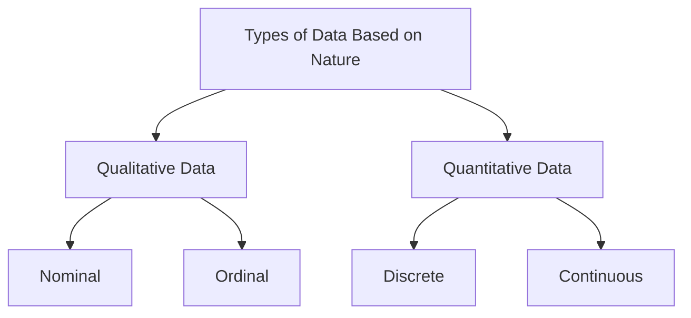
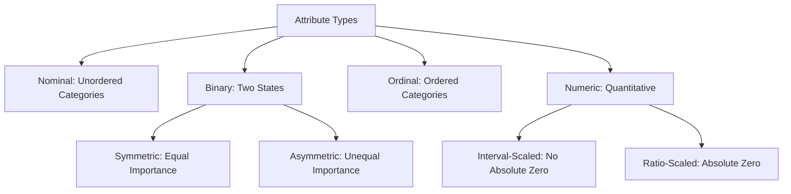
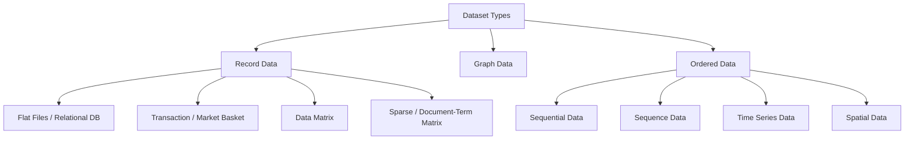

<Complete DAV Notes: Chapter 3 — Dataset and Attributes>
> **Course:** Data Analysis and Visualization
> **Primary Source:** 3.Dataset and Attributes.pdf
> **Files Integrated:** `3.Dataset and Attributes.pdf`, `ch3_text.txt`

# Chapter 3 — Dataset and Attributes

## 1. Chapter Overview
This chapter covers datasets, attribute types, and structural properties in data mining. Key topics include attribute taxonomy (nominal, binary, ordinal, numeric), dataset structures (record, graph, ordered, time series), matrix representations (Data Matrix, Document-Term Matrix), characteristics (dimensionality, sparsity, resolution), and data representation formats.
[Source: 3.Dataset and Attributes.pdf, Slide 1]

---

## 2. Fundamental Concepts

### Definition: Attribute
**Meaning:** An attribute is a data field representing a characteristic or feature of a data object.
**Synonyms:** Feature (Machine learning), Variable (Statistics), Column (Databases), Dimension (Data warehousing).
**Example:** Customer attributes: Customer ID, Name, Address.
[Source: 3.Dataset and Attributes.pdf, Slide 2]

### Definition: Attribute Vector and Distribution
**Meaning:** An attribute vector is a set of attributes describing an object.
**Distribution types based on attribute count:**
- **Univariate:** Involves one attribute.
- **Bivariate:** Involves two attributes.
- **Multivariate:** Involves multiple attributes.
[Source: 3.Dataset and Attributes.pdf, Slide 3]

---

## 3. Qualitative vs Quantitative Data

### Qualitative (Categorical) Data
Information representing characteristics that you do not measure with numbers. Observations fall within a countable number of groups. It captures subjective information or things not easily measured. 
**Examples:** Taste, the color of a car, architectural style, marital status.
[Source: 3.Dataset and Attributes.pdf, Slide 31, 34]

### Quantitative (Numerical) Data
Information recorded as numbers representing an objective measurement or a count. 
**Examples:** Age, height, temperature, weight, count of transactions.
[Source: 3.Dataset and Attributes.pdf, Slide 31, 37]

---

## 4. Attribute Taxonomy

### 1. Nominal Attributes
**Meaning:** Categorical values with no meaningful order (also called enumerations). They can be coded with numbers, but arithmetic operations are meaningless.
**Example:** 
- Hair Color: black, brown, blond, red
- Marital Status: single, married, divorced
- Occupation: teacher, farmer, etc.
[Source: 3.Dataset and Attributes.pdf, Slide 5, 35]

### 2. Binary Attributes
**Meaning:** A special nominal type with only two states, typically represented as 0 (absent/false) and 1 (present/true).
**Example:** 
- Smoker: 0 = No, 1 = Yes
- Medical Test: 0 = Negative, 1 = Positive
**Types:**
- **Symmetric:** Both states equally important (e.g., gender).
- **Asymmetric:** One state more important than the other (e.g., HIV test result).
[Source: 3.Dataset and Attributes.pdf, Slide 6]

### 3. Ordinal Attributes
**Meaning:** Ordered categories where the interval or distance between them is unknown. They are treated as categorical, but the numbers have mathematical meaning purely in their ordering.
**Example:** 
- Size: Small $<$ Medium $<$ Large
- Grades: A+ $>$ A $>$ B+
- Satisfaction Level: 0 = Very Dissatisfied, 1 = Dissatisfied, 2 = Neutral, 3 = Satisfied, 4 = Very Satisfied.
- Restaurant Rating: Scale from 0 to 4 stars.
[Source: 3.Dataset and Attributes.pdf, Slide 7, 36]

### 4. Numeric Attributes
**Meaning:** Quantitative measurable values represented in integer or real values.
**Types:**
- **Interval-Scaled:** Equal intervals, but no true zero-point. Arithmetic difference is meaningful, but ratios are not. 
  - *Example:* Temperature in °C or °F, Calendar dates. 20°C is 5° more than 15°C, but 20°C is NOT twice as hot as 10°C.
- **Ratio-Scaled:** Has a true zero-point. Can compute ratios, differences, mean, median, mode.
  - *Example:* Years of Experience, Weight, Height, Income. ₹100 is exactly 10 times ₹10.
[Source: 3.Dataset and Attributes.pdf, Slides 8-10]

### Discrete vs Continuous Attributes
- **Discrete:** Finite or countably infinite values. Cannot be meaningfully divided into smaller increments.
  - *Example:* Hair Color, Zip Code, Age (0-110), Smoker (0/1). A household can have 1 or 2 cars, but not 1.6 cars.
- **Continuous:** Infinite real values, can take on almost any numeric value including fractional/decimal values. Usually stored as floating-point.
  - *Example:* Height, Weight, Temperature. The mean height in India is 5 feet 9 inches for men and 5 feet 4 inches for women.
[Source: 3.Dataset and Attributes.pdf, Slides 11, 38-39]

---

## 5. Dataset Types & Matrix Formats

[Source: 3.Dataset and Attributes.pdf, Slide 12]

### 1. Record Data
Data stored either in flat files or relational databases. 
**Applications:** Student records, Employee details.
[Source: 3.Dataset and Attributes.pdf, Slides 13-14]

#### Transaction or Market Basket Data
A special type of record data where each record contains a set of items (e.g., shopping in a supermarket). Transaction data is a collection of sets of items, viewed as a set of records with asymmetric binary attributes indicating whether an item was purchased.

**Table: Market Basket Data Representation**
| TID | ITEMS |
|---|---|
| 1 | Apple, Banana, Milk, Rice |
| 2 | Guava, Curd, Rice |
| 3 | Apple, Guava, Curd, Rice |
| 4 | Banana, Milk |
| 5 | Apple, Rice |

**Table: Asymmetric Binary Attribute View**
| TID | Apple | Banana | Curd | Guava | Milk | Rice |
|---|---|---|---|---|---|---|
| 1 | True | True | False | False | True | True |
| 2 | False | False | True | True | False | True |
| 3 | True | False | True | True | False | True |
| 4 | False | True | False | False | True | False |
| 5 | True | False | False | False | False | True |

[Source: 3.Dataset and Attributes.pdf, Slides 15-16]

#### The Data Matrix
If every data object has the same set of numerical features, we organize this into an $m \times n$ matrix where each row is an object and each column is a feature. This allows mathematical operations for statistics and machine learning.

$$
\mathbf{X} = \begin{bmatrix}
x_{11} & x_{12} & \dots & x_{1n} \\
x_{21} & x_{22} & \dots & x_{2n} \\
\vdots & \vdots & \ddots & \vdots \\
x_{m1} & x_{m2} & \dots & x_{mn}
\end{bmatrix}_{m \times n}
$$

[Source: 3.Dataset and Attributes.pdf, Slide 17]

#### The Sparse Data Matrix (Document-Term Matrix)
A special case of a data matrix where attributes are of the same type and are asymmetric (only non-zero values are important). 

**Example: Document Term Matrix**
**Documents:**
- D1: Text mining is to find useful information from text.
- D2: Useful information is mined from the text.
- D3: Dark came.

| Document | Term: text | Term: mining | Term: useful | Term: information |
| :--- | :---: | :---: | :---: | :---: |
| **D1** | 2 | 1 | 1 | 1 |
| **D2** | 1 | 0 | 1 | 1 |
| **D3** | 0 | 0 | 0 | 0 |
[Source: 3.Dataset and Attributes.pdf, Slides 19-20]

### 2. Graph-Based Data
Represents information using:
- **Nodes (Vertices):** Entities (people, objects, places, atoms).
- **Edges (Links):** Relationships or connections.
**Examples:**
- Linked web pages (hyperlink graphs).
- Benzene Molecule: Nodes = atoms (carbon, hydrogen), Edges = chemical bonds.
[Source: 3.Dataset and Attributes.pdf, Slides 21-24]

### 3. Ordered Data
Data where the order of attributes matters in time or space.
- **Sequential Data:** Record data with timestamps. Order is based on time. 
  - *Example:* (t1, C1, buys A, B). Used in clickstream analysis, patient records.
- **Sequence Data:** Ordered based on position, no timestamps. 
  - *Example:* DNA sequence (A-T-C-G-G-C-A). Used in genomics, NLP.
- **Time Series Data:** Measured at regular time intervals. 
  - *Example:* Stock price (Day 1: ₹150, Day 2: ₹152, Day 3: ₹147). Used in finance, weather.
- **Spatial Data:** Location-based attributes tied to geographical coordinates. 
  - *Example:* (Lat: 23.5, Long: 72.6) $\rightarrow$ 30°C. Used in GIS, urban planning.
[Source: 3.Dataset and Attributes.pdf, Slides 26-30]

---

## 6. Dataset Characteristics

### 1. Dimensionality
**Meaning:** The number of attributes (features/variables) in a dataset.
**Curse of Dimensionality:** When a dataset has a high number of attributes, data becomes sparse and less meaningful, making it difficult to analyze. Distance measures break down as dimensions increase.
[Source: 3.Dataset and Attributes.pdf, Slide 41]

### 2. Sparsity
**Meaning:** The presence of many zero (or empty/NULL) values in a dataset. 
**Details:** For asymmetric features, most attributes of an object might be 0. Often, fewer than 1% of the entries are non-zero.
[Source: 3.Dataset and Attributes.pdf, Slide 42]

### 3. Resolution
**Meaning:** The granularity or level of detail of the data values.
**Details:** Patterns depend on resolution. If too fine, patterns may be buried in noise; if too coarse, patterns disappear (e.g., atmospheric pressure on a scale of hours reveals storms, but on a scale of months reveals nothing).
**Types:**
- **Spatial Resolution:** Smallest unit captured (e.g., pixels).
- **Temporal Resolution:** Frequency of recording (e.g., per second vs per day).
- **Measurement Resolution:** Precision of numeric values (e.g., age in years vs months).
[Source: 3.Dataset and Attributes.pdf, Slide 43]

**Example: Student Spreadsheet Combining All Three**
- **Dimensionality:** Number of fields per student (ID, name, age, score) $\rightarrow$ number of columns.
- **Sparsity:** Number of empty cells (e.g., missing assignments).
- **Resolution:** Are marks given as whole numbers (78) or with decimals (78.56)?
[Source: 3.Dataset and Attributes.pdf, Slide 44]

---

## Formula Sheet

### 1. Attribute Vector

$$
\mathbf{x}_i = [x_{i1}, x_{i2}, \dots, x_{in}]^T
$$

Where $\mathbf{x}_i$ is the vector of attributes for the $i$-th data object.

### 2. Data Matrix Size
An $m \times n$ matrix contains $m$ rows (objects) and $n$ columns (features/attributes).

---

## Definition Sheet

- **Attribute:** A data field representing a characteristic or feature of a data object.
- **Attribute Vector:** A set of attributes describing a single object.
- **Nominal Attribute:** Categorical values with no meaningful order (e.g., hair color).
- **Binary Attribute:** A nominal attribute with exactly two states (0 and 1).
- **Ordinal Attribute:** Ordered categories with unknown distance between them (e.g., grades).
- **Numeric Attribute:** Quantitative values that are either interval-scaled or ratio-scaled.
- **Discrete Data:** Finite or countably infinite values that cannot be divided into smaller increments.
- **Continuous Data:** Infinite real values that can be meaningfully divided into decimals.
- **Curse of Dimensionality:** The phenomenon where data becomes sparse and difficult to analyze as the number of features grows.
- **Sparsity:** The presence of a vast majority of zero or empty values in a dataset.
- **Resolution:** The granularity or level of detail of data values (spatial, temporal, measurement).

---

## Exam-Oriented Review

### Important Concepts & Answers

**Q1: What is the Curse of Dimensionality?**
**A:** When a dataset has a high number of attributes, data becomes sparse and less meaningful, making it extremely difficult to analyze. Distance measures lose contrast as dimensions increase.

**Q2: Differentiate between Interval-scaled and Ratio-scaled attributes.**
**A:** Interval-scaled attributes have equal intervals but no true zero-point (e.g., Temperature in °C), meaning arithmetic difference is meaningful but ratios are not. Ratio-scaled attributes have a true zero-point (e.g., Salary, Weight), allowing computation of meaningful ratios (e.g., ₹100 is 10 times ₹10).

**Q3: How do Sequential Data and Sequence Data differ?**
**A:** Sequential Data includes timestamps, so the order is strictly based on time (e.g., customer behavior tracking over time). Sequence Data is ordered based purely on position in a sequence without any timestamps (e.g., DNA sequence A-T-C-G-G-C-A).

**Q4: Explain the Document-Term Matrix.**
**A:** It is a sparse data matrix where rows represent documents and columns represent vocabulary terms. The cells contain the frequency of each term in each document. It is sparse because any given document only uses a small fraction of all possible terms.

**Q5: Provide an example that illustrates dimensionality, sparsity, and resolution.**
**A:** In a student spreadsheet: Dimensionality is the number of columns (ID, Name, Age, Marks). Sparsity is the number of empty cells (e.g., missing homework grades). Resolution is whether marks are recorded as whole numbers (78) or with decimals (78.56).

---

## Source map

| Section / Topic | Source Document & References |
| :--- | :--- |
| **Chapter Overview & Fundamental Concepts** | `3.Dataset and Attributes.pdf`, Slides 1–3 |
| **Attribute Taxonomy (Nominal, Binary, Ordinal, Numeric)** | `3.Dataset and Attributes.pdf`, Slides 5–11, 31–39 |
| **Dataset Types & Matrix Formats (Record, Graph, Ordered, DTM)** | `3.Dataset and Attributes.pdf`, Slides 12–30 |
| **Dataset Characteristics (Dimensionality, Sparsity, Resolution)** | `3.Dataset and Attributes.pdf`, Slides 41–44 |
