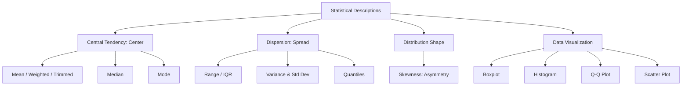
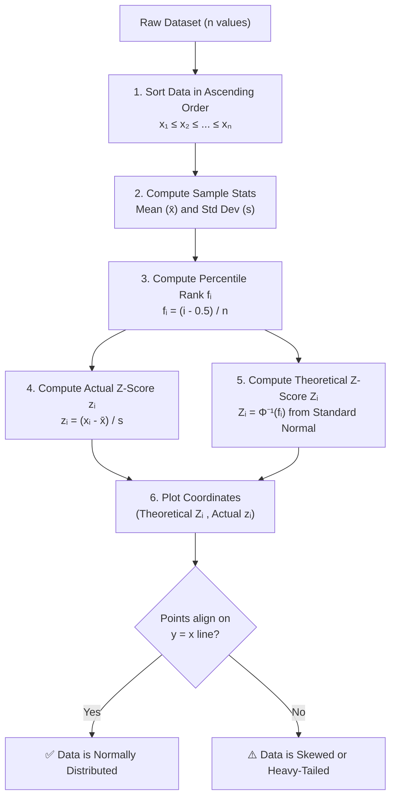
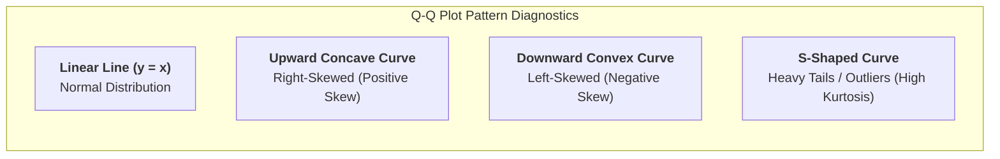

# Chapter 4 — Statistical Descriptions of Data

> **Course:** Data Analysis and Visualization
> **Primary Source:** 4.Statistical Descriptions of Data_new.pdf
> **Files Integrated:** `4.Statistical Descriptions of Data_new.pdf`, `ch4_text.txt`

---

## 1. Chapter Overview

Basic statistical descriptions can be used to identify properties of the data and highlight which data values should be treated as noise or outliers. To better understand the data, we look at the central tendency, variation, and spread. This helps in understanding data dispersion characteristics, which can be analyzed with multiple granularities of precision.

[Source: 4.Statistical Descriptions of Data_new.pdf, Slides 2-4]

---

## 2. Fundamental Concepts

### Central Tendency vs Dispersion vs Shape

[Source: 4.Statistical Descriptions of Data_new.pdf, Slides 3-4, 49]

---

## 3. Definitions

### Definition: Central Tendency

**Meaning:** The typical or central value for a probability distribution.

**Intuition:** If we were to plot the observations for an attribute, where would most of the values fall? This gives an idea of the central tendency. Measures include mean, median, and mode.

[Source: 4.Statistical Descriptions of Data_new.pdf, Slide 3]

### Definition: Dispersion

**Meaning:** Measures of variability that describe the spread or dispersion of a set of data.

**Intuition:** Important for understanding how spread out or clustered the data is, checking reliability of central tendency, and comparing various samples. Measures include range, quantiles, variance, and standard deviation.

[Source: 4.Statistical Descriptions of Data_new.pdf, Slide 30]

### Definition: Mode

**Meaning:** The value that occurs most frequently in the data set. 

**Formal definition:** Data sets with one, two, or three modes are respectively called unimodal, bimodal, and trimodal. A dataset with two or more is multimodal. If each value occurs only once, there is no mode.

[Source: 4.Statistical Descriptions of Data_new.pdf, Slide 15]

---

## 4. Measuring Central Tendency (Ungrouped Data)

### Arithmetic Mean

**Formula:**

Sample Mean:

$$
\bar{x} = \frac{1}{n}\sum_{i=1}^{n} x_i
$$

Population Mean:

$$
\mu = \frac{1}{N}\sum_{i=1}^{N} x_i
$$

**Where:**

* $n$ = sample size

* $N$ = population size

* $x_i$ = individual data observation

**Conditions / Assumptions:**

A major problem with the mean is its sensitivity to extreme (outlier) values. Even a small number of extreme values can corrupt the mean.

[Source: 4.Statistical Descriptions of Data_new.pdf, Slides 5, 6, 9]

### Weighted Arithmetic Mean

Sometimes each value is associated with a weight reflecting significance, importance, or occurrence frequency.

**Formula:**

$$
\bar{x}_w = \frac{\sum_{i=1}^{n} w_i x_i}{\sum_{i=1}^{n} w_i}
$$

**Where:**

* $w_i$= weight associated with$x_i$

[Source: 4.Statistical Descriptions of Data_new.pdf, Slides 5, 8]

### Trimmed Mean

**Meaning:** Chopping extreme values (outliers) from the dataset before calculating the mean to reduce sensitivity to extreme outliers.

[Source: 4.Statistical Descriptions of Data_new.pdf, Slide 5]

### Median

**Meaning:** The middle value in a dataset when arranged in ascending or descending order.

**Procedure for Ungrouped Data:**

1. Sort the data.

2. If the number of values ($n$) is odd: Median = the middle value.

3. If $n$ is even: Median = the average of the two middle values.

**Examples:**

* Odd Example: Data: $3, 5, 7 \rightarrow \text{Median} = 5$

* Even Example: Data: $4, 6, 8, 10 \rightarrow \text{Median} = \frac{6+8}{2} = 7$

[Source: 4.Statistical Descriptions of Data_new.pdf, Slides 10-11]

### Example: Salary Mean

**Given:**

Salary values in thousands of dollars, sorted: $30, 36, 47, 50, 52, 52, 56, 60, 63, 70, 70, 110$.

**Solution:**

Total sum = $30 + 36 + 47 + 50 + 52 + 52 + 56 + 60 + 63 + 70 + 70 + 110 = 696$

$N = 12$

Mean $\bar{x} = \frac{696}{12} = 58$

Median: Since $N=12$ (even), the median is the average of the 6th and 7th values:

6th value = 52, 7th value = 56

Median = $\frac{52 + 56}{2} = 54$

Mode: 52 and 70 both appear twice. The dataset is bimodal.

[Source: 4.Statistical Descriptions of Data_new.pdf, Slide 7]

---

## 5. Measuring Central Tendency (Grouped Data)

When data are grouped into intervals (classes), we estimate central tendency measures.

### Grouped Mean

**Formula:**

$$
\bar{x} = \frac{\sum f_i x_i}{N}
$$

**Where:**

* $x_i$ = midpoint of the class interval

* $f_i$ = frequency of the class

* $N$ = sum of all frequencies

### Grouped Median

**Formula:**

$$
M_e = L + \left[ \frac{\frac{N}{2} - B}{G} \right] \times w
$$

**Where:**

* $L$ = lower boundary of the median class

* $N$ = total frequency

* $B$ = cumulative frequency of the groups before the median group

* $G$ = frequency of the median group

* $w$ = group width

### Grouped Mode

**Formula:**

$$
M_o = L + \left[ \frac{f_m - f_{m-1}}{(f_m - f_{m-1}) + (f_m - f_{m+1})} \right] \times w
$$

Which simplifies to:

$$
M_o = L + \left[ \frac{f_m - f_{m-1}}{2f_m - f_{m-1} - f_{m+1}} \right] \times w
$$

**Where:**

* $L$ = lower boundary of the modal class

* $f_m$ = frequency of the modal group

* $f_{m-1}$ = frequency of the preceding group

* $f_{m+1}$ = frequency of the succeeding group

* $w$ = group width

[Source: 4.Statistical Descriptions of Data_new.pdf, Slides 16-24]

### Example: Running Race

**Given:**

Runners' times grouped in seconds.

| Class Interval | Midpoint ($x_i$) | Frequency ($f_i$) | $f_i \times x_i$ |
| -------------- | ---------------- | ----------------- | ---------------- |
| 51 - 55        | 53               | 2                 | 106              |
| 56 - 60        | 58               | 7                 | 406              |
| 61 - 65        | 63               | 8                 | 504              |
| 66 - 70        | 68               | 4                 | 272              |
| **Total**      |                  | **21**            | **1288**         |

**Solution - Mean:**

Mean = $\frac{1288}{21} \approx 61.33$

**Solution - Median:**

$N = 21$. $\frac{N}{2} = 10.5$.

Cumulative frequencies:

* 51-55: 2

* 56-60: $2+7 = 9$

* 61-65: $9+8 = 17 \rightarrow$ Median lies here.

Parameters:

$L = 60.5$ (lower class boundary)

$B = 9$ (cumulative freq before)

$G = 8$ (freq of median class)

$w = 5$ (width)

$$
M_e = 60.5 + \left[ \frac{10.5 - 9}{8} \right] \times 5 = 60.5 + \left( \frac{1.5}{8} \right) \times 5 = 60.5 + 0.9375 = 61.4375
$$

**Solution - Mode:**

Highest frequency is 8, so modal class is 61-65.

Parameters:

$L = 60.5$

$f_{m-1} = 7$

$f_m = 8$

$f_{m+1} = 4$

$w = 5$

$$
M_o = 60.5 + \left[ \frac{8 - 7}{2(8) - 7 - 4} \right] \times 5 = 60.5 + \left[ \frac{1}{16 - 11} \right] \times 5 = 60.5 + \frac{5}{5} = 61.5
$$

[Source: 4.Statistical Descriptions of Data_new.pdf, Slides 16-24]

### Example: Baby Carrots

**Given:**

You grew 50 baby carrots and measured their lengths to group the results. Computing the Mean, Median, Mode uses the same grouped formulas for the frequency of these 50 carrots as the running race above.

[Source: 4.Statistical Descriptions of Data_new.pdf, Slides 25-28]

---

## 6. Measuring Dispersion

We need dispersion measures because even when two datasets have the same mean and median, they can be very different in spread shape.

**Example of why we need SD:**

* **Dataset 1:** $44, 46, 48, 45, 47$ $\rightarrow$ Mean = 46, Variance = 2.0, SD = 1.41 (low dispersion)

* **Dataset 2:** $34, 46, 59, 39, 52$ $\rightarrow$ Mean = 46, Variance = 79.6, SD = 8.92 (high dispersion)

Both have mean and median of 46, but spread is completely different.

[Source: 4.Statistical Descriptions of Data_new.pdf, Slides 29, 40]

### Range

**Meaning:** The spread of data from the lowest to the highest value.

**Formula:** Maximum value - Minimum value.

[Source: 4.Statistical Descriptions of Data_new.pdf, Slide 32]

### Quantiles

**Meaning:** Cut points that divide a dataset into equal-sized intervals based on rank order.

| Type | Division | Example |
| :--- | :--- | :--- |
| **Quartiles** | Divide data into 4 equal parts | $Q_1, Q_2, Q_3, Q_4$ |
| **Deciles** | Divide data into 10 equal parts | $D_1, D_2, \dots, D_9$ |
| **Percentiles**| Divide data into 100 equal parts | $P_1, P_2, \dots, P_{99}$ |
| **Median** | Special case of $Q_2$ / 50th percentile | |

**Quartile Formulas:**

* $Q_1$position =$\frac{1}{4}(n+1)$th term

* $Q_3$position =$\frac{3}{4}(n+1)$th term

**Example:**

For $n=9$:

* $Q_1 = \frac{1}{4}(10) = 2.25$th term

* $Q_2 = \frac{2}{4}(10) = 4.5$th term

* $Q_3 = \frac{3}{4}(10) = 6.75$th term

[Source: 4.Statistical Descriptions of Data_new.pdf, Slides 33-36]

### Interquartile Range (IQR)

**Meaning:** The interquartile range gives the spread of the middle half of the distribution.

**Formula:**

$$
IQR = Q_3 - Q_1
$$

[Source: 4.Statistical Descriptions of Data_new.pdf, Slide 37]

### Variance and Standard Deviation

**Variance ($\sigma^2$or$s^2$):** Average of squared distances from the mean.

**Standard Deviation ($\sigma$or$s$):** Square root of the variance.

### Worked Example: Variance and SD

**Given Data:** $[4, 5, 6, 6, 7, 8]$

**Step 1: Mean**

$$
\bar{x} = \frac{4+5+6+6+7+8}{6} = \frac{36}{6} = 6
$$

**Step 2: Deviations & Squared Deviations**

| $x_i$|$(x_i - \text{mean})$|$(x_i - \text{mean})^2$ |
| --- | --- | --- |
| 4 | -2 | 4 |
| 5 | -1 | 1 |
| 6 | 0 | 0 |
| 6 | 0 | 0 |
| 7 | 1 | 1 |
| 8 | 2 | 4 |
| **Sum** | | **10** |

**Step 3: Variance & SD**

Variance = $\frac{10}{6} = 1.67$

SD = $\sqrt{1.67} \approx 1.29$

[Source: 4.Statistical Descriptions of Data_new.pdf, Slides 44-47]

### Worked Example: Die Roll Variance

**Given:** A fair die is rolled. Sample space $X = \{1, 2, 3, 4, 5, 6\}$. $n=6$.

**Mean:** $\frac{1+2+3+4+5+6}{6} = 3.5$

**Variance:**

$$
\sigma^2 = \frac{1}{6} \left[ (1-3.5)^2 + (2-3.5)^2 + \dots \right] = \frac{1}{6} (6.25 + 2.25 + 0.25 + 0.25 + 2.25 + 6.25) = \frac{17.5}{6} = 2.917
$$

**Standard Deviation:** $\sqrt{2.917} = 1.708$

[Source: 4.Statistical Descriptions of Data_new.pdf, Slides 61-62]

---

## 7. Five-Number Summary and Boxplot Analysis

[Click here to open boxplot_visualizer.html if the visualizer below does not load](boxplot_visualizer.html)

<iframe src="./boxplot_visualizer.html" width="100%" height="700px" style="border:none; border-radius:12px; margin-bottom: 24px; background: white;"></iframe>

**Five-number summary:** Minimum, $Q_1$, Median, $Q_3$, Maximum.

**Boxplot Structure:**

* Data represented with a box. Ends of box are at $Q_1$and$Q_3$.

* Box height represents IQR.

* Median is marked by a line inside the box.

* Whiskers extend outside the box to Minimum and Maximum (excluding outliers).

* Outliers: Values higher or lower than $1.5 \times IQR$from$Q_1$and$Q_3$.

### Box Plot Procedure & Example

**Step 1: Order data**

Data: $25, 28, 29, 29, 30, 34, 35, 35, 37, 38, 50$ ($n=11$)

**Step 2: Median**

Median = 6th term = $34$

**Step 3: Quartiles**

$Q_1$= Median of lower half =$29$

$Q_3$= Median of upper half =$37$

**Step 4: $1.5 \times IQR$**

$IQR = 37 - 29 = 8$

$1.5 \times IQR = 1.5 \times 8 = 12$

**Step 5: Outliers**

Lower bound = $Q_1 - 12 = 29 - 12 = 17$

Upper bound = $Q_3 + 12 = 37 + 12 = 49$

Since $50 > 49$, $50$is an outlier. The maximum non-outlier whisker goes to$38$.

[Source: 4.Statistical Descriptions of Data_new.pdf, Slides 54-57]

**Boxplot Data Sets for Practice:**

* **Data 1:** $10, 12, 11, 15, 11, 14, 13, 17, 12, 22, 14, 11$

* **Data 2:** $22, 25, 17, 19, 33, 64, 23, 17, 20, 18$

[Source: 4.Statistical Descriptions of Data_new.pdf, Slide 63]

---

## 8. Distribution Shape and Skewness

### Skewness Interpretation

* **Symmetric:** Mean $\approx$Median$\approx$ Mode.

* **Positively skewed (right-skewed):** Mean $>$Median$>$ Mode. Tail extends to right.

* **Negatively skewed (left-skewed):** Mean $<$Median$<$ Mode. Tail extends to left.

### Example

**Given Dataset:** $4, 5, 6, 6, 6, 7, 7, 7, 7, 8$ ($n=10$)

**Mean:** $\frac{63}{10} = 6.3$

**Median:** Average of 5th and 6th values = $\frac{6+7}{2} = 6.5$

**Mode:** $7$ appears 4 times.

**Conclusion:** $6.3 < 6.5 < 7$ $\rightarrow$Mean$<$Median$<$ Mode.

This data is **negatively skewed (left-skewed)**.

[Source: 4.Statistical Descriptions of Data_new.pdf, Slides 50-53]

* Note on Skewness in Boxplots:* The position of the median line inside the box and the relative length of the whiskers can visually indicate skewness.

[Source: 4.Statistical Descriptions of Data_new.pdf, Slide 58]

---

## 9. Histograms

### Definition: Histogram

**Meaning:** Graphical display of tabulated frequencies, shown as bars. It shows what proportion of cases fall into each category. Unlike a bar chart, the area of the bar denotes the value, not just the height.

### Components of a Histogram

| Components | Description |
| :--- | :--- |
| **X-Axis** | Horizontal axis, represents range of values, composed of bins. |
| **Y-Axis** | Shows how often values appear on the X-axis (frequency). |
| **Bins & Intervals** | Divide data into ranges on X-axis. Width determines range of values grouped. |
| **Frequency** | Numerical data points falling within each bin. Height of bar. |
| **Density** | Frequency divided by bin width. Used to normalize datasets of different sizes. |

### Histogram Uses

1. Shape of distribution (normal, skewed, bimodal).

2. Central tendency (where values cluster).

3. Spread/variability.

4. Outliers or gaps.

### Histogram vs. Bar Graph

| Feature | Bar Graph | Histogram |
| :--- | :--- | :--- |
| **Dimensionality** | One dimension | Two dimensions |
| **Representation of frequency** | Length of the bars | Area of the bar |
| **Significance of Bar Width** | No special significance | Represents interval or bin |
| **Spacing between bars** | Bars separated with equal spaces | Bars touch each other |

Histograms often tell more than boxplots. Two datasets might share the exact same five-number summary (same boxplot) but have completely different internal distributions visible on a histogram.

[Source: 4.Statistical Descriptions of Data_new.pdf, Slides 65-72]

---

## 10. Visualizations and Bivariate Data

### Normal Distribution

[Click here to open distribution_visualizer.html if the visualizer below does not load](distribution_visualizer.html)

<iframe src="./distribution_visualizer.html" width="100%" height="700px" style="border:none; border-radius:12px; margin-bottom: 24px; background: white;"></iframe>

A continuous probability distribution representing data that is symmetrical, with most values clustered around the mean.

**Characteristics:**

1. Bell-shaped curve.

2. Symmetrical.

3. Mean = Median = Mode.

4. Total Area = 1 (100%).

5. Tails never touch the X-axis.

| Symbol | Meaning | Example |
| :--- | :--- | :--- |
| $f(x)$| Probability density at value$x$ | Height of curve |
| $x$ | Observation | Scored 75 marks |
| $\mu$ | Mean | Average = 70 |
| $\sigma$ | Standard deviation | 10 marks |
| $\pi$| Constant$\approx 3.1416$ | |
| $e$| Euler's number$\approx 2.718$ | |

### Z-Scores & Standardized Values

The **Z-Score** (also known as the standard score) measures the signed distance of a data point from the mean in units of standard deviation.

#### Formulas

**Sample Z-Score:**

$$
z_i = \frac{x_i - \bar{x}}{s}
$$

**Population Z-Score:**

$$
Z_i = \frac{X_i - \mu}{\sigma}
$$

**Where:**
- $x_i$ / $X_i$ = Individual data observation
- $\bar{x}$ / $\mu$ = Sample / Population Mean
- $s$ / $\sigma$ = Sample / Population Standard Deviation

#### Properties of Z-Scores:
- **$z = 0$**: The observation equals the mean ($\bar{x}$).
- **$z > 0$**: The observation is above the mean ($z = +1.5$ means $1.5\sigma$ above mean).
- **$z < 0$**: The observation is below the mean ($z = -2.0$ means $2.0\sigma$ below mean).
- **Standardized Mean & Variance:** Transforming a dataset to $z$-scores yields a transformed mean $\bar{z} = 0$ and standard deviation $s_z = 1$.

#### Theoretical Z-Scores for Key Percentiles (Standard Normal $\mathcal{N}(0,1)$):

| Percentile ($p$) | Cumulative Area | Theoretical Z-Score ($Z = \Phi^{-1}(p)$) |
| :--- | :---: | :---: |
| **0.1%** | $0.001$ | $-3.090$ |
| **2.5%** | $0.025$ | $-1.960$ |
| **5.0%** | $0.050$ | $-1.645$ |
| **10.0%** | $0.100$ | $-1.282$ |
| **25.0% ($Q_1$)** | $0.250$ | $-0.674$ |
| **50.0% (Median)** | $0.500$ | $0.000$ |
| **75.0% ($Q_3$)** | $0.750$ | $+0.674$ |
| **90.0%** | $0.900$ | $+1.282$ |
| **97.5%** | $0.975$ | $+1.960$ |

[Source: 4.Statistical Descriptions of Data_new.pdf, Slides 76-84]

---

### Quantile Plot & Q-Q Plot Visualizer

[Click here to open qqplot_visualizer.html if the visualizer below does not load](qqplot_visualizer.html)

<iframe src="./qqplot_visualizer.html" width="100%" height="700px" style="border:none; border-radius:12px; margin-bottom: 24px; background: white;"></iframe>

---

### Quantile Plot

A **Quantile Plot** is a simple graphical method to inspect the overall distribution of a continuous variable. It displays all data points sorted in ascending order paired with their percentile ranks.

#### Formula for Percentile Rank ($f_i$):

$$
f_i = \frac{i - 0.5}{n} \quad \text{for } i = 1, 2, \dots, n
$$

**Where:**
- $i$ = Sorted rank of the observation ($1$-indexed)
- $n$ = Total sample size
- $f_i$ = Estimated cumulative probability (percentile rank), representing the fraction of data $\le x_i$

**Plot Coordinates:** $(f_i, x_i)$ or $(100 \cdot f_i, x_i)$

[Source: 4.Statistical Descriptions of Data_new.pdf, Slides 85-86]

---

### Q-Q Plot (Quantile-Quantile Plot)

A **Q-Q Plot** graphs the quantiles of a sample distribution against the corresponding theoretical quantiles of a reference distribution (typically the Standard Normal Distribution $\mathcal{N}(0,1)$). It is the definitive visual test for normality.

#### Construction Pipeline

#### Mathematical Formulas

1. **Theoretical Quantile Formula:**

$$
Z_{\text{theoretical}, i} = \Phi^{-1}\left(\frac{i - 0.5}{n}\right)
$$

Where $\Phi^{-1}(p)$ is the inverse cumulative distribution function (Probit function) of the standard normal distribution $\mathcal{N}(0,1)$.

2. **Actual Sample Z-Score Formula:**

$$
z_{\text{actual}, i} = \frac{x_i - \bar{x}}{s}
$$

3. **Plotted Coordinates:**

$$
(X, Y) = \left( Z_{\text{theoretical}, i}, z_{\text{actual}, i} \right) \quad \text{or} \quad \left( Z_{\text{theoretical}, i}, x_i \right)
$$

---

### Complete Worked Numerical Trace: Q-Q Plot for Normality

#### Given Sample Dataset ($n = 9$):
$$X_{\text{raw}} = \{7.19, 6.31, 5.89, 4.50, 3.77, 4.25, 5.19, 5.79, 6.79\}$$

#### Step 1: Sort Data and Assign Ranks ($i = 1 \dots 9$)

$$X_{\text{sorted}} = [3.77, 4.25, 4.50, 5.19, 5.79, 5.89, 6.31, 6.79, 7.19]$$

#### Step 2: Compute Sample Statistics

- **Sample Size ($n$):** $9$
- **Sample Mean ($\bar{x}$):**
  $$\bar{x} = \frac{3.77 + 4.25 + 4.50 + 5.19 + 5.79 + 5.89 + 6.31 + 6.79 + 7.19}{9} = \frac{49.68}{9} = 5.52$$
- **Sample Variance ($s^2$):**
  $$s^2 = \frac{\sum (x_i - 5.52)^2}{9 - 1} = \frac{9.814}{8} = 1.22685$$
- **Sample Standard Deviation ($s$):**
  $$s = \sqrt{1.22685} \approx 1.108$$

#### Step 3: Compute All 9 Quantile Table Entries

| Rank ($i$) | Sorted Value ($x_i$) | Formula $f_i = \frac{i - 0.5}{9}$ | Percentile $f_i$ | Actual Z-Score $z = \frac{x_i - 5.52}{1.108}$ | Theoretical Z-Score $Z = \Phi^{-1}(f_i)$ | Plotted Point $(Z_{\text{theo}}, z_{\text{act}})$ |
| :---: | :---: | :---: | :---: | :---: | :---: | :---: |
| **1** | $3.77$ | $\frac{0.5}{9}$ | $0.0556$ ($5.6\%$) | $\frac{3.77 - 5.52}{1.108} = \mathbf{-1.58}$ | $\Phi^{-1}(0.0556) = \mathbf{-1.59}$ | $(-1.59, -1.58)$ |
| **2** | $4.25$ | $\frac{1.5}{9}$ | $0.1667$ ($16.7\%$) | $\frac{4.25 - 5.52}{1.108} = \mathbf{-1.15}$ | $\Phi^{-1}(0.1667) = \mathbf{-0.97}$ | $(-0.97, -1.15)$ |
| **3** | $4.50$ | $\frac{2.5}{9}$ | $0.2778$ ($27.8\%$) | $\frac{4.50 - 5.52}{1.108} = \mathbf{-0.92}$ | $\Phi^{-1}(0.2778) = \mathbf{-0.59}$ | $(-0.59, -0.92)$ |
| **4** | $5.19$ | $\frac{3.5}{9}$ | $0.3889$ ($38.9\%$) | $\frac{5.19 - 5.52}{1.108} = \mathbf{-0.30}$ | $\Phi^{-1}(0.3889) = \mathbf{-0.28}$ | $(-0.28, -0.30)$ |
| **5** | $5.79$ | $\frac{4.5}{9}$ | $0.5000$ ($50.0\%$) | $\frac{5.79 - 5.52}{1.108} = \mathbf{+0.24}$ | $\Phi^{-1}(0.5000) = \mathbf{0.00}$ | $(0.00, +0.24)$ |
| **6** | $5.89$ | $\frac{5.5}{9}$ | $0.6111$ ($61.1\%$) | $\frac{5.89 - 5.52}{1.108} = \mathbf{+0.33}$ | $\Phi^{-1}(0.6111) = \mathbf{+0.28}$ | $(+0.28, +0.33)$ |
| **7** | $6.31$ | $\frac{6.5}{9}$ | $0.7222$ ($72.2\%$) | $\frac{6.31 - 5.52}{1.108} = \mathbf{+0.71}$ | $\Phi^{-1}(0.7222) = \mathbf{+0.59}$ | $(+0.59, +0.71)$ |
| **8** | $6.79$ | $\frac{7.5}{9}$ | $0.8333$ ($83.3\%$) | $\frac{6.79 - 5.52}{1.108} = \mathbf{+1.15}$ | $\Phi^{-1}(0.8333) = \mathbf{+0.97}$ | $(+0.97, +1.15)$ |
| **9** | $7.19$ | $\frac{8.5}{9}$ | $0.9444$ ($94.4\%$) | $\frac{7.19 - 5.52}{1.108} = \mathbf{+1.51}$ | $\Phi^{-1}(0.9444) = \mathbf{+1.59}$ | $(+1.59, +1.51)$ |

#### Step 4: Interpretation of Q-Q Plot Diagnostics

| Q-Q Plot Pattern | Visual Shape | Statistical Diagnosis | Corrective Action |
| :--- | :--- | :--- | :--- |
| **Points lie along $y = x$** | Straight $45^\circ$ line | Perfect Normal Distribution | No transformation needed |
| **Points curve upward (Concave)** | Bends above $y=x$ at right end | Right-Skewed (Positively Skewed) | Apply Log or Square Root transform ($\log(X)$) |
| **Points curve downward (Convex)** | Bends below $y=x$ at left end | Left-Skewed (Negatively Skewed) | Apply Square or Exponential transform ($X^2$) |
| **Points flare out at ends (S-shape)** | Deviates sharply at extremes | Heavy Tails (Extreme Outliers / High Kurtosis) | Apply Robust Scaling or Trim Outliers |
| **Parallel shift above/below** | Shifted intercept | Shifted Location (Mean difference) | Adjust baseline mean |
| **Slope different from $1$** | Steeper or flatter slope | Difference in Scale (Std Dev difference) | Normalize standard deviation |

[Source: 4.Statistical Descriptions of Data_new.pdf, Slides 91-96]

### Scatter Plot

Provides a first look at bivariate data to see clusters, positive/negative correlation, and uncorrelated data. Each pair of values is treated as coordinates $(x,y)$.

[Source: 4.Statistical Descriptions of Data_new.pdf, Slides 73-75]

### When to Use What Plot

| Question | Use This Plot | X-axis | Y-axis |
| :--- | :--- | :--- | :--- |
| Compare categories | **Bar Chart** | Category | Numerical Value |
| Distribution of one variable | **Histogram** | Numerical intervals | Frequency |
| Trend over time | **Line Chart** | Time | Numerical Value |
| Relationship between 2 variables | **Scatter Plot** | Numerical Var 1 | Numerical Var 2 |
| Parts of a whole | **Pie Chart** | Categories | Percentage |
| Median, quartiles, outliers | **Box Plot** | Category | Numerical Value |
| Value at every percentile | **Quantile Plot**| Percentiles | Data Values |
| Compare 2 distributions / normality| **Q-Q Plot** | Quantiles of Data 1 | Quantiles of Data 2 |

[Source: 4.Statistical Descriptions of Data_new.pdf, Slide 98]

### Data Visualization Categories

1. Pixel-oriented visualization

2. Geometric projection visualization

3. Icon-based visualization

4. Hierarchical visualization

[Source: 4.Statistical Descriptions of Data_new.pdf, Slide 99]

---

## Formula Sheet

### 1. Ungrouped Mean

$$
\bar{x} = \frac{1}{n}\sum x_i
$$

### 2. Grouped Median

$$
M_e = L + \left[ \frac{\frac{N}{2} - B}{G} \right] \times w
$$

Where $L$is lower boundary,$B$is cumulative freq before,$G$is freq of median class,$w$ is width.

### 3. Grouped Mode

$$
M_o = L + \left[ \frac{f_m - f_{m-1}}{2f_m - f_{m-1} - f_{m+1}} \right] \times w
$$

### 4. Variance and Standard Deviation

$$
s^2 = \frac{\sum (x_i - \bar{x})^2}{n} \quad (\text{or } n-1 \text{ for sample})
$$

$$
s = \sqrt{s^2}
$$

### 5. Actual Z-Score

$$
z = \frac{x - \bar{x}}{s}
$$

### 6. Percentile Rank for Q-Q Plot

$$
\text{Percentile} = \frac{i - 0.5}{n}
$$

---

## Definition Sheet

* **Central Tendency:** Indicates where most values fall (Mean, Median, Mode).

* **Dispersion:** Indicates spread of data (Variance, SD, IQR, Range).

* **Quantiles:** Points dividing data into equal probability intervals.

* **Interquartile Range (IQR):** Difference between $Q_3$and$Q_1$, spread of the middle 50%.

* **Histogram:** Graph of tabulated frequencies using area of adjacent bars.

* **Q-Q Plot:** Plot comparing quantiles of two distributions to test similarity or normality.

* **Skewness:** Asymmetry of distribution (Positively skewed if $	ext{Mean} > 	ext{Median} > 	ext{Mode}$).

* **Normal Distribution:** Bell-shaped, symmetric distribution where Mean = Median = Mode.

---

## Exam-Oriented Review

**Important Concepts to Understand:**

* Difference between central tendency and dispersion.

* Impact of outliers on mean vs median.

* Grouped vs ungrouped data calculations.

* Differences between Bar Graph and Histogram.

* Constructing and interpreting a Q-Q Plot and identifying theoretical vs actual Z-scores.

**Potential Questions:**

1. Given a dataset, calculate the five-number summary and determine if there are any outliers.

2. Calculate the variance and standard deviation for a given set of die rolls.

3. If Mean = 6.3, Median = 6.5, and Mode = 7, describe the shape of the distribution. (Answer: Negatively skewed).

4. Explain the steps to create a Q-Q plot and what the $y=x$ line represents.

5. Provide the formula for the grouped median and define each term.

