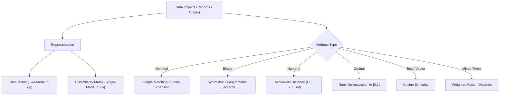
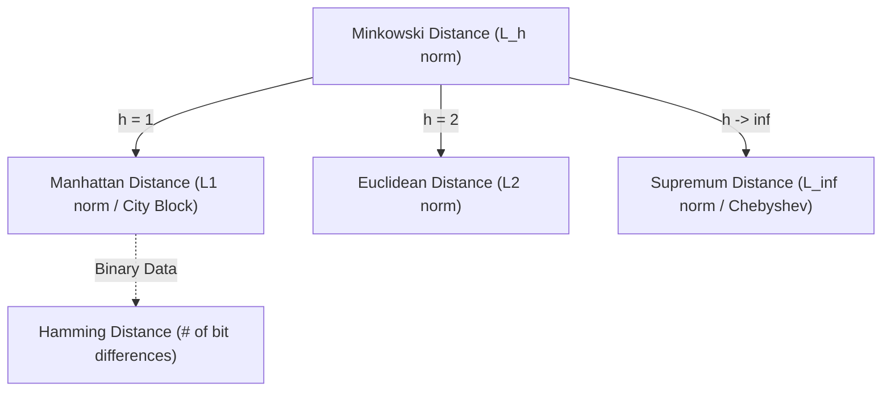

<Complete DAV Notes: Chapter 6 ? Measuring Data Similarity and Dissimilarity>
> **Course:** Data Analysis and Visualisation (3CS103ME24)
> **Programme:** B.Tech (CSE), Integrated B.Tech (CSE)-MBA, B.Tech (Interdisciplinary Minor in Data Science)
> **Primary Source:** `5.1_Similarity and Dissimilarity.pdf`
> **Files Integrated:** `5.1_Similarity and Dissimilarity.pdf`, `ch5_1_text.txt`
</Complete DAV Notes: Chapter 6 ? Measuring Data Similarity and Dissimilarity>

# Chapter 6 ? Measuring Data Similarity and Dissimilarity

---

## 1. Chapter Overview

Proximity measurement?quantifying how similar or dissimilar two data objects are?forms the mathematical foundation of data mining, clustering, classification, nearest-neighbor search, and outlier analysis. Real-world datasets consist of heterogeneous attributes: nominal, binary, numeric, ordinal, and text vectors. This chapter systematically covers data representation matrices, distance metrics, attribute-specific proximity calculations, standardization techniques, and mixed-type proximity fusion.

[Source: 5.1_Similarity and Dissimilarity.pdf, Slides 1-5]

---

## 2. Fundamental Data Structures

### Data Matrix vs. Dissimilarity Matrix

In proximity analysis, data is organized into two primary mathematical structures:

| Characteristic | Data Matrix ($n \times p$) | Dissimilarity / Distance Matrix ($n \times n$) |
| :--- | :--- | :--- |
| **Dimensions** | $n$ rows (data points) $\times$ $p$ columns (attributes/features) | $n$ rows $\times$ $n$ columns (pairwise distances) |
| **Mode Type** | **Two-mode:** Rows and columns represent different entities (objects vs. attributes). | **Single-mode:** Rows and columns represent the same entities (objects vs. objects). |
| **Entry Meaning** | $x_{if}$: Value of object $i$ for attribute $f$. | $d(i,j)$: Pairwise dissimilarity between object $i$ and object $j$. |
| **Symmetry** | Asymmetric / Rectangular. | Symmetric ($d(i,j) = d(j,i)$) with main diagonal zero ($d(i,i)=0$). Stored as lower triangular. |

#### Mathematical Structure of Data Matrix

$$
X = \begin{bmatrix}
x_{11} & \cdots & x_{1f} & \cdots & x_{1p} \\
\vdots & \ddots & \vdots & \ddots & \vdots \\
x_{i1} & \cdots & x_{if} & \cdots & x_{ip} \\
\vdots & \ddots & \vdots & \ddots & \vdots \\
x_{n1} & \cdots & x_{nf} & \cdots & x_{np}
\end{bmatrix}
$$

#### Mathematical Structure of Dissimilarity Matrix

$$
D = \begin{bmatrix}
0 & & & & \\
d(2,1) & 0 & & & \\
d(3,1) & d(3,2) & 0 & & \\
\vdots & \vdots & \vdots & \ddots & \\
d(n,1) & d(n,2) & \cdots & d(n,n-1) & 0
\end{bmatrix}
$$

[Source: 5.1_Similarity and Dissimilarity.pdf, Slide 5]

---

## 3. Definitions & Core Principles

### Definition: Similarity
**Meaning:** A numerical measure of how alike two data objects are.  
**Formal definition:** A function $s(i,j) \in [0, 1]$ (or $[0, \infty)$) that increases as the likeness between object $i$ and object $j$ increases, reaching maximum when $i = j$.  
**Intuition:** $s(i,j) = 1$ indicates identical objects; $s(i,j) = 0$ indicates completely unalike objects.  
[Source: 5.1_Similarity and Dissimilarity.pdf, Slide 4]

### Definition: Dissimilarity (Distance)
**Meaning:** A numerical measure of how different two data objects are.  
**Formal definition:** A function $d(i,j) \ge 0$ that decreases as the likeness between object $i$ and object $j$ increases, with $d(i,i) = 0$.  
**Intuition:** Lower values imply higher similarity. Minimum dissimilarity is $0$, while the upper limit varies based on the metric.  
[Source: 5.1_Similarity and Dissimilarity.pdf, Slide 4]

### Definition: Proximity
**Meaning:** An umbrella term referring to either similarity or dissimilarity between pairs of data objects.  
[Source: 5.1_Similarity and Dissimilarity.pdf, Slide 4]

---

## 4. Proximity Measures for Nominal Attributes

A nominal attribute takes 2 or more qualitative states (e.g., $\text{Color} \in \{\text{red, yellow, blue, green}\}$).

### Method 1: Simple Matching

### Formula

$$
d(i,j) = \frac{p - m}{p}
$$

### Where
* $d(i,j)$ = Dissimilarity between object $i$ and object $j$
* $m$ = Number of matches (attributes where object $i$ and $j$ share identical states)
* $p$ = Total number of nominal attributes evaluated

### Complementary Similarity

$$
s(i,j) = 1 - d(i,j) = \frac{m}{p}
$$

### Method 2: Binary Indicator Expansion
Create $M$ separate binary attributes for each of the $M$ states of a nominal attribute, setting the indicator to $1$ if present and $0$ otherwise.

[Source: 5.1_Similarity and Dissimilarity.pdf, Slide 6]

---

## 5. Proximity Measures for Binary Attributes

Binary attributes take only two states: $0$ and $1$.

### Contingency Table for Binary Pairs ($2 \times 2$)

| | Object $j = 1$ | Object $j = 0$ | Row Sum |
| :--- | :---: | :---: | :---: |
| **Object $i = 1$** | $q$ | $r$ | $q + r$ |
| **Object $i = 0$** | $s$ | $t$ | $s + t$ |
| **Col Sum** | $q + s$ | $r + t$ | $p = q + r + s + t$ |

* $q$ = Attributes where both objects are $1$ (positive matches).
* $r$ = Attributes where object $i = 1$ and object $j = 0$.
* $s$ = Attributes where object $i = 0$ and object $j = 1$.
* $t$ = Attributes where both objects are $0$ (negative matches).
* $p$ = Total number of binary attributes ($q + r + s + t$).

### Symmetric Binary Variables
Both states ($0$ and $1$) carry equal weight and importance (e.g., $\text{Gender} \in \{\text{Male, Female}\}$).

$$
d(i,j) = \frac{r + s}{q + r + s + t}
$$

$$
sim(i,j) = 1 - d(i,j) = \frac{q + t}{q + r + s + t}
$$

### Asymmetric Binary Variables
The positive state ($1$) is rare and important, while the negative state ($0$) is non-informative (e.g., medical symptoms, laboratory test outcomes). Matching on $0-0$ ($t$) is discarded.

### Distance Measure (Asymmetric)

$$
d(i,j) = \frac{r + s}{q + r + s}
$$

### Jaccard Coefficient (Similarity for Asymmetric Binary)

$$
sim_{\text{Jaccard}}(i,j) = \frac{q}{q + r + s} = 1 - d(i,j)
$$

> [!NOTE]
> The Jaccard coefficient is mathematically identical to **coherence** in information retrieval and pattern recognition.

[Source: 5.1_Similarity and Dissimilarity.pdf, Slide 7]

---

### Worked Numerical Example: Binary Dissimilarity

#### Problem Statement
Given patient medical records with 1 symmetric attribute ($\text{Gender}$) and 6 asymmetric binary attributes ($\text{Fever, Cough, Test-1, Test-2, Test-3, Test-4}$):
* $Y$ (Yes) and $P$ (Positive) $\rightarrow 1$
* $N$ (No / Negative) $\rightarrow 0$

| Name | Gender | Fever | Cough | Test-1 | Test-2 | Test-3 | Test-4 |
| :--- | :---: | :---: | :---: | :---: | :---: | :---: | :---: |
| **Jack** | M | Y (1) | N (0) | P (1) | N (0) | N (0) | N (0) |
| **Mary** | F | Y (1) | N (0) | P (1) | N (0) | P (1) | N (0) |
| **Jim**  | M | Y (1) | P (1) | N (0) | N (0) | N (0) | N (0) |

Calculate pairwise dissimilarities between Jack, Mary, and Jim using the 6 asymmetric attributes ($p=6$).

#### Pair 1: Jack and Mary
* Fever: Both $1 \rightarrow q$
* Cough: Both $0 \rightarrow t$
* Test-1: Both $1 \rightarrow q$
* Test-2: Both $0 \rightarrow t$
* Test-3: Jack $0$, Mary $1 \rightarrow s$
* Test-4: Both $0 \rightarrow t$
* **Summary:** $q = 2$, $r = 0$, $s = 1$, $t = 3$.

$$
d(\text{Jack}, \text{Mary}) = \frac{r + s}{q + r + s} = \frac{0 + 1}{2 + 0 + 1} = \frac{1}{3} \approx 0.33
$$

#### Pair 2: Jack and Jim
* Fever: Both $1 \rightarrow q$
* Cough: Jack $0$, Jim $1 \rightarrow s$
* Test-1: Jack $1$, Jim $0 \rightarrow r$
* Test-2: Both $0 \rightarrow t$
* Test-3: Both $0 \rightarrow t$
* Test-4: Both $0 \rightarrow t$
* **Summary:** $q = 1$, $r = 1$, $s = 1$, $t = 3$.

$$
d(\text{Jack}, \text{Jim}) = \frac{r + s}{q + r + s} = \frac{1 + 1}{1 + 1 + 1} = \frac{2}{3} \approx 0.67
$$

#### Pair 3: Mary and Jim
* Fever: Both $1 \rightarrow q$
* Cough: Mary $0$, Jim $1 \rightarrow s$
* Test-1: Mary $1$, Jim $0 \rightarrow r$
* Test-2: Both $0 \rightarrow t$
* Test-3: Mary $1$, Jim $0 \rightarrow r$
* Test-4: Both $0 \rightarrow t$
* **Summary:** $q = 1$, $r = 2$, $s = 1$, $t = 2$.

$$
d(\text{Mary}, \text{Jim}) = \frac{r + s}{q + r + s} = \frac{2 + 1}{1 + 2 + 1} = \frac{3}{4} = 0.75
$$

#### Result Interpretation
* Jack and Mary are the closest / most similar ($d = 0.33$).
* Mary and Jim are the most distant / dissimilar ($d = 0.75$).

[Source: 5.1_Similarity and Dissimilarity.pdf, Slide 8]

---

## 6. Standardizing Numeric Data

Variables measured on vastly different scales cause higher-magnitude features to artificially dominate Euclidean distance calculations. Standardization balances feature contributions.

### Method 1: Z-Score Standardization (Standard Deviation Based)

$$
z = \frac{x - \mu}{\sigma}
$$

Where:
* $x$ = Raw feature value
* $\mu$ = Population mean ($\mu = \frac{1}{n} \sum_{i=1}^n x_i$)
* $\sigma$ = Standard deviation ($\sigma = \sqrt{\frac{1}{n} \sum_{i=1}^n (x_i - \mu)^2}$)

### Method 2: Robust Standardization using Mean Absolute Deviation (MAD)
Standard deviation $\sigma$ is sensitive to extreme outliers because deviations are squared. The **mean absolute deviation ($s_f$)** provides a robust alternative.

#### Step 1: Compute Feature Mean

$$
m_f = \frac{1}{n} \sum_{i=1}^n x_{if}
$$

#### Step 2: Compute Mean Absolute Deviation ($s_f$)

$$
s_f = \frac{1}{n} \sum_{i=1}^n |x_{if} - m_f|
$$

#### Step 3: Compute Robust Standardized Score

$$
z_{if} = \frac{x_{if} - m_f}{s_f}
$$

[Source: 5.1_Similarity and Dissimilarity.pdf, Slide 9]

---

## 7. Distance on Numeric Data: Minkowski Distance

### Formula: Minkowski Distance ($L_h$ Norm)

$$
d(i,j) = \left( \sum_{f=1}^p |x_{if} - x_{jf}|^h \right)^{\frac{1}{h}}
$$

### Where
* $i = (x_{i1}, x_{i2}, \dots, x_{ip})$ and $j = (x_{j1}, x_{j2}, \dots, x_{jp})$ are two $p$-dimensional numeric points
* $h$ = Order of the norm ($h \ge 1$, also denoted as $L_h$ norm)
* $p$ = Total number of numeric dimensions / attributes

### Conditions to Qualify as a Metric
A distance function $d(i,j)$ is a true **metric** if and only if it satisfies four fundamental axioms:
1. **Non-negativity:** $d(i,j) \ge 0$
2. **Positive Definiteness:** $d(i,j) = 0 \iff i = j$ (and $d(i,j) > 0$ if $i \ne j$)
3. **Symmetry:** $d(i,j) = d(j,i)$
4. **Triangle Inequality:** $d(i,j) \le d(i,k) + d(k,j)$ for any point $k$

[Source: 5.1_Similarity and Dissimilarity.pdf, Slide 11]

---

### Special Cases of Minkowski Distance

#### 1. Manhattan Distance ($h = 1$, $L_1$ Norm, City-Block Distance)

$$
d(i,j) = \sum_{f=1}^p |x_{if} - x_{jf}| = |x_{i1} - x_{j1}| + |x_{i2} - x_{j2}| + \dots + |x_{ip} - x_{jp}|
$$

> [!NOTE]
> For binary vectors, Manhattan distance reduces directly to the **Hamming distance** (the count of bit positions at which two vectors differ).

#### 2. Euclidean Distance ($h = 2$, $L_2$ Norm)

$$
d(i,j) = \sqrt{\sum_{f=1}^p |x_{if} - x_{jf}|^2} = \sqrt{(x_{i1} - x_{j1})^2 + (x_{i2} - x_{j2})^2 + \dots + (x_{ip} - x_{jp})^2}
$$

#### 3. Supremum Distance ($h \to \infty$, $L_{\infty}$ Norm, $L_{\max}$ / Chebyshev Distance)
Computes the maximum single-attribute difference across all $p$ dimensions:

$$
d(i,j) = \lim_{h \to \infty} \left( \sum_{f=1}^p |x_{if} - x_{jf}|^h \right)^{\frac{1}{h}} = \max_{f=1}^p |x_{if} - x_{jf}|
$$

[Source: 5.1_Similarity and Dissimilarity.pdf, Slide 12]

---

### Worked Numerical Example: Numeric Distance Matrices

#### Given Data Matrix ($4$ objects, $2$ attributes)

| Point | Attribute 1 ($x_1$) | Attribute 2 ($x_2$) |
| :--- | :---: | :---: |
| $x_1$ | $1$ | $2$ |
| $x_2$ | $3$ | $5$ |
| $x_3$ | $2$ | $0$ |
| $x_4$ | $4$ | $5$ |

#### 1. Manhattan Distance Matrix ($L_1$)
* $d(x_2, x_1) = |3 - 1| + |5 - 2| = 2 + 3 = 5$
* $d(x_3, x_1) = |2 - 1| + |0 - 2| = 1 + 2 = 3$
* $d(x_3, x_2) = |2 - 3| + |0 - 5| = 1 + 5 = 6$
* $d(x_4, x_1) = |4 - 1| + |5 - 2| = 3 + 3 = 6$
* $d(x_4, x_2) = |4 - 3| + |5 - 5| = 1 + 0 = 1$
* $d(x_4, x_3) = |4 - 2| + |5 - 0| = 2 + 5 = 7$

$$
D_{L_1} = \begin{bmatrix}
0 & & & \\
5 & 0 & & \\
3 & 6 & 0 & \\
6 & 1 & 7 & 0
\end{bmatrix}
$$

#### 2. Euclidean Distance Matrix ($L_2$)
* $d(x_2, x_1) = \sqrt{(3-1)^2 + (5-2)^2} = \sqrt{4 + 9} = \sqrt{13} \approx 3.61$
* $d(x_3, x_1) = \sqrt{(2-1)^2 + (0-2)^2} = \sqrt{1 + 4} = \sqrt{5} \approx 2.24$
* $d(x_3, x_2) = \sqrt{(2-3)^2 + (0-5)^2} = \sqrt{1 + 25} = \sqrt{26} \approx 5.10$
* $d(x_4, x_1) = \sqrt{(4-1)^2 + (5-2)^2} = \sqrt{9 + 9} = \sqrt{18} \approx 4.24$
* $d(x_4, x_2) = \sqrt{(4-3)^2 + (5-5)^2} = \sqrt{1 + 0} = 1.00$
* $d(x_4, x_3) = \sqrt{(4-2)^2 + (5-0)^2} = \sqrt{4 + 25} = \sqrt{29} \approx 5.39$

$$
D_{L_2} = \begin{bmatrix}
0 & & & \\
3.61 & 0 & & \\
2.24 & 5.10 & 0 & \\
4.24 & 1.00 & 5.39 & 0
\end{bmatrix}
$$

#### 3. Supremum Distance Matrix ($L_{\infty}$)
* $d(x_2, x_1) = \max(|3 - 1|, |5 - 2|) = \max(2, 3) = 3$
* $d(x_3, x_1) = \max(|2 - 1|, |0 - 2|) = \max(1, 2) = 2$
* $d(x_3, x_2) = \max(|2 - 3|, |0 - 5|) = \max(1, 5) = 5$
* $d(x_4, x_1) = \max(|4 - 1|, |5 - 2|) = \max(3, 3) = 3$
* $d(x_4, x_2) = \max(|4 - 3|, |5 - 5|) = \max(1, 0) = 1$
* $d(x_4, x_3) = \max(|4 - 2|, |5 - 0|) = \max(2, 5) = 5$

$$
D_{L_{\infty}} = \begin{bmatrix}
0 & & & \\
3 & 0 & & \\
2 & 5 & 0 & \\
3 & 1 & 5 & 0
\end{bmatrix}
$$

[Source: 5.1_Similarity and Dissimilarity.pdf, Slides 10, 13]

---

## 8. Proximity Measures for Ordinal Variables

Ordinal variables preserve a meaningful ranking (e.g., $\text{Rank} \in \{\text{freshman, sophomore, junior, senior}\}$ or customer ratings $1$ to $5$).

### Procedure: Converting Ordinal to Normalized Numeric

#### Step 1: Assign Ranks
Replace ordinal state $x_{if}$ with its integer rank:

$$
r_{if} \in \{1, 2, \dots, M_f\}
$$

Where $M_f$ is the total number of ordered states for attribute $f$.

#### Step 2: Map to Normalized Range $[0, 1]$

$$
z_{if} = \frac{r_{if} - 1}{M_f - 1}
$$

* Lowest rank $r_{if} = 1 \implies z_{if} = \frac{1 - 1}{M_f - 1} = 0$
* Highest rank $r_{if} = M_f \implies z_{if} = \frac{M_f - 1}{M_f - 1} = 1$

#### Step 3: Compute Dissimilarity
Treat $z_{if}$ as an interval-scaled numeric variable and apply standard numeric distance formulas (e.g., Euclidean or Manhattan distance).

[Source: 5.1_Similarity and Dissimilarity.pdf, Slide 14]

---

## 9. Proximity for Attributes of Mixed Types

Real-world databases combine nominal, symmetric binary, asymmetric binary, numeric, and ordinal attributes. These are unified into a single composite proximity measure using a weighted formula.

### Generalized Distance Formula

$$
d(i,j) = \frac{\sum_{f=1}^p \delta_{ij}^{(f)} d_{ij}^{(f)}}{\sum_{f=1}^p \delta_{ij}^{(f)}}
$$

### Indicator Variable $\delta_{ij}^{(f)}$
* $\delta_{ij}^{(f)} = 0$ if:
  * Either $x_{if}$ or $x_{jf}$ is missing
  * Attribute $f$ is asymmetric binary AND $x_{if} = x_{jf} = 0$
* $\delta_{ij}^{(f)} = 1$ otherwise.

### Feature-Specific Dissimilarity $d_{ij}^{(f)}$
| Attribute Type $f$ | Computation of $d_{ij}^{(f)}$ |
| :--- | :--- |
| **Binary or Nominal** | $d_{ij}^{(f)} = 0$ if $x_{if} = x_{jf}$; otherwise $d_{ij}^{(f)} = 1$. |
| **Numeric (Interval-Scaled)** | Normalized absolute difference: $d_{ij}^{(f)} = \frac{|x_{if} - x_{jf}|}{\max_h(x_{hf}) - \min_h(x_{hf})}$. |
| **Ordinal** | Rank-normalize $z_{if} = \frac{r_{if} - 1}{M_f - 1}$, then calculate: $d_{ij}^{(f)} = |z_{if} - z_{jf}|$. |

[Source: 5.1_Similarity and Dissimilarity.pdf, Slide 15]

---

## 10. Cosine Similarity for Document and Vector Data

Text documents, term-frequency vectors, and biological gene expression arrays are high-dimensional and sparse. Distance metrics like Euclidean are distorted by document length; **Cosine Similarity** measures the angle between vectors rather than Euclidean magnitude.

### Formula: Cosine Similarity

$$
\cos(\mathbf{d}_1, \mathbf{d}_2) = \frac{\mathbf{d}_1 \cdot \mathbf{d}_2}{\|\mathbf{d}_1\| \|\mathbf{d}_2\|} = \frac{\sum_{k=1}^p d_{1k} d_{2k}}{\sqrt{\sum_{k=1}^p d_{1k}^2} \sqrt{\sum_{k=1}^p d_{2k}^2}}
$$

### Properties
* Range: $[-1, 1]$ (for non-negative term frequency counts, range is $[0, 1]$)
* $\cos(\mathbf{d}_1, \mathbf{d}_2) = 1 \implies$ Vectors point in identical directions (same term frequency distribution).
* $\cos(\mathbf{d}_1, \mathbf{d}_2) = 0 \implies$ Vectors are orthogonal (share zero common terms).

[Source: 5.1_Similarity and Dissimilarity.pdf, Slide 16]

---

### Worked Numerical Example: Cosine Similarity

#### Given Document Term-Frequency Vectors
* $\mathbf{d}_1 = (5, 0, 3, 0, 2, 0, 0, 2, 0, 0)$
* $\mathbf{d}_2 = (3, 0, 2, 0, 1, 1, 0, 1, 0, 1)$

#### Step 1: Compute Vector Dot Product ($\mathbf{d}_1 \cdot \mathbf{d}_2$)

$$
\begin{aligned}
\mathbf{d}_1 \cdot \mathbf{d}_2 &= (5 \times 3) + (0 \times 0) + (3 \times 2) + (0 \times 0) + (2 \times 1) + (0 \times 1) + (0 \times 0) + (2 \times 1) + (0 \times 0) + (0 \times 1) \\
&= 15 + 0 + 6 + 0 + 2 + 0 + 0 + 2 + 0 + 0 \\
&= 25
\end{aligned}
$$

#### Step 2: Compute Vector Magnitudes (Euclidean Norms)

$$
\begin{aligned}
\|\mathbf{d}_1\| &= \sqrt{5^2 + 0^2 + 3^2 + 0^2 + 2^2 + 0^2 + 0^2 + 2^2 + 0^2 + 0^2} \\
&= \sqrt{25 + 9 + 4 + 4} = \sqrt{42} \approx 6.481
\end{aligned}
$$

$$
\begin{aligned}
\|\mathbf{d}_2\| &= \sqrt{3^2 + 0^2 + 2^2 + 0^2 + 1^2 + 1^2 + 0^2 + 1^2 + 0^2 + 1^2} \\
&= \sqrt{9 + 4 + 1 + 1 + 1 + 1} = \sqrt{17} \approx 4.123
\end{aligned}
$$

#### Step 3: Compute Cosine Similarity

$$
\cos(\mathbf{d}_1, \mathbf{d}_2) = \frac{25}{6.481 \times 4.123} = \frac{25}{26.721} \approx 0.9356 \approx 0.94
$$

#### Result Interpretation
The cosine similarity is $0.94$, indicating high semantic similarity between the two documents despite differences in word frequencies.

[Source: 5.1_Similarity and Dissimilarity.pdf, Slide 17]

---

## 11. Consolidated Formula Sheet

### 1. Simple Matching Distance (Nominal)

$$
d(i,j) = \frac{p - m}{p}
$$

### 2. Symmetric Binary Distance

$$
d(i,j) = \frac{r + s}{q + r + s + t}
$$

### 3. Asymmetric Binary Distance & Jaccard Coefficient

$$
d(i,j) = \frac{r + s}{q + r + s}, \quad sim_{\text{Jaccard}}(i,j) = \frac{q}{q + r + s}
$$

### 4. Mean Absolute Deviation (MAD) & Robust Z-Score

$$
s_f = \frac{1}{n} \sum_{i=1}^n |x_{if} - m_f|, \quad z_{if} = \frac{x_{if} - m_f}{s_f}
$$

### 5. Minkowski Distance ($L_h$ Norm)

$$
d(i,j) = \left( \sum_{f=1}^p |x_{if} - x_{jf}|^h \right)^{\frac{1}{h}}
$$
* **Manhattan ($L_1$):** $\sum_{f=1}^p |x_{if} - x_{jf}|$
* **Euclidean ($L_2$):** $\sqrt{\sum_{f=1}^p (x_{if} - x_{jf})^2}$
* **Supremum ($L_{\infty}$):** $\max_{f=1}^p |x_{if} - x_{jf}|$

### 6. Ordinal Normalization

$$
z_{if} = \frac{r_{if} - 1}{M_f - 1}
$$

### 7. Mixed-Type Weighted Dissimilarity

$$
d(i,j) = \frac{\sum_{f=1}^p \delta_{ij}^{(f)} d_{ij}^{(f)}}{\sum_{f=1}^p \delta_{ij}^{(f)}}
$$

### 8. Cosine Similarity

$$
\cos(\mathbf{d}_1, \mathbf{d}_2) = \frac{\mathbf{d}_1 \cdot \mathbf{d}_2}{\|\mathbf{d}_1\| \|\mathbf{d}_2\|}
$$

---

## 12. Definition Sheet

* **Proximity:** A general term referring to either the similarity or dissimilarity between pairs of data objects.
* **Similarity:** A numerical measure of likeness, normalized in $[0, 1]$, where higher values indicate closer objects.
* **Dissimilarity (Distance):** A numerical measure of difference, where lower values indicate closer objects and $d(i,i)=0$.
* **Two-Mode Matrix:** A matrix whose rows and columns represent two entirely different entities (e.g., objects vs. attributes).
* **Single-Mode Matrix:** A square matrix whose rows and columns represent the identical entity set (e.g., pairwise distances between objects).
* **Metric:** A distance measure satisfying non-negativity, positive definiteness, symmetry, and the triangle inequality.
* **Jaccard Coefficient:** An asymmetric binary similarity measure that excludes negative-negative ($0-0$) matches.
* **Supremum Distance ($L_{\infty}$):** The maximum component-wise difference between two vectors.
* **Cosine Similarity:** The cosine of the angle between two multi-dimensional vectors, evaluating directional similarity independent of magnitude.

---

## 13. Exam-Oriented Review

### Important Comparisons

| Comparison Pair | Key Differentiating Principle |
| :--- | :--- |
| **Symmetric vs. Asymmetric Binary** | Symmetric variables treat $0-0$ and $1-1$ matches equally ($q+t$ in numerator); asymmetric variables exclude $0-0$ matches ($t$) entirely because negative co-occurrences are uninformative. |
| **Data Matrix vs. Dissimilarity Matrix** | Data matrix is two-mode ($n \times p$) storing raw attribute values; Dissimilarity matrix is single-mode ($n \times n$), symmetric, triangular storing pairwise distances. |
| **Standard Deviation vs. Mean Absolute Deviation** | $\sigma$ squares deviations, giving disproportionate weight to extreme outliers; MAD uses absolute deviations $|x_{if}-m_f|$, making it significantly more robust. |
| **Euclidean Distance vs. Cosine Similarity** | Euclidean distance measures spatial length between vector tips (heavily affected by document word count); Cosine similarity measures angle between vector directions (invariant to scaling/length). |

### Potential Exam Questions
1. **Numerical:** Given binary patient records, compute asymmetric binary dissimilarity and Jaccard similarity.
2. **Derivation / Metric Check:** State the four metric properties and verify whether Minkowski distance satisfies them.
3. **Comparison:** Why is Euclidean distance unsuitable for sparse document text vectors, and how does Cosine similarity solve this limitation?
4. **Procedure:** Explain the three-step procedure to convert ordinal attributes into interval-scaled numeric features for clustering.
5. **Matrix Construction:** Construct the $L_1$, $L_2$, and $L_{\infty}$ dissimilarity matrices for a given 2D numeric point set.
