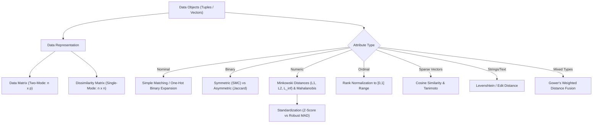
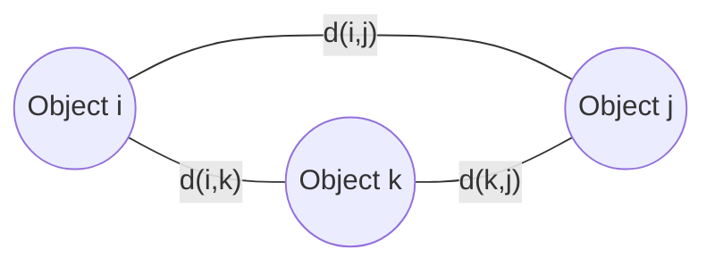
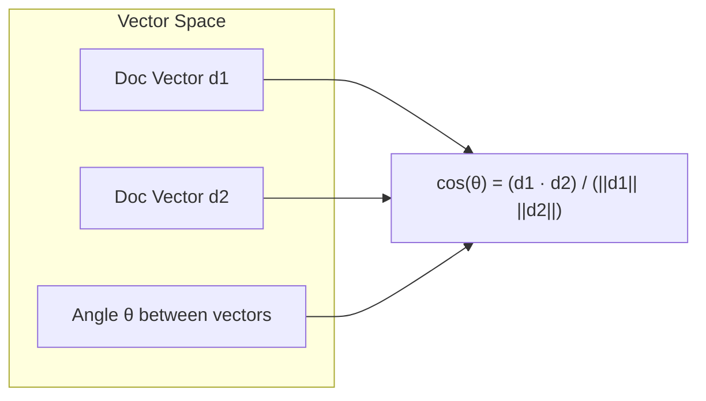

# Chapter 6 — Measuring Data Similarity and Dissimilarity

> **Course:** Data Analysis and Visualisation (3CS103ME24)  
> **Programme:** B.Tech (CSE), Integrated B.Tech (CSE)-MBA, B.Tech (Interdisciplinary Minor in Data Science)  
> **Primary Source:** `5.1_Similarity and Dissimilarity.pdf`  
> **Files Integrated:** `5.1_Similarity and Dissimilarity.pdf`, `ch5_1_text.txt`  

---

## 1. Chapter Overview

Proximity measurement—quantifying how similar or dissimilar two data objects are—forms the foundational mathematical pillar for almost all data mining tasks, including clustering ($k$-means, hierarchical, DBSCAN), classification ($k$-nearest neighbors), vector search, anomaly detection, and information retrieval. 

Real-world datasets rarely consist of uniform data types; they combine heterogeneous attributes: nominal categorical values, symmetric and asymmetric binary flags, continuous numeric features, ranked ordinal categories, and high-dimensional sparse text vectors. This chapter systematically covers mathematical data structures, similarity transformation functions, distance metric axioms, attribute-specific proximity calculations, robust standardization methods, mixed-type weighted dissimilarity fusion, and specialized vector/string metrics.



[Source: 5.1_Similarity and Dissimilarity.pdf, Slides 1-5]

---

## 2. Fundamental Data Structures

In data analysis, raw data and pairwise proximity relations are organized into two primary mathematical matrix structures.

### Data Matrix vs. Dissimilarity Matrix

| Characteristic | Data Matrix ($n \times p$) | Dissimilarity / Distance Matrix ($n \times n$) |
| :--- | :--- | :--- |
| **Dimensions** | $n$ rows (data objects) $\times$ $p$ columns (attributes/features) | $n$ rows $\times$ $n$ columns (pairwise dissimilarity values) |
| **Mode Type** | **Two-mode:** Rows and columns represent two distinct entity sets (objects vs. attributes). | **Single-mode:** Rows and columns represent identical entity sets (objects vs. objects). |
| **Entry Meaning** | $x_{if} \in \mathbb{R}$ (or category): Value of object $i$ for attribute $f$. | $d(i,j) \ge 0$: Pairwise dissimilarity between object $i$ and object $j$. |
| **Symmetry** | Rectangular ($n \neq p$ usually), asymmetric. | Square ($n \times n$), strictly symmetric ($d(i,j) = d(j,i)$) with zero diagonal ($d(i,i) = 0$). |
| **Storage Cost** | $O(n \cdot p)$ memory space. | $O(n^2)$ memory space (or $\frac{n(n-1)}{2}$ entries stored as lower triangular). |

#### Mathematical Structure of Data Matrix ($X$)

A data matrix $X$ represents $n$ data points in a $p$-dimensional feature space:

$$
X = \begin{bmatrix}
x_{11} & \cdots & x_{1f} & \cdots & x_{1p} \\
\vdots & \ddots & \vdots & \ddots & \vdots \\
x_{i1} & \cdots & x_{if} & \cdots & x_{ip} \\
\vdots & \ddots & \vdots & \ddots & \vdots \\
x_{n1} & \cdots & x_{nf} & \cdots & x_{np}
\end{bmatrix}
$$

#### Mathematical Structure of Dissimilarity Matrix ($D$)

A dissimilarity matrix $D$ stores pairwise distances between all pairs of objects. Because $d(i,j) = d(j,i)$ and $d(i,i) = 0$, it is stored as a lower triangular matrix:

$$
D = \begin{bmatrix}
0 & & & & \\
d(2,1) & 0 & & & \\
d(3,1) & d(3,2) & 0 & & \\
\vdots & \vdots & \vdots & \ddots & \\
d(n,1) & d(n,2) & \cdots & d(n,n-1) & 0
\end{bmatrix}
$$

> [!NOTE]
> **Triangular Indexing:** In high-performance computational libraries, the lower triangular entries of $D$ are stored sequentially in a 1D array of length $\frac{n(n-1)}{2}$. The index for pair $(i, j)$ with $i > j$ is given by $k = \frac{(i-1)(i-2)}{2} + j$.

[Source: 5.1_Similarity and Dissimilarity.pdf, Slide 5]

---

## 3. Definitions & Core Principles

### Definition: Similarity ($s(i,j)$)

* **Meaning:** A numerical measure of how alike two data objects $i$ and $j$ are.
* **Formal Definition:** A real-valued function $s(i,j)$ defined over pairs of objects such that higher values represent greater likeness.
* **Bounded Range:** Typically normalized to $s(i,j) \in [0, 1]$, where:
  * $s(i,j) = 1 \iff$ Object $i$ and Object $j$ are completely identical.
  * $s(i,j) = 0 \iff$ Object $i$ and Object $j$ share zero similarity.

### Definition: Dissimilarity / Distance ($d(i,j)$)

* **Meaning:** A numerical measure of how different two data objects $i$ and $j$ are.
* **Formal Definition:** A function $d(i,j) \ge 0$ that decreases as likeness increases.
* **Properties:**
  * $d(i,i) = 0$ (an object has zero dissimilarity with itself).
  * Lower values indicate higher similarity.

### Mathematical Transformations Between Similarity and Dissimilarity

When algorithms require a distance metric but only similarity values are available (or vice versa), monotonic transformation functions are applied:

1. **Linear Transformation (for $s \in [0, 1]$):**
   $$
   d(i,j) = 1 - s(i,j)
   $$
2. **Negative Exponential Transformation (for unbounded dissimilarity $d \in [0, \infty)$):**
   $$
   s(i,j) = e^{-\gamma d(i,j)} \quad (\text{where } \gamma > 0)
   $$
3. **Inverse Transformation:**
   $$
   d(i,j) = \frac{1 - s(i,j)}{s(i,j)} \quad \text{or} \quad s(i,j) = \frac{1}{1 + d(i,j)}
   $$
4. **Angular / Euclidean Normalized Transformation:**
   $$
   d(i,j) = \sqrt{2(1 - s(i,j))}
   $$

---

### Mathematical Axioms of a Metric Space

A dissimilarity function $d(i,j)$ qualifies as a formal **distance metric** (inducing a metric space $(\mathcal{X}, d)$) if and only if it strictly satisfies four mathematical axioms for all objects $i, j, k \in \mathcal{X}$:

| Axiom Name | Mathematical Statement | Physical / Geometric Meaning |
| :--- | :--- | :--- |
| **1. Non-negativity** | $d(i,j) \ge 0$ | Distance between two points can never be negative. |
| **2. Positive Definiteness** | $d(i,j) = 0 \iff i = j$ | Distance is zero if and only if the two objects are identical. |
| **3. Symmetry** | $d(i,j) = d(j,i)$ | Distance from $i$ to $j$ equals distance from $j$ to $i$. |
| **4. Triangle Inequality** | $d(i,j) \le d(i,k) + d(k,j)$ | The direct path between $i$ and $j$ is always shorter than or equal to a path routed through an intermediate point $k$. |



> [!WARNING]
> **Non-Metric Proximities:** Not all dissimilarity measures are metrics! 
> * **Asymmetric Distances:** Directed graph distances (e.g., one-way street distance $d(A, B) \neq d(B, A)$) break **Symmetry**.
> * **Cosine Distance ($1 - \cos(\theta)$):** Violates the **Triangle Inequality** (though Angular Distance $\frac{\theta}{\pi}$ satisfies it).
> * **Kullback-Leibler (KL) Divergence:** Violates both **Symmetry** and **Triangle Inequality**.

[Source: 5.1_Similarity and Dissimilarity.pdf, Slide 4, 11]

---

## 4. Proximity Measures for Nominal Attributes

A nominal attribute (categorical variable) takes $M \ge 2$ qualitative states with no inherent ordering (e.g., $\text{MaritalStatus} \in \{\text{Single, Married, Divorced, Widowed}\}$, $\text{Color} \in \{\text{Red, Green, Blue}\}$).

### Method 1: Simple Matching Ratio

#### Dissimilarity Formula

$$
d(i,j) = \frac{p - m}{p}
$$

#### Similarity Formula

$$
s(i,j) = 1 - d(i,j) = \frac{m}{p}
$$

Where:
* $m$ = Number of attributes where object $i$ and object $j$ share identical states ($x_{if} = x_{jf}$).
* $p$ = Total number of nominal attributes evaluated.

---

### Method 2: One-Hot / Dummy Binary Expansion

Alternatively, a nominal attribute $f$ with $M$ distinct states can be converted into $M$ asymmetric binary indicator variables: $b_1, b_2, \dots, b_M$.

$$\text{If } x_{if} = \text{State } k \implies b_{ik} = 1, \quad b_{im} = 0 \text{ for } m \neq k$$

Once expanded, binary dissimilarity measures (such as Jaccard or Simple Matching) are applied.

---

### Worked Numerical Example: Nominal Proximity & One-Hot Equivalence

#### Dataset (3 Employees across 3 Nominal Attributes: Department, Role, Location)

| Employee | Department ($f_1$) | Role ($f_2$) | Location ($f_3$) |
| :--- | :--- | :--- | :--- |
| **Alice ($i=1$)** | Sales | Manager | NYC |
| **Bob ($i=2$)** | Sales | Engineer | NYC |
| **Charlie ($i=3$)** | Engineering | Engineer | London |

#### Step-by-Step Calculation using Simple Matching ($p=3$)

1. **Pair (Alice, Bob):**
   * Department: Sales == Sales $\rightarrow$ Match ($m_1 = 1$)
   * Role: Manager $\neq$ Engineer $\rightarrow$ Mismatch
   * Location: NYC == NYC $\rightarrow$ Match ($m_2 = 2$)
   * $m = 2, p = 3 \implies d(\text{Alice}, \text{Bob}) = \frac{3 - 2}{3} = \frac{1}{3} \approx 0.333$
   * $s(\text{Alice}, \text{Bob}) = \frac{2}{3} \approx 0.667$

2. **Pair (Alice, Charlie):**
   * Department: Sales $\neq$ Engineering
   * Role: Manager $\neq$ Engineer
   * Location: NYC $\neq$ London
   * $m = 0, p = 3 \implies d(\text{Alice}, \text{Charlie}) = \frac{3 - 0}{3} = 1.000$

3. **Pair (Bob, Charlie):**
   * Department: Sales $\neq$ Engineering
   * Role: Engineer == Engineer $\rightarrow$ Match ($m = 1$)
   * Location: NYC $\neq$ London
   * $m = 1, p = 3 \implies d(\text{Bob}, \text{Charlie}) = \frac{3 - 1}{3} = \frac{2}{3} \approx 0.667$

#### Resulting Dissimilarity Matrix ($D_{\text{Nominal}}$)

$$
D = \begin{bmatrix}
0 & & \\
0.333 & 0 & \\
1.000 & 0.667 & 0
\end{bmatrix}
$$

[Source: 5.1_Similarity and Dissimilarity.pdf, Slide 6]

---

## 5. Proximity Measures for Binary Attributes

Binary attributes have only two states: $0$ and $1$ (e.g., True/False, Yes/No, Present/Absent). 

### $2 \times 2$ Contingency Table for Binary Pairs

To compare object $i$ and object $j$ across $p$ binary attributes, construct a $2 \times 2$ contingency table:

| | Object $j = 1$ | Object $j = 0$ | Row Total |
| :--- | :---: | :---: | :---: |
| **Object $i = 1$** | $q$ (Positive Match: $1-1$) | $r$ (Mismatch: $1-0$) | $q + r$ |
| **Object $i = 0$** | $s$ (Mismatch: $0-1$) | $t$ (Negative Match: $0-0$) | $s + t$ |
| **Column Total** | $q + s$ | $r + t$ | $p = q + r + s + t$ |

* $q = \sum \mathbb{I}(x_{if}=1 \land x_{jf}=1)$: Both objects carry state $1$.
* $r = \sum \mathbb{I}(x_{if}=1 \land x_{jf}=0)$: Object $i$ is $1$, Object $j$ is $0$.
* $s = \sum \mathbb{I}(x_{if}=0 \land x_{jf}=1)$: Object $i$ is $0$, Object $j$ is $1$.
* $t = \sum \mathbb{I}(x_{if}=0 \land x_{jf}=0)$: Both objects carry state $0$.
* $p = q + r + s + t$: Total number of binary features.

---

### Symmetric Binary Variables

**Definition:** Both states ($0$ and $1$) carry equal importance and semantic weight (e.g., $\text{Gender} \in \{\text{Male, Female}\}$, $\text{Attribute: IsVoter} \in \{0, 1\}$). Matching on $0-0$ ($t$) is as meaningful as matching on $1-1$ ($q$).

#### Simple Matching Coefficient (SMC) & Dissimilarity

$$
d_{\text{Symmetric}}(i,j) = \frac{r + s}{q + r + s + t}
$$

$$
\text{SMC}(i,j) = 1 - d(i,j) = \frac{q + t}{q + r + s + t}
$$

---

### Asymmetric Binary Variables

**Definition:** The positive state ($1$) is rare and carries high semantic significance, whereas the negative state ($0$) is non-informative (e.g., patient diagnostic tests, rare disease symptoms, ecommerce item purchases).

> [!IMPORTANT]
> **Why discard $t$ (0-0 matches)?**  
> Consider two patients evaluated for 1,000 rare genetic diseases. Neither patient has 995 of those diseases ($t = 995$). If $t$ were included, SMC would report that the patients are $99.5\%$ identical ($\frac{q+995}{1000}$), even if they share zero actual diseases! Asymmetric binary measures ignore $t$ to prevent uninformative negative co-occurrences from distorting similarity.

#### Asymmetric Binary Distance & Jaccard Coefficient

$$
d_{\text{Asymmetric}}(i,j) = \frac{r + s}{q + r + s}
$$

$$
\text{Jaccard Similarity } s_{\text{Jaccard}}(i,j) = \frac{q}{q + r + s} = 1 - d_{\text{Asymmetric}}(i,j)
$$

---

### Comparison Matrix of Binary Similarity Coefficients

| Coefficient | Formula | Negative Match Handling | Common Domain |
| :--- | :--- | :--- | :--- |
| **Simple Matching (SMC)** | $\frac{q + t}{q + r + s + t}$ | Included ($+t$) | Symmetric demographics, general survey data |
| **Jaccard Coefficient** | $\frac{q}{q + r + s}$ | Excluded ($0$ weight) | Text mining, market basket analysis, medical diagnosis |
| **Dice Coefficient** | $\frac{2q}{2q + r + s}$ | Excluded, double weight on $q$ | Image segmentation overlap (IoU/Dice), NLP |
| **Tanimoto Coefficient** | $\frac{q}{q + r + s}$ | Excluded | Chemical informatics, molecular fingerprinting |

[Source: 5.1_Similarity and Dissimilarity.pdf, Slide 7]

---

### Comprehensive Worked Numerical Example: Patient Diagnostic Data

#### Medical Patient Dataset (1 Symmetric: Gender; 6 Asymmetric Binary Features: Symptoms & Tests)

* $Y (\text{Yes}) / P (\text{Positive}) \rightarrow 1$
* $N (\text{No}) / N (\text{Negative}) \rightarrow 0$

| Patient | Gender | Fever ($f_1$) | Cough ($f_2$) | Test-1 ($f_3$) | Test-2 ($f_4$) | Test-3 ($f_5$) | Test-4 ($f_6$) |
| :--- | :---: | :---: | :---: | :---: | :---: | :---: | :---: |
| **Jack ($i=1$)** | M | Y (1) | N (0) | P (1) | N (0) | N (0) | N (0) |
| **Mary ($i=2$)** | F | Y (1) | N (0) | P (1) | N (0) | P (1) | N (0) |
| **Jim ($i=3$)** | M | Y (1) | P (1) | N (0) | N (0) | N (0) | N (0) |

Calculate all pairwise asymmetric dissimilarity values using the 6 asymmetric attributes ($p=6$).

#### Pairwise Contingency Tables

##### 1. Jack vs. Mary
* $f_1$ (Fever): $1-1 \rightarrow q$
* $f_2$ (Cough): $0-0 \rightarrow t$
* $f_3$ (Test-1): $1-1 \rightarrow q$
* $f_4$ (Test-2): $0-0 \rightarrow t$
* $f_5$ (Test-3): Jack $0$, Mary $1 \rightarrow s$
* $f_6$ (Test-4): $0-0 \rightarrow t$

$$\mathbf{\text{Summary: }} q = 2, \, r = 0, \, s = 1, \, t = 3 \quad (p = 2+0+1+3 = 6)$$

$$d(\text{Jack}, \text{Mary}) = \frac{r + s}{q + r + s} = \frac{0 + 1}{2 + 0 + 1} = \frac{1}{3} \approx 0.333$$

$$s_{\text{Jaccard}}(\text{Jack}, \text{Mary}) = \frac{q}{q + r + s} = \frac{2}{3} \approx 0.667$$

##### 2. Jack vs. Jim
* $f_1$ (Fever): $1-1 \rightarrow q$
* $f_2$ (Cough): Jack $0$, Jim $1 \rightarrow s$
* $f_3$ (Test-1): Jack $1$, Jim $0 \rightarrow r$
* $f_4, f_5, f_6$: All $0-0 \rightarrow t=3$

$$\mathbf{\text{Summary: }} q = 1, \, r = 1, \, s = 1, \, t = 3$$

$$d(\text{Jack}, \text{Jim}) = \frac{r + s}{q + r + s} = \frac{1 + 1}{1 + 1 + 1} = \frac{2}{3} \approx 0.667$$

$$s_{\text{Jaccard}}(\text{Jack}, \text{Jim}) = \frac{1}{3} \approx 0.333$$

##### 3. Mary vs. Jim
* $f_1$ (Fever): $1-1 \rightarrow q$
* $f_2$ (Cough): Mary $0$, Jim $1 \rightarrow s$
* $f_3$ (Test-1): Mary $1$, Jim $0 \rightarrow r$
* $f_4$ (Test-2): $0-0 \rightarrow t$
* $f_5$ (Test-3): Mary $1$, Jim $0 \rightarrow r$
* $f_6$ (Test-4): $0-0 \rightarrow t$

$$\mathbf{\text{Summary: }} q = 1, \, r = 2, \, s = 1, \, t = 2$$

$$d(\text{Mary}, \text{Jim}) = \frac{r + s}{q + r + s} = \frac{2 + 1}{1 + 2 + 1} = \frac{3}{4} = 0.750$$

$$s_{\text{Jaccard}}(\text{Mary}, \text{Jim}) = \frac{1}{4} = 0.250$$

#### Final Asymmetric Dissimilarity Matrix ($D_{\text{Binary}}$)

$$
D = \begin{bmatrix}
0 & & \\
0.333 & 0 & \\
0.667 & 0.750 & 0
\end{bmatrix}
$$

**Interpretation:** Jack and Mary are the most similar patients ($d=0.333$), sharing two positive symptoms/tests. Mary and Jim are the most distant ($d=0.750$).

[Source: 5.1_Similarity and Dissimilarity.pdf, Slide 8]

---

## 6. Standardizing Numeric Data

In continuous numeric attributes, features measured on larger scales (e.g., Annual Income in USD: $\$10,000 - \$500,000$) artificially dominate distance calculations over features on smaller scales (e.g., Age in years: $18 - 80$). Standardization rescales features to prevent scale bias.

### Scale Distortion Problem

Consider two features: $\text{Age} \in [20, 60]$ and $\text{Income} \in [20000, 100000]$.
A difference of $10$ years in Age contributes $|20 - 30|^2 = 100$ to Euclidean distance.
A difference of $\$1,000$ in Income contributes $|20000 - 21000|^2 = 1,000,000$.
Without standardization, Income completely dominates the distance metric by a factor of $10,000\times$, rendering Age completely irrelevant!

---

### Method 1: Z-Score Standardization (Standard Deviation Based)

Z-score standardization transforms data to have a mean of $\mu = 0$ and standard deviation of $\sigma = 1$:

$$
z_{if} = \frac{x_{if} - \mu_f}{\sigma_f}
$$

Where:
* Mean of feature $f$: $\mu_f = \frac{1}{n} \sum_{i=1}^n x_{if}$
* Standard deviation of feature $f$: $\sigma_f = \sqrt{\frac{1}{n} \sum_{i=1}^n (x_{if} - \mu_f)^2}$

---

### Method 2: Robust Standardization using Mean Absolute Deviation (MAD)

Standard deviation $\sigma_f$ squares deviations $(x_{if} - \mu_f)^2$, making it exceptionally sensitive to extreme outliers. A single massive outlier inflates $\sigma_f$, crushing the normalized variance of all non-outlier data points.

The **Mean Absolute Deviation ($s_f$)** provides a robust measure of dispersion:

#### Step 1: Compute Feature Mean
$$
m_f = \frac{1}{n} \sum_{i=1}^n x_{if}
$$

#### Step 2: Compute Mean Absolute Deviation ($s_f$)
$$
s_f = \frac{1}{n} \sum_{i=1}^n |x_{if} - m_f|
$$

#### Step 3: Compute Robust Standardized Z-Score
$$
z_{if} = \frac{x_{if} - m_f}{s_f}
$$

---

### Comparative Worked Example: Sensitivity to Outliers ($\sigma$ vs MAD)

#### Dataset ($x = [10, 12, 14, 15, 100]$ — where $100$ is an extreme outlier)

```
Raw Data Points:
10 ----- 12 -- 14 - 15 ---------------------------------------------------- 100 (Outlier)
```

##### 1. Standard Deviation Approach ($\sigma$):
* Mean $\mu = \frac{10 + 12 + 14 + 15 + 100}{5} = \frac{151}{5} = 30.2$
* Squared Deviations:
  * $(10 - 30.2)^2 = 408.04$
  * $(12 - 30.2)^2 = 331.24$
  * $(14 - 30.2)^2 = 262.44$
  * $(15 - 30.2)^2 = 231.04$
  * $(100 - 30.2)^2 = 4872.04$
* Variance $\sigma^2 = \frac{408.04 + 331.24 + 262.44 + 231.04 + 4872.04}{5} = \frac{6104.8}{5} = 1220.96$
* Standard Deviation $\sigma = \sqrt{1220.96} \approx \mathbf{34.94}$

* **Distance between $x_1=10$ and $x_2=12$ after Z-score:**
  $$z_1 = \frac{10 - 30.2}{34.94} = -0.578, \quad z_2 = \frac{12 - 30.2}{34.94} = -0.521 \implies |z_1 - z_2| = \mathbf{0.057}$$
  *(The distance between 10 and 12 is crushed to near zero because $\sigma=34.94$ was inflated by the outlier 100!)*

##### 2. Mean Absolute Deviation Approach (MAD $s_f$):
* Mean $m_f = 30.2$
* Absolute Deviations:
  * $|10 - 30.2| = 20.2$
  * $|12 - 30.2| = 18.2$
  * $|14 - 30.2| = 16.2$
  * $|15 - 30.2| = 15.2$
  * $|100 - 30.2| = 69.8$
* MAD $s_f = \frac{20.2 + 18.2 + 16.2 + 15.2 + 69.8}{5} = \frac{139.6}{5} = \mathbf{27.92}$

* **Distance between $x_1=10$ and $x_2=12$ after Robust MAD:**
  $$z_1 = \frac{10 - 30.2}{27.92} = -0.723, \quad z_2 = \frac{12 - 30.2}{27.92} = -0.652 \implies |z_1 - z_2| = \mathbf{0.071}$$

> [!TIP]
> **Key Takeaway:** MAD $s_f$ is significantly less affected by extreme values than standard deviation $\sigma$, preserving meaningful dissimilarity among the normal data points.

[Source: 5.1_Similarity and Dissimilarity.pdf, Slide 9]

---

## 7. Distance on Numeric Data: Minkowski Distance

### Formula: Minkowski Distance ($L_h$ Norm)

The Minkowski distance is a generalized vector distance metric defined over $p$-dimensional real numeric space $\mathbb{R}^p$:

$$
d(i,j) = \left( \sum_{f=1}^p |x_{if} - x_{jf}|^h \right)^{\frac{1}{h}}
$$

Where:
* $i = (x_{i1}, x_{i2}, \dots, x_{ip})$ and $j = (x_{j1}, x_{j2}, \dots, x_{jp})$ are two numeric objects.
* $h \ge 1$ is the order parameter (norm order).

---

### Special Cases of Minkowski Distance

[Click here to open distance_visualizer.html if the visualizer below does not load](distance_visualizer.html)

<iframe src="./distance_visualizer.html" width="100%" height="700px" style="border:none; border-radius:12px; margin-bottom: 24px; background: white;"></iframe>


#### 1. Manhattan Distance ($h = 1$, $L_1$ Norm, City-Block / Taxicab Distance)

Sum of absolute coordinate differences across all dimensions:

$$
d_{L_1}(i,j) = \sum_{f=1}^p |x_{if} - x_{jf}| = |x_{i1} - x_{j1}| + |x_{i2} - x_{j2}| + \dots + |x_{ip} - x_{jp}|
$$

> [!NOTE]
> **Hamming Distance Equivalence:** For binary vectors, Manhattan distance exactly equals the **Hamming Distance** (the count of bit positions where two vectors differ).

#### 2. Euclidean Distance ($h = 2$, $L_2$ Norm)

Straight-line geometric distance in Euclidean space:

$$
d_{L_2}(i,j) = \sqrt{\sum_{f=1}^p (x_{if} - x_{jf})^2} = \sqrt{(x_{i1} - x_{j1})^2 + (x_{i2} - x_{j2})^2 + \dots + (x_{ip} - x_{jp})^2}
$$

#### 3. Supremum Distance ($h \to \infty$, $L_{\infty}$ Norm, Chebyshev / Chessboard Distance)

Maximum single-attribute difference across all $p$ dimensions:

$$
d_{L_\infty}(i,j) = \lim_{h \to \infty} \left( \sum_{f=1}^p |x_{if} - x_{jf}|^h \right)^{\frac{1}{h}} = \max_{f=1}^p |x_{if} - x_{jf}|
$$

---

### Geometric Unit Circles (Iso-Distance Contours)

The choice of parameter $h$ dramatically changes the shape of equal-distance contours around a point in 2D space:

* **$h = 1$ ($L_1$ Manhattan):** Diamond shape (rotated square with vertices on coordinate axes).
* **$h = 2$ ($L_2$ Euclidean):** Perfect circle (smooth rotational invariance).
* **$h \to \infty$ ($L_\infty$ Supremum):** Axis-aligned square box.

```
       L1 (Manhattan)              L2 (Euclidean)             L_inf (Supremum)
          (0,1)                       (0,1)                      (-1,1)---(1,1)
          /   \                         .                          |        |
         /     \                     .     .                       |        |
   (-1,0)   *   (1,0)          (-1,0)   *   (1,0)                (-1,0)  *  (1,0)
         \     /                     .     .                       |        |
          \   /                         .                          |        |
         (0,-1)                      (0,-1)                     (-1,-1)--(1,-1)
```

---

### Proof Trace: Verification of Metric Axioms for Minkowski Distance ($h \ge 1$)

1. **Non-negativity ($d(i,j) \ge 0$):**
   Absolute value $|x_{if} - x_{jf}| \ge 0$ for all $f$. Sum of non-negative terms is non-negative. $h$-th root of a non-negative number is non-negative. $\therefore d(i,j) \ge 0$.

2. **Positive Definiteness ($d(i,j) = 0 \iff i = j$):**
   $d(i,j) = 0 \iff \sum_{f=1}^p |x_{if} - x_{jf}|^h = 0 \iff |x_{if} - x_{jf}| = 0$ for all $f \iff x_{if} = x_{jf}$ for all $f \iff i = j$.

3. **Symmetry ($d(i,j) = d(j,i)$):**
   $|x_{if} - x_{jf}| = |-(x_{jf} - x_{if})| = |x_{jf} - x_{if}|$. Taking $h$-th powers and $h$-th roots preserves equality. $\therefore d(i,j) = d(j,i)$.

4. **Triangle Inequality ($d(i,j) \le d(i,k) + d(k,j)$):**
   Direct consequence of **Minkowski's Inequality** in linear algebra:
   $$\|\mathbf{a} + \mathbf{b}\|_h \le \|\mathbf{a}\|_h + \|\mathbf{b}\|_h \quad \text{for } h \ge 1$$
   Setting $\mathbf{a} = i - k$ and $\mathbf{b} = k - j$ yields $(i - j) = (i - k) + (k - j)$, proving $d(i,j) \le d(i,k) + d(k,j)$. $\blacksquare$

[Source: 5.1_Similarity and Dissimilarity.pdf, Slide 11, 12]

---

### Step-by-Step Worked Example: Numeric Dissimilarity Matrices ($L_1, L_2, L_{\infty}$)

#### Given Data Matrix ($4$ objects, $2$ attributes)

| Point | Attribute 1 ($x_1$) | Attribute 2 ($x_2$) |
| :--- | :---: | :---: |
| **$x_1$** | $1$ | $2$ |
| **$x_2$** | $3$ | $5$ |
| **$x_3$** | $2$ | $0$ |
| **$x_4$** | $4$ | $5$ |

#### 1. Manhattan Distance Calculations ($L_1$)

* $d(x_2, x_1) = |3 - 1| + |5 - 2| = 2 + 3 = 5$
* $d(x_3, x_1) = |2 - 1| + |0 - 2| = 1 + 2 = 3$
* $d(x_3, x_2) = |2 - 3| + |0 - 5| = 1 + 5 = 6$
* $d(x_4, x_1) = |4 - 1| + |5 - 2| = 3 + 3 = 6$
* $d(x_4, x_2) = |4 - 3| + |5 - 5| = 1 + 0 = 1$
* $d(x_4, x_3) = |4 - 2| + |5 - 0| = 2 + 5 = 7$

$$
D_{L_1} = \begin{bmatrix}
0 & & & \\
5 & 0 & & \\
3 & 6 & 0 & \\
6 & 1 & 7 & 0
\end{bmatrix}
$$

#### 2. Euclidean Distance Calculations ($L_2$)

* $d(x_2, x_1) = \sqrt{(3-1)^2 + (5-2)^2} = \sqrt{4 + 9} = \sqrt{13} \approx 3.61$
* $d(x_3, x_1) = \sqrt{(2-1)^2 + (0-2)^2} = \sqrt{1 + 4} = \sqrt{5} \approx 2.24$
* $d(x_3, x_2) = \sqrt{(2-3)^2 + (0-5)^2} = \sqrt{1 + 25} = \sqrt{26} \approx 5.10$
* $d(x_4, x_1) = \sqrt{(4-1)^2 + (5-2)^2} = \sqrt{9 + 9} = \sqrt{18} \approx 4.24$
* $d(x_4, x_2) = \sqrt{(4-3)^2 + (5-5)^2} = \sqrt{1 + 0} = 1.00$
* $d(x_4, x_3) = \sqrt{(4-2)^2 + (5-0)^2} = \sqrt{4 + 25} = \sqrt{29} \approx 5.39$

$$
D_{L_2} = \begin{bmatrix}
0 & & & \\
3.61 & 0 & & \\
2.24 & 5.10 & 0 & \\
4.24 & 1.00 & 5.39 & 0
\end{bmatrix}
$$

#### 3. Supremum Distance Calculations ($L_{\infty}$)

* $d(x_2, x_1) = \max(|3 - 1|, |5 - 2|) = \max(2, 3) = 3$
* $d(x_3, x_1) = \max(|2 - 1|, |0 - 2|) = \max(1, 2) = 2$
* $d(x_3, x_2) = \max(|2 - 3|, |0 - 5|) = \max(1, 5) = 5$
* $d(x_4, x_1) = \max(|4 - 1|, |5 - 2|) = \max(3, 3) = 3$
* $d(x_4, x_2) = \max(|4 - 3|, |5 - 5|) = \max(1, 0) = 1$
* $d(x_4, x_3) = \max(|4 - 2|, |5 - 0|) = \max(2, 5) = 5$

$$
D_{L_{\infty}} = \begin{bmatrix}
0 & & & \\
3 & 0 & & \\
2 & 5 & 0 & \\
3 & 1 & 5 & 0
\end{bmatrix}
$$

[Source: 5.1_Similarity and Dissimilarity.pdf, Slides 10, 13]

---

## 8. Proximity Measures for Ordinal Variables

An ordinal variable possesses qualitative categories with a meaningful sequence or rank order (e.g., $\text{AcademicRank} \in \{\text{Freshman, Sophomore, Junior, Senior}\}$, $\text{CustomerSatisfaction} \in \{\text{Poor, Fair, Good, Excellent}\}$).

### Procedure: Converting Ordinal to Normalized Numeric

To compute dissimilarity between ordinal values, map qualitative ranks onto the normalized numeric interval $[0, 1]$:


#### Step 1: Assign Ranks
Replace state value $x_{if}$ with its corresponding integer rank order:

$$
r_{if} \in \{1, 2, \dots, M_f\}
$$

Where $M_f$ is the total number of ordered categories for attribute $f$.

#### Step 2: Normalize Ranks to $[0, 1]$
Map ranks onto $[0, 1]$ to equalize attribute weights:

$$
z_{if} = \frac{r_{if} - 1}{M_f - 1}
$$

* Lowest category ($r_{if} = 1 \implies z_{if} = \frac{1 - 1}{M_f - 1} = 0.0$)
* Highest category ($r_{if} = M_f \implies z_{if} = \frac{M_f - 1}{M_f - 1} = 1.0$)

#### Step 3: Apply Numeric Distance Formula
Treat normalized $z_{if}$ as an interval-scaled continuous feature and compute dissimilarity using Manhattan or Euclidean distance:

$$
d_{ij}^{(f)} = |z_{if} - z_{jf}|
$$

---

### Handling Tied Ranks

When multiple data points share equal preference/category, assign the **average (mid) rank** of the tied positions before applying the normalization formula.

#### Worked Example: Tied Rank Normalization

Given 5 students ranked by education level: `[HighSchool, Bachelors, Bachelors, Masters, PhD]`.
* Categories ($M_f = 4$ states): HighSchool (1), Bachelors (2), Masters (3), PhD (4).
* Rank assignments:
  * Student 1 (HighSchool): Rank $1 \implies z_1 = \frac{1 - 1}{4 - 1} = 0.0$
  * Student 2 & 3 (Bachelors): Share positions $2$ and $3$. Mid-rank = $\frac{2 + 3}{2} = 2.5$.
    $$z_2 = z_3 = \frac{2.5 - 1}{4 - 1} = \frac{1.5}{3} = 0.50$$
  * Student 4 (Masters): Rank $3 \implies \text{Position } 4 \implies r_4 = 4$? No, with 5 items position is $4 \implies z_4 = \frac{3 - 1}{4 - 1} = 0.667$.
  * Student 5 (PhD): Rank $4 \implies z_5 = \frac{4 - 1}{4 - 1} = 1.00$.

[Source: 5.1_Similarity and Dissimilarity.pdf, Slide 14]

---

## 9. Proximity for Attributes of Mixed Types

Real-world databases store records containing heterogeneous attribute types simultaneously. **Gower's Weighted Similarity/Dissimilarity Formula** unifies these distinct attribute types into a single normalized dissimilarity matrix $D \in [0, 1]$.

### Generalized Gower Formula

$$
d(i,j) = \frac{\sum_{f=1}^p \delta_{ij}^{(f)} d_{ij}^{(f)}}{\sum_{f=1}^p \delta_{ij}^{(f)}}
$$

---

### Indicator Variable $\delta_{ij}^{(f)}$ (Validity Flag)

The indicator $\delta_{ij}^{(f)}$ controls whether attribute $f$ contributes to the pairwise comparison of objects $i$ and $j$:

* $\delta_{ij}^{(f)} = 0$ if:
  1. Attribute value $x_{if}$ or $x_{jf}$ is missing / null.
  2. Attribute $f$ is **asymmetric binary** and $x_{if} = x_{jf} = 0$ (negative match).
* $\delta_{ij}^{(f)} = 1$ for all other valid comparisons.

---

### Feature-Specific Dissimilarity $d_{ij}^{(f)}$ Rules

| Attribute Type $f$ | Computation of $d_{ij}^{(f)}$ | Explanation |
| :--- | :--- | :--- |
| **Nominal / Binary** | $d_{ij}^{(f)} = \begin{cases} 0 & \text{if } x_{if} = x_{jf} \\ 1 & \text{if } x_{if} \neq x_{jf} \end{cases}$ | Exact match has distance 0, mismatch has distance 1. |
| **Numeric (Interval-Scaled)** | $d_{ij}^{(f)} = \frac{\|x_{if} - x_{jf}\|}{\max_h(x_{hf}) - \min_h(x_{hf})}$ | Absolute difference divided by feature range ($R_f = \max - \min$). |
| **Ordinal** | $d_{ij}^{(f)} = \|z_{if} - z_{jf}\|$ | Difference between normalized rank scores $z_{if} = \frac{r_{if} - 1}{M_f - 1}$. |

[Source: 5.1_Similarity and Dissimilarity.pdf, Slide 15]

---

### Detailed Comprehensive Worked Example: Mixed-Type Gower Distance

#### Customer Dataset (3 Customers, 5 Heterogeneous Attributes)

1. `City` (Nominal): NYC, LA, Chicago
2. `Smoker` (Symmetric Binary): 1=Yes, 0=No
3. `Diabetic` (Asymmetric Binary): 1=Yes, 0=No
4. `Income` (Numeric): $\$30k - \$110k$
5. `LoyaltyTier` (Ordinal: Bronze, Silver, Gold, Platinum — $M_5 = 4$ states)

| Customer | City ($f_1$) | Smoker ($f_2$) | Diabetic ($f_3$) | Income ($f_4$) | LoyaltyTier ($f_5$) |
| :--- | :---: | :---: | :---: | :---: | :---: |
| **Cust 1 ($i=1$)** | NYC | 1 | 1 | $\$30,000$ | Bronze (Rank 1) |
| **Cust 2 ($i=2$)** | LA | 1 | 0 | $\$70,000$ | Gold (Rank 3) |
| **Cust 3 ($i=3$)** | NYC | 0 | 0 | $\$110,000$ | Platinum (Rank 4) |

#### Step 1: Pre-compute Ranges & Normalizations

* **Numeric Range for Income ($f_4$):**
  $$\text{Range}_4 = \max(\text{Income}) - \min(\text{Income}) = 110,000 - 30,000 = 80,000$$

* **Ordinal Normalization for LoyaltyTier ($f_5$, $M_5=4$):**
  * Cust 1 (Bronze, $r=1$): $z_{1,5} = \frac{1-1}{4-1} = 0.000$
  * Cust 2 (Gold, $r=3$): $z_{2,5} = \frac{3-1}{4-1} = \frac{2}{3} \approx 0.667$
  * Cust 3 (Platinum, $r=4$): $z_{3,5} = \frac{4-1}{4-1} = 1.000$

---

#### Step 2: Compute Pairwise Feature Dissimilarities & Indicator Flags

##### Pair (Cust 1, Cust 2):
* $f_1$ (Nominal: NYC vs LA): $x_{11} \neq x_{21} \implies d_{12}^{(1)} = 1, \, \delta_{12}^{(1)} = 1$
* $f_2$ (Symmetric Binary: 1 vs 1): Match $\implies d_{12}^{(2)} = 0, \, \delta_{12}^{(2)} = 1$
* $f_3$ (Asymmetric Binary: 1 vs 0): Mismatch $\implies d_{12}^{(3)} = 1, \, \delta_{12}^{(3)} = 1$
* $f_4$ (Numeric: $30k$ vs $70k$): $d_{12}^{(4)} = \frac{|30000 - 70000|}{80000} = \frac{40000}{80000} = 0.500, \, \delta_{12}^{(4)} = 1$
* $f_5$ (Ordinal: $0.000$ vs $0.667$): $d_{12}^{(5)} = |0.000 - 0.667| = 0.667, \, \delta_{12}^{(5)} = 1$

$$\text{Sum of Weights } \sum \delta = 1 + 1 + 1 + 1 + 1 = 5$$

$$d(1,2) = \frac{1(1) + 1(0) + 1(1) + 1(0.500) + 1(0.667)}{5} = \frac{3.167}{5} = \mathbf{0.633}$$

##### Pair (Cust 2, Cust 3):
* $f_1$ (Nominal: LA vs NYC): Mismatch $\implies d_{23}^{(1)} = 1, \, \delta_{23}^{(1)} = 1$
* $f_2$ (Symmetric Binary: 1 vs 0): Mismatch $\implies d_{23}^{(2)} = 1, \, \delta_{23}^{(2)} = 1$
* $f_3$ (Asymmetric Binary: 0 vs 0): **Negative-Negative Match!** $\implies d_{23}^{(3)} = 0, \, \mathbf{\delta_{23}^{(3)} = 0}$ *(Excluded!)*
* $f_4$ (Numeric: $70k$ vs $110k$): $d_{23}^{(4)} = \frac{|70000 - 110000|}{80000} = \frac{40000}{80000} = 0.500, \, \delta_{23}^{(4)} = 1$
* $f_5$ (Ordinal: $0.667$ vs $1.000$): $d_{23}^{(5)} = |0.667 - 1.000| = 0.333, \, \delta_{23}^{(5)} = 1$

$$\text{Sum of Weights } \sum \delta = 1 + 1 + \mathbf{0} + 1 + 1 = 4$$

$$d(2,3) = \frac{1(1) + 1(1) + 0(0) + 1(0.500) + 1(0.333)}{4} = \frac{2.833}{4} = \mathbf{0.708}$$

##### Pair (Cust 1, Cust 3):
* $f_1$ (Nominal: NYC vs NYC): Match $\implies d_{13}^{(1)} = 0, \, \delta_{13}^{(1)} = 1$
* $f_2$ (Symmetric Binary: 1 vs 0): Mismatch $\implies d_{13}^{(2)} = 1, \, \delta_{13}^{(2)} = 1$
* $f_3$ (Asymmetric Binary: 1 vs 0): Mismatch $\implies d_{13}^{(3)} = 1, \, \delta_{13}^{(3)} = 1$
* $f_4$ (Numeric: $30k$ vs $110k$): $d_{13}^{(4)} = \frac{|30000 - 110000|}{80000} = \frac{80000}{80000} = 1.000, \, \delta_{13}^{(4)} = 1$
* $f_5$ (Ordinal: $0.000$ vs $1.000$): $d_{13}^{(5)} = |0.000 - 1.000| = 1.000, \, \delta_{13}^{(5)} = 1$

$$\text{Sum of Weights } \sum \delta = 1 + 1 + 1 + 1 + 1 = 5$$

$$d(1,3) = \frac{1(0) + 1(1) + 1(1) + 1(1.000) + 1(1.000)}{5} = \frac{4.000}{5} = \mathbf{0.800}$$

#### Final Gower Composite Dissimilarity Matrix ($D_{\text{Gower}}$)

$$
D = \begin{bmatrix}
0 & & \\
0.633 & 0 & \\
0.800 & 0.708 & 0
\end{bmatrix}
$$

---

## 10. Cosine Similarity for Document and Vector Data

Text documents, term-frequency TF-IDF vectors, genome sequence arrays, and customer rating matrices are extremely high-dimensional and sparse (containing mostly zeros). 

Standard Euclidean distance fails on sparse text data because document length inflates distance, making a long document and a short document covering the exact same subject appear mathematically distant. **Cosine Similarity** overcomes this by evaluating the angle between vectors rather than vector magnitude.



---

### Formula: Cosine Similarity

$$
\cos(\mathbf{d}_1, \mathbf{d}_2) = \frac{\mathbf{d}_1 \cdot \mathbf{d}_2}{\|\mathbf{d}_1\| \|\mathbf{d}_2\|} = \frac{\sum_{k=1}^p d_{1k} d_{2k}}{\sqrt{\sum_{k=1}^p d_{1k}^2} \sqrt{\sum_{k=1}^p d_{2k}^2}}
$$

Where:
* $\mathbf{d}_1 \cdot \mathbf{d}_2 = \sum d_{1k} d_{2k}$ is the vector dot product.
* $\|\mathbf{d}_1\| = \sqrt{\sum d_{1k}^2}$ is the Euclidean length ($L_2$ norm) of vector $\mathbf{d}_1$.

---

### Mathematical Properties & Bounds

* **Range:** $[-1, 1]$ in general real vector space. For term frequencies ($d_{ik} \ge 0$), range is strictly $[0, 1]$.
* $\cos(\theta) = 1 \iff \theta = 0^\circ$ (Vectors point in identical directions; identical term distribution).
* $\cos(\theta) = 0 \iff \theta = 90^\circ$ (Vectors are orthogonal; zero overlapping terms).

---

### Proof: Mathematical Connection Between Cosine Similarity & Normalized Euclidean Distance

For any two unit-length vectors $\mathbf{u} = \frac{\mathbf{d}_1}{\|\mathbf{d}_1\|}$ and $\mathbf{v} = \frac{\mathbf{d}_2}{\|\mathbf{d}_2\|}$ (where $\|\mathbf{u}\| = \|\mathbf{v}\| = 1$):

$$\begin{aligned}
d_{L_2}^2(\mathbf{u}, \mathbf{v}) &= \|\mathbf{u} - \mathbf{v}\|^2 = (\mathbf{u} - \mathbf{v}) \cdot (\mathbf{u} - \mathbf{v}) \\
&= \|\mathbf{u}\|^2 + \|\mathbf{v}\|^2 - 2(\mathbf{u} \cdot \mathbf{v}) \\
&= 1 + 1 - 2\cos(\mathbf{d}_1, \mathbf{d}_2) \\
&= 2(1 - \cos(\mathbf{d}_1, \mathbf{d}_2))
\end{aligned}$$

$$\therefore d_{L_2}(\mathbf{u}, \mathbf{v}) = \sqrt{2(1 - \cos(\mathbf{d}_1, \mathbf{d}_2))}$$

> [!TIP]
> **Key Insight:** Minimizing Euclidean distance between normalized vectors is mathematically identical to maximizing Cosine similarity!

---

### Worked Numerical Example 1: Standard Cosine Calculation

#### Document Term Vectors ($\mathbf{d}_1, \mathbf{d}_2$) across 10 Vocabulary Terms

* $\mathbf{d}_1 = (5, 0, 3, 0, 2, 0, 0, 2, 0, 0)$
* $\mathbf{d}_2 = (3, 0, 2, 0, 1, 1, 0, 1, 0, 1)$

#### Step 1: Compute Dot Product ($\mathbf{d}_1 \cdot \mathbf{d}_2$)
$$\mathbf{d}_1 \cdot \mathbf{d}_2 = (5\times3) + (0\times0) + (3\times2) + (0\times0) + (2\times1) + (0\times1) + (0\times0) + (2\times1) + (0\times0) + (0\times1) = 15 + 6 + 2 + 2 = 25$$

#### Step 2: Compute Euclidean Norms
$$\|\mathbf{d}_1\| = \sqrt{5^2 + 0^2 + 3^2 + 0^2 + 2^2 + 0^2 + 0^2 + 2^2 + 0^2 + 0^2} = \sqrt{25 + 9 + 4 + 4} = \sqrt{42} \approx 6.481$$

$$\|\mathbf{d}_2\| = \sqrt{3^2 + 0^2 + 2^2 + 0^2 + 1^2 + 1^2 + 0^2 + 1^2 + 0^2 + 1^2} = \sqrt{9 + 4 + 1 + 1 + 1 + 1} = \sqrt{17} \approx 4.123$$

#### Step 3: Compute Cosine Similarity
$$\cos(\mathbf{d}_1, \mathbf{d}_2) = \frac{25}{6.481 \times 4.123} = \frac{25}{26.721} \approx \mathbf{0.9356 \approx 0.94}$$

---

### Worked Numerical Example 2: Proof of Document Length Invariance

Consider three documents over vocabulary `[data, mining, database]`:
* **Doc A:** "data mining data mining" $\rightarrow \mathbf{d}_A = (2, 2, 0)$  *(Long document on Data Mining)*
* **Doc B:** "data mining" $\rightarrow \mathbf{d}_B = (1, 1, 0)$  *(Short document on Data Mining)*
* **Doc C:** "database" $\rightarrow \mathbf{d}_C = (0, 0, 1)$  *(Document on Databases)*

#### Euclidean Distance Comparison:
* $d_{L_2}(A, B) = \sqrt{(2-1)^2 + (2-1)^2 + (0-0)^2} = \sqrt{1 + 1} = \sqrt{2} \approx \mathbf{1.414}$
* $d_{L_2}(B, C) = \sqrt{(1-0)^2 + (1-0)^2 + (0-1)^2} = \sqrt{1 + 1 + 1} = \sqrt{3} \approx \mathbf{1.732}$

#### Cosine Similarity Comparison:
* $\cos(A, B) = \frac{(2\times1) + (2\times1) + (0\times0)}{\sqrt{2^2+2^2}\sqrt{1^2+1^2}} = \frac{4}{\sqrt{8}\sqrt{2}} = \frac{4}{\sqrt{16}} = \frac{4}{4} = \mathbf{1.000}$ *(Perfect similarity!)*
* $\cos(B, C) = \frac{(1\times0) + (1\times0) + (0\times1)}{\sqrt{2}\sqrt{1}} = \mathbf{0.000}$ *(Zero similarity!)*

> [!IMPORTANT]
> **Why Euclidean Fails:** Euclidean distance states that Doc B is almost as close to Doc C ($1.732$) as it is to Doc A ($1.414$) simply because Doc A is twice as long! Cosine similarity correctly identifies that Doc A and Doc B have identical topic distributions ($\cos=1.000$).

[Source: 5.1_Similarity and Dissimilarity.pdf, Slide 16, 17]

---

## 11. Advanced Proximity Metrics for Specialized Domains

### 1. Extended Jaccard / Tanimoto Coefficient (Continuous Vectors)

Used for continuous positive feature vectors (such as document term weights or spectral intensities):

$$
s_{\text{Tanimoto}}(\mathbf{x}, \mathbf{y}) = \frac{\mathbf{x} \cdot \mathbf{y}}{\|\mathbf{x}\|^2 + \|\mathbf{y}\|^2 - \mathbf{x} \cdot \mathbf{y}}
$$

---

### 2. Mahalanobis Distance (Covariance-Adjusted Numeric Distance)

Standard Euclidean distance assumes features are uncorrelated and have equal variance. When features are correlated (e.g., Height and Weight), **Mahalanobis Distance** scales by the inverse covariance matrix $\Sigma^{-1}$:

$$
d_{\text{Mahalanobis}}(\mathbf{x}, \mathbf{y}) = \sqrt{(\mathbf{x} - \mathbf{y})^T \Sigma^{-1} (\mathbf{x} - \mathbf{y})}
$$

Where $\Sigma$ is the $p \times p$ sample covariance matrix. If features are uncorrelated ($\Sigma = I$), Mahalanobis reduces directly to Euclidean distance.

---

### 3. Levenshtein / Edit Distance (Strings & DNA Sequences)

Measures dissimilarity between two text strings $S_1$ and $S_2$ as the minimum number of single-character operations (**Insertion, Deletion, Substitution**) required to transform $S_1$ into $S_2$.

#### Recurrence Relation
$$
D(i,j) = \begin{cases}
i & \text{if } j = 0 \\
j & \text{if } i = 0 \\
\min \begin{cases} D(i-1, j) + 1 \\ D(i, j-1) + 1 \\ D(i-1, j-1) + \mathbb{I}(S_1[i] \neq S_2[j]) \end{cases} & \text{otherwise}
\end{cases}
$$

---

### 4. Kullback-Leibler (KL) Divergence (Probability Distributions)

Measures how one probability distribution $P(x)$ differs from a reference distribution $Q(x)$:

$$
D_{\text{KL}}(P \parallel Q) = \sum_{x \in \mathcal{X}} P(x) \log \left( \frac{P(x)}{Q(x)} \right)
$$

> [!WARNING]
> KL Divergence is asymmetric ($D_{\text{KL}}(P \parallel Q) \neq D_{\text{KL}}(Q \parallel P)$). To obtain a symmetric distance, the **Jensen-Shannon Divergence (JSD)** is used:
> $$D_{\text{JS}}(P \parallel Q) = \frac{1}{2} D_{\text{KL}}\left(P \parallel \frac{P+Q}{2}\right) + \frac{1}{2} D_{\text{KL}}\left(Q \parallel \frac{P+Q}{2}\right)$$

---

## 12. Consolidated Formula Sheet

| Metric / Method | Mathematical Formula | Primary Application Domain |
| :--- | :--- | :--- |
| **Simple Matching (Nominal)** | $d(i,j) = \frac{p - m}{p}, \quad s(i,j) = \frac{m}{p}$ | Nominal categorical attributes |
| **Symmetric Binary (SMC)** | $d(i,j) = \frac{r + s}{q + r + s + t}, \quad \text{SMC} = \frac{q + t}{q + r + s + t}$ | Equal-weighted binary attributes |
| **Asymmetric Binary (Jaccard)** | $d(i,j) = \frac{r + s}{q + r + s}, \quad s_{\text{Jaccard}} = \frac{q}{q + r + s}$ | Rare binary flags, medical diagnostic tests |
| **Robust Z-Score (MAD)** | $s_f = \frac{1}{n}\sum \|x_{if}-m_f\|, \quad z_{if} = \frac{x_{if}-m_f}{s_f}$ | Outlier-prone numeric standardization |
| **Minkowski Distance ($L_h$)** | $d(i,j) = \left( \sum_{f=1}^p \|x_{if} - x_{jf}\|^h \right)^{\frac{1}{h}}$ | General continuous $p$-dimensional vectors |
| **Manhattan Distance ($L_1$)** | $d(i,j) = \sum_{f=1}^p \|x_{if} - x_{jf}\|$ | Grid networks, high-dimensional spaces |
| **Euclidean Distance ($L_2$)** | $d(i,j) = \sqrt{\sum_{f=1}^p (x_{if} - x_{jf})^2}$ | Spatial geometric analysis, $k$-means |
| **Supremum Distance ($L_\infty$)** | $d(i,j) = \max_{f=1}^p \|x_{if} - x_{jf}\|$ | Chessboard movements, worst-case bound |
| **Ordinal Normalization** | $z_{if} = \frac{r_{if} - 1}{M_f - 1}$ | Ranked qualitative attributes |
| **Gower Mixed Weighted Distance** | $d(i,j) = \frac{\sum \delta_{ij}^{(f)} d_{ij}^{(f)}}{\sum \delta_{ij}^{(f)}}$ | Datasets combining mixed attribute types |
| **Cosine Similarity** | $\cos(\mathbf{d}_1, \mathbf{d}_2) = \frac{\mathbf{d}_1 \cdot \mathbf{d}_2}{\|\mathbf{d}_1\| \|\mathbf{d}_2\|}$ | High-dimensional sparse text vectors, NLP |
| **Mahalanobis Distance** | $d(\mathbf{x}, \mathbf{y}) = \sqrt{(\mathbf{x}-\mathbf{y})^T \Sigma^{-1} (\mathbf{x}-\mathbf{y})}$ | Correlated multivariate numeric data |

---

## 13. Definition Sheet

* **Proximity:** An umbrella term denoting either similarity or dissimilarity between a pair of data objects.
* **Similarity:** A numerical score in $[0, 1]$ measuring likeness; higher values indicate closer agreement.
* **Dissimilarity (Distance):** A non-negative score measuring difference; lower values indicate closer agreement, with $d(i,i) = 0$.
* **Two-Mode Matrix:** A rectangular $n \times p$ data matrix where rows represent objects and columns represent features.
* **Single-Mode Matrix:** A square $n \times n$ dissimilarity matrix where both rows and columns represent the same object set.
* **Distance Metric:** A dissimilarity measure satisfying non-negativity, positive definiteness, symmetry, and triangle inequality.
* **Jaccard Coefficient:** An asymmetric binary similarity measure that discards uninformative negative-negative ($0-0$) co-occurrences.
* **Mean Absolute Deviation (MAD):** A robust measure of dispersion based on absolute deviations from the mean, resistant to outliers.
* **Minkowski Distance:** A parameterized family of vector norms ($L_h$) encompassing Manhattan ($L_1$), Euclidean ($L_2$), and Supremum ($L_\infty$).
* **Gower's Coefficient:** A composite weighted distance metric capable of fusing nominal, binary, numeric, and ordinal attributes into a single dissimilarity value.
* **Cosine Similarity:** The cosine of the angle between two multi-dimensional vectors, evaluating directional similarity independently of vector length.

---

## 14. Bridging Data Mining to Business Analytics

Proximity measures are not abstract mathematical definitions; they drive core enterprise analytics engines:

1. **Customer Segmentation & Profiling:** E-commerce platforms apply Gower's distance on customer profiles (combining demographic categories, age, spending, and membership tier) to cluster users and execute targeted marketing.
2. **Recommendation Engines:** Streaming services (Netflix, Spotify) compute Cosine similarity across user rating vectors to perform collaborative filtering and deliver item recommendations.
3. **Financial Fraud Detection:** Credit card networks calculate Mahalanobis or Supremum distance on transaction vectors to detect anomalous transactions deviating from a user's normal baseline.
4. **Bioinformatics & Genomics:** Geneticists compute Jaccard dissimilarity on gene mutation presence/absence vectors to reconstruct evolutionary phylogenetic trees.

---

## 15. Comprehensive 5-Marker & 10-Marker University Solved Question Bank

### Core Concept Comparisons Matrix

| Comparison Pair | Key Differentiating Principle |
| :--- | :--- |
| **Symmetric vs. Asymmetric Binary** | Symmetric variables count $0-0$ matches ($t$) equally with $1-1$ matches ($q$); asymmetric variables discard $t$ because joint absence is non-informative. |
| **Data Matrix vs. Dissimilarity Matrix** | Data matrix is two-mode ($n \times p$) storing raw feature attributes; Dissimilarity matrix is single-mode ($n \times n$) lower triangular storing pairwise distances. |
| **Standard Deviation vs. Robust MAD** | Standard deviation squares deviations, making it sensitive to extreme outliers; MAD uses absolute differences $|x - m|$, maintaining robustness. |
| **Euclidean Distance vs. Cosine Similarity** | Euclidean measures spatial length between vector endpoints (corrupted by document length); Cosine measures angular direction (length-invariant). |

---

### Question 1 [10 Marks] — Comprehensive Gower Mixed-Type Distance Matrix Computation

**Question Statement:**  
Consider an enterprise customer dataset containing 4 records ($C_1, C_2, C_3, C_4$) across 5 heterogeneous feature attributes:
1. `Region` (Nominal): NYC, LA, Chicago
2. `ActiveSubscriber` (Symmetric Binary): $1=\text{Yes}, 0=\text{No}$
3. `HasEbola` (Asymmetric Binary): $1=\text{Yes}, 0=\text{No}$
4. `MonthlySpend` (Continuous Numeric): Range $\$200 - \$1,000$
5. `LoyaltyTier` (Ordinal: Bronze=1, Silver=2, Gold=3, Platinum=4 — $M_5 = 4$ states)

#### Raw Dataset Table
| Customer | Region ($f_1$) | ActiveSubscriber ($f_2$) | HasEbola ($f_3$) | MonthlySpend ($f_4$) | LoyaltyTier ($f_5$) |
| :--- | :---: | :---: | :---: | :---: | :---: |
| **$C_1$** | NYC | 1 | 1 | $\$200$ | Bronze ($r=1$) |
| **$C_2$** | LA | 1 | 0 | $\$600$ | Gold ($r=3$) |
| **$C_3$** | NYC | 0 | 0 | $\$1,000$ | Platinum ($r=4$) |
| **$C_4$** | LA | 1 | 0 | $\$600$ | Silver ($r=2$) |

**Task Requirements:**  
1. State Gower's Weighted Distance formula and explain the rules for indicator $\delta_{ij}^{(f)}$ and feature distance $d_{ij}^{(f)}$. [2 Marks]
2. Compute the normalization range for numeric attribute $f_4$ and normalized rank scores $z_{i,5}$ for ordinal attribute $f_5$. [2 Marks]
3. Calculate pairwise feature distances $d_{ij}^{(f)}$ and validity indicators $\delta_{ij}^{(f)}$ for all 6 object pairs. [4 Marks]
4. Construct the final $4 \times 4$ lower-triangular Gower dissimilarity matrix $D$ and identify the most similar pair of customers. [2 Marks]

---

#### Full Step-by-Step Solution:

##### Part 1: Gower's General Formula & Rules
$$
d(i,j) = \frac{\sum_{f=1}^p \delta_{ij}^{(f)} d_{ij}^{(f)}}{\sum_{f=1}^p \delta_{ij}^{(f)}}
$$
* **Validity Flag $\delta_{ij}^{(f)}$:** Set to $0$ if either value is missing, OR if attribute $f$ is asymmetric binary and $x_{if} = x_{jf} = 0$ (negative match). Set to $1$ otherwise.
* **Feature Dissimilarity $d_{ij}^{(f)}$:**
  * Nominal / Binary: $d_{ij}^{(f)} = 0$ if $x_{if} = x_{jf}$; $1$ if $x_{if} \neq x_{jf}$.
  * Continuous Numeric: $d_{ij}^{(f)} = \frac{|x_{if} - x_{jf}|}{\max(x_f) - \min(x_f)}$.
  * Ordinal: $d_{ij}^{(f)} = |z_{if} - z_{jf}|$, where $z_{if} = \frac{r_{if} - 1}{M_f - 1}$.

##### Part 2: Feature Range & Ordinal Normalization
* **Numeric Range ($f_4$):**  
  $$\text{Range}_4 = \max(\text{Spend}) - \min(\text{Spend}) = 1000 - 200 = 800$$
* **Ordinal Normalization ($f_5$, $M_5 = 4$ states):**  
  * $z_{1,5} = \frac{1 - 1}{4 - 1} = 0.000$ (Bronze)
  * $z_{2,5} = \frac{3 - 1}{4 - 1} = \frac{2}{3} \approx 0.667$ (Gold)
  * $z_{3,5} = \frac{4 - 1}{4 - 1} = 1.000$ (Platinum)
  * $z_{4,5} = \frac{2 - 1}{4 - 1} = \frac{1}{3} \approx 0.333$ (Silver)

##### Part 3: Pairwise Calculations for All 6 Pairs

###### Pair ($C_1, C_2$):
* $f_1$ (Nominal: NYC vs LA): $d_{12}^{(1)} = 1, \, \delta_{12}^{(1)} = 1$
* $f_2$ (Sym Binary: 1 vs 1): $d_{12}^{(2)} = 0, \, \delta_{12}^{(2)} = 1$
* $f_3$ (Asym Binary: 1 vs 0): $d_{12}^{(3)} = 1, \, \delta_{12}^{(3)} = 1$
* $f_4$ (Numeric: 200 vs 600): $d_{12}^{(4)} = \frac{|200 - 600|}{800} = \frac{400}{800} = 0.500, \, \delta_{12}^{(4)} = 1$
* $f_5$ (Ordinal: 0.000 vs 0.667): $d_{12}^{(5)} = |0.000 - 0.667| = 0.667, \, \delta_{12}^{(5)} = 1$
* **Sum of Weights:** $\sum \delta = 5$
* **Dissimilarity:** $d(C_1, C_2) = \frac{1 + 0 + 1 + 0.500 + 0.667}{5} = \frac{3.167}{5} = \mathbf{0.633}$

###### Pair ($C_1, C_3$):
* $f_1$ (NYC vs NYC): $d_{13}^{(1)} = 0, \, \delta_{13}^{(1)} = 1$
* $f_2$ (1 vs 0): $d_{13}^{(2)} = 1, \, \delta_{13}^{(2)} = 1$
* $f_3$ (1 vs 0): $d_{13}^{(3)} = 1, \, \delta_{13}^{(3)} = 1$
* $f_4$ (200 vs 1000): $d_{13}^{(4)} = \frac{800}{800} = 1.000, \, \delta_{13}^{(4)} = 1$
* $f_5$ (0.000 vs 1.000): $d_{13}^{(5)} = 1.000, \, \delta_{13}^{(5)} = 1$
* **Sum of Weights:** $\sum \delta = 5$
* **Dissimilarity:** $d(C_1, C_3) = \frac{0 + 1 + 1 + 1.000 + 1.000}{5} = \frac{4.000}{5} = \mathbf{0.800}$

###### Pair ($C_1, C_4$):
* $f_1$ (NYC vs LA): $d_{14}^{(1)} = 1, \, \delta_{14}^{(1)} = 1$
* $f_2$ (1 vs 1): $d_{14}^{(2)} = 0, \, \delta_{14}^{(2)} = 1$
* $f_3$ (1 vs 0): $d_{14}^{(3)} = 1, \, \delta_{14}^{(3)} = 1$
* $f_4$ (200 vs 600): $d_{14}^{(4)} = \frac{400}{800} = 0.500, \, \delta_{14}^{(4)} = 1$
* $f_5$ (0.000 vs 0.333): $d_{14}^{(5)} = 0.333, \, \delta_{14}^{(5)} = 1$
* **Sum of Weights:** $\sum \delta = 5$
* **Dissimilarity:** $d(C_1, C_4) = \frac{1 + 0 + 1 + 0.500 + 0.333}{5} = \frac{2.833}{5} = \mathbf{0.567}$

###### Pair ($C_2, C_3$):
* $f_1$ (LA vs NYC): $d_{23}^{(1)} = 1, \, \delta_{23}^{(1)} = 1$
* $f_2$ (1 vs 0): $d_{23}^{(2)} = 1, \, \delta_{23}^{(2)} = 1$
* $f_3$ (**Asym Binary 0 vs 0 Negative Match**): $d_{23}^{(3)} = 0, \, \mathbf{\delta_{23}^{(3)} = 0}$ *(Excluded!)*
* $f_4$ (600 vs 1000): $d_{23}^{(4)} = \frac{400}{800} = 0.500, \, \delta_{23}^{(4)} = 1$
* $f_5$ (0.667 vs 1.000): $d_{23}^{(5)} = 0.333, \, \delta_{23}^{(5)} = 1$
* **Sum of Weights:** $\sum \delta = 1 + 1 + 0 + 1 + 1 = 4$
* **Dissimilarity:** $d(C_2, C_3) = \frac{1 + 1 + 0 + 0.500 + 0.333}{4} = \frac{2.833}{4} = \mathbf{0.708}$

###### Pair ($C_2, C_4$):
* $f_1$ (LA vs LA): $d_{24}^{(1)} = 0, \, \delta_{24}^{(1)} = 1$
* $f_2$ (1 vs 1): $d_{24}^{(2)} = 0, \, \delta_{24}^{(2)} = 1$
* $f_3$ (**Asym Binary 0 vs 0 Negative Match**): $d_{24}^{(3)} = 0, \, \mathbf{\delta_{24}^{(3)} = 0}$ *(Excluded!)*
* $f_4$ (600 vs 600): $d_{24}^{(4)} = \frac{0}{800} = 0.000, \, \delta_{24}^{(4)} = 1$
* $f_5$ (0.667 vs 0.333): $d_{24}^{(5)} = |0.667 - 0.333| = 0.333, \, \delta_{24}^{(5)} = 1$
* **Sum of Weights:** $\sum \delta = 1 + 1 + 0 + 1 + 1 = 4$
* **Dissimilarity:** $d(C_2, C_4) = \frac{0 + 0 + 0 + 0.000 + 0.333}{4} = \frac{0.333}{4} = \mathbf{0.083}$

###### Pair ($C_3, C_4$):
* $f_1$ (NYC vs LA): $d_{34}^{(1)} = 1, \, \delta_{34}^{(1)} = 1$
* $f_2$ (0 vs 1): $d_{34}^{(2)} = 1, \, \delta_{34}^{(2)} = 1$
* $f_3$ (**Asym Binary 0 vs 0 Negative Match**): $d_{34}^{(3)} = 0, \, \mathbf{\delta_{34}^{(3)} = 0}$ *(Excluded!)*
* $f_4$ (1000 vs 600): $d_{34}^{(4)} = \frac{400}{800} = 0.500, \, \delta_{34}^{(4)} = 1$
* $f_5$ (1.000 vs 0.333): $d_{34}^{(5)} = 0.667, \, \delta_{34}^{(5)} = 1$
* **Sum of Weights:** $\sum \delta = 4$
* **Dissimilarity:** $d(C_3, C_4) = \frac{1 + 1 + 0 + 0.500 + 0.667}{4} = \frac{3.167}{4} = \mathbf{0.792}$

##### Part 4: Final Dissimilarity Matrix & Interpretation

$$
D_{\text{Gower}} = \begin{bmatrix}
0 & & & \\
0.633 & 0 & & \\
0.800 & 0.708 & 0 & \\
0.567 & \mathbf{0.083} & 0.792 & 0
\end{bmatrix}
$$

* **Most Similar Pair:** $C_2$ and $C_4$ ($d = 0.083$), sharing identical region (LA), active subscriber status (1), and monthly spend ($\$600$), differing slightly only in Loyalty Tier (Gold vs Silver).
* **Most Dissimilar Pair:** $C_1$ and $C_3$ ($d = 0.800$). $\blacksquare$

---

### Question 2 [10 Marks] — Cosine Similarity vs. Euclidean Distance Proof & Text Vector Analysis

**Question Statement:**  
1. **Mathematical Proof [4 Marks]:** Prove that for any two normalized unit vectors $\mathbf{u} = \frac{\mathbf{x}}{\|\mathbf{x}\|}$ and $\mathbf{v} = \frac{\mathbf{y}}{\|\mathbf{y}\|}$, squared Euclidean distance is directly related to Cosine similarity via $d_{L_2}^2(\mathbf{u}, \mathbf{v}) = 2(1 - \cos(\mathbf{x}, \mathbf{y}))$.
2. **Text Analysis Problem [6 Marks]:** Consider three document term-frequency vectors over a 3-word vocabulary `[data, mining, database]`:
   * $\mathbf{d}_1 = (4, 4, 0)$  *(Long document on Data Mining)*
   * $\mathbf{d}_2 = (1, 1, 0)$  *(Short document on Data Mining)*
   * $\mathbf{d}_3 = (0, 0, 2)$  *(Document on Databases)*
   
   Calculate pairwise Euclidean distances $d_{L_2}$ and Cosine similarities $\cos(\theta)$ between all pairs. Explain why Euclidean distance produces misleading results for text documents while Cosine similarity preserves semantic topic alignment.

---

#### Full Step-by-Step Solution:

##### Part 1: Mathematical Derivation
Let $\mathbf{u}$ and $\mathbf{v}$ be unit vectors such that $\|\mathbf{u}\| = \sqrt{\mathbf{u} \cdot \mathbf{u}} = 1$ and $\|\mathbf{v}\| = \sqrt{\mathbf{v} \cdot \mathbf{v}} = 1$.

Expand squared Euclidean distance using vector dot products:
$$\begin{aligned}
d_{L_2}^2(\mathbf{u}, \mathbf{v}) &= \|\mathbf{u} - \mathbf{v}\|^2 = (\mathbf{u} - \mathbf{v}) \cdot (\mathbf{u} - \mathbf{v}) \\
&= (\mathbf{u} \cdot \mathbf{u}) - (\mathbf{u} \cdot \mathbf{v}) - (\mathbf{v} \cdot \mathbf{u}) + (\mathbf{v} \cdot \mathbf{v}) \\
&= \|\mathbf{u}\|^2 + \|\mathbf{v}\|^2 - 2(\mathbf{u} \cdot \mathbf{v})
\end{aligned}$$

Since $\|\mathbf{u}\| = 1$ and $\|\mathbf{v}\| = 1$, and by definition $\mathbf{u} \cdot \mathbf{v} = \frac{\mathbf{x} \cdot \mathbf{y}}{\|\mathbf{x}\| \|\mathbf{y}\|} = \cos(\mathbf{x}, \mathbf{y})$:
$$\begin{aligned}
d_{L_2}^2(\mathbf{u}, \mathbf{v}) &= 1 + 1 - 2\cos(\mathbf{x}, \mathbf{y}) \\
&= 2(1 - \cos(\mathbf{x}, \mathbf{y}))
\end{aligned}$$
Taking square roots yields $d_{L_2}(\mathbf{u}, \mathbf{v}) = \sqrt{2(1 - \cos(\mathbf{x}, \mathbf{y}))}$. $\blacksquare$

##### Part 2: Vector Magnitudes & Calculations
* **Magnitudes:**
  * $\|\mathbf{d}_1\| = \sqrt{4^2 + 4^2 + 0^2} = \sqrt{16 + 16} = \sqrt{32} \approx 5.657$
  * $\|\mathbf{d}_2\| = \sqrt{1^2 + 1^2 + 0^2} = \sqrt{2} \approx 1.414$
  * $\|\mathbf{d}_3\| = \sqrt{0^2 + 0^2 + 2^2} = \sqrt{4} = 2.000$

###### 1. Pair ($\mathbf{d}_1, \mathbf{d}_2$):
* **Euclidean Distance:**  
  $$d_{L_2}(\mathbf{d}_1, \mathbf{d}_2) = \sqrt{(4-1)^2 + (4-1)^2 + (0-0)^2} = \sqrt{3^2 + 3^2} = \sqrt{18} \approx \mathbf{4.243}$$
* **Cosine Similarity:**  
  $$\mathbf{d}_1 \cdot \mathbf{d}_2 = (4 \times 1) + (4 \times 1) + (0 \times 0) = 8$$
  $$\cos(\mathbf{d}_1, \mathbf{d}_2) = \frac{8}{\sqrt{32}\sqrt{2}} = \frac{8}{\sqrt{64}} = \frac{8}{8} = \mathbf{1.000}$$

###### 2. Pair ($\mathbf{d}_2, \mathbf{d}_3$):
* **Euclidean Distance:**  
  $$d_{L_2}(\mathbf{d}_2, \mathbf{d}_3) = \sqrt{(1-0)^2 + (1-0)^2 + (0-2)^2} = \sqrt{1 + 1 + 4} = \sqrt{6} \approx \mathbf{2.449}$$
* **Cosine Similarity:**  
  $$\mathbf{d}_2 \cdot \mathbf{d}_3 = (1 \times 0) + (1 \times 0) + (0 \times 2) = 0$$
  $$\cos(\mathbf{d}_2, \mathbf{d}_3) = \frac{0}{1.414 \times 2.000} = \mathbf{0.000}$$

###### 3. Pair ($\mathbf{d}_1, \mathbf{d}_3$):
* **Euclidean Distance:**  
  $$d_{L_2}(\mathbf{d}_1, \mathbf{d}_3) = \sqrt{(4-0)^2 + (4-0)^2 + (0-2)^2} = \sqrt{16 + 16 + 4} = \sqrt{36} = \mathbf{6.000}$$
* **Cosine Similarity:**  
  $$\cos(\mathbf{d}_1, \mathbf{d}_3) = \frac{0}{5.657 \times 2.000} = \mathbf{0.000}$$

##### Part 3: Result Summary & Document Length Inflation Analysis

| Metric | Pair ($\mathbf{d}_1, \mathbf{d}_2$) [Same Topic, Diff Length] | Pair ($\mathbf{d}_2, \mathbf{d}_3$) [Diff Topic, Short Length] |
| :--- | :---: | :---: |
| **Euclidean Distance ($L_2$)** | $4.243$ (Farther) | $2.449$ (Closer!) |
| **Cosine Similarity ($\cos\theta$)** | $1.000$ (Identical) | $0.000$ (Orthogonal) |

* **Analysis:** Euclidean distance incorrectly reports that Document 2 is closer to Document 3 ($2.449$) than to Document 1 ($4.243$). This occurs because Document 1 is $4\times$ longer than Document 2, causing spatial length inflation.
* **Conclusion:** Cosine similarity evaluates the angle between vectors, correctly concluding $\cos(\mathbf{d}_1, \mathbf{d}_2) = 1.000$ (perfect semantic topic match), making Cosine length-invariant and ideal for sparse text processing. $\blacksquare$

---

### Question 3 [5 Marks] — Proof of Minkowski Metric Axioms & Non-Metric Counter-Example

**Question Statement:**  
1. State the four mathematical axioms required for a dissimilarity function $d(i,j)$ to qualify as a distance metric. [2 Marks]
2. Prove step-by-step using a numerical counter-example why squared Euclidean distance $d(i,j) = (x_i - x_j)^2$ defined on $\mathbb{R}$ violates the metric axioms. [3 Marks]

---

#### Full Step-by-Step Solution:

##### Part 1: Four Metric Space Axioms
For a function $d: \mathcal{X} \times \mathcal{X} \to \mathbb{R}$ to be a metric on set $\mathcal{X}$, it must satisfy $\forall i, j, k \in \mathcal{X}$:
1. **Non-negativity:** $d(i,j) \ge 0$.
2. **Positive Definiteness:** $d(i,j) = 0 \iff i = j$.
3. **Symmetry:** $d(i,j) = d(j,i)$.
4. **Triangle Inequality:** $d(i,j) \le d(i,k) + d(k,j)$.

##### Part 2: Proof that $d(i,j) = (x_i - x_j)^2$ is NOT a Metric
We test the **Triangle Inequality** using three real numbers $x_i = 0$, $x_k = 1$, and $x_j = 2$:

1. Compute $d(i,j)$:
   $$d(i,j) = (0 - 2)^2 = (-2)^2 = 4$$
2. Compute $d(i,k)$:
   $$d(i,k) = (0 - 1)^2 = (-1)^2 = 1$$
3. Compute $d(k,j)$:
   $$d(k,j) = (1 - 2)^2 = (-1)^2 = 1$$
4. Evaluate Triangle Inequality condition:
   $$d(i,j) \le d(i,k) + d(k,j) \implies 4 \le 1 + 1 \implies 4 \le 2 \quad \mathbf{\text{(FALSE!)}}$$

**Conclusion:** Since $4 \le 2$ is false, squared Euclidean distance violates the Triangle Inequality. Thus, $d(i,j) = (x_i - x_j)^2$ is **not a valid distance metric**. $\blacksquare$

---

### Question 4 [5 Marks] — Asymmetric Binary Contingency Tables & Jaccard vs. SMC Justification

**Question Statement:**  
Two medical patients are evaluated across 5 diagnostic disease flags ($1=\text{Present}, 0=\text{Absent}$):
* Patient A: `[1, 0, 1, 1, 0]`
* Patient B: `[1, 1, 0, 1, 0]`

1. Construct the $2 \times 2$ contingency table and compute values for $q, r, s, t$. [2 Marks]
2. Compute Simple Matching Coefficient (SMC) dissimilarity and Jaccard dissimilarity. [2 Marks]
3. Explain why negative-negative matches ($t$) MUST be excluded in asymmetric binary domains. [1 Mark]

---

#### Full Step-by-Step Solution:

##### Part 1: Contingency Table ($q, r, s, t$)
Comparing attributes element-wise:
* $f_1$ ($1, 1$): Both present $\implies q$
* $f_2$ ($0, 1$): Patient B only $\implies s$
* $f_3$ ($1, 0$): Patient A only $\implies r$
* $f_4$ ($1, 1$): Both present $\implies q$
* $f_5$ ($0, 0$): Both absent $\implies t$

**Contingency Table Summary:**
* $q = 2$ (Positive matches: $1-1$)
* $r = 1$ (A present, B absent: $1-0$)
* $s = 1$ (A absent, B present: $0-1$)
* $t = 1$ (Negative matches: $0-0$)
* Total features $p = q + r + s + t = 5$.

##### Part 2: SMC vs. Jaccard Computations
* **Simple Matching Distance ($d_{\text{SMC}}$):**
  $$d_{\text{SMC}} = \frac{r + s}{q + r + s + t} = \frac{1 + 1}{5} = \frac{2}{5} = \mathbf{0.400}$$
* **Jaccard Distance ($d_{\text{Jaccard}}$):**
  $$d_{\text{Jaccard}} = \frac{r + s}{q + r + s} = \frac{1 + 1}{2 + 1 + 1} = \frac{2}{4} = \mathbf{0.500}$$
* **Jaccard Similarity ($s_{\text{Jaccard}}$):**
  $$s_{\text{Jaccard}} = 1 - d_{\text{Jaccard}} = \frac{q}{q + r + s} = \frac{2}{4} = \mathbf{0.500}$$

##### Part 3: Justification for Excluding $t$
In asymmetric binary domains (e.g., rare diseases, diagnostic tests), the presence of a condition ($1$) is rare and informative, while joint absence ($0-0$) is trivial. If two patients lack 999 rare diseases out of 1,000, including $t=999$ in SMC would incorrectly report that they are $99.9\%$ similar, even if they share zero actual illnesses. Discarding $t$ prevents uninformative negative co-occurrences from distorting proximity. $\blacksquare$

---

### Question 5 [5 Marks] — Numeric Standardization: Z-Score vs. Robust MAD

**Question Statement:**  
Consider a feature dataset $X = [10, 12, 14, 16, 100]$ containing an extreme outlier ($100$).
1. Calculate the population mean $\mu$ and standard deviation $\sigma$. Compute Z-score standardized values for $x_1 = 10$ and $x_2 = 12$. [2 Marks]
2. Calculate the Mean Absolute Deviation ($s_f$) and compute robust standardized values for $x_1 = 10$ and $x_2 = 12$. [2 Marks]
3. Compare $|z_1 - z_2|$ under both methods and explain why MAD is more robust. [1 Mark]

---

#### Full Step-by-Step Solution:

##### Part 1: Standard Deviation ($\sigma$) Z-Score
* **Mean ($\mu$):**  
  $$\mu = \frac{10 + 12 + 14 + 16 + 100}{5} = \frac{152}{5} = 30.4$$
* **Variance ($\sigma^2$):**  
  $$\sigma^2 = \frac{(10-30.4)^2 + (12-30.4)^2 + (14-30.4)^2 + (16-30.4)^2 + (100-30.4)^2}{5}$$
  $$\sigma^2 = \frac{416.16 + 338.56 + 268.96 + 207.36 + 4844.16}{5} = \frac{6075.2}{5} = 1215.04$$
* **Standard Deviation ($\sigma$):**  
  $$\sigma = \sqrt{1215.04} \approx \mathbf{34.857}$$
* **Z-Scores:**  
  $$z_1 = \frac{10 - 30.4}{34.857} = \mathbf{-0.585}, \quad z_2 = \frac{12 - 30.4}{34.857} = \mathbf{-0.528}$$
  $$\text{Distance } |z_1 - z_2| = |-0.585 - (-0.528)| = \mathbf{0.057}$$

##### Part 2: Mean Absolute Deviation (MAD $s_f$) Standardized Score
* **Mean ($m_f$):** $30.4$
* **MAD ($s_f$):**  
  $$s_f = \frac{|10-30.4| + |12-30.4| + |14-30.4| + |16-30.4| + |100-30.4|}{5}$$
  $$s_f = \frac{20.4 + 18.4 + 16.4 + 14.4 + 69.6}{5} = \frac{139.2}{5} = \mathbf{27.84}$$
* **MAD Standardized Scores:**  
  $$z_1^* = \frac{10 - 30.4}{27.84} = \mathbf{-0.733}, \quad z_2^* = \frac{12 - 30.4}{27.84} = \mathbf{-0.661}$$
  $$\text{Distance } |z_1^* - z_2^*| = |-0.733 - (-0.661)| = \mathbf{0.072}$$

##### Part 3: Comparison & Robustness Analysis
Under standard Z-score, the outlier $100$ inflates $\sigma$ to $34.857$, crushing the relative distance between $10$ and $12$ to $0.057$. Under MAD, absolute deviations prevent squaring, yielding a lower dispersion $s_f = 27.84$ and preserving a larger relative distance ($0.072$). MAD is significantly more robust against extreme outliers. $\blacksquare$

