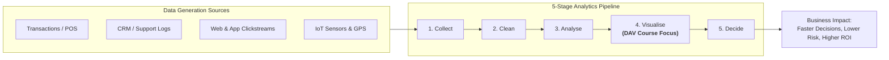
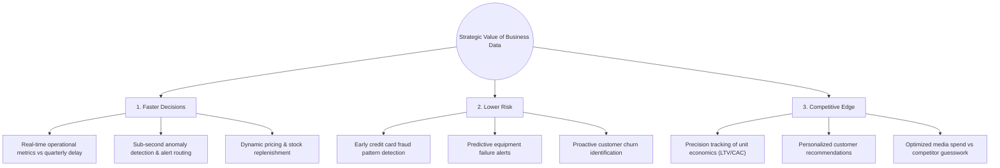
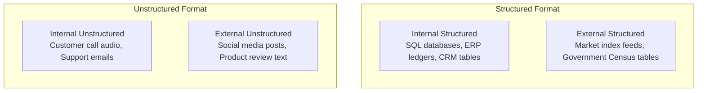
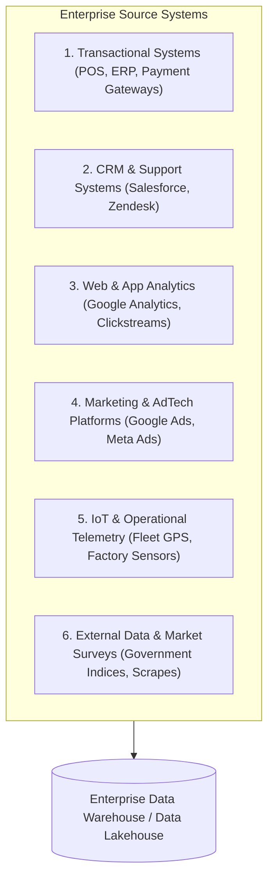
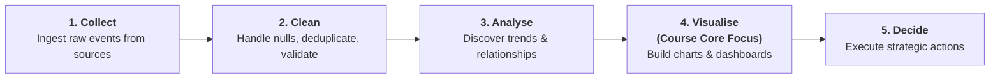
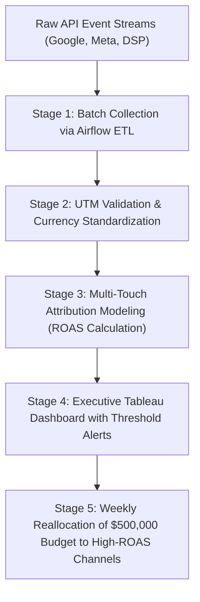
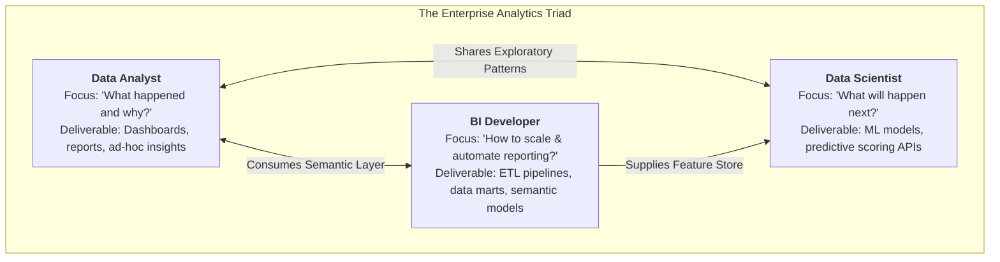

# Chapter 7 — Introduction to Business Data for Analytics

> **Course:** Data Analysis and Visualisation (3CS103ME24)  
> **Programme:** B.Tech (CSE), Integrated B.Tech (CSE)-MBA, B.Tech (Interdisciplinary Minor in Data Science), Semester V  
> **Unit:** Unit II — Business Data Visualization (Session 1 of 10)  
> **Instructor / Industry Lead:** Mr. Pramathesh Shukla (Senior Data Analyst | Business Intelligence & Analytics)  
> **Primary Source:** `Session-1_Introduction to Business Data.pdf`  
> **Files Integrated:** `Session-1_Introduction to Business Data.pdf`, `u2_s1_text.txt`  

---

## 1. Chapter Overview

Modern enterprises operate in data-intensive environments where every digital interaction, customer transaction, supply chain movement, and operational process leaves a continuous digital footprint. Business data serves as the raw economic material for modern organizational strategy, executive decision-making, operational triage, and competitive differentiation.

This chapter establishes the foundational definitions of business data, its structural classification axes, primary operational source systems, the end-to-end analytics pipeline from raw event ingestion to executive action, unit economics metrics, and the organizational division of labor across analytics roles in industry.



[Source: Session-1_Introduction to Business Data.pdf, Slides 1-4, 11]

---

## 2. Definitions & Fundamental Concepts

### Definition: Business Data

* **Meaning:** Any recorded observation, measurement, or fact regarding an organization's operations, customers, employees, or external market environment, captured systematically to enable evaluation, comparison, and decision-making.
* **Formal Definition:** Quantitative or qualitative operational records generated by organizational systems or customer touchpoints, structured with temporal and domain context to support descriptive, diagnostic, predictive, and prescriptive business intelligence.
* **Intuition:** A standalone fact carries no intrinsic business utility until it is recorded within an analytical context. 

> [!NOTE]
> **Personal Fact vs. Business Data Point:**  
> A person's birthdate written on a personal card is an isolated personal fact. However, that same birthdate recorded in an enterprise Customer Relationship Management (CRM) database—triggering automated personalized promotional discounts 7 days prior—is **Business Data**.

---

### Core Categories of Enterprise Business Facts

| Category | Operational Definition | Key Attributes / Features | Real-World Enterprise Example |
| :--- | :--- | :--- | :--- |
| **Transaction Data** | Records of economic exchanges and commercial events. | Timestamps, SKU IDs, quantities, unit prices, payment methods, customer IDs. | Point-of-Sale (POS) checkout logs, UPI payments, e-commerce orders, SAP ERP billing. |
| **Behavioural / Service Data** | Records of customer interactions, service queries, and user experiences. | Ticket IDs, resolution durations, CSAT scores, call sentiment scores. | Zendesk support tickets, call center voice recordings, customer feedback surveys. |
| **Digital / Engagement Data** | Telemetry tracking digital product interactions and online navigation. | Session duration, clickstream paths, scroll depth, bounce rate, IP addresses. | Google Analytics 4 tracking, Hotjar heatmaps, mobile app event logs. |
| **Financial & Unit Data** | Accounting metrics tracking monetary performance and capital allocation. | Revenue, COGS, operating margins, burn rate, Customer Lifetime Value (LTV). | Quarterly P&L statements, general ledgers, ad campaign budget allocation tables. |

[Source: Session-1_Introduction to Business Data.pdf, Slide 4]

---

## 3. Strategic Value of Business Data

Data-driven organizations systematically outperform gut-instinct enterprises. The strategic value of business data is concentrated across three enterprise imperatives:



### 1. Faster Decisions
In fast-moving markets, delays in decision-making result in lost revenue. Real-time telemetry allows managers to adjust pricing, reallocate logistics, or pause failing marketing campaigns in hours rather than waiting for post-quarter financial audits.

### 2. Lower Risk
Statistical profiling and anomaly detection isolate operational threats—such as fraudulent transactions, equipment failure, or inventory stockouts—before they cause irreversible financial damage.

### 3. Competitive Edge
Organizations that measure unit economics (such as Customer Acquisition Cost $\text{CAC}$, Customer Lifetime Value $\text{LTV}$, and Return on Ad Spend $\text{ROAS}$) with precision allocate capital to high-yielding channels while competitors waste resources on unmeasured channels.

---

### Core Business Unit Economics Formulas

#### 1. Return on Ad Spend (ROAS)
$$
\text{ROAS} = \frac{\text{Revenue Generated from Campaign}}{\text{Ad Spend Cost}}
$$

#### 2. Customer Acquisition Cost (CAC)
$$
\text{CAC} = \frac{\text{Total Sales \& Marketing Expenses}}{\text{Number of New Customers Acquired}}
$$

#### 3. Customer Lifetime Value (LTV)
$$
\text{LTV} = \text{Average Revenue Per User (ARPU)} \times \text{Average Customer Lifespan} \times \text{Gross Margin \%}
$$

#### 4. LTV to CAC Ratio
$$
\text{LTV : CAC Ratio} = \frac{\text{LTV}}{\text{CAC}} \quad (\text{Target Enterprise Benchmark: } \ge 3.0)
$$

[Source: Session-1_Introduction to Business Data.pdf, Slide 6]

---

## 4. Structural & Operational Classification Axes

Business data is classified across two orthogonal dimensions: **Structure** (the technical organization of data) and **Origin** (where the data was created).



### Axis 1: By Structure

| Dimension | Definition | Technical Characteristics | Enterprise Examples |
| :--- | :--- | :--- | :--- |
| **Structured Data** | Data adhering to rigid, predefined schemas organized in rows and columns. | Easily stored in Relational Database Management Systems (RDBMS); queryable via SQL; explicit data types (INT, VARCHAR, DATE). | Sales transaction tables, inventory ledgers, employee payroll records. |
| **Semi-Structured Data** | Data containing self-describing tags or markers without a rigid tabular schema. | Key-value pairs or hierarchical trees; parsed using JSON, XML, or NoSQL databases (MongoDB). | Web API responses, log files, user session documents. |
| **Unstructured Data** | Data lacking any predefined conceptual data model or schema. | High volume, multi-modal, freeform; requires NLP, computer vision, or LLMs to extract structured features. | Customer service audio recordings, support emails, contract PDFs, surveillance video. |

---

### Axis 2: By Origin

| Dimension | Definition | Governance & Control | Enterprise Examples |
| :--- | :--- | :--- | :--- |
| **Internal Data** | Data generated directly within an organization's proprietary operational systems. | Full organizational control, known schema, high privacy compliance, clear ownership. | Core banking ledgers, CRM records, employee HR data, warehouse telemetry. |
| **External Data** | Data acquired from external third-party sources, vendors, or open public portals. | Variable quality, schema dependency, legal licensing constraints, requires entity resolution. | Bloomberg market feeds, competitor pricing web scrapes, Weather API data, Census stats. |

[Source: Session-1_Introduction to Business Data.pdf, Slide 8]

---

## 5. Primary Enterprise Data Sources

Modern business intelligence pipelines aggregate data from six core operational source systems:



1. **Transactional Systems (OLTP):** Point-of-Sale checkout terminals, credit card processing gateways (UPI, Stripe), ERP systems (SAP, Oracle).
2. **Customer Relationship Management (CRM) & Support Systems:** Salesforce, HubSpot, Zendesk ticket resolution logs, interactive voice response (IVR) logs.
3. **Web and Mobile Analytics Platforms:** User clickstreams, session replays, conversion funnels, drop-off tracking.
4. **Marketing & AdTech Platforms:** Google Ads, Meta Ads Manager, Demand-Side Platforms (DSPs), tracking impression delivery, CTR, and CPC.
5. **IoT Sensors & Operational Systems:** Fleet vehicle GPS locators, RFID warehouse trackers, manufacturing equipment thermal sensors.
6. **Market Research & External Data Feeds:** Public census data, macroeconomic inflation indicators, benchmark consumer surveys.

[Source: Session-1_Introduction to Business Data.pdf, Slide 9]

---

## 6. The 5-Stage Analytics Pipeline

The conversion of raw event data into executive business decisions follows a sequential 5-stage pipeline:



### Detailed Pipeline Breakdown

| Stage | Primary Objective | Typical Technical Activities | Common Industry Bottlenecks |
| :--- | :--- | :--- | :--- |
| **1. Collect** | Ingest raw event data from heterogeneous source systems into central storage. | Batch ETL/ELT pipelines, streaming Kafka topics, REST API connectors, SQL queries. | Schema drift, rate limits, network latency, data pipeline breaks. |
| **2. Clean** | Rectify errors, resolve inconsistencies, and standardize formats. | Null value imputation, deduplication, type casting, outlier filtering, entity resolution. | Consumes 60%–80% of analyst time ("data cleaning tax"). |
| **3. Analyse** | Apply statistical models and math algorithms to extract patterns. | Aggregations, hypothesis testing, cohort analysis, regression, clustering, ML modeling. | Misinterpreting correlation as causation, p-hacking, model bias. |
| **4. Visualise** | Convert analytical results into intuitive graphical representations. | Interactive dashboards, KPI scorecards, visual storytelling, chart selection. | Visual clutter, misleading axes, poor color choices, high cognitive load. |
| **5. Decide** | Empower business leaders to take timely, risk-mitigated actions. | Resource allocation, pricing updates, inventory replenishment, campaign adjustments. | Organizational inertia, lack of data literacy among executive stakeholders. |

[Source: Session-1_Introduction to Business Data.pdf, Slide 11]

---

## 7. Real-World Enterprise Case Study: Media Investment Optimization

### Business Context
A national retailer manages a multi-channel digital advertising budget deployed across Google Ads, Meta Ads, and Programmatic DSPs.



### Step-by-Step Pipeline Trace

1. **Collect:** Automated daily ingestion of spend, impressions, clicks, and conversion data via AdTech REST APIs into Snowflake.
2. **Clean:** SQL transformations validate UTM campaign tags, standardize currency conversions (EUR/USD to INR), and eliminate duplicate tracking pings.
3. **Analyse:** Multi-touch attribution models calculate channel-specific $\text{ROAS} = \frac{\text{Attributed Revenue}}{\text{Ad Spend}}$.
4. **Visualise:** Dynamic Tableau dashboard displays daily ROAS across channels with conditional color formatting (Green for $\text{ROAS} \ge 4.0$, Red for $\text{ROAS} < 2.0$).
5. **Decide:** Executive leadership reallocates $\$150,000$ from underperforming Meta channels to top-performing Search keywords within 48 hours, improving overall marketing ROI by $28\%$.

[Source: Session-1_Introduction to Business Data.pdf, Slides 12-13]

---

## 8. Analytical Roles & Division of Labor

The modern enterprise analytics function is divided across three complementary roles:



### Detailed Role Comparison Matrix

| Attribute | Data Analyst | Business Intelligence (BI) Developer | Data Scientist |
| :--- | :--- | :--- | :--- |
| **Core Objective** | Answering immediate business questions using historical and current data. | Building, automating, and maintaining scalable data warehousing and reporting infrastructure. | Building predictive models and statistical algorithms to forecast future outcomes. |
| **Temporal Focus** | Past and Present (Descriptive & Diagnostic). | Present and Infrastructure (Operational & Automation). | Future (Predictive & Prescriptive). |
| **Primary Deliverables** | Executive dashboards, diagnostic reports, KPI tracking, ad-hoc analyses. | Automated ETL/ELT pipelines, star-schema data marts, enterprise semantic models. | Machine learning pipelines, recommendation engines, predictive APIs. |
| **Key Technical Stack** | SQL, Power BI, Tableau, Excel, basic Python/R. | SQL, dbt, Apache Airflow, Snowflake, SSIS, DAX. | Python (scikit-learn, PyTorch), R, PySpark, advanced statistics. |
| **Primary Stakeholder** | Department Managers, Business Leads. | Enterprise Architects, Lead Data Analysts. | Product Managers, C-Suite Officers. |

[Source: Session-1_Introduction to Business Data.pdf, Slide 14]

---

## 9. Consolidated Formula Sheet

1. **Return on Ad Spend (ROAS):**
   $$
   \text{ROAS} = \frac{\text{Revenue Generated}}{\text{Ad Spend}}
   $$

2. **Customer Acquisition Cost (CAC):**
   $$
   \text{CAC} = \frac{\text{Total Marketing \& Sales Expense}}{\text{New Customers Acquired}}
   $$

3. **Customer Lifetime Value (LTV):**
   $$
   \text{LTV} = \text{ARPU} \times \text{Average Customer Lifespan} \times \text{Gross Margin \%}
   $$

4. **LTV to CAC Ratio:**
   $$
   \text{LTV : CAC} = \frac{\text{LTV}}{\text{CAC}}
   $$

---

## 10. Definition Sheet

* **Business Data:** Recorded facts regarding organizational operations, customers, or markets, systematically preserved for measurement and decision-making.
* **Structured Data:** Tabular information adhering to a rigid schema (rows and columns) queryable via SQL.
* **Unstructured Data:** Information lacking a predefined data model (e.g., text, audio, video).
* **Analytics Pipeline:** The 5-stage sequence ($\text{Collect} \rightarrow \text{Clean} \rightarrow \text{Analyse} \rightarrow \text{Visualise} \rightarrow \text{Decide}$) converting raw observations into business action.
* **ROAS:** Return on Ad Spend, measuring the gross revenue generated per unit of currency spent on advertising.
* **CAC:** Customer Acquisition Cost, the total expense incurred to convert a prospect into a paying customer.
* **Data Analyst:** A practitioner focused on diagnostic and descriptive analysis to extract actionable business insights from existing data assets.
* **BI Developer:** An engineer focused on data warehousing, data pipeline automation, and enterprise reporting infrastructure.
* **Data Scientist:** A specialist leveraging advanced statistics and machine learning to forecast outcomes and automate algorithmic decisions.

---

## 11. Comprehensive 5-Marker & 10-Marker University Solved Question Bank

### Core Concept Comparisons Matrix

| Comparison Pair | Key Differentiating Principle |
| :--- | :--- |
| **Structured vs. Unstructured Data** | Structured data adheres to predefined SQL schemas with explicit data types; Unstructured data lacks a schema and requires NLP or computer vision preprocessing. |
| **Internal vs. External Data** | Internal data is generated by proprietary enterprise systems with high governance; External data comes from third parties with variable quality and schema dependence. |
| **Data Analyst vs. BI Developer** | Data Analysts focus on answering business questions via dashboards (descriptive); BI Developers focus on data pipeline architecture and warehouse modeling (infrastructure). |

---

### Question 1 [10 Marks] — End-to-End Analytics Pipeline Trace & Multi-Channel Unit Economics

**Question Statement:**  
An enterprise e-commerce platform executes a major festive marketing campaign across three advertising channels:
* **Search Ads (Google):** Spend = $\$60,000$, Revenue Generated = $\$360,000$, New Customers Acquired = $600$
* **Social Ads (Meta):** Spend = $\$40,000$, Revenue Generated = $\$80,000$, New Customers Acquired = $250$
* **Video Ads (YouTube):** Spend = $\$20,000$, Revenue Generated = $\$30,000$, New Customers Acquired = $100$

**Given Enterprise Parameters:** Average Revenue Per User ($\text{ARPU}$) = $\$50$ / month, Gross Margin = $70\%$, Average Customer Lifespan = $18$ months.

**Task Requirements:**  
1. Trace the raw event data flow through all 5 stages of the Analytics Pipeline ($\text{Collect} \rightarrow \text{Clean} \rightarrow \text{Analyse} \rightarrow \text{Visualise} \rightarrow \text{Decide}$). [3 Marks]
2. Calculate channel-specific Return on Ad Spend ($\text{ROAS}$) and Customer Acquisition Cost ($\text{CAC}$) for Search, Social, and Video. [3 Marks]
3. Calculate Customer Lifetime Value ($\text{LTV}$) and the overall enterprise $\text{LTV : CAC}$ ratio across all campaign customers. [2 Marks]
4. Formulate a strategic capital reallocation recommendation based on unit economics benchmarks ($\text{LTV : CAC} \ge 3.0$). [2 Marks]

---

#### Full Step-by-Step Solution:

##### Part 1: 5-Stage Analytics Pipeline Trace
1. **Collect:** Ingest raw impression, click, and purchase event pings via REST APIs from Google Ads, Meta Ads Manager, and YouTube analytics into Snowflake data lakehouse using Apache Airflow.
2. **Clean:** SQL transformation scripts validate UTM parameters, convert multi-currency ad costs to USD, remove duplicate transaction tracking pings, and filter out bot traffic.
3. **Analyse:** Aggregation queries join ad spend with attribution transaction tables to compute channel-specific unit economics ($\text{ROAS}$, $\text{CAC}$, $\text{LTV}$).
4. **Visualise:** Build an executive Power BI dashboard displaying channel performance cards, color-coded conditional ROAS alerts (Green $\ge 4.0$, Yellow $2.0-3.9$, Red $<2.0$), and dynamic date slicers.
5. **Decide:** Executive leadership reallocates budget from failing channels to high-yielding Search campaigns within 48 hours.

##### Part 2: Channel-Specific ROAS & CAC Calculations

* **Search Ads (Google):**
  $$\text{ROAS}_{\text{Search}} = \frac{\$360,000}{\$60,000} = \mathbf{6.00 \quad (600\%)}$$
  $$\text{CAC}_{\text{Search}} = \frac{\$60,000}{600} = \mathbf{\$100.00}$$

* **Social Ads (Meta):**
  $$\text{ROAS}_{\text{Social}} = \frac{\$80,000}{\$40,000} = \mathbf{2.00 \quad (200\%)}$$
  $$\text{CAC}_{\text{Social}} = \frac{\$40,000}{250} = \mathbf{\$160.00}$$

* **Video Ads (YouTube):**
  $$\text{ROAS}_{\text{Video}} = \frac{\$30,000}{\$20,000} = \mathbf{1.50 \quad (150\%)}$$
  $$\text{CAC}_{\text{Video}} = \frac{\$20,000}{100} = \mathbf{\$200.00}$$

##### Part 3: LTV & Overall Enterprise LTV : CAC Ratio

1. **Calculate LTV:**
   $$\text{LTV} = \text{ARPU} \times \text{Lifespan} \times \text{Gross Margin} = \$50 \times 18 \times 0.70 = \mathbf{\$630.00}$$

2. **Compute Total Campaign CAC:**
   $$\text{Total Spend} = 60,000 + 40,000 + 20,000 = \$120,000$$
   $$\text{Total Customers Acquired} = 600 + 250 + 100 = 950$$
   $$\text{Blended CAC} = \frac{\$120,000}{950} = \mathbf{\$126.32}$$

3. **Compute Channel-Specific & Overall LTV : CAC Ratios:**
   * **Search LTV : CAC:** $\frac{\$630}{\$100} = \mathbf{6.30}$ *(Excellent, $\ge 3.0$)*
   * **Social LTV : CAC:** $\frac{\$630}{\$160} = \mathbf{3.94}$ *(Healthy)*
   * **Video LTV : CAC:** $\frac{\$630}{\$200} = \mathbf{3.15}$ *(Marginal)*
   * **Overall Blended LTV : CAC:** $\frac{\$630}{\$126.32} = \mathbf{4.99}$

##### Part 4: Strategic Reallocation Recommendation
Search Ads generate an exceptional $\text{ROAS}$ of $6.00$ ($\text{LTV:CAC} = 6.30$), whereas Video Ads generate an unprofitable $\text{ROAS}$ of $1.50$ ($\text{CAC} = \$200$). The enterprise should immediately reallocate $50\%$ ($\$10,000$) of Video spend and $25\%$ ($\$10,000$) of Social spend directly into Search Ads, maximizing overall gross revenue. $\blacksquare$

---

### Question 2 [10 Marks] — Enterprise Analytics Triad & Data Classification Matrix

**Question Statement:**  
1. **Analytics Roles Triad [5 Marks]:** Construct a comprehensive comparison table contrasting **Data Analyst**, **Business Intelligence (BI) Developer**, and **Data Scientist** across Core Objective, Primary Deliverables, Technical Stack, Temporal Focus, and Primary Stakeholder.
2. **Data Classification Matrix [5 Marks]:** Classify the following 4 enterprise scenarios across (a) Structure (Structured, Semi-Structured, Unstructured) and (b) Origin (Internal, External), and state their database storage requirements:
   * Scenario A: An SAP ERP general ledger billing table.
   * Scenario B: Web API JSON event logs from an external payment gateway.
   * Scenario C: Customer support call center audio MP3 files.
   * Scenario D: A scraped HTML table of competitor product prices.

---

#### Full Step-by-Step Solution:

##### Part 1: Analytics Roles Triad Comparison Matrix

| Attribute | Data Analyst | BI Developer | Data Scientist |
| :--- | :--- | :--- | :--- |
| **Core Objective** | Diagnostic & descriptive analysis answering "What happened and why?". | Building & automating scalable data warehousing and reporting infrastructure. | Predictive & prescriptive modeling forecasting "What will happen next?". |
| **Primary Deliverable** | Executive dashboards, ad-hoc diagnostic reports, KPI scorecards. | Automated ETL/ELT pipelines, star-schema data marts, dbt semantic layers. | Machine learning pipelines, predictive scoring APIs, recommendation engines. |
| **Technical Stack** | SQL, Power BI, Tableau, Excel, Python/R (pandas). | SQL, dbt, Apache Airflow, Snowflake, SSIS, DAX. | Python (scikit-learn, PyTorch), PySpark, R, advanced linear algebra. |
| **Temporal Focus** | Past and Present (Historical & Operational). | Present and Infrastructure (Automation & Data Modeling). | Future (Predictive & Algorithmic). |
| **Primary Stakeholder** | Business Department Managers, Operations Leads. | Enterprise Architects, Senior Analytics Managers. | Product Managers, Chief Technology Officer (CTO). |

##### Part 2: Data Classification & Storage Matrix

| Scenario | Structure Classification | Origin Classification | Recommended Database Storage Stack |
| :--- | :--- | :--- | :--- |
| **A: SAP General Ledger** | **Structured** (Rigid SQL schema, rows & columns). | **Internal** (Generated by core enterprise ERP). | Relational OLTP / Cloud Warehouse (PostgreSQL / Snowflake SQL). |
| **B: Payment API JSON Logs** | **Semi-Structured** (Self-describing key-value tags). | **External** (Ingested from 3rd-party payment gateway). | Document Store / Data Lake (MongoDB / AWS S3 JSON Landing). |
| **C: Support Call Audio** | **Unstructured** (Freeform audio binary blobs). | **Internal** (Recorded by customer support IVR). | Object Storage + Speech-to-Text NLP (AWS S3 + Whisper AI). |
| **D: Scraped Competitor Prices** | **Structured** (Extracted tabular format). | **External** (Web scraped from competitor sites). | Cloud Warehouse Staging Table (Snowflake / BigQuery). |

$\blacksquare$

---

### Question 3 [5 Marks] — Strategic Value Imperatives of Business Data

**Question Statement:**  
Explain the three strategic imperatives of Business Data (**Faster Decisions**, **Lower Risk**, **Competitive Edge**). Provide a concrete financial case study illustrating how sub-second anomaly detection prevents operational loss in payment processing. [5 Marks]

---

#### Full Step-by-Step Solution:

##### Part 1: Three Strategic Value Imperatives
1. **Faster Decisions:** Real-time data streams replace delayed quarterly accounting reports. Operational managers monitor live telemetry, allowing price adjustments, supply chain rerouting, or campaign pauses within hours rather than months.
2. **Lower Risk:** Statistical anomaly detection flags operational threats—such as payment fraud, equipment failure, or customer churn—before they inflict financial damage.
3. **Competitive Edge:** Enterprises measuring unit economics ($\text{LTV}$, $\text{CAC}$, $\text{ROAS}$) allocate capital with surgical precision, while competitors operating on gut feel waste marketing budgets.

##### Part 2: Real-World Payment Fraud Anomaly Case Study
* **Scenario:** A bank processes $1,000$ credit card transactions per second.
* **Traditional Approach (Delayed Batch Review):** Card fraud is audited in a weekly report. A fraudulent card used across 50 high-value transactions causes $\$100,000$ in stolen funds before manual freezing.
* **Data-Driven Approach (Sub-Second Anomaly Detection):** An automated stream pipeline compares each transaction vector (Location, Amount, Velocity) against a Mahalanobis distance baseline. If a card is swiped in New York and 5 minutes later in London, the distance exceeds threshold ($p < 0.001$), triggering an automated block in $<200 \text{ ms}$, saving $\$100,000$. $\blacksquare$

---

### Question 4 [5 Marks] — Classification Matrix & Governance Mapping

**Question Statement:**  
Map 4 enterprise datasets onto a $2 \times 2$ matrix of **Structure** vs. **Origin**. Discuss the governance and regulatory compliance implications (GDPR / DPDP Act) of handling External Unstructured Data versus Internal Structured Data. [5 Marks]

---

#### Full Step-by-Step Solution:

##### Part 1: $2 \times 2$ Classification Grid

```
                  STRUCTURED                       UNSTRUCTURED
         +--------------------------------+--------------------------------+
         | Internal Structured:           | Internal Unstructured:         |
INTERNAL | - SAP ERP Sales Ledger         | - Customer Support Call Audio  |
         | - Employee Payroll Database    | - Internal Email Archives      |
         +--------------------------------+--------------------------------+
         | External Structured:           | External Unstructured:         |
EXTERNAL | - Stock Market Index Feeds     | - Social Media Brand Tweets    |
         | - Public Census CSV Tables     | - Scraped Product Reviews      |
         +--------------------------------+--------------------------------+
```

##### Part 2: Governance & Compliance Analysis
* **Internal Structured Data:** Highly controlled, well-defined metadata, strict Role-Based Access Control (RBAC). Easy to satisfy GDPR "Right to Erasure" via simple SQL `DELETE` queries on primary keys.
* **External Unstructured Data:** Variable quality, third-party licensing risks, unstructured text/audio containing Personally Identifiable Information (PII). Satisfying compliance requires complex NLP PII-redaction pipelines before data landing. $\blacksquare$
