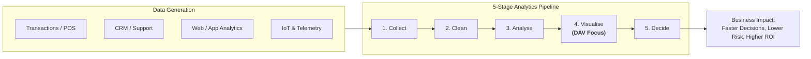
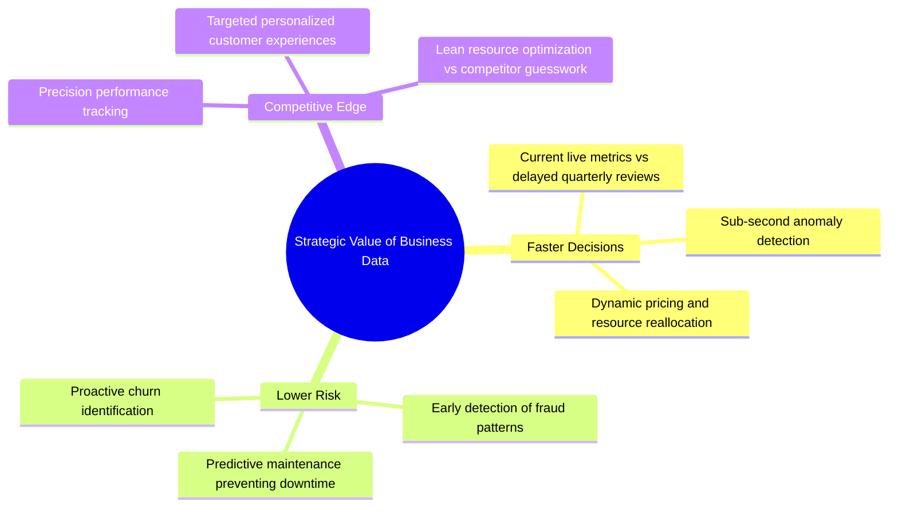
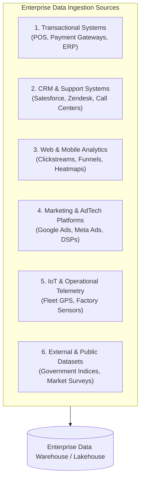
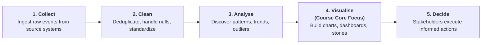
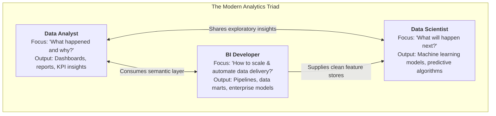

<Complete DAV Notes: Chapter 7 ? Introduction to Business Data for Analytics>
> **Course:** Data Analysis and Visualisation (3CS103ME24)
> **Programme:** B.Tech (CSE), Integrated B.Tech (CSE)-MBA, B.Tech (Interdisciplinary Minor in Data Science), Semester V
> **Unit:** Unit II ? Business Data Visualization (Session 1 of 10)
> **Instructor / Industry Lead:** Mr. Pramathesh Shukla (Senior Data Analyst | Business Intelligence & Analytics)
> **Primary Source:** `Session-1_Introduction to Business Data.pdf`
> **Files Integrated:** `Session-1_Introduction to Business Data.pdf`, `u2_s1_text.txt`
</Complete DAV Notes: Chapter 7 ? Introduction to Business Data for Analytics>

# Chapter 7 ? Introduction to Business Data for Analytics (Unit II, Session 1)

---

## 1. Chapter Overview

Modern enterprises operate in data-intensive environments where every digital interaction, customer transaction, and operational process leaves a measurable digital footprint. Business data forms the foundational raw material for modern organizational decision-making. This chapter establishes the foundational definitions of business data, its structural classification axes, primary operational sources, the end-to-end analytics pipeline from raw collection to stakeholder action, and the division of analytical roles in industry.



[Source: Session-1_Introduction to Business Data.pdf, Slides 1-4, 11]

---

## 2. Definitions & Fundamental Concepts

### Definition: Business Data
**Meaning:** Any recorded fact about an organization's operations, customers, or market, captured systematically so that it can be measured, compared, and acted upon.  
**Formal definition:** Quantitative or qualitative operational, transactional, or environmental records generated by organizational processes or customer engagements, structured for systematic analysis and business intelligence.  
**Intuition:** Facts alone do not constitute business data until they are recorded in a context that enables operational comparison or decision support (e.g., your friend's birthday is personal data, but a customer's birthday recorded in a loyalty CRM to trigger automated promotional discounts is business data).  
[Source: Session-1_Introduction to Business Data.pdf, Slides 4-5]

### Core Categories of Business Facts

| Category | Description | Real-World Enterprise Example |
| :--- | :--- | :--- |
| **Transaction Data** | Records of economic exchanges and commercial events. | Point-of-sale (POS) checkout logs, e-commerce cart payments, banking UPI transfers. |
| **Behavioural / Service Data** | Records of customer interactions, service requests, and usage habits. | Customer support call recordings, helpdesk ticket resolution times, customer sentiment ratings. |
| **Digital / Engagement Data** | Telemetry tracking digital product interactions and user navigation. | Daily unique web visits, clickstream logs, scroll depths, app bounce rates. |
| **Financial Data** | Accounting metrics tracking monetary health and resource allocation. | Regional monthly revenue, cost of goods sold (COGS), operating margins, ad-spend burn rate. |

[Source: Session-1_Introduction to Business Data.pdf, Slide 4]

---

## 3. Strategic Value of Business Data

Data-driven enterprises systematically outperform organizations relying on intuition or delayed reporting. The business value of data concentrates into three strategic imperatives:



### 1. Faster Decisions
Leaders act on near-real-time metrics rather than waiting weeks for monthly or quarterly accounting closures.

### 2. Lower Risk
Statistical variance and anomaly patterns flag threats?such as fraudulent credit card transactions, employee churn, or supply chain bottlenecks?before they cause severe financial loss.

### 3. Competitive Edge
Organizations that measure unit economics, customer acquisition cost (CAC), and lifetime value (LTV) with precision allocate capital more efficiently than competitors operating on gut instinct.

### Industry Benchmark Case Study
In enterprise media investment management across a multi-million-dollar portfolio, implementing structured daily campaign performance tracking directly increased campaign Return on Investment (ROI) simply by exposing underperforming channels within days rather than post-campaign reviews.

[Source: Session-1_Introduction to Business Data.pdf, Slide 6]

---

## 4. Classification Axes of Business Data

Business data is categorized across two orthogonal dimensions: **Structure** (format of organization) and **Origin** (internal vs. external generation).

```mermaid
quadrantChart
    title Business Data Classification Quadrant
    x-axis Internal Origin --> External Origin
    y-axis Unstructured Format --> Structured Format
    quadrant-1 External Structured<br/>Market reports, Competitor pricing feeds
    quadrant-2 Internal Structured<br/>ERP, SQL sales tables, HR databases
    quadrant-3 Internal Unstructured<br/>Employee emails, Customer call logs
    quadrant-4 External Unstructured<br/>Social media posts, Product reviews
```

### Axis 1: By Structure

| Type | Definition | Characteristics | Enterprise Examples |
| :--- | :--- | :--- | :--- |
| **Structured Data** | Data organized in predefined schemas with rigid rows and columns. | Fits into relational database management systems (RDBMS) and spreadsheets; easily queried with SQL; highly standardized data types. | Sales tables, accounting ledgers, transaction records, inventory databases. |
| **Unstructured Data** | Data lacking a formal data model or relational schema. | Heavy in text, multimedia, or freeform logs; requires preprocessing, natural language processing (NLP), or computer vision prior to analysis. | Support ticket text, recorded customer service audio, surveillance video, social media posts. |

### Axis 2: By Origin

| Origin | Definition | Governance & Control | Enterprise Examples |
| :--- | :--- | :--- | :--- |
| **Internal Data** | Generated directly by the organization's internal business operations and platforms. | High control, well-defined metadata, strict governance and privacy control. | CRM customer records, employee payroll logs, manufacturing machine telemetry, warehouse stock levels. |
| **External Data** | Acquired from sources outside the direct boundaries of the organization. | Third-party dependency, variable quality, requires integration and entity matching. | Industry market share reports, competitor pricing web scrapers, macroeconomic indicators, consumer sentiment indices. |

[Source: Session-1_Introduction to Business Data.pdf, Slide 8]

---

## 5. Primary Enterprise Data Sources

Modern business intelligence relies on six fundamental source systems:



1. **Transactional Systems:** Point-of-Sale (POS), e-commerce platforms, payment gateways (UPI, credit cards), core banking systems.
2. **Customer Relationship Management (CRM) & Support Platforms:** Lead tracking systems, customer support tickets, conversation logs, customer satisfaction (CSAT) surveys.
3. **Web and App Analytics Platforms:** Session recording, clickstream logs, user onboarding funnels, drop-off rates.
4. **Marketing & AdTech Platforms:** Impression delivery, click-through rates (CTR), programmatic bidding metrics, campaign spend tracking.
5. **IoT Sensors & Operational Systems:** RFID logistics tags, factory floor thermal sensors, delivery vehicle GPS trackers.
6. **Surveys, Market Research & Public Datasets:** Customer feedback forms, census records, economic forecasts.

[Source: Session-1_Introduction to Business Data.pdf, Slide 9]

---

## 6. The Analytics Pipeline: From Data to Decision

The transformation of raw organizational events into business decisions follows a five-stage sequential pipeline:



### Pipeline Stages Breakdown

| Stage | Primary Objective | Typical Activities | Common Industry Bottlenecks |
| :--- | :--- | :--- | :--- |
| **1. Collect** | Gather raw event records from distributed source systems. | API pulls, batch ETL extraction, database replication, stream listening. | API rate limits, network outages, schema drift. |
| **2. Clean** | Rectify errors, resolve inconsistencies, and standardize formats. | Missing value imputation, deduplication, schema normalization, outlier flagging. | Consumes 60%?80% of analyst time in practice. |
| **3. Analyse** | Identify mathematical relationships, variances, and predictive indicators. | Statistical aggregation, correlation, regression, clustering, cohort segmentation. | Algorithmic bias, spurious correlations. |
| **4. Visualise** | Transform analytical outputs into intuitive graphical representations. | KPI dashboards, executive scorecards, interactive parameter sliders. | Chart clutter, misleading axes, high cognitive load. |
| **5. Decide** | Empower business leaders to take timely, risk-mitigated actions. | Capital budget reallocation, product feature pivot, pricing adjustment. | Organizational inertia, lack of data literacy. |

### Where This Course Lives
The curriculum of **Unit II** and **Unit V** resides primarily in the **Visualise** step. Visual analytics bridges complex data engineering with business strategy, allowing non-technical executive stakeholders to grasp complex trends in seconds rather than hours.

[Source: Session-1_Introduction to Business Data.pdf, Slide 11]

---

## 7. Real-World Case Study: Campaign ROI Optimization

### Business Context
A multinational enterprise manages a large-scale digital marketing budget deployed across multiple programmatic AdTech platforms (Google Ads, Meta, DSPs).

### Pipeline Execution
1. **Collect:** Daily automated batch extraction of ad spend, impression delivery, and conversion events via AdTech APIs.
2. **Clean:** Automatic validation rules verify UTM parameters, currency conversions, and deduplicate tracking ping errors.
3. **Analyse:** Multi-touch attribution modeling determines channel-specific return on ad spend ($		ext{ROAS} = rac{		ext{Revenue Generated}}{		ext{Ad Spend}}$).
4. **Visualise:** Dynamic executive dashboards built in Tableau update daily, highlighting high-performing and money-losing channels using color-coded KPI thresholds.
5. **Decide:** Executive leadership reallocated capital toward high-performing ad channels within 48 hours rather than waiting for quarterly post-mortems, yielding substantial gains in media effectiveness.

[Source: Session-1_Introduction to Business Data.pdf, Slides 12-13]

---

## 8. Analytical Roles & Division of Labor



### Role Comparison Matrix

| Attribute | Data Analyst | Business Intelligence (BI) Developer | Data Scientist |
| :--- | :--- | :--- | :--- |
| **Core Objective** | Answering immediate business questions using historical/current data. | Designing, building, and maintaining automated reporting architecture. | Developing predictive and prescriptive models for future uncertainty. |
| **Primary Output** | Executive dashboards, ad-hoc exploratory reports, business insights. | Robust ETL/ELT pipelines, dimensional star-schemas, enterprise dashboards. | Machine learning pipelines, predictive scoring APIs, statistical forecasts. |
| **Key Tooling** | SQL, Tableau, Power BI, Excel, basic Python/R. | SQL, dbt, Airflow, Snowflake/BigQuery, SSIS, DAX. | Python, PyTorch/TensorFlow, scikit-learn, Spark, statistics. |
| **Temporal Focus** | Past and Present (Descriptive & Diagnostic). | Present and Operational (Infrastructure & Governance). | Future (Predictive & Prescriptive). |

[Source: Session-1_Introduction to Business Data.pdf, Slide 14]

---

## 9. Definition Sheet

* **Business Data:** Any recorded fact concerning an organization's operations, customers, or market environment, systematically preserved for measurement and decision-making.
* **Structured Data:** Highly organized information adhering to a rigid tabular schema (rows and columns) queryable via relational languages.
* **Unstructured Data:** Information lacking a predefined conceptual model or tabular format (e.g., text, voice recordings, video).
* **Analytics Pipeline:** The systematic five-stage sequence (Collect $
ightarrow$ Clean $
ightarrow$ Analyse $
ightarrow$ Visualise $
ightarrow$ Decide) converting raw events into organizational action.
* **Data Analyst:** A practitioner focused on diagnostic and descriptive analysis to extract actionable business insights from existing data assets.
* **BI Developer:** An engineer focused on data warehousing, data pipeline automation, and enterprise reporting infrastructure.
* **Data Scientist:** A specialist leveraging advanced statistics and machine learning to forecast outcomes and automate algorithmic decisions.

---

## 10. Exam-Oriented Review

### Key Concepts to Master
1. **The Dual Classification Axes:** Classifying any business scenario into Structured vs. Unstructured and Internal vs. External.
2. **The 5-Stage Analytics Pipeline:** Understanding the sequence, purpose, and real-world friction points at each stage.
3. **The 'Visualise' Value Proposition:** Explaining why visualization acts as the bridge between technical analytics and non-technical decision-making.
4. **Role Differentiation:** Accurately distinguishing between Data Analyst, BI Developer, and Data Scientist responsibilities.

### Potential Exam Questions
* **Conceptual:** Define business data and explain why raw data only acquires business value when placed in a comparative context.
* **Classification:** Provide two examples of internally-generated unstructured data and two examples of externally-sourced structured data.
* **Pipeline Trace:** Map out the 5 stages of the analytics pipeline for an e-commerce platform handling a flash festival sale.
* **Comparative:** Compare the core objectives, typical deliverables, and technical skills of a Data Analyst versus a BI Developer.


## Summary Formula
- **Return on Ad Spend (ROAS):** $	ext{ROAS} = rac{	ext{Revenue Generated}}{	ext{Ad Spend}}$.
