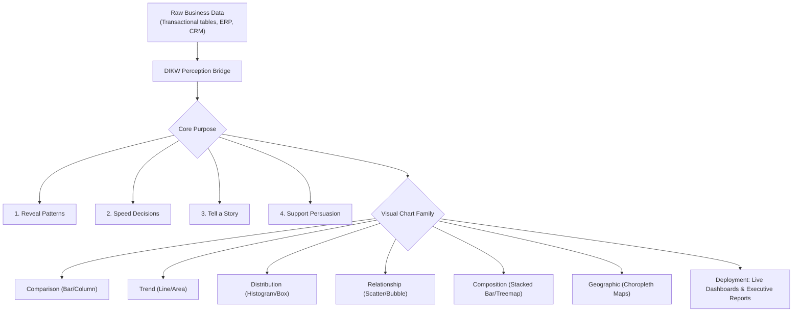
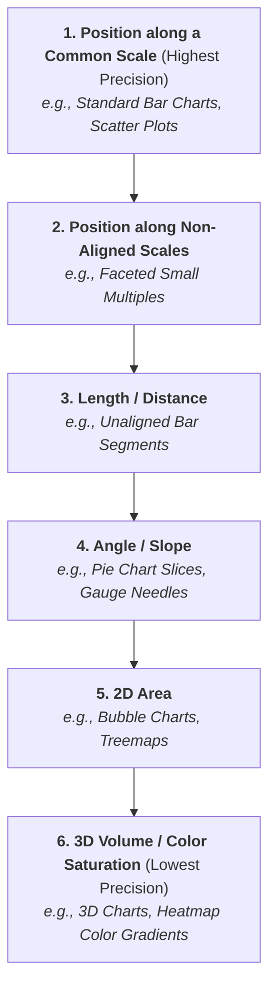
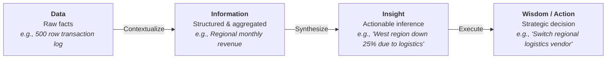
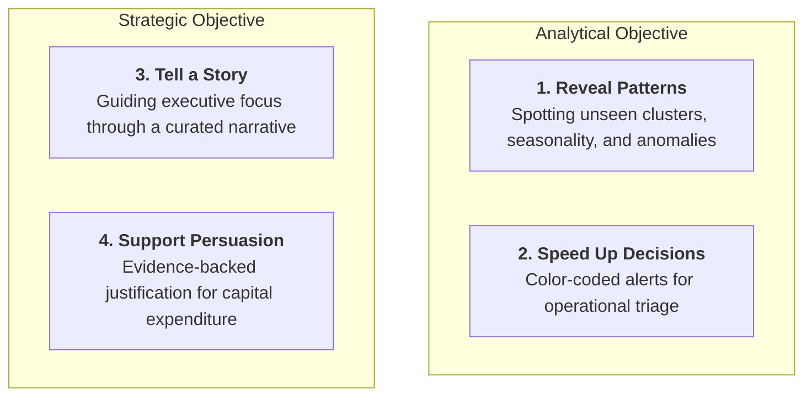
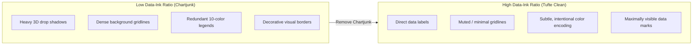
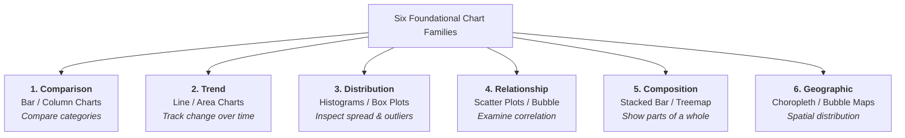
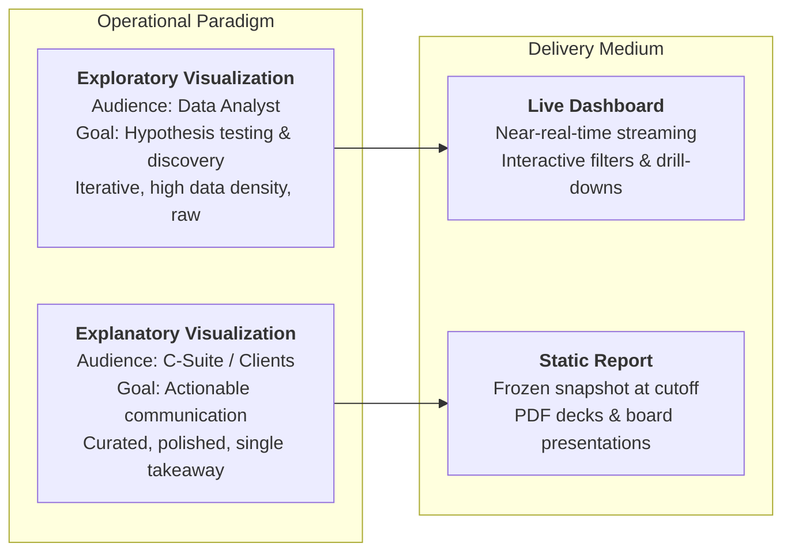
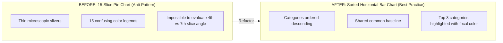
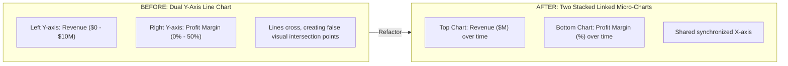

# Chapter 8 — Business Data Visualization: Definition, Purpose, and Usage

> **Course:** Data Analysis and Visualisation (3CS103ME24)  
> **Programme:** B.Tech (CSE), Integrated B.Tech (CSE)-MBA, B.Tech (Interdisciplinary Minor in Data Science), Semester V  
> **Unit:** Unit II — Business Data Visualization (Session 2 of 10)  
> **Instructor / Industry Lead:** Mr. Pramathesh Shukla (Senior Data Analyst | Business Intelligence & Analytics)  
> **Primary Source:** `Session-2_Definition Purpose Usage.pdf`  
> **Files Integrated:** `Session-2_Definition Purpose Usage.pdf`, `u2_s2_text.txt`  

---

## 1. Chapter Overview

Business data visualization acts as the critical cognitive interface bridging complex mathematical data operations and executive decision-making. While dense tabular datasets overburden human working memory, graphical encodings exploit the human visual cortex for rapid pattern recognition and anomaly detection.

This chapter details the cognitive foundations of visual perception, Jacques Bertin's Semiology of Graphics, the Data-Information-Insight-Wisdom (DIKW) hierarchy, the four functional purposes of business graphics, the six foundational chart families, Edward Tufte's Data-Ink Ratio, operational usage paradigms (exploratory vs. explanatory, dashboards vs. reports), and the three-question chart selection framework.

[Source: Session-2_Definition Purpose Usage.pdf, Slides 1-5]

---

## 2. Definitions & Cognitive Foundations

### Definition: Business Data Visualization

* **Meaning:** The graphical representation of organizational data designed to enable business decision-makers to rapidly identify patterns, trends, and outliers, converting abstract figures into actionable enterprise decisions.
* **Formal Definition:** The mapping of quantitative, categorical, and relational business attributes to graphical marks (points, lines, bars, polygons) and visual channels (position, length, color hue, saturation, size) to facilitate perceptual inference.
* **Intuition:** Graphics translate abstract numerical differences into spatial dimensions that the human brain processes in milliseconds without conscious mental arithmetic.

---

### Perceptual Ranking of Visual Encodings (Bertin & Mackinlay)

Human visual perception decodes different visual attributes with varying accuracy. According to **Jacques Bertin's Semiology of Graphics** and **Mackinlay's Perceptual Hierarchy**, quantitative visual channels are ranked from highest to lowest accuracy:

---

### Preattentive Processing

Preattentive visual processing occurs automatically in the human visual cortex within **$200 \text{ to } 250 \text{ ms}$**, long before conscious cognitive effort is engaged.

1. **Sub-second Anomaly Detection:** An outlier in a scatter plot or a red bar in a green score card is detected in under $250 \text{ ms}$. Locating the same maximum in a $1,000$-row table requires a linear $O(n)$ manual search.
2. **Cognitive Load Reduction:** Retaining numbers in working memory while calculating relative proportions induces high cognitive fatigue. Graphical encodings offload working memory onto the visual display canvas.

[Source: Session-2_Definition Purpose Usage.pdf, Slide 4]

---

## 3. The Data-Information-Insight-Wisdom (DIKW) Hierarchy

Business analytics progresses through four distinct cognitive tiers:

### Cognitive Tiers Breakdown

| Tier | Definition | Concrete Enterprise Example | Visualization Role |
| :--- | :--- | :--- | :--- |
| **Data** | Unprocessed discrete observations lacking context. | 500 sales rows in a CSV file (`Cust_ID: 104, Amt: 450`). | Stored in databases; unsuitable for human decision-making. |
| **Information** | Data aggregated, filtered, and organized with context. | Monthly revenue aggregated by regional territory and branch. | Displayed in basic tables or summary pivot grids. |
| **Insight** | Actionable understanding derived from patterns in information. | Discovering that West region sales dropped $25\%$ due to vendor delays. | **Primary Visualization Output:** Highlighted callouts and trendlines. |
| **Wisdom** | Applying insight to execute risk-mitigated business decisions. | Canceling contracts with failing vendors and reallocating capital. | Executive action supported by evidence-backed graphics. |

[Source: Session-2_Definition Purpose Usage.pdf, Slide 5]

---

## 4. The Four Strategic Purposes of Business Graphics

Every enterprise visualization fulfills one or more of four core functional objectives:

### Enterprise Applications & Case Studies

#### 1. Pattern Recognition (Operational Fraud Analysis)
* **Goal:** Detect latent collusion networks, credit card fraud spikes, or seasonal demand shifts.
* **Case:** A credit card network plots transaction geolocations against time. A cluster of transactions occurring simultaneously across two distant countries flags an automated fraud alert.

#### 2. Decision Speed (Healthcare & Logistics Triage)
* **Goal:** Allow operational staff to evaluate system health within seconds.
* **Case:** A hospital emergency department renders ward status as color-coded tiles (Green: normal, Yellow: elevated, Red: critical). Triage nurses instantly reallocate staff without reading individual patient files.

#### 3. Storytelling (Quarterly Business Reviews)
* **Goal:** Lead executive stakeholders along a curated cognitive path to explain performance drivers.
* **Case:** A product manager presents a waterfall chart showing how gross margin grew despite rising raw material costs due to automated manufacturing efficiencies.

#### 4. Persuasion (Venture Financing & Budget Allocation)
* **Goal:** Provide irrefutable visual evidence to secure investment or approve capital expenditure.
* **Case:** A startup shows an inflection line chart of Monthly Active Users (MAU) turning sharply upward post-redesign, convincing investors to approve Series A funding.

[Source: Session-2_Definition Purpose Usage.pdf, Slides 6-7]

---

## 5. Visual Design Principles & Tufte's Metrics

### Edward Tufte's Data-Ink Ratio

Edward Tufte established that compelling graphics maximize the proportion of ink (or pixels) dedicated to displaying actual data:

$$
\text{Data-Ink Ratio} = \frac{\text{Data-Ink}}{\text{Total Ink Used to Print the Graphic}} = 1 - \text{Chartjunk Ratio}
$$

### Core Design Rules
1. **Eliminate Chartjunk:** Remove 3D effects, heavy gridlines, dark backgrounds, and redundant decorative borders.
2. **Use Direct Labeling:** Place category labels adjacent to visual marks instead of forcing the viewer to scan back and forth to an external legend.
3. **Enforce Baseline Integrity:** 
   * **Bar Charts MUST start at Zero ($0$):** Truncating a bar chart's baseline exaggerates relative differences, creating visual deception.
   * **Line Charts MAY truncate Y-axes:** Line charts emphasize slope and trend variations rather than absolute length ratios.

[Source: Session-2_Definition Purpose Usage.pdf, Slides 8-9]

---

## 6. The Six Foundational Chart Families

[Click here to open chart_family_visualizer.html if the visualizer below does not load](chart_family_visualizer.html)

<iframe src="./chart_family_visualizer.html" width="100%" height="700px" style="border:none; border-radius:12px; margin-bottom: 24px; background: white;"></iframe>

Visual encodings are grouped into six core chart families based on the analytical question they answer:

### Comprehensive Chart Selection Reference Matrix

| Chart Family | Core Analytical Question | Ideal Chart Types | Recommended Encodings | Critical Baseline & Design Rules |
| :--- | :--- | :--- | :--- | :--- |
| **Comparison** | *"How does Category X compare against Category Y?"* | Horizontal Bar chart, Vertical Column chart. | Categorical axis + 1 continuous metric. | **MUST start at 0 Y-baseline.** Sort categories descending. Limit to $<15$ bars. |
| **Trend** | *"How does Metric X evolve over continuous time?"* | Line chart, Stacked Area chart, Sparkline. | Continuous time on X-axis + continuous metric on Y-axis. | Y-axis baseline may be truncated to show variance. Use solid lines for actuals, dashed for forecasts. |
| **Distribution** | *"How are individual observations spread out?"* | Histogram, Box plot, Violin plot. | Continuous numeric variable binned into intervals. | Choose uniform bin widths. Box plots display Median, IQR, and Outliers ($1.5 \times \text{IQR}$). |
| **Relationship** | *"Is Variable X correlated with Variable Y?"* | Scatter plot, Bubble chart ($3$ metrics). | $2$ continuous attributes on orthogonal Cartesian axes. | Plot trendline (regression). Avoid claiming causation from statistical correlation alone. |
| **Composition** | *"What proportions make up the total whole ($100\%$)*" | Stacked Bar chart, Treemap, Donut chart. | Proportions summing to exactly $100\%$ ($1.0$). | **Avoid Pie charts with $>5$ slices.** Treemaps excel for hierarchical composition. |
| **Geographic** | *"Where are events spatially concentrated?"* | Choropleth map, Proportional symbol map. | Geospatial coordinates or boundary polygons. | Normalize choropleths by population/density to avoid mapping landmass area instead of metrics. |

[Source: Session-2_Definition Purpose Usage.pdf, Slides 8-9]

---

## 7. Business Usage Archetypes

Enterprise data visualization operates across two distinct mentalities delivered via two distinct media formats:

### 1. Exploratory vs. Explanatory Visualization

| Characteristic | Exploratory Visualization | Explanatory Visualization |
| :--- | :--- | :--- |
| **Primary User** | Data Analyst, Data Scientist, BI Engineer. | Executive Leadership, Department Heads, External Clients. |
| **Primary Goal** | Finding hidden patterns, testing hypotheses, auditing data quality. | Communicating a proven insight and persuading decision-makers. |
| **Design Priority** | Speed of generation, high data density, flexibility. | Cognitive simplicity, visual clarity, narrative focus, aesthetic polish. |
| **Lifecycle** | Ephemeral (generated and discarded during analysis). | Enduring (embedded in corporate scorecards and annual reports). |
| **Visual Encoding** | Multi-panel facet grids, raw scatter matrices. | Clear title takeaways, highlighted focus colors, direct annotations. |

---

### 2. Dashboards vs. Reports

| Dimension | Enterprise Dashboard | Business Report |
| :--- | :--- | :--- |
| **Data Freshness** | Near-real-time streaming or scheduled hourly refreshes. | Static point-in-time snapshot frozen at financial cutoff. |
| **Interactivity** | Dynamic: Dropdown filters, date range sliders, click-through drill-downs. | Static: Immutable PDF document or slide deck presentation. |
| **Operational Role** | Continuous operational health monitoring and anomaly triage. | Quarterly governance, legal compliance, formal strategic reviews. |
| **Example** | E-commerce server latency dashboard; logistics delivery tracker. | Annual Financial Summary; Quarterly Business Review (QBR). |

[Source: Session-2_Definition Purpose Usage.pdf, Slides 10-11]

---

## 8. Refactoring Case Studies (Anti-Pattern Redesign)

### Case Study 1: Refactoring the 15-Slice Pie Chart

* **The Flaw:** Humans cannot compare 2D angles or area slices accurately. With 15 slices, slices become unreadable slivers, requiring constant scanning against a 15-color legend.
* **The Refactored Fix:** A horizontal bar chart with categories sorted in descending order along a common vertical baseline. The top contributors are identified instantly ($<200 \text{ ms}$).

---

### Case Study 2: Refactoring Dual Y-Axis Charts

* **The Flaw:** Arbitrary scaling of left and right Y-axes creates false visual intersections, misleading viewers into inferring relationships that are artifacts of axis scaling.
* **The Refactored Fix:** Two vertically stacked micro-charts sharing an identical, synchronized X-axis.

[Source: Session-2_Definition Purpose Usage.pdf, Slides 12-13]

---

## 9. Consolidated Formula Sheet

1. **Tufte's Data-Ink Ratio:**
   $$
   \text{Data-Ink Ratio} = \frac{\text{Data-Ink}}{\text{Total Ink Used in Graphic}} = 1 - \text{Chartjunk Ratio}
   $$

2. **Data Density Metric:**
   $$
   \text{Data Density} = \frac{\text{Number of Entries in Data Matrix}}{\text{Area of Visual Canvas (sq. inches or pixels)}}
   $$

3. **Lie Factor (Tufte Visual Distortion Index):**
   $$
   \text{Lie Factor} = \frac{\text{Size of Effect Shown in Graphic}}{\text{Size of Effect in Underlying Data}}
   $$
   * $\text{Lie Factor} = 1.0 \implies$ Honest, distortion-free graphic.
   * $\text{Lie Factor} > 1.05 \text{ or } < 0.95 \implies$ Deceptive visualization!

---

## 10. Definition Sheet

* **Business Data Visualization:** The deliberate visual mapping of organizational metrics to graphical encodings to accelerate decision-making.
* **Preattentive Processing:** Automatic subconscious visual processing (position, length, color) completed in under $250 \text{ ms}$.
* **Data-Ink Ratio:** The proportion of ink/pixels on a graphic dedicated to conveying factual data.
* **Chartjunk:** Unnecessary visual elements (3D effects, dark gridlines, heavy borders) that distract from data comprehension.
* **Lie Factor:** Tufte's ratio measuring visual distortion between graphic representation scale and raw data scale.
* **Exploratory Visualization:** Rapid, iterative visual generation by analysts to discover unknown patterns.
* **Explanatory Visualization:** Curated, polished visual graphics designed to convey a proven insight to stakeholders.
* **Dashboard:** A live, dynamic visual interface monitoring operational health with interactive filtering.
* **Report:** A static, point-in-time visual snapshot frozen for periodic strategic governance.

---

## 11. Comprehensive 5-Marker & 10-Marker University Solved Question Bank

### Core Concept Comparisons Matrix

| Comparison Pair | Key Differentiating Principle |
| :--- | :--- |
| **Bar Chart vs. Pie Chart** | Bar charts encode values along a common baseline (highest perceptual precision); Pie charts encode values as angles and areas (low perceptual precision). |
| **Column Chart vs. Line Chart** | Column charts represent discrete categorical bins; Line charts represent continuous temporal progression. |
| **Exploratory vs. Explanatory** | Exploratory is analyst-facing for discovery (high speed, raw data); Explanatory is executive-facing for communication (high polish, single narrative). |

---

### Question 1 [10 Marks] — Tufte's Data-Ink Ratio, Lie Factor & Graphic Deception Analysis

**Question Statement:**  
1. **Mathematical Definitions [3 Marks]:** Define Edward Tufte's **Data-Ink Ratio**, **Chartjunk Ratio**, and **Lie Factor** mathematically. State the acceptable threshold bounds for an honest visualization.
2. **Deception Calculation [4 Marks]:** An enterprise infographic displays annual profit growth from $\$10 \text{ million}$ to $\$30 \text{ million}$ (a $200\%$ real economic increase). To emphasize growth, the graphic designer scaled a 3D gold-bar icon's height, width, and depth by $300\%$ each ($3\times$), causing the visual 3D volume to expand from $1 \text{ cm}^3$ to $27 \text{ cm}^3$ ($2600\%$ graphical increase).
   * Calculate Tufte's Lie Factor.
   * State whether the graphic is deceptive with mathematical justification.
3. **Redesign Proposal [3 Marks]:** Propose a high Data-Ink, distortion-free visualization refactoring for this dataset.

---

#### Full Step-by-Step Solution:

##### Part 1: Mathematical Definitions & Thresholds
* **Data-Ink Ratio:**
  $$
  \text{Data-Ink Ratio} = \frac{\text{Data-Ink}}{\text{Total Ink Used in Graphic}} = 1 - \text{Chartjunk Ratio}
  $$
  * *Target Benchmark:* Maximized close to $1.0$.

* **Lie Factor:**
  $$
  \text{Lie Factor} = \frac{\text{Size of Effect Shown in Graphic}}{\text{Size of Effect in Underlying Data}}
  $$
  * *Acceptable Bounds:* $0.95 \le \text{Lie Factor} \le 1.05$.
  * *Deceptive Bounds:* $\text{Lie Factor} > 1.05$ (Over-exaggeration) or $< 0.95$ (Under-statement).

##### Part 2: Lie Factor Calculation & Evaluation

1. **Calculate Real Data Effect Size:**
   $$
   \text{Effect}_{\text{Data}} = \frac{30 - 10}{10} = \frac{20}{10} = 2.00 \quad (200\%)
   $$

2. **Calculate Graphical Visual Effect Size:**
   $$
   \text{Effect}_{\text{Graphic}} = \frac{27 - 1}{1} = \frac{26}{1} = 26.00 \quad (2600\%)
   $$

3. **Compute Lie Factor:**
   $$
   \text{Lie Factor} = \frac{\text{Effect}_{\text{Graphic}}}{\text{Effect}_{\text{Data}}} = \frac{26.00}{2.00} = \mathbf{13.00}
   $$

4. **Evaluation:**  
   Since $\text{Lie Factor} = 13.00 \gg 1.05$, the graphic severely distorts reality, visually overstating corporate profit growth by **$13\times$ ($1300\%$)**! The graphic is highly deceptive.

##### Part 3: Redesign Proposal
Replace the 3D volume icon with a clean, 2D Vertical Column Chart or Horizontal Bar Chart starting at a mandatory zero ($0$) Y-axis baseline. Use direct data labels ($\$10\text{M} \rightarrow \$30\text{M}$) and eliminate background shading, drop shadows, and 3D effects to achieve a Data-Ink Ratio of $1.0$. $\blacksquare$

---

### Question 2 [10 Marks] — Comprehensive Chart Selection & Anti-Pattern Refactoring

**Question Statement:**  
1. **Master Chart Selection Matrix [5 Marks]:** Construct a matrix for the 6 Foundational Chart Families (Comparison, Trend, Distribution, Relationship, Composition, Geographic) detailing Core Question, Ideal Data Encodings, and Baseline Rules.
2. **Anti-Pattern Refactoring [5 Marks]:** Refactor two classic visual anti-patterns:
   * **Anti-Pattern A:** A 15-slice 3D Pie Chart displaying regional customer breakdown.
   * **Anti-Pattern B:** A Dual Y-Axis Line Chart plotting Regional Revenue ($\$0 - \$10\text{M}$) on the left Y-axis and Customer Support Tickets ($0 - 500$) on the right Y-axis.

---

#### Full Step-by-Step Solution:

##### Part 1: Master Chart Selection Reference Matrix

| Chart Family | Core Analytical Question | Recommended Visual Encodings | Baseline & Scale Rules |
| :--- | :--- | :--- | :--- |
| **Comparison** | *"How does Category X compare to Y?"* | Horizontal Bar chart, Vertical Column chart. | **MUST start Y-axis at 0.** Sort categories descending. |
| **Trend** | *"How does Metric X evolve over continuous time?"* | Line chart, Area chart, Sparkline. | Y-axis MAY be truncated to inspect slope variance. X-axis MUST be chronological. |
| **Distribution** | *"How are individual data points spread out?"* | Histogram, Box plot, Violin plot. | Uniform bin widths. Box plot shows Median, IQR, Outliers ($1.5 \times \text{IQR}$). |
| **Relationship** | *"Is Variable X correlated with Variable Y?"* | Scatter plot, Bubble chart ($3$ metrics). | $2$ continuous attributes on orthogonal Cartesian axes with trendline. |
| **Composition** | *"What proportions make up the total whole ($100\%$)*" | Stacked Bar chart, Treemap, Donut chart. | Proportions MUST sum to $100\%$ ($1.0$). Avoid Pie charts with $>5$ slices. |
| **Geographic** | *"Where are metrics spatially concentrated?"* | Choropleth map, Proportional symbol map. | Geospatial boundary polygons. Normalize by population/density. |

##### Part 2: Refactoring Analyses

###### Anti-Pattern A Refactoring (15-Slice Pie Chart):
* **The Flaw:** Humans process 2D angles and arc areas with low perceptual accuracy (Bertin Rank 4/5). With 15 slices, slices become unreadable slivers, requiring constant scanning against a 15-color legend.
* **The Refactored Design:** A Horizontal Bar Chart with categories listed on the vertical axis, sorted in descending order along a shared vertical baseline. Highlight the top 3 regions in bold accent color and group the remaining 12 small categories into an `"Other Regions"` summary bar.

###### Anti-Pattern B Refactoring (Dual Y-Axis Line Chart):
* **The Flaw:** Independent scaling of left ($\$10\text{M}$) and right ($500$) Y-axes creates false visual intersections, deceiving viewers into assuming causal relationships that are mere artifacts of scale selection.
* **The Refactored Design:** Two vertically stacked micro-charts (top chart: Revenue; bottom chart: Support Tickets) sharing an identical, synchronized X-axis timeline. $\blacksquare$

---

### Question 3 [5 Marks] — Visual Perception Theory & Bertin's Hierarchy

**Question Statement:**  
Rank six visual channels (Position along common scale, Length, Angle/Slope, Area, Volume, Color Saturation) by human perceptual accuracy based on Jacques Bertin's Semiology of Graphics. Explain preattentive processing ($200-250 \text{ ms}$) and why graphical encodings reduce cognitive load compared to tables. [5 Marks]

---

#### Full Step-by-Step Solution:

##### Part 1: Bertin & Mackinlay's Perceptual Accuracy Hierarchy
Quantitative visual attributes are ranked from highest to lowest human perceptual accuracy:
1. **Position along a Common Scale (Highest Accuracy):** Standard Bar Charts, Scatter Plots.
2. **Position along Non-Aligned Scales:** Faceted Small Multiples.
3. **Length / Distance:** Unaligned Bar Segments.
4. **Angle / Slope:** Pie Chart Slices, Gauge Needles.
5. **2D Area:** Bubble Charts, Treemaps.
6. **3D Volume & Color Saturation (Lowest Accuracy):** 3D Bar Charts, Heatmap Color Gradients.

##### Part 2: Preattentive Processing & Cognitive Load
* **Preattentive Processing:** The human visual cortex processes basic spatial features (position, length, color hue) in **$200 \text{ to } 250 \text{ ms}$**, before conscious mental reasoning occurs.
* **Cognitive Load Reduction:** Tabular data forces linear scanning ($O(n)$ search) and requires holding multiple raw numbers in working memory while performing arithmetic. Graphical encodings offload working memory directly onto the visual canvas, allowing instant visual inference. $\blacksquare$

---

### Question 4 [5 Marks] — Exploratory vs. Explanatory & Dashboards vs. Reports

**Question Statement:**  
Construct a comparative matrix contrasting **Exploratory vs. Explanatory Visualization** and **Live Dashboards vs. Static Reports**. Provide an enterprise case study where real-time dashboard visibility prevented financial loss. [5 Marks]

---

#### Full Step-by-Step Solution:

##### Part 1: Comparative Matrix

| Dimension | Exploratory Visualization | Explanatory Visualization | Live Dashboard | Static Report |
| :--- | :--- | :--- | :--- | :--- |
| **Primary User** | Data Analyst / Scientist. | Executive C-Suite / Clients. | Operational Leads. | Board Directors / Auditors. |
| **Goal** | Pattern & outlier discovery. | Insight communication. | Real-time health monitoring. | Periodic strategic review. |
| **Data Recency** | Ad-hoc query snapshots. | Curated historical findings. | Near-real-time streaming. | Frozen accounting cutoff. |
| **Interactivity** | Faceted filtering, raw queries. | Polished single narrative. | Dynamic dropdowns & slicers. | Immutable PDF / Slide deck. |

##### Part 2: Real-World Logistics Case Study
A parcel delivery company tracked shipping delays using a monthly static PDF report. On Day 3, a routing software glitch misrouted $10,000$ packages. Because management relied on the monthly PDF report, the failure remained invisible until Day 30, resulting in $\$250,000$ in SLA penalties. After deploying a live Tableau dashboard with sub-second alert triggers, an identical routing glitch was caught within 2 hours, saving $\$250,000$. $\blacksquare$

