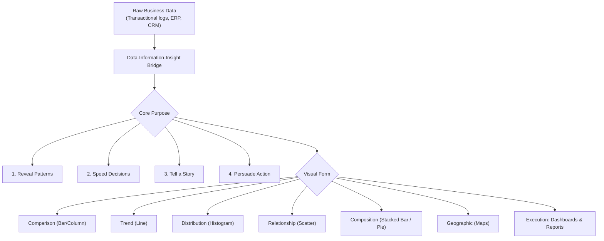
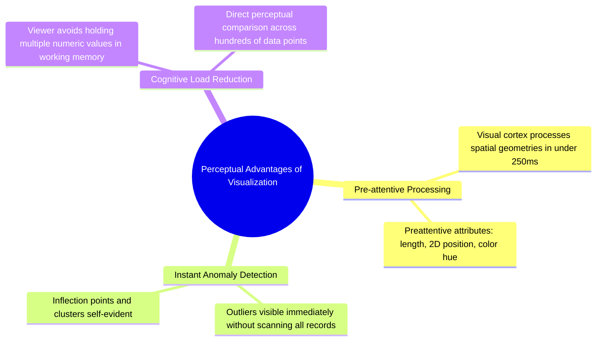
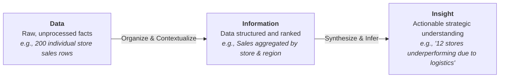
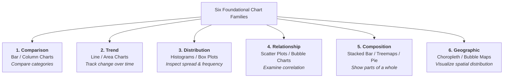
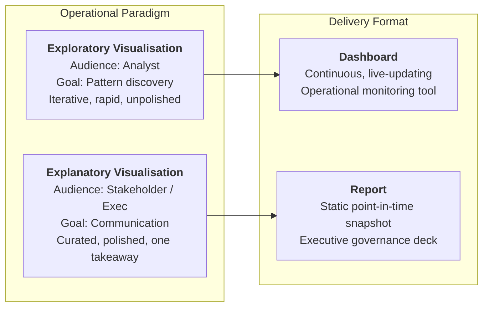
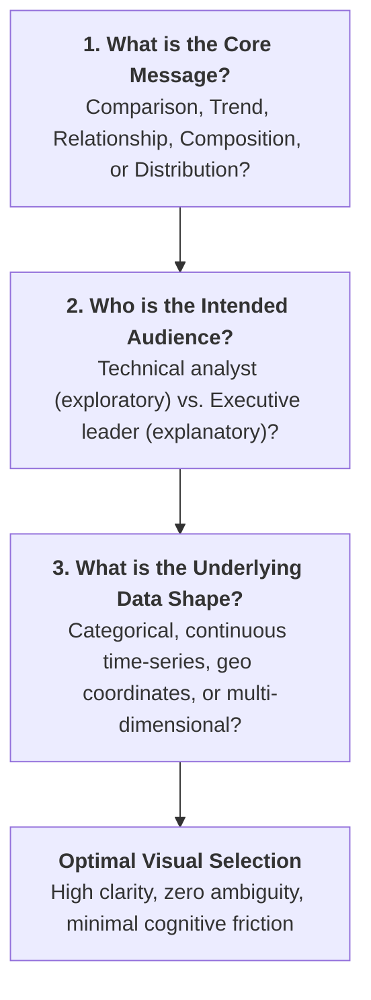
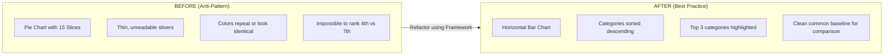

<Complete DAV Notes: Chapter 8 ? Business Data Visualization: Definition, Purpose & Usage>
> **Course:** Data Analysis and Visualisation (3CS103ME24)
> **Programme:** B.Tech (CSE), Integrated B.Tech (CSE)-MBA, B.Tech (Interdisciplinary Minor in Data Science), Semester V
> **Unit:** Unit II ? Business Data Visualization (Session 2 of 10)
> **Instructor / Industry Lead:** Mr. Pramathesh Shukla (Senior Data Analyst | Business Intelligence & Analytics)
> **Primary Source:** `Session-2_Definition Purpose Usage.pdf`
> **Files Integrated:** `Session-2_Definition Purpose Usage.pdf`, `u2_s2_text.txt`
</Complete DAV Notes: Chapter 8 ? Business Data Visualization: Definition, Purpose & Usage>

# Chapter 8 ? Business Data Visualization: Definition, Purpose & Usage (Unit II, Session 2)

---

## 1. Chapter Overview

Business data visualization serves as the vital cognitive bridge between mathematical data manipulation and executive action. Tabular representations of data overburden human working memory, whereas visual channels exploit the human visual cortex for rapid pattern recognition. This chapter systematically details the cognitive foundations of visualization, the Data-Information-Insight ladder, the four strategic purposes of enterprise graphics, the six foundational chart families, business usage archetypes (exploratory vs. explanatory, dashboards vs. reports), and the three-question chart selection framework.



[Source: Session-2_Definition Purpose Usage.pdf, Slides 1-5]

---

## 2. Definitions & Cognitive Foundations

### Definition: Business Data Visualization
**Meaning:** The graphical representation of business data and information, designed to enable human decision-makers to identify patterns, trends, and outliers rapidly, and translate those insights into business action.  
**Formal definition:** The mapping of quantitative, categorical, and relational business attributes to graphical marks (points, lines, bars, areas) and visual channels (position, length, color, shape) to facilitate perceptual inference and decision support.  
**Intuition:** Visuals convert abstract numerical relationships into spatial geometries that the human brain parses in milliseconds.  
[Source: Session-2_Definition Purpose Usage.pdf, Slide 4]

### Why Graphics Outperform Raw Tables of Numbers



1. **Preattentive Processing:** The human visual cortex processes basic visual features (position, length, orientation, color) within $200	ext{--}250	ext{ ms}$, long before conscious cognitive reasoning takes place.
2. **Sub-second Anomaly Detection:** An extreme outlier or sharp drop-off in a line or bar chart is recognized in under a second, whereas finding an extreme value in a 1,000-row table requires linear scanning ($O(n)$ search).
3. **Cognitive Load Minimization:** Holding numbers in memory while calculating relative differences induces heavy cognitive load. Graphical marks offload memory retention directly onto the display canvas.

[Source: Session-2_Definition Purpose Usage.pdf, Slide 4]

---

## 3. The Data-Information-Insight Ladder

Business analytics progresses through three distinct cognitive tiers:



### 1. Data
* **State:** Discrete, unprocessed observations lacking contextual structure.
* **Concrete Example:** 200 individual branch revenue numbers recorded in a raw CSV or database export.

### 2. Information
* **State:** Data that has been cleaned, filtered, aggregated, and assigned relational context.
* **Concrete Example:** Store sales aggregated by geographical territory and ranked by year-over-year percentage growth.

### 3. Insight
* **State:** The actionable, non-obvious conclusion drawn from information that guides an organizational decision.
* **Concrete Example:** Identifying that 12 specific stores located in the Western zone suffered a 35% revenue decline due to regional supply chain bottlenecks.

> [!IMPORTANT]
> **Visualization is the Accelerator:** A well-constructed visualization bridges Data directly to Information and triggers immediate Insight in a single glance.

[Source: Session-2_Definition Purpose Usage.pdf, Slide 5]

---

## 4. The Four Purposes of Business Data Visualization

Every enterprise visualization is designed to fulfill one or more of four core functional objectives:

```mermaid
quadrantChart
    title The Four Purposes of Visualization
    x-axis Analytic Focus --> Communication Focus
    y-axis Speed-Oriented --> Narrative-Oriented
    quadrant-1 Tell a Story<br/>Guiding executive attention to key drivers
    quadrant-2 Reveal Patterns<br/>Spotting unseen clusters and trends
    quadrant-3 Speed Up Decisions<br/>Color-coded alerts for operational triage
    quadrant-4 Support Persuasion<br/>Evidence-backed business justification
```

### 1. Reveal Patterns
* **Goal:** Detect latent trends, geographic clusters, seasonal cycles, and anomalies that are undetectable in raw tables.
* **Application:** Fraud pattern detection, customer churn clustering.

### 2. Speed Up Decisions
* **Goal:** Enable operational stakeholders to evaluate system status and execute tactical interventions within seconds.
* **Application:** Supply chain triage, server uptime monitoring, retail inventory replenishment.

### 3. Tell a Story
* **Goal:** Guide the viewer's cognitive path through a curated narrative sequence toward a specific strategic conclusion.
* **Application:** Annual shareholder presentations, product quarterly business reviews (QBRs).

### 4. Support Persuasion
* **Goal:** Provide undeniable, empirical graphical evidence to defend a business proposal, justify capital expenditure, or secure investment.
* **Application:** Venture capital fundraising decks, budget reallocation requests.

---

### Case Studies in Enterprise Practice

#### Case Study 1: Pattern Recognition + Decision Speed (Healthcare Logistics)
* **Scenario:** A major hospital system implemented an emergency department patient wait-time monitoring screen.
* **Visual Implementation:** Rather than presenting numerical wait times in minutes, each ward was rendered as a color-coded status tile (Green: normal, Yellow: elevated, Red: critical backlog).
* **Business Outcome:** Charge nurses could glance at the display for 2 seconds and instantly redeploy triage nurses to red-flagged wards without scanning a single number.

#### Case Study 2: Persuasion (High-Growth Startup Venture Financing)
* **Scenario:** A software startup pitched institutional venture capitalists for Series A expansion capital.
* **Visual Implementation:** Instead of distributing pages of financial spreadsheets, they presented a single explanatory line chart: 18 months of monthly active users (MAU) showing an unmistakable steep inflection point precisely when the core product redesign went live.
* **Business Outcome:** The dramatic visual slope provided irrefutable empirical proof of product-market fit, securing multi-million-dollar funding immediately.

[Source: Session-2_Definition Purpose Usage.pdf, Slides 6-7]

---

## 5. The Six Major Chart Families (Forms of Visualization)

Visual encodings are categorized into six foundational chart families based on the core analytical question they answer:



### Chart Family Reference Matrix

| Chart Family | Primary Question Answered | Canonical Chart Types | Ideal Data Encodings | Common Misuse / Trap |
| :--- | :--- | :--- | :--- | :--- |
| **Comparison** | *"How does category X compare against category Y?"* | Vertical Column chart, Horizontal Bar chart. | Discrete categorical axis + 1 continuous metric. | Unsorted bars with $>15$ categories; truncating the zero-baseline. |
| **Trend** | *"How has metric X evolved across time?"* | Line chart, Area chart, Sparklines. | Continuous chronological time on X-axis + continuous metric on Y-axis. | Using line charts for discrete categorical items (implies nonexistent continuity). |
| **Distribution** | *"How are individual observations spread out?"* | Histogram, Box plot, Density plot. | Continuous numeric variable binned into uniform intervals. | Selecting arbitrary bin widths that artificially mask data skewness. |
| **Relationship** | *"Is variable X correlated with variable Y?"* | Scatter plot, Bubble chart (3 variables). | 2 (or 3) continuous numeric attributes plotted on orthogonal Cartesian axes. | Implying causal relationships when only statistical correlation exists. |
| **Composition** | *"What proportions make up the total whole?"* | Stacked bar chart, Treemap, Donut/Pie chart. | Proportions summing to exactly $100\%$ or $1.0$. | Using pie charts with more than $5$ slices (creates unreadable thin wedges). |
| **Geographic** | *"Where are metrics spatially concentrated?"* | Choropleth map, Proportional symbol map. | Geospatial coordinates (latitude/longitude) or standard geographic boundaries. | Confusing geographical landmass area with population density or revenue scale. |

### The Analyst's Message Cheat-Sheet
* **"How does X compare to Y?"** $\longrightarrow$ **Comparison** (Horizontal Bar Chart)
* **"How has X changed over time?"** $\longrightarrow$ **Trend** (Continuous Line Chart)
* **"Are X and Y related?"** $\longrightarrow$ **Relationship** (Scatter Plot)
* **"What are the relative components of X?"** $\longrightarrow$ **Composition** (Stacked Bar / Treemap)
* **"How are individual data points clustered?"** $\longrightarrow$ **Distribution** (Histogram / Box Plot)
* **"Where do events occur geographically?"** $\longrightarrow$ **Geographic** (Choropleth Map)

[Source: Session-2_Definition Purpose Usage.pdf, Slides 8-9]

---

## 6. Business Usage Archetypes

In commercial enterprise environments, data visualization operates in two distinct operational paradigms, delivered via two primary delivery media:



### 1. Exploratory vs. Explanatory Visualization

| Characteristic | Exploratory Visualization | Explanatory Visualization |
| :--- | :--- | :--- |
| **Primary User** | The data analyst / data scientist. | Business executives, department heads, clients. |
| **Core Objective** | Hunting for hidden relationships, testing hypotheses, auditing data quality. | Communicating a single, validated finding or proposing action. |
| **Design Priority** | Speed of iteration, breadth of exploration, high data density. | Visual clarity, cognitive simplicity, narrative focus, aesthetic polish. |
| **Lifecycle** | Ephemeral: dozens of scratch charts generated and discarded. | Enduring: curated chart embedded in operational dashboards or board decks. |
| **Visual Elements** | Raw axes, minimal annotation, exploratory facet grids. | Direct data labels, highlighted callouts, bold headline takeaways. |

### 2. Dashboards vs. Reports

| Dimension | Enterprise Dashboard | Business Report |
| :--- | :--- | :--- |
| **Data Recency** | Live, continuously streaming or near-real-time batch refresh. | Static snapshot frozen at a specific accounting cutoff. |
| **User Interaction** | Dynamic: interactive dropdown filters, date sliders, drill-downs. | Static: read-only presentation (PDF, slide deck, printout). |
| **Operational Role** | Continuous health monitoring and tactical operational triage. | Periodic strategic review, compliance audit, board governance. |
| **Example** | Real-time e-commerce server load screen; fleet delivery GPS tracker. | Quarterly Business Review (QBR) presentation; annual financial report. |

#### Case Study: The Cost of Report Latency vs. Dashboard Real-Time Visibility
A national parcel logistics enterprise monitored shipping delay rates strictly via a monthly compiled PDF report. On Day 2 of a month, an automated dispatch routing update introduced a severe algorithmic routing error. Because management relied on the monthly report, the failure remained invisible until Day 30. Over that period, thousands of parcels were delayed, resulting in major customer attrition and penalty charges. After transitioning to a live Tableau dashboard, an identical anomaly was caught within 2 hours, saving hundreds of thousands of dollars.

[Source: Session-2_Definition Purpose Usage.pdf, Slides 10-11]

---

## 7. The Three-Question Chart Selection Framework

Before selecting a visualization form, an analyst must resolve three foundational questions:



1. **What is my message?** (e.g., "Product A generates 3x the margin of Product B" $
ightarrow$ Comparison).
2. **Who is my audience?** (e.g., C-suite executives require aggregated KPI cards and top-3 driver callouts; operations engineers require granular time-series with error bounds).
3. **What is my data shape?** (e.g., 5 categories over 12 months $
ightarrow$ multi-line chart or grouped bar chart; 100 continuous $(X,Y)$ pairs $
ightarrow$ scatter plot).

---

### Before and After: The 15-Slice Pie Chart Dilemma



* **The Anti-Pattern (Pie Chart with 15 Slices):** Slices become microscopic slivers; viewers struggle to compare slice angles; distinguishing rank requires consulting a 15-color legend.
* **The Refactored Solution (Horizontal Sorted Bar Chart):** Categories are listed along the vertical axis, sorted in descending order of value. The viewer's visual system evaluates lengths along a shared common baseline, making the top 3 contributors instantly obvious in under 200 ms.

[Source: Session-2_Definition Purpose Usage.pdf, Slides 12-13]

---

## 8. Definition Sheet

* **Business Data Visualization:** The deliberate visual mapping of organizational and market data to graphical representations to accelerate comprehension and drive decisions.
* **Preattentive Processing:** Automatic, subconscious processing of basic visual attributes (position, length, hue) performed by the human visual system in under 250 milliseconds.
* **Data-Information-Insight Ladder:** The progressive transformation of raw observations (Data) into structured context (Information) and actionable conclusions (Insight).
* **Exploratory Visualization:** The iterative generation of rapid, disposable visual models by an analyst to uncover unknown structures in unfamiliar data.
* **Explanatory Visualization:** Highly curated, polished graphical representations designed to communicate a proven insight to a non-technical audience.
* **Dashboard:** A live, dynamic visual system that continuously monitors operational metrics and supports interactive filtering and drill-down.
* **Report:** A static point-in-time visual summary documenting operational or financial performance for periodic governance.

---

## 9. Exam-Oriented Review

### Important Comparisons

| Comparison Pair | Key Differentiating Principle |
| :--- | :--- |
| **Exploratory vs. Explanatory** | Exploratory is analyst-facing for discovery (high speed, raw fidelity); Explanatory is stakeholder-facing for communication (high design, single clear narrative). |
| **Dashboard vs. Report** | Dashboards are live, dynamic, and interactive for continuous operational monitoring; Reports are static, historical, and immutable for governance. |
| **Bar Chart vs. Pie Chart** | Bar charts encode values as lengths against an aligned common baseline (linear perception); Pie charts encode values as angles and 2D areas (notoriously inaccurate human perception). |
| **Line Chart vs. Column Chart** | Line charts imply continuous temporal progression between adjacent points; Column charts emphasize distinct, discrete categorical quantities. |

### Potential Exam Questions
1. **Perceptual Theory:** Explain the concept of preattentive visual attributes and why tabular numerical presentations fail to leverage them.
2. **Framework Application:** Outline the Three-Question Framework for chart selection and demonstrate its application to a multi-branch retail sales scenario.
3. **Comparative Analysis:** Contrast dashboards and static business reports in terms of data freshness, interactivity, and operational risk mitigation.
4. **Refactoring:** Why is a 15-slice pie chart considered an anti-pattern in business intelligence, and how should it be redesigned?
5. **Ladder Trace:** Describe the transition from Data to Information to Insight using a real-world enterprise example.
