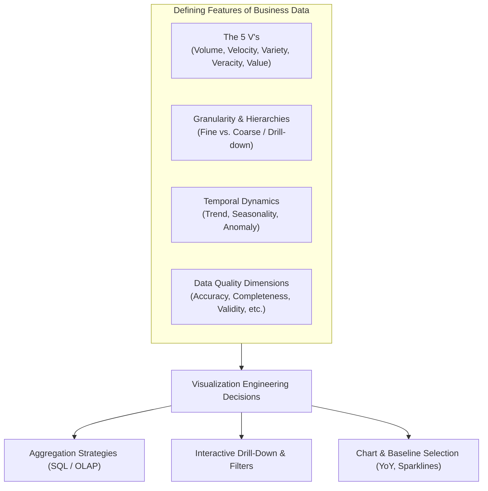
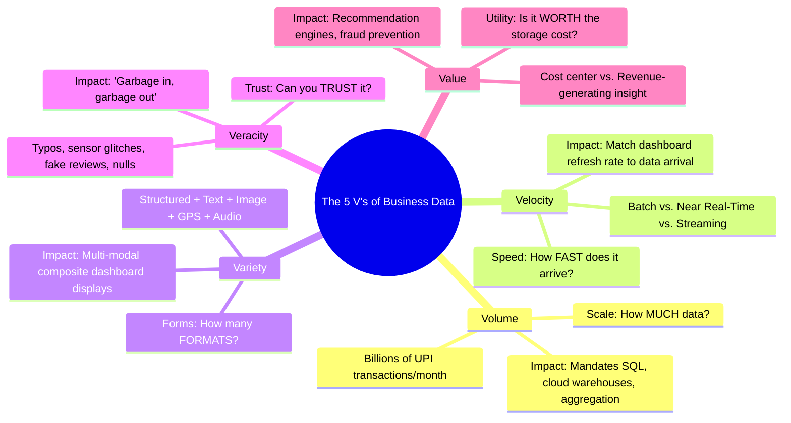
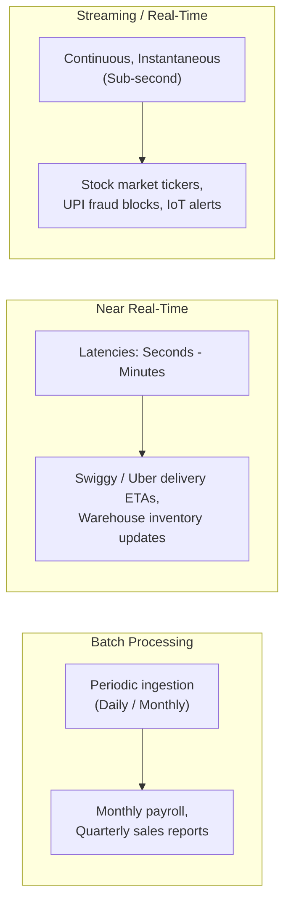
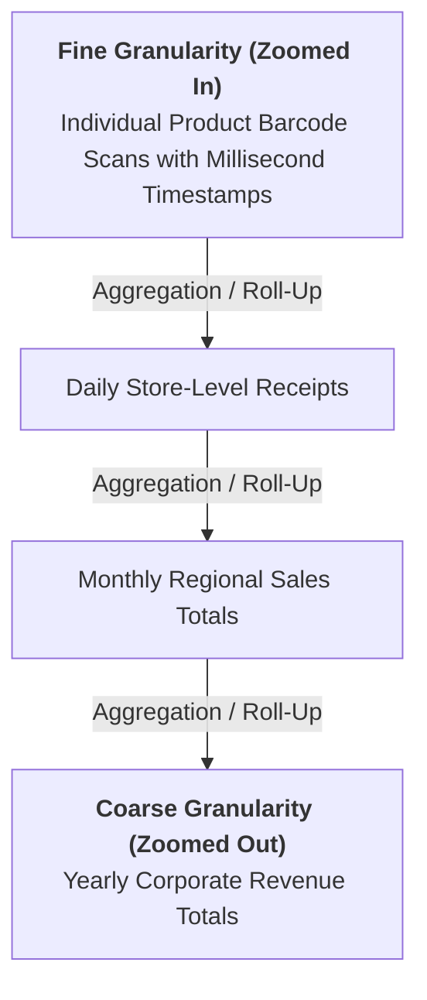
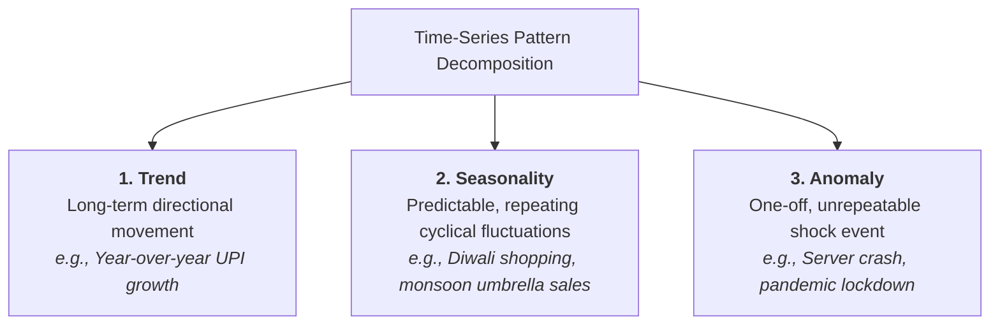
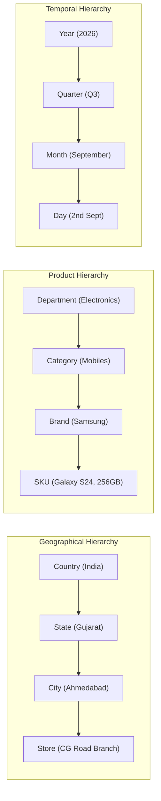
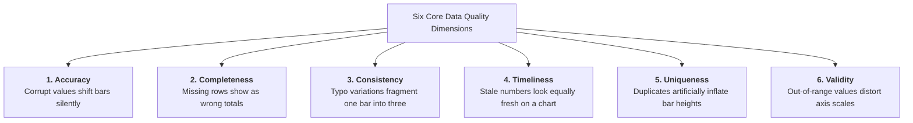
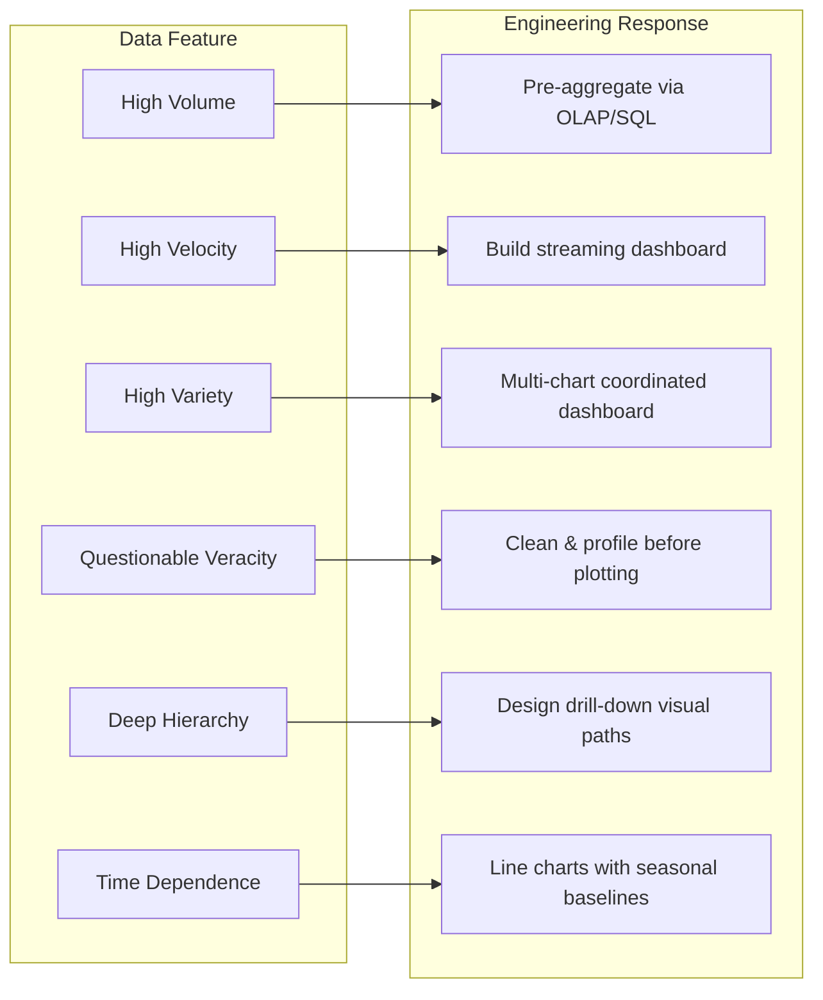

<Complete DAV Notes: Chapter 9 ? Features of Business Data>
> **Course:** Data Analysis and Visualisation (3CS103ME24)
> **Programme:** B.Tech (CSE), Integrated B.Tech (CSE)-MBA, B.Tech (Interdisciplinary Minor in Data Science), Semester V
> **Unit:** Unit II ? Business Data Visualization (Session 3 of 10)
> **Instructor / Industry Lead:** Mr. Pramathesh Shukla (Senior Data Analyst | Business Intelligence & Analytics)
> **Primary Source:** `Session-3_Features Business Data.pdf`
> **Files Integrated:** `Session-3_Features Business Data.pdf`, `u2_s3_text.txt`
</Complete DAV Notes: Chapter 9 ? Features of Business Data>

# Chapter 9 ? Features of Business Data (Unit II, Session 3)

---

## 1. Chapter Overview

Business data possesses unique operational, temporal, and structural characteristics that distinguish it from abstract mathematical datasets. Designing effective visual interfaces requires deep alignment between the underlying features of the data and the chosen graphical primitives. This chapter examines the canonical 5 V's framework, the granularity zoom trade-off, temporal pattern classification (trend, seasonality, anomaly), multi-dimensional hierarchies, the six dimensions of data quality viewed through a visual lens, and how data features dictate visualization engineering.

[Source: Session-3_Features Business Data.pdf, Slides 1-4, 23]

---

## 2. The 5 V's Framework of Business Data

The defining characteristics of modern enterprise data are captured by five foundational dimensions:

### The 5 V's Comparative Breakdown

| Dimension | Core Question | Real-World Enterprise Example | Impact on Data Analyst / BI Developer |
| :--- | :--- | :--- | :--- |
| **Volume** | *How much data exists?* | India's Unified Payments Interface (UPI) processing $>10$ billion transactions monthly. | Datasets exceed memory limits (Excel crashes at $10^6$ rows); necessitates SQL, columnar data warehouses (Snowflake, BigQuery), sampling, and OLAP aggregations. |
| **Velocity** | *How fast does new data arrive?* | IPL live ball-by-ball score feeds, real-time UPI fraud authorizations, Swiggy order tracking. | Demands tiered ingestion architectures (Batch vs. Near Real-Time vs. Event Streaming). Dashboards must match refresh cadence to event generation rate. |
| **Variety** | *How many distinct forms does it take?* | A single food delivery order includes tabular metadata, text delivery notes, food photos, GPS coordinate trails, and audio support recordings. | Analysts must join relational tables with unstructured blobs, text sentiment scores, and spatial geometries within unified data models. |
| **Veracity** | *How trustworthy and accurate is the data?* | Customer address typos ("Ahemdabad" vs. "AMD"), fake 5-star reviews, GPS bike tracking showing bikes in the ocean. | Untrusted data corrupts visual inference ("Garbage in, garbage out"). Rigorous data profiling, cleansing, and validation rules must precede reporting. |
| **Value** | *How useful is the data in driving business outcomes?* | E-commerce recommendation engines ("Customers who bought this also bought...") generating up to $35\%$ of revenue. | Storing data without analysis represents pure operational cost (cloud compute/storage bills). Analytical value emerges only when data drives actions. |

---

### Velocity Tiers in Enterprise Systems

> [!IMPORTANT]
> **The Velocity Alignment Rule:** Match analysis speed to data speed. Ingesting real-time streaming data but analyzing it on a monthly batch cadence squanders high-velocity business opportunities.

[Source: Session-3_Features Business Data.pdf, Slides 5-11]

---

## 3. Data Granularity: The Level of Detail

Granularity defines the atomic resolution or "zoom level" at which data records are stored and presented.

### The Granularity Trade-Off Matrix

| Feature | Fine Granularity (Atomic / Zoomed In) | Coarse Granularity (Aggregated / Zoomed Out) |
| :--- | :--- | :--- |
| **Information Density** | Complete raw fidelity; individual root causes traceable. | Summary level; high-level macro trends clearly visible. |
| **Computational Footprint**| Massive storage requirements; computationally expensive queries. | Lightweight; fast loading and sub-second query rendering. |
| **Visual Suitability** | Overwhelms human vision; causes visual clutter and overplotting. | Ideal for executive KPI scorecards and macro trendlines. |
| **Reversibility** | **Reversible:** Can always be aggregated (rolled up) to any coarse summary. | **Irreversible:** Detail is permanently destroyed; cannot be drilled into. |
| **Analytical Risk** | Easy to lose sight of the forest for the trees (noise). | Averages can conceal critical bimodal or opposing distributions. |

> [!TIP]
> **The Golden Architectural Rule:** **Store Fine, Report Coarse.** Always preserve fine-grained raw records in the underlying warehouse so that analysts can aggregate upward. Once data is aggregated at the storage layer, lost granular detail can never be recovered.

[Source: Session-3_Features Business Data.pdf, Slides 13-14]

---

## 4. Time-Dependence: Temporal Dynamics

Business events are intrinsically bound to timestamps. Time-series data exhibits three distinct behavioral components:

### Pattern Diagnostic Test

$$	ext{The Analyst's Forecasting Question: } 	ext{"Will this pattern repeat, continue, or never happen again?"}$$

* **Repeats on a regular cycle?** $\longrightarrow$ **Seasonality** (Model with periodic baselines and Year-over-Year comparisons).
* **Continues in the same direction?** $\longrightarrow$ **Trend** (Model with moving averages or linear/polynomial regression).
* **Never expected to recur?** $\longrightarrow$ **Anomaly** (Treat as an outlier; investigate root cause or filter from baseline forecasting).

### Real-World Example: IPL Match Broadcast Telemetry
* **Trend:** Total digital viewership climbs progressively across the 8-week tournament as playoffs approach.
* **Seasonality:** Concurrent viewer traffic dips systematically during every strategic timeout and spikes after every boundary.
* **Anomaly:** A sudden shock wicket or a last-ball match finish causes an unprecedented, unrepeatable surge in active stream requests.

[Source: Session-3_Features Business Data.pdf, Slides 15-18]

---

## 5. Dimensions and Hierarchies

Business data naturally organizes along multidimensional drill-down hierarchies. A **dimension** represents a categorical lens through which data is sliced, while a **hierarchy** represents nested parent-child levels of aggregation within that dimension.

### Role in Interactive Visualizations
Interactive dashboard filters (date selectors, regional cascading dropdowns, product category trees) are software implementations of hierarchical drill-downs. Moving down a hierarchy corresponds to increasing granularity ($	ext{Drill Down}$); moving up corresponds to decreasing granularity ($	ext{Roll Up}$).

[Source: Session-3_Features Business Data.pdf, Slides 19-20]

---

## 6. Data Quality Through a Visualization Lens

Data quality issues do not merely corrupt database records?they silently distort graphical representations, leading to catastrophic misinterpretations.

### How Data Quality Flaws Break Visualizations

| Quality Dimension | Database Reality | Specific Chart Failure / Distortion |
| :--- | :--- | :--- |
| **Accuracy** | Erroneous numeric price entered in transaction log. | A bar shifts height silently without raising visual alarms, misleading the viewer. |
| **Completeness** | Null or missing records for a regional warehouse. | The chart does not render an empty gap; it renders a confidently incorrect, suppressed total. |
| **Consistency** | Inconsistent categorical strings ("Ahemdabad", "Ahmedabad", "AMD"). | Instead of a single prominent regional bar, the visualization splits into three small, disjointed bars. |
| **Timeliness** | Outdated sales figures that failed to sync overnight. | Stale data points render with identical visual weight as fresh numbers, masking supply shortages. |
| **Uniqueness** | Duplicate transaction records caused by network retries. | Bar heights and line chart elevations inflate beyond actual sales volume. |
| **Validity** | Impossible values (e.g., customer $	ext{Age} = 250$). | A single extreme value dramatically expands the axis limit, compressing legitimate variance into an unreadable flatline. |

### The Real-World Financial Cost of Dirty Data
* **Delivery Logistics:** Invalid customer addresses result in failed first-time parcel deliveries, doubling shipping costs.
* **Targeted Marketing:** Duplicate user IDs trigger multi-channel email spam to the same recipient, burning marketing budget and increasing unsubscribe rates.
* **Executive Capital Allocation:** Miscalculated regional revenue dashboards mislead leadership into closing profitable retail stores.
* **Erosion of Dashboard Trust:** Once an executive discovers a single material inaccuracy in an enterprise dashboard, institutional trust in all visual reports collapses.

[Source: Session-3_Features Business Data.pdf, Slides 21-22]

---

## 7. How Data Features Dictate Visualization Choices

The structural and behavioral features of data determine every visualization engineering choice:

1. **Volume is Massive:** Pre-aggregate in database layers before rendering; never plot millions of raw SVG nodes.
2. **Velocity is Near Real-Time:** Deploy dynamic dashboard push architectures (WebSockets) rather than static periodic reports.
3. **Variety is Mixed:** Combine coordinated charts (relational bar charts + spatial choropleths + text word clouds) on a single unified canvas.
4. **Veracity is Suspect:** Execute automated data profiling and cleaning prior to visualization; never visualize unvalidated data.
5. **Hierarchies Exist:** Implement Ben Shneiderman's Visual Information Seeking Mantra: *"Overview first, zoom and filter, then details-on-demand."*
6. **Time-Dependent:** Plot chronological line charts using Year-over-Year (YoY) baselines to isolate true trends from seasonal spikes.

[Source: Session-3_Features Business Data.pdf, Slide 23]

---

## 8. Mega Case Study: National Festival Flash Sale

A multi-billion-rupee annual festival sale (e.g., Diwali / Big Billion Days) stress-tests all business data features simultaneously:

| Feature Dimension | Operational Manifestation During Festival Flash Sale |
| :--- | :--- |
| **Volume** | Ingesting seven days of transaction volume equivalent to an entire normal business quarter ($>10^8$ rows). |
| **Velocity** | Live operational ticker refreshing every 500 ms for concurrent inventory and payment gateway traffic. |
| **Variety** | Processing payment records, customer reviews, damaged parcel photos, delivery rider GPS, and customer support chats. |
| **Veracity** | Filtering bot traffic, fraudulent multi-coupon abusers, and payment gateway false-declines in real time. |
| **Granularity** | Executive leadership monitors hourly GMV totals (coarse); infrastructure engineers inspect sub-second latency spikes (fine). |
| **Seasonality** | Current revenue is benchmarked exclusively against the prior year's festival week?never against the previous month. |

[Source: Session-3_Features Business Data.pdf, Slide 24]

---

## 9. Definition Sheet

* **Volume:** The sheer physical scale and magnitude of stored enterprise event records.
* **Velocity:** The speed and latency at which data is generated, ingested, processed, and rendered.
* **Variety:** The structural diversity of data formats (structured, unstructured, spatial, multimedia).
* **Veracity:** The truthfulness, reliability, completeness, and cleanliness of data records.
* **Value:** The tangible business benefit and operational decision support extracted from data assets.
* **Granularity:** The level of structural detail represented by an individual record in a dataset.
* **Trend:** A consistent, long-term monotonic movement in a time-series metric.
* **Seasonality:** Periodic, predictable fluctuations occurring at regular recurring calendar intervals.
* **Anomaly:** An unexpected, unrepeatable statistical outlier or one-off operational deviation.
* **Dimension:** A categorical entity or perspective along which quantitative metrics are sliced.
* **Hierarchy:** An ordered series of nested aggregation levels within a dimension facilitating drill-down and roll-up.

---

## 10. Exam-Oriented Review

### Important Comparisons

| Comparison Pair | Key Differentiating Principle |
| :--- | :--- |
| **Trend vs. Seasonality** | Trends represent long-term directional movement continuing over years; Seasonality represents cyclical fluctuations that repeat on fixed schedules (daily, weekly, annual). |
| **Fine vs. Coarse Granularity** | Fine granularity preserves full atomic detail for root-cause diagnosis but carries high storage/compute overhead; Coarse granularity provides fast macro insights but permanently destroys atomic detail. |
| **Accuracy vs. Validity** | Accuracy refers to whether a value reflects real-world truth ($25\$$ vs. $250\$$); Validity refers to whether a value conforms to syntactic domain constraints (e.g., $\text{Age} = -5$ or $250$ violates biological validity). |
| **Batch vs. Streaming Velocity** | Batch processes accumulated data in bulk at scheduled intervals; Streaming processes individual events immediately upon generation with sub-second latencies. |

### Potential Exam Questions
1. **Framework Analysis:** Name and define the 5 V's of business data, illustrating each dimension with a real-world enterprise example.
2. **Architectural Principles:** Explain the rationale behind the architectural rule *"Store fine, report coarse"*. What irreversible risks occur if violated?
3. **Time-Series Classification:** Given telemetry logs from an e-commerce platform, how do you distinguish between a trend, a seasonal pattern, and an operational anomaly?
4. **Data Quality Impact:** Discuss how inconsistencies in customer city naming ("Ahmedabad" vs. "AMD") distort a standard regional sales bar chart.
5. **Case Synthesis:** Trace how the 5 V's and data granularity operate concurrently during a massive e-commerce flash festival sale.
