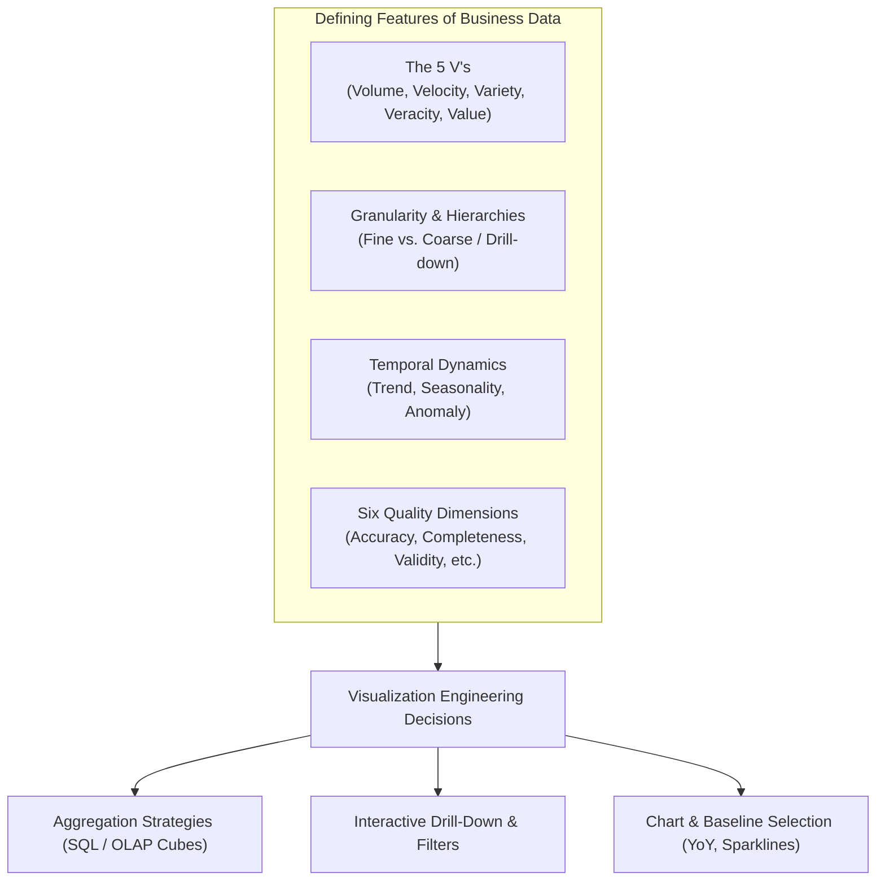
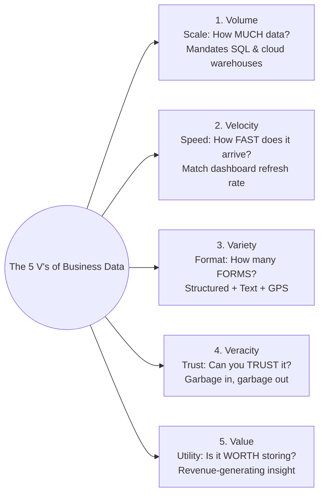
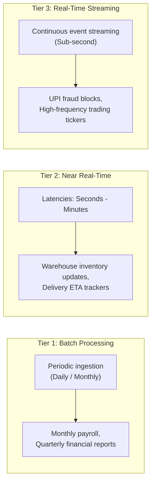
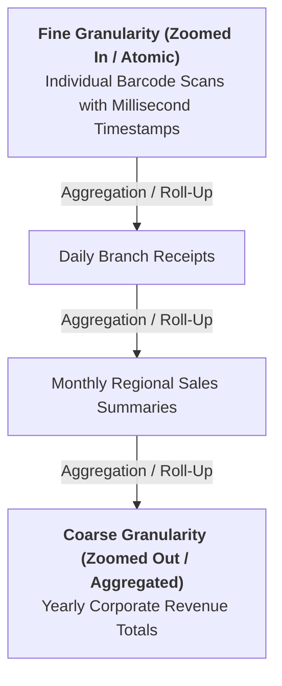
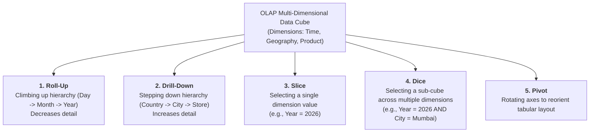
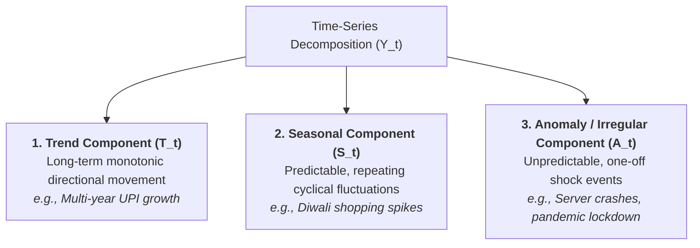
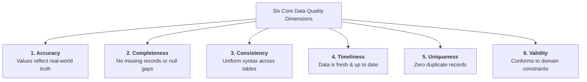
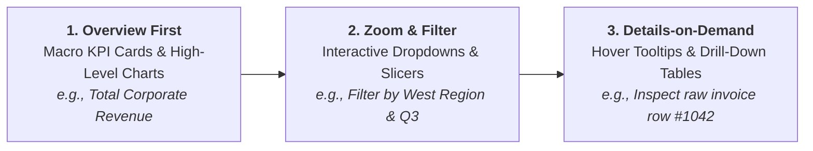

# Chapter 9 — Features of Business Data

> **Course:** Data Analysis and Visualisation (3CS103ME24)  
> **Programme:** B.Tech (CSE), Integrated B.Tech (CSE)-MBA, B.Tech (Interdisciplinary Minor in Data Science), Semester V  
> **Unit:** Unit II — Business Data Visualization (Session 3 of 10)  
> **Instructor / Industry Lead:** Mr. Pramathesh Shukla (Senior Data Analyst | Business Intelligence & Analytics)  
> **Primary Source:** `Session-3_Features Business Data.pdf`  
> **Files Integrated:** `Session-3_Features Business Data.pdf`, `u2_s3_text.txt`  

---

## 1. Chapter Overview

Business data possesses unique operational, temporal, and structural characteristics that distinguish it from abstract mathematical datasets. Designing effective visual interfaces and analytical pipelines requires deep alignment between underlying data features and visual engineering decisions.

This chapter details the 5 V's framework of enterprise data, data granularity zoom levels, OLAP multi-dimensional data cube operations, time-series pattern decomposition (trend, seasonality, anomaly), the six dimensions of data quality viewed through a visual lens, Ben Shneiderman's Visual Information Seeking Mantra, and architectural decision frameworks.



[Source: Session-3_Features Business Data.pdf, Slides 1-4, 23]

---

## 2. The 5 V's Framework of Business Data

The operational scale and complexity of modern business data are defined by five core dimensions:



### Comprehensive 5 V's Breakdown & Engineering Stack

| Dimension | Core Analytical Question | Real-World Enterprise Example | Impact on BI & Technical Architecture |
| :--- | :--- | :--- | :--- |
| **Volume** | *How much physical storage does the data occupy?* | India's UPI network processing $>10 \text{ billion}$ transactions monthly. | Exceeds local memory limits (Excel crashes at $10^6$ rows). Requires columnar cloud warehouses (Snowflake, BigQuery), SQL aggregation, and OLAP indexing. |
| **Velocity** | *At what latency does new data arrive and require processing?* | Live stock market tickers, real-time UPI fraud authorizations, delivery vehicle GPS. | Demands tiered ingestion architectures (Batch vs Near Real-Time vs Event Streaming via Kafka). Dashboard refresh rates must align with data velocity. |
| **Variety** | *How many heterogeneous data formats are combined?* | An e-commerce order combining SQL tables, customer reviews, delivery photos, and GPS routes. | Requires data lakehouses (Databricks, Delta Lake) capable of unifying structured SQL tables with unstructured text and spatial vector geometries. |
| **Veracity** | *How accurate, trustworthy, and clean is the data?* | Typos in shipping addresses ("Ahemdabad" vs "AMD"), fake bot reviews, missing telemetry. | Untrusted data corrupts visual inference ("Garbage in, garbage out"). Mandates automated data profiling, validation rules (dbt), and cleaning pipelines. |
| **Value** | *What measurable financial or operational ROI is derived?* | Recommendation engines ("Customers who bought this also bought...") driving $35\%$ of sales. | Storing unanalyzed data is a financial liability (cloud storage bills). Business value emerges only when data drives actionable decisions. |

---

### Velocity Ingestion Tiers



> [!IMPORTANT]
> **The Velocity Alignment Principle:** Ingesting real-time streaming data but analyzing it on a monthly batch report squanders high-velocity business opportunities.

[Source: Session-3_Features Business Data.pdf, Slides 5-11]

---

## 3. Data Granularity & OLAP Data Cubes

Granularity defines the atomic resolution or "zoom level" of stored data records.



### Granularity Trade-Off Matrix

| Dimension | Fine Granularity (Atomic / Zoomed In) | Coarse Granularity (Aggregated / Zoomed Out) |
| :--- | :--- | :--- |
| **Fidelity & Detail** | Complete raw fidelity; individual root causes traceable. | Summary level; macro trends and high-level KPIs visible. |
| **Compute & Memory** | Massive storage footprint; expensive query execution. | Lightweight; sub-second query rendering on dashboards. |
| **Visual Suitability** | Overwhelms human vision; causes visual clutter and overplotting. | Ideal for executive scorecards and high-level trendlines. |
| **Reversibility** | **Reversible:** Can always be aggregated (rolled up) to any level. | **Irreversible:** Detail is permanently destroyed; cannot drill in. |

> [!TIP]
> **The Golden Architectural Rule:** **Store Fine, Report Coarse.** Always store atomic-level raw data in the data warehouse so analysts can execute drill-downs. Never store only pre-aggregated summaries.

---

### Non-Additive Aggregation Traps

Not all numeric metrics can be aggregated using standard `SUM()`.

1. **Additive Metrics:** Can be summed across all dimensions (e.g., Sales Revenue, Quantity Sold).
2. **Semi-Additive Metrics:** Can be summed across some dimensions but not time (e.g., Inventory Balance, Account Cash Balance). Summing account balance over 30 days yields meaningless numbers; `LAST()` or `AVERAGE()` must be used.
3. **Non-Additive Metrics:** Cannot be summed across any dimension (e.g., Ratios, Percentages, Unit Prices, Averages).

> [!CAUTION]
> **Averaging Averages Anti-Pattern:**  
> If Branch A has 10 sales averaging $\$100$ (Total $\$1,000$) and Branch B has 90 sales averaging $\$200$ (Total $\$18,000$), the naive average of averages is $\frac{100 + 200}{2} = \$150$.  
> The true weighted average is $\frac{1,000 + 18,000}{10 + 90} = \frac{19,000}{100} = \mathbf{\$190}$!

---

### Multi-Dimensional OLAP Cube Operations



[Source: Session-3_Features Business Data.pdf, Slides 13-14, 19-20]

---

## 4. Time-Dependence & Time-Series Decomposition

Business metrics are fundamentally temporal. A time-series $Y_t$ is decomposed into three structural components:



### Mathematical Decomposition Models

#### 1. Additive Decomposition Model
Used when seasonal variations are constant in magnitude regardless of overall trend level:

$$
Y_t = T_t + S_t + A_t
$$

#### 2. Multiplicative Decomposition Model
Used when seasonal variations expand proportionally with the overall trend level:

$$
Y_t = T_t \times S_t \times A_t
$$

---

### Step-by-Step Numerical Worked Example: Seasonal Index Calculation

#### Given Quarterly Sales Data over 2 Years ($Y_t$ in $\$1,000\text{s}$)

| Year | Quarter | Raw Sales ($Y_t$) | 4-Quarter Centered Moving Average Trend ($T_t$) | Seasonal-Irregular Ratio ($\frac{Y_t}{T_t}$) |
| :--- | :---: | :---: | :---: | :---: |
| **Year 1** | Q1 | $\$80$ | — | — |
| | Q2 | $\$120$ | — | — |
| | Q3 | $\$90$ | $\$100.0$ | $\frac{90}{100.0} = 0.90$ |
| | Q4 | $\$150$ | $\$105.0$ | $\frac{150}{105.0} = 1.428$ |
| **Year 2** | Q1 | $\$96$ | $\$110.0$ | $\frac{96}{110.0} = 0.872$ |
| | Q2 | $\$144$ | $\$115.0$ | $\frac{144}{115.0} = 1.252$ |
| | Q3 | $\$108$ | — | — |
| | Q4 | $\$180$ | — | — |

#### Step 1: Average Seasonal Ratios by Quarter
* **Q1 Average Ratio:** $0.872$
* **Q2 Average Ratio:** $1.252$
* **Q3 Average Ratio:** $0.900$
* **Q4 Average Ratio:** $1.428$

$$\text{Sum of Ratios} = 0.872 + 1.252 + 0.900 + 1.428 = 4.452$$

#### Step 2: Normalize Seasonal Indices (Ensuring sum equals $4.0$)

$$\text{Normalization Factor} = \frac{4.00}{4.452} \approx 0.8985$$

* **$S_{\text{Q1}} = 0.872 \times 0.8985 = \mathbf{0.783} \quad (21.7\% \text{ below average baseline})$**
* **$S_{\text{Q2}} = 1.252 \times 0.8985 = \mathbf{1.125} \quad (12.5\% \text{ above average baseline})$**
* **$S_{\text{Q3}} = 0.900 \times 0.8985 = \mathbf{0.809} \quad (19.1\% \text{ below average baseline})$**
* **$S_{\text{Q4}} = 1.428 \times 0.8985 = \mathbf{1.283} \quad (28.3\% \text{ above average baseline})$**

> [!NOTE]
> **Interpretation:** Quarter 4 systematically experiences a $28.3\%$ surge above the annual baseline due to festival holiday demand.

[Source: Session-3_Features Business Data.pdf, Slides 15-18]

---

## 5. The Six Dimensions of Data Quality

Data quality flaws corrupt graphical representations, leading to misleading dashboards and failed decisions:



### Visual Impact of Data Quality Flaws

| Quality Dimension | Formal Definition | Database Reality | Specific Chart Failure / Deception |
| :--- | :--- | :--- | :--- |
| **Accuracy** | Extent to which data correctly describes real-world entities. | Erroneous numeric price entered in transaction log. | A bar shifts height silently without raising visual alarms, misleading viewers. |
| **Completeness** | Degree to which all required data records are present. | Null or missing records for a regional warehouse. | The chart does not show a gap; it renders a confidently incorrect, suppressed total. |
| **Consistency** | Uniformity of syntax and data values across systems. | Inconsistent city strings ("Ahemdabad", "Ahmedabad", "AMD"). | Instead of one prominent regional bar, the chart fragments into three small disjointed bars. |
| **Timeliness** | Availability of data when required for decision-making. | Stale sales numbers that failed to sync overnight. | Stale data renders with identical visual weight as fresh data, masking stockouts. |
| **Uniqueness** | Freedom from duplicate records. | Duplicate transaction records caused by network retries. | Bar heights and line chart elevations inflate beyond actual sales volume. |
| **Validity** | Conformity to domain syntax and range constraints. | Impossible values (e.g., customer $\text{Age} = -5$ or $250$). | An extreme invalid value expands the axis scale, compressing valid data into a flatline. |

[Source: Session-3_Features Business Data.pdf, Slides 21-22]

---

## 6. Shneiderman's Visual Information Seeking Mantra

Ben Shneiderman established the foundational visual design principle for multi-dimensional data interfaces:

$$
\mathbf{\text{“Overview first, zoom and filter, then details-on-demand.”}}
$$



### Implementation Rules for Dashboard Design
1. **Top Level (Overview):** Present macro KPI scorecards and high-level trendlines at the top-left of the canvas.
2. **Middle Level (Zoom & Filter):** Provide global slicers (date range, region, product category) allowing users to isolate sub-cubes.
3. **Bottom Level (Details-on-Demand):** Utilize hover tooltips and clickable pop-up tables to inspect atomic transaction records without leaving the screen.

[Source: Session-3_Features Business Data.pdf, Slide 23]

---

## 7. Consolidated Formula Sheet

1. **Seasonal Index (Multiplicative Model):**
   $$
   S_t = \frac{Y_t}{T_t}
   $$

2. **Deseasonalized Time-Series:**
   $$
   d_t = \frac{Y_t}{S_t} = T_t \times A_t
   $$

3. **Data Completeness Ratio:**
   $$
   \text{Completeness \%} = \left( \frac{\text{Number of Non-Null Records}}{\text{Total Expected Records}} \right) \times 100
   $$

4. **Weighted Average Formula (Avoiding Averaging Averages):**
   $$
   \bar{X}_{\text{Weighted}} = \frac{\sum_{i=1}^k w_i \cdot \bar{x}_i}{\sum_{i=1}^k w_i}
   $$

---

## 8. Definition Sheet

* **Volume:** The physical scale and storage magnitude of enterprise data records.
* **Velocity:** The speed and latency at which data is generated, ingested, and rendered.
* **Variety:** The structural diversity of data formats (structured, semi-structured, unstructured).
* **Veracity:** The truthfulness, accuracy, completeness, and reliability of data records.
* **Value:** The operational and financial utility extracted from data assets.
* **Granularity:** The structural level of detail represented by an individual data record.
* **Trend ($T_t$):** Long-term monotonic directional movement in a time-series metric.
* **Seasonality ($S_t$):** Predictable cyclical fluctuations repeating at regular calendar intervals.
* **Anomaly ($A_t$):** One-off, unpredictable statistical outlier or operational shock.
* **OLAP Data Cube:** A multi-dimensional array structure facilitating rapid slice, dice, roll-up, and drill-down analysis.
* **Shneiderman's Mantra:** Visual interface design principle: "Overview first, zoom and filter, then details-on-demand."

---

## 9. Comprehensive 5-Marker & 10-Marker University Solved Question Bank

### Core Concept Comparisons Matrix

| Comparison Pair | Key Differentiating Principle |
| :--- | :--- |
| **Trend vs. Seasonality** | Trends represent multi-year monotonic directional movements; Seasonality represents cyclical fluctuations repeating on fixed calendar schedules. |
| **Fine vs. Coarse Granularity** | Fine granularity preserves full atomic detail for root-cause diagnosis; Coarse granularity provides fast macro insights but permanently destroys atomic detail. |
| **Accuracy vs. Validity** | Accuracy measures whether a value matches real-world truth; Validity measures whether a value satisfies syntactic domain rules (e.g., $\text{Age} \ge 0$). |
| **Roll-Up vs. Drill-Down** | Roll-Up moves up a hierarchy to decrease detail (Day $\rightarrow$ Month); Drill-Down moves down a hierarchy to increase detail (Country $\rightarrow$ City). |

---

### Question 1 [10 Marks] — Full Multiplicative Time-Series Decomposition & Seasonal Index Derivation

**Question Statement:**  
An enterprise e-commerce platform records 8 quarters of quarterly sales revenue ($Y_t$ in $\$1,000\text{s}$) over 2 consecutive years ($2025 - 2026$):

| Year | Quarter | Raw Sales ($Y_t$) |
| :--- | :---: | :---: |
| **2025** | Q1 | $\$100$ |
| | Q2 | $\$150$ |
| | Q3 | $\$110$ |
| | Q4 | $\$200$ |
| **2026** | Q1 | $\$120$ |
| | Q2 | $\$180$ |
| | Q3 | $\$130$ |
| | Q4 | $\$240$ |

**Task Requirements:**  
1. State the Multiplicative Time-Series Decomposition Model ($Y_t = T_t \times S_t \times A_t$) and explain each component. [2 Marks]
2. Compute the 4-Quarter Centered Moving Average Trend ($T_t$) for all eligible quarters. [3 Marks]
3. Calculate the Seasonal-Irregular ratios ($\frac{Y_t}{T_t}$) and derive the normalized Quarterly Seasonal Indices ($S_{\text{Q1}}, S_{\text{Q2}}, S_{\text{Q3}}, S_{\text{Q4}}$). [3 Marks]
4. Deseasonalize the 2026 Q4 sales figure ($\$240$) and explain its business significance for inventory planning. [2 Marks]

---

#### Full Step-by-Step Solution:

##### Part 1: Multiplicative Model Overview
$$
Y_t = T_t \times S_t \times A_t
$$
* $Y_t$: Observed raw time-series metric at time $t$.
* $T_t$: Long-term monotonic trend component.
* $S_t$: Seasonal index component (repeating annual cycle, centered at $1.0$).
* $A_t$: Irregular / anomaly component (random statistical noise).

##### Part 2: 4-Quarter Centered Moving Average ($T_t$) Calculations

To calculate centered moving average for 4 quarters (even period $k=4$), compute uncentered 4-quarter sums, uncentered averages, and then 2-period centered moving averages:

1. **Uncentered Sum ($t=2$, Q2 2025):** $100 + 150 + 110 + 200 = 560 \implies \text{Avg} = 140.0$
2. **Uncentered Sum ($t=3$, Q3 2025):** $150 + 110 + 200 + 120 = 580 \implies \text{Avg} = 145.0$
   * **Centered $T_3$ (Q3 2025):** $\frac{140.0 + 145.0}{2} = \mathbf{142.50}$

3. **Uncentered Sum ($t=4$, Q4 2025):** $110 + 200 + 120 + 180 = 610 \implies \text{Avg} = 152.5$
   * **Centered $T_4$ (Q4 2025):** $\frac{145.0 + 152.5}{2} = \mathbf{148.75}$

4. **Uncentered Sum ($t=5$, Q1 2026):** $200 + 120 + 180 + 130 = 630 \implies \text{Avg} = 157.5$
   * **Centered $T_5$ (Q1 2026):** $\frac{152.5 + 157.5}{2} = \mathbf{155.00}$

5. **Uncentered Sum ($t=6$, Q2 2026):** $120 + 180 + 130 + 240 = 670 \implies \text{Avg} = 167.5$
   * **Centered $T_6$ (Q2 2026):** $\frac{157.5 + 167.5}{2} = \mathbf{162.50}$

##### Part 3: Seasonal Ratios & Normalized Seasonal Index Derivation

| Quarter | $Y_t$ | Centered Trend ($T_t$) | Ratio $\frac{Y_t}{T_t}$ |
| :---: | :---: | :---: | :---: |
| **Q3 2025** | $\$110$ | $142.50$ | $\frac{110}{142.50} = 0.7719$ |
| **Q4 2025** | $\$200$ | $148.75$ | $\frac{200}{148.75} = 1.3445$ |
| **Q1 2026** | $\$120$ | $155.00$ | $\frac{120}{155.00} = 0.7742$ |
| **Q2 2026** | $\$180$ | $162.50$ | $\frac{180}{162.50} = 1.1077$ |

* **Average Ratio for Q1:** $0.7742$
* **Average Ratio for Q2:** $1.1077$
* **Average Ratio for Q3:** $0.7719$
* **Average Ratio for Q4:** $1.3445$
* **Sum of Raw Ratios:** $0.7742 + 1.1077 + 0.7719 + 1.3445 = 3.9983 \approx 4.00$

Since the sum is virtually $4.00$, the normalized Seasonal Indices are:
* **$S_{\text{Q1}} = \mathbf{0.774} \quad (22.6\% \text{ below annual baseline})$**
* **$S_{\text{Q2}} = \mathbf{1.108} \quad (10.8\% \text{ above annual baseline})$**
* **$S_{\text{Q3}} = \mathbf{0.772} \quad (22.8\% \text{ below annual baseline})$**
* **$S_{\text{Q4}} = \mathbf{1.345} \quad (34.5\% \text{ above annual baseline})$**

##### Part 4: Deseasonalization & Inventory Takeaway
* **Deseasonalize 2026 Q4 Sales ($\$240$):**
  $$
  d_t = \frac{Y_{\text{Q4}}}{S_{\text{Q4}}} = \frac{\$240}{1.345} = \mathbf{\$178.44}
  $$
* **Business Takeaway:** Although actual Q4 raw sales were $\$240$, the true underlying baseline trend performance (excluding the $34.5\%$ holiday surge) is $\$178.44$. Inventory managers must plan Q4 stock additions based on $1.345 \times \text{Baseline}$ to avoid Q4 stockouts. $\blacksquare$

---

### Question 2 [10 Marks] — The 5 V's of Big Data & Shneiderman's Dashboard Mantra

**Question Statement:**  
1. **The 5 V's Architecture Alignment [5 Marks]:** Construct a comprehensive table for the 5 V's (Volume, Velocity, Variety, Veracity, Value) detailing Definition, Real-World Enterprise Example, and Required Technology Stack Response.
2. **Shneiderman's Mantra UI Architecture [5 Marks]:** Explain Ben Shneiderman's Visual Information Seeking Mantra ("Overview first, zoom and filter, then details-on-demand") and sketch a 3-tier enterprise dashboard layout incorporating this principle.

---

#### Full Step-by-Step Solution:

##### Part 1: The 5 V's & Tech Stack Alignment Matrix

| Dimension | Definition | Enterprise Real-World Example | Tech Stack Architecture Response |
| :--- | :--- | :--- | :--- |
| **Volume** | Massive physical scale of data records. | UPI processing $>10\text{B}$ monthly transactions. | Columnar Data Lakes/Warehouses (Snowflake, BigQuery, Spark SQL). |
| **Velocity** | Latency and speed of incoming data streams. | Live stock tickers, delivery fleet GPS. | Streaming Event Ingestion (Apache Kafka, Flink, WebSockets). |
| **Variety** | Heterogeneous data formats (text, tables, audio). | Order logs + food photos + audio support files. | Unified Data Lakehouse (Databricks Delta Lake, AWS S3). |
| **Veracity** | Accuracy, completeness, and trust of data. | Typos in shipping addresses ("Ahemdabad"). | Automated Data Profiling & Quality Rules (dbt, Great Expectations). |
| **Value** | Tangible business ROI derived from analysis. | E-commerce recommendation engines. | ML Feature Stores, Real-time Recommendation APIs. |

##### Part 2: Shneiderman's Information Seeking Mantra & Dashboard Layout

$$
\mathbf{\text{“Overview first, zoom and filter, then details-on-demand.”}}
$$

```
+-------------------------------------------------------------------------+
| TIER 1: OVERVIEW FIRST (Top Banner KPI Scorecards)                     |
| [ Total Revenue: $12.5M ]  [ Active Users: 450K ]  [ Churn Rate: 1.2% ]   |
+-------------------------------------------------------------------------+
| TIER 2: ZOOM & FILTER (Global Interactive Slicers & High-Level Charts)  |
| Date Range: [ Q3 2026 v ]  Region: [ West v ]  Category: [ Electronics v]|
| +-----------------------------------+ +-------------------------------+ |
| | Monthly Sales Trend Line Chart    | | Regional Share Donut Chart    | |
| +-----------------------------------+ +-------------------------------+ |
+-------------------------------------------------------------------------+
| TIER 3: DETAILS-ON-DEMAND (Granular Atomic Drill-Down Data Grid)       |
| Click bar to reveal row details:                                       |
| Order_ID | Customer Name | Transaction Date | Amount | SLA Status     |
| 10482    | Alice Smith   | 2026-09-02       | $450   | Delivered      |
+-------------------------------------------------------------------------+
```

* **Tier 1 (Overview):** Top-left KPI summary scorecards providing immediate macro status.
* **Tier 2 (Zoom & Filter):** Global dropdown slicers allowing users to isolate specific sub-cubes.
* **Tier 3 (Details-on-Demand):** Interactive bottom data grid updating on hover/click to expose granular transaction invoices. $\blacksquare$

---

### Question 3 [5 Marks] — Non-Additive Aggregation & Averaging Averages Proof

**Question Statement:**  
An enterprise retail chain operates three regional branches:
* **Branch A:** 100 sales transactions, average purchase = $\$10$
* **Branch B:** 900 sales transactions, average purchase = $\$50$

1. Mathematically prove why taking a simple average of the branch averages ($\frac{10 + 50}{2} = \$30$) is incorrect. [2 Marks]
2. Compute the true weighted average purchase value across all transactions. [3 Marks]

---

#### Full Step-by-Step Solution:

##### Part 1: Proof of Non-Additive Failure
A simple average treats both branches with equal $50\%$ weight ($\frac{1}{2} + \frac{1}{2}$), ignoring the fact that Branch B processed $9\times$ more transactions ($900$ vs $100$) than Branch A. Since averages are **non-additive metrics**, simple averages produce biased, incorrect results when sample sizes $N_i$ differ.

##### Part 2: Weighted Average Derivation

1. **Calculate Total Revenue for Branch A:**
   $$\text{Revenue}_A = N_A \times \bar{x}_A = 100 \times \$10 = \$1,000$$

2. **Calculate Total Revenue for Branch B:**
   $$\text{Revenue}_B = N_B \times \bar{x}_B = 900 \times \$50 = \$45,000$$

3. **Calculate Total Revenue & Total Transactions:**
   $$\text{Total Revenue} = \$1,000 + \$45,000 = \$46,000$$
   $$\text{Total Transactions} = 100 + 900 = 1,000$$

4. **Compute True Weighted Average ($\bar{X}_{\text{Weighted}}$):**
   $$
   \bar{X}_{\text{Weighted}} = \frac{\sum N_i \cdot \bar{x}_i}{\sum N_i} = \frac{\$46,000}{1,000} = \mathbf{\$46.00}
   $$

**Conclusion:** The simple average ($\$30.00$) severely underestimated the true average purchase value ($\$46.00$) by **$\$16.00$ ($34.8\%$)**! $\blacksquare$

---

### Question 4 [5 Marks] — The Six Dimensions of Data Quality & Visual Chart Failures

**Question Statement:**  
List the six core Data Quality dimensions (Accuracy, Completeness, Consistency, Timeliness, Uniqueness, Validity). Explain how syntactic inconsistencies (`"Mumbai"`, `"BOMBAY"`, `"mumbai "`) and missing `NULL` values distort an enterprise sales column chart. [5 Marks]

---

#### Full Step-by-Step Solution:

##### Part 1: Six Data Quality Dimensions
1. **Accuracy:** Degree to which data records reflect real-world truth.
2. **Completeness:** Absence of missing values or unrecorded null gaps.
3. **Consistency:** Uniform syntactic representation across systems.
4. **Timeliness:** Freshness of data relative to decision deadlines.
5. **Uniqueness:** Freedom from duplicate records.
6. **Validity:** Conformity to domain syntax and range rules.

##### Part 2: Visual Chart Failure Case Analysis
* **Consistency Flaw (`"Mumbai"`, `"BOMBAY"`, `"mumbai "`):** An uncleaned bar chart groups categories by string value. Instead of displaying a single prominent bar representing total Mumbai sales ($9,500$ units), the chart fragments into three separate small bars, hiding Mumbai's true market dominance.
* **Completeness Flaw (`NULL` values):** When regional warehouse data contains missing records, BI tools default to omitting null rows. The chart renders a confidently incorrect, suppressed total without raising visual warnings, misleading executives into assuming underperformance. $\blacksquare$

