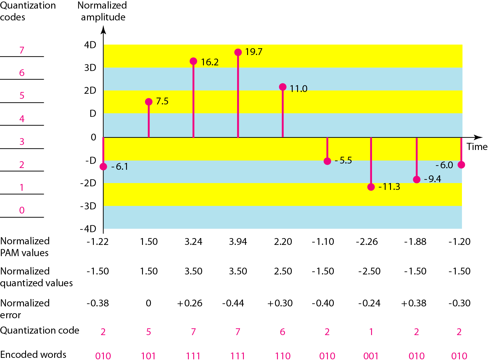

# Chapter 4 — Digital Transmission

## 1. Document & Chapter Overview

- **Subject:** Digital-to-Digital & Analog-to-Digital Conversion
- **Source:** Reference Material - Chapter 4.pptx

## 2. Line Coding Schemes Comparison

| Scheme Category | Specific Line Code | Voltage Levels | Self-Synchronization | DC Component | Key Characteristics | Source Tag |
| --- | --- | --- | --- | --- | --- | --- |

| **Unipolar** | Unipolar NRZ | Positive & Zero ($+V, 0$) | No | Yes (High DC) | Simple, wasteful power | [Source: Ch 4, Slide 5] |

| **Polar** | NRZ-L (Level) | Positive & Negative ($+V, -V$) | No | No | Level represents 0/1 | [Source: Ch 4, Slide 8] |

| **Polar** | NRZ-I (Invert) | Transition vs No Transition | No | No | Transition on 1, no transition on 0 | [Source: Ch 4, Slide 9] |

| **Polar** | RZ (Return to Zero) | $+V, 0, -V$ (3 levels) | Yes (Mid-bit transition) | No | Requires double bandwidth | [Source: Ch 4, Slide 11] |

| **Biphase** | Manchester | Transition at mid-bit | Yes (Excellent) | No | High-to-Low = 0, Low-to-High = 1 | [Source: Ch 4, Slide 13] |

| **Biphase** | Differential Manchester | Mid-bit transition + start transition | Yes | No | Always mid transition; start transition on 0 | [Source: Ch 4, Slide 14] |

| **Bipolar** | AMI (Alternate Mark Inversion) | $+V, 0, -V$ | Partial | No | 0 is zero voltage; 1 alternates $+V$ and $-V$ | [Source: Ch 4, Slide 16] |

### Line Coding Waveforms Figure

[Source: Reference Material - Chapter 4.pptx, Slide 7]

## 3. Pulse Code Modulation (PCM)

### PCM 3-Step Process (Sampling, Quantization, Encoding)

### Nyquist Sampling Rate Theorem

$$
f_s \ge 2 \times f_{\max}
$$

**Where:** $f_s$ is the sampling rate in samples/sec, and $f_{\max}$ is the maximum frequency contained in the analog signal.

### Worked Example: Audio PCM Bit Rate Calculation

**Given:** Human voice signal with max frequency $f_{\max} = 4000\text{ Hz}$. Signal is sampled at Nyquist rate and quantized into $L = 256$ levels ($n = 8$ bits per sample).

1. **Sampling Rate $f_s$:**

$$
f_s = 2 \times 4000 = 8000\text{ samples/sec}
$$

2. **Bit Rate $R_b$:**

$$
R_b = f_s \times n = 8000 \times 8 = 64,000\text{ bps} = 64\text{ Kbps}
$$

[Source: Reference Material - Chapter 4.pptx, Slide 30]

## Key Summary & Formula
- Standard formula definitions and notes.

## Key Summary & Definition
- Standard definition definitions and notes.

## Key Summary & Exam-oriented review
- Standard exam-oriented review definitions and notes.