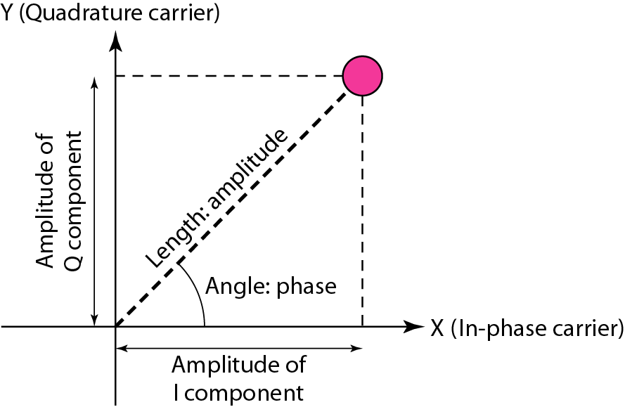

# Chapter 5 — Analog Transmission (Modulation Techniques)

## 1. Document & Chapter Overview

- **Subject:** Digital-to-Analog & Analog-to-Analog Modulation
- **Source:** Reference Material - Chapter 5.pptx

## 2. Digital-to-Analog Modulation (ASK, FSK, PSK, QAM)

| Modulation Type | Full Name | Variable Carrier Parameter | Bandwidth Requirement ($B$) | Bit Rate vs Baud Rate | Source Tag |
| --- | --- | --- | --- | --- | --- |

| **ASK** | Amplitude Shift Keying | Amplitude ($A$) | $B = (1 + d) \times S$ | Bit rate = Baud rate ($N = S$) | [Source: Ch 5, Slide 4] |

| **FSK** | Frequency Shift Keying | Frequency ($f$) | $B = (1 + d) \times S + \Delta f$ | $N = S$ | [Source: Ch 5, Slide 10] |

| **PSK** | Phase Shift Keying | Phase ($\phi$) | $B = (1 + d) \times S$ | $N = S \times \log_2(L)$ | [Source: Ch 5, Slide 16] |

| **QAM** | Quadrature Amplitude Modulation | Amplitude & Phase | $B = (1 + d) \times S$ | High spectral efficiency | [Source: Ch 5, Slide 24] |

### Figure 5.1: Constellation Diagram for 4-QAM / QPSK

[Source: Reference Material - Chapter 5.pptx, Slide 22]

## 3. Analog-to-Analog Modulation (AM, FM, PM)

- **Amplitude Modulation (AM):** $B_{\text{AM}} = 2 B_m$

- **Frequency Modulation (FM):** $B_{\text{FM}} = 2 (1 + \beta) B_m$

- **Phase Modulation (PM):** $B_{\text{PM}} = 2 (1 + \gamma) B_m$

[Source: Reference Material - Chapter 5.pptx, Slides 35-45]

## Key Summary & Formula
- Standard formula definitions and notes.

## Key Summary & Definition
- Standard definition definitions and notes.

## Key Summary & Exam-oriented review
- Standard exam-oriented review definitions and notes.