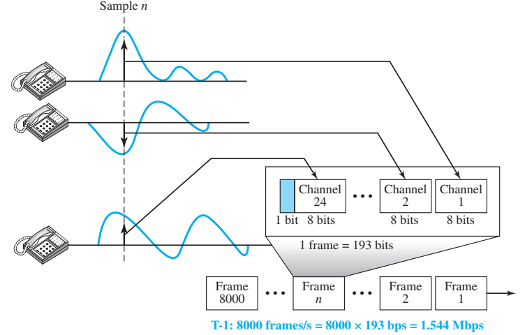

# Chapter 6 — Multiplexing & Spreading Spectrum

## 1. Document & Chapter Overview

- **Subject:** FDM, WDM, TDM & Spread Spectrum
- **Source:** Reference Material - Chapter 6_Multiplexing.pptx

## 2. Multiplexing Techniques Comparison

| Multiplexing Technique | Medium / Domain | Signal Type | Principle | Common Application | Source Tag |
| --- | --- | --- | --- | --- | --- |

| **FDM** | Frequency | Analog | Division of bandwidth into frequency bands | Radio, Broadcast TV, Cable | [Source: Ch 6, Slide 5] |

| **WDM** | Light Wavelength | Optical (Analog) | Division of light wavelengths in optical fiber | Fiber Optic Networks | [Source: Ch 6, Slide 12] |

| **Synchronous TDM** | Time | Digital | Time slots pre-assigned to channels | T1/E1 Carrier Lines | [Source: Ch 6, Slide 16] |

| **Statistical TDM** | Time | Digital | Dynamic time slot allocation based on demand | Packet Switching Networks | [Source: Ch 6, Slide 25] |

### Figure 6.1: FDM vs TDM Concept Architecture

[Source: Reference Material - Chapter 6_Multiplexing.pptx, Slide 4]

## Key Summary & Formula
- Standard formula definitions and notes.

## Key Summary & Definition
- Standard definition definitions and notes.

## Key Summary & Exam-oriented review
- Standard exam-oriented review definitions and notes.