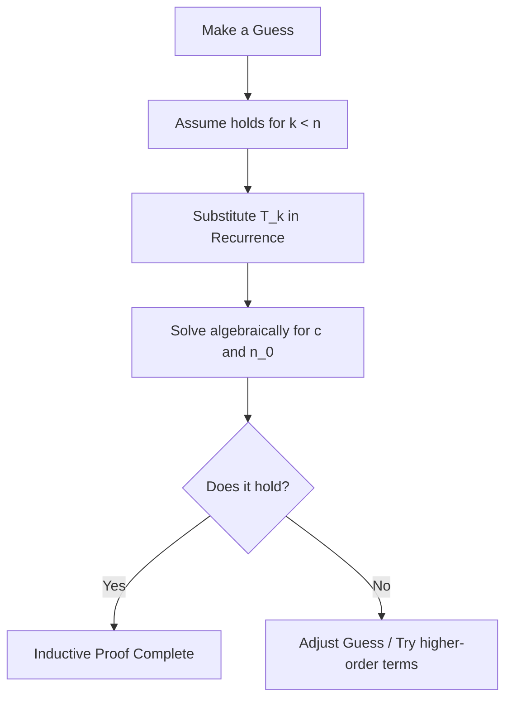
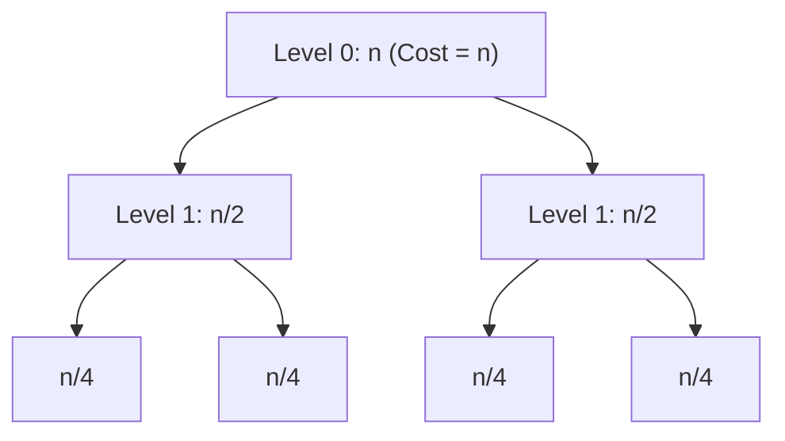

# Chapter 2 — Unit-II: Analysis of Algorithms

> **Course Code:** 3CS501CC24 / 2CS503
> **Course Title:** Design & Analysis of Algorithms (DAA)
> **Primary Source:** Faculty Lecture Material (LMS)
> **Files Integrated:** `DAA_Unit2.pptx` (Slides 1–37), `DAA_Unit3(a).pptx` (Slides 1–70), `DAA_Unit3(b).pptx` (Slides 1–30)

---

## Source map

- `DAA_Unit2.pptx` (Slides 1–37) — primary faculty lecture material.
- `DAA_Unit3(a).pptx` (Slides 1–70) — primary faculty lecture material.
- `DAA_Unit3(b).pptx` (Slides 1–30) — primary faculty lecture material.

---

## 1. Chapter Overview

Unit-II focuses on analyzing control structures, solving linear and divide-and-conquer recurrence relations, and applying these analytical techniques to fundamental sorting algorithms. Students learn to systematically evaluate iterative constructs (`for`, `while`, `repeat`), recursive functions, recurrence relations (via Substitution, Characteristic Equations, Particular Solutions, Variable Transformations, Range Transformations, Master Theorems, and Recurrence Trees), and perform complete trace and performance evaluations of Quick Sort, Merge Sort, Insertion Sort, Selection Sort, Bubble Sort, and Heap Sort.

[Source: DAA_Unit2.pptx, Slides 1–14; DAA_Unit3(a).pptx, Slides 1–4; DAA_Unit3(b).pptx, Slides 1–3]

---

## 2. Core Terminology Dictionary

### Core Terminology Dictionary

1. **Control Structure:** Programming construct (sequencing, selection, iteration) governing program execution flow.
2. **Recurrence Relation:** An equation defining a sequence recursively in terms of its values on smaller inputs (e.g., $T(n) = T(n-1) + n$).
3. **Characteristic Equation:** A polynomial equation derived from a homogeneous recurrence relation to determine its characteristic roots.
4. **Homogeneous Recurrence:** A linear recurrence relation where the non-recursive right-hand side term $f(n) = 0$.
5. **Non-Homogeneous Recurrence:** A recurrence relation containing a non-zero driving function $f(n) \neq 0$, solved as $T(n) = T(n)_h + T(n)_p$.
6. **Master Theorem:** A template formula providing closed-form asymptotic bounds for divide-and-conquer and subtract-and-conquer recurrences.
7. **Recurrence Tree:** A graphical representation of recursive execution where each node represents subproblem cost at a specific recursion depth.
8. **Divide-and-Conquer:** An algorithmic design strategy that breaks a problem into smaller subproblems, solves them recursively, and combines their results.
9. **In-Place Sort:** A sorting algorithm requiring $\mathcal{O}(1)$ auxiliary space beyond the input array.
10. **Partitioning:** Rearranging an array around a pivot element such that all elements left of the pivot are $\le \text{pivot}$ and elements right are $\ge \text{pivot}$.
11. **Stable Sort:** A sorting algorithm that preserves the relative order of equal elements.
12. **Binary Heap:** A nearly complete binary tree satisfying the heap property (Max-Heap or Min-Heap).

[Source: DAA_Unit2.pptx, Slides 1–14; DAA_Unit3(a).pptx, Slides 3–4, 10–21; DAA_Unit3(b).pptx, Slides 14–22]

---

## 3. Analyzing Control Structures

To analyze iterative algorithms, we compute line-by-line step counts and express execution cost as a function of $n$.

### 3.1 Sequential Execution (Sequencing)
Sequential statements without loops execute a fixed number of times:
```c
sum = a + b; // executed once -> cost c1 = O(1)
```

---

### 3.2 Single `for` Loops

#### Algorithm Example: Array Sum
```c
int Sum(int A[], int n) {
    int s = 0;             // cost = c1, times = 1
    for (int i = 0; i < n; i++) // cost = c2, times = n + 1
        s = s + A[i];       // cost = c3, times = n
    return s;              // cost = c4, times = 1
}
```

#### Step Count Derivation:

$$
T(n) = c_1(1) + c_2(n+1) + c_3(n) + c_4(1) = (c_2 + c_3)n + (c_1 + c_2 + c_4) = a \cdot n + b = \Theta(n)
$$

#### Step Count Table for Growth of $n$:
| $n$ | Total Executed Steps ($2n + 3$) | Growth Property |
| :---: | :---: | :--- |
| **10** | 23 steps | Dominating term is $n$. |
| **100** | 203 steps | Constant $+3$ becomes negligible. |
| **1,000** | 2,003 steps | Time grows strictly linearly with $n$. |
| **10,000** | 20,003 steps | Linear scaling $\Theta(n)$. |

[Source: DAA_Unit2.pptx, Slides 2–3]

---

### 3.3 Nested `for` Loops

#### Example 3.1: Dependent Double Nested Loop
```c
l = 0;
for (int i = 1; i <= n; i++)
    for (int j = 1; j <= i; j++)
        l = l + 1;
```
* **Inner Loop Count:** Executes $i$ times for each $i$.
* **Total Executions:**

$$
T(n) = \sum_{i=1}^n \sum_{j=1}^i 1 = \sum_{i=1}^n i = \frac{n(n+1)}{2} = \frac{1}{2}n^2 + \frac{1}{2}n = \Theta(n^2)
$$

#### Example 3.2: Triple Polynomial Loop
```c
l = 0;
for (int i = 1; i <= n; i++)
    for (int j = 1; j <= n*n; j++)
        for (int k = 1; k <= n*n*n; k++)
            l = l + 1;
```
* **Step Count:** Outer loop $n$, middle loop $n^2$, inner loop $n^3$.
* **Total Executions:** $T(n) = n \times n^2 \times n^3 = n^6 = \Theta(n^6)$.

[Source: DAA_Unit2.pptx, Slides 4–5]

---

### 3.4 `while` and `repeat` Loops (Logarithmic Step Sizes)

#### Loop Type A: Multiplication/Division Step ($i = i \cdot c$ or $i = i / c$)
```c
i = 1;
while (i <= n) {
    l = l + 1;
    i = i * c; // c > 1
}
```
* **Analysis:** In iteration $k$, $i = c^k$. The loop terminates when $c^k > n \implies k > \log_c n$.
* **Complexity:** $T(n) = \Theta(\log_c n) = \Theta(\log n)$.

#### Loop Type B: Exponential Step ($i = i^c$ or $i = \sqrt{i}$)
```c
i = 2;
while (i <= n) {
    l = l + 1;
    i = pow(i, c); // e.g., i = i^2
}
```
* **Analysis:** After $k$ iterations, $i = 2^{c^k}$. Termination occurs when $2^{c^k} \ge n \implies c^k \ge \log_2 n \implies k = \log_c(\log_2 n)$.
* **Complexity:** $T(n) = \Theta(\log \log n)$.

[Source: DAA_Unit2.pptx, Slide 6]

---

## 4. Analysis of Recursive Calls

When an algorithm contains self-referential calls, its complexity is represented as a **recurrence relation**.

### 4.1 Recursive Factorial Analysis
```c
int factorial(int n) {
    if (n <= 1)        // Base case: O(1)
        return 1;
    else
        return n * factorial(n - 1); // Recursive call: T(n-1) + O(1)
}
```
* **Recurrence Relation:**

$$
T(n) = \begin{cases} \Theta(1) & \text{if } n \le 1 \\ T(n-1) + d & \text{if } n > 1 \end{cases}
$$

* **Unwinding/Expansion:**

$$
T(n) = T(n-1) + d = T(n-2) + 2d = \dots = T(1) + (n-1)d = \Theta(n)
$$

[Source: DAA_Unit2.pptx, Slides 8–12]

---

## 5. Solving Recurrences: Comprehensive Techniques

### 5.1 Method 1: Intelligent Guesswork & Substitution Method

#### Step-by-Step Recipe (Checklist)
1. [ ] **Guess the Form:** Formulate an intelligent guess for the solution based on experience, recursion depth, or a recurrence tree (e.g., guess $T(n) \le c n \log n$ or $T(n) \le c n$).
2. [ ] **Set up Induction Hypothesis:** State that $T(k) \le c \cdot g(k)$ holds for all $k < n$.
3. [ ] **Inductive Step:** Substitute the inductive hypothesis into the recurrence relation to prove $T(n) \le c \cdot g(n)$.
4. [ ] **Determine Constants:** Solve the algebraic inequality to find positive constants $c > 0$ and $n_0 > 0$ that make the inequality true.
5. [ ] **Establish Base Cases:** Verify that the constants $c$ and $n_0$ are compatible with the boundary/initial conditions of the recurrence.



#### Worked Example: Solve $T(n) = 2 T(n/2) + n$
* **Goal:** Show that $T(n) = \mathcal{O}(n \log n)$ using the substitution method.
* **Hypothesis:** Assume $T(k) \le c k \log_2 k$ for all $k < n$, with some constant $c > 0$.
* **Inductive Step:** Substitute the hypothesis into the recurrence:

$$
\begin{aligned}
T(n) &\le 2 \left(c \frac{n}{2} \log_2 \frac{n}{2}\right) + n \\
&= c n \log_2 \frac{n}{2} + n \\
&= c n (\log_2 n - \log_2 2) + n \\
&= c n \log_2 n - c n + n \\
&= c n \log_2 n - (c - 1)n
\end{aligned}
$$

* **Inequality Requirement:** We need $c n \log_2 n - (c - 1)n \le c n \log_2 n$.
* **Solving for $c$:** This holds if and only if $c - 1 \ge 0 \implies c \ge 1$.
* **Conclusion:** Choosing $c = 1$ and $n_0 = 2$ proves $T(n) \le c n \log_2 n$. Hence, the upper bound is $\mathcal{O}(n \log n)$. To show the lower bound $\Omega(n \log n)$, use the same steps with $T(k) \ge c' k \log_2 k$ to yield a tighter bound of $\Theta(n \log n)$.

---

### 5.2 Method 2: Homogeneous Recurrences (Characteristic Equations)

Linear homogeneous recurrence relations have the form:

$$
a_0 T(n) + a_1 T(n-1) + a_2 T(n-2) + \dots + a_k T(n-k) = 0
$$

#### Step-by-Step Recipe (Checklist)
1. [ ] **Set up the Characteristic Polynomial:** Substitute $T(n-j) \to x^{k-j}$ to obtain:

$$
a_0 x^k + a_1 x^{k-1} + a_2 x^{k-2} + \dots + a_k = 0
$$

2. [ ] **Find the Roots:** Factor the polynomial to obtain the roots $r_1, r_2, \dots, r_k$.
3. [ ] **Identify Root Cases:**
   * **Case A: Distinct Roots:** If all roots $r_j$ are unique, write:

$$
T(n) = c_1 r_1^n + c_2 r_2^n + \dots + c_k r_k^n
$$

   * **Case B: Repeated Roots:** If root $r_1$ occurs with multiplicity $m$, write:

$$
T(n) = (c_1 + c_2 n + c_3 n^2 + \dots + c_m n^{m-1}) r_1^n + c_{m+1} r_{m+1}^n + \dots
$$

4. [ ] **Solve for Constants:** Use initial conditions ($T(0)$, $T(1)$, etc.) to solve the system of linear equations for constants $c_j$.
5. [ ] **Write Final Solution:** State the closed-form representation of $T(n)$.

```mermaid
flowchart TD
    Start["Homogeneous Recurrence"] --> Poly["Form Characteristic Polynomial"]
    Poly --> FindRoots["Find Roots of Polynomial"]
    FindRoots --> Case{"Are roots distinct?"}
    Case -- Yes --> DistinctFormula["T("n") = c1*r1^n + c2*r2^n + ..."]
    Case -- No --> RepeatedFormula["T("n") = (c1 + c2*n + ...)*r1^n + ..."]
    DistinctFormula --> Solve["Apply Initial Conditions to solve for c_j"]
    RepeatedFormula --> Solve
    Solve --> End["Closed-form Solution"]
```

#### Worked Problem 5.1: $T(n) - 3T(n-1) + 2T(n-2) = 0$, $T(0)=2, T(1)=3$
1. **Characteristic Equation:** $x^2 - 3x + 2 = 0 \implies (x-1)(x-2) = 0 \implies r_1 = 1, r_2 = 2$.
2. **General Solution (Distinct Roots):**

$$
T(n) = c_1 (1^n) + c_2 (2^n) = c_1 + c_2 2^n
$$

3. **Applying Initial Conditions:**
   * For $n=0$: $c_1 + c_2 = 2$
   * For $n=1$: $c_1 + 2c_2 = 3$
4. **Solving System:** Subtracting the first equation from the second yields $c_2 = 1$, which gives $c_1 = 1$.
5. **Final Tight Bound Solution:**

$$
T(n) = 1 + 2^n = \Theta(2^n)
$$

---

### 5.3 Method 3: Non-Homogeneous Recurrences

Non-homogeneous linear recurrences contain a non-zero driving function $f(n)$:

$$
a_0 T(n) + a_1 T(n-1) + \dots + a_k T(n-k) = f(n)
$$

#### Step-by-Step Recipe (Checklist)
1. [ ] **Solve Homogeneous Part ($T(n)_h$):** Set $f(n) = 0$ and find $T(n)_h$ using Method 2.
2. [ ] **Determine the Form of Particular Solution ($T(n)_p$):** Identify the type of $f(n)$ and set up the corresponding template:
   * If $f(n) = c$ (Constant): Try $T_p = P$. If $1$ is a characteristic root of multiplicity $t$, use $T_p = P n^t$.
   * If $f(n) = \text{polynomial of degree } m$: Try $T_p = d_0 + d_1 n + \dots + d_m n^m$.
   * If $f(n) = d \cdot a^n$ (Exponential):
     * If $a$ is not a characteristic root: Try $T_p = P a^n$.
     * If $a$ is a characteristic root of multiplicity $t$: Try $T_p = P n^t a^n$.
3. [ ] **Substitute $T(n)_p$ into Recurrence:** Plug the template into the full non-homogeneous relation.
4. [ ] **Solve for Coefficients:** Group terms by powers of $n$ or components to solve for coefficients ($P, d_j$).
5. [ ] **Combine Solutions:** Write the total solution:

$$
T(n) = T(n)_h + T(n)_p
$$

6. [ ] **Apply Initial Conditions:** Use the initial conditions on the *combined* solution $T(n)$ to find the homogeneous constants $c_j$.

#### Worked Problem 5.4: $T(n) - 2T(n-1) = 3^n$, $T(0)=1$
1. **Homogeneous Part:** $x - 2 = 0 \implies r = 2 \implies T(n)_h = c_1 2^n$.
2. **Particular Part:** Since $f(n) = 3^n$, and $3$ is not a characteristic root ($3 \ne 2$), try $T(n)_p = P 3^n$.
3. **Substitution:**

$$
P 3^n - 2 (P 3^{n-1}) = 3^n
$$

   Divide by $3^{n-1}$:

$$
3P - 2P = 3 \implies P = 3 \implies T(n)_p = 3 \cdot 3^n = 3^{n+1}
$$

4. **Combined General Solution:**

$$
T(n) = c_1 2^n + 3^{n+1}
$$

5. **Apply Initial Condition $T(0)=1$:**

$$
T(0) = c_1 2^0 + 3^1 = c_1 + 3 = 1 \implies c_1 = -2
$$

6. **Final Tight Bound Solution:**

$$
T(n) = -2(2^n) + 3^{n+1} = 3^{n+1} - 2^{n+1} = \Theta(3^n)
$$

---

### 5.4 Method 4: Change of Variable Method

Used when the recurrence contains logarithmic or square root arguments, making traditional methods inapplicable.

#### Step-by-Step Recipe (Checklist)
1. [ ] **Identify the Variable Transformation:** Substitute $n = 2^m \implies m = \log_2 n$.
2. [ ] **Rewrite Recurrence Terms:** Replace $T(n)$ with $T(2^m)$ and subproblems accordingly (e.g., $T(\sqrt{n}) \to T(2^{m/2})$).
3. [ ] **Define a New Function:** Let $S(m) = T(2^m)$.
4. [ ] **Solve the New Recurrence:** Solve the transformed recurrence $S(m)$ using standard methods (Master Theorem or Characteristic Equations).
5. [ ] **Perform Back-Substitution:** Replace $m$ with $\log_2 n$ in the solved expression for $S(m)$ to obtain the final tight bound for $T(n)$.

#### Worked Problem 5.5: Solve $T(n) = T(\sqrt{n}) + \Theta(1)$
1. **Transformation:** Let $n = 2^m \implies \sqrt{n} = 2^{m/2}$.

$$
T(2^m) = T(2^{m/2}) + c
$$

2. **Rename Function:** Let $S(m) = T(2^m)$:

$$
S(m) = S(m/2) + c
$$

3. **Solve for $S(m)$:** Using Master Theorem ($a=1, b=2, f(m)=c \implies m^{\log_2 1} = m^0 = 1$):

$$
S(m) = \Theta(\log m)
$$

4. **Back-Substitute $m = \log_2 n$:**

$$
T(n) = S(\log_2 n) = \Theta(\log (\log n))
$$

---

### 5.5 Method 5: Range Transformations

Used for non-linear recurrences containing powers or products of terms.

#### Step-by-Step Recipe (Checklist)
1. [ ] **Linearize Using Logarithm:** Take the logarithm of both sides to convert multiplication/powers into addition/multiplication.
2. [ ] **Define New Variable:** Let $U(n) = \log T(n)$ or $U(m) = \log S(m)$.
3. [ ] **Solve Transformed Recurrence:** Solve the resulting linear recurrence for $U(n)$.
4. [ ] **Apply Inverse Transformation:** Recover $T(n) = 2^{U(n)}$.

#### Worked Problem 5.6: Solve $T(n) = 2 T(n/2)^2$ with $T(1) = 2$
1. **Apply Logarithm ($\log_2$):**

$$
\log_2 T(n) = \log_2(2 T(n/2)^2) = 1 + 2 \log_2 T(n/2)
$$

2. **Define New Variable:** Let $U(n) = \log_2 T(n)$:

$$
U(n) = 2 U(n/2) + 1
$$

3. **Solve for $U(n)$:** Using Master Theorem ($a=2, b=2, f(n)=1 \implies n^{\log_2 2} = n^1$):

$$
U(n) = \Theta(n)
$$

4. **Back-Substitute:**

$$
T(n) = 2^{U(n)} = 2^{\Theta(n)}
$$

---

### 5.6 Method 6: Master Theorem for Divide-and-Conquer Recurrences

For recurrences of the form:

$$
T(n) = a T\left(\frac{n}{b}\right) + f(n) \quad \text{where } a \ge 1, b > 1
$$

#### Visual Decision Tree Diagram:
```mermaid
flowchart TD
    Start["Given: T("n") = aT("n/b") + f("n")"] --> Comp["Compare f("n") with n^(log_b a)"]
    Comp --> Case1["f("n") is polynomially smaller: O("n^(log_b a - epsilon"))"]
    Comp --> Case2["f("n") is asymptotically equal: Theta("n^(log_b a") * log^k n)"]
    Comp --> Case3["f("n") is polynomially larger: Omega("n^(log_b a + epsilon"))"]
    Case1 --> Res1["Case 1: T("n") = Theta("n^(log_b a"))"]
    Case2 --> Res2["Case 2: T("n") = Theta("n^(log_b a") * log^(k+1) n)"]
    Case3 --> Reg{"Verify Regularity: a*f("n/b") &le; c*f("n") for c < 1"}
    Reg -- Yes --> Res3["Case 3: T("n") = Theta("f(n"))"]
    Reg -- No --> Fail["Inapplicable. Use Recurrence Tree."]
```

#### Step-by-Step Recipe (Checklist)
1. [ ] **Extract Constants:** Identify $a$, $b$, and the driving function $f(n)$.
2. [ ] **Compute Boundary Benchmark:** Calculate the critical exponent value: $n^{\log_b a}$.
3. [ ] **Compare Growth Rates:**
   * **Case 1 (Leaves Dominant):** If $f(n) = \mathcal{O}(n^{\log_b a - \epsilon})$ for some constant $\epsilon > 0$, then:

$$
T(n) = \Theta(n^{\log_b a})
$$

   * **Case 2 (Balanced Levels):** If $f(n) = \Theta(n^{\log_b a} \log^k n)$ for $k \ge 0$, then:

$$
T(n) = \Theta(n^{\log_b a} \log^{k+1} n)
$$

   * **Case 3 (Root Dominant):** If $f(n) = \Omega(n^{\log_b a + \epsilon})$ for some constant $\epsilon > 0$, check the **Regularity Condition**:

$$
a f(n/b) \le c f(n) \quad \text{for some constant } c < 1 \text{ and large } n.
$$

     If both hold, then:

$$
T(n) = \Theta(f(n))
$$

#### 10 Comprehensive Solved Examples:

| # | Recurrence Relation | $a$ | $b$ | $n^{\log_b a}$ | $f(n)$ | Master Case | Solution $T(n)$ | Detailed Step-by-Step Explanation |
| :---: | :--- | :---: | :---: | :---: | :---: | :---: | :---: | :--- |
| **1** | $T(n) = 4 T(n/2) + n$ | 4 | 2 | $n^2$ | $n$ | Case 1 | $\Theta(n^2)$ | $f(n) = n = \mathcal{O}(n^{2-1})$ with $\epsilon = 1$. The leaf levels dominate the complexity. |
| **2** | $T(n) = 4 T(n/2) + n^2$ | 4 | 2 | $n^2$ | $n^2$ | Case 2 ($k=0$) | $\Theta(n^2 \log n)$ | $f(n) = n^2 = \Theta(n^2 \log^0 n)$. Balanced work at all levels. |
| **3** | $T(n) = 4 T(n/2) + n^3$ | 4 | 2 | $n^2$ | $n^3$ | Case 3 | $\Theta(n^3)$ | $f(n) = n^3 = \Omega(n^{2+1})$ with $\epsilon=1$. Regularity: $4(n/2)^3 = n^3/2 \le \frac{1}{2} n^3$ (holds for $c = 1/2 < 1$). |
| **4** | $T(n) = 9 T(n/3) + n$ | 9 | 3 | $n^2$ | $n$ | Case 1 | $\Theta(n^2)$ | $f(n) = n = \mathcal{O}(n^{2-1})$ with $\epsilon = 1$. |
| **5** | $T(n) = T(2n/3) + 1$ | 1 | $3/2$ | $n^0 = 1$ | $1$ | Case 2 ($k=0$) | $\Theta(\log n)$ | $f(n) = 1 = \Theta(1)$. Binary Search equivalent. |
| **6** | $T(n) = 7 T(n/2) + n^3$ | 7 | 2 | $n^{2.81}$ | $n^3$ | Case 3 | $\Theta(n^3)$ | $f(n) = n^3 = \Omega(n^{2.81 + \epsilon})$ with $\epsilon \approx 0.19$. Regularity: $7(n/2)^3 = \frac{7}{8}n^3 \le c n^3$ holds for $c = 7/8 < 1$. |
| **7** | $T(n) = 2 T(n/2) + n \log n$| 2 | 2 | $n^1$ | $n \log n$ | Case 2 ($k=1$) | $\Theta(n \log^2 n)$ | $f(n) = n \log^1 n$, matching $n^{\log_b a} \log^k n$ with $k=1$. |
| **8** | $T(n) = 27 T(n/3) + n^3$ | 27| 3 | $n^3$ | $n^3$ | Case 2 ($k=0$) | $\Theta(n^3 \log n)$ | $f(n) = n^3 = \Theta(n^3 \log^0 n)$. |
| **9** | $T(n) = 2 T(n/2) + \Theta(n)$ | 2 | 2 | $n^1$ | $n$ | Case 2 ($k=0$) | $\Theta(n \log n)$ | Merge Sort equivalent. |
| **10**| $T(n) = 2 T(n/2) + \frac{n}{\log n}$| 2 | 2 | $n^1$ | $\frac{n}{\log n}$ | **Inapplicable** | Non-polynomially smaller gap | The ratio $\frac{n^{\log_b a}}{f(n)} = \log n$ is not polynomial (i.e. cannot find constant $\epsilon > 0$ such that $f(n) = \mathcal{O}(n^{1-\epsilon})$). Use Recurrence Tree instead. |

---

### 5.7 Method 7: Master Theorem for Subtract-and-Conquer Recurrences

For recurrences of the form:

$$
T(n) = a T(n - b) + \mathcal{O}(n^k) \quad \text{where } a > 0, b > 0, k \ge 0
$$

#### Step-by-Step Recipe (Checklist)
1. [ ] **Extract Constants:** Identify $a$, $b$, and the polynomial degree exponent $k$.
2. [ ] **Select Case based on $a$:**
   * **Case 1 ($a < 1$):** Work decreases exponentially. The root level dominates:

$$
T(n) = \Theta(n^k)
$$

   * **Case 2 ($a = 1$):** Work is evenly balanced. Multiplied by recursion depth factor:

$$
T(n) = \Theta(n^{k+1})
$$

   * **Case 3 ($a > 1$):** Work increases exponentially. The leaves dominate:

$$
T(n) = \Theta(a^{n/b} \cdot n^k)
$$

#### Worked Example: Solve $T(n) = T(n-1) + n$
* **Parameters:** $a=1, b=1, k=1$.
* **Application:** Matches Case 2 ($a=1$).
* **Solution:**

$$
T(n) = \Theta(n^{1+1}) = \Theta(n^2)
$$

---

### 5.8 Method 8: Recurrence Tree Method

Provides a reliable graphical model to compute the work done at each tree level when algebraic approximations fail.

#### Systematic 6-Step Recurrence Tree Procedure:
1. **Tree Construction:** Draw nodes representing splitting costs.
2. **Level Cost:** Calculate total cost for level $i$.
3. **Tree Depth:** Compute total levels $x$ until subproblem size reaches $1$.
4. **Leaf Node Count:** Calculate total leaves at level $x$.
5. **Base-Level Cost:** Calculate cost of leaves $= \text{leaves} \times T(1)$.
6. **Summation:** Total cost $T(n) = \sum_{i=0}^{x-1} \text{Level}_i + \text{Leaf Cost}$.



#### Worked Problem 5.7: $T(n) = 2 T(n/2) + n$
1. **Tree Structure:**
   * Level 0 node: cost $n$.
   * Level 1 nodes: 2 nodes, each of cost $n/2$. Sum $= n$.
   * Level 2 nodes: 4 nodes, each of cost $n/4$. Sum $= n$.
   * Level $i$ nodes: $2^i$ nodes, each of cost $n/2^i$. Sum $= 2^i \cdot \frac{n}{2^i} = n$.
2. **Determine Tree Depth:** The problem size at level $x$ is $n/2^x$. We reach the base case when $n/2^x = 1 \implies x = \log_2 n$.
3. **Number of Leaves:** $2^{\log_2 n} = n$ leaves, each costing $T(1) = \Theta(1)$. Total Leaf Cost $= \Theta(n)$.
4. **Sum of Levels:**

$$
T(n) = \sum_{i=0}^{\log_2 n - 1} n + \Theta(n) = n \log_2 n + \Theta(n) = \Theta(n \log n)
$$

---

## 6. In-Depth Analysis of Sorting Algorithms

In this section, we analyze the performance, operation, pseudocode, and complexity bounds for six fundamental sorting algorithms.

---

### 6.1 Merge Sort

#### Concept & Strategy
Merge Sort divides an array into two equal halves, recursively sorts each half, and combines the two sorted halves into a single sorted array using temporary buffer arrays.

#### Algorithm & Pseudocode

```python
def MergeSort(A, p, r):
    if p < r:
        q = (p + r) // 2         # Divide: Find midpoint O(1)
        MergeSort(A, p, q)       # Conquer: Left half T(n/2)
        MergeSort(A, q + 1, r)   # Conquer: Right half T(n/2)
        Merge(A, p, q, r)        # Combine: Merge two sorted sub-arrays O(n)

def Merge(A, p, q, r):
    n1 = q - p + 1
    n2 = r - q
    L = [0] * (n1 + 1)
    R = [0] * (n2 + 1)
    for i in range(n1):
        L[i] = A[p + i]
    for j in range(n2):
        R[j] = A[q + 1 + j]
    L[n1] = float('inf') # Sentinel value to simplify boundary check
    R[n2] = float('inf') # Sentinel value to simplify boundary check
    i = 0
    j = 0
    for k in range(p, r + 1):
        if L[i] <= R[j]:
            A[k] = L[i]
            i += 1
        else:
            A[k] = R[j]
            j += 1
```

#### Detailed Execution Trace Example
* **Input Array:** `[724, 521, 2, 98, 529, 31, 189, 451]` ($n = 8$)

```mermaid
flowchart TD
    Root["&quot;[724, 521, 2, 98, 529, 31, 189, 451"]"] --> L1["&quot;[724, 521, 2, 98"]"]
    Root --> R1["&quot;[529, 31, 189, 451"]"]
    L1 --> L11["&quot;[724, 521"]"]
    L1 --> L12["&quot;[2, 98"]"]
    R1 --> R11["&quot;[529, 31"]"]
    R1 --> R12["&quot;[189, 451"]"]
    L11 --> M1["&quot;Merged: [521, 724"]"]
    L12 --> M2["&quot;Merged: [2, 98"]"]
    R11 --> M3["&quot;Merged: [31, 529"]"]
    R12 --> M4["&quot;Merged: [189, 451"]"]
    M1 and M2 --> ML["&quot;Merged Left: [2, 98, 521, 724"]"]
    M3 and M4 --> MR["&quot;Merged Right: [31, 189, 451, 529"]"]
    ML and MR --> Final["&quot;Final Sorted Array: [2, 31, 98, 189, 451, 521, 529, 724"]"]
```

#### Mathematical Complexity Analysis
* **Recurrence Relation:**

$$
T(n) = 2 T(n/2) + \Theta(n)
$$

* **Best-Case Complexity:** Even if the array is already sorted, the algorithm splits the array and completes the merging comparisons: $\Theta(n \log n)$.
* **Worst-Case Complexity:** In all inputs, the recursive tree is perfectly balanced and work done per level remains linear: $\Theta(n \log n)$.
* **Average-Case Complexity:** $\Theta(n \log n)$.
* **Auxiliary Space:** $\Theta(n)$ required for the temporary buffer arrays `L` and `R` during the Merge phase.
* **Stability:** **Stable**; preserves original order of duplicate elements because of the `<=` check in `Merge`.

---

### 6.2 Quick Sort

#### Concept & Strategy
Quick Sort selects a pivot element and partitions the array into two sub-arrays around that pivot such that all elements left of the pivot are $\le \text{pivot}$ and all elements right are $\ge \text{pivot}$. It recursively sorts the sub-arrays in-place.

#### Algorithm & Pseudocode

```python
def QuickSort(T, i, j):
    if i < j:
        l = Partition(T, i, j) # Partition around pivot, return pivot index
        QuickSort(T, i, l - 1) # Recursively sort left partition
        QuickSort(T, l + 1, j) # Recursively sort right partition

def Partition(T, i, j):
    p = T[i] # Pivot chosen as first element
    k = i
    l = j + 1
    while True:
        while True:
            k += 1
            if k >= j or T[k] > p:
                break
        while True:
            l -= 1
            if T[l] <= p:
                break
        if k < l:
            T[k], T[l] = T[l], T[k] # Swap out-of-order elements
        else:
            break
    T[i], T[l] = T[l], T[i] # Place pivot in final correct index l
    return l
```

#### Detailed Execution Trace Example (Partition Phase)
* **Input Array:** `[42, 23, 74, 11, 65, 58, 94, 36, 99, 87]`, pivot $p = 42, i=0, j=9$.

```mermaid
flowchart TD
    Step1["&quot;Array: [42, 23, 74, 11, 65, 58, 94, 36, 99, 87"] | Pivot p = 42"] --> Scan1["Scan: k stops at 74 (>42), l stops at 36 (&le;42)"]
    Scan1 --> Swap1["&quot;Swap T[k"] and T["l"] -> Array: [42, 23, 36, 11, 65, 58, 94, 74, 99, 87]"]
    Swap1 --> Scan2["Scan: k stops at 65 (>42), l stops at 11 (&le;42). Crosses! (k &gt; l)"]
    Scan2 --> PivotSwap["&quot;Swap Pivot T[i"] with T["l"] (42 with 11)"]
    PivotSwap --> Result["&quot;Partitioned Array: [11, 23, 36, 42, 65, 58, 94, 74, 99, 87"] | Pivot Index = 3"]
```

#### Mathematical Complexity Analysis
* **Worst-Case Recurrence:** Occurs with reverse-sorted or sorted arrays where the pivot is always the minimum or maximum element, yielding $1$ and $n-1$ size splits:

$$
T(n) = T(n-1) + T(0) + \Theta(n) = T(n-1) + \Theta(n) \implies \Theta(n^2)
$$

* **Best-Case Recurrence:** Occurs with perfectly balanced midpoint pivot selections:

$$
T(n) = 2 T(n/2) + \Theta(n) \implies \Theta(n \log n)
$$

* **Average-Case Recurrence ($9:1$ Unbalanced Split):**

$$
T(n) = T\left(\frac{9n}{10}\right) + T\left(\frac{n}{10}\right) + \Theta(n) \implies \Theta(n \log n)
$$

* **Auxiliary Space:** $\mathcal{O}(\log n)$ stack space for recursion.
* **Stability:** **Unstable**; swaps can disrupt the relative order of equal elements during Partitioning.

---

### 6.3 Insertion Sort

#### Concept & Strategy
Insertion Sort builds the final sorted array one element at a time. It processes elements sequentially, shifting larger elements to the right to insert the current element into its correct sorted position.

#### Algorithm & Pseudocode

```mermaid
flowchart TD
    Start["InsertionSort("A, n")"] --> Outer["Loop j = 2 to n"]
    Outer --> Key["&quot;Set key = A[j"], i = j - 1"]
    Key --> Inner{"Is i > 0 AND A["i"] > key?"}
    Inner -- Yes --> Shift["&quot;Shift A[i+1"] = A["i"]
Set i = i - 1"] --> Inner
    Inner -- No --> Place["&quot;Insert A[i+1"] = key"] --> Outer
    Outer -- "j > n" --> Done["Sorted Array A"]
```

#### Detailed Execution Trace Example
* **Input Array:** `[12, 11, 13, 5, 6]`
  * **Pass 1 ($j=1, \text{key}=11$):** `$11 < 12$`, shift `12` to right $\to$ `[11, 12, 13, 5, 6]`.
  * **Pass 2 ($j=2, \text{key}=13$):** `$13 > 12$`, no shift $\to$ `[11, 12, 13, 5, 6]`.
  * **Pass 3 ($j=3, \text{key}=5$):** `5` is smaller than all previous; shift `13, 12, 11` $\to$ `[5, 11, 12, 13, 6]`.
  * **Pass 4 ($j=4, \text{key}=6$):** Shift `13, 12, 11` $\to$ `[5, 6, 11, 12, 13]`.

#### Mathematical Complexity Analysis
* **Best-Case Complexity (Already Sorted):** The inner loop condition `A[i] > key` is false immediately on each iteration. Only $n-1$ comparisons occur:

$$
T(n) = \Theta(n)
$$

* **Worst-Case Complexity (Reverse Sorted):** Every element must be shifted to the left edge:

$$
T(n) = \sum_{j=1}^{n-1} j = \frac{n(n-1)}{2} = \Theta(n^2)
$$

* **Average-Case Complexity:** Expected fraction of shifts on randomized arrays: $\Theta(n^2)$.
* **Auxiliary Space:** $\Theta(1)$ (In-place).
* **Stability:** **Stable**; equal elements are not swapped past each other because the comparison is strictly `A[i] > key`.

---

### 6.4 Selection Sort

#### Concept & Strategy
Selection Sort divides the array into a sorted and an unsorted region. It repeatedly scans the unsorted region, finds the absolute minimum element, and swaps it with the leftmost unsorted element.

#### Algorithm & Pseudocode

```mermaid
flowchart TD
    Start["SelectionSort("A, n")"] --> Outer["Loop i = 1 to n - 1"]
    Outer --> SetMin["Set min_idx = i, j = i + 1"]
    SetMin --> Inner{"Loop j = i + 1 to n: Is A["j"] < A["min_idx"]?"}
    Inner -- Yes --> UpdateMin["Set min_idx = j"] --> IncJ["j = j + 1"] --> Inner
    Inner -- No --> IncJ
    Inner -- "j > n" --> Swap["&quot;Swap A[i"] with A["min_idx"]"] --> Outer
    Outer -- "i >= n" --> Done["Sorted Array A"]
```

#### Detailed Execution Trace Example
* **Input Array:** `[64, 25, 12, 22, 11]`
  * **Pass 1 ($i=0$):** Find min of `[64, 25, 12, 22, 11]` $\to$ `11` (idx 4). Swap with `64` $\to$ `[11, 25, 12, 22, 64]`.
  * **Pass 2 ($i=1$):** Find min of `[25, 12, 22, 64]` $\to$ `12` (idx 2). Swap with `25` $\to$ `[11, 12, 25, 22, 64]`.
  * **Pass 3 ($i=2$):** Find min of `[25, 22, 64]` $\to$ `22` (idx 3). Swap with `25` $\to$ `[11, 12, 22, 25, 64]`.
  * **Pass 4 ($i=3$):** Find min of `[25, 64]` $\to$ `25` (idx 3). Swap with self $\to$ `[11, 12, 22, 25, 64]`.

#### Mathematical Complexity Analysis
* **Time Complexity (All Cases):** The algorithm executes double nested loops to find the minimum index, independent of the input configuration:

$$
T(n) = \sum_{i=0}^{n-2} (n - 1 - i) = \frac{n(n-1)}{2} = \Theta(n^2)
$$

  * **Best-Case Complexity:** $\Theta(n^2)$.
  * **Worst-Case Complexity:** $\Theta(n^2)$.
  * **Average-Case Complexity:** $\Theta(n^2)$.
* **Auxiliary Space:** $\Theta(1)$ (In-place).
* **Stability:** **Unstable**; swapping the minimum element can change the relative order of other equal elements.

---

### 6.5 Bubble Sort

#### Concept & Strategy
Bubble Sort repeatedly steps through the array, compares adjacent elements, and swaps them if they are in the wrong order. This "bubbles" the maximum unsorted element to its final rightmost position. An optimized flag avoids redundant passes if no swaps occur.

#### Algorithm & Pseudocode

```mermaid
flowchart TD
    Start["BubbleSort("A, n")"] --> Outer["Loop i = 1 to n - 1"]
    Outer --> SetSwapped["Set swapped = False, j = 1"]
    SetSwapped --> Inner{"Loop j = 1 to n - i: Is A["j"] > A["j+1"]?"}
    Inner -- Yes --> Swap["&quot;Swap A[j"] and A["j+1"]
Set swapped = True"] --> IncJ["j = j + 1"] --> Inner
    Inner -- No --> IncJ
    Inner -- "j > n - i" --> CheckSwapped{"Is swapped == False?"}
    CheckSwapped -- Yes --> DoneEarly["Array Already Sorted -> Terminate Early"]
    CheckSwapped -- No --> Outer
    Outer -- "i >= n" --> Done["Sorted Array A"]
```

#### Detailed Execution Trace Example
* **Input Array:** `[5, 1, 4, 2, 8]`
  * **Pass 1:** Compare and swap adjacent pairs:
    * `[5, 1, 4, 2, 8] -> [1, 5, 4, 2, 8]`
    * `[1, 5, 4, 2, 8] -> [1, 4, 5, 2, 8]`
    * `[1, 4, 5, 2, 8] -> [1, 4, 2, 5, 8]`
    * `[1, 4, 2, 5, 8]` (no swap for `5, 8`). Largest element `8` bubbled.
  * **Pass 2:** `[1, 4, 2, 5, 8] -> [1, 2, 4, 5, 8]`. Element `5` bubbled.
  * **Pass 3:** No swaps occur on next pass (`swapped` stays `False`), exit immediately.

#### Mathematical Complexity Analysis
* **Best-Case Complexity (Already Sorted):** The inner loop executes once, does not perform swaps, sets `swapped` to `False`, and terminates early:

$$
T(n) = \Theta(n)
$$

* **Worst-Case Complexity (Reverse Sorted):** The outer loop runs $n$ times, swapping on every adjacent comparison:

$$
T(n) = \sum_{i=0}^{n-1} (n - i - 1) = \Theta(n^2)
$$

* **Average-Case Complexity:** $\Theta(n^2)$.
* **Auxiliary Space:** $\Theta(1)$ (In-place).
* **Stability:** **Stable**; elements are only swapped if strictly out of order (`A[j] > A[j+1]`).

---

### 6.6 Heap Sort

#### Concept & Strategy
Heap Sort constructs a **Max-Heap** (a binary tree where parent nodes are greater than or equal to their children). It repeatedly extracts the maximum element (located at the root node) and restores the heap property to the remaining elements.

```
       Max-Heap Structure:
             [90]          Parent index i
            /    \
         [85]    [70]      Left child: 2i + 1
         /  \
      [50]  [30]           Right child: 2i + 2
```

#### Algorithm & Pseudocode

```mermaid
flowchart TD
    Start["HeapSort("A, n")"] --> BuildHeap["1. Build-Max-Heap("A"):
Call Max-Heapify from i = n/2 down to 1"]
    BuildHeap --> Loop["2. Loop i = n down to 2"]
    Loop --> Extract["&quot;Swap A[1"] (Max) with A["i"]"]
    Extract --> Reduce["Reduce Heap Size = i - 1"]
    Reduce --> Heapify["Call Max-Heapify("A, 1") to restore Max-Heap property"]
    Heapify --> Loop
    Loop -- "i < 2" --> Done["Sorted Array A"]
```

#### Detailed Execution Trace Example
* **Input Array:** `[4, 10, 3, 5, 1]`
  * **Build Heap Phase:** Run `MaxHeapify` starting from index 1:
    * Root index 1 (`10`): children `5` and `1`. Satisfied.
    * Root index 0 (`4`): children `10` and `3`. `$10 > 4$`, swap them $\to$ `[10, 4, 3, 5, 1]`.
    * Recursively Heapify index 1 (`4`): children `5` and `1`. `$5 > 4$`, swap them $\to$ `[10, 5, 3, 4, 1]`.
    * Result Max-Heap: `[10, 5, 3, 4, 1]`.
  * **Sorting Phase:**
    * Swap root `10` with last element `1` $\to$ `[1, 5, 3, 4, 10]`. Heapify reduced heap `[1, 5, 3, 4]` $\to$ `[5, 4, 3, 1, 10]`.
    * Swap root `5` with `1` $\to$ `[1, 4, 3, 5, 10]`. Heapify `[1, 4, 3]` $\to$ `[4, 1, 3, 5, 10]`.
    * Swap root `4` with `3` $\to$ `[3, 1, 4, 5, 10]`. Heapify `[3, 1]` $\to$ `[3, 1, 4, 5, 10]`.
    * Swap root `3` with `1` $\to$ `[1, 3, 4, 5, 10]`. Done.

#### Mathematical Complexity Analysis
* **Time Complexity (All Cases):**
  * Building a Max-Heap takes $\mathcal{O}(n)$ time.
  * Extracting $n$ elements and calling `MaxHeapify` (which takes $\mathcal{O}(\log n)$ time) takes $n \log n$ operations:

$$
T(n) = \Theta(n \log n)
$$

  * **Best-Case Complexity:** $\Theta(n \log n)$.
  * **Worst-Case Complexity:** $\Theta(n \log n)$.
  * **Average-Case Complexity:** $\Theta(n \log n)$.
* **Auxiliary Space:** $\Theta(1)$ (In-place).
* **Stability:** **Unstable**; heap sorting operations swap elements across large distances in the heap structure, disrupting their relative order.

---

### 6.7 Detailed Comparison: Sorting Algorithms

| Sorting Algorithm | Best-Case Time | Average-Case Time | Worst-Case Time | Auxiliary Space | In-Place Sorting? | Stable Sort? | Practical Performance Characteristic |
| :--- | :--- | :--- | :--- | :--- | :---: | :---: | :--- |
| **Bubble Sort** | $\Theta(n)$ | $\Theta(n^2)$ | $\Theta(n^2)$ | $\Theta(1)$ | Yes | Yes | Very slow. Good only for checking if small arrays are already sorted. |
| **Insertion Sort**| $\Theta(n)$ | $\Theta(n^2)$ | $\Theta(n^2)$ | $\Theta(1)$ | Yes | Yes | Efficient for tiny datasets ($n < 50$) or nearly-sorted data. |
| **Selection Sort**| $\Theta(n^2)$ | $\Theta(n^2)$ | $\Theta(n^2)$ | $\Theta(1)$ | Yes | No | Performs minimal array writes, but slow overall due to quadratic comparison count. |
| **Merge Sort** | $\Theta(n \log n)$| $\Theta(n \log n)$| $\Theta(n \log n)$| $\Theta(n)$ | No | Yes | Guarantees $\Theta(n \log n)$ but requires significant auxiliary buffer memory. |
| **Quick Sort** | $\Theta(n \log n)$| $\Theta(n \log n)$| $\Theta(n^2)$ | $\mathcal{O}(\log n)$ | Yes | No | Fastest in practice due to cache locality and low overhead multipliers. |
| **Heap Sort** | $\Theta(n \log n)$| $\Theta(n \log n)$| $\Theta(n \log n)$| $\Theta(1)$ | Yes | No | Guarantees $\Theta(n \log n)$ and is strictly in-place; lacks cache locality. |

[Source: DAA_Unit3(b).pptx, Slides 14–30]

---

## 7. Formula Sheet (Unit-II)

### 1. Loop Complexities
* Multiplicative Loop ($i = i \cdot c$): $T(n) = \Theta(\log n)$
* Exponential Loop ($i = i^c$): $T(n) = \Theta(\log \log n)$

### 2. Homogeneous General Solution

$$
T(n) = c_1 r_1^n + c_2 r_2^n + \dots + c_k r_k^n
$$

### 3. Master Theorem (Divide & Conquer)

$$
T(n) = a T(n/b) + f(n) \implies \begin{cases} \Theta(n^{\log_b a}) & f(n) = \mathcal{O}(n^{\log_b a - \epsilon}) \\ \Theta(n^{\log_b a} \log^{k+1} n) & f(n) = \Theta(n^{\log_b a} \log^k n) \\ \Theta(f(n)) & f(n) = \Omega(n^{\log_b a + \epsilon}) \end{cases}
$$

### 4. Master Theorem (Subtract & Conquer)

$$
T(n) = a T(n-b) + \mathcal{O}(n^k) \implies \begin{cases} \mathcal{O}(n^k) & a < 1 \\ \mathcal{O}(n^{k+1}) & a = 1 \\ \mathcal{O}(a^{n/b} n^k) & a > 1 \end{cases}
$$

### 5. Sorting Complexities
* **Bubble Sort:** Best = $\Theta(n)$, Worst = Average = $\Theta(n^2)$
* **Insertion Sort:** Best = $\Theta(n)$, Worst = Average = $\Theta(n^2)$
* **Selection Sort:** Best = Worst = Average = $\Theta(n^2)$
* **Merge Sort:** Best = Worst = Average = $\Theta(n \log n)$, Space = $\Theta(n)$
* **Quick Sort:** Worst = $\Theta(n^2)$, Best = Average = $\Theta(n \log n)$, Space = $\mathcal{O}(\log n)$
* **Heap Sort:** Best = Worst = Average = $\Theta(n \log n)$, Space = $\Theta(1)$

[Source: DAA_Unit2.pptx; DAA_Unit3(a).pptx; DAA_Unit3(b).pptx]

---

## 8. Definition Sheet (Unit-II)

* **Characteristic Equation:** Polynomial equation derived from linear homogeneous recurrence coefficients.
* **Homogeneous Solution ($T_h$):** Solution to a linear recurrence setting driving function $f(n) = 0$.
* **Particular Solution ($T_p$):** Specific solution accounting for driving function $f(n) \neq 0$.
* **Change of Variable:** Substituting $n = 2^m$ to transform logarithmic/root recurrences.
* **Range Transformation:** Taking $\log$ of function values to linearize multiplicative recurrences.
* **Recurrence Tree:** Level-by-level tree visualizer for recursion splitting costs.
* **Pivot:** Element chosen in Quick Sort around which array elements are partitioned.
* **In-Place Algorithm:** Algorithm requiring $O(1)$ extra space beyond recursion stack.
* **Stable Sort:** Sorting algorithm maintaining relative order of equal elements.
* **Max-Heap:** A complete binary tree where parent node keys are always $\ge$ child node keys.

[Source: DAA_Unit2.pptx; DAA_Unit3(a).pptx; DAA_Unit3(b).pptx]

---

## 9. Exam-Oriented Review & Worked Problems (Unit-II)

### Worked Numerical Problem 2.1
**Problem:** Solve the non-homogeneous recurrence $T(n) - 7T(n-1) + 12T(n-2) = 4^n$.
**Given:** $a_0 = 1, a_1 = -7, a_2 = 12$, $f(n) = 4^n$.
**Solution Steps:**
1. **Homogeneous Part:**

$$
x^2 - 7x + 12 = 0 \implies (x - 3)(x - 4) = 0 \implies r_1 = 3, r_2 = 4
$$

$$
T(n)_h = c_1 (3^n) + c_2 (4^n)
$$

2. **Particular Part:**
   Since $a = 4$ is a characteristic root with multiplicity $t = 1$, try $T(n)_p = P \cdot n 4^n$:

$$
(P \cdot n 4^n) - 7(P (n-1) 4^{n-1}) + 12(P (n-2) 4^{n-2}) = 4^n
$$

   Divide by $4^{n-2}$:

$$
16 P n - 7 \cdot 4 P (n-1) + 12 P (n-2) = 16
$$

$$
16 P n - 28 P n + 28 P + 12 P n - 24 P = 16 \implies 4 P = 16 \implies P = 4
$$

   Thus, $T(n)_p = 4 \cdot n 4^n = n 4^{n+1}$.
3. **Total Solution:**

$$
T(n) = c_1 (3^n) + c_2 (4^n) + n 4^{n+1}
$$

[Source: DAA_Unit3(a).pptx, Slides 25, 26]

---

### Worked Numerical Problem 2.2
**Problem:** Solve $T(n) = 3 T(n/4) + c n^2$ using the Recurrence Tree method.
**Solution Steps:**
1. **Cost at Level $i$:** $3^i \cdot c \left(\frac{n}{4^i}\right)^2 = c n^2 \left(\frac{3}{16}\right)^i$.
2. **Total Cost Summation:**

$$
T(n) = c n^2 \sum_{i=0}^{\log_4 n - 1} \left(\frac{3}{16}\right)^i + \Theta(n^{\log_4 3})
$$

3. **Geometric Series Evaluation ($\sum_{i=0}^\infty (3/16)^i = \frac{1}{1 - 3/16} = \frac{16}{13}$):**

$$
T(n) \le \frac{16}{13} c n^2 + \Theta(n^{0.793}) = \Theta(n^2)
$$

[Source: DAA_Unit3(a).pptx, Slide 55]

---

### Potential Exam Questions
1. Differentiate between `while` loops with multiplicative increment ($i = i \cdot c$) and power increment ($i = i^c$). State their time complexities with proofs.
2. State and prove all three cases of the Master Theorem for Divide-and-Conquer recurrences.
3. Solve $T(n) = 2 T(n-1) + 1$ using characteristic equations.
4. Explain the Partitioning algorithm in Quick Sort. Walk through a step-by-step trace of Quick Sort on array `[5, 3, 8, 9, 1, 7, 0, 2, 6, 4]`.
5. Compare Quick Sort, Merge Sort, and Heap Sort in terms of worst-case complexity, space complexity, stability, and in-place property.
