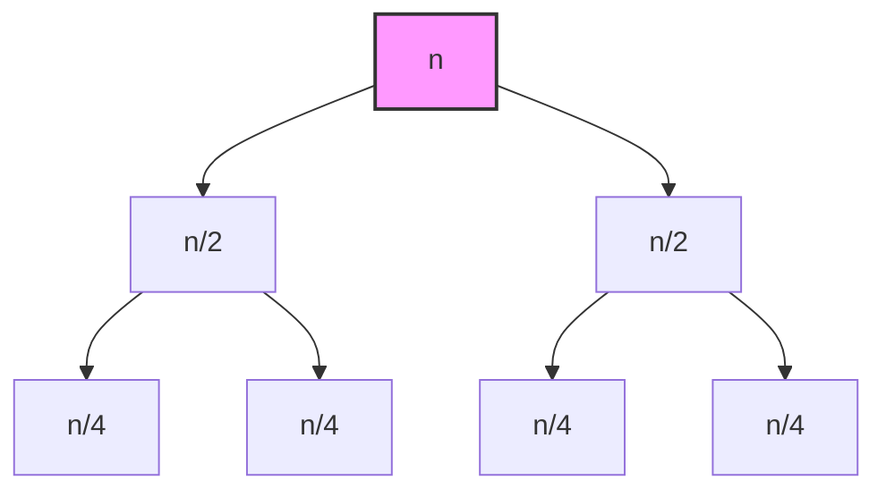
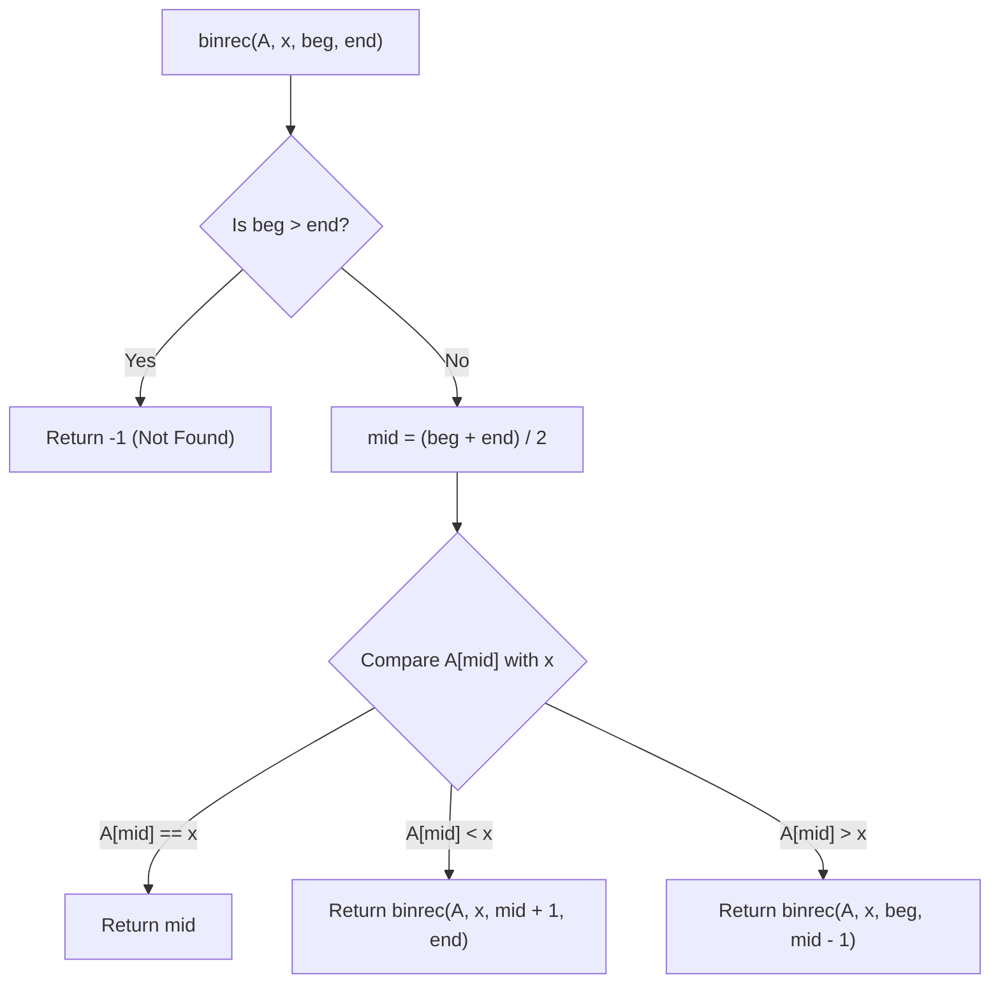
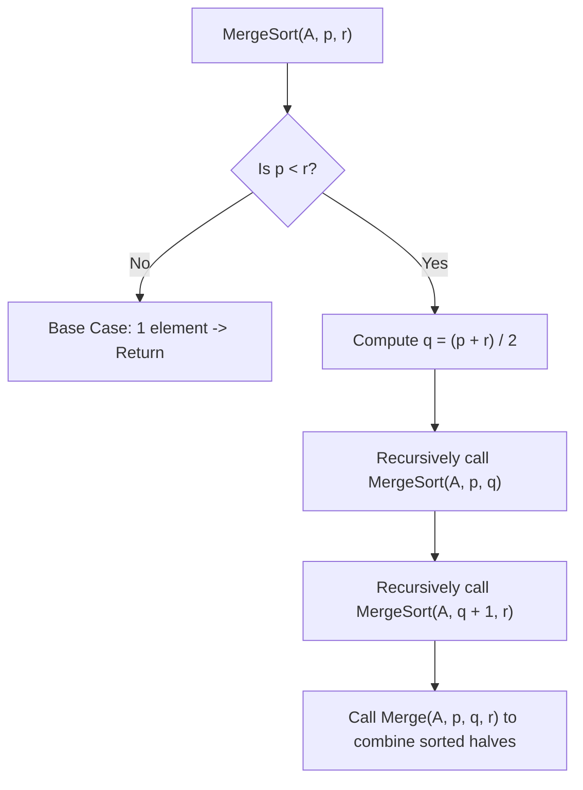
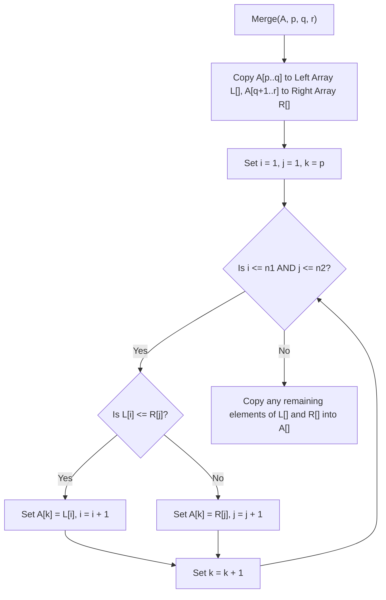
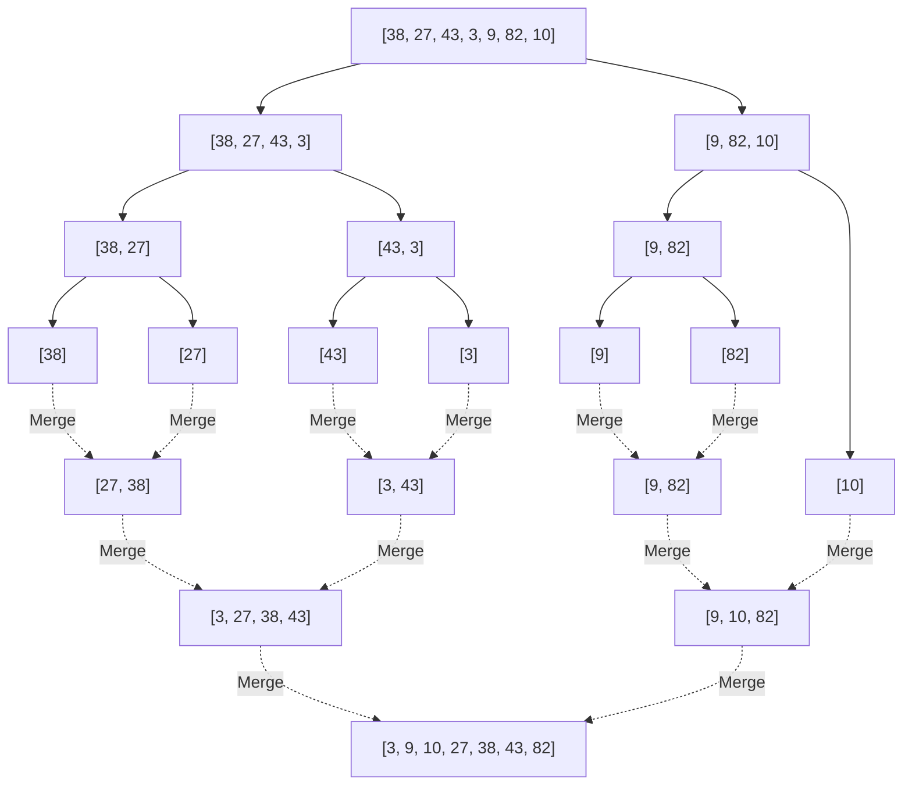
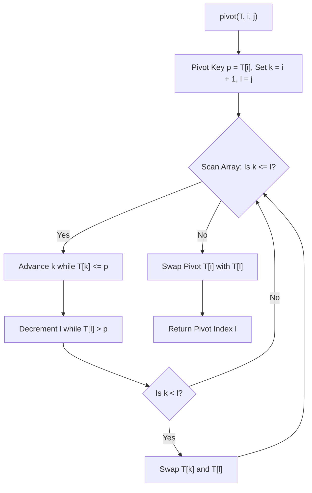
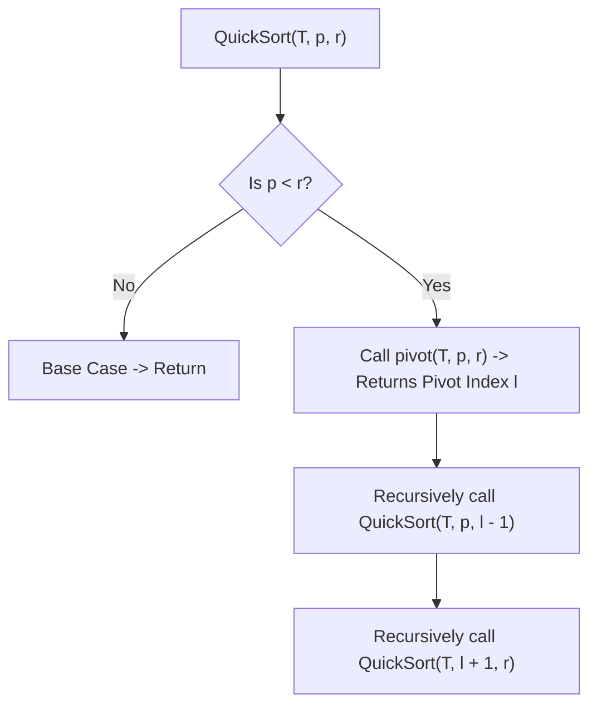
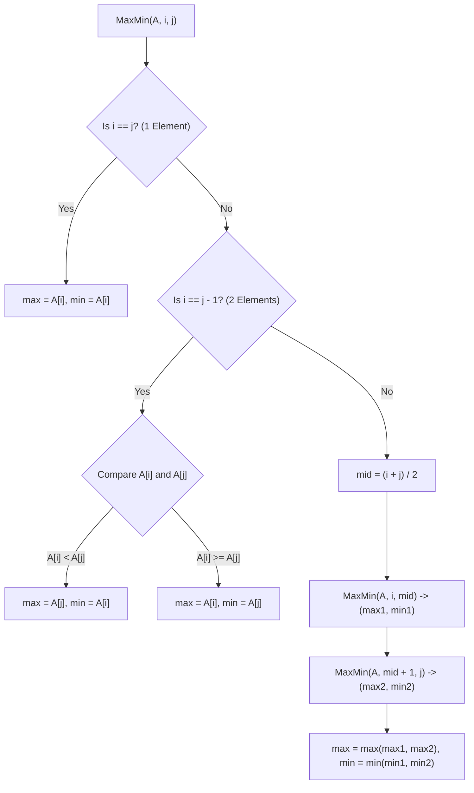

# Chapter 3: Complete DAA Notes — Recurrence Relations & Divide and Conquer

> **Course Code:** 3CS501CC24
> **Primary Source:** DAA_Unit3(a).pptx, DAA_Unit3(b).pptx

---

## 1. Chapter Overview

Many algorithms, particularly those based on the Divide and Conquer strategy, are recursive in nature. To analyze their time complexity, we formulate a recurrence relation—an equation or inequality that describes a function in terms of its values on smaller inputs. This unit focuses on methods to solve these recurrences and the application of the Divide and Conquer paradigm to design efficient algorithms such as Binary Search, Merge Sort, Quick Sort, Strassen’s Matrix Multiplication, and Large Integer Multiplication.

---
[Source: DAA_Unit3_a, Slide 3; DAA_Unit3_b, Slide 2]

## 2. Recurrence Relations — Introduction

### What is a recurrence relation?
A **recurrence relation** is an equation that defines a sequence based on a rule that gives the next term as a function of the previous term(s). In the context of algorithms, it is a recursive description of a function (often representing running time or space complexity).

### Why recursive algorithms lead to recurrences
When an algorithm calls itself on a smaller portion of the input, its total running time $T(n)$ for an input of size $n$ is equal to the time spent dividing the problem, plus the time spent solving the sub-problems recursively, plus the time spent combining the results.

### Setting up a recurrence from pseudocode
For a divide-and-conquer algorithm that divides a problem of size $n$ into $a$ sub-problems, each of size $n/b$, and takes $f(n)$ time to divide and combine:
$$
T(n) = aT(n/b) + f(n)
$$

---
[Source: DAA_Unit3_a, Slide 3 & 28]

## 3. Method 1 — Substitution Method

### Procedure
1. **Guess** the form of the solution (e.g., $O(n \log n)$, $O(n^2)$).
2. **Substitute** the guessed solution into the recurrence.
3. **Prove** by mathematical induction that the guess is correct (i.e., show that $T(n) \le c \cdot f(n)$ for some constant $c > 0$ and $n \ge n_0$).

### Rules for making a good guess
- Analyze the base cases and first few terms.
- Try to recognize patterns similar to known recurrences.
- If a guess fails by a lower-order term (e.g., you guess $c \cdot n$ but end up needing $c \cdot n - b$), subtract a lower-order term from your guess.

### Worked Examples

**Example 1: Solving $T(n) = T(n-1) + n$**
Using repeated substitution:
$$
T(n) = T(n-1) + n
$$
Substitute $T(n-1) = T(n-2) + (n-1)$:
$$
T(n) = (T(n-2) + n - 1) + n = T(n-2) + n + (n-1)
$$
Continuing this pattern for $k$ steps:
$$
T(n) = T(n-k) + n + (n-1) + \dots + (n-k+1)
$$
Assume the base case is $T(0) = 0$. The recursion bottoms out when $n-k = 0 \implies k = n$:
$$
T(n) = T(0) + n + (n-1) + \dots + 1
$$
$$
T(n) = 0 + \frac{n(n+1)}{2} = O(n^2)
$$

**Exercise 1: $T(n) = T(n/2) + 1$**
Using repeated substitution:
$$
T(n) = T(n/2) + 1
$$
$$
T(n) = (T(n/4) + 1) + 1 = T(n/4) + 2
$$
After $k$ steps:
$$
T(n) = T(n/2^k) + k
$$
Base case $T(1) = 1$ when $n/2^k = 1 \implies k = \log_2 n$:
$$
T(n) = T(1) + \log_2 n = 1 + \log_2 n = O(\log n)
$$

**Exercise 2: $T(n) = 2T(n/2) + n$**
$$
T(n) = 2T(n/2) + n
$$
$$
T(n) = 2(2T(n/4) + n/2) + n = 4T(n/4) + 2n
$$
After $k$ steps:
$$
T(n) = 2^k T(n/2^k) + k \cdot n
$$
For base case $T(1) = 1$, let $k = \log_2 n$:
$$
T(n) = 2^{\log_2 n} T(1) + (\log_2 n)n = n + n \log_2 n = O(n \log n)
$$

---
[Source: DAA_Unit3_a, Slides 5-8]

## 4. Method 2 — Homogeneous Method (Characteristic Equation)

### Procedure for linear homogeneous recurrences
A linear homogeneous recurrence of order $k$ has the form:
$$
a_0 T(n) + a_1 T(n-1) + a_2 T(n-2) + \dots + a_k T(n-k) = 0
$$
1. Write the **Characteristic Equation** by substituting $T(n) = r^n$:
$$
a_0 r^k + a_1 r^{k-1} + \dots + a_k = 0
$$
2. Solve for the roots $r_1, r_2, \dots, r_k$.
3. Form the general solution based on the roots.

### Case 1: Distinct Roots
If all roots $r_1, r_2, \dots, r_k$ are distinct:
$$
T(n) = c_1 r_1^n + c_2 r_2^n + \dots + c_k r_k^n
$$

### Case 2: Repeated Roots
If a root $r_1$ is repeated $m$ times, its contribution to the solution is:
$$
(c_1 + c_2 n + c_3 n^2 + \dots + c_m n^{m-1}) r_1^n
$$

### Worked Examples

**Example 1: $T(n) = T(n-1) + 2T(n-2)$, $T(0)=0, T(1)=1$**
1. Rewrite: $T(n) - T(n-1) - 2T(n-2) = 0$
2. Characteristic equation: $r^2 - r - 2 = 0$
3. Roots: $(r-2)(r+1) = 0 \implies r = 2, -1$
4. General form: $T(n) = c_1(2)^n + c_2(-1)^n$
5. Use initial conditions:
   $T(0) = c_1 + c_2 = 0$
   $T(1) = 2c_1 - c_2 = 1$
   Solving yields $c_1 = 1/3, c_2 = -1/3$.
6. Solution: $T(n) = \frac{1}{3} 2^n - \frac{1}{3} (-1)^n$

**Example 2: Fibonacci Sequence $T(n) = T(n-1) + T(n-2)$**
1. Char equation: $r^2 - r - 1 = 0$
2. Roots: $r_1 = \frac{1 + \sqrt{5}}{2}$, $r_2 = \frac{1 - \sqrt{5}}{2}$
3. Solution format: $T(n) = c_1 r_1^n + c_2 r_2^n$. The time complexity grows exponentially.

**Example 3: Tower of Hanoi $T(n) = 2T(n-1) + 1$**
This is non-homogeneous. To convert to homogeneous:
$T(n) - 2T(n-1) = 1$ (eq 1)
$T(n-1) - 2T(n-2) = 1$ (eq 2)
Subtracting eq 2 from eq 1:
$T(n) - 3T(n-1) + 2T(n-2) = 0$
Characteristic equation: $r^2 - 3r + 2 = 0 \implies (r-2)(r-1) = 0 \implies r=2, 1$
$T(n) = c_1 2^n + c_2 1^n$

---
[Source: DAA_Unit3_a, Slides 10-20]

## 5. Method 3 — Non-Homogeneous Method

A non-homogeneous recurrence has the form $a_0 T(n) + \dots + a_k T(n-k) = f(n)$, where $f(n) \neq 0$.

Total Solution $T(n) = T(n)_h + T(n)_p$
- **$T(n)_h$ (Homogeneous solution):** Set $f(n) = 0$ and solve.
- **$T(n)_p$ (Particular solution):** Depends on $f(n)$.

**Rules for $T(n)_p$:**
1. **$f(n)$ is a constant $C$**: Guess $T(n)_p = P$. If 1 is a characteristic root of multiplicity $m$, guess $T(n)_p = n^m P$.
2. **$f(n)$ is a polynomial of degree $d$**: Guess $T(n)_p = P_0 + P_1 n + \dots + P_d n^d$. If 1 is a root of multiplicity $m$, multiply the guess by $n^m$.
3. **$f(n)$ is exponential $C \cdot a^n$**:
   - If $a$ is NOT a characteristic root: Guess $T(n)_p = P \cdot a^n$.
   - If $a$ IS a characteristic root of multiplicity $m$: Guess $T(n)_p = n^m P \cdot a^n$.

### Worked Examples

**Example 1: $T(n) - 2T(n-1) + T(n-2) = 1$**
1. Homogeneous: $r^2 - 2r + 1 = 0 \implies (r-1)^2 = 0 \implies r=1, 1$. (Multiplicity 2 for root 1).
2. $T(n)_h = (c_1 + c_2 n)(1)^n = c_1 + c_2 n$
3. Particular: Since $f(n) = 1$ (constant) and root 1 has multiplicity 2, guess $T(n)_p = n^2 P$.
   Substitute into eq: $n^2 P - 2(n-1)^2 P + (n-2)^2 P = 1$
   $P [n^2 - 2(n^2 - 2n + 1) + (n^2 - 4n + 4)] = 1$
   $P [2] = 1 \implies P = 1/2$.
   $T(n)_p = \frac{1}{2} n^2$.
4. Total: $T(n) = c_1 + c_2 n + \frac{1}{2} n^2$.

**Example 2: $T(n) - 8T(n-1) = 14n + 5$**
1. Homogeneous: $r - 8 = 0 \implies r = 8$. $T(n)_h = c_1 8^n$.
2. Particular: $f(n)$ is polynomial degree 1. Guess $T(n)_p = d_0 + d_1 n$.
   Substitute: $(d_0 + d_1 n) - 8(d_0 + d_1(n-1)) = 14n + 5$.
   $-7d_0 + 8d_1 - 7d_1 n = 14n + 5$.
   Equate coefficients: $-7d_1 = 14 \implies d_1 = -2$.
   $-7d_0 + 8(-2) = 5 \implies -7d_0 = 21 \implies d_0 = -3$.
   $T(n)_p = -3 - 2n$.
3. Total: $T(n) = c_1 8^n - 3 - 2n$.

**Example 3: $T(n) - 8T(n-1) = 5 \cdot 2^n$**
1. Homogeneous: $r = 8$.
2. Particular: $f(n) = 5 \cdot 2^n$. Root $a=2$ is not a char root. Guess $T(n)_p = d \cdot 2^n$.
   Substitute: $d \cdot 2^n - 8 \cdot d \cdot 2^{n-1} = 5 \cdot 2^n$.
   $d \cdot 2^n - 4d \cdot 2^n = 5 \cdot 2^n$.
   $-3d = 5 \implies d = -5/3$.
3. Total: $T(n) = c_1 8^n - \frac{5}{3} 2^n$.

---
[Source: DAA_Unit3_a, Slides 21-27]

## 6. Method 4 — Master Method ★ (MOST IMPORTANT)

The Master Method is a cookbook approach for solving divide and conquer recurrences.

### Master Theorem (Formal Statement)
For a recurrence of the form:
$$
T(n) = aT\left(\frac{n}{b}\right) + f(n)
$$
where $a \ge 1$ is the number of sub-problems, $b > 1$ is the factor by which the problem size is divided, and $f(n)$ is the cost of dividing and combining. Let $c_{crit} = \log_b(a)$. We compare $f(n)$ to $n^{c_{crit}}$:

**Case 1:** If $f(n) = O(n^{\log_b(a) - \epsilon})$ for some constant $\epsilon > 0$.
(Cost is dominated by the leaves).
$$
T(n) = \Theta(n^{\log_b(a)})
$$

**Case 2:** If $f(n) = \Theta(n^{\log_b(a)})$.
(Cost is evenly distributed across levels).
$$
T(n) = \Theta(n^{\log_b(a)} \cdot \log n)
$$
*(Note: More generally, if $f(n) = \Theta(n^{\log_b(a)} \log^k n)$ for $k \ge 0$, then $T(n) = \Theta(n^{\log_b(a)} \log^{k+1} n)$).*

**Case 3:** If $f(n) = \Omega(n^{\log_b(a) + \epsilon})$ for some constant $\epsilon > 0$, AND the regularity condition holds: $a \cdot f(n/b) \le c \cdot f(n)$ for some constant $c < 1$ and sufficiently large $n$.
(Cost is dominated by the root).
$$
T(n) = \Theta(f(n))
$$

### Intuition for each case
- **Case 1:** The work grows geometrically as you go down the recursion tree. The vast majority of work is done at the leaves, so the time complexity is proportional to the number of leaves: $n^{\log_b(a)}$.
- **Case 2:** The work done at each level of the tree is roughly the same. Since there are $\log_b n$ levels, we multiply the work at the root $f(n) \approx n^{\log_b a}$ by $\log n$.
- **Case 3:** The work decreases geometrically as you go down the tree. The vast majority of work is done at the root, so the time complexity is proportional to $f(n)$.

### When Master Method does NOT apply
- $T(n)$ is not monotonic (e.g., $T(n) = \sin(n)$).
- $f(n)$ is not a polynomial (e.g., $f(n) = 2^n$).
- $a$ is not a constant or $a < 1$.
- The ratio $f(n) / n^{\log_b(a)}$ is not bounded by a polynomial factor $n^\epsilon$. For example, if $f(n) = n^{\log_b a} / \log n$, it falls into the gap between Case 1 and Case 2.

### Master Theorem for Subtract and Conquer Recurrences
For $T(n) = aT(n-b) + f(n)$ where $a > 0, b \ge 0$, and $f(n) \in O(n^k)$:
- If $a < 1 \implies T(n) = O(n^k)$
- If $a = 1 \implies T(n) = O(n^{k+1})$
- If $a > 1 \implies T(n) = O(a^{n/b} \cdot f(n))$

### Worked Examples

1. **$T(n) = 9T(n/3) + n$**
   - $a = 9$, $b = 3$, $f(n) = n$.
   - $n^{\log_b(a)} = n^{\log_3(9)} = n^2$.
   - Compare $f(n) = n$ with $n^2$. $f(n) = O(n^{2 - 1})$ so $\epsilon = 1 > 0$.
   - Applies to **Case 1**.
   - Result: $T(n) = \Theta(n^2)$.

2. **$T(n) = T(2n/3) + 1$**
   - $a = 1$, $b = 3/2$, $f(n) = 1$.
   - $n^{\log_b(a)} = n^{\log_{1.5}(1)} = n^0 = 1$.
   - Compare $f(n) = 1$ with $1$. $f(n) = \Theta(1)$.
   - Applies to **Case 2**.
   - Result: $T(n) = \Theta(1 \cdot \log n) = \Theta(\log n)$.

3. **$T(n) = 3T(n/4) + n \log n$**
   - $a = 3$, $b = 4$, $f(n) = n \log n$.
   - $n^{\log_b(a)} = n^{\log_4(3)} \approx n^{0.793}$.
   - Compare $f(n) = n \log n$ with $n^{0.793}$. $f(n) = \Omega(n^{0.793 + \epsilon})$.
   - Regularity check: $3(n/4) \log(n/4) \le c n \log n$. True for $c = 3/4$.
   - Applies to **Case 3**.
   - Result: $T(n) = \Theta(n \log n)$.

4. **$T(n) = 2T(n/2) + n \log n$**
   - $a = 2$, $b = 2$, $f(n) = n \log n$.
   - $n^{\log_b(a)} = n^{\log_2(2)} = n^1 = n$.
   - Compare $f(n) = n \log n$ with $n$. The ratio is $\log n$, which is asymptotically smaller than any polynomial $n^\epsilon$.
   - **Doesn't apply** directly via the basic 3 cases (falls into the polynomial gap between Case 2 and 3). *(Note: Using the generalized Case 2, it is $T(n) = \Theta(n \log^2 n)$).*

---
[Source: DAA_Unit3_a, Slides 28-42]

## 7. Method 5 — Recurrence Tree Method

A recursion tree is a visual representation of a divide-and-conquer algorithm.

### Steps to solve using Recurrence Tree
1. **Draw the tree:** Root represents $f(n)$, children represent the cost of sub-problems.
2. **Determine cost of each level:** Sum the costs of all nodes at that level.
3. **Determine total number of levels:** Find depth $x$ such that sub-problem size becomes 1. For size $n/b^x = 1 \implies x = \log_b n$. Total levels = $\log_b n + 1$.
4. **Determine number of nodes at last level:** $a^{\log_b n} = n^{\log_b a}$.
5. **Cost of last level:** $n^{\log_b a} \times T(1) = \Theta(n^{\log_b a})$.
6. **Total cost:** Add the costs across all levels (often forming a geometric series) plus the cost of the leaf level.

### Worked Example: $T(n) = 2T(n/2) + n$
**Step 1:** Draw tree.
Root = $n$. Level 1 nodes = $n/2, n/2$. Level 2 nodes = $n/4, n/4, n/4, n/4$.

**Step 2:** Cost at each level.
- Level 0: $n$
- Level 1: $n/2 + n/2 = n$
- Level 2: $4 \times (n/4) = n$
Each internal level costs exactly $n$.

**Step 3:** Total number of levels.
Size decreases by a factor of 2. $n/2^x = 1 \implies x = \log_2 n$.
Number of levels = $\log_2 n + 1$.

**Step 4 & 5:** Last level nodes and cost.
At level $\log_2 n$, there are $2^{\log_2 n} = n$ nodes, each of size 1.
Cost of last level = $n \times T(1) = \Theta(n)$.

**Step 6:** Total Cost.
Total cost = (Cost per level) $\times$ (Number of internal levels) + Cost of leaves
Total cost = $n \cdot \log_2 n + \Theta(n) = \Theta(n \log n)$.

---
[Source: DAA_Unit3_a, Slides 43-55]

## 8. Method 6 — Intelligent Guesswork (and Variable Transformation)

### Intelligent Guesswork
Guess an upper bound and prove it via mathematical induction.
**Example:** Guess $T(n) \le c n \log n$ for $T(n) = 2T(n/2) + n$.
Assume $T(n/2) \le c (n/2) \log(n/2)$.
$T(n) \le 2[c(n/2)\log(n/2)] + n$
$T(n) \le cn(\log n - \log 2) + n = cn\log n - cn + n$.
For $T(n) \le cn\log n$ to hold, we need $-cn + n \le 0 \implies c \ge 1$. Thus, the guess is correct.

### Change of Variable
Domain transformations substitute a function for the argument to make it easier to solve.
**Example: $T(n) = 2T(\sqrt{n}) + \log n$**
1. Let $n = 2^m \implies m = \log_2 n$.
   $T(2^m) = 2T(2^{m/2}) + m$
2. Define a new function $S(m) = T(2^m)$.
   $S(m) = 2S(m/2) + m$
3. Use Master Method on $S(m)$: $a=2, b=2, f(m)=m$. Case 2 applies.
   $S(m) = O(m \log m)$.
4. Substitute back $m = \log_2 n$:
   $T(n) = O(\log n \cdot \log(\log n))$.

### Range Transformation
Sometimes we transform the range.
**Example: $T(n) = n \cdot T^2(n/2)$**
1. Change variable $n = 2^m$, let $S(m) = T(2^m)$:
   $S(m) = 2^m \cdot S^2(m-1)$
2. Take log base 2 on both sides. Let $U(m) = \log_2 S(m)$:
   $\log_2 S(m) = \log_2(2^m) + \log_2(S^2(m-1))$
   $U(m) = m + 2 \cdot U(m-1)$
3. Now solve linear non-homogeneous recurrence $U(m) - 2U(m-1) = m$, and substitute back.

---
[Source: DAA_Unit3_a, Slides 56-63]

## 9. Comparison Table: Recurrence Solving Methods

| Method | When to Use | Difficulty / Nature | Example Use Case |
| :--- | :--- | :--- | :--- |
| **Substitution** | When a good guess can be made. | Can be tricky to guess exact form; requires rigorous induction proof. | Proving bounds for unusual recurrences. |
| **Homogeneous / Char Eq** | Linear recurrences with constant coefficients ($f(n)=0$). | Straightforward algebraic method. | Fibonacci sequence: $T(n)=T(n-1)+T(n-2)$. |
| **Non-Homogeneous** | Linear recurrences where $f(n)$ is polynomial, const, or exp. | Systematic but requires finding both homogeneous and particular parts. | Tower of Hanoi. |
| **Master Method** | Recurrences of form $aT(n/b) + f(n)$. | Very easy and direct; essentially a cookbook. | Merge Sort, Quick Sort (best case). |
| **Recursion Tree** | Complex divide-and-conquer where Master fails. | Intuitive and visual, good for finding a guess for substitution. | $T(n) = T(n/3) + T(2n/3) + O(n)$. |
| **Variable Transformation** | Domain involves powers, roots (e.g. $\sqrt{n}$). | Algebraic manipulation to map into a form for Master Theorem. | $T(n) = 2T(\sqrt{n}) + \log n$. |

---
[Source: Derived Summary from DAA_Unit3_a]

## 10. Divide & Conquer Paradigm

Many useful algorithms are recursive in structure: they call themselves recursively one or more times to solve a closely related sub-problem. This typically follows the **Divide and Conquer (D&C)** approach, which involves three steps at each level of recursion:

1. **Divide:** Break the problem into several sub-problems that are similar to the original problem but smaller in size.
2. **Conquer:** Solve the sub-problems recursively. If the sizes are small enough (base case), solve them in a straightforward manner.
3. **Combine:** Combine these solutions to create a solution to the original problem.

### General Recurrence
Let $T(n)$ be the time required by a D&C algorithm on an instance of size $n$.
$$
T(n) = a T\left(\frac{n}{b}\right) + f(n)
$$
where $a$ is the number of subproblems, $n/b$ is the size of each, and $f(n)$ is the cost of dividing and combining.

### When D&C Helps vs Hurts
- **Helps:** When dividing effectively reduces the problem size (e.g., $n \to n/2$) and subproblems do not overlap.
- **Hurts:** If we repeatedly solve overlapping subproblems (e.g., naive recursive Fibonacci), D&C leads to exponential time. (Dynamic programming is better here).

---
[Source: DAA_Unit3_b, Slides 2-3]

## 11. Algorithm: Binary Search

### Problem Statement
Given an array $A$ of $n$ elements sorted in increasing order, and a target key $x$. Find the index of $x$ in $A$, or return an indication that it is not present.

### Pseudocode (Iterative & Recursive)

**Iterative Approach:**
```text
Algorithm: BinarySearch(A[1...n], x)
    i = 1
    j = n
    while i <= j do
        k = (i + j) / 2
        if x == A[k] then
            return k
        else if x < A[k] then
            j = k - 1
        else
            i = k + 1
    return -1 (Not found)
```

**Recursive Approach:**


### Recurrence & Solution
In the worst case, binary search makes one recursive call on an array half the size, plus $O(1)$ work to find the midpoint and compare.
$$
T(n) = T(n/2) + O(1)
$$
Applying Master Theorem (Case 2: $a=1, b=2, f(n)=1 \implies n^{\log_2 1} = 1$):
$$
T(n) = \Theta(\log n)
$$

### Best/Worst Case
- **Best Case:** The element is exactly at the middle on the first check $\implies O(1)$.
- **Worst Case:** The element is not present or at the ends $\implies O(\log n)$.

---
[Source: DAA_Unit3_b, Slides 4-13]

## 12. Algorithm: Merge Sort

### Procedure
1. **Divide** the unsorted list into two sub-lists of about half the size.
2. **Conquer:** Sort each of the two sub-lists recursively until they have size 1.
3. **Combine:** Merge the two sorted sub-lists back into one sorted list.

### Pseudocode




### Recurrence & Solution
Dividing takes $O(1)$. Merging takes $\Theta(n)$.
$$
T(n) = 2T(n/2) + \Theta(n)
$$
By Master Theorem (Case 2, $a=2, b=2, f(n)=n \implies n^{\log_2 2} = n$):
$$
T(n) = \Theta(n \log n)
$$

### Example Trace on Array [38, 27, 43, 3, 9, 82, 10]


### Stability & Space
- **Stability:** It is stable (preserves the relative order of equal elements) due to `L[i] <= R[j]`.
- **Space Complexity:** $O(n)$ auxiliary space is required for the temporary arrays `L` and `R` during the Merge step.

---
[Source: DAA_Unit3_b, Slides 14-20]

## 13. Algorithm: Quick Sort

Quick Sort is an in-place, divide-and-conquer sorting algorithm.

### Procedure
1. Choose a **pivot** element.
2. **Partition** the array so that elements smaller than the pivot go to its left, and elements larger go to its right.
3. Recursively apply Quick Sort to the left and right sub-arrays.

### Hoare's Partition Pseudocode (From Slides)



### Complexity Analysis
**Worst Case:** Occurs when the array is already sorted or reverse sorted, and we always pick the first element as the pivot. The partition creates one sub-problem of size $n-1$ and one of size $0$.
$$
T(n) = T(n-1) + \Theta(n) \implies T(n) = \Theta(n^2)
$$

**Best Case:** Occurs when the partition exactly divides the array in half (size $n/2$).
$$
T(n) = 2T(n/2) + \Theta(n) \implies T(n) = \Theta(n \log n)
$$

**Average Case:** Assume a 9:1 proportional split at each step.
$$
T(n) = T(9n/10) + T(n/10) + \Theta(n) \implies T(n) = \Theta(n \log n)
$$

### Randomized Quick Sort
To prevent worst-case scenarios on sorted inputs, pick a random element as the pivot instead of always picking the first element. The expected running time becomes $O(n \log n)$ universally.

---
[Source: DAA_Unit3_b, Slides 21-30]

## 14. Algorithm: Finding Maximum & Minimum

*(Based on standard DAA Divide & Conquer syllabus)*

### Problem Statement
Find the maximum and minimum elements in an array $A$ of size $n$.

### Naive Approach
Iterate through the array, comparing each element to the current max and min.
Total comparisons = $2(n-1)$. (Or $3n/2$ if checking pairs sequentially).

### Divide and Conquer Approach
1. Divide array into two halves.
2. Recursively find $(max, min)$ in both halves.
3. Combine: Final $max = \max(max_{left}, max_{right})$, Final $min = \min(min_{left}, min_{right})$.

### Pseudocode


### Recurrence & Solution for Comparisons
Let $T(n)$ be the number of comparisons:
$$
T(n) = 2T(n/2) + 2
$$
Base cases: $T(1) = 0, T(2) = 1$.
Solving the recurrence gives $T(n) = \lceil \frac{3n}{2} \rceil - 2$.
This requires 25% fewer comparisons than the naive $2n$ method.

---

## 15. Algorithm: Strassen's Matrix Multiplication

### Naive Matrix Multiplication
Multiplying two $n \times n$ matrices requires $n^3$ multiplications.
$C_{i,j} = \sum_{k=1}^n A_{i,k} \cdot B_{k,j}$
Time Complexity: $O(n^3)$.

### Simple Divide & Conquer
Divide each matrix into four $n/2 \times n/2$ quadrants.
$$
\begin{bmatrix} C_{11} & C_{12} \\ C_{21} & C_{22} \end{bmatrix} =
\begin{bmatrix} A_{11} & A_{12} \\ A_{21} & A_{22} \end{bmatrix} \times
\begin{bmatrix} B_{11} & B_{12} \\ B_{21} & B_{22} \end{bmatrix}
$$
Requires 8 recursive multiplications of size $n/2$.
$$
T(n) = 8T(n/2) + O(n^2) \implies O(n^3)
$$
(No improvement over naive algorithm).

### Strassen's Idea
Volker Strassen discovered a way to compute the matrix product using only **7 recursive multiplications** instead of 8, by doing more additions/subtractions (which are cheaper, $O(n^2)$).

### The 7 Formulas
Compute 7 matrices $M_1 \dots M_7$:
$$
M_1 = (A_{11} + A_{22})(B_{11} + B_{22})
$$
$$
M_2 = (A_{21} + A_{22})B_{11}
$$
$$
M_3 = A_{11}(B_{12} - B_{22})
$$
$$
M_4 = A_{22}(B_{21} - B_{11})
$$
$$
M_5 = (A_{11} + A_{12})B_{22}
$$
$$
M_6 = (A_{21} - A_{11})(B_{11} + B_{12})
$$
$$
M_7 = (A_{12} - A_{22})(B_{21} + B_{22})
$$

Then combine them:
$$
C_{11} = M_1 + M_4 - M_5 + M_7
$$
$$
C_{12} = M_3 + M_5
$$
$$
C_{21} = M_2 + M_4
$$
$$
C_{22} = M_1 - M_2 + M_3 + M_6
$$

### Recurrence & Time Complexity
$$
T(n) = 7T(n/2) + \Theta(n^2)
$$
Using Master Theorem (Case 1: $a=7, b=2, f(n)=n^2$. Since $n^{\log_2 7} \approx n^{2.81} > n^2$):
$$
T(n) = O(n^{\log_2 7}) \approx O(n^{2.81})
$$

---
[Source: DAA_Unit3_b, Slides 39-51]

## 16. Algorithm: Large Integer Multiplication

### Problem Statement
Multiply two $n$-digit large integers $X$ and $Y$.

### Naive Approach
Grade-school multiplication takes $O(n^2)$ digit multiplications.

### Divide & Conquer (Karatsuba's Idea)
Split $X$ and $Y$ into two halves of size $n/2$:
$X = X_L \cdot 10^{n/2} + X_R$
$Y = Y_L \cdot 10^{n/2} + Y_R$

Product $X \cdot Y = X_L Y_L \cdot 10^n + (X_L Y_R + X_R Y_L) \cdot 10^{n/2} + X_R Y_R$
This directly requires 4 multiplications of size $n/2$.

**Optimization:**
We can compute the middle term using only one multiplication instead of two:
$(X_L Y_R + X_R Y_L) = (X_L + X_R)(Y_L + Y_R) - X_L Y_L - X_R Y_R$

So we only need 3 recursive multiplications:
1. $P = X_L \times Y_L$
2. $Q = X_R \times Y_R$
3. $R = (X_L + X_R) \times (Y_L + Y_R)$

### Recurrence & Solution
$$
T(n) = 3T(n/2) + O(n)
$$
Using Master Theorem: $a=3, b=2, f(n)=n$. $n^{\log_2 3} \approx n^{1.58} > n$.
$$
T(n) = O(n^{\log_2 3}) \approx O(n^{1.58})
$$
This reduces 25% of the computing time required for large multiplications.

---
[Source: DAA_Unit3_b, Slides 31-38]

## 17. Comparison Table: Sorting Algorithms

| Algorithm | Best Case | Average Case | Worst Case | Space Complexity | Stable | In-Place |
| :--- | :--- | :--- | :--- | :--- | :--- | :--- |
| **Merge Sort** | $O(n \log n)$ | $O(n \log n)$ | $O(n \log n)$ | $O(n)$ | Yes | No |
| **Quick Sort** | $O(n \log n)$ | $O(n \log n)$ | $O(n^2)$ | $O(\log n)$ (call stack) | No | Yes |
| **Binary Search** | $O(1)$ | $O(\log n)$ | $O(\log n)$ | $O(1)$ | N/A | N/A |

---

## 18. Formula Sheet

**Master Theorem for $T(n) = aT(n/b) + f(n)$:**
1. $f(n) = O(n^{\log_b a - \epsilon}) \implies T(n) = \Theta(n^{\log_b a})$
2. $f(n) = \Theta(n^{\log_b a}) \implies T(n) = \Theta(n^{\log_b a} \log n)$
3. $f(n) = \Omega(n^{\log_b a + \epsilon}) \implies T(n) = \Theta(f(n))$

**Homogeneous Characteristic Roots:**
- Distinct roots $r_1, r_2$: $c_1 r_1^n + c_2 r_2^n$
- Repeated root $r_1$ twice: $(c_1 + c_2 n)r_1^n$

**Algorithm Recurrences:**
- Binary Search: $T(n) = T(n/2) + 1 \implies O(\log n)$
- Merge Sort: $T(n) = 2T(n/2) + n \implies O(n \log n)$
- Quick Sort (Best/Avg): $T(n) = 2T(n/2) + n \implies O(n \log n)$
- Quick Sort (Worst): $T(n) = T(n-1) + n \implies O(n^2)$
- Strassen's Matrix: $T(n) = 7T(n/2) + n^2 \implies O(n^{2.81})$
- Large Integer Multi: $T(n) = 3T(n/2) + n \implies O(n^{1.58})$

---

## 19. Definition Sheet

1. **Recurrence Relation:** An equation that describes a function in terms of its value on smaller inputs.
2. **Divide and Conquer:** An algorithmic paradigm that divides a problem into smaller identical sub-problems, solves them recursively, and combines the results.
3. **Homogeneous Recurrence:** A linear recurrence relation where the right-hand side is zero ($f(n) = 0$).
4. **Characteristic Equation:** An algebraic equation obtained by substituting $T(n) = r^n$ into a homogeneous recurrence relation, used to find its roots.
5. **Strassen's Algorithm:** A D&C algorithm for matrix multiplication that reduces the number of recursive multiplications from 8 to 7, bringing time complexity below $O(n^3)$.
6. **In-place Algorithm:** An algorithm that uses only a small, constant amount of extra memory space (e.g., Quick Sort).
7. **Stable Sort:** A sorting algorithm that preserves the relative order of elements with equal keys (e.g., Merge Sort).

---

## 20. Exam-Oriented Review

1. Explain the Divide and Conquer strategy and write down its general time recurrence template.
2. Solve the recurrence $T(n) = 9T(n/3) + n$ using the Master Method. Show all steps.
3. Define the three cases of the Master Theorem formally.
4. Solve the homogeneous recurrence $T(n) = T(n-1) + 2T(n-2)$ given $T(0)=0, T(1)=1$.
5. When does the worst-case scenario occur in Quick Sort, and what is its recurrence relation?
6. Compare Merge Sort and Quick Sort in terms of time complexity, space complexity, and stability.
7. Explain the steps of the Substitution Method. Verify that $T(n) \le c n \log n$ is a solution for $T(n) = 2T(n/2) + n$.
8. How does Strassen’s Matrix Multiplication improve upon the simple divide-and-conquer approach? Provide its recurrence and time complexity.
9. Explain Karatsuba's Large Integer Multiplication algorithm. Why is it faster than the traditional method?
10. Apply the Recurrence Tree method to solve $T(n) = 2T(n/2) + n$. Show the sum of costs at all levels.
11. Solve the non-homogeneous recurrence $T(n) - 2T(n-1) + T(n-2) = 1$.
12. Why can't the Master Method be applied to $T(n) = 2T(n/2) + n \log n$? Explain the gap.
13. Write the pseudocode for Binary Search (recursive). Derive its time complexity.
14. Explain Hoare's partition algorithm for Quick Sort with a step-by-step trace on an example array.
15. By changing variables, solve $T(n) = 2T(\sqrt{n}) + \log n$.
