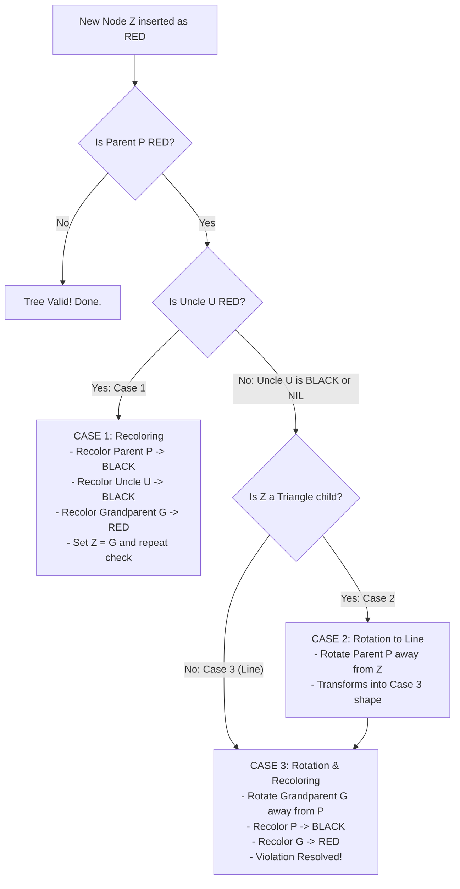
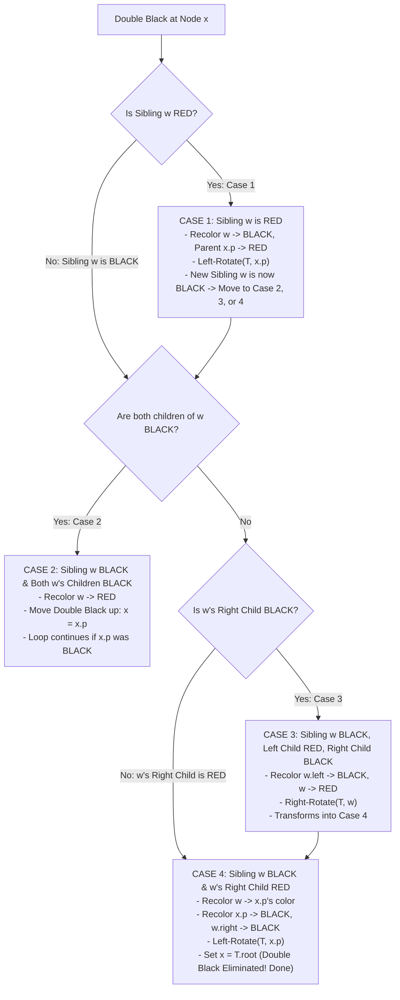
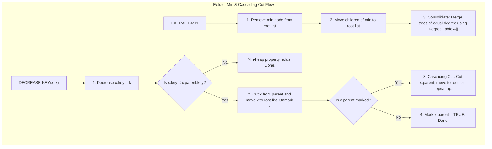

# Chapter 4: Unit 4 — Red-Black Trees, Binomial Heaps, Fibonacci Heaps & Amortised Analysis

> **Course Code:** 3CS501CC24
> **Focus:** Exam-Oriented Problem-Solving Guide, Step-by-Step Numerical Solved Examples & Mermaid Visualizations

---

## 1. Chapter Overview & Exam Problem-Solving Framework
In exam questions for Unit 4, you are rarely asked to write raw code. Instead, you are required to **trace algorithm execution step-by-step**, **show intermediate data structure states after each step**, **state the exact case/rule applied**, and **compute time/amortized complexities**.

This guide covers:
1. **Red-Black Trees (RBT):** Properties, Left/Right Rotations, Step-by-Step Insertion (3 Cases), and Step-by-Step Deletion Fixup (4 Cases based on CLRS `RB-DELETE-FIXUP`).
2. **Binomial Heaps:** Binomial Tree $B_k$ properties, Heap Union/Merge algorithm, Insert, Extract-Min, and Decrease-Key.
3. **Fibonacci Heaps:** Lazy structure, Min pointer, Cascading Cut, Extract-Min with Degree Table Consolidation.
4. **Amortised Analysis:** Aggregate Method, Accounting Method, and Potential Method ($\Phi$) applied to Dynamic Arrays and $k$-bit Binary Counters.

---

## 2. Red-Black Trees (RBT): Exam Guide & Rules

### The 5 Red-Black Tree Properties
Every Red-Black Tree node contains `color` (RED or BLACK), `key`, `left`, `right`, and `parent`.
1. **Node Color:** Every node is either **RED** or **BLACK**.
2. **Root Property:** The root is always **BLACK**.
3. **Leaf Property:** Every leaf (`NIL`) is **BLACK**.
4. **Red Property (No Red-Red Conflict):** If a node is **RED**, both of its children must be **BLACK**.
5. **Black-Height Property:** Every simple path from a node to any of its descendant `NIL` leaves contains the exact same number of **BLACK** nodes.

```mermaid
flowchart TD
    subgraph Valid Red-Black Tree Example (Black Height = 2)
        R["26 (BLACK)"] --- N17["17 (RED)"]
        R --- N41["41 (BLACK)"]
        N17 --- N14["14 (BLACK)"]
        N17 --- N21["21 (BLACK)"]
        N41 --- N30["30 (RED)"]
        N41 --- N47["47 (RED)"]

        style R fill:#000,stroke:#333,color:#fff
        style N17 fill:#f00,stroke:#333,color:#fff
        style N41 fill:#000,stroke:#333,color:#fff
        style N14 fill:#000,stroke:#333,color:#fff
        style N21 fill:#000,stroke:#333,color:#fff
        style N30 fill:#f00,stroke:#333,color:#fff
        style N47 fill:#f00,stroke:#333,color:#fff
    end
```

---

### Tree Rotations: Left-Rotate and Right-Rotate
Rotations preserve the Binary Search Tree property while changing tree height.

```mermaid
flowchart TD
    subgraph Left-Rotate(T, X)
        direction LR
        X1["X (BLACK)"] --- A1["Alpha"]
        X1 --- Y1["Y (RED)"]
        Y1 --- B1["Beta"]
        Y1 --- C1["Gamma"]
    end

    subgraph After Left-Rotate around X
        direction LR
        Y2["Y (RED)"] --- X2["X (BLACK)"]
        Y2 --- C2["Gamma"]
        X2 --- A2["Alpha"]
        X2 --- B2["Beta"]
    end
```

- **Left-Rotate(T, x):** Pivot $Y = x.\text{right}$. $Y$'s left child becomes $x$'s right child. $x$ becomes $Y$'s left child. $Y$ takes $x$'s place in the tree.
- **Right-Rotate(T, y):** Pivot $X = y.\text{left}$. $X$'s right child becomes $y$'s left child. $y$ becomes $X$'s right child. $X$ takes $y$'s place in the tree.

---

### Step-by-Step Insertion Algorithm & Cases

**Exam Solving Procedure for Insertion:**
1. Insert key $Z$ as a standard BST node and color it **RED**.
2. If $Z$ is the Root $\o$ Recolor $Z$ to **BLACK** (Property 2).
3. If $Z$'s Parent $P$ is **RED** $\o$ Red-Red Conflict! Look at $Z$'s **Uncle $U$** (sibling of $P$):



#### Solved Insertion Example
**Question:** Insert keys `[10, 20, 30, 15]` into an initially empty Red-Black Tree.

1. **Insert 10:** Root node $\o$ Color BLACK.
2. **Insert 20:** $20 > 10$, right child of 10. Color RED. Valid.
3. **Insert 30:** $30 > 20$, right child of 20. Color RED.
   - Parent $20$ is RED, Grandparent $10$ is BLACK, Uncle $U = \text{NIL}$ (BLACK).
   - Shape: $10 \o 20 \o 30$ (Line shape $\o$ **Case 3**).
   - **Action:** Left-Rotate around $10$, Recolor $20 \to \text{BLACK}, 10 \to \text{RED}$.
4. **Insert 15:** $15 < 20$ and $15 > 10$, right child of 10. Color RED.
   - Parent $10$ is RED, Uncle $U = 30$ is **RED** $\o$ **Case 1 (Uncle RED)**!
   - **Action:** Recolor Parent $10 \to \text{BLACK}$, Uncle $30 \to \text{BLACK}$, Grandparent $20 \to \text{RED}$.
   - Since $20$ is Root, recolor $20 \to \text{BLACK}$.

```mermaid
flowchart TD
    subgraph Final Red-Black Tree after inserting 10, 20, 30, 15
        N20["20 (BLACK)"] --- N10["10 (BLACK)"]
        N20 --- N30["30 (BLACK)"]
        N10 --- NIL1["NIL"]
        N10 --- N15["15 (RED)"]

        style N20 fill:#000,stroke:#333,color:#fff
        style N10 fill:#000,stroke:#333,color:#fff
        style N30 fill:#000,stroke:#333,color:#fff
        style N15 fill:#f00,stroke:#333,color:#fff
    end
```

---

### Step-by-Step Deletion Fixup Algorithm (`RB-DELETE-FIXUP`)

When a BLACK node is deleted, a **Double Black** is placed on its replacement node $x$. The function `RB-DELETE-FIXUP(T, x)` eliminates the Double Black using $x$'s **Sibling $w$**:



#### Summary Table for Exam Memory:
| Case | Condition | Action | Result |
| :--- | :--- | :--- | :--- |
| **Case 1** | Sibling $w$ is RED | Recolor $w \to \text{BLACK}, x.p \to \text{RED}$, Left-Rotate($x.p$). | Converts to Case 2, 3, or 4. |
| **Case 2** | Sibling $w$ is BLACK, both $w$'s children BLACK | Recolor $w \to \text{RED}$, move Double Black up to $x.p$. | Loop continues or terminates if $x.p$ was RED. |
| **Case 3** | Sibling $w$ is BLACK, $w.\text{left}$ RED, $w.\text{right}$ BLACK | Recolor $w.\text{left} \to \text{BLACK}, w \to \text{RED}$, Right-Rotate($w$). | Transforms into Case 4. |
| **Case 4** | Sibling $w$ is BLACK, $w.\text{right}$ is RED | Recolor $w \o x.p.\text{color}, x.p \to \text{BLACK}, w.\text{right} \to \text{BLACK}$, Left-Rotate($x.p$). | Double Black removed! Done. |

---

## 3. Binomial Heaps: Exam Guide & Operations

### Binomial Tree $B_k$ Definition & Properties
A Binomial Heap is a collection (forest) of Binomial Trees $B_0, B_1, B_2, \dots, B_k$ satisfying:
1. Each Binomial Tree $B_k$ has exactly $2^k$ nodes.
2. The height of $B_k$ is $k$.
3. $B_k$ has exactly $\binom{k}{i}$ nodes at depth $i$.
4. The root of $B_k$ has degree $k$, and its children are roots of $B_{k-1}, B_{k-2}, \dots, B_0$.
5. **Min-Heap Property:** Key of parent $\le$ Key of children.

```mermaid
flowchart TD
    subgraph Binomial Trees B0, B1, B2, B3
        subgraph B0 (1 Node)
            r0["10"]
        end
        subgraph B1 (2 Nodes)
            r1["12"] --- c11["25"]
        end
        subgraph B2 (4 Nodes)
            r2["15"] --- c21["28"]
            r2 --- c22["33"]
            c21 --- c211["41"]
        end
    end
```

---

### Step-by-Step Binomial Heap Union / Merge Algorithm
**Exam Step-by-Step Procedure:**
1. **Merge Root Lists:** Merge the root lists of two heaps $H_1$ and $H_2$ in monotonically increasing order of degree.
2. **Consolidate Equal Degrees:** Traverse the merged list. If two adjacent trees have the same degree $k$:
   - Compare their roots. The root with the **smaller key** becomes the parent of the other root.
   - The degree of the winning root increases to $k+1$.
   - Advance pointers and repeat until all degrees in the root list are distinct.

```mermaid
flowchart TD
    subgraph Merging two B2 trees (Roots 12 and 18)
        rA["12 (Degree 2)"] --- cA1["20"]
        rA --- cA2["25"]

        rB["18 (Degree 2)"] --- cB1["30"]
        rB --- cB2["35"]
    end

    subgraph Resulting B3 Tree (Root 12)
        rRes["12 (Degree 3)"] --- rB2["18 (Degree 2)"]
        rRes --- cA12["20"]
        rRes --- cA22["25"]
        rB2 --- cB12["30"]
        rB2 --- cB22["35"]
    end
```

---

## 4. Fibonacci Heaps: Exam Guide & Lazy Operations

### Structure & Key Concept
A Fibonacci Heap is a collection of min-heap-ordered trees. Unlike Binomial Heaps, Fibonacci Heaps use **lazy consolidation**—trees are merged only during `EXTRACT-MIN`.

Key attributes stored per node $x$:
- `key`, `degree` (number of children), `mark` (boolean indicating if $x$ lost a child since $x$ became a child of another node), `parent`, `child`, `left`, `right`.

### Complexity Comparison: Binomial vs Fibonacci Heap
| Operation | Binomial Heap | Fibonacci Heap (Amortized) |
| :--- | :--- | :--- |
| **Find-Min** | $O(1)$ | $O(1)$ |
| **Insert** | $O(\log n)$ | $O(1)$ |
| **Union** | $O(\log n)$ | $O(1)$ |
| **Extract-Min** | $O(\log n)$ | $O(\log n)$ |
| **Decrease-Key** | $O(\log n)$ | $O(1)$ |
| **Delete** | $O(\log n)$ | $O(\log n)$ |

---

### Step-by-Step Operations Execution

#### 1. Extract-Min Operation & Consolidation (Degree Table)
1. Remove min node $Z$ from the root list and add all of $Z$'s children to the root list.
2. **Consolidate Root List:** Create a degree array $A[0 \dots D(n)]$.
3. For each node $x$ in root list:
   - While $A[x.\text{degree}]
eq \text{NIL}$:
     - Let $y = A[x.\text{degree}]$ (another node with same degree).
     - Link $y$ under $x$ if $x.\text{key} \le y.\text{key}$ (or $x$ under $y$ if $y.\text{key} < x.\text{key}$).
     - Increment degree of winner.
   - Set $A[x.\text{degree}] = x$.
4. Rebuild root list from $A$ and update `min` pointer.



---

## 5. Amortised Analysis: Solved Exam Examples

Amortised analysis determines the average cost per operation in a sequence of $n$ operations, guaranteeing worst-case bounds without probabilistic assumptions.

### 1. Aggregate Method
- **Formula:** $\text{Amortized Cost} = \frac{T(n)}{n}$ where $T(n)$ is total cost of $n$ operations.
- **Example (Dynamic Array Expansion):**
  - Cost of $i$-th insertion: $c_i = i$ if $i-1$ is a power of 2 (triggers array doubling), else $c_i = 1$.
  - Total cost $T(n) = n + \sum_{j=0}^{\lfloor \log_2 n \rfloor} 2^j \le n + 2n = 3n$.
  - Amortized cost per insertion = $\frac{3n}{n} = O(1)$.

### 2. Accounting Method (Banker's Method)
- Assign **Amortized Charge** $\hat{c}_i$ to each operation.
- If $\hat{c}_i > c_i$ (actual cost), store difference as **Credit** in data structure.
- If $\hat{c}_i < c_i$, use stored credit to pay for expensive operation.
- **Rule:** Total credit must remain $\ge 0$ at all times: $\sum \hat{c}_i \ge \sum c_i$.

### 3. Potential Method ($\Phi$)
- Define potential function $\Phi(D_i)$ mapping data structure state $D_i$ to a real number.
- **Amortized Cost:** $\hat{c}_i = c_i + \Phi(D_i) - \Phi(D_{i-1}) = c_i + \Delta \Phi_i$.
- If $\Phi(D_n) \ge \Phi(D_0)$, then $\sum \hat{c}_i \ge \sum c_i$.

---

## 6. Exam-Oriented Review & Formula Sheet

### Quick Memory Checklist
1. **Red-Black Tree Height Bound:** $h \le 2 \log_2(n+1)$.
2. **RBT Insertion:** New node is RED. Uncle RED $\implies$ Case 1 (Recolor). Uncle BLACK $\implies$ Case 2/3 (Rotate).
3. **RBT Deletion:** Black node deletion $\implies$ Double Black. Sibling RED $\implies$ Case 1. Sibling BLACK with 2 Black children $\implies$ Case 2. Sibling BLACK with Red children $\implies$ Case 3/4.
4. **Binomial Tree $B_k$:** $2^k$ nodes, height $k$, degree of root $k$.
5. **Fibonacci Heap Amortized Complexity:** $O(1)$ for Insert, Union, Decrease-Key; $O(\log n)$ for Extract-Min and Delete.
6. **Potential Method Equation:** $\hat{c}_i = c_i + \Phi(D_i) - \Phi(D_{i-1})$.
