# Chapter 4: Unit 4 — Advanced Data Structures & Amortized Analysis

> **Course Code:** 3CS501CC24
> **Focus:** Red-Black Trees, Binomial Heaps, Fibonacci Heaps & Amortized Analysis (Comprehensive Exam & Problem-Solving Master Guide with Colorful Mermaid Diagrams)

---

## 1. Chapter Overview
This unit covers advanced data structures that guarantee logarithmic or constant amortized time complexities:
1. **Red-Black Trees (RBT):** Self-balancing binary search trees ensuring $O(\log n)$ worst-case bounds on search, insertion, and deletion.
2. **Binomial Heaps:** Forest of Binomial Trees supporting $O(\log n)$ worst-case merge/union operations.
3. **Fibonacci Heaps:** Lazy mergeable heaps supporting $O(1)$ amortized insertion, union, and decrease-key operations.
4. **Amortized Analysis:** Evaluating the average cost per operation over a sequence using Aggregate, Accounting, and Potential methods.

---

## 2. Red-Black Trees (RBT): Complete Case-by-Case Guide

### Definition & The 5 Red-Black Tree Properties
Every node in a Red-Black Tree has a `color` (**RED** or **BLACK**), `key`, `left`, `right`, and `parent`.
1. **Node Color:** Every node is either **RED** or **BLACK**.
2. **Root Property:** The root is always **BLACK**.
3. **Leaf Property:** Every leaf (`NIL`) is **BLACK**.
4. **Red Property (No Red-Red Conflict):** If a node is **RED**, both of its children must be **BLACK**.
5. **Black-Height Property:** Every simple path from a node to any of its descendant `NIL` leaves contains the exact same number of **BLACK** nodes.

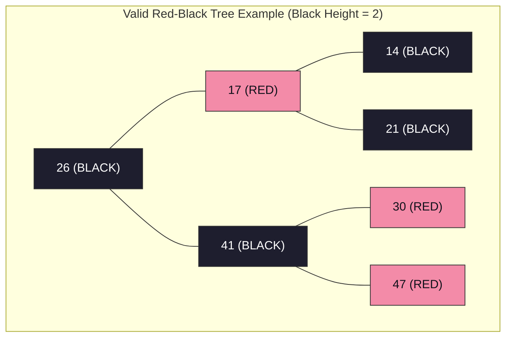

---

### Tree Rotations (Left-Rotate and Right-Rotate)

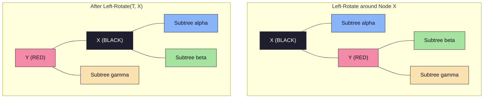

---

### Red-Black Tree Insertion: All 3 Cases with Diagrams

When inserting node $Z$:
1. Insert $Z$ using standard BST insertion and color $Z$ **RED**.
2. If $Z$ is root $\to$ Recolor $Z$ to **BLACK**.
3. If $Z$'s parent $P$ is **RED** $\to$ Red-Red Conflict! Look at $Z$'s **Uncle $U$** (sibling of $P$):

#### Case 1: Uncle $U$ is RED (Recoloring)
- **Condition:** Both Parent $P$ and Uncle $U$ are RED.
- **Steps:**
  1. Recolor Parent $P \to$ **BLACK**.
  2. Recolor Uncle $U \to$ **BLACK**.
  3. Recolor Grandparent $G \to$ **RED**.
  4. Set $Z = G$ and repeat check up the tree.

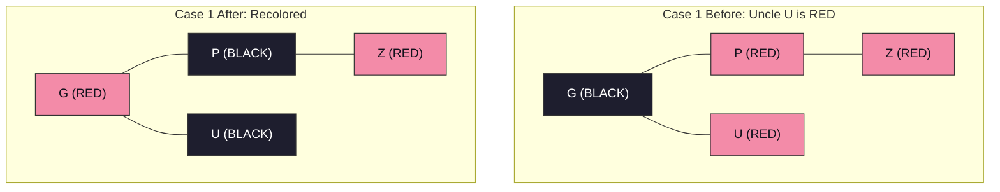

#### Case 2: Uncle $U$ is BLACK/NIL & $Z$ is a Triangle Child (Rotation to Line)
- **Condition:** Uncle $U$ is BLACK or NIL, $P$ is Left Child of $G$, and $Z$ is Right Child of $P$ (or vice-versa).
- **Steps:**
  1. Rotate Parent $P$ away from $Z$ (e.g. Left-Rotate around $P$).
  2. Set $Z = P$. $Z$ and $P$ are now in **Case 3 (Line)** shape.

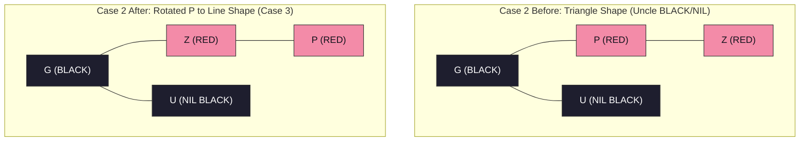

#### Case 3: Uncle $U$ is BLACK/NIL & $Z$ is a Line Child (Rotation & Recoloring)
- **Condition:** Uncle $U$ is BLACK or NIL, $P$ is Left Child of $G$, and $Z$ is Left Child of $P$ (or vice-versa).
- **Steps:**
  1. Rotate Grandparent $G$ away from $P$ (e.g. Right-Rotate around $G$).
  2. Recolor Parent $P \to$ **BLACK**.
  3. Recolor Grandparent $G \to$ **RED**.
  4. Red-Red conflict is fully resolved!

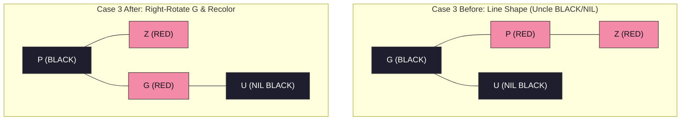

---

### Red-Black Tree Deletion: All 4 Cases (`RB-DELETE-FIXUP`)

When a BLACK node is deleted, its path loses 1 black node, creating a **Double Black** on replacement $X$. Let $W$ be $X$'s Sibling:

#### Case 1: Sibling $W$ is RED
- **Condition:** $W.\text{color} == \text{RED}$.
- **Steps:**
  1. Recolor Sibling $W \to$ **BLACK**.
  2. Recolor Parent $X.p \to$ **RED**.
  3. Left-Rotate($X.p$).
  4. New sibling is now BLACK $\to$ Proceed to Case 2, 3, or 4.

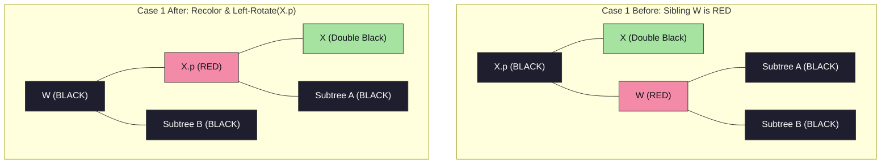

#### Case 2: Sibling $W$ is BLACK and Both Children of $W$ are BLACK
- **Condition:** $W.\text{color} == \text{BLACK}$, $W.\text{left}.\text{color} == \text{BLACK}$, $W.\text{right}.\text{color} == \text{BLACK}$.
- **Steps:**
  1. Recolor Sibling $W \to$ **RED**.
  2. Move Double Black up: Set $X = X.p$.
  3. If $X.p$ was RED, recolor $X \to$ **BLACK** and finish; otherwise repeat loop.

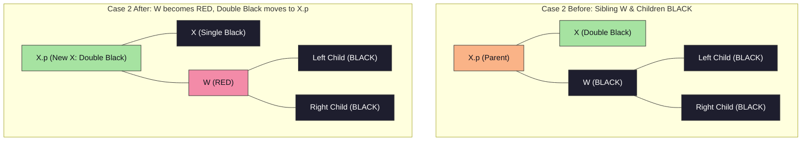

#### Case 3: Sibling $W$ is BLACK, Inner Child is RED, Outer Child is BLACK
- **Condition:** $W.\text{left}.\text{color} == \text{RED}, W.\text{right}.\text{color} == \text{BLACK}$.
- **Steps:**
  1. Recolor $W.\text{left} \to$ **BLACK**.
  2. Recolor Sibling $W \to$ **RED**.
  3. Right-Rotate($W$).
  4. Transforms into **Case 4**.

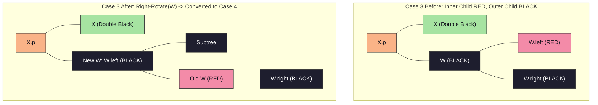

#### Case 4: Sibling $W$ is BLACK and Outer Child is RED
- **Condition:** $W.\text{right}.\text{color} == \text{RED}$.
- **Steps:**
  1. Recolor Sibling $W \to$ Parent $X.p$'s color.
  2. Recolor Parent $X.p \to$ **BLACK**.
  3. Recolor $W.\text{right} \to$ **BLACK**.
  4. Left-Rotate($X.p$).
  5. Set $X = T.\text{root}$ $\implies$ **Double Black fully eliminated!**

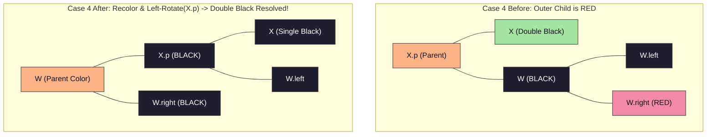

---

## 3. Binomial Heaps: Step-by-Step Operations & Cases

### Binomial Tree $B_k$ Properties
1. $B_k$ has $2^k$ total nodes.
2. Height of $B_k$ is $k$.
3. Root degree of $B_k$ is $k$.
4. $B_k$ is formed by making one $B_{k-1}$ the left child of another $B_{k-1}$.

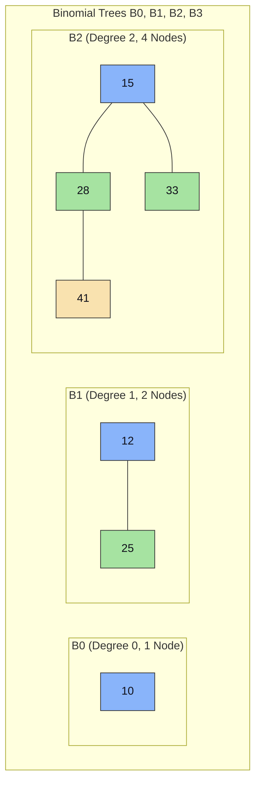

---

### Binomial Heap Union/Merge Algorithm (All Cases)

Given two Binomial Heaps $H_1$ and $H_2$:
1. **Merge Root Lists:** Merge root lists in ascending order of tree degree.
2. **Consolidate Equal Degrees:** Traverse root list with pointers `prev`, `curr`, `next`.
   - **Case A (Degrees Different):** `curr.degree != next.degree` $\implies$ Advance pointers.
   - **Case B (3 Equal Degrees):** `curr.degree == next.degree == next.next.degree` $\implies$ Advance pointers.
   - **Case C (2 Equal Degrees, `curr.key <= next.key`):** Link `next` under `curr` $\implies$ `curr` becomes parent of `next`. Degree of `curr` becomes $k+1$.
   - **Case D (2 Equal Degrees, `curr.key &gt; next.key`):** Link `curr` under `next` $\implies$ `next` becomes parent of `curr`.

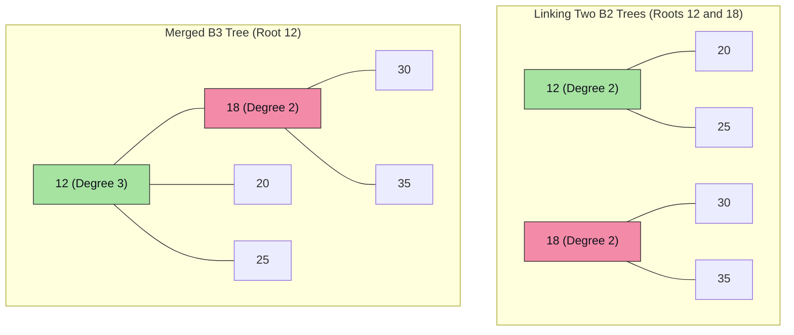

---

### Step-by-Step Solved Problem: Binomial Heap Operations

#### 1. Insert(H, x)
- Create a new single-node Binomial Heap $H'$ containing $x$ (a $B_0$ tree).
- Call `Binomial-Heap-Union(H, H')`.
- **Complexity:** $O(\log n)$.

#### 2. Extract-Min(H)
- Find root $x$ with minimum key in root list.
- Remove $x$ from root list.
- Reverse the order of $x$'s child subtrees to form a new Binomial Heap $H''$.
- Call `Binomial-Heap-Union(H, H'')`.
- **Complexity:** $O(\log n)$.

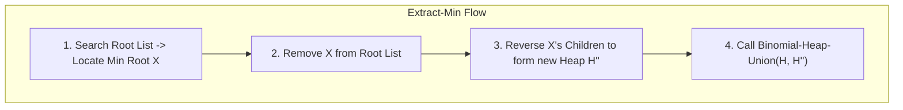

#### 3. Decrease-Key(H, x, k)
- Set $x.\text{key} = k$.
- While $x$ is not root and $x.\text{key} < x.\text{parent}.\text{key}$:
  - Swap key and satellite data between $x$ and $x.\text{parent}$.
  - Set $x = x.\text{parent}$.
- **Complexity:** $O(\log n)$.

---

## 4. Fibonacci Heaps: Step-by-Step Operations & Cases

### Key Attributes
- **Lazy Structure:** Trees are unstructured in root list until `Extract-Min`.
- **Min Pointer:** Points directly to root with minimum key.
- **Marked Attribute:** `mark[x]` is `TRUE` if node $x$ lost a child since $x$ was made a child of another node.

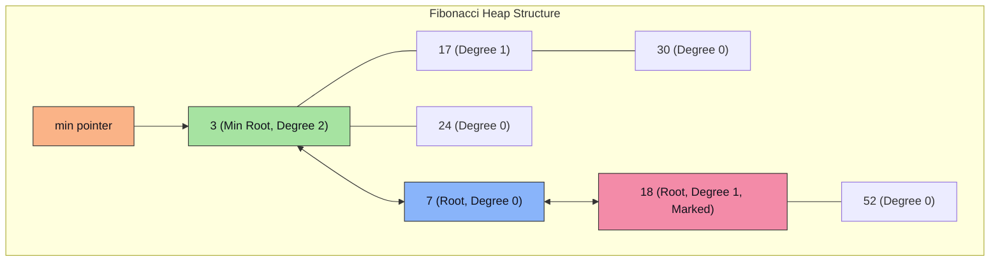

---

### Step-by-Step Fibonacci Heap Operations

#### 1. Insert(H, x) & Union(H1, H2)
- **Insert:** Create node $x$, add $x$ to $H$'s root list, update `min` pointer if $x.\text{key} < \text{min}.\text{key}$. Amortized Cost = $O(1)$.
- **Union:** Concatenate root lists of $H_1$ and $H_2$, update `min` pointer. Amortized Cost = $O(1)$.

#### 2. Extract-Min(H) & Consolidation
1. Remove `min` node $Z$ from root list.
2. Add all children of $Z$ to root list.
3. **Consolidate Root List:**
   - Initialize Degree Table $A[0 \dots D(n)] = \text{NIL}$.
   - For each node $x$ in root list:
     - $d = x.\text{degree}$.
     - While $A[d] \neq \text{NIL}$:
       - $y = A[d]$ (another root with degree $d$).
       - If $x.\text{key} > y.\text{key}$, swap $x$ and $y$.
       - Link $y$ under $x$ (`Fibonacci-Heap-Link`).
       - $A[d] = \text{NIL}, d = d + 1$.
     - $A[d] = x$.
4. Rebuild root list from $A[]$ and set `min` pointer. Amortized Cost = $O(\log n)$.

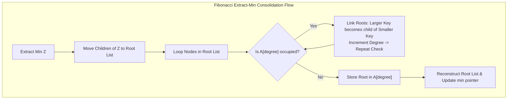

#### 3. Decrease-Key(H, x, k) & Cascading Cut
1. Set $x.\text{key} = k$.
2. If $x.\text{key} < x.\text{parent}.\text{key}$:
   - **Cut(H, x, y):** Remove $x$ from child list of $y = x.\text{parent}$, add $x$ to root list, set $x.\text{mark} = \text{FALSE}$.
   - **Cascading-Cut(H, y):**
     - $z = y.\text{parent}$.
     - If $y$ is not root:
       - If $y.\text{mark} == \text{FALSE} \implies$ Set $y.\text{mark} = \text{TRUE}$.
       - If $y.\text{mark} == \text{TRUE} \implies$ Cut $y$ from $z$, add $y$ to root list, recursively call `Cascading-Cut(H, z)`.

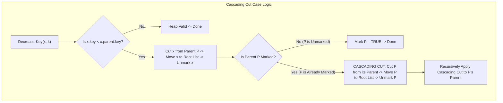

---

## 5. Amortised Analysis Methods

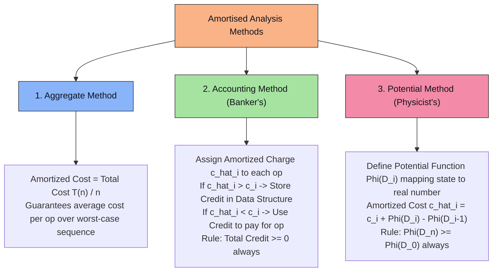

---

## 6. Exam-Oriented Review & Formula Sheet

1. **Red-Black Tree Height Guarantee:** $h \le 2 \log_2(n+1)$.
2. **RBT Insertion Cases:**
   - **Case 1:** Uncle RED $\implies$ Recolor Parent, Uncle, Grandparent.
   - **Case 2:** Uncle BLACK, Triangle $\implies$ Rotate Parent to Line.
   - **Case 3:** Uncle BLACK, Line $\implies$ Rotate Grandparent & Recolor.
3. **RBT Deletion Fixup Cases:**
   - **Case 1:** Sibling RED $\implies$ Recolor & Rotate Parent towards $X$.
   - **Case 2:** Sibling BLACK, 2 Black Children $\implies$ Recolor Sibling RED, move Double Black up.
   - **Case 3:** Sibling BLACK, Inner Red Child $\implies$ Rotate Sibling away from $X$ (converts to Case 4).
   - **Case 4:** Sibling BLACK, Outer Red Child $\implies$ Recolor & Rotate Parent towards $X$ (Eliminates Double Black).
4. **Binomial Tree $B_k$:** $2^k$ nodes, degree $k$, height $k$.
5. **Fibonacci Heap Amortized Complexity:** $O(1)$ for Insert, Union, Decrease-Key; $O(\log n)$ for Extract-Min and Delete.
6. **Potential Method Equation:** $\hat{c}_i = c_i + \Phi(D_i) - \Phi(D_{i-1})$.
