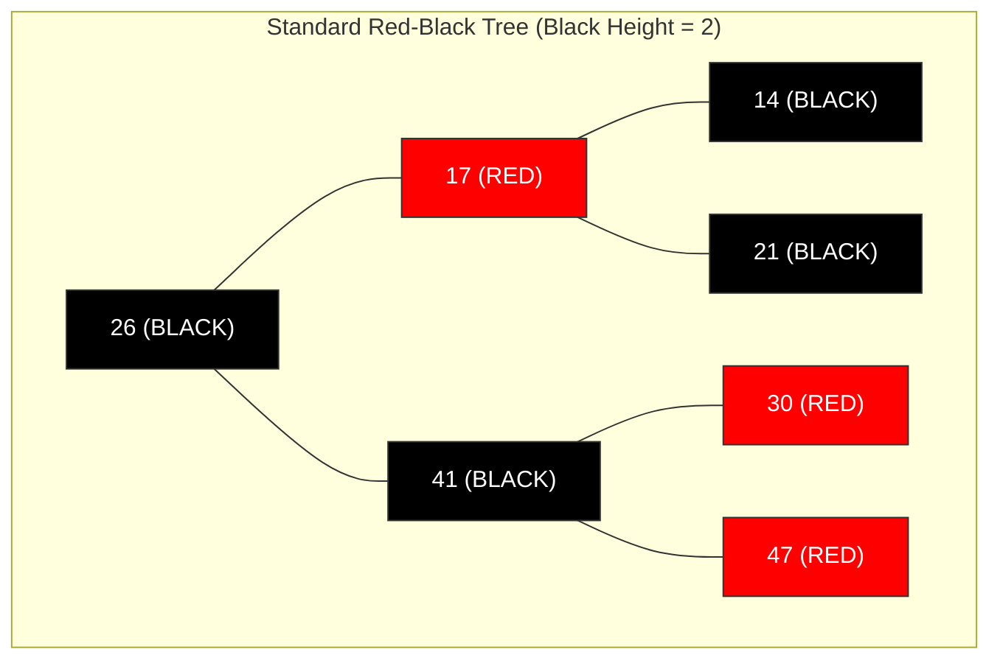
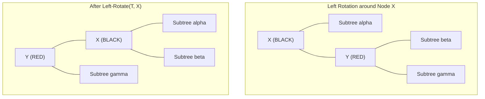
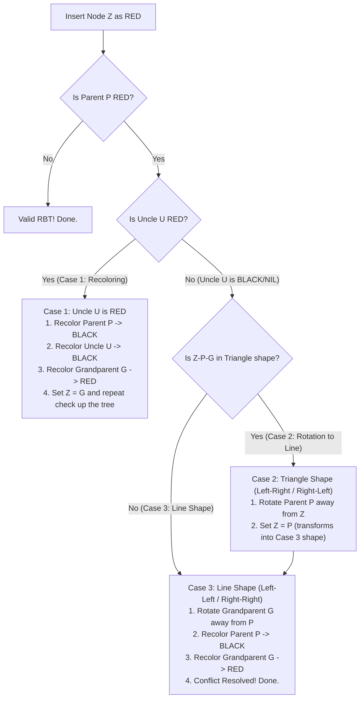
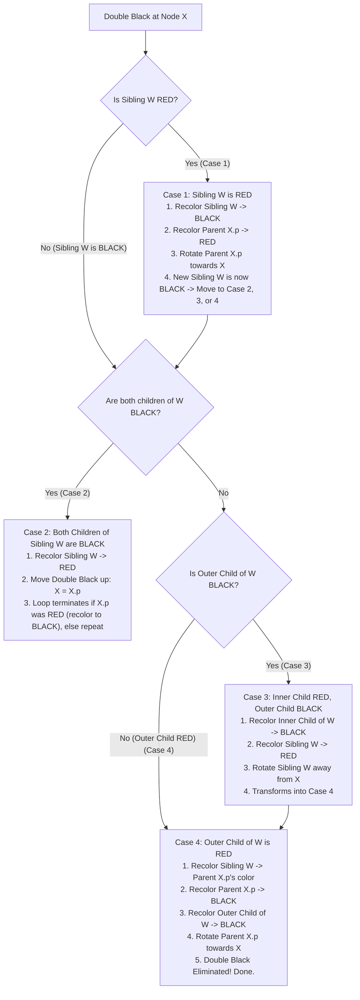
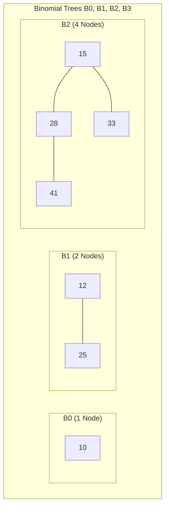
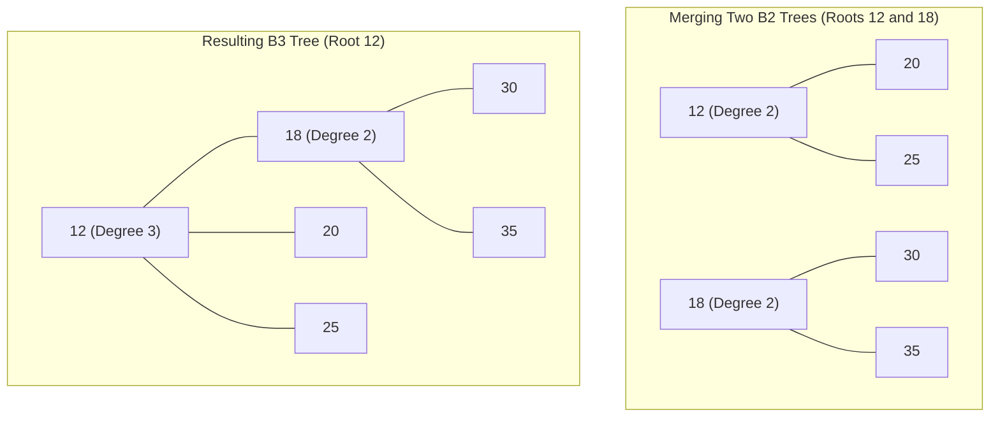
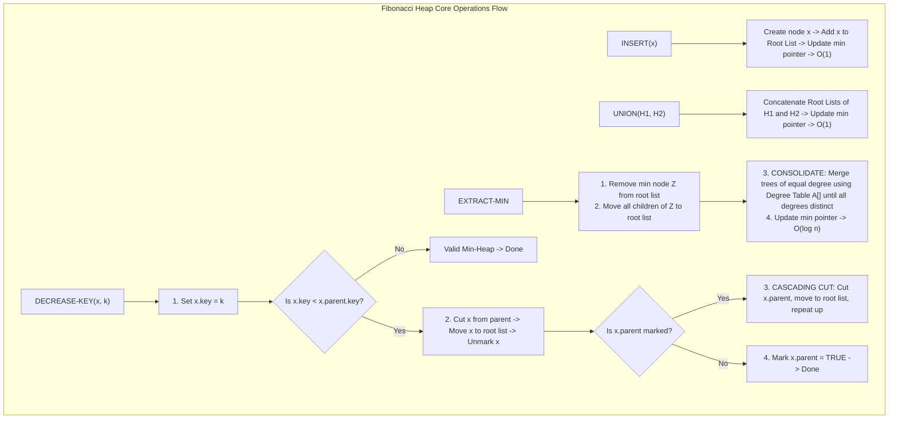
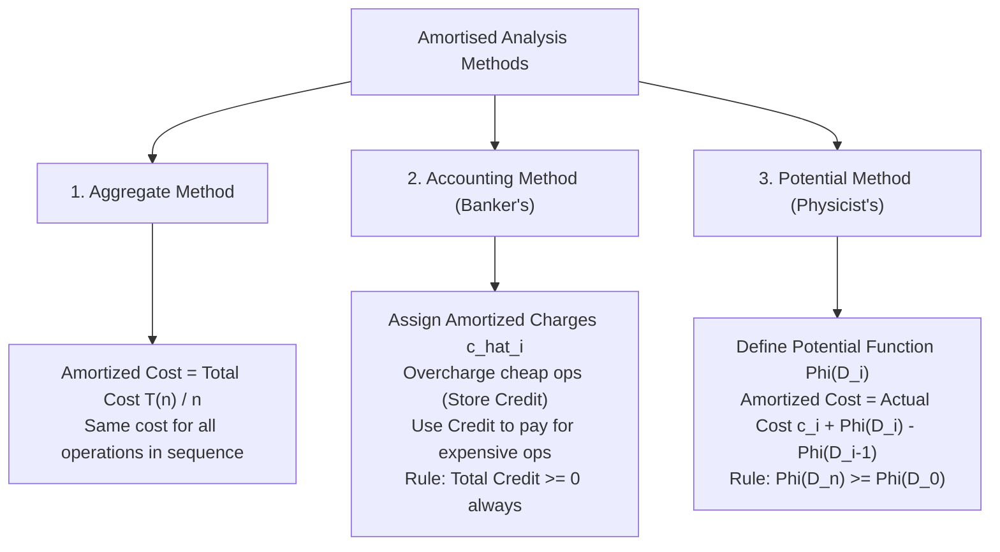

# Chapter 4: Unit 4 — Advanced Data Structures & Amortized Analysis

> **Course Code:** 3CS501CC24
> **Focus:** Red-Black Trees, Binomial Heaps, Fibonacci Heaps & Amortized Analysis (Standardized Exam & Problem-Solving Guide)

---

## 1. Chapter Overview
This unit covers four essential advanced topics in algorithm design and data structures:
1. **Red-Black Trees:** Self-balancing binary search trees ensuring $O(\log n)$ worst-case bounds.
2. **Binomial Heaps:** Forest of Binomial Trees supporting efficient $O(\log n)$ union/merge operations.
3. **Fibonacci Heaps:** Lazy mergeable heaps supporting $O(1)$ amortized insertion, union, and decrease-key operations.
4. **Amortized Analysis:** Evaluating the average cost per operation over a worst-case sequence using Aggregate, Accounting, and Potential methods.

---

## 2. Red-Black Trees (RBT)

### Definition & The 5 Properties
A Red-Black Tree is a binary search tree where each node has a `color` attribute (**RED** or **BLACK**).
1. **Node Color Property:** Every node is either **RED** or **BLACK**.
2. **Root Property:** The root node is always **BLACK**.
3. **Leaf Property:** Every leaf (`NIL`) node is **BLACK**.
4. **Red Property (No Consecutive Reds):** If a node is **RED**, both of its children must be **BLACK**.
5. **Black-Height Property:** Every simple path from a node to any of its descendant `NIL` leaves contains the exact same number of **BLACK** nodes.

### Tree Rotations (Left-Rotate and Right-Rotate)
Rotations adjust tree height while maintaining the BST ordering invariant.

### Red-Black Tree Insertion: Step-by-Step Rules & Cases
1. Insert key $Z$ using standard BST insertion and color $Z$ **RED**.
2. If $Z$ is root $\to$ Recolor $Z$ to **BLACK**.
3. If Parent $P$ is **RED** $\to$ Red-Red Conflict! Inspect $Z$'s **Uncle $U$** (sibling of $P$):

---

### Red-Black Tree Deletion: Step-by-Step Rules & Cases (`RB-DELETE-FIXUP`)
When a **BLACK** node is deleted, its path loses one black node. A **Double Black** is placed on its replacement $X$.

---

## 3. Binomial Heaps

### Definition & Binomial Tree $B_k$ Properties
A Binomial Heap is a collection of Binomial Trees $B_0, B_1, B_2, \dots, B_k$ satisfying:
1. **$B_k$ Tree Structure:** A Binomial Tree $B_k$ is formed by linking two $B_{k-1}$ trees together (one becomes the left child of the other).
2. **Node Count:** $B_k$ contains exactly $2^k$ nodes.
3. **Tree Height:** Height of $B_k$ is $k$.
4. **Root Degree:** The root of $B_k$ has degree $k$.
5. **Depth Distribution:** $B_k$ has exactly $\binom{k}{i}$ nodes at depth $i$.
6. **Min-Heap Order:** Key of parent $\le$ Key of children.

### Binomial Heap Union/Merge Algorithm: Step-by-Step Rules
1. **Merge Root Lists:** Merge the root lists of two heaps $H_1$ and $H_2$ in ascending order of tree degree.
2. **Consolidate Duplicate Degrees:** Traverse the merged list. If two adjacent trees have the same degree $k$:
   - Compare their roots. The root with the **smaller key** stays as root.
   - Link the root with the **larger key** as the leftmost child of the smaller root.
   - Increment degree of winning root to $k+1$.
   - Continue until all tree degrees in the root list are strictly distinct.

---

## 4. Fibonacci Heaps

### Structure & Key Concept
A Fibonacci Heap is a collection of min-heap-ordered trees utilizing **lazy operations**. Trees are not merged immediately during `Insert` or `Union`; merging is deferred until `Extract-Min`.

Node Attributes:
- `key`, `degree`, `mark` (boolean: `TRUE` if node lost a child since becoming child of parent), `parent`, `child`, `left`, `right`.

### Step-by-Step Operation Rules

---

## 5. Amortised Analysis Methods

---

## 6. Exam-Oriented Review & Formula Sheet

1. **Red-Black Tree Height Guarantee:** $h \le 2 \log_2(n+1)$.
2. **RBT Insertion Rule:** Uncle RED $\implies$ Case 1 (Recolor). Uncle BLACK $\implies$ Case 2 (Rotate to Line) / Case 3 (Rotate Grandparent).
3. **RBT Deletion Rule:** Sibling RED $\implies$ Case 1. Sibling BLACK + 2 Black Children $\implies$ Case 2. Sibling BLACK + Outer Red Child $\implies$ Case 4 (Eliminate Double Black).
4. **Binomial Tree $B_k$:** $2^k$ nodes, degree $k$, height $k$.
5. **Fibonacci Heap Amortized Complexity:** $O(1)$ for Insert, Union, Decrease-Key; $O(\log n)$ for Extract-Min.
6. **Potential Equation:** $\hat{c}_i = c_i + \Phi(D_i) - \Phi(D_{i-1})$.
