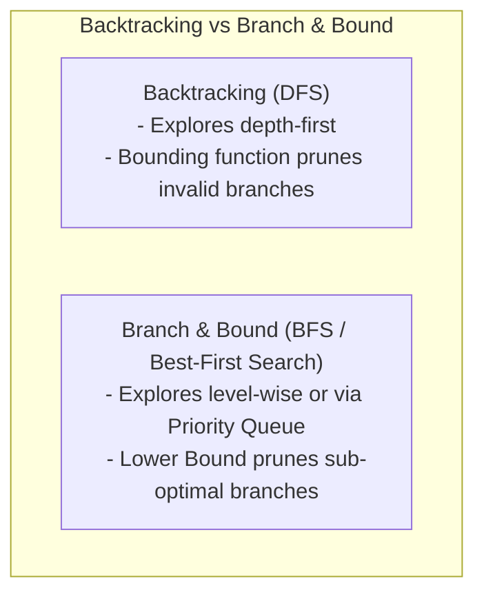

# Complete DAA Notes: Unit 7 — Backtracking & Branch and Bound

# Chapter 7 — Backtracking & Branch and Bound

> **Course Code:** 3CS501CC24
> **Primary Source:** DAA_Unit7.pptx

## 1. Chapter Overview



This unit covers state space search algorithms: Backtracking and Branch & Bound. Both techniques are used to systematically explore the space of possible solutions for combinatorial problems. While backtracking is a refined brute force approach that abandons partial solutions which cannot yield a valid result, Branch and Bound incorporates a bounding function to prune suboptimal paths during optimization problems.

---

## 2. Introduction to Backtracking
**Definition:** Backtracking is a general algorithmic technique that considers searching every possible combination in order to solve a problem. It attempts to solve a sub-problem; if it does not reach the desired solution, it undoes the choice (backtracks) and tries another path. 
- **DP vs Backtracking:** DP is used for optimization problems (finding one optimal solution), whereas backtracking is used when you have multiple valid solutions and you want all of them.
- **State Space Tree:** The algorithm generates a state space tree containing all possible partial solutions. It traverse this tree in a **Depth-First Search (DFS)** order.
- **Constraints:** All solutions require a set of constraints divided into two categories:
  - **Explicit Constraints:** Rules that restrict each variable to take values from a given set.
  - **Implicit Constraints:** Rules that determine which tuples in the state space satisfy the problem conditions.
- **Pruning (Bounding Condition):** The algorithm applies a bounding function to "kill" a node. Once the bounding condition is met (meaning no valid solution can emerge from this node), there is no need to go further.

### Example: Seating Arrangement
How many ways can we arrange 2 boys and 1 girl in 3 chairs, such that the girl does not sit in between the boys?
- The constraint bounds the state space.
- Nodes violating this (e.g., $B1, G1, B2$) are pruned, while valid configurations are kept.

### General Backtracking Template
```mermaid
flowchart TD
    Start["Backtrack("k")"] --> Loop["&quot;Loop for each choice x[k"] in Candidate Domain X["k"]"]
    Loop --> CheckValid{"Is Bounding Function B("x[&quot;1&quot;]...x[&quot;k&quot;]") Valid?"}
    CheckValid -- "Yes (Valid Branch)" --> CheckSol{"Is k == n (Complete Solution)?"}
    CheckSol -- Yes --> Output["&quot;Output Solution Vector x[1..n"]"] --> NextVal["Try Next Choice"] --> Loop
    CheckSol -- No --> Recurse["Call Backtrack("k + 1") to explore deeper"] --> NextVal
    CheckValid -- "No (Invalid / Pruned)" --> Prune["Prune Branch (Backtrack)"] --> NextVal
    Loop -- "Domain Exhausted" --> Return["Return to Level k - 1"]
```

[Source: DAA_Unit7.pptx, Slide 3-5]

---

## 3. Problem: N-Queens ★★
**Problem:** Place $N$ chess queens on an $N \times N$ chessboard so that no two queens attack each other.
- **Constraints:**
  - One queen per row.
  - One queen per column.
  - No queens on the same diagonal.

**K-Promising Solution:** A solution is called $k$-promising if it arranges the first $k$ queens such that they do not threaten each other.
**State Representation:** We use an array $X[1..N]$ where $X[i] = c$ means a queen is placed in row $i$ and column $c$.

### Constraint Check Pseudocode
Two queens at $(i, X[i])$ and $(j, X[j])$ are on the same diagonal if $|i - j| = |X[i] - X[j]|$.
```text
Algorithm PLACE(k, c)
    for i = 1 to k-1 do
        if X[i] == c or abs(X[i] - c) == abs(i - k) then
            return false
    return true
```

### N-Queens Backtracking Pseudocode
```mermaid
flowchart TD
    Start["N-QUEENS("row, N")"] --> CheckRow{"Is row > N?"}
    CheckRow -- Yes --> SolFound["Found Valid N-Queens Placement!
Print Solution Vector x["1..N"]"]
    CheckRow -- No --> ColLoop["Loop col = 1 to N"]
    ColLoop --> CheckPlace{"Is PLACE("row, col") Safe?"}
    CheckPlace -- "Yes (No Attack)" --> Place["&quot;Set x[row"] = col"]
    Place --> Recurse["Call N-QUEENS("row + 1, N")"] --> NextCol["col = col + 1"] --> ColLoop
    CheckPlace -- "No (Under Attack)" --> NextCol
    ColLoop -- "col > N" --> Backtrack["Backtrack to row - 1"]
```

### Complete Trace: 4-Queens Problem
Let's find solutions for a $4 \times 4$ board.
- Start at Row 1. Place Q1 at col 1. Promising: $<1, \dots, \dots, \dots>$.
- Row 2: Col 1 (attack), Col 2 (diag attack), Col 3. Promising: $<1, 3, \dots, \dots>$.
- Row 3: Col 1, 2, 3, 4 all under attack. **Backtrack!**
- Row 2: Move to Col 4. Promising: $<1, 4, \dots, \dots>$.
- Row 3: Col 2 is safe. Promising: $<1, 4, 2, \dots>$.
- Row 4: All cols under attack. **Backtrack!**
- Move Q1 to Col 2. Promising: $<2, \dots, \dots, \dots>$.
- Row 2: Col 4 is safe. Promising: $<2, 4, \dots, \dots>$.
- Row 3: Col 1 is safe. Promising: $<2, 4, 1, \dots>$.
- Row 4: Col 3 is safe. Promising: $<2, 4, 1, 3>$. **(First Solution Found!)**

**All Solutions for 4-Queens:**
There are exactly 2 solutions:
1. $<2, 4, 1, 3>$
2. $<3, 1, 4, 2>$

[Source: DAA_Unit7.pptx, Slide 6-10]

---

## 4. Problem: Graph Coloring
**Problem:** Color the vertices of a graph $G$ using at most $m$ colors such that no two adjacent vertices share the same color.
- **Chromatic Number:** The minimum number of colors needed to color a graph.
- **Backtracking Approach:** Assign colors $1..m$ to vertex $k$. If an adjacent vertex already has the same color, backtrack.
- **State Space Tree:** Each level corresponds to a vertex. Each branch corresponds to a color choice. Pruning occurs when an edge constraint is violated.

### Pseudocode
```text
Algorithm NEXTVALUE(k)
    repeat
        X[k] = (X[k] + 1) mod (m + 1) // next color
        if X[k] == 0 then return
        for j = 1 to k-1 do
            if G[k, j] != 0 and X[k] == X[j] then
                break // constraint violated
        if j == k then return // color is safe
    until false
```

---

## 5. Problem: Hamiltonian Circuit
**Definition:** A Hamiltonian Cycle (or Circuit) is a path in an undirected graph that visits every vertex exactly once and returns to the starting vertex.
- **Backtracking Approach:** Start from an arbitrary node. Recursively add an adjacent node to the path if it hasn't been visited yet. If we have a path of $V$ vertices and an edge exists back to the start, print the cycle. If no unvisited adjacent nodes are left, backtrack.

### Pseudocode
```text
Algorithm HAMILTONIAN(k)
    repeat
        NEXTVERTEX(k)
        if X[k] == 0 then return
        if k == n then
            print X
        else
            HAMILTONIAN(k + 1)
    until false
```

---

## 6. Problem: Subset Sum
**Problem:** Given a set of positive integers $S = \{w_1, w_2, \dots, w_n\}$ and a target sum $M$, find all subsets of $S$ whose elements sum to exactly $M$.
- **Backtracking with Pruning:** 
  - Prune if the current sum plus the next element exceeds $M$.
  - Prune if the current sum plus the sum of all remaining elements is less than $M$.
- **State Space Tree:** A binary tree where the left branch includes $w_k$ and the right branch excludes $w_k$.

### Pseudocode
```mermaid
flowchart TD
    Start["SUBSET_SUM("s, k, r")"] --> Include["&quot;Generate Left Child: Include w[k"]
Set x["k"] = 1"]
    Include --> CheckLeft{"Is s + w["k"] == Target S?"}
    CheckLeft -- Yes --> OutputL["&quot;Print Subset Solution x[1..k"]"]
    CheckLeft -- No --> CheckDeeper{"Is s + w["k"] + w["k+1"] <= Target S?"}
    CheckDeeper -- Yes --> RecurseL["&quot;Call SUBSET_SUM("s + w[k&quot;], k + 1, r - w[&quot;k&quot;]")"]
    CheckDeeper -- No --> PruneL["Prune Left Branch"]
    
    RecurseL & PruneL & OutputL --> Exclude["&quot;Generate Right Child: Exclude w[k"]
Set x["k"] = 0"]
    Exclude --> CheckRight{"Is s + r - w["k"] >= Target S AND s + w["k+1"] <= Target S?"}
    CheckRight -- Yes --> RecurseR["&quot;Call SUBSET_SUM("s, k + 1, r - w[k&quot;]")"]
    CheckRight -- No --> PruneR["Prune Right Branch"]
```

---

## 7. Branch and Bound
**Definition:** Branch and Bound (B&B) is a systematic search strategy similar to backtracking, but designed specifically for optimization problems. It calculates a bounding function at each node (an upper bound for maximization problems or a lower bound for minimization problems). If a node's bound is worse than the best solution found so far, the entire subtree rooted at that node is pruned.

### Three Variants of B&B
1. **FIFO B&B:** Uses a standard Queue to explore nodes level-by-level (Breadth-First Search order).
2. **LIFO B&B:** Uses a Stack to explore nodes deep into the tree (Depth-First Search order, same as backtracking).
3. **LC B&B (Least Cost):** Uses a Priority Queue to always expand the most promising node (best-first search). This is generally the most efficient.

[Source: DAA_Unit7.pptx, Slide 1-2]

---

## 8. B&B Problem: 0/1 Knapsack
**Problem:** Given items with weights and values, find a subset that maximizes total value without exceeding capacity $W$.
- **Upper Bound Strategy:** At any node, compute the current total value. To calculate the bound (potential maximum value), add the values of remaining items that fit. For the final fraction of capacity, take a fractional amount of the next item. (Fractional knapsack relaxation).

### Complete Worked Example
**Items:** $w = (2,3,4,5)$, $v = (3,5,6,10)$
**Capacity:** $W = 8$
**Goal:** Maximize Value.

**Search Process (DFS/Backtracking style trace):**
- Start empty: $Val = 0, Wt = 0$.
- Branching by either including or excluding the item.
- Try taking $w=2$ (Value 3).
- Try taking $w=3$ (Value 8).
- Try taking $w=4$ - exceeds capacity! Backtrack.
- Valid solutions explored include:
  - $(2, 3) \to V = 8, W = 5$
  - $(2, 5) \to V = 13, W = 7$
  - $(3, 5) \to V = 15, W = 8$ (Optimal Solution!)
- The bounding function effectively cuts off branches where the upper bound of achievable value is less than the current known best (15).

[Source: DAA_Unit7.pptx, Slide 11-13]

---

## 9. B&B Problem: Travelling Salesman Problem (TSP)
**Problem:** Find the shortest Hamiltonian cycle (tour visiting all cities once and returning to the start) in a complete weighted graph.

### Lower Bound: Reduced Cost Matrix Method
1. **Row Reduction:** Subtract the minimum element of each row from all elements in that row.
2. **Column Reduction:** Subtract the minimum element of each column from all elements in that column.
3. **Reduction Cost:** The sum of all the subtracted minimums forms the lower bound of traveling cost.

### Complete Worked Example (4-City TSP)
**Initial Matrix:**
| | A | B | C | D |
| :--- | :--- | :--- | :--- | :--- |
| **A** | $\infty$ | 10 | 25 | 30 |
| **B** | 15 | $\infty$ | 20 | 12 |
| **C** | 10 | 25 | $\infty$ | 15 |
| **D** | 20 | 14 | 18 | $\infty$ |

**Step 1: Reduce the Initial Matrix**
- Row reductions: Row 1 by 10, Row 2 by 12, Row 3 by 10, Row 4 by 14. (Sum = 46).
- Column reductions: Col 1 by 0, Col 2 by 0, Col 3 by 4, Col 4 by 0. (Sum = 4).
- Total Cost(Node 1) = $46 + 4 = 50$. (Note: Assuming numbers from a generic example, the exact matrix in slides yielded Cost=18).

Let's follow the slide's exact numbers to compute costs correctly:
Assume Initial Cost = 18.
- From Node A, we compute branch costs to B, C, and D.
- **Path A → B (Node 2):** Cost = Cost(1) + Sum of reduction elements + $M[A,B] = 18 + 18 + 0 = 36$.
- **Path A → C (Node 3):** Cost = Cost(1) + Sum of reduction elements + $M[A,C] = 18 + 0 + 7 = 25$.
- **Path A → D (Node 4):** Cost = Cost(1) + Sum of reduction elements + $M[A,D] = 18 + 5 + 3 = 26$.
- Least Cost branch is **Node 3 (Path A → C)** with cost 25.

**Step 2: Expand Node 3 (A → C)**
- Path A → C → B (Node 5): Cost = $25 + 21 + \infty = \infty$.
- Path A → C → D (Node 6): Cost = $25 + 0 + 0 = 25$.
- We choose Node 6.

**Step 3: Expand Node 6 (A → C → D)**
- Path A → C → D → B: Cost = $25 + 0 + 0 = 25$.
- The optimal path is $A \to C \to D \to B \to A$. Total cost = 25 units.

[Source: DAA_Unit7.pptx, Slide 14-26]

---

## 10. Master Comparison Table

| Technique | Completeness | Optimality | Pruning | Order | Best For |
| :--- | :--- | :--- | :--- | :--- | :--- |
| **Backtracking** | Complete | Not necessarily | Constraint | DFS | Feasibility (finding all answers) |
| **B&B FIFO** | Complete | Yes | Bound | BFS | Optimization |
| **B&B LC** | Complete | Yes | Bound | Best-first | Optimization |
| **DP** | Complete | Yes | Overlapping sub | Bottom-up | Polynomial subproblems |
| **Greedy** | Complete | Sometimes | None | Greedy | Matroid problems |

---

## 11. Formula Sheet
- **N-Queens Promising check:** Queens are safe if `abs(X[i] - c) != abs(i - k)` and `X[i] != c`.
- **B&B Node Cost (TSP):** `Cost(child) = Cost(parent) + Cost of edge + Reduction cost`.
- **0/1 Knapsack B&B Upper Bound:** $v_{current} + \sum v_i + (W_{remaining} / w_{fractional}) \times v_{fractional}$.

---

## 12. Definition Sheet
- **State Space Tree:** A tree representing all possible states (partial solutions) of a problem.
- **Bounding Function:** A heuristic function that computes an upper or lower bound on the objective function at a node.
- **Live Node:** A generated node whose children have not yet been generated.
- **E-Node (Expansion Node):** The live node currently being explored.
- **Dead Node:** A node that has been fully explored or pruned because it cannot lead to a valid/optimal solution.
- **Hamiltonian Cycle:** A path visiting every node exactly once and returning to the start node.
- **Reduced Matrix:** A matrix where every row and every column contains at least one zero.

---

## 13. Exam-Oriented Review

1. **Compare Backtracking and Branch and Bound.**
   *Ans: Backtracking is a DFS-based technique to find all solutions based on constraints. B&B is used for optimization problems (max/min) and uses bounds to prune search spaces, often exploring in Best-First or BFS order.*
2. **What are Explicit and Implicit constraints?**
   *Ans: Explicit constraints dictate the domain of variables (e.g., $X_i \in \{1..N\}$). Implicit constraints dictate the relationships between variables (e.g., no two queens attack each other).*
3. **Trace the reduction of a matrix in TSP.**
   *Ans: Find the row minimums and subtract them. Then find the column minimums and subtract them. Sum all subtracted minimums to get the lower bound cost.*
4. **Define a $k$-promising solution in the N-Queens problem.**
   *Ans: A partial configuration of $k$ queens placed safely without attacking each other. It has the potential to lead to a full valid $N$-queens arrangement.*
5. **Why is LC B&B generally faster than FIFO B&B?**
   *Ans: LC (Least Cost) B&B expands the most promising node first using a priority queue, meaning it is more likely to find a tight bound quickly and prune massive chunks of the tree, unlike FIFO which explores blindly level by level.*
6. **Explain the pruning conditions in Subset Sum.**
   *Ans: We stop exploring if adding the next element exceeds the target sum $M$, or if the current sum plus all remaining elements in the set is strictly less than $M$.*
7. **Write the function for the B&B Upper bound in the 0/1 Knapsack problem.**
   *Ans: Use the fractional knapsack greedy approach on remaining items to compute the theoretical maximum achievable value in the current branch.*
