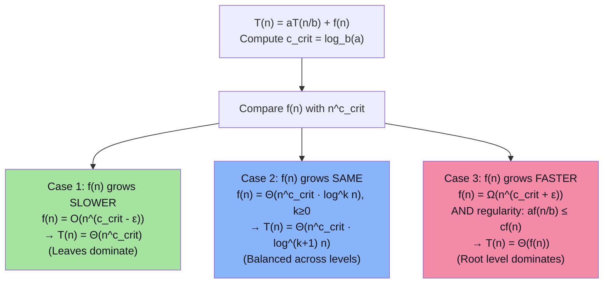
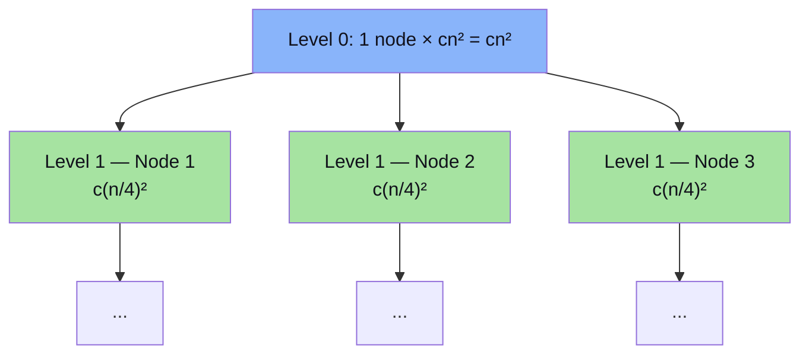
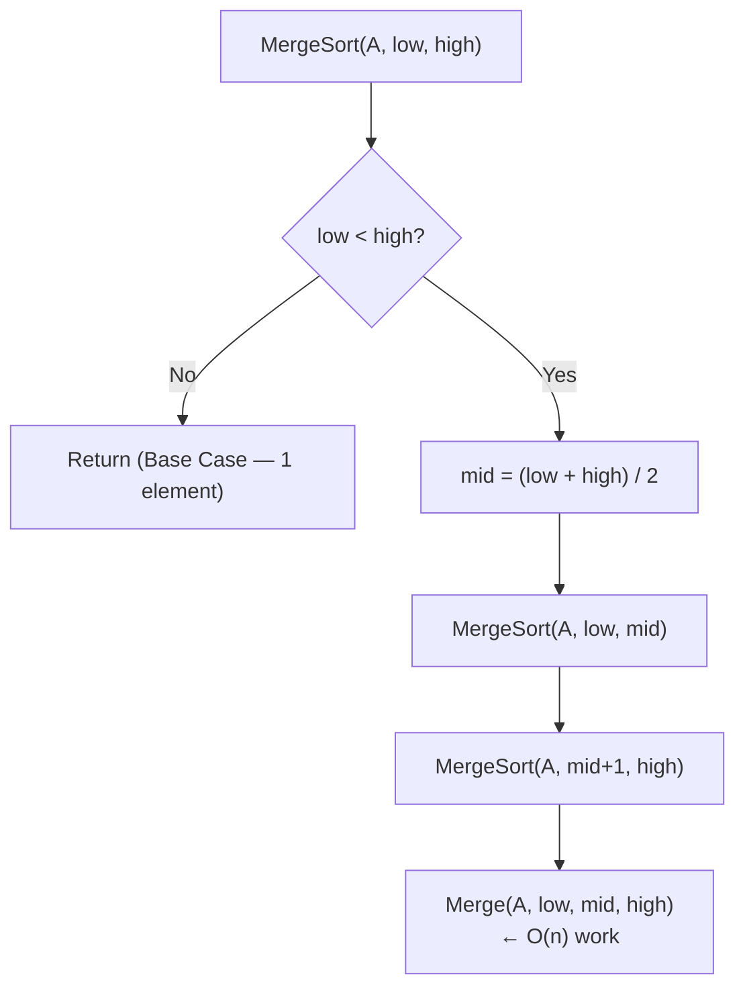
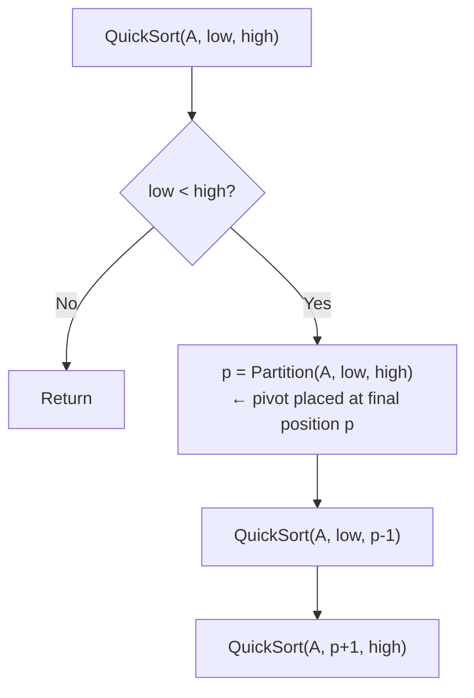
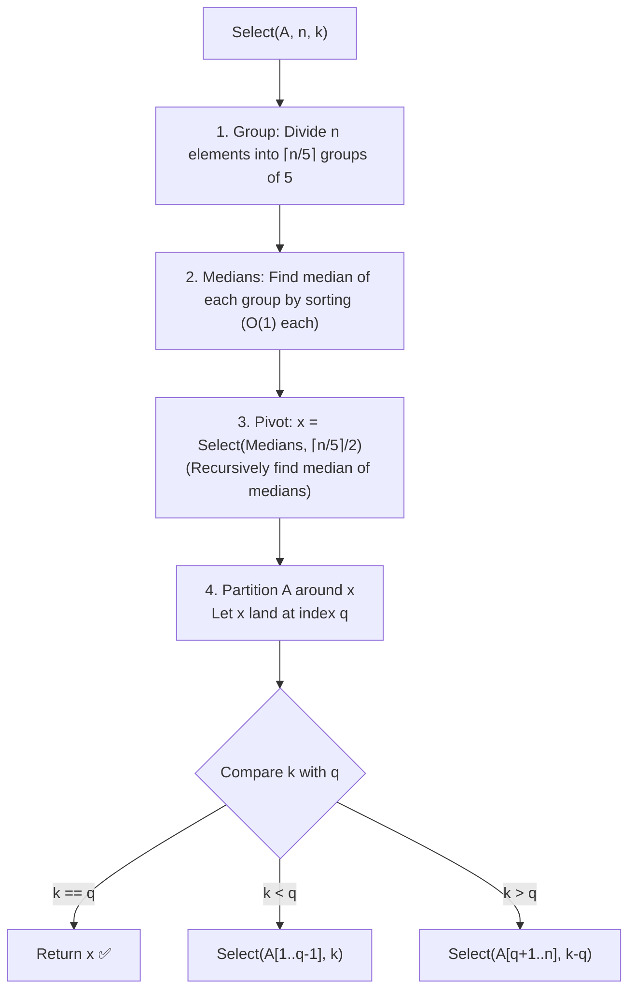
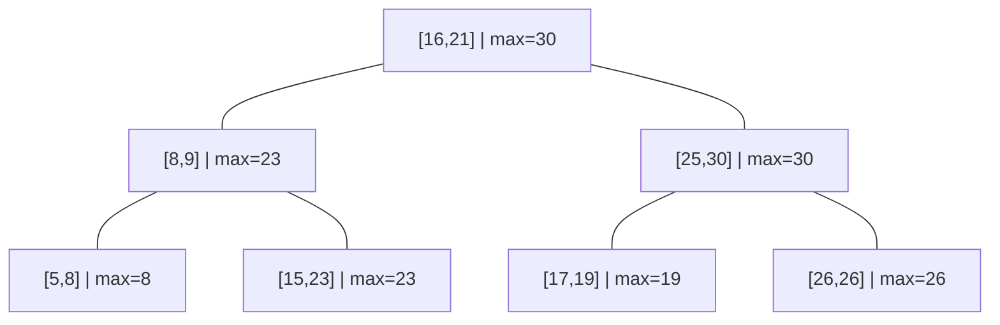

# Chapter 3: Recurrence Relations, Divide & Conquer, and Advanced Structures

> **Course Code:** 3CS501CC24
> **Focus:** Unit-III — Recurrence Solving Techniques, Divide & Conquer Paradigm, Sorting & Selection, Exponentiation, Interval Trees & Disjoint Sets

---

## 1. Chapter Overview

Many algorithms are recursive — their running time $T(n)$ is defined in terms of smaller inputs. We need to **solve recurrences** to get closed-form complexity bounds.

**Learning Flow per Topic:**
> Recurrence Form → Method Procedure → Worked Example → 📝 Q&A

### Method Selection Guide

| Your Recurrence Looks Like… | Best Method | Time to Apply |
| :--- | :--- | :--- |
| $T(n) = a T(n/b) + f(n)$ | **Master Theorem (D&C)** | Instant — 3 cases |
| $T(n) = a T(n-b) + f(n)$ | **Master Theorem (S&C)** | Instant — 3 cases |
| $T(n) = a T(n/b) + f(n)$ (when MT doesn't apply) | **Recurrence Tree** | ~5 min — visual |
| $a_0 T(n) + \cdots + a_k T(n-k) = 0$ | **Homogeneous (Char. Eq.)** | ~5 min |
| $a_0 T(n) + \cdots + a_k T(n-k) = f(n) \neq 0$ | **Non-Homogeneous** | ~10 min |
| Input arg is non-linear: $T(\sqrt{n}), T(\log n)$ | **Change of Variable** | ~5 min |
| Range is non-linear: $[T(n)]^2$, $n \cdot T(n)$ | **Range Transformation** | ~5 min |
| Any — just need to verify | **Substitution / Induction** | Variable — needs good guess |

---

## 2. Recurrence Relations — Introduction

### What is a recurrence relation?

A **recurrence relation** is an equation that defines $T(n)$ in terms of $T$ on smaller values. In algorithm analysis, $T(n)$ is the running time on input size $n$.

### Two Standard Forms

**Divide and Conquer** — breaks into $a$ subproblems of size $n/b$, combines in $f(n)$ time:
$$T(n) = a\,T\!\left(\frac{n}{b}\right) + f(n)$$

**Subtract and Conquer** — reduces problem size by constant $b$:
$$T(n) = a\,T(n-b) + f(n)$$

### How to Set Up a Recurrence from Pseudocode

```
Example: Binary Search
    if n == 1: return O(1)          ← base case: T(1) = O(1)
    compare middle element          ← O(1) work at each level
    recurse on one half             ← T(n/2) subproblem

Recurrence: T(n) = T(n/2) + O(1)  →  Solution: T(n) = O(log n)
```

---

## 3. Method 1 — Substitution (Intelligent Guesswork & Induction)

### Procedure

1. **Guess** the form of the solution (e.g., $T(n) = O(n \log n)$)
2. **Substitute** the guess into the recurrence
3. **Prove** by mathematical induction that $T(n) \le c \cdot g(n)$ for some constant $c > 0$ and $n \ge n_0$

### Rules for Making a Good Guess

- Compute $T(1), T(2), T(4), T(8)$ — observe the pattern
- If recurrence is $T(n) = 2T(n/2) + n$ → try $O(n \log n)$ (similar to Merge Sort)
- If guess gives $T(n) \le cn + b$ instead of $T(n) \le cn$, **subtract lower-order term**: try $T(n) \le cn - d$

### Worked Example 1: $T(n) = T(n-1) + n$

**Unrolling (Repeated Substitution):**
$$T(n) = T(n-1) + n = T(n-2) + (n-1) + n = \cdots = T(0) + 1 + 2 + \cdots + n$$

Setting base case $T(0) = 0$ at $k = n$:
$$T(n) = \sum_{j=1}^n j = \frac{n(n+1)}{2} = \Theta(n^2)$$

### Worked Example 2: $T(n) = 2T(\lfloor n/2 \rfloor) + n \implies T(n) = O(n \log n)$

- **Guess:** $T(n) \le cn\log_2 n$ for $c > 0$
- **Inductive step:** Assume $T(\lfloor n/2 \rfloor) \le c\lfloor n/2 \rfloor \log_2(\lfloor n/2 \rfloor)$

$$T(n) \le 2\!\left(c\frac{n}{2}\log_2\!\frac{n}{2}\right) + n = cn(\log_2 n - 1) + n = cn\log_2 n - cn + n$$

For $T(n) \le cn\log_2 n$: need $-cn + n \le 0 \implies c \ge 1$. ✅ Holds for $c \ge 1, n \ge 2$.

---

### 📝 Quick Practice — Substitution Method

> **Q1:** Use repeated substitution to solve $T(n) = T(n-1) + c$ (constant work per step), with $T(1) = 1$.
>
> **Answer:** Unroll: $T(n) = T(n-1) + c = T(n-2) + 2c = \cdots = T(1) + (n-1)c = 1 + (n-1)c = \Theta(n)$.

> **Q2:** Guess and verify: $T(n) = T(n/2) + 1$ is $O(\log n)$.
>
> **Answer:** **Guess:** $T(n) \le c\log_2 n$.
> **Substitute:** $T(n) \le c\log_2(n/2) + 1 = c(\log_2 n - 1) + 1 = c\log_2 n - c + 1$.
> Need $-c + 1 \le 0 \implies c \ge 1$. ✅ Holds for $c = 1$, $n \ge 2$.

> **Q3:** Why might the guess $T(n) = O(n)$ fail for $T(n) = 2T(\lfloor n/2 \rfloor) + n$? What adjustment fixes it?
>
> **Answer:** Guess $T(n) \le cn$: substitute → $T(n) \le 2c(n/2) + n = cn + n$. Need $cn + n \le cn$ → $n \le 0$ — false! The lower-order term $+n$ causes the proof to fail. Fix: guess $T(n) \le cn\log n$ (the logarithmic factor absorbs the additive $n$).

---

## 4. Method 2 — Homogeneous Recurrences (Characteristic Equation)

### What is a Homogeneous Recurrence?

A linear recurrence with **no external forcing function** ($f(n) = 0$):
$$a_0 T(n) + a_1 T(n-1) + a_2 T(n-2) + \cdots + a_k T(n-k) = 0$$

### Procedure

1. Substitute $T(n) = r^n$ → **Characteristic Equation:** $a_0 r^k + a_1 r^{k-1} + \cdots + a_k = 0$
2. Find roots $r_1, r_2, \ldots, r_k$
3. Construct general solution:

| Root Type | Solution Contribution |
| :--- | :--- |
| Distinct real root $r_i$ | $c_i r_i^n$ |
| Repeated root $r_1$ with multiplicity $m$ | $(c_1 + c_2 n + c_3 n^2 + \cdots + c_m n^{m-1}) r_1^n$ |

4. Apply initial conditions to find constants $c_1, c_2, \ldots$

### Worked Example: Fibonacci $T(n) = T(n-1) + T(n-2)$, $T(0)=0, T(1)=1$

1. Rewrite: $T(n) - T(n-1) - T(n-2) = 0$
2. Characteristic equation: $r^2 - r - 1 = 0$
3. Roots (quadratic formula): $r_1 = \dfrac{1+\sqrt{5}}{2} \approx 1.618\ (\phi)$, $r_2 = \dfrac{1-\sqrt{5}}{2} \approx -0.618\ (\psi)$
4. General solution: $T(n) = c_1 \phi^n + c_2 \psi^n$
5. $T(0) = 0 \implies c_1 + c_2 = 0 \implies c_2 = -c_1$
6. $T(1) = 1 \implies c_1(\phi - \psi) = 1 \implies c_1 = \dfrac{1}{\sqrt{5}}$

**Binet's Formula:**
$$T(n) = \frac{1}{\sqrt{5}}\left[\phi^n - \psi^n\right] = \Theta(\phi^n) \approx \Theta(1.618^n)$$

---

### 📝 Quick Practice — Homogeneous Recurrences

> **Q1:** Solve $T(n) = 3T(n-1) - 2T(n-2)$, $T(0) = 1, T(1) = 3$.
>
> **Answer:** Characteristic equation: $r^2 - 3r + 2 = 0 \implies (r-1)(r-2) = 0 \implies r_1 = 1, r_2 = 2$.
> General solution: $T(n) = c_1 \cdot 1^n + c_2 \cdot 2^n = c_1 + c_2 \cdot 2^n$.
> $T(0) = 1: c_1 + c_2 = 1$. $T(1) = 3: c_1 + 2c_2 = 3 \implies c_2 = 2, c_1 = -1$.
> **Answer:** $T(n) = -1 + 2^{n+1} = \Theta(2^n)$.

> **Q2:** For $T(n) = 2T(n-1)$, $T(0) = 1$, solve using characteristic equation and verify.
>
> **Answer:** Char. eq: $r - 2 = 0 \implies r = 2$. $T(n) = c_1 \cdot 2^n$. $T(0) = 1 \implies c_1 = 1$. **Answer:** $T(n) = 2^n = \Theta(2^n)$. Verify: $T(n) = 2T(n-1) = 2 \cdot 2^{n-1} = 2^n$ ✅.

> **Q3:** When do we get a repeated root in the characteristic equation? Give an example recurrence.
>
> **Answer:** A repeated root occurs when the characteristic polynomial has a root of multiplicity > 1. Example: $T(n) = 2T(n-1) - T(n-2)$ has characteristic equation $r^2 - 2r + 1 = (r-1)^2 = 0$, so $r = 1$ with multiplicity 2. Solution: $T(n) = (c_1 + c_2 n) \cdot 1^n = c_1 + c_2 n = \Theta(n)$.

---

## 5. Method 3 — Non-Homogeneous Recurrences

### Form

$$a_0 T(n) + a_1 T(n-1) + \cdots + a_k T(n-k) = f(n) \quad (f(n) \neq 0)$$

### Total Solution

$$T(n) = T_h(n) + T_p(n)$$

where $T_h(n)$ = homogeneous solution (set $f(n)=0$), $T_p(n)$ = **particular solution** for $f(n)$.

### Rules for Guessing $T_p(n)$

| Form of $f(n)$ | Condition on root $a$ | Guess for $T_p(n)$ |
| :--- | :--- | :--- |
| Constant $C$ | 1 is NOT a root | $P$ (constant) |
| Constant $C$ | 1 IS a root of mult. $m$ | $n^m P$ |
| Polynomial $\sum b_j n^j$ (degree $d$) | 1 is NOT a root | $P_0 + P_1 n + \cdots + P_d n^d$ |
| Polynomial $\sum b_j n^j$ (degree $d$) | 1 IS a root of mult. $m$ | $n^m(P_0 + \cdots + P_d n^d)$ |
| Exponential $C \cdot a^n$ | $a$ is NOT a root | $P \cdot a^n$ |
| Exponential $C \cdot a^n$ | $a$ IS a root of mult. $m$ | $n^m P \cdot a^n$ |

### Worked Example: $T(n) - 2T(n-1) = 3^n$, $T(0) = 1$

1. **Homogeneous:** $r - 2 = 0 \implies r = 2 \implies T_h(n) = c_1 \cdot 2^n$
2. **Particular:** $f(n) = 3^n$, base $a=3$. Is 3 a characteristic root? No (root is 2). Guess $T_p = P \cdot 3^n$.
3. **Substitute $T_p$ into recurrence:**
$$P \cdot 3^n - 2(P \cdot 3^{n-1}) = 3^n \implies P \cdot 3^n - \frac{2P}{3} \cdot 3^n = 3^n \implies P\left(1 - \frac{2}{3}\right) = 1 \implies P = 3$$
4. $T_p(n) = 3 \cdot 3^n = 3^{n+1}$
5. **Total:** $T(n) = c_1 \cdot 2^n + 3^{n+1}$
6. **Initial condition** $T(0) = 1: c_1 + 3 = 1 \implies c_1 = -2$
7. **Solution:** $T(n) = 3^{n+1} - 2^{n+1} = \Theta(3^n)$

---

### 📝 Quick Practice — Non-Homogeneous Recurrences

> **Q1:** Solve $T(n) - T(n-1) = n$, $T(0) = 0$.
>
> **Answer:** Homogeneous: $r - 1 = 0 \implies r = 1 \implies T_h = c_1 \cdot 1^n = c_1$. Particular: $f(n) = n$ (polynomial degree 1). Is 1 a root? Yes, multiplicity 1. Guess $T_p = n(P_0 + P_1 n) = P_0 n + P_1 n^2$. Substitute: $P_0 n + P_1 n^2 - (P_0(n-1) + P_1(n-1)^2) = n \implies P_0 + P_1(2n-1) = n \implies 2P_1 = 1, P_0 - P_1 = 0 \implies P_1 = 1/2, P_0 = 1/2$. $T_p = n/2 + n^2/2$. Total: $T(n) = c_1 + n/2 + n^2/2$. $T(0)=0 \implies c_1 = 0$. **Answer:** $T(n) = n(n+1)/2 = \Theta(n^2)$.

> **Q2:** Why do we multiply the particular solution guess by $n^m$ when the base $a$ IS a characteristic root of multiplicity $m$?
>
> **Answer:** When $a$ is a root, $a^n$ satisfies the homogeneous equation and would be absorbed into $T_h$, making the particular guess redundant (would give 0 on the left side). Multiplying by $n^m$ creates a *linearly independent* function that isn't already in $T_h$, allowing the particular solution to "stand on its own."

---

## 6. Method 4 — Change of Variable (Domain Transformation)

### When to Use

When $T(\cdot)$ has a **non-linear argument** (e.g., $T(\sqrt{n})$, $T(\log n)$). Substitute to linearize.

### Procedure

1. **Identify** the non-linear argument (e.g., $\sqrt{n}$)
2. **Set** $n = 2^m$ (or appropriate substitution) so the argument becomes linear in $m$
3. **Rename** $S(m) = T(2^m)$ to get a standard recurrence in $S(m)$
4. **Solve** $S(m)$ using standard methods (often Master Theorem)
5. **Substitute back** $m = \log_2 n$ to get $T(n)$

### Worked Example: $T(n) = 2T(\lfloor\sqrt{n}\rfloor) + \log_2 n$

1. Let $n = 2^m \implies \sqrt{n} = 2^{m/2}$, $\log_2 n = m$
2. Substitute: $T(2^m) = 2T(2^{m/2}) + m$
3. Let $S(m) = T(2^m)$: $S(m) = 2S(m/2) + m$
4. Apply Master Theorem: $a=2, b=2, f(m)=m$, $m^{\log_2 2} = m^1 = m$
   - $f(m) = \Theta(m^{\log_b a}) = \Theta(m)$ → **Case 2**: $S(m) = \Theta(m \log m)$
5. Substitute back $m = \log_2 n$:
$$\boxed{T(n) = \Theta(\log n \cdot \log\log n)}$$

---

### 📝 Quick Practice — Change of Variable

> **Q1:** Solve $T(n) = T(\sqrt{n}) + 1$ using change of variable.
>
> **Answer:** Let $n = 2^m$: $T(2^m) = T(2^{m/2}) + 1$. Let $S(m) = T(2^m)$: $S(m) = S(m/2) + 1$. MT: $a=1, b=2, f(m)=1$, $m^{\log_2 1} = m^0 = 1$. Case 2: $S(m) = \Theta(\log m)$. Back-substitute $m = \log n$: **$T(n) = \Theta(\log \log n)$**.

> **Q2:** Why can't we directly apply Master Theorem to $T(n) = 2T(\sqrt{n}) + \log n$?
>
> **Answer:** The Master Theorem applies to recurrences of the form $T(n) = aT(n/b) + f(n)$ where $n/b$ is a **division** of $n$. Here the argument is $\sqrt{n} = n^{1/2}$, which is a *power* of $n$, not a division by a constant $b$. The Master Theorem's analysis assumes subproblem sizes shrink geometrically as $n/b^j$, but $n^{1/2^j}$ follows a different shrinkage pattern. Change of variable converts it to the right form.

---

## 7. Method 5 — Range Transformations

### When to Use

When the **value** of $T(n)$ is transformed (squared, multiplied, etc.) — e.g., $T(n) = n \cdot [T(n/2)]^2$.

### Procedure

Take **logarithms** on both sides to linearize the range.

### Worked Example: $T(n) = n \cdot [T(n/2)]^2$, $T(1) = 2$

1. Take $\log_2$ of both sides:
$$\log_2 T(n) = \log_2 n + 2\log_2 T(n/2)$$

2. Let $U(n) = \log_2 T(n)$:
$$U(n) = 2U(n/2) + \log_2 n$$

3. Apply MT: $a=2, b=2, f(n)=\log n$, $n^{\log_2 2} = n$.
   $f(n) = O(n^{1-\epsilon})$ for $\epsilon = 0.5$ → **Case 1**: $U(n) = \Theta(n)$

4. Back-substitute: $\log_2 T(n) = \Theta(n) \implies T(n) = \Theta(2^{\Theta(n)})$

---

### 📝 Quick Practice — Range Transformations

> **Q1:** When should you apply a range transformation vs. a domain (change of variable) transformation?
>
> **Answer:** Use **domain transformation** when the *argument* of $T(\cdot)$ is non-linear (e.g., $T(\sqrt{n})$). Use **range transformation** when the *value* of $T(n)$ itself is composed non-linearly (e.g., $[T(n)]^2$, $n \cdot T(n)$). The key distinction: domain → change what you plug *into* $T$; range → change the *output* of $T$ by taking log/dividing.

---

## 8. Method 6 — Master Theorem

### Part A: Divide and Conquer Master Theorem

For $T(n) = aT(n/b) + f(n)$ where $a \ge 1, b > 1$:

Let the **critical exponent** $c_{crit} = \log_b a$.



### Master Theorem — Quick Reference Table

| $a$ | $b$ | $f(n)$ | $c_{crit} = \log_b a$ | Case | Answer |
| :--- | :--- | :--- | :--- | :--- | :--- |
| 4 | 2 | $n$ | 2 | 1 ($n \ll n^2$) | $\Theta(n^2)$ |
| 4 | 2 | $n^2$ | 2 | 2 ($k=0$) | $\Theta(n^2 \log n)$ |
| 4 | 2 | $n^3$ | 2 | 3 ($n^3 \gg n^2$) | $\Theta(n^3)$ |
| 2 | 2 | $n$ | 1 | 2 ($k=0$) | $\Theta(n \log n)$ |
| 1 | 2 | $1$ | 0 | 2 ($k=0$) | $\Theta(\log n)$ |
| 3 | 2 | $n$ | $\log_2 3 \approx 1.585$ | 1 | $\Theta(n^{\log_2 3})$ |
| 7 | 2 | $n^2$ | $\log_2 7 \approx 2.807$ | 1 | $\Theta(n^{\log_2 7})$ |

### Part B: Subtract and Conquer Master Theorem

For $T(n) = aT(n-b) + f(n)$ where $a > 0, b > 0, f(n) = O(n^k)$:

| Condition | Solution |
| :--- | :--- |
| $a < 1$ | $T(n) = O(n^k)$ |
| $a = 1$ | $T(n) = O(n^{k+1})$ |
| $a > 1$ | $T(n) = O(a^{n/b} \cdot n^k)$ |

**Example:** $T(n) = T(n-1) + n$ → $a=1, b=1, k=1$ → Case $a=1$: $T(n) = O(n^2)$ ✅

---

### 📝 Quick Practice — Master Theorem

> **Q1:** Apply the Master Theorem to:
> (a) $T(n) = 9T(n/3) + n$
> (b) $T(n) = T(2n/3) + 1$
> (c) $T(n) = 3T(n/4) + n\log n$
>
> **Answers:**
> (a) $a=9, b=3, c_{crit}=2$. $f(n)=n = O(n^{2-1}) \implies$ **Case 1**: $T(n) = \Theta(n^2)$
> (b) $a=1, b=3/2, c_{crit}=0$. $f(n)=1=\Theta(n^0) \implies$ **Case 2** ($k=0$): $T(n) = \Theta(\log n)$
> (c) $a=3, b=4, c_{crit}=\log_4 3 \approx 0.793$. $f(n)=n\log n = \Omega(n^{0.793+\epsilon})$. Check regularity: $3 \cdot f(n/4) = 3 \cdot (n/4)\log(n/4) \le \frac{3}{4} n\log n < cn\log n$ for $c=3/4 < 1$ ✅. **Case 3**: $T(n) = \Theta(n\log n)$.

> **Q2:** Why does the Master Theorem fail for $T(n) = 2T(n/2) + n\log n$? What is the actual answer?
>
> **Answer:** Here $a=2, b=2, c_{crit}=1$. $f(n) = n\log n$. Is $f(n) = O(n^{1-\epsilon})$? No. Is $f(n) = \Omega(n^{1+\epsilon})$? No. Is $f(n) = \Theta(n)$? No — $n\log n$ is asymptotically larger than $n$. So $f(n) = \Theta(n^1 \cdot \log^1 n)$ which is the **extended Case 2** with $k=1$: $T(n) = \Theta(n \log^2 n)$.

> **Q3:** For Subtract-and-Conquer: $T(n) = 2T(n-1) + 1$. What is the solution and why?
>
> **Answer:** $a=2 > 1, b=1, f(n)=1, k=0$. **Case $a>1$**: $T(n) = O(2^{n/1} \cdot n^0) = O(2^n)$. Intuitively: each call spawns 2 subproblems of size $n-1$, so the recursion tree is a complete binary tree of depth $n$ → $2^n$ leaves → $T(n) = \Theta(2^n)$.

---

## 9. Method 7 — Recurrence Tree Method

### Concept

A **Recurrence Tree** visually expands the recursion, treating each node as the work done at that call. Sum across all levels.

### Step-by-Step: $T(n) = 3T(n/4) + cn^2$

#### Tree Structure



#### Level-by-Level Cost Table

| Level $j$ | # Nodes | Work per Node | **Total Work at Level $j$** |
| :--- | :--- | :--- | :--- |
| 0 | 1 | $cn^2$ | $cn^2$ |
| 1 | 3 | $c(n/4)^2 = cn^2/16$ | $3 \cdot cn^2/16 = \frac{3}{16}cn^2$ |
| 2 | $3^2 = 9$ | $c(n/16)^2 = cn^2/256$ | $9 \cdot cn^2/256 = \left(\frac{3}{16}\right)^2 cn^2$ |
| $j$ | $3^j$ | $c(n/4^j)^2$ | $\left(\dfrac{3}{16}\right)^j cn^2$ |
| $\vdots$ | $\vdots$ | $\vdots$ | $\vdots$ |
| $h = \log_4 n$ | $3^{\log_4 n} = n^{\log_4 3}$ | $\Theta(1)$ | $\Theta(n^{\log_4 3})$ |

#### Geometric Series Sum

$$T(n) = \sum_{j=0}^{\log_4 n - 1} \left(\frac{3}{16}\right)^j cn^2 + \Theta(n^{\log_4 3})$$

Since $\frac{3}{16} < 1$ → converging geometric series:

$$\le cn^2 \sum_{j=0}^{\infty}\left(\frac{3}{16}\right)^j = cn^2 \cdot \frac{1}{1-3/16} = \frac{16}{13}cn^2 = O(cn^2)$$

The leaf term $\Theta(n^{\log_4 3}) = \Theta(n^{0.79})$ is dominated by $O(n^2)$.

$$\boxed{T(n) = \Theta(n^2)}$$

**Verification by Master Theorem:** $a=3, b=4, c_{crit}=\log_4 3 \approx 0.79$. $f(n)=n^2 = \Omega(n^{0.79+\epsilon})$ → Case 3 → $T(n) = \Theta(n^2)$ ✅

---

### 📝 Quick Practice — Recurrence Tree

> **Q1:** Draw the first 3 levels of the recurrence tree for $T(n) = 2T(n/2) + n$. What is the work at each level? What is the depth?
>
> **Answer:**
> - Level 0: 1 node, work = $n$. Total = $n$.
> - Level 1: 2 nodes, work = $n/2$ each. Total = $2 \times n/2 = n$.
> - Level 2: 4 nodes, work = $n/4$ each. Total = $4 \times n/4 = n$.
> - Pattern: every level costs exactly $n$! Depth = $\log_2 n$ (when subproblems reach size 1).
> - **Total:** $n \times \log_2 n = \Theta(n \log n)$.

> **Q2:** For $T(n) = 4T(n/2) + n^2$, use the recurrence tree method to find the total cost.
>
> **Answer:**
> | Level $j$ | Nodes | Work per node | Level total |
> | :--- | :--- | :--- | :--- |
> | 0 | 1 | $n^2$ | $n^2$ |
> | 1 | 4 | $(n/2)^2=n^2/4$ | $4 \times n^2/4 = n^2$ |
> | 2 | 16 | $n^2/16$ | $n^2$ |
> | $j$ | $4^j$ | $n^2/4^j$ | $n^2$ (constant!) |
>
> Depth = $\log_2 n$. Total = $n^2 \times \log_2 n = \Theta(n^2 \log n)$. (Verify: MT Case 2, $c_{crit}=2$, $f(n)=n^2=\Theta(n^2)$ ✅)

---

## 10. Divide & Conquer Algorithms

The Divide and Conquer paradigm:
1. **Divide** — Split problem into independent smaller subproblems
2. **Conquer** — Solve subproblems recursively (direct for base cases)
3. **Combine** — Merge subproblem solutions into the global answer

---

### Algorithm 1: Karatsuba — Large Integer Multiplication

#### Problem
Multiply two $n$-digit integers $X$ and $Y$. Naïve grade-school: $O(n^2)$.

#### Karatsuba Strategy
Split $X = X_L \cdot 10^{n/2} + X_R$ and $Y = Y_L \cdot 10^{n/2} + Y_R$.

Instead of 4 multiplications ($X_L Y_L, X_L Y_R, X_R Y_L, X_R Y_R$), compute **only 3**:
- $P_1 = X_L \cdot Y_L$
- $P_2 = X_R \cdot Y_R$
- $P_3 = (X_L + X_R)(Y_L + Y_R)$

Then: $X_L Y_R + X_R Y_L = P_3 - P_1 - P_2$ (the "trick")

Final result: $X \cdot Y = P_1 \cdot 10^n + (P_3 - P_1 - P_2) \cdot 10^{n/2} + P_2$

#### Recurrence & Complexity

$$T(n) = 3T(n/2) + O(n) \xrightarrow{\text{MT Case 1}} T(n) = \Theta(n^{\log_2 3}) \approx \Theta(n^{1.585})$$

---

### 📝 Quick Practice — Karatsuba

> **Q1:** Multiply $X = 1234$ and $Y = 5678$ using Karatsuba. Show the split and the 3 sub-multiplications.
>
> **Answer:** Split: $X_L=12, X_R=34, Y_L=56, Y_R=78$.
> - $P_1 = 12 \times 56 = 672$
> - $P_2 = 34 \times 78 = 2652$
> - $P_3 = (12+34)(56+78) = 46 \times 134 = 6164$
> - Middle = $P_3 - P_1 - P_2 = 6164 - 672 - 2652 = 2840$
> - Result = $672 \times 10^4 + 2840 \times 10^2 + 2652 = 6720000 + 284000 + 2652 = \mathbf{7006652}$
> - Verify: $1234 \times 5678 = 7006652$ ✅

> **Q2:** Why does Karatsuba's algorithm achieve $\Theta(n^{1.585})$ instead of $\Theta(n^2)$?
>
> **Answer:** By reducing 4 recursive multiplications to 3 at each level, the recurrence becomes $T(n) = 3T(n/2)$ instead of $T(n) = 4T(n/2)$. By MT Case 1: $c_{crit} = \log_2 3 \approx 1.585 < \log_2 4 = 2$. Each level-reduction from 4→3 multiplications saves one-quarter of the work, compounding across $\log n$ levels.

---

### Algorithm 2: Merge Sort

#### Flowchart



**How Merge works:** Two pointer technique on two sorted subarrays → $\Theta(n)$ time, $O(n)$ extra space.

#### Recurrence & Analysis

$$T(n) = 2T(n/2) + \Theta(n) \implies T(n) = \Theta(n \log n) \quad \text{(all cases — best, worst, average)}$$

**Key properties:**
- **Stable sort** — equal elements maintain relative order
- **Not in-place** — requires $O(n)$ auxiliary memory
- **External sort** — excellent for large datasets on disk

---

### 📝 Quick Practice — Merge Sort

> **Q1:** Trace Merge Sort on array $[5, 2, 8, 1, 9, 3]$. Show each split and merge step.
>
> **Answer:**
> - Split: $[5,2,8]$ and $[1,9,3]$
> - Split $[5,2,8]$: $[5,2]$ and $[8]$. Split $[5,2]$: $[5]$ and $[2]$
> - Merge $[5]$ and $[2]$ → $[2,5]$. Merge $[2,5]$ and $[8]$ → $[2,5,8]$
> - Split $[1,9,3]$: $[1,9]$ and $[3]$. Split $[1,9]$: $[1]$ and $[9]$
> - Merge $[1]$ and $[9]$ → $[1,9]$. Merge $[1,9]$ and $[3]$ → $[1,3,9]$
> - Merge $[2,5,8]$ and $[1,3,9]$ → $[1,2,3,5,8,9]$ ✅

> **Q2:** Merge Sort is $\Theta(n \log n)$ in ALL cases. Quick Sort is $\Theta(n \log n)$ average but $\Theta(n^2)$ worst. Why is Quick Sort often preferred in practice?
>
> **Answer:** Quick Sort has smaller **constant factors** — it sorts **in-place** ($O(\log n)$ stack space only) vs Merge Sort's $O(n)$ auxiliary memory. Better cache locality (works within the same array region). In practice, the $\Theta(n^2)$ worst case is avoided using **randomized pivot** selection or **median-of-3** pivot. For most real inputs, Quick Sort runs faster than Merge Sort despite having the same asymptotic average.

---

### Algorithm 3: Quick Sort

#### Partition Flowchart



**Lomuto Partition (last element as pivot):** Scan left to right; swap elements < pivot to the left portion. Final position of pivot = correct index.

#### Complexity Analysis

| Case | Partition Split | Recurrence | Time |
| :--- | :--- | :--- | :--- |
| **Worst** (sorted/reverse, first/last pivot) | $(1, n-1)$ | $T(n) = T(n-1) + \Theta(n)$ | $\Theta(n^2)$ |
| **Best** (balanced split always) | $(n/2, n/2)$ | $T(n) = 2T(n/2) + \Theta(n)$ | $\Theta(n \log n)$ |
| **Average** | ~$(n/2, n/2)$ on average | $T(n) = \Theta(n \log n)$ (formal proof) | $\Theta(n \log n)$ |

**Randomized Quick Sort:** Choose pivot uniformly at random → expected $O(n \log n)$ regardless of input order.

---

### 📝 Quick Practice — Quick Sort

> **Q1:** Trace the Lomuto partition on $A = [3, 6, 8, 10, 1, 2, 1]$ with pivot = $A[6] = 1$.
>
> **Answer:** Pivot = 1. $i = -1$. Scan $j = 0$ to $5$:
> - $j=0$: $A[0]=3 > 1$, skip.
> - $j=1$: $A[1]=6 > 1$, skip.
> - $j=2$: $A[2]=8 > 1$, skip.
> - $j=3$: $A[3]=10 > 1$, skip.
> - $j=4$: $A[4]=1 \le 1$: $i=0$, swap $A[0] \leftrightarrow A[4]$ → $[1,6,8,10,3,2,1]$
> - $j=5$: $A[5]=2 > 1$, skip.
> Final: swap $A[i+1] = A[1] \leftrightarrow A[6]$ (pivot) → $[1,1,8,10,3,2,6]$. Pivot index = 1.

> **Q2:** Why does already-sorted input cause $\Theta(n^2)$ behavior in Quick Sort with first/last element as pivot?
>
> **Answer:** If $A = [1, 2, 3, \ldots, n]$ and pivot is always the last element, Partition always places the pivot at the end of the left portion — splitting $(n-1, 0)$ instead of $(n/2, n/2)$. This creates a recursion tree of depth $n$ with $n$ partitions each taking $\Theta(n)$ time → $T(n) = T(n-1) + n = \Theta(n^2)$. Random pivot avoids this by ensuring splits are balanced in expectation.

---

### Algorithm 4: Deterministic Linear-Time Selection (Median-of-Medians)

#### Problem
Find the $k$-th smallest element in an unsorted array in **guaranteed worst-case $O(n)$ time**.

#### Algorithm Steps



#### Why Groups of 5?

- At least $\lceil n/5 \rceil / 2$ medians are ≥ $x$ (median of medians)
- Each such group contributes ≥ 3 elements ≥ $x$
- Total elements ≥ $x$: at least $3n/10$
- Recursive subproblem size: at most $n - 3n/10 = 7n/10$

**Recurrence:**
$$T(n) \le T(n/5) + T(7n/10) + O(n)$$

**Proof $T(n) = O(n)$:** Guess $T(n) \le cn$. Substitute:
$$T(n) \le c(n/5) + c(7n/10) + dn = cn(1/5 + 7/10) + dn = cn(9/10) + dn \le cn \text{ when } c \ge 10d$$

**Why not groups of 3?** Groups of 3 give $T(n) \le T(n/3) + T(3n/4) + O(n)$ where $1/3 + 3/4 = 13/12 > 1$ → doesn't converge to $O(n)$.

---

### 📝 Quick Practice — Median-of-Medians

> **Q1:** What is the purpose of the "median of medians" as a pivot?
>
> **Answer:** The median of medians $x$ guarantees that at least $3n/10$ elements are ≤ $x$ AND at least $3n/10$ elements are ≥ $x$. This ensures the partition always splits into at most $7n/10$ elements on either side — a guaranteed balanced-enough split that leads to $O(n)$ total work regardless of input order.

> **Q2:** Why is Median-of-Medians rarely used in practice despite its $O(n)$ guarantee?
>
> **Answer:** The constant factor is very large (~$10\times$ or more). For most practical inputs, **Randomized Quick-Select** runs in expected $O(n)$ time with a much smaller constant. The $O(n^2)$ worst case of random Quick-Select is astronomically unlikely with random pivot selection. So the guaranteed worst-case $O(n)$ of Median-of-Medians is rarely worth its high practical overhead.

---

### Algorithm 5: Strassen's Matrix Multiplication

#### Problem
Multiply two $n \times n$ matrices. Standard method: $O(n^3)$ (requires $n^3$ multiplications).

#### Strassen's 7 Products (for $2\times 2$ block matrices)

Given $A = \begin{pmatrix} A_{11} & A_{12} \\ A_{21} & A_{22} \end{pmatrix}$ and $B = \begin{pmatrix} B_{11} & B_{12} \\ B_{21} & B_{22} \end{pmatrix}$:

| Product | Formula |
| :--- | :--- |
| $M_1$ | $(A_{11} + A_{22})(B_{11} + B_{22})$ |
| $M_2$ | $(A_{21} + A_{22})B_{11}$ |
| $M_3$ | $A_{11}(B_{12} - B_{22})$ |
| $M_4$ | $A_{22}(B_{21} - B_{11})$ |
| $M_5$ | $(A_{11} + A_{12})B_{22}$ |
| $M_6$ | $(A_{21} - A_{11})(B_{11} + B_{12})$ |
| $M_7$ | $(A_{12} - A_{22})(B_{21} + B_{22})$ |

**Reconstruction of $C = AB$:**

$$C_{11} = M_1 + M_4 - M_5 + M_7, \quad C_{12} = M_3 + M_5$$
$$C_{21} = M_2 + M_4, \quad C_{22} = M_1 - M_2 + M_3 + M_6$$

#### Recurrence & Complexity

$$T(n) = 7T(n/2) + \Theta(n^2) \xrightarrow{\text{MT Case 1}} T(n) = \Theta(n^{\log_2 7}) \approx \Theta(n^{2.807})$$

Better than naïve $O(n^3)$! Modern algorithms (Coppersmith-Winograd) achieve $\approx O(n^{2.37})$.

---

### 📝 Quick Practice — Strassen's Algorithm

> **Q1:** Verify $C_{11} = M_1 + M_4 - M_5 + M_7$ equals $A_{11}B_{11} + A_{12}B_{21}$.
>
> **Answer:** Expand each $M$:
> $M_1 = A_{11}B_{11} + A_{11}B_{22} + A_{22}B_{11} + A_{22}B_{22}$
> $M_4 = A_{22}B_{21} - A_{22}B_{11}$
> $M_5 = A_{11}B_{22} + A_{12}B_{22}$
> $M_7 = A_{12}B_{21} + A_{12}B_{22} - A_{22}B_{21} - A_{22}B_{22}$
> Sum: $C_{11} = M_1 + M_4 - M_5 + M_7 = A_{11}B_{11} + A_{12}B_{21}$ ✅ (all other terms cancel)

> **Q2:** Why does Strassen's saving of one multiplication per level give such significant asymptotic improvement?
>
> **Answer:** From 8→7 multiplications per level: $c_{crit}$ changes from $\log_2 8 = 3$ to $\log_2 7 \approx 2.807$. This exponent reduction applies across ALL $\log_2 n$ levels of recursion, resulting in $n^{2.807}$ vs $n^3$ — a substantial improvement for large $n$. For $n = 1000$: $n^{2.807} \approx 10^{8.4}$ vs $n^3 = 10^9$ — about $4\times$ faster.

---

### Algorithm 6: Binary & Modular Exponentiation

#### Binary Exponentiation: $a^n$ in $O(\log n)$ multiplications

$$a^n = \begin{cases} 1 & \text{if } n = 0 \\ (a^{n/2})^2 & \text{if } n \text{ is even} \\ a \cdot (a^{(n-1)/2})^2 & \text{if } n \text{ is odd} \end{cases}$$

```text
POWER(a, n):
    if n == 0: return 1
    temp = POWER(a, floor(n/2))
    if n is even: return temp * temp
    else: return a * temp * temp
```

**Recurrence:** $T(n) = T(n/2) + O(1) \implies T(n) = \Theta(\log n)$

#### Modular Exponentiation: $(a^n) \bmod m$

Apply modulo at every multiplication to prevent overflow:

$$\text{ModPower}(a, n, m) = \begin{cases} 1 & \text{if } n = 0 \\ (\text{temp}^2) \bmod m & \text{if } n \text{ is even} \\ (a \cdot \text{temp}^2) \bmod m & \text{if } n \text{ is odd} \end{cases}$$

**Why modulo at each step?** By the property of modular arithmetic: $(a \cdot b) \bmod m = ((a \bmod m) \cdot (b \bmod m)) \bmod m$. Prevents numbers from growing beyond fixed precision.

---

### 📝 Quick Practice — Exponentiation

> **Q1:** Compute $3^{13}$ using binary exponentiation. Show each recursive call.
>
> **Answer:** Binary of 13 = 1101₂.
> - $\text{POWER}(3, 13)$ → odd: $3 \cdot \text{POWER}(3,6)^2$
> - $\text{POWER}(3, 6)$ → even: $\text{POWER}(3,3)^2$
> - $\text{POWER}(3, 3)$ → odd: $3 \cdot \text{POWER}(3,1)^2$
> - $\text{POWER}(3, 1)$ → odd: $3 \cdot \text{POWER}(3,0)^2 = 3 \cdot 1 = 3$
> - Back-fill: $\text{POWER}(3,3) = 3 \cdot 3^2 = 27$
> - $\text{POWER}(3,6) = 27^2 = 729$
> - $\text{POWER}(3,13) = 3 \cdot 729^2 = 3 \cdot 531441 = \mathbf{1594323}$
> - Verify: $3^{13} = 1594323$ ✅

> **Q2:** Compute $(2^{10}) \bmod 5$ using modular exponentiation step by step.
>
> **Answer:**
> - $\text{ModPow}(2, 10, 5)$ → even: $\text{ModPow}(2, 5, 5)^2 \bmod 5$
> - $\text{ModPow}(2, 5, 5)$ → odd: $2 \cdot \text{ModPow}(2, 2, 5)^2 \bmod 5$
> - $\text{ModPow}(2, 2, 5)$ → even: $\text{ModPow}(2, 1, 5)^2 \bmod 5$
> - $\text{ModPow}(2, 1, 5)$ → odd: $2 \cdot 1 = 2 \bmod 5 = 2$
> - $\text{ModPow}(2, 2, 5) = 2^2 \bmod 5 = 4$
> - $\text{ModPow}(2, 5, 5) = 2 \cdot 4^2 \bmod 5 = 2 \cdot 16 \bmod 5 = 32 \bmod 5 = 2$
> - $\text{ModPow}(2, 10, 5) = 2^2 \bmod 5 = 4$
> - Verify: $2^{10} = 1024 = 204 \times 5 + 4$ → $1024 \bmod 5 = 4$ ✅

---

## 11. Advanced Data Structures (Brief — See Unit 4 for Full Treatment)

### Structure 1: Interval Trees

An **Interval Tree** is an RBT augmented with `max` attribute per node storing the maximum high-endpoint in the subtree. Supports overlap queries in $O(\log n)$.

**Core idea:** `INTERVAL-SEARCH(T, i)` — go left if `x.left.max ≥ i.low`, else go right.



### Structure 2: Disjoint Set Structures

Maintains partitioned sets with `MAKE-SET`, `FIND-SET`, `UNION`. Optimized with:
- **Union by Rank:** Attach smaller-rank tree under larger-rank root
- **Path Compression:** All nodes on path point directly to root after `FIND-SET`

**Complexity:** $O(m \cdot \alpha(n))$ for $m$ operations on $n$ elements — essentially $\Theta(1)$ amortized.

---

## 12. Interactive Sorting Visualizer

<iframe srcdoc="
<!DOCTYPE html>
<html>
<head>
<meta charset='utf-8'>
<style>
  body { font-family: 'Segoe UI', system-ui, sans-serif; background: #181825; color: #cdd6f4; margin: 0; padding: 15px; }
  h3 { color: #89b4fa; margin-top: 0; font-size: 14px; }
  .controls { display: flex; gap: 8px; flex-wrap: wrap; margin-bottom: 12px; align-items: center; }
  input { background: #313244; color: #cdd6f4; border: 1px solid #45475a; padding: 6px 10px; border-radius: 5px; font-size: 13px; width: 180px; }
  button { background: #89b4fa; color: #11111b; border: none; padding: 7px 14px; border-radius: 6px; font-size: 13px; font-weight: bold; cursor: pointer; }
  button:hover { background: #b4befe; }
  .bar-container { display: flex; align-items: flex-end; height: 160px; gap: 3px; background: #1e1e2e; padding: 10px; border-radius: 8px; border: 1px solid #313244; }
  .bar { flex: 1; background: #89b4fa; text-align: center; font-size: 9px; color: #11111b; border-radius: 3px 3px 0 0; transition: height 0.15s, background 0.15s; display: flex; align-items: flex-end; justify-content: center; padding-bottom: 2px; }
  .active { background: #f38ba8 !important; }
  .sorted { background: #a6e3a1 !important; }
  .pivot { background: #f9e2af !important; }
  .log { margin-top: 8px; font-family: monospace; font-size: 11px; color: #fab387; background: #11111b; padding: 8px; border-radius: 5px; min-height: 30px; }
</style>
</head>
<body>
<h3>🔀 D&C Sorting Visualizer</h3>
<div class='controls'>
  <input type='text' id='arr' value='38,27,43,3,9,82,10'>
  <button onclick='reset()'>Reset</button>
  <button onclick='runMS()'>▶ Merge Sort</button>
  <button onclick='runQS()'>▶ Quick Sort</button>
</div>
<div class='bar-container' id='bars'></div>
<div class='log' id='log'>Ready. Enter array above and click an algorithm.</div>
<script>
let A=[], running=false;
const sleep=ms=>new Promise(r=>setTimeout(r,ms));
function setLog(m){document.getElementById('log').textContent=m;}
function reset(){if(running)return;A=document.getElementById('arr').value.split(',').map(x=>parseInt(x.trim())).filter(x=>!isNaN(x));render([],[]);setLog('Array reset.');}
function render(active=[],sorted=[],pivots=[]){
  const c=document.getElementById('bars');c.innerHTML='';
  const mx=Math.max(...A,1);
  A.forEach((v,i)=>{const b=document.createElement('div');b.className='bar';b.style.height=(v/mx*100)+'%';b.textContent=v;if(active.includes(i))b.classList.add('active');if(sorted.includes(i))b.classList.add('sorted');if(pivots.includes(i))b.classList.add('pivot');c.appendChild(b);});}
async function runMS(){if(running)return;running=true;setLog('Merge Sort running...');await ms(0,A.length-1);render([],A.map((_,i)=>i));setLog('✅ Merge Sort complete!');running=false;}
async function ms(l,r){if(l>=r)return;const m=Math.floor((l+r)/2);await ms(l,m);await ms(m+1,r);await mrg(l,m,r);}
async function mrg(l,m,r){let L=A.slice(l,m+1),R=A.slice(m+1,r+1),i=0,j=0,k=l;while(i<L.length&&j<R.length){render([k]);await sleep(200);A[k++]=L[i]<=R[j]?L[i++]:R[j++];}while(i<L.length)A[k++]=L[i++];while(j<R.length)A[k++]=R[j++];render([l,r]);await sleep(150);}
async function runQS(){if(running)return;running=true;setLog('Quick Sort running...');await qs(0,A.length-1);render([],A.map((_,i)=>i));setLog('✅ Quick Sort complete!');running=false;}
async function qs(lo,hi){if(lo<hi){let p=await part(lo,hi);await qs(lo,p-1);await qs(p+1,hi);}}
async function part(lo,hi){let pv=A[hi],i=lo-1;for(let j=lo;j<hi;j++){render([j],[],[hi]);await sleep(220);if(A[j]<pv){i++;[A[i],A[j]]=[A[j],A[i]];}}[A[i+1],A[hi]]=[A[hi],A[i+1]];render([i+1]);await sleep(200);return i+1;}
reset();
</script>
</body>
</html>
" width="100%" height="290" style="border:1px solid #45475a; border-radius:8px; margin-top:12px;"></iframe>

---

## 13. Recurrence Solving Method Comparison

| Method | Best For | Pros | Cons |
| :--- | :--- | :--- | :--- |
| **Substitution** | Any (verification) | Rigorous formal proof | Needs accurate initial guess |
| **Homogeneous** | $\sum a_i T(n-i) = 0$ | Exact closed-form | Only constant-step, no $f(n)$ |
| **Non-Homogeneous** | $\sum a_i T(n-i) = f(n)$ | Handles polynomial/exponential $f(n)$ | Finding $T_p$ guess can be tedious |
| **Change of Variable** | $T(\sqrt{n}), T(\log n)$ args | Converts non-standard to standard | Requires algebraic ingenuity |
| **Range Transform** | $[T(n)]^2$, $n \cdot T(n)$ values | Linearizes range via logarithm | Only when range is transformed |
| **Master Theorem (D&C)** | $T(n) = aT(n/b) + f(n)$ | Instant — 3-case lookup | Gap between cases; non-polynomial $f(n)$ |
| **Master Theorem (S&C)** | $T(n) = aT(n-b) + f(n)$ | Instant — 3-case lookup | Only linear step |
| **Recurrence Tree** | D&C (especially when MT fails) | Visual, intuitive | Needs careful geometric series sum |

---

## 14. Formula Sheet

| Formula | Description |
| :--- | :--- |
| $T(n) = aT(n/b) + f(n)$ → $\Theta(n^{\log_b a})$ | MT Case 1 (leaves dominate) |
| $T(n) = aT(n/b) + \Theta(n^{\log_b a}\log^k n)$ → $\Theta(n^{\log_b a}\log^{k+1} n)$ | MT Case 2 (balanced) |
| $T(n) = aT(n/b) + f(n)$ → $\Theta(f(n))$ | MT Case 3 (root dominates) |
| $T(n) = 3T(n/2) + O(n) \implies \Theta(n^{\log_2 3}) \approx \Theta(n^{1.585})$ | Karatsuba |
| $T(n) = 2T(n/2) + \Theta(n) \implies \Theta(n \log n)$ | Merge Sort |
| $T(n) = 7T(n/2) + \Theta(n^2) \implies \Theta(n^{\log_2 7}) \approx \Theta(n^{2.807})$ | Strassen |
| $T(n) \le T(n/5) + T(7n/10) + O(n) \implies \Theta(n)$ | Median-of-Medians |
| $T(n) = T(n/2) + O(1) \implies \Theta(\log n)$ | Binary Search / Binary Exponentiation |
| $T(n) = T(n-1) + n \implies \Theta(n^2)$ | Selection Sort / Insertion Sort |

---

## 15. Definition Sheet

| Term | Definition |
| :--- | :--- |
| **Recurrence Relation** | An equation defining $T(n)$ in terms of $T$ on smaller inputs |
| **Characteristic Equation** | Polynomial equation derived from homogeneous recurrence by substituting $T(n) = r^n$ |
| **Particular Solution** | A specific function satisfying the non-homogeneous recurrence (the $f(n)$ part) |
| **Change of Variable** | Substitution that maps non-linear argument of $T(\cdot)$ to a linear form |
| **Range Transformation** | Logarithmic transformation of the *value* of $T(n)$ to linearize non-linear range |
| **Master Theorem** | A framework for solving divide-and-conquer or subtract-and-conquer recurrences in three cases |
| **Critical Exponent** | $c_{crit} = \log_b a$ — the boundary between leaf-dominated and root-dominated regimes |
| **Recurrence Tree** | Visual recursion expansion where nodes represent work; total cost = sum over all levels |
| **Karatsuba Algorithm** | D&C integer multiplication reducing 4 sub-multiplications to 3 per level → $\Theta(n^{1.585})$ |
| **Strassen Algorithm** | D&C matrix multiplication using 7 instead of 8 sub-multiplications → $\Theta(n^{2.807})$ |
| **Median-of-Medians** | Deterministic pivot selection guaranteeing $O(n)$ worst-case selection |
| **Modular Exponentiation** | Computing $(a^n) \bmod m$ in $O(\log n)$ while preventing integer overflow |

---

## 16. Exam-Oriented Review

1. **Substitution Method:** Prove that $T(n) = 2T(\lfloor n/2 \rfloor) + n$ has solution $T(n) = O(n \log n)$ by mathematical induction.

2. **Characteristic Roots:** Solve $T(n) - 5T(n-1) + 6T(n-2) = 0$ given $T(0) = 1, T(1) = 4$.

3. **Non-Homogeneous:** Find the general solution for $T(n) - 2T(n-1) = 3^n$. What if $f(n) = 2^n$ instead?

4. **Change of Variable:** Solve $T(n) = 2T(\sqrt{n}) + \log_2 n$ step-by-step. What substitution do you use and why?

5. **Master Theorem:** Solve (a) $T(n) = 4T(n/2) + n$, (b) $T(n) = 4T(n/2) + n^2$, (c) $T(n) = 4T(n/2) + n^3$. Which case applies in each?

6. **Recurrence Tree:** Draw the recurrence tree for $T(n) = 3T(n/4) + cn^2$. Build the level-cost table and sum the geometric series.

7. **Karatsuba:** Compute $X = 1234 \times Y = 5678$ using Karatsuba's algorithm. Show how $P_3 - P_1 - P_2$ gives the middle term.

8. **Merge Sort vs Quick Sort:** Compare their recurrences, time complexities in all cases, space requirements, and stability. When would you choose each?

9. **Median-of-Medians:** Why does grouping into 5 (not 3 or 7) work? Derive the recurrence $T(n) \le T(n/5) + T(7n/10) + O(n)$.

10. **Strassen's Algorithm:** Write the 7 formulas $M_1 \ldots M_7$ and verify $C_{22} = M_1 - M_2 + M_3 + M_6$.

11. **Modular Exponentiation:** Compute $(3^{13}) \bmod 7$ using Divide & Conquer binary exponentiation. Show each recursive call.

12. **Interval Trees:** Trace `INTERVAL-SEARCH(T, [14,16])` on the tree with intervals $\{[5,8], [8,9], [15,23], [16,21], [17,19], [25,30], [26,26]\}$.
